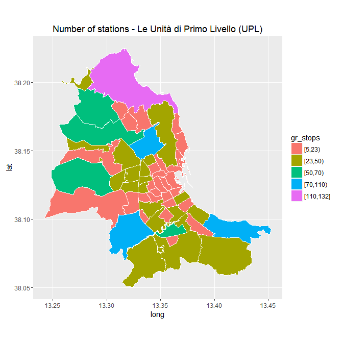
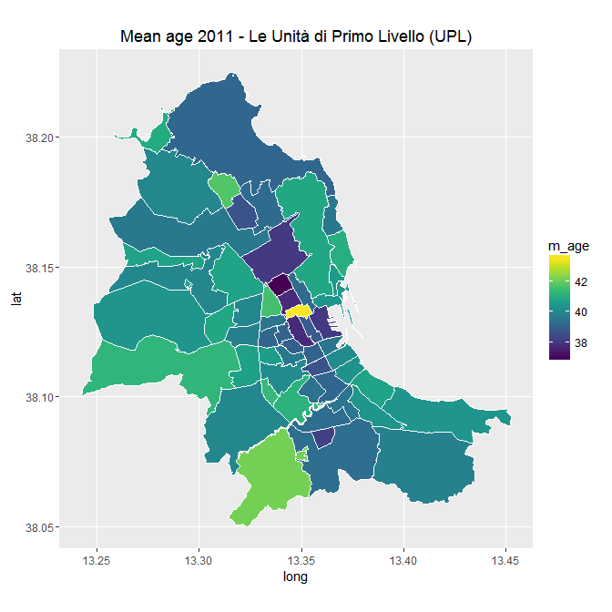
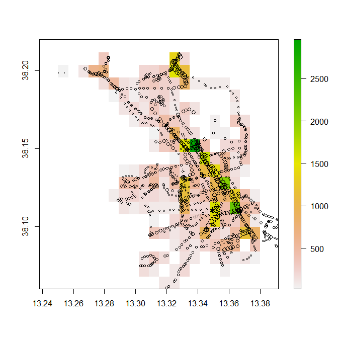
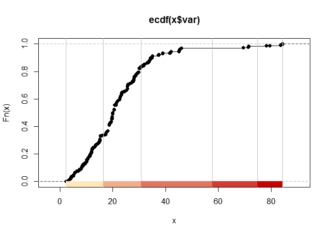
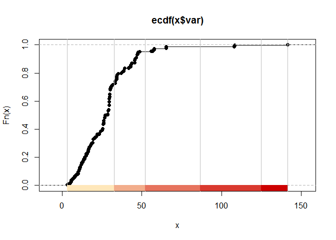
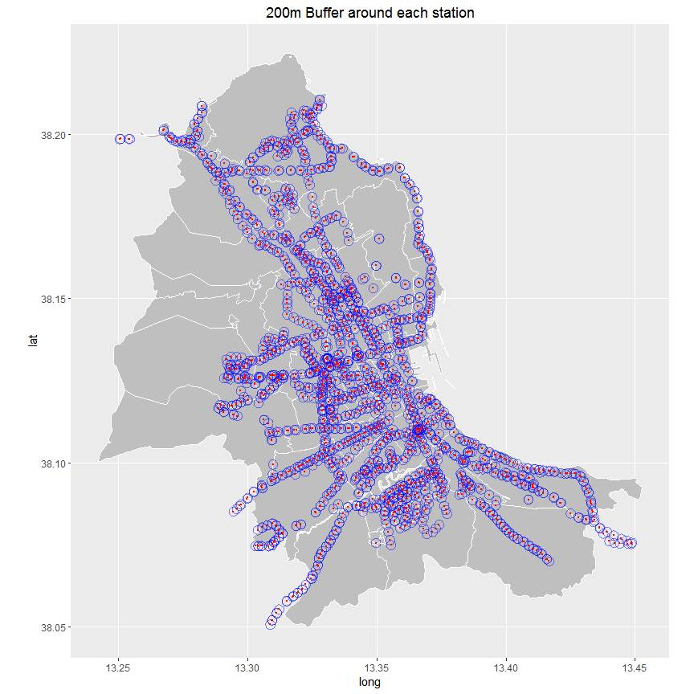
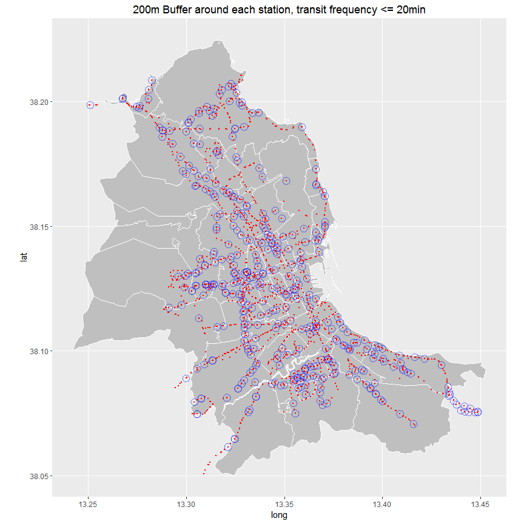

# GTFS Palermo
Patrick Hausmann  


# Load some libraries


```r
library('broom')
library('classInt')
library('dplyr')
library('ggplot2')
library('gplots')
library('gtfsr')
library('httr')
library('leaflet')
library('maptools')
library('rbokeh')
library('readr')
library('rgdal')
library('rgeos')
library('sp')
library('tidyr')
library('viridis')
library('tigris')
```


```r
amat_url <- "https://github.com/openamat/Official-Data/blob/master/amat_feed_gtfs.zip?raw=true"

cl_int <- function(x) { classIntervals(x, n = 5, style = "hclust", method = "complete") }

set_date <- function(x) { as.POSIXct(paste("2016/08/01", x), tz = "CET") }

arr_t_diff <- function(x) { round(as.numeric(difftime(x, lag(x), units = "mins")), 1) }

map_upl <- function(upl, df) {
  
  brks <- print(round(cl_int(df$n_stops)$brks, 0))
  
  gg_dat <- left_join(upl, df, by=c('id'='UPL')) %>%
            mutate(gr_stops = cut(n_stops,
                                  breaks = brks,
                                  right = FALSE, 
                                  include.lowest = TRUE))

  ggplot(gg_dat) +
       aes(long, lat, group=group, fill =  gr_stops) + 
       geom_polygon() +
       geom_path(color = "white") +
       coord_map() +
       #scale_fill_viridis() + 
       ggtitle("Number of stations - Le Unità di Primo Livello (UPL)")

}

map_buf <- function(dat_poly, dat_path, dat_point, title = NULL) {
  
  gg <- ggplot() + 
         geom_polygon(data = dat_poly, aes(x=long, y=lat, group=group), 
                      fill = "grey75", color = "white") +  
         geom_path(data = dat_path, aes(x=long, y=lat, group=group), 
                      color = "blue", alpha = 0.5) + 
         geom_point(data = dat_point, aes(x=longitude, y=latitude), 
                      color="red", size = 0.2) + 
         coord_map() + 
         ggtitle(title)

  return(gg)

}
```

# Import the GTFS file


```r
load_amat <- function(x) {
  
  if (!dir.exists("amat_gtfs")) {
    dir.create("amat_gtfs")
  }
  
  if (!file.exists(file.path("amat_gtfs", "amat.rdata"))) {
    
    message("AMAT GTFS file does not exist locally.\nStart download from GitHub 'openamat/Official-Data'")
      z <- httr::GET(x, write_disk(file.path("amat_gtfs", "amat_feed_gtfs.zip")))
      stop_for_status(z)
      amat <- import_gtfs(file.path("amat_gtfs", "amat_feed_gtfs.zip"), local = TRUE)
      save(amat, file = file.path("amat_gtfs", "amat.rdata"))
      return(amat)
    
  } else {
    message("Load local AMAT GTFS file")
      load("amat_gtfs/amat.rdata")
      return(amat)
  }
}  

amat <- load_amat(amat_url)
```

```
## Load local AMAT GTFS file
```

# Match UPL


```r
match_UPL <- function(stop_df, shp) {

    s_df <- tbl_df(stop_df) %>%
                rename(longitude = stop_lon, 
                       latitude  = stop_lat) %>%
                as.data.frame()

    coordinates(s_df) <- ~longitude+latitude
    proj4string(s_df) <- CRS("+proj=longlat +datum=WGS84 +no_defs +ellps=WGS84 +towgs84=0,0,0")
    out <- over(s_df, shp, fn = NULL)
    return(out)
}

pmo <- readOGR(dsn = "../dati/comunePalermo/UPL", 
               layer = "UPL",
               stringsAsFactors = FALSE, 
               verbose = FALSE)

proj4string(pmo)
```

```
## [1] "+proj=longlat +datum=WGS84 +no_defs +ellps=WGS84 +towgs84=0,0,0"
```

```r
z <- match_UPL(amat$stops_df, pmo)

amat$upl <- tbl_df(cbind(stop_id = amat$stops_df$stop_id, z))

# Number of stops
uplstops <- amat$upl %>% 
              mutate(UPL = as.numeric(UPL)) %>% 
              group_by(UPL, nome) %>% 
              summarise(n_stops = n()) %>%
              arrange(desc(n_stops))

knitr::kable(head(uplstops))
```


| UPL|nome                                      | n_stops|
|---:|:-----------------------------------------|-------:|
|  50|Partanna Mondello                         |     132|
|  20|Mezzomonreale                             |      87|
|   7|Roccella Acqua dei Corsari                |      81|
|  43|Resuttana                                 |      79|
|  44|San Lorenzo                               |      61|
|  48|Tommaso Natale - Sant'Ambrogio - Cardillo |      56|

```r
# geoDF for ggplot
pmom <- broom::tidy(pmo, region = "UPL")
pmom$id <- as.numeric(pmom$id)
```

# Number of stations per UPL


```r
map_upl(pmom, uplstops)
```

```
## [1]   5  23  50  70 110 132
```

<!-- -->

## with `leaflet`


```r
# from Zev Ross - http://bit.ly/2aJ1yxJ 
pmo_stops <- tigris::geo_join(pmo, uplstops, "UPL", "UPL")

popup <- paste0("UDL nome: ", pmo_stops$nome, "<br>",
                "No of stations: ", round(pmo_stops$n_stops, 0))

pal <- colorNumeric(
  palette = viridis(12),
  domain = pmo_stops$n_stops
)

leaflet() %>%
  addProviderTiles("CartoDB.Positron") %>%
  addPolygons(data = pmo_stops,
              fillColor = ~pal(n_stops),
              color = "#b2aeae",
              fillOpacity = 0.7,
              weight = 1, 
              smoothFactor = 0.2,
              popup = popup) %>%
  addLegend(pal = pal, 
            values = pmo_stops$n_stops,
            position = "bottomright", 
            title = "No of stations",
            labFormat = labelFormat(suffix = ""))
```

<!--html_preserve--><div id="htmlwidget-f316835dff45cfd5fd2d" style="width:672px;height:672px;" class="leaflet html-widget"></div>
<script type="application/json" data-for="htmlwidget-f316835dff45cfd5fd2d">{"x":{"calls":[{"method":"addProviderTiles","args":["CartoDB.Positron",null,null,{"errorTileUrl":"","noWrap":false,"zIndex":null,"unloadInvisibleTiles":null,"updateWhenIdle":null,"detectRetina":false,"reuseTiles":false}]},{"method":"addPolygons","args":[[[{"lng":[13.3700989495343,13.3700249763761,13.3698679323617,13.3695883482027,13.3687625369069,13.368332705542,13.3680792738256,13.3674920363614,13.3670632915703,13.3668445128327,13.3668228007141,13.366696364856,13.3664652019742,13.3660949440125,13.3660279369714,13.3653428435892,13.3647505066086,13.3645838865933,13.3646023501158,13.3644826249871,13.3643744278052,13.3642144013783,13.3641345457274,13.3641100995688,13.3640721380346,13.3639629323573,13.3639600277157,13.3640116931667,13.364079365183,13.3640175236312,13.3639857066271,13.3639664459424,13.3639590444621,13.3640630105705,13.3641076791139,13.3641970696044,13.3642885595546,13.3648651109224,13.3649818696972,13.3652277496741,13.3652184811601,13.3655168492642,13.3658396575039,13.3659366857352,13.3660233349439,13.3660150046645,13.3659042159678,13.3656441765854,13.3650937663854,13.3646993655147,13.3644619332606,13.3639082429241,13.3636058743527,13.3635479158263,13.3633874061588,13.3633150108287,13.3631280305117,13.3628233869352,13.3628632191489,13.362881418855,13.3628859056851,13.3628894960404,13.362922438097,13.3628961748536,13.3628427679722,13.3626898853026,13.3625451882626,13.3624458280634,13.3621927723724,13.3658044400409,13.3661979919303,13.3667014077402,13.3675705065637,13.3682299767723,13.3680844409274,13.3695948842181,13.3697106357372,13.370595219992,13.3707951901199,13.3709242702691,13.371090499315,13.3712378329493,13.3715110908095,13.3715167579625,13.3717179368341,13.3717594942337,13.3718234164009,13.3718501912256,13.3719093852395,13.3721108551438,13.3722943909309,13.3722805469748,13.372339097499,13.3723988287875,13.3725238309204,13.3726625092947,13.3727459706168,13.3728796850572,13.3729589420525,13.3730365242771,13.373153914221,13.3732111442711,13.3732032618519,13.3731141103693,13.3732285710173,13.3734048391351,13.3736984928696,13.3739960157698,13.3741918939382,13.3743335018501,13.3744626188227,13.3743503685521,13.3743210110572,13.3744277614229,13.3744202430319,13.3745583429253,13.3745712000216,13.3745634205794,13.3748330981195,13.3749446023267,13.3751562411253,13.3755012280417,13.3758116548449,13.3760887121437,13.3764586139242,13.3766415937696,13.37643306895,13.3759127572707,13.3757120451349,13.3761909188024,13.376298159463,13.3761845056585,13.3762180350172,13.3754905442349,13.375288066369,13.3751453967482,13.3753240469011,13.3746149192689,13.3745454318568,13.3742397550971,13.3740943525131,13.3743878729015,13.3744241104011,13.3742824347378,13.374307501158,13.3738266508403,13.3737916551559,13.3739253875943,13.3734341283238,13.3734271792528,13.373243318791,13.3732341374665,13.3729093510479,13.3727701718104,13.3727602457338,13.372793500503,13.3726039545038,13.3724276243209,13.3723358035745,13.3722796038787,13.3721650828043,13.372079055418,13.3719619307093,13.3718296173886,13.3718764341865,13.3718515842271,13.3717807483084,13.3717990508759,13.3717274087962,13.3717499074698,13.3717269028176,13.3716123869985,13.3715423144272,13.371559504184,13.3700989495343],"lat":[38.1464613193274,38.146241684579,38.146247244211,38.1465496133779,38.1475413972531,38.1482556886853,38.1486531418828,38.1492538648808,38.1496834931928,38.1499024625631,38.1499714405889,38.1503417541418,38.1505835839216,38.1507343663475,38.1506910808484,38.151192459439,38.1515723681906,38.1516994240892,38.1518290696962,38.1520889914058,38.1524700185411,38.1529403307474,38.1533273851479,38.1534648805528,38.153571228013,38.1539972422917,38.1541265955191,38.1543635905165,38.1545220411909,38.1547405748567,38.1548892090367,38.155113959664,38.155445767074,38.1558916235046,38.156122903157,38.1562647749557,38.1563138812211,38.1566425562844,38.1568354597363,38.156985133474,38.1570806372383,38.1571129264333,38.1573255649471,38.1574450527937,38.1577106618732,38.15776398363,38.1579424526875,38.1581076111859,38.1582012068275,38.1583250874934,38.1584342880554,38.1586741035042,38.1588217796062,38.1588659735449,38.1590381387199,38.1590905614006,38.1591723347132,38.1594212468508,38.1595511853094,38.1596920737112,38.1598102684883,38.1599678400795,38.1600864329494,38.1603054674372,38.1604650497324,38.1606147960967,38.1610346972661,38.1613370943816,38.1618257892091,38.1624847363429,38.1625570453351,38.162659697746,38.1630499843183,38.1632783267356,38.1635860281185,38.1640002617971,38.163779807606,38.1640801091923,38.1639451793213,38.1637909982622,38.1635806316763,38.1634125257443,38.1632319949177,38.1629768552631,38.1628094892974,38.1625548555245,38.1621020071534,38.1617053632259,38.161465159926,38.1612836164413,38.1611018382691,38.1609173138587,38.1607054476326,38.1604106258011,38.1601450957928,38.1597809826636,38.1595618600164,38.1591921218503,38.158920716464,38.1587235957191,38.15861786142,38.1583956957947,38.158279989034,38.1580557778766,38.1576114466181,38.1572092618646,38.156701341366,38.1560200594791,38.155675944362,38.1554219110315,38.1552585395353,38.1551331154819,38.1550418752719,38.1549442652262,38.1548120183265,38.1547148422937,38.1546076769146,38.1544827718342,38.1541123563244,38.1539506008646,38.1536634997622,38.1533173774528,38.1530124595132,38.1527171048026,38.1523659176192,38.1522217816021,38.1495028626193,38.1487244487248,38.1488446022013,38.1495777516963,38.1511216701478,38.1511424577805,38.1521823887667,38.1524517658695,38.1520130464972,38.1520669553275,38.1516670586372,38.1504724655985,38.1497785203831,38.1495283953204,38.1497052117419,38.1498657606448,38.1507827848278,38.1507920010989,38.150937647648,38.1509309846666,38.1505951890428,38.150306441573,38.1501319833586,38.1498077401732,38.1498051923584,38.1502186292222,38.150191771314,38.1500892435425,38.1498990952138,38.1496760174405,38.1492933630786,38.1490656326761,38.1489148569728,38.1487609459293,38.148547325595,38.1483930138399,38.1482971521237,38.1482128678963,38.1481192840885,38.1478951266701,38.1477292360322,38.1475763631395,38.147445806542,38.1471045280773,38.1467979440407,38.1465843237302,38.1463831193106,38.1461346692214,38.1464613193274]}],[{"lng":[13.3470438636352,13.346554380003,13.346116068907,13.345712072752,13.3453042510011,13.3450382054524,13.3446408886666,13.3445684877343,13.343241240074,13.3435928524152,13.3437225355575,13.3438359787835,13.3439309879763,13.3440791324555,13.3457381006883,13.3463613215286,13.3466252390251,13.3468537852875,13.3472213149334,13.3471011981778,13.347393607662,13.3471313050043,13.3470987701882,13.347422685965,13.3475779975832,13.3477499354708,13.3479744720663,13.3481000060392,13.3482580731735,13.3486399390573,13.3491016822284,13.3505868625549,13.3507486556834,13.3508385169974,13.3510262610137,13.3511260765007,13.3512045492898,13.3513176802174,13.3513590229148,13.3514616530598,13.3515509488599,13.3515628479409,13.3518448824576,13.3521933042354,13.3522566969971,13.3523799500174,13.3526370470351,13.3528963080564,13.3532939440574,13.3535129830635,13.3538038784301,13.3539436063601,13.3543425479751,13.3543633342716,13.3544760946907,13.3546428812509,13.3546516710851,13.3547104433631,13.354788838085,13.3549564150692,13.3553081774852,13.3555800175529,13.3552517236743,13.3556250409842,13.3559155746314,13.3564569980181,13.3575369742805,13.3574336617926,13.3570280810383,13.3564151103237,13.3557323748758,13.3561203390302,13.3553111523295,13.3541044082036,13.3539406320315,13.3534885699665,13.3531339969986,13.3527840354736,13.3523029345642,13.3517814552365,13.3510122482023,13.3504102157116,13.3503513004542,13.3500311954781,13.3495845068129,13.3491590537172,13.3485460507517,13.3478396403554,13.3473922791124,13.3470438636352],"lat":[38.1405051352268,38.1412393070098,38.1419355379377,38.1425494473743,38.1431950018474,38.143695725924,38.1443712676703,38.1444970913174,38.1464813365406,38.1467030432158,38.1467915890107,38.1468690235316,38.1469137190146,38.1470350221156,38.1482148401599,38.1477143010448,38.1474868998228,38.1473301077574,38.1469975076726,38.1468358076775,38.1463421252204,38.1460006563806,38.1459468587586,38.1455514092281,38.1453324791206,38.1453919702426,38.1450323911615,38.1450817791855,38.1451389623105,38.1446204336002,38.1439233053134,38.1445662000465,38.1444701287748,38.1443992474557,38.1442121629242,38.1441048880798,38.1439623643265,38.1437915510898,38.1436954482853,38.143443957013,38.1432199834708,38.1431204729985,38.1427812741914,38.1423720648004,38.1422901577253,38.1421309562182,38.1417566584936,38.1413822799041,38.1408901734316,38.1404632423514,38.1406195528215,38.1404292305327,38.1399235698318,38.1398702480843,38.1395808610876,38.1387550754314,38.1386956137442,38.138297745709,38.1378670355172,38.1375095607515,38.1370731959519,38.1366713038242,38.1364204909904,38.1360752188504,38.1358437659525,38.1354093522303,38.1348873754853,38.1347921466098,38.1344199461204,38.1340599508702,38.1336530007575,38.1321975608568,38.1318808722483,38.1337089701772,38.1339627332717,38.1346414982829,38.1351860318235,38.1357123902471,38.135460066486,38.135200219503,38.1348009704831,38.1356428851514,38.1357666616278,38.136255881424,38.1368938896461,38.1375176079116,38.1384274851973,38.1393723461684,38.1399878691021,38.1405051352268]}],[{"lng":[13.2854288290461,13.2856224503895,13.2863013559134,13.2866460302037,13.2871512025972,13.2878766306218,13.288297525156,13.2882375217848,13.2879938900982,13.2882903235951,13.2887025655705,13.2885510037863,13.2895065023611,13.2894069130225,13.2893775747558,13.2885882011832,13.2881263885057,13.2892774395921,13.2904169715894,13.2919221384693,13.2930423397642,13.2937013026762,13.2943008601349,13.2945757079341,13.2948379496165,13.2954819593929,13.2959603884669,13.2964302657173,13.2966715601635,13.2970474167064,13.2975476547573,13.2975811497145,13.2978110185749,13.2979449100784,13.2980739054859,13.2980163194913,13.2979234432456,13.2978474387783,13.2977137784003,13.2976463055193,13.2975569415673,13.2973857079873,13.2972677287121,13.2970760289662,13.2969003355229,13.2968100800162,13.2967370895898,13.2966584320126,13.2965543220469,13.2963777755632,13.2961574080438,13.2963800596785,13.2965206913309,13.2967257194399,13.297075649864,13.2973601956378,13.2977101247949,13.2979485977283,13.2980792723316,13.298399301155,13.2986560914124,13.298879515601,13.2990595416682,13.2992427485855,13.2995135683301,13.2998431898197,13.3000181669995,13.3001540386324,13.300366722169,13.3005890632532,13.3010288905547,13.3012809563927,13.3014839445087,13.3016004098315,13.3017557953379,13.3019418269389,13.3021747337208,13.3023431736476,13.3025116128164,13.3026817749134,13.3027907159745,13.3029451312615,13.3031299040885,13.3032787218065,13.3034583095524,13.3035513083956,13.3037098896132,13.3038953553684,13.3041811223066,13.3043979781412,13.30463629234,13.304857437378,13.3050740220988,13.3052424121977,13.3055348668113,13.3056604811643,13.3058548053565,13.3063310469226,13.3065327475716,13.3067592587747,13.306969106619,13.3068579455097,13.3066325160007,13.3064708360865,13.3062182136547,13.3060540622276,13.3059127192399,13.3057970266808,13.3055376531352,13.3054312196138,13.3053603443763,13.3050976835153,13.3049446925112,13.3048373386612,13.3046203443246,13.3044648976188,13.3043212207905,13.304252661815,13.3042468343764,13.3042369625555,13.3042240543543,13.3043037456231,13.3043911037424,13.3044247906976,13.3044895599043,13.3045641180599,13.304662216186,13.3047625383094,13.3049469798614,13.3050808092429,13.3052019355223,13.3055882727545,13.3058572492017,13.3061465942396,13.3065234981935,13.3069910439512,13.3071384167001,13.3074443873716,13.3075341638091,13.307667620913,13.3078048867772,13.3079924404227,13.308558300293,13.3088399418852,13.3089144077116,13.3090629299562,13.3095286922651,13.3097262184306,13.3106607277922,13.3107409715638,13.3107683497009,13.3108832382556,13.310927229688,13.3110063889731,13.3110675640817,13.3111047815599,13.3114993993307,13.3117056371483,13.3118798620699,13.3119873967065,13.311689217563,13.3109576730329,13.3105124568535,13.3097555712707,13.3092898269616,13.3090803368204,13.3085099365851,13.3083047145195,13.307971646475,13.3070422831723,13.3061912179214,13.3060662798057,13.3058278261274,13.3056001472807,13.3054374816905,13.3053769745138,13.30513041799,13.3049098440684,13.3046817011465,13.3044749161098,13.3041350387515,13.3040008608136,13.3037010921544,13.3031035945958,13.3030706258846,13.3017664166657,13.3014288730835,13.3011422150599,13.3007334812338,13.3005072079656,13.3003625019954,13.3001927178925,13.3000393663024,13.299804501531,13.2996888619811,13.2993836131724,13.2992079754256,13.2991201790564,13.2988007269379,13.2985243880319,13.297748255486,13.2979068949095,13.2974174719866,13.2973173218526,13.2971845472605,13.2970222356811,13.2967758732439,13.2965573305937,13.296460881341,13.2963576886934,13.2960745307947,13.2959222442078,13.2957304333803,13.2956213748571,13.2949269284824,13.2946758936694,13.2945359771134,13.2942288730214,13.294173313104,13.2939212820766,13.2936676971984,13.2934161499215,13.293192382822,13.2929979226773,13.292579718516,13.2924943399703,13.2920200644383,13.2917978238512,13.2913518373509,13.2910730175371,13.2909053162186,13.2908487347507,13.2906815680081,13.2902093305959,13.2900421385527,13.2898482120718,13.2896269922414,13.2896810210334,13.2895591284293,13.2893518507752,13.2890910749737,13.2778614053135,13.2715747324911,13.2715960330616,13.2709255146073,13.2706028867939,13.2703330855759,13.2702044716228,13.2698865431346,13.2697203944077,13.2694691184301,13.2694880010759,13.2695248460419,13.2705750402549,13.271475931862,13.2721256017057,13.2728285122002,13.27343767558,13.2739113415054,13.2746657418348,13.2752954620331,13.2759871791707,13.2756901969266,13.2752467649252,13.2749011959767,13.2744545018778,13.2740955825979,13.273809115707,13.2738574220686,13.2738710631242,13.2741469390548,13.2739103645852,13.2737883713413,13.2734175573582,13.2732299003644,13.272884786637,13.27245821919,13.2729230950301,13.2733966714721,13.2737457535043,13.2739517602642,13.2742620829253,13.2741855568594,13.2738158425937,13.2737195130873,13.2734455010456,13.2733498607317,13.2731042356819,13.2733176385373,13.2732172083088,13.2729428585031,13.2726124444945,13.2723225472828,13.2725203947923,13.2729562322593,13.2732490500949,13.2736124661232,13.2738720173206,13.2741436750452,13.2744114156727,13.2747310308855,13.2748877293743,13.2751195254963,13.2753792737005,13.2756240687504,13.2757252578001,13.2758797424281,13.2762620337739,13.2765752035197,13.2767861991497,13.2768906028449,13.2771226062296,13.277384706427,13.2776130741231,13.2778184818901,13.2779983483602,13.2781568743205,13.2782969484434,13.2786117986986,13.2788271098947,13.2791785494261,13.2792941852188,13.2796107471454,13.27985271812,13.2800213748037,13.2802493335172,13.2805116582385,13.2808432026478,13.2811156359733,13.2812284222334,13.2812936254336,13.28206500651,13.2830563705449,13.2838107266817,13.2843693727995,13.2851075129702,13.2852193980243,13.2854288290461],"lat":[38.1939876047115,38.1941612157984,38.1945126925416,38.1946662420913,38.194799844643,38.194773304084,38.1947255353654,38.1948815721095,38.1951267046927,38.1956045843317,38.1954184440709,38.1951226094835,38.1946966580897,38.194407066909,38.1943935645356,38.193328314032,38.1925493481627,38.1920315172273,38.1932138792208,38.1928496751312,38.1924427424976,38.1920365045647,38.1917556179152,38.1920789100397,38.1921346890235,38.1919658460745,38.1916312148017,38.1912593577176,38.1910029746343,38.1910306960026,38.1917804925836,38.1919591806698,38.1921926988139,38.1917928905921,38.1916215432681,38.1915155831227,38.1913433528562,38.1912155463497,38.1909682632195,38.1908761680379,38.1907758744454,38.1905930144937,38.1904667467428,38.1902756356203,38.1901019395594,38.1900106791697,38.1899097845692,38.1898090976919,38.1896643003777,38.1894276069527,38.1891249543636,38.189175337332,38.1892017054469,38.1892437137969,38.1893119515466,38.1893600640703,38.189428281022,38.1894690796191,38.18949581009,38.1896011458771,38.1896862966389,38.1897501490149,38.1898156109673,38.1898989591051,38.1900286187173,38.1901876422026,38.1903613599465,38.1905004699792,38.1907088270129,38.1910203998115,38.1908466435366,38.1907428228507,38.1905274819912,38.1904023638668,38.1902435457242,38.1900475781249,38.1898003634792,38.1896208024935,38.1894412422093,38.1892548572438,38.1891427864104,38.1889795009478,38.188774576677,38.1886249989138,38.1884292656694,38.1883493024111,38.1882083847337,38.1880394572712,38.187781278483,38.187588675702,38.1873727815755,38.1871800204444,38.1870189501558,38.1868506479318,38.1867183125008,38.1866596711191,38.186580465127,38.1863963506803,38.1863213920131,38.1862320195958,38.1862107872773,38.1858635255431,38.185313137244,38.1848149484919,38.1845035394465,38.1843845665955,38.1842006209887,38.1841013010541,38.183863146183,38.1837634857091,38.1836985422659,38.1836586469825,38.1836282424553,38.1836096640124,38.1835095631636,38.183425203645,38.1832863851087,38.1832123367554,38.1831134808057,38.1829337236727,38.1827270386593,38.1825304716505,38.1823066016402,38.182188292211,38.1819562317251,38.1816968074169,38.1812924239896,38.181131123257,38.1808361398761,38.180687110711,38.1805160443297,38.1802226446847,38.1800191238217,38.1798103534481,38.1795263174772,38.179171384359,38.1789858490217,38.1787809651638,38.1787191206066,38.1786241468501,38.1785335335144,38.1784005477107,38.1782131304035,38.1778740441749,38.1777947394375,38.1776046599075,38.1770381404259,38.1767966954266,38.175654538961,38.1753588598583,38.175276398924,38.1749303258109,38.1747936137241,38.1745520386399,38.1743561305333,38.1742376895745,38.1737593289578,38.173508577344,38.1732950084169,38.1731628942381,38.1731963672537,38.172748013081,38.1724896994649,38.1720491863499,38.1717691009684,38.1716507106349,38.1713249246284,38.1712063759512,38.1710114581155,38.1704872158047,38.1699961135531,38.1701267958122,38.1703877223303,38.1706257677969,38.1707938596013,38.1708681289815,38.1711248701524,38.1713626344855,38.1716051778733,38.1718109121689,38.1721296236348,38.1722606431263,38.1725463397147,38.1722334933372,38.1717884722158,38.171085691811,38.1705613184765,38.1704201613886,38.170223498337,38.1701102274586,38.1700457944286,38.1699641492833,38.1699493195371,38.1698091365473,38.1696621262426,38.1691922483706,38.1693632420419,38.1694487289526,38.1692218167791,38.1690040944551,38.1684029569559,38.1680974949449,38.1675260713872,38.1673991498679,38.1672148780776,38.1670857336549,38.1669821927593,38.1668550908865,38.1667910788149,38.1667093115199,38.1666836473813,38.1666073311668,38.1664520409584,38.166362666655,38.166352569441,38.166392829135,38.1664346985883,38.1664960847583,38.1664952795083,38.1665794189496,38.1667293735086,38.1667915622804,38.1668541722905,38.1668513340949,38.1669111035794,38.1669976589304,38.1670785709945,38.1670753267843,38.1671346888073,38.1671745386324,38.1672159817023,38.1672590571709,38.1672785862793,38.1672717086388,38.1672912188473,38.1672664428941,38.1672193122887,38.1672859525501,38.1677451309915,38.1682908447095,38.1687479843014,38.1702199709972,38.1770280706768,38.1771849111306,38.1780109350773,38.1786396389723,38.1794285545815,38.1800096642243,38.1809264079533,38.1816710019434,38.182630360465,38.183282645431,38.1836685861147,38.1836753681786,38.1837145867917,38.1837629559552,38.1839895199293,38.1842960459091,38.184517459911,38.1849898020841,38.1854036591514,38.1860719388571,38.1865421041619,38.1869590655406,38.1871112849665,38.1871681028109,38.1873478104221,38.1878761343354,38.1881040565102,38.188166605298,38.1885663306434,38.189026582692,38.1892639179396,38.1894845619727,38.1895961234036,38.1898012245082,38.1899834127204,38.1906509593364,38.1908453542787,38.1910577899429,38.1915186089612,38.1919215960074,38.1922711447912,38.1924377439568,38.1926438991232,38.1931537649626,38.1932683317949,38.1935624930011,38.1936988263107,38.1941032723092,38.1945951281154,38.1955303554719,38.1959811455885,38.1958883816022,38.195705872488,38.1955781033665,38.1955108250567,38.1954608155457,38.1954103837338,38.1953780965595,38.1953304138791,38.1953021760249,38.1952531960349,38.1951941937459,38.1951357184312,38.1951095046794,38.1950678435965,38.1949458225723,38.1948488257284,38.1947735781575,38.1947292437211,38.1946352075853,38.1945310713064,38.194423665141,38.1943260978347,38.1942429832432,38.1941606474358,38.1940924877197,38.1938783322388,38.1937308753201,38.1934838783051,38.1933760657316,38.1935806685352,38.1938205506353,38.1940521352537,38.1942296109171,38.1944259182422,38.194641553618,38.1949021602042,38.1948840400924,38.1948878924088,38.1949334171719,38.1948068432216,38.1947510494626,38.1946107127894,38.194042313684,38.1940885053074,38.1939876047115]}],[{"lng":[13.2491372862945,13.2490375512682,13.2489322304787,13.2483200748445,13.2482282743158,13.2483270500053,13.2483827286037,13.2483589718538,13.2487944912358,13.2498958507012,13.2507824968426,13.2514451504342,13.2518762063451,13.2523036922635,13.2523487053162,13.2529286286622,13.2537505185105,13.2543323201629,13.2547444225047,13.2626636255777,13.2730321989382,13.2856257784753,13.2889863068192,13.2940807035629,13.2948632052529,13.2949205286981,13.2953696941011,13.2957794259958,13.295963305919,13.2959843078821,13.296098874519,13.2961996799204,13.2962858549649,13.2965452212659,13.2970330225129,13.2972467224837,13.2973757077388,13.2974921616465,13.2975507962504,13.2978764789554,13.297962658454,13.2980928911043,13.2992569674584,13.302345513715,13.3025537284058,13.3028664085138,13.3030187656849,13.3031497366401,13.3032819930547,13.3034645534075,13.3037095792927,13.3040524405386,13.3047077160365,13.3051899905594,13.3052703348473,13.3064404737379,13.3051872405708,13.3038921434579,13.3034853866872,13.3032389897577,13.3031966238317,13.3031576997954,13.3030070738961,13.3024734324323,13.3024078933506,13.3023434195428,13.302621996947,13.3030337553058,13.3061614443077,13.3057076256509,13.3055816776699,13.3048831289896,13.3035316393407,13.3013642832782,13.3011296563175,13.2999318445052,13.2994237610493,13.2983496458021,13.2976201533624,13.2971794164588,13.2971306611878,13.2955397525671,13.2925920711948,13.2930086522948,13.2927777565268,13.2924249954583,13.2921723167,13.2917780057721,13.2914153584666,13.2909705980152,13.2907386332186,13.2902030274984,13.2896803430159,13.2892048087859,13.2886723074598,13.2882226079454,13.2892244847407,13.2894044622132,13.2903395678611,13.2900804194831,13.2897938183182,13.2896082369163,13.2895234654729,13.2893427255685,13.2892428875129,13.2891551370841,13.2890783711896,13.2889226013626,13.2884725847129,13.2882275234769,13.2881517686982,13.2877403795698,13.2873665626257,13.2870639074934,13.286671072431,13.2865493611925,13.2864269453373,13.2862832578814,13.2860395412659,13.2817800821346,13.2801951008231,13.2794673978704,13.2781786921697,13.2771025112761,13.2766805962906,13.276344814845,13.2751967861744,13.2746034225487,13.2739650319502,13.2729086975662,13.2720665032965,13.27131045153,13.2705536230139,13.2698861102234,13.2697700506981,13.2696161179583,13.2692030119958,13.2687516243331,13.2665267671723,13.2650682266424,13.2638640693701,13.2629206981612,13.256054408118,13.2526392133033,13.2526548600821,13.251975962748,13.2514812961397,13.2509377703649,13.2503202941798,13.2500391481688,13.2497662931222,13.2491372862945],"lat":[38.1293495296486,38.1294677650031,38.1295931765825,38.1304034517961,38.1313749951942,38.1324747300105,38.1334949764877,38.1349999592076,38.1358353198005,38.1360475956636,38.1361955772817,38.136621886021,38.1372322292141,38.1378971338876,38.1379671631841,38.1385270585934,38.138970080566,38.1392552070656,38.1394563444575,38.1418447035256,38.1450706015693,38.1411066458963,38.1411337049528,38.1411809683083,38.1411372018465,38.1411376462861,38.141152343973,38.141217989439,38.1399671843112,38.1398440973491,38.139344771841,38.1392540708971,38.1391923667693,38.1391062955265,38.1389172997753,38.1386482794436,38.1384904364271,38.13833755229,38.1382678564736,38.1378911592449,38.1377934301902,38.1376445409804,38.1362298147938,38.1326699538079,38.132255499547,38.1320790303054,38.1320644378005,38.1320010848936,38.1320322553608,38.1320705805172,38.1321291334738,38.1322771530297,38.1321240159337,38.1320561367598,38.1320448312548,38.1318622450631,38.1313170714718,38.1307624506712,38.130619764019,38.1304171458783,38.130193537575,38.1299923247404,38.129272817056,38.1266940080887,38.125773237032,38.1250730705703,38.1244819458552,38.1240075075098,38.1204195605844,38.1200991168158,38.1200061643189,38.1197429375446,38.1194601398368,38.1190035076899,38.1189467063408,38.1186566613065,38.118340247207,38.1175239572902,38.1171762322887,38.1170223350332,38.1171622232823,38.1167013066679,38.1169426431849,38.1173249679617,38.1172977473329,38.1173164886245,38.1173605444076,38.117434389349,38.1174450232249,38.11738915851,38.1174038437629,38.1174216696179,38.117580719531,38.1178045194414,38.1180128596389,38.1182253991585,38.1182079785877,38.1181511862267,38.1179717558647,38.1181417130939,38.118344418749,38.1185326745211,38.1187144395814,38.1191255611315,38.1195219552168,38.1198309924212,38.1201003932026,38.1203050069973,38.1206087737953,38.1207563727663,38.1207824944954,38.1209243139688,38.1209825279312,38.1210099366724,38.1210201287414,38.1210581303277,38.1211279581058,38.1212452121703,38.1214226568029,38.1228784588763,38.1231251323655,38.123215679945,38.1235678682682,38.1239568927151,38.1237482961406,38.1235072285133,38.1233217108125,38.123144314593,38.123067462063,38.1226134046684,38.1221287384866,38.1216115989704,38.1211281638869,38.1204773799973,38.1199696654176,38.1192589702219,38.1186794148247,38.117913733412,38.1181507878236,38.1184666037056,38.11885361183,38.1190420785258,38.120627026978,38.1222531493921,38.1222933841501,38.1239031927702,38.1250784880645,38.1258547640144,38.1268543663838,38.1277066789769,38.128603734871,38.1293495296486]}],[{"lng":[13.3680594864888,13.3678027031534,13.3676283133065,13.3675650700056,13.367328564665,13.3672532264346,13.367187836152,13.3669775390378,13.3668302558121,13.3669534785236,13.3673168184925,13.3674593166439,13.3675551301022,13.3677071381609,13.3676977158438,13.367121565145,13.3662590835868,13.3660905361055,13.3656949255102,13.3652207404872,13.3651000382299,13.3649944580664,13.3655746022574,13.3653765931498,13.365360426878,13.3653324012593,13.3651515458439,13.3646934969933,13.364552490908,13.3636108742427,13.3634148474058,13.3634240295876,13.3634693760837,13.3635537169206,13.3636815346306,13.3636924132483,13.3637645210397,13.3639449488663,13.3639495873729,13.3643893263828,13.3652485384682,13.3657425382429,13.3660279369714,13.3660949440125,13.3664652019742,13.366696364856,13.3668228007141,13.3668445128327,13.3670632915703,13.3674920363614,13.3680792738256,13.368332705542,13.3687625369069,13.3695883482027,13.3698679323617,13.3700249763761,13.3700989495343,13.371559504184,13.3714448126659,13.3714032301862,13.3718100720232,13.3729270623059,13.3731882612376,13.3733291836917,13.3732426525272,13.3728397475609,13.3713459745517,13.3712024424458,13.3711755200067,13.3710738233158,13.3711057266252,13.3711969846144,13.3710798438314,13.3710045380714,13.3709765563909,13.3708887136486,13.3708610088336,13.3707287021747,13.3706262227234,13.3705979877216,13.3704633291054,13.3703962601283,13.3701533835822,13.3700290240964,13.3696564801151,13.3693598289466,13.3690838381347,13.3687163647673,13.3683831588579,13.3682431031093,13.3680594864888],"lat":[38.1444658771693,38.1441647195219,38.1439775807293,38.1438853691309,38.1435654520188,38.1434736908129,38.1433455172626,38.1424257126403,38.1417737254208,38.1415574784157,38.1409225108248,38.140647000237,38.1404137718245,38.1399037652717,38.1389944616864,38.1388943353885,38.1387373243829,38.1387075777823,38.1386232419336,38.1385238284462,38.1388660520616,38.139162687832,38.1392221517385,38.1403823416596,38.1404820120107,38.1406451695157,38.1413772379402,38.1432312733719,38.1441603994283,38.1440183615266,38.1440156238836,38.1443412798778,38.1448979986041,38.1459170846057,38.1474614172319,38.1476256534282,38.1486967116922,38.1498473121145,38.1502392077972,38.1510526942721,38.1507225791194,38.1505066906538,38.1506910808484,38.1507343663475,38.1505835839216,38.1503417541418,38.1499714405889,38.1499024625631,38.1496834931928,38.1492538648808,38.1486531418828,38.1482556886853,38.1475413972531,38.1465496133779,38.146247244211,38.146241684579,38.1464613193274,38.1461346692214,38.1460754954057,38.1459335809977,38.1457389757013,38.1451183806473,38.1447686219219,38.1444643159993,38.1443335592056,38.1450229387942,38.1458267795883,38.1455774236791,38.145447467861,38.1453282689505,38.1452344849884,38.1451532997114,38.14505743754,38.1450917307352,38.1450088860975,38.1449369978323,38.1448423751262,38.1447580892069,38.144674204173,38.1446031365865,38.1446248312501,38.1445163660258,38.1447004634922,38.1445908509084,38.1444964100678,38.1444939656338,38.1445988196542,38.1447115827503,38.1447059787005,38.144635407141,38.1444658771693]}],[{"lng":[13.3306655134407,13.3305223434281,13.330333624783,13.3303151620727,13.3301913275451,13.3301052915879,13.329967667926,13.3299194773453,13.3298300373891,13.3285642938013,13.3283876107268,13.3279005636381,13.3274336832068,13.3267279936898,13.3261770219384,13.3259478961941,13.3254986303851,13.3252429100835,13.3243619730066,13.3237253381989,13.3231102134751,13.3227111728518,13.322494451465,13.3212995157118,13.3207769908406,13.3199396547854,13.3197566634345,13.3181915653234,13.3175487836469,13.3172420526867,13.3170345941845,13.316980319175,13.3163056916833,13.3167980155653,13.3180974947956,13.3187715500738,13.3185472019139,13.3183028581593,13.317320526919,13.3164910880393,13.3163103180746,13.3161947435255,13.3168991116045,13.3168505273069,13.3168442965312,13.3166622077263,13.3173230170079,13.3174530628824,13.317793522813,13.3181946165786,13.3186561567154,13.3191074804203,13.3191877367584,13.3191941107605,13.3188993170791,13.3188708907048,13.3187574947218,13.3183469638794,13.3179370527543,13.3172432172296,13.3171321520452,13.317113094178,13.3173396701328,13.3170509277347,13.3173708854833,13.3176870371121,13.318156902521,13.3183699605482,13.3189280961174,13.319124967662,13.3194701254951,13.3209673629514,13.3215197322186,13.3226755551408,13.3235335123626,13.325606709466,13.3261812457411,13.3285944661504,13.3301890306634,13.3305797344795,13.3312232015319,13.3311998779171,13.3311456217413,13.3310889440793,13.3309972140407,13.3309027183697,13.3307637498949,13.3307520419845,13.330704350081,13.3306655134407],"lat":[38.1356488643148,38.1342176158667,38.1330042093844,38.1328607785201,38.1317440446768,38.1310492158548,38.1300726029904,38.129691606016,38.1287004503026,38.128395156283,38.1283476524373,38.1282215181555,38.1280991560626,38.1279270597368,38.1278167939623,38.1277622048847,38.1276481870142,38.1275900545498,38.1273703817269,38.1272092217396,38.1270725914384,38.1270223943898,38.12701642028,38.1269834748157,38.1269691601673,38.1269462081034,38.1269411999827,38.1268998167386,38.1268649052256,38.1268716979243,38.1268703351884,38.1268686263855,38.1268476256202,38.1270636646802,38.1278309169326,38.1282158915862,38.1282421570794,38.1282556568932,38.1285034918265,38.128709648754,38.129810610839,38.1304338740329,38.1305194264479,38.1312667401338,38.1313625899969,38.1331435718803,38.1331462634415,38.1331279721936,38.1330884125117,38.1330015753256,38.1329125283448,38.1328193553556,38.1328081723282,38.1332732582626,38.1332694901492,38.1338875899092,38.1338690974919,38.1338598523986,38.1338539766915,38.1339351766052,38.134003253018,38.1360721589537,38.1361203876158,38.1364211467724,38.1365534595393,38.1366814308247,38.1368172407154,38.1368777520057,38.1369964005238,38.1370382678602,38.1371021002241,38.1374612296941,38.1375939859713,38.1378801089297,38.1380826367776,38.1385870991159,38.1386801691618,38.139302088334,38.1396022977474,38.1396887067714,38.1398310179124,38.1396525173652,38.1392372165015,38.1388035039323,38.1380728627454,38.1373558260827,38.136320719971,38.1361229945454,38.1358590703936,38.1356488643148]}],[{"lng":[13.329889657454,13.3299607892647,13.3299731229198,13.3299807204962,13.3300221129502,13.3300477555892,13.3300862196285,13.3301598107769,13.3301628529433,13.3302092404812,13.3302270509552,13.3300557464985,13.3294669049682,13.3290766796858,13.3288148203965,13.3282450274388,13.328180620915,13.327951597087,13.3280540516566,13.3280476763004,13.3278495604917,13.3275960198113,13.3273433779706,13.3272425778221,13.3267527707641,13.3261990728735,13.3257906498129,13.3252465487111,13.3247015384843,13.3243946350659,13.324201133491,13.3236167515808,13.3234741598746,13.3230737205426,13.3225736539661,13.3225006598821,13.3223478116189,13.3217996048532,13.3214137369613,13.321257615714,13.3211526256895,13.320961382255,13.3208411655552,13.3204042937714,13.319754272634,13.3195063953568,13.3194458011644,13.3188805781808,13.3179022523699,13.3175950804125,13.3170465203899,13.3165079266342,13.3154702991408,13.3156184970415,13.3167448217999,13.3168410894857,13.3157517320165,13.3165759594605,13.3162667182951,13.3161762052953,13.3155959943143,13.3148923339822,13.3143772628178,13.3147335618128,13.314661975198,13.3154633092059,13.3153992269001,13.3155542024999,13.3161221880853,13.3169742839895,13.3173872701258,13.3183433259459,13.3185346862,13.3186020253674,13.3190670033613,13.3193243010079,13.3194543614504,13.3201126529867,13.3204489707142,13.3202609284897,13.3189035337951,13.318633229203,13.3181108319045,13.3176276610941,13.3172055494903,13.3177302651384,13.3179409558067,13.3180971861009,13.3182907053386,13.3184320758758,13.3184861573682,13.3186446987575,13.3187615485922,13.3189314395834,13.3193044850941,13.3195530655193,13.3196925807344,13.320115167219,13.3209730741351,13.3213447090533,13.3220619952557,13.3221952217269,13.3223356883022,13.3223926879199,13.3227238376651,13.323818325041,13.3242837760256,13.3244154087006,13.3247380247961,13.3248787327603,13.3249523998198,13.3251011900997,13.3258056853024,13.3264245944608,13.3273776004494,13.3279223885046,13.3283160293781,13.3287388726536,13.3287920223255,13.3288003867483,13.3288688608553,13.3289449433699,13.3289780431897,13.329051639116,13.3291125096619,13.3291675995701,13.3291825541553,13.3292103130154,13.3292596427896,13.3292663277012,13.3292736049993,13.3293388284483,13.3294064553876,13.3294640544914,13.3296555288457,13.3297007704972,13.3297574581426,13.329779898097,13.3298180921448,13.3298316236451,13.329889657454],"lat":[38.1099189397699,38.1092183059418,38.1091063302453,38.1090374327881,38.1086171039303,38.1083279490673,38.107966273273,38.1072835696127,38.1072023897596,38.1067098288747,38.1065290339834,38.1064993358946,38.1063724617434,38.1062787965782,38.106211914632,38.1060573088526,38.1059921398063,38.1059013746365,38.1057311244119,38.1056232698836,38.1055490895085,38.1054340875883,38.1052786009875,38.1052062892514,38.1049280183341,38.1047322844877,38.1046077556218,38.1044657085585,38.1043687160229,38.1043350086834,38.1043151214312,38.1042150749274,38.1041888089786,38.1041270226603,38.1040553864894,38.1040435241602,38.1040186859114,38.1039398006125,38.1038594692997,38.1038697225623,38.1038576170992,38.1038355940358,38.1038265206992,38.1037750685375,38.1036729209061,38.1036370074868,38.1036295734583,38.1035601004178,38.1034352435702,38.1037412916779,38.1042878255122,38.1047675677618,38.1053030429712,38.1053523357875,38.1057222887334,38.1058651825263,38.1064864173827,38.1074416942113,38.1074686991019,38.1074907523293,38.1076320562673,38.1079285980006,38.1081343080065,38.1085401316608,38.109485085127,38.1095391207545,38.1098032927833,38.1098157397662,38.1098750370499,38.1099588455521,38.1100056744104,38.1100705018483,38.110073249654,38.1100742184308,38.1101115638459,38.1101766063814,38.110147781946,38.110218581512,38.1102233821277,38.1107737294942,38.1147375966517,38.1153514169898,38.1169033724979,38.1178604576093,38.1189480257925,38.1191081063264,38.1191768964737,38.119252210306,38.1193441547587,38.1194335170405,38.1194716079819,38.1195833024632,38.1196555471498,38.1197573609529,38.1198967357602,38.1199191018083,38.1199409846219,38.1199659412187,38.1200246761889,38.1200198713474,38.1200293117392,38.1200289016396,38.1200301248837,38.1200306239747,38.1200274187677,38.1199555421664,38.1198978543544,38.1198704782693,38.1198315569401,38.1197945860346,38.1197898956284,38.1197652426704,38.1197072345355,38.1196253208541,38.1195360355889,38.119470904935,38.1194158506839,38.1194092429219,38.1189704593909,38.1188710809307,38.1181975680948,38.1176408651204,38.1174054796108,38.116830847267,38.1163422347076,38.1159844459771,38.115839798899,38.1156455783711,38.1153005447087,38.1152501641311,38.1151024068304,38.1145911289138,38.1140482403783,38.1136002902825,38.1121882051037,38.1117362106036,38.11118922432,38.1110262805832,38.1106240901044,38.1104794774719,38.1099189397699]}],[{"lng":[13.2892244847407,13.2882226079454,13.2886723074598,13.2892048087859,13.2896803430159,13.2902030274984,13.2907386332186,13.2909705980152,13.2914153584666,13.2917780057721,13.2921723167,13.2924249954583,13.2927777565268,13.2930086522948,13.2925920711948,13.2955397525671,13.2971306611878,13.2971794164588,13.2976201533624,13.2983496458021,13.2994237610493,13.2999318445052,13.3011296563175,13.3013642832782,13.3035316393407,13.3048831289896,13.3055816776699,13.3057076256509,13.3078931634234,13.3093010261389,13.3108435442267,13.3118674505935,13.312093612557,13.3124226481447,13.3127281586718,13.3131221372195,13.3153332019074,13.3154731119143,13.3172055494903,13.3176276610941,13.3181108319045,13.318633229203,13.3189035337951,13.3202609284897,13.3204489707142,13.3201126529867,13.3194543614504,13.3193243010079,13.3190670033613,13.3186020253674,13.3185346862,13.3183433259459,13.3173872701258,13.3169742839895,13.3161221880853,13.3155542024999,13.3153992269001,13.3154633092059,13.314661975198,13.3147335618128,13.3143772628178,13.3148923339822,13.3155959943143,13.3161762052953,13.3162667182951,13.3165759594605,13.3157517320165,13.3168410894857,13.3167448217999,13.3156184970415,13.3154702991408,13.3165079266342,13.3170465203899,13.3175950804125,13.3179022523699,13.3170375865311,13.3161061577753,13.3155610264473,13.3156053223598,13.315012177712,13.3126111215656,13.3109943739827,13.3109249677985,13.3108590757757,13.310861438027,13.3108823713961,13.3109468447954,13.3108092598623,13.3103364378336,13.3103772767089,13.3107740434147,13.311046404408,13.3105388978472,13.3104653600369,13.3103672198664,13.3099327515444,13.3099060868923,13.3098891454558,13.3098367032989,13.3098262160065,13.309128008245,13.3086669819412,13.3084061711476,13.3075617769724,13.3077412691271,13.3076507243906,13.3078736097354,13.3079516030935,13.3076655965973,13.3074530345703,13.307156358826,13.3070023917306,13.3067361213078,13.3062820448479,13.3060609796472,13.3055826851293,13.3044007602286,13.3042492784159,13.3039604392355,13.3033894284988,13.30361326869,13.3035250266756,13.3032805065201,13.3035215165956,13.3037528857713,13.3036698483469,13.3035514488273,13.303832375059,13.304431499469,13.3049753338287,13.3052443399898,13.3055270246817,13.305506889852,13.3051853376868,13.3047964702898,13.3047606418631,13.3044637005227,13.3043447802016,13.3041853069284,13.3037591883001,13.3037495468928,13.3036635026051,13.3036122994013,13.3033293829314,13.3030219973401,13.3026848745335,13.3024504013019,13.301719431558,13.3011123254484,13.3003189421719,13.2998550847139,13.2993105759378,13.2983664516458,13.2987638902874,13.296291583358,13.2957515736134,13.294966790856,13.2946364537218,13.2942645198956,13.2940850088018,13.2938064307474,13.293440339234,13.2925782906677,13.2916376544184,13.2900443921977,13.2913788164249,13.2914513853625,13.2915408407857,13.291569634812,13.2915950972537,13.2916284439442,13.2916691166902,13.291674854927,13.2916545257243,13.2916530382306,13.2910816148613,13.2905232233656,13.2899996275356,13.2894476468662,13.2890915942027,13.2884375429527,13.2880507119664,13.2873165487711,13.2870868055455,13.2867800689015,13.2865331899002,13.2863247460464,13.2861613225218,13.2859098164409,13.2855747155417,13.2852877015611,13.2850912102045,13.2848768560879,13.284577181001,13.2842924516272,13.2841041890488,13.2839253553946,13.2838387101324,13.2836238823722,13.2832591842475,13.282796379624,13.2824589268896,13.2823758822554,13.2818443776331,13.2813971126088,13.2802628971166,13.2800803060261,13.2791382103099,13.2780096356587,13.2768693846197,13.2767262339537,13.2765897847141,13.2761858745177,13.2747527199496,13.2738318141026,13.272648984512,13.2719817061728,13.2711452264658,13.2702111721058,13.2695486257201,13.2686953280858,13.2672142274781,13.2659242810532,13.2658665029527,13.2657506431806,13.2656164042636,13.2646587749874,13.2635535805934,13.2628516419517,13.2623270325053,13.2619716458407,13.2617325674197,13.261433084691,13.2609597516599,13.2596554998733,13.2590567868297,13.2579961956045,13.2569170197701,13.2558739511995,13.2547453461316,13.2538930839606,13.253199571883,13.2524609162067,13.2517186162287,13.2510443293552,13.2502884938739,13.2495877834764,13.2483939229565,13.247830191139,13.2470021453581,13.2457502781239,13.2448982857559,13.2431493059155,13.242859391079,13.2423756704575,13.2427947757371,13.2430787091703,13.24402732966,13.2450459379588,13.2457710129434,13.2464499232978,13.2471861613305,13.246700128793,13.2464654286497,13.2464267065055,13.2465525426577,13.2470363067232,13.2476090801809,13.2475536135544,13.2473805758014,13.2472665567747,13.247192650519,13.2472025680406,13.2475253216351,13.2487603776381,13.2496014890357,13.2501568305676,13.2506137098008,13.2512388952627,13.25195406689,13.252278647892,13.2526392133033,13.256054408118,13.2629206981612,13.2638640693701,13.2650682266424,13.2665267671723,13.2687516243331,13.2692030119958,13.2696161179583,13.2697700506981,13.2698861102234,13.2705536230139,13.27131045153,13.2720665032965,13.2729086975662,13.2739650319502,13.2746034225487,13.2751967861744,13.276344814845,13.2766805962906,13.2771025112761,13.2781786921697,13.2794673978704,13.2801951008231,13.2817800821346,13.2860395412659,13.2862832578814,13.2864269453373,13.2865493611925,13.286671072431,13.2870639074934,13.2873665626257,13.2877403795698,13.2881517686982,13.2882275234769,13.2884725847129,13.2889226013626,13.2890783711896,13.2891551370841,13.2892428875129,13.2893427255685,13.2895234654729,13.2896082369163,13.2897938183182,13.2900804194831,13.2903395678611,13.2894044622132,13.2892244847407],"lat":[38.1182079785877,38.1182253991585,38.1180128596389,38.1178045194414,38.117580719531,38.1174216696179,38.1174038437629,38.11738915851,38.1174450232249,38.117434389349,38.1173605444076,38.1173164886245,38.1172977473329,38.1173249679617,38.1169426431849,38.1167013066679,38.1171622232823,38.1170223350332,38.1171762322887,38.1175239572902,38.118340247207,38.1186566613065,38.1189467063408,38.1190035076899,38.1194601398368,38.1197429375446,38.1200061643189,38.1200991168158,38.1205693310521,38.1209527830295,38.121307861161,38.1217387088628,38.1218932836246,38.1217391355801,38.1217737733696,38.1215829811326,38.1212603099112,38.1201889439339,38.1189480257925,38.1178604576093,38.1169033724979,38.1153514169898,38.1147375966517,38.1107737294942,38.1102233821277,38.110218581512,38.110147781946,38.1101766063814,38.1101115638459,38.1100742184308,38.110073249654,38.1100705018483,38.1100056744104,38.1099588455521,38.1098750370499,38.1098157397662,38.1098032927833,38.1095391207545,38.109485085127,38.1085401316608,38.1081343080065,38.1079285980006,38.1076320562673,38.1074907523293,38.1074686991019,38.1074416942113,38.1064864173827,38.1058651825263,38.1057222887334,38.1053523357875,38.1053030429712,38.1047675677618,38.1042878255122,38.1037412916779,38.1034352435702,38.1033756791634,38.103189354805,38.1030871969956,38.1029531473462,38.1029492408567,38.1029998375819,38.1030616581109,38.1031983449677,38.1033384070671,38.103445156039,38.1035826534619,38.1037900084476,38.1037515713352,38.1035746642223,38.1031378320507,38.1026088985566,38.1021389500504,38.102131651096,38.1019847801721,38.101570247652,38.0997292380231,38.0992531266916,38.0989509674721,38.0976928590168,38.0976111693636,38.0976769631194,38.0977204621567,38.0963680211732,38.0957440732384,38.0955383707419,38.0951741920748,38.0950044233499,38.0946438833253,38.0945296965443,38.09425145086,38.0941685507676,38.0943707598515,38.0942647183609,38.0941009208211,38.0941920787455,38.0937842111079,38.0928158214963,38.0925344795118,38.0929109273473,38.092963402545,38.0931848538381,38.0935258476337,38.0937644836716,38.0941204192145,38.0945307339625,38.0951057017799,38.0953577138181,38.0955320449948,38.0957757472221,38.0959269237378,38.0961286933356,38.0966361910186,38.0971052794539,38.097621456141,38.0977438015859,38.0982855141242,38.0983234351372,38.0985304413934,38.0990046434562,38.0991959002924,38.0992502989857,38.0997983546132,38.0998362580357,38.1000402798507,38.0999975312505,38.0997036677189,38.0995681542648,38.0995544431215,38.0992479732277,38.0990203794121,38.0992850722141,38.099656292,38.1000646588765,38.1006220136245,38.1010638644212,38.1007594091203,38.1006665584967,38.1007912468793,38.1009354598295,38.1011590809367,38.1015061328991,38.1025643092564,38.103316384224,38.1039677565673,38.1048006331002,38.1068323395519,38.1070959222076,38.1074208370339,38.1075233548686,38.1076156469157,38.1077364995082,38.1080424607405,38.1082745726483,38.1085092245564,38.1086403710953,38.1087167472856,38.1087557888689,38.1085830730678,38.1083470182814,38.1082474859621,38.1081200404216,38.108059369885,38.1082694972182,38.1083281681713,38.1084117976519,38.1084786855856,38.108490325728,38.1084850097428,38.1084314127268,38.1082972929974,38.1081726860635,38.1080714241708,38.1080183668838,38.1079581894321,38.1078953072172,38.1078396912299,38.1076990285376,38.107589103562,38.1072394016432,38.1069403827373,38.1067045431832,38.1065116398908,38.1063195182829,38.1062576535295,38.1058821981448,38.105612864196,38.1055970059997,38.1055188099752,38.1054924347393,38.1054124290558,38.1054131486945,38.1054147117932,38.1054193315675,38.1052644338599,38.1051583817038,38.1050078373515,38.1047799558696,38.1044726818636,38.1043490770891,38.1044587674815,38.1043637339364,38.104314041306,38.1042934208916,38.1042929951939,38.1042921178268,38.1042911162234,38.1042763972282,38.1042715535818,38.1045492593114,38.1050096578928,38.1051216458965,38.1046124514333,38.104717904792,38.1047801287723,38.1046788887138,38.1045880585401,38.1044194047612,38.1041883868308,38.1039290256882,38.1034971172688,38.1033704128065,38.1032784709411,38.1031206131165,38.1026791870205,38.1027216324954,38.1024518091619,38.1021619609944,38.1020160688717,38.101766293455,38.1015530914286,38.1014633191241,38.1012419665709,38.1005396780999,38.1005276618514,38.1005077372718,38.1015027221306,38.1025057162401,38.1038899508804,38.1051410476948,38.1058263292484,38.1060719626431,38.1062614692257,38.106504236795,38.1068549783775,38.1074283109148,38.1079641605988,38.108725720188,38.1095110946717,38.1104588005116,38.1114918340091,38.1124371776149,38.1131648843386,38.1141462650788,38.1149812000962,38.1157470785367,38.11642812938,38.1175248389199,38.118386427319,38.1195076220518,38.120607529507,38.1213253082039,38.1222531493921,38.120627026978,38.1190420785258,38.11885361183,38.1184666037056,38.1181507878236,38.117913733412,38.1186794148247,38.1192589702219,38.1199696654176,38.1204773799973,38.1211281638869,38.1216115989704,38.1221287384866,38.1226134046684,38.123067462063,38.123144314593,38.1233217108125,38.1235072285133,38.1237482961406,38.1239568927151,38.1235678682682,38.123215679945,38.1231251323655,38.1228784588763,38.1214226568029,38.1212452121703,38.1211279581058,38.1210581303277,38.1210201287414,38.1210099366724,38.1209825279312,38.1209243139688,38.1207824944954,38.1207563727663,38.1206087737953,38.1203050069973,38.1201003932026,38.1198309924212,38.1195219552168,38.1191255611315,38.1187144395814,38.1185326745211,38.118344418749,38.1181417130939,38.1179717558647,38.1181511862267,38.1182079785877]}],[{"lng":[13.3669378668949,13.3662408720346,13.3658636637728,13.3657931967769,13.3655671761509,13.3654590169279,13.3651944160916,13.365091593164,13.3650122303968,13.3645319293976,13.3643695339497,13.364108498202,13.3639604435083,13.3638467631481,13.3636506116721,13.3633595457662,13.3630962046609,13.3629417208886,13.3627637988771,13.3625490679947,13.3623114949011,13.3621177554425,13.3619702137007,13.3617673882087,13.3614097034951,13.3608434862686,13.3604587827623,13.3601424208021,13.3599301806031,13.3596360157815,13.3592708690785,13.3590117173636,13.3587182639393,13.3584285996183,13.3577728907473,13.3576360730861,13.3574296491784,13.357037098019,13.356659765066,13.3564974322045,13.356423064893,13.3563133469164,13.355938292458,13.3556735912594,13.355323781745,13.3549339595793,13.3546208054373,13.35433019434,13.3542058791347,13.3540459420427,13.3539148670671,13.3538095659001,13.3534935802575,13.3542476481812,13.3553111523295,13.3561203390302,13.3557323748758,13.3564151103237,13.3570280810383,13.3574336617926,13.3575369742805,13.3579109916667,13.3580139589,13.3581022157172,13.3585166315131,13.3587386887007,13.3589535355031,13.3598164285978,13.3599760867373,13.3607632332531,13.3616409908547,13.362132416261,13.3626875233509,13.3633652363213,13.3654965585735,13.3656792788085,13.3626664982736,13.3632058971588,13.3669125706168,13.3673620968296,13.3636126324734,13.3640413595001,13.3677328031986,13.3680917129237,13.3644238057988,13.3649652652779,13.3692474345238,13.3699924140934,13.3682619120866,13.3669378668949],"lat":[38.1231400132651,38.1230308778744,38.1229576419419,38.1229439596758,38.1228938489233,38.1228843563901,38.1228446822791,38.1228530107272,38.1228244428559,38.1227162309441,38.122681733445,38.1226419241397,38.1226204127049,38.1226021222571,38.1225869198635,38.1225572094363,38.1224904617348,38.122469187324,38.122448785702,38.1224207523363,38.1223800660043,38.1223332299563,38.1222846740758,38.1222291735469,38.1221550859601,38.1219708331315,38.1224985053507,38.1229650898467,38.1232657055194,38.1236864205398,38.1241953591164,38.1245697461167,38.1250264735269,38.1253794911116,38.1251827612182,38.1251257415189,38.1250396932585,38.1256338456049,38.1262377976727,38.126491492261,38.1266068445994,38.1267865372183,38.127309335774,38.1277109629569,38.1282508239101,38.1288372139073,38.1294144102308,38.129827824472,38.1300260783552,38.1302841994011,38.1305007249782,38.1306712504348,38.1311693269146,38.1314700545866,38.1318808722483,38.1321975608568,38.1336530007575,38.1340599508702,38.1344199461204,38.1347921466098,38.1348873754853,38.134765404033,38.1345679398462,38.1345061139643,38.1341889841451,38.1342437736882,38.134285329379,38.1345099269319,38.13455801546,38.1347674198154,38.1350139721067,38.1351397821376,38.1340162215045,38.1304791668482,38.1308333249094,38.1303918623499,38.129837585143,38.1289058823194,38.1293502499986,38.1285709691265,38.1281089319395,38.127295224947,38.1274490354674,38.126856341873,38.1266174642575,38.1255918659776,38.1254123221384,38.1237152434963,38.1233923986812,38.1231400132651]}],[{"lng":[13.3596360157815,13.3599301806031,13.3601424208021,13.3604587827623,13.3608434862686,13.3602974063439,13.360044181407,13.3598320030763,13.3596790713179,13.3594789283172,13.3592542203658,13.359168569737,13.3589890443675,13.3588506494682,13.3586376139301,13.3584442059115,13.3582109028103,13.3580148402379,13.3578388586449,13.3573352854012,13.3570938729127,13.3569649787969,13.3566232079831,13.3559507403647,13.3557790909201,13.3556133489817,13.3554836952885,13.3553202483589,13.3552958552525,13.3552001888029,13.3551351997152,13.3550927476875,13.3549714992682,13.3548491777708,13.3542251991461,13.3544305394443,13.3545490166367,13.354103200662,13.3537332766315,13.3532154685464,13.3530239016767,13.3527684570052,13.3524349091126,13.3522715764702,13.3519507314105,13.3517632476033,13.3515764607557,13.3513201007835,13.3508785670839,13.3507038879093,13.3504229761368,13.3501305411243,13.3498481217364,13.3496916382777,13.3494000031609,13.3492225911784,13.3489231922918,13.348748449907,13.3486186247793,13.3484016952913,13.3485762304092,13.3489911192261,13.3494072418989,13.3497227161921,13.3505195263016,13.3505720159625,13.350620449815,13.3506444267661,13.3509125702101,13.3510115058235,13.3516339880489,13.3518451353094,13.3519865996148,13.3520513755583,13.3522034278568,13.3529159722339,13.3527153178173,13.3526870939906,13.3528824553936,13.3529920654315,13.3534935802575,13.3538095659001,13.3539148670671,13.3540459420427,13.3542058791347,13.35433019434,13.3546208054373,13.3549339595793,13.355323781745,13.3556735912594,13.355938292458,13.3563133469164,13.356423064893,13.3564974322045,13.356659765066,13.357037098019,13.3574296491784,13.3576360730861,13.3577728907473,13.3584285996183,13.3587182639393,13.3590117173636,13.3592708690785,13.3596360157815],"lat":[38.1236864205398,38.1232657055194,38.1229650898467,38.1224985053507,38.1219708331315,38.1218110249697,38.1217348741419,38.1217335780795,38.1216583832554,38.1216117799307,38.1215776924873,38.1215332697731,38.1214858990879,38.1214595214646,38.121399894429,38.1213350369233,38.1212581424193,38.1211843629266,38.1211368776346,38.1209484346477,38.12079529187,38.1207010125957,38.1207767565112,38.1209233303873,38.1210090030435,38.1210413334424,38.1211103941464,38.121384104646,38.1214249992126,38.121544941678,38.1216110831921,38.121721246784,38.1219115670494,38.121941435314,38.1230588851985,38.123311299405,38.1234569140239,38.123248051758,38.1230906722455,38.1228667171137,38.1231440318703,38.1236173369521,38.1242151500562,38.1244643756348,38.125048195532,38.125370381807,38.1256925419448,38.1261028331526,38.1268982861464,38.1272199777281,38.1276852401867,38.1281959365081,38.1286477331995,38.1290002897975,38.1294884513299,38.1296571473485,38.1299429384221,38.1301565777228,38.1303099982014,38.130664783438,38.1307546511279,38.130841292763,38.1308720769711,38.1308136761462,38.130978720731,38.1310300910978,38.1308978907056,38.130833766862,38.1305851543364,38.1306310083191,38.1309006124515,38.1305685459326,38.1303471553076,38.1302501825559,38.1300148593198,38.1303126548794,38.1306173108009,38.1308615392137,38.1309353342545,38.1309808091291,38.1311693269146,38.1306712504348,38.1305007249782,38.1302841994011,38.1300260783552,38.129827824472,38.1294144102308,38.1288372139073,38.1282508239101,38.1277109629569,38.127309335774,38.1267865372183,38.1266068445994,38.126491492261,38.1262377976727,38.1256338456049,38.1250396932585,38.1251257415189,38.1251827612182,38.1253794911116,38.1250264735269,38.1245697461167,38.1241953591164,38.1236864205398]}],[{"lng":[13.3498481217364,13.3501305411243,13.3504229761368,13.3507038879093,13.3508785670839,13.3513201007835,13.3515764607557,13.3517632476033,13.3519507314105,13.3522715764702,13.3524349091126,13.3527684570052,13.3530239016767,13.3532154685464,13.3537332766315,13.354103200662,13.3545490166367,13.3544305394443,13.3542251991461,13.3548491777708,13.3549714992682,13.3550927476875,13.3551351997152,13.3552001888029,13.3552958552525,13.3553202483589,13.3554836952885,13.3556133489817,13.3557790909201,13.3559507403647,13.3566232079831,13.3569649787969,13.3568657057625,13.3566504325629,13.3564377345083,13.3561893038238,13.3559436315727,13.3557478427912,13.355343822585,13.3545603747712,13.3543445049231,13.3541523619193,13.3539436780042,13.3537001683495,13.3534570335738,13.3533031295408,13.3530136366445,13.3529429683201,13.3526988997804,13.3526044559694,13.3524866708329,13.3522726505337,13.3521011439317,13.3514591284023,13.3508358784116,13.350806918266,13.3507726619859,13.3502009608408,13.3498678477786,13.3496291581146,13.3495022651265,13.3494708214295,13.3493309605625,13.3492595136783,13.3491313737868,13.3490205604293,13.3487983205234,13.348242700921,13.3482096328677,13.3481887268769,13.3478554256782,13.3476810289166,13.3475440158942,13.3470498120474,13.3470083880972,13.3467747581415,13.3465940094854,13.3463406946967,13.3461640045151,13.3459755664785,13.3458831386767,13.3457254687002,13.3455342911192,13.3450147858999,13.344884484671,13.3446784111733,13.3447417702376,13.3444478731306,13.3442163961835,13.3439869825135,13.3435256460529,13.3436786544099,13.3437684593177,13.3439193796968,13.3438063460951,13.3432939860892,13.3432607133698,13.3430803377001,13.3429108914661,13.3427948368598,13.342726934155,13.34259590515,13.3424360015659,13.3420020745358,13.341850130434,13.3414241385523,13.3415795504509,13.3417127858532,13.3419294070586,13.3420637960583,13.3421645054335,13.3425917551892,13.3427508962197,13.3429312138294,13.3429805754196,13.343064683964,13.3435983628177,13.3445153109529,13.3453082582036,13.346383778951,13.3475837675779,13.3476316763251,13.3477800020606,13.3481177374115,13.3484016952913,13.3486186247793,13.348748449907,13.3489231922918,13.3492225911784,13.3494000031609,13.3496916382777,13.3498481217364],"lat":[38.1286477331995,38.1281959365081,38.1276852401867,38.1272199777281,38.1268982861464,38.1261028331526,38.1256925419448,38.125370381807,38.125048195532,38.1244643756348,38.1242151500562,38.1236173369521,38.1231440318703,38.1228667171137,38.1230906722455,38.123248051758,38.1234569140239,38.123311299405,38.1230588851985,38.121941435314,38.1219115670494,38.121721246784,38.1216110831921,38.121544941678,38.1214249992126,38.121384104646,38.1211103941464,38.1210413334424,38.1210090030435,38.1209233303873,38.1207767565112,38.1207010125957,38.1206371550035,38.1204920401115,38.1203423295189,38.120166923168,38.12001393524,38.1199446610512,38.1198245767652,38.1195789702834,38.1195194404489,38.1194635305612,38.1194172346642,38.1194044744657,38.1193909432986,38.11939890707,38.1194122555256,38.1194174611156,38.1194635964042,38.1194808622387,38.1194668261433,38.1194387471834,38.1194180900292,38.1193338472331,38.1192534050908,38.1195336656395,38.11986818562,38.1198038304312,38.1197621434267,38.1197259737323,38.1200729308093,38.1201551452132,38.1203314680196,38.120424167217,38.1205820331653,38.1207077347076,38.1209366369362,38.1210833335553,38.1212211461144,38.1213082264989,38.1214489465382,38.1215255048078,38.1216406104022,38.1217895248684,38.1219742219468,38.1221734954954,38.1222489042836,38.1224650831914,38.1227161611458,38.1231185547839,38.1232276531864,38.1234137618743,38.1238801697646,38.1238058495134,38.1237765732357,38.1243913700001,38.1244226298499,38.1249551867607,38.1255594876799,38.1255056248296,38.1266433722225,38.1266759048343,38.1269142281579,38.1268635938751,38.1272624900885,38.1283893829043,38.1284488277246,38.1287711628433,38.1287698027023,38.1291073328344,38.1293079862171,38.1294554393452,38.1297265854984,38.1302166419902,38.130584588525,38.1316161225366,38.1316606490297,38.1316962398352,38.1317557645796,38.1317868108304,38.1318146037183,38.130771769783,38.130375242215,38.1299259709502,38.1299326086186,38.1299439538753,38.1301583465062,38.130466623619,38.1307389474277,38.1311494025641,38.1315192100237,38.1314498870382,38.1312957734219,38.1309590198632,38.130664783438,38.1303099982014,38.1301565777228,38.1299429384221,38.1296571473485,38.1294884513299,38.1290002897975,38.1286477331995]}],[{"lng":[13.3119796545011,13.311774405695,13.311633327203,13.3109036027408,13.3103998573626,13.3100070201334,13.3092849101446,13.3087143183023,13.3084991854767,13.3084547625915,13.3082328158928,13.3081518818433,13.3077184653303,13.3071348977859,13.3065277178024,13.3063448465557,13.306289192193,13.3062713035357,13.3062932282374,13.3059476936826,13.3052521720551,13.3049742412992,13.3041556091987,13.3035172195356,13.3030029521576,13.3030786094381,13.3031400048137,13.3031570703396,13.3032414330705,13.3034169282506,13.3028405629112,13.3023353095217,13.3020728602615,13.3024039190613,13.3026693182708,13.3030686204808,13.3035382007146,13.3037378137817,13.3038829911105,13.3044294038347,13.3049715269453,13.3047261189232,13.3046997746094,13.3040997220743,13.3038900285933,13.3035720652415,13.3034218521479,13.3033140444318,13.303496775816,13.3034930584191,13.3034845553737,13.3030250027262,13.3026960937345,13.302267831984,13.3021934126584,13.3021305634964,13.3018718123967,13.301595804549,13.3013805068789,13.3018120121493,13.3020839421314,13.3021180301591,13.302147987053,13.3022243911853,13.3024807285883,13.3028690020796,13.3028636431492,13.3028215038999,13.3028122174311,13.3028458719921,13.3029061136122,13.3026204486647,13.3025531774257,13.302509441386,13.3023179547722,13.3022180537121,13.302094917522,13.3020815409809,13.3020314117802,13.3020537738445,13.3020708453199,13.302157815208,13.3024384798165,13.3027264172336,13.3028538024941,13.3032629419954,13.3027608825798,13.3029585141248,13.3032353856641,13.303774485349,13.3042839657571,13.3042492784159,13.3044007602286,13.3055826851293,13.3060609796472,13.3062820448479,13.3067361213078,13.3070023917306,13.307156358826,13.3074530345703,13.3076655965973,13.3079516030935,13.3078736097354,13.3076507243906,13.3077412691271,13.3075617769724,13.3084061711476,13.3086669819412,13.309128008245,13.3098262160065,13.3098367032989,13.3098891454558,13.3099060868923,13.3099327515444,13.3103672198664,13.3104653600369,13.3105388978472,13.311046404408,13.3107740434147,13.3103772767089,13.3103364378336,13.3108092598623,13.3109468447954,13.3108823713961,13.310861438027,13.3108590757757,13.3109249677985,13.3109943739827,13.3126111215656,13.315012177712,13.3156053223598,13.3155610264473,13.3161061577753,13.3170375865311,13.3179022523699,13.3188805781808,13.3194458011644,13.3195063953568,13.319754272634,13.3204042937714,13.3208411655552,13.320961382255,13.3211526256895,13.321257615714,13.3214137369613,13.3217996048532,13.3223478116189,13.3225006598821,13.3225736539661,13.3230737205426,13.3234741598746,13.3236167515808,13.324201133491,13.3243946350659,13.3247015384843,13.3252465487111,13.3257906498129,13.3261990728735,13.3267527707641,13.3272425778221,13.3273433779706,13.3275960198113,13.3278495604917,13.3280476763004,13.3280540516566,13.327951597087,13.328180620915,13.3282450274388,13.3288148203965,13.3290766796858,13.3294669049682,13.3300557464985,13.3302270509552,13.3302530610014,13.3302676662212,13.3302817402352,13.3303022186681,13.3303158475861,13.3303256318276,13.3303357889458,13.3303452318369,13.3303751629743,13.3304081202946,13.3304423995121,13.3304785738033,13.3304899612749,13.330548055743,13.3306087939178,13.330656832459,13.3307300343038,13.3307586614417,13.3307780482478,13.3309216784206,13.3310908758114,13.33125920578,13.3316579390254,13.3317636132349,13.3325417835512,13.3336401989231,13.334271692921,13.3343992887045,13.3350057267833,13.3353574057761,13.3356828879703,13.3359649043028,13.3361825922183,13.3365175423655,13.3372478834544,13.3376808359967,13.3381287263155,13.3385539189412,13.3386133731612,13.3387365081805,13.3390004740528,13.3392426711397,13.3394237456258,13.3402062495489,13.3402610098326,13.3404042193153,13.3411373367266,13.3422483851095,13.3433561226758,13.343533074644,13.3438617179462,13.3444198992294,13.3440326342376,13.3436051194443,13.3431808429143,13.3427262148968,13.3419663896271,13.3417251423502,13.3411317531225,13.3404474859009,13.3398972951718,13.3393791084146,13.3388473371023,13.3384867498285,13.3381121403372,13.3378142893771,13.3374948253741,13.3371446528173,13.3369450370801,13.3369193327599,13.3369473881905,13.3370263566936,13.336625058926,13.336006344802,13.3353478076528,13.3347061092093,13.3345318060504,13.3339879247435,13.3333987533737,13.3328954259203,13.3324118591729,13.3323031800257,13.3318713011877,13.3312319643702,13.3307257961419,13.3301815970376,13.3297300930423,13.3290462801134,13.3284147118618,13.3280769114822,13.3273406117382,13.327131529943,13.3268231831217,13.3265973506433,13.3263823550339,13.3262386635888,13.3260410487184,13.325369672808,13.3251197217314,13.3249128134989,13.3246793267719,13.32441038886,13.3239666884707,13.3238489405928,13.3237766295604,13.3234571345694,13.3233441021028,13.3230771495267,13.322472994933,13.3218179157871,13.3216858201785,13.3213657024298,13.3210066348439,13.3205986434202,13.3198360495958,13.3196970441591,13.3190965840188,13.3192856617975,13.3192594168266,13.3192015309396,13.3192036237824,13.3192247177989,13.31914179458,13.3191131344388,13.3190356462924,13.3190061150195,13.3195074892196,13.3192232617556,13.3189906982075,13.3187435587468,13.3186463045451,13.3184133071889,13.3181240606621,13.3181870619234,13.3184168530936,13.3187815874051,13.3194293677741,13.3196976178714,13.319774950952,13.3193275796409,13.3188192281485,13.3185190836957,13.3183104024936,13.3183026346124,13.3182536919617,13.3182209867528,13.3181394121532,13.3180826070608,13.3176704277582,13.3176171609396,13.3170396658372,13.3161727543698,13.3149887753041,13.3152983072068,13.3155241511772,13.3157140361663,13.3160660842453,13.3161981516774,13.3159815523355,13.3158852639477,13.3158030572316,13.3153973860286,13.3152237712113,13.3150635627442,13.3149990691114,13.314962510368,13.3147974102714,13.3146011825377,13.3143696428729,13.3143222351788,13.3139760304998,13.3138787946945,13.3143598270086,13.3146808745389,13.3146978002608,13.3148703322238,13.3149046262125,13.3148574312826,13.3146501766555,13.3143753100355,13.3141641885385,13.3133383563745,13.3130235583679,13.312588614472,13.3122145653615,13.3119796545011],"lat":[38.0769436143693,38.0767453443385,38.0766109352255,38.0761784256688,38.0757375889759,38.0749549580076,38.0746392308721,38.0745276044729,38.0744855115552,38.0747345963581,38.074554767828,38.0745264099042,38.074513607308,38.0745872521927,38.0747087565315,38.0747481197186,38.0747267087286,38.0745905471911,38.0744260430447,38.0745005887935,38.0746129775921,38.0746578916841,38.0746384050279,38.0745717580732,38.0747032139783,38.0748504931795,38.0749669381147,38.0749992744538,38.0751627982255,38.0754715939141,38.0762673007115,38.0769163001701,38.0775575810961,38.0778549663025,38.0780208704074,38.0782719126175,38.078628465958,38.0788192650765,38.0789580719829,38.0790460944571,38.0792918889276,38.0797692451308,38.0798209370381,38.080999119881,38.0817093111494,38.0816309266194,38.08178953534,38.0819060819211,38.0823497058892,38.0825117204862,38.0828815513692,38.0835694028826,38.0839597300039,38.0842951728445,38.0843520590625,38.0844001276273,38.0845979086269,38.0849187639274,38.08516984555,38.0852170671862,38.0853601916272,38.0854256406168,38.0854831252721,38.0856297495405,38.0858590138606,38.085885314266,38.085945882948,38.0864229354651,38.0868466004046,38.0873227170269,38.0877663162863,38.0881048489534,38.0881845661603,38.0882402154381,38.0884724041554,38.0885910385565,38.0887372719855,38.0888008096684,38.0890142915456,38.0890926582223,38.0891524600099,38.0894690041308,38.08972439835,38.0899354954282,38.0900288969194,38.09056778669,38.0910905791391,38.0913265140407,38.0916991371885,38.0921341859756,38.0924892697321,38.0925344795118,38.0928158214963,38.0937842111079,38.0941920787455,38.0941009208211,38.0942647183609,38.0943707598515,38.0941685507676,38.09425145086,38.0945296965443,38.0946438833253,38.0950044233499,38.0951741920748,38.0955383707419,38.0957440732384,38.0963680211732,38.0977204621567,38.0976769631194,38.0976111693636,38.0976928590168,38.0989509674721,38.0992531266916,38.0997292380231,38.101570247652,38.1019847801721,38.102131651096,38.1021389500504,38.1026088985566,38.1031378320507,38.1035746642223,38.1037515713352,38.1037900084476,38.1035826534619,38.103445156039,38.1033384070671,38.1031983449677,38.1030616581109,38.1029998375819,38.1029492408567,38.1029531473462,38.1030871969956,38.103189354805,38.1033756791634,38.1034352435702,38.1035601004178,38.1036295734583,38.1036370074868,38.1036729209061,38.1037750685375,38.1038265206992,38.1038355940358,38.1038576170992,38.1038697225623,38.1038594692997,38.1039398006125,38.1040186859114,38.1040435241602,38.1040553864894,38.1041270226603,38.1041888089786,38.1042150749274,38.1043151214312,38.1043350086834,38.1043687160229,38.1044657085585,38.1046077556218,38.1047322844877,38.1049280183341,38.1052062892514,38.1052786009875,38.1054340875883,38.1055490895085,38.1056232698836,38.1057311244119,38.1059013746365,38.1059921398063,38.1060573088526,38.106211914632,38.1062787965782,38.1063724617434,38.1064993358946,38.1065290339834,38.1061497968747,38.1059511181311,38.1057434579008,38.1055355422713,38.1054044456367,38.1053050146253,38.1051515254241,38.1050341039166,38.1046367008674,38.1041941616536,38.1037380710636,38.1032413866191,38.1030968521629,38.1027659749878,38.1024079770509,38.1021359981234,38.1017235134733,38.1015693412754,38.1014515345107,38.1012660941123,38.1010437031508,38.1008303270855,38.100293229721,38.1001579406589,38.0991615545099,38.0982475673817,38.0976435733847,38.0975215085893,38.0970082469377,38.0967160407539,38.096438322566,38.0962567795558,38.0960235699239,38.095786023293,38.0952726517601,38.094981952781,38.0946546575816,38.0943426242721,38.0942989968877,38.0942133743646,38.0940279915684,38.0938478961298,38.0937061029709,38.0931047547811,38.0930626836977,38.0929673155393,38.0924178119836,38.0915751072559,38.0907009915312,38.0906584153135,38.0904204184127,38.0898821700834,38.0895648317543,38.0890050990113,38.0883030314395,38.088059325907,38.0880406985236,38.0880926611437,38.0882345754097,38.0884147472386,38.0884148905619,38.088328463928,38.0879570786021,38.0875367131206,38.0872941056085,38.0871949658453,38.0871667176115,38.0871696686155,38.0871510237129,38.0869608256881,38.0866052692142,38.0862108846098,38.0858215676149,38.0857574352289,38.0856848292015,38.0855388921334,38.0854992509364,38.0852226005858,38.0847396308718,38.0844398216711,38.0841552362464,38.0840912971755,38.0837292113224,38.0832534316521,38.0830801419844,38.0828192921683,38.0824411000576,38.0821624342582,38.0817856242495,38.0816859046785,38.0815172174273,38.0814747039976,38.0813991088459,38.0812139652915,38.0809933762595,38.0807144875864,38.0806088349275,38.080662553391,38.0806589870784,38.0805215623409,38.0802334768106,38.0797471372056,38.0790289063821,38.0789216008427,38.0788557022271,38.0789065678913,38.0789723432243,38.0790594464173,38.0792123885798,38.079224184538,38.0791884228831,38.0791697816062,38.0792983109805,38.0792291544157,38.0789862042416,38.0789419268942,38.0783353804674,38.0782182565363,38.0779933232928,38.07789277284,38.0777078696158,38.0776249468438,38.0773199553433,38.0770540383782,38.076841260187,38.0767258522433,38.0766357609426,38.0763287233317,38.0761717917876,38.076004364265,38.0759197913498,38.0758090223541,38.0753933440126,38.0749646985636,38.0745376650246,38.0742374361445,38.0737485021705,38.0734750782043,38.0731234183378,38.0728530906521,38.0725462492373,38.0722782488878,38.0718983625932,38.071433565148,38.0711020574477,38.0710128436033,38.0710172207968,38.0709472638034,38.0704535536759,38.0704194987551,38.070044452655,38.0700628494208,38.0702037124412,38.0704732990851,38.0705524196248,38.070618942072,38.0707422647374,38.0709535676855,38.0710966317996,38.0711542191646,38.0712337921948,38.0715999732092,38.0721827801305,38.0727515919451,38.0729838866364,38.0731155672397,38.0735002329642,38.0739574636662,38.0741370981211,38.0741288813431,38.0743897788817,38.074641501038,38.0750831578056,38.0759404805557,38.0760349033869,38.076997352885,38.0771886616799,38.0772463581928,38.077499732989,38.0778385960402,38.0779343829653,38.0783090368527,38.0781629960705,38.0777061380102,38.0771704909721,38.0769436143693]}],[{"lng":[13.3466697479495,13.3476976971938,13.3488474832752,13.349451430766,13.3496320149469,13.3502248478908,13.3507210941482,13.3508351159145,13.350806832106,13.3507247370411,13.3506468304172,13.3509367441019,13.3510187512209,13.3513133848373,13.3514330598364,13.3515575492137,13.3517396753789,13.351860599386,13.3519791286797,13.3518979832451,13.3514212923073,13.3507148138782,13.3502229269293,13.3499608590129,13.3494278420143,13.3487652748201,13.3484070180438,13.3482976346233,13.3481321572343,13.3479198913566,13.3477105970885,13.3474428303372,13.3470655575658,13.347380620317,13.3473499414844,13.3473472422473,13.3470982724858,13.3466617626473,13.3464251163268,13.3461255575409,13.3457756265989,13.3454322117667,13.3454188927161,13.3454009457967,13.3453199959779,13.345107811707,13.3449439809633,13.3448524550129,13.344776876305,13.3445800323554,13.3445031722919,13.3442153696948,13.3439600637441,13.3436969426728,13.3434339075938,13.3434132030227,13.3432330677613,13.3429974068319,13.3429122325352,13.3418194716116,13.3414685999058,13.3412328284737,13.3410563388175,13.3406248959277,13.3405014800479,13.3402464761478,13.3400438829486,13.3402442529177,13.3403825159537,13.3405023964863,13.340622800415,13.3406847260763,13.3408059227458,13.3409195065449,13.3409946763101,13.341098556372,13.3413222154186,13.3408057072889,13.3404882704805,13.3402730353087,13.3401167954482,13.3398260938223,13.3396236543591,13.339269765093,13.3391976996064,13.3385973738558,13.3384858234204,13.3383822896225,13.3380477770359,13.3379262678348,13.3378196372334,13.337684216576,13.3375888883702,13.3374654805583,13.3373964144376,13.3373397744844,13.3371013043979,13.3368808847222,13.336851571491,13.3367475501849,13.3370756703525,13.3372173309649,13.3377693938941,13.3384638183845,13.33866218117,13.3393299114434,13.3393364010592,13.3393528361977,13.3394651200076,13.3397743847798,13.3399317021931,13.3401891659742,13.3404115105347,13.3405933633626,13.3407257750698,13.3407454935137,13.3410819724353,13.341245580654,13.3419290121366,13.342311593385,13.3423616316764,13.3425042523399,13.3429460223132,13.3432018739953,13.3434758628112,13.3436809623077,13.3440684339355,13.3445284974544,13.344663737608,13.3450504742488,13.3453314773007,13.3457095281962,13.3466697479495],"lat":[38.1167104695114,38.1168750180788,38.1171115675892,38.1172152592252,38.117244583827,38.1173171602549,38.1173347908494,38.117335060715,38.1172190201826,38.1169632617442,38.1167205917946,38.1162640144653,38.1161574020494,38.1157512378882,38.11555211471,38.1153448375611,38.1150408717631,38.1148337446518,38.1146582117143,38.1146477217164,38.1145393200859,38.1143403742505,38.1142280318233,38.1141702072605,38.1139648177234,38.1138151580318,38.1134593738909,38.1133130647124,38.1134435581433,38.1136109428633,38.1134974446299,38.1134430535042,38.1132901657447,38.1127489794167,38.1124494049379,38.1118984354635,38.1118978526803,38.1118968240552,38.1118470500271,38.1117816051109,38.1118035757913,38.1117359545201,38.1118340600409,38.1119663130045,38.1121474387458,38.1124684826556,38.1125245020031,38.1125558015343,38.1125816394429,38.1126341053352,38.1126462124649,38.1126915704031,38.1126511522833,38.1125443248444,38.1124338234754,38.1123193815132,38.1122505567892,38.1121662103099,38.112139317405,38.1118919260673,38.1118102929968,38.1117551459292,38.1117138695835,38.1116868623593,38.1116851035128,38.1116536309947,38.1116437908315,38.1117511777005,38.1119627919236,38.1120336487832,38.1121700397248,38.1122533152674,38.1124109436313,38.1125476425364,38.1126381191491,38.1127198413459,38.1128871964735,38.1138249643574,38.1143951264472,38.1147903694924,38.1147871503532,38.1153878259247,38.1157465702511,38.1161109196585,38.1161811331453,38.1167392358737,38.1169370013694,38.1171254691044,38.1173359836257,38.1174260465839,38.1175020385007,38.1175791691793,38.1176725422923,38.1178286717674,38.1179590148697,38.1180736818653,38.1185823689742,38.1190588464754,38.1191193427489,38.119333982006,38.1193758724571,38.1193976557639,38.1194673019418,38.1195587013259,38.1195873859792,38.1197282415713,38.1198333608724,38.119889619497,38.1200172368913,38.1198749588179,38.1198241120958,38.1197560369858,38.1196847616624,38.1196149839301,38.1195650572029,38.1195373051602,38.1193717351965,38.1192711093006,38.1188765308012,38.1186597246801,38.1186263481504,38.1185084956649,38.1181363812723,38.1179692910788,38.1177474834756,38.117577770782,38.1172752103646,38.116911413642,38.1167893126695,38.1164147301699,38.1164673625563,38.1165344195903,38.1167104695114]}],[{"lng":[13.3401167954482,13.3402730353087,13.3404882704805,13.3408057072889,13.3413222154186,13.341098556372,13.3409946763101,13.3409195065449,13.3408059227458,13.3406847260763,13.340138950703,13.3397905454948,13.3394491132791,13.3392125283766,13.3389587685996,13.3386869045017,13.3378475032397,13.3377656878652,13.337538124017,13.3369587313363,13.3366555185466,13.3363751360101,13.3361050985211,13.335361124837,13.3350709035447,13.3346177969115,13.3341004349641,13.3337939459911,13.3336199373671,13.3333232040023,13.3330240616362,13.33259217079,13.3321917072239,13.3321475157371,13.3319895067379,13.3319054919512,13.3317942582897,13.3317279694243,13.3316335988106,13.3314455687208,13.3313525235494,13.3312516433929,13.3309247936531,13.3307256471063,13.3303088965779,13.3300957645131,13.3297633598244,13.3294640544914,13.3294064553876,13.3293388284483,13.3292736049993,13.3292663277012,13.3292596427896,13.3292103130154,13.3291825541553,13.3291675995701,13.3291125096619,13.329051639116,13.3289780431897,13.3289449433699,13.3288688608553,13.3288003867483,13.3287920223255,13.3287388726536,13.3290561413952,13.3294918890908,13.3298212483881,13.3300880869559,13.3301432342143,13.330478825017,13.3309454199897,13.3312972714443,13.3318970744561,13.3324153816519,13.3331183666693,13.3333146127694,13.3335075310883,13.3338834419365,13.3341983134215,13.3345837418323,13.3349484531853,13.335087270056,13.3354966159115,13.3359259352404,13.3363595299645,13.3367475501849,13.336851571491,13.3368808847222,13.3371013043979,13.3373397744844,13.3373964144376,13.3374654805583,13.3375888883702,13.337684216576,13.3378196372334,13.3379262678348,13.3380477770359,13.3383822896225,13.3384858234204,13.3385973738558,13.3391976996064,13.339269765093,13.3396236543591,13.3398260938223,13.3401167954482],"lat":[38.1147871503532,38.1147903694924,38.1143951264472,38.1138249643574,38.1128871964735,38.1127198413459,38.1126381191491,38.1125476425364,38.1124109436313,38.1122533152674,38.1121191292419,38.1130970237524,38.1129876439718,38.1129215666072,38.112834339389,38.1127685701899,38.1125744631294,38.1121676903857,38.1121986304489,38.1122921065635,38.11232134126,38.1124352807957,38.112422744607,38.1123962067544,38.1123799318376,38.1123561386518,38.1123302369362,38.1124721565064,38.1125776567818,38.1127282166197,38.112874382213,38.1131073117776,38.1125648194427,38.1125995796946,38.1126772427831,38.1127341700974,38.1127761838435,38.112862410937,38.1129700389833,38.1131562541744,38.1132057861937,38.1131970986379,38.1132309914556,38.1132913207048,38.1134307007072,38.1135075931313,38.1135754982551,38.1136002902825,38.1140482403783,38.1145911289138,38.1151024068304,38.1152501641311,38.1153005447087,38.1156455783711,38.115839798899,38.1159844459771,38.1163422347076,38.116830847267,38.1174054796108,38.1176408651204,38.1181975680948,38.1188710809307,38.1189704593909,38.1194092429219,38.1193885291512,38.119358920608,38.1193377583548,38.1193167090367,38.119312348004,38.1192639316058,38.1192016737394,38.1190989964567,38.1190759362472,38.118985256058,38.1188602110755,38.1188169357544,38.1188503301066,38.1189174855972,38.1189643933442,38.1190357142089,38.1190942791429,38.1191161692935,38.1191821014311,38.1192607960622,38.1193032888656,38.119333982006,38.1191193427489,38.1190588464754,38.1185823689742,38.1180736818653,38.1179590148697,38.1178286717674,38.1176725422923,38.1175791691793,38.1175020385007,38.1174260465839,38.1173359836257,38.1171254691044,38.1169370013694,38.1167392358737,38.1161811331453,38.1161109196585,38.1157465702511,38.1153878259247,38.1147871503532]}],[{"lng":[13.2743331207924,13.2745409627695,13.2747629736405,13.2749441978334,13.2751484758464,13.2754044184816,13.2755119001321,13.2754569224865,13.2755731734422,13.2756936126954,13.275741693595,13.2755413911123,13.2756681293859,13.2759749580121,13.2762448240664,13.2761366076519,13.2759253082993,13.2758554240044,13.2757442430543,13.2759662848399,13.2759376739652,13.2741308565901,13.2741062046278,13.2739347188511,13.273943234637,13.2761443002768,13.2764619083895,13.2765560322094,13.2765837474592,13.2764227484757,13.2763799941654,13.2764708554936,13.2766951004495,13.2771481840962,13.2777313266201,13.2780051423108,13.278331970134,13.278499023394,13.2787748272456,13.2791993236109,13.27953835932,13.2798386884228,13.2798347636899,13.2802783517109,13.2804891544188,13.280778136658,13.2814269279793,13.2815412369624,13.2818257955408,13.2820434568205,13.2821211136072,13.2821795041716,13.2821953374987,13.2821740739614,13.2819683679043,13.2819307277876,13.2820176810169,13.2820401543626,13.281990539293,13.2818927945994,13.282262655608,13.2822731552476,13.2824286141064,13.2822813646156,13.2820586127572,13.2818656598738,13.281698984319,13.2813146134668,13.2812575308323,13.2815843086134,13.2816918966696,13.2813322646803,13.2810559687957,13.2809165500281,13.2808013795531,13.2810741318598,13.2812625191062,13.2813407981585,13.2816686062769,13.2818630791781,13.2820040128036,13.2821161480101,13.2822555428897,13.2823702169512,13.2826712504451,13.2829450030879,13.2828662324433,13.2827298454136,13.2825121501241,13.2825156917093,13.2826303641186,13.2829621798938,13.2832212689083,13.2834433427379,13.2835679528285,13.2836917139679,13.2838301789289,13.2839838779622,13.2846840602172,13.2851703269143,13.2854393110226,13.2859371737049,13.2866728323455,13.2874409905028,13.2878797208688,13.2879666738731,13.2880084792148,13.2879922638707,13.2869914728923,13.2857262883686,13.2849684677129,13.284740493845,13.284800791442,13.2853869154656,13.2857757324418,13.2857518562002,13.2851193874105,13.2849412536462,13.2846238885644,13.2842828213489,13.2839553388886,13.2839757371447,13.28438701478,13.2846426751376,13.2852164106163,13.2853538917342,13.2854126144599,13.2859268992393,13.2859407323706,13.2862194780633,13.2863152927976,13.2860385836364,13.2860957516672,13.2867443922816,13.2867753822124,13.2866310481034,13.2865761671036,13.2873209955369,13.2873157759445,13.2877861404525,13.2878186109672,13.2878439430054,13.287042498578,13.2859740581855,13.2858337666777,13.2858491069289,13.2855951941309,13.2854226553061,13.2852373972565,13.2848705909259,13.2844716927284,13.2841501646606,13.2839586489848,13.2833649018149,13.2820316483667,13.2820625596096,13.2812284222334,13.2811156359733,13.2808432026478,13.2805116582385,13.2802493335172,13.2800213748037,13.27985271812,13.2796107471454,13.2792941852188,13.2791785494261,13.2788271098947,13.2786117986986,13.2782969484434,13.2781568743205,13.2779983483602,13.2778184818901,13.2776130741231,13.277384706427,13.2771226062296,13.2768906028449,13.2767861991497,13.2765752035197,13.2762620337739,13.2758797424281,13.2757252578001,13.2756240687504,13.2753792737005,13.2751195254963,13.2748877293743,13.2747310308855,13.2744114156727,13.2741436750452,13.2738720173206,13.2736124661232,13.2732490500949,13.2729562322593,13.2725203947923,13.2723225472828,13.2722803240449,13.2715907584195,13.2708833155095,13.2700297797657,13.2696340589642,13.2694806311409,13.2687674002724,13.2686756950094,13.2684421624583,13.267426282319,13.2661510680001,13.2649654966558,13.2642846507731,13.2635668767971,13.2625757174242,13.2610261841855,13.2599311768186,13.2590933243696,13.2589920763476,13.2587111177418,13.2586978439705,13.2586425710755,13.2585137987876,13.2584968726247,13.2585028537676,13.2586780779864,13.2587154561859,13.2588536800957,13.2589405799023,13.2590075647381,13.2590863234392,13.2590915508778,13.2590975423376,13.2591268487608,13.259183076098,13.2592603757822,13.2593397344691,13.2594403276607,13.2595035418702,13.2595457782231,13.2595754526311,13.2596255295112,13.2596872860832,13.2597691870484,13.2598107275234,13.259824722538,13.2599243187522,13.2600109154801,13.2600441285253,13.2600995020004,13.2603630619891,13.2604995011517,13.2606793318824,13.260940370743,13.2610911267027,13.2612338816033,13.2612991061036,13.2614376276276,13.2617295119884,13.262078996175,13.2623110324869,13.2625038022023,13.262839888368,13.2628598626286,13.2630094018881,13.2632389823253,13.2636259607963,13.2638818734375,13.2641065113624,13.2643182175862,13.2644411831517,13.2645018487969,13.2649377320701,13.2652926209642,13.2656140316966,13.2658729009911,13.2659405216325,13.2659561666052,13.2660652767326,13.2661941389802,13.2661920428387,13.2662955030071,13.2663689944742,13.2664025185298,13.2664365048755,13.2665222229778,13.2665972146576,13.266645901348,13.2666197053514,13.2665738678323,13.2665482450127,13.266562041031,13.2666046148847,13.266661486721,13.2667162857609,13.2667201933942,13.2667369016535,13.2668107237481,13.2668341412173,13.2668268588814,13.2668429703003,13.2668727212092,13.2668961388964,13.2669250727793,13.2669014838666,13.2668188577809,13.2668040729481,13.2667435601472,13.2667041882673,13.2667967281653,13.266813193988,13.2667977031284,13.2667708006393,13.2668514446857,13.2668970399098,13.2669741503247,13.2670622965053,13.2672100765525,13.267377963526,13.2674566231082,13.2676472223752,13.2677456110778,13.2679439556297,13.2681345323238,13.2683327447065,13.2685391639338,13.2686831697312,13.2688783083311,13.2690174766763,13.2691569983257,13.2692581841686,13.2693905559881,13.2695108976509,13.2696186825232,13.2697267096281,13.2698354444504,13.2698910878153,13.2700016881393,13.2700320262443,13.2700526055236,13.2700328594541,13.2699405882677,13.2698985436601,13.269750051707,13.2697319507667,13.2697561505201,13.2697988697482,13.2698338243682,13.2698746816335,13.2700167365291,13.2699353031409,13.2697456565505,13.2696430935355,13.2695579061497,13.2695640614204,13.2697272767086,13.2699532345454,13.2700837893134,13.2701412352517,13.2706525681887,13.2707571049453,13.2708890033071,13.2708125745081,13.2709457046058,13.2713798581329,13.271907804444,13.2722783592843,13.2724796613421,13.2726879880177,13.2731687327666,13.2733922025849,13.2734620900477,13.2736069499027,13.2736900078794,13.2740063223184,13.2743331207924],"lat":[38.19834903797,38.1984875267879,38.198584549876,38.1987330659333,38.1990225494882,38.1992023883471,38.1992779123289,38.1993708541264,38.1994767507701,38.1994055842793,38.199604240172,38.1997054727313,38.1999261052945,38.1997847583371,38.2000908270303,38.200203843938,38.20021114882,38.2003768117469,38.200614775949,38.2007117954216,38.2008051407464,38.2007681657285,38.2006948775304,38.2006923514783,38.2008904219921,38.2009956865755,38.2015160283106,38.2018473421558,38.2019449402378,38.2020571718312,38.2021919638371,38.2022558083337,38.2022590980712,38.2026303780154,38.203081683766,38.2032211332024,38.203350935973,38.2035408938177,38.203735309799,38.2040616411288,38.2042332894671,38.2043679113054,38.2045345250291,38.2047493893293,38.2047629014098,38.2048192096524,38.205287097045,38.2054762834732,38.205720045925,38.2060045085663,38.2061686021366,38.2063919640308,38.2068401449668,38.2071836201974,38.2075139697552,38.2079926393721,38.2082230922807,38.2083901057474,38.2088164966088,38.2090442545699,38.2090288380419,38.2091435915907,38.2091726421845,38.2095980448894,38.2097886295621,38.2098719707941,38.2099987503049,38.2101008170345,38.2102076725115,38.2102340068351,38.2103001862544,38.2105103060677,38.2106570270826,38.2107842291275,38.2110409927117,38.211044990678,38.2111554389188,38.2113073548603,38.2112906178054,38.2111426991236,38.210950917564,38.2108233270192,38.2106961424713,38.2104608853812,38.2104222150182,38.2103831576406,38.210252768465,38.2102507625666,38.2102260522655,38.2100753348358,38.2098400775799,38.2094461658174,38.2093612897618,38.2093284182807,38.2092218600712,38.2091514112656,38.2091052531736,38.209059330539,38.2091418200993,38.2092332345956,38.2094780182599,38.2097261617079,38.2102487212438,38.2107437110289,38.210715426932,38.2106201655601,38.2100416075707,38.2099299982506,38.2096480828795,38.2089984553886,38.2087943297066,38.2084791333535,38.2079156890846,38.2078128734428,38.2072913667043,38.2071053880875,38.2067768557528,38.2067445605515,38.2058266079253,38.2055171865185,38.2054307166976,38.2045622594737,38.203885142228,38.2030201293522,38.2030433631125,38.202800334352,38.2023037012804,38.2016503505069,38.2016195293753,38.201700148076,38.2014938570699,38.2014015150064,38.2012741409584,38.2013133136653,38.2007939920228,38.2002592636809,38.2000559729458,38.200007439812,38.2002301189291,38.2002444141551,38.1997611544972,38.1993839227477,38.1994390497883,38.1996387921319,38.1991986502711,38.1989464196896,38.1989352861003,38.1978635152679,38.1977345869882,38.1977218066888,38.1974709426238,38.1967311379019,38.1964684481627,38.1966750386917,38.1955453667062,38.1954383036594,38.1948840400924,38.1949021602042,38.194641553618,38.1944259182422,38.1942296109171,38.1940521352537,38.1938205506353,38.1935806685352,38.1933760657316,38.1934838783051,38.1937308753201,38.1938783322388,38.1940924877197,38.1941606474358,38.1942429832432,38.1943260978347,38.194423665141,38.1945310713064,38.1946352075853,38.1947292437211,38.1947735781575,38.1948488257284,38.1949458225723,38.1950678435965,38.1951095046794,38.1951357184312,38.1951941937459,38.1952531960349,38.1953021760249,38.1953304138791,38.1953780965595,38.1954103837338,38.1954608155457,38.1955108250567,38.1955781033665,38.195705872488,38.1958883816022,38.1959811455885,38.1960468380273,38.1967204459141,38.1976739117311,38.1985201233419,38.1988817420368,38.1990219843758,38.1993406794532,38.1993821098174,38.1994876210882,38.1994615729289,38.1993188626546,38.1992088996525,38.1990445356523,38.1989806011411,38.1988770430674,38.1992036039801,38.1996306983618,38.1997249463938,38.1996846791301,38.1995665820605,38.1996299091668,38.1997914722309,38.2001679773925,38.2008801133824,38.2009959438733,38.201089637239,38.201061218427,38.2010793628825,38.2010259593641,38.2009529335761,38.2008994007193,38.2008511972471,38.2007708330261,38.2007390930895,38.2007753241142,38.2007829181806,38.2007036322921,38.2005892835683,38.2005033349423,38.2004428296806,38.20039499131,38.2003474624017,38.2003226406678,38.2003077658213,38.2002761898613,38.2002023968411,38.2001298639502,38.2000893078477,38.2000640473582,38.1999651211901,38.1998563947072,38.1997779654567,38.1997613192112,38.1997587641461,38.1997642022082,38.1997631066882,38.1997640737036,38.1997693473492,38.1997934660057,38.19977404144,38.1997135482977,38.1997311618012,38.1997508850479,38.1996970715916,38.1996992865299,38.1997420292963,38.1997182476752,38.1997023707058,38.1996909321046,38.1996989811292,38.1997696532482,38.1998394022278,38.1998556894433,38.1998707736781,38.1999837110711,38.2001055837194,38.2001459342148,38.2002740224426,38.2004035222298,38.2004890296289,38.2005775158038,38.2006823384582,38.2007375268112,38.2009003240118,38.2010434411202,38.2011086427068,38.2010999175674,38.2011498294007,38.2012035376297,38.2012963093491,38.201325426645,38.2015321972209,38.2015770924753,38.20154351757,38.2015984261507,38.2016968387686,38.2017806926606,38.2018211311352,38.2018854089215,38.2019295741242,38.20203800086,38.2020974744675,38.2021617531296,38.2022556203092,38.2024618336497,38.2025294754601,38.2026276274863,38.2028136224967,38.202896640666,38.2029373559027,38.2030310502156,38.2031586849811,38.2032418949217,38.2032578472382,38.2031749158466,38.2030776854331,38.2030396507893,38.2031155956401,38.2031328343141,38.2032323605875,38.2033433790107,38.2033989314127,38.2034461220055,38.2035571224101,38.2036092419541,38.2035778546478,38.2035504743303,38.203469730437,38.2033832606531,38.2032820394251,38.2032195858221,38.2031576009061,38.203075763171,38.2029986627678,38.2029117398448,38.2027594021753,38.202670478041,38.2024054437423,38.2022392138479,38.2019269929982,38.2018703836646,38.2018690236869,38.2018459865648,38.2018213862044,38.2016866187758,38.2015636821905,38.2015587139608,38.2015816401888,38.2016550963576,38.2016515801247,38.2014934813335,38.2015161800182,38.2013896552803,38.2010862857842,38.2008259425602,38.2006199914885,38.2005503900615,38.2006096203536,38.2004125394493,38.199992937183,38.2000361635781,38.2000380890194,38.1999223799539,38.1998722445969,38.1993681862412,38.1988029912166,38.1987563544788,38.1986134778281,38.1987311272729,38.1984881756018,38.1985227279022,38.1983570653269,38.1983696202321,38.1982041599297,38.1982192222105,38.19834903797]}],[{"lng":[13.3270381066597,13.3269240588683,13.3267940810289,13.3267361707186,13.3262653243055,13.3261513946758,13.3258496543999,13.3255670142128,13.3252620436965,13.3250538614691,13.3249683961081,13.3248829317168,13.3247358905222,13.3245065125493,13.3242803866682,13.3241485729639,13.3239418482848,13.3237408121449,13.3235406885334,13.3233292384754,13.3231348033653,13.322981461082,13.3228216840042,13.3227098755653,13.3225244850457,13.3222730000155,13.3221392008719,13.3217484866526,13.3211869441851,13.3208332196425,13.3203559397189,13.3201916507036,13.3201221802894,13.3198412522546,13.3195967839029,13.3192401819062,13.3199356822062,13.3201227437959,13.320399078059,13.3200551088932,13.3208033373117,13.3216460779079,13.3251106631219,13.3251085406003,13.3249839423697,13.3248753567611,13.3249052667216,13.3249392699816,13.3249346629692,13.3249735642191,13.3250308883366,13.3251078682472,13.3252206379622,13.3253033215764,13.3253596561168,13.3253481115753,13.3253174602233,13.3252813642911,13.3252500892323,13.3252358010506,13.3252084217432,13.3252411925552,13.3252886265074,13.3254974048462,13.3255653055249,13.3257160537785,13.325736952479,13.3259748489035,13.3265504092466,13.3288521656611,13.3283768785451,13.329680781876,13.329778879926,13.3297439327846,13.3296101399997,13.3303670261433,13.3300356057815,13.3301857867799,13.3305522634013,13.331041287835,13.3313322342959,13.3314980319048,13.3319936605232,13.3325052023373,13.3325903810156,13.3326514504711,13.3328021595671,13.3329540330302,13.3331408780627,13.3334821895141,13.3338474479488,13.3340015144281,13.3340039809312,13.3343461485956,13.3343663743849,13.3343178554021,13.3341418180931,13.33415617391,13.334199718831,13.3343093419019,13.3348901355981,13.335276874124,13.3371356197228,13.3370608818303,13.337029365878,13.3370766886454,13.3372075496995,13.3372589233987,13.3372567798051,13.337263873799,13.3372837500458,13.3373630106106,13.3374284734164,13.3374918146586,13.3376099788147,13.337704714191,13.3377859613541,13.3379302934242,13.3379468376872,13.338044121279,13.3381903731909,13.3382444914315,13.3382766755709,13.3383062108474,13.3383519898809,13.3383686700715,13.3383718624038,13.3384560572457,13.3384812391653,13.3385703238159,13.3385801376634,13.338646142437,13.3387216713667,13.3388818966853,13.3389556513005,13.3391013716634,13.3393016367142,13.3394156786408,13.3396889234862,13.3398195109512,13.3400436755955,13.3403209738983,13.340542970304,13.3405838701522,13.3404284995337,13.340287879466,13.3401476581204,13.3399802175273,13.339876874707,13.3398520904562,13.3399494966377,13.3399746784224,13.3401137895258,13.3406567919708,13.3407150236668,13.3406537563827,13.3406556642133,13.3406229470335,13.3406346376314,13.3405366326784,13.3404569263405,13.3404943431616,13.3405401230245,13.3407091092377,13.3408179404519,13.3409914193184,13.341296961428,13.341396018772,13.3413932254164,13.3416778028902,13.3418336882469,13.3422485895258,13.3426273854989,13.342923357151,13.3431091626185,13.343388649726,13.3436389631003,13.3439244243254,13.3442548896974,13.344504703575,13.3453371332138,13.345799273713,13.3469052858771,13.3471902815305,13.3475699225555,13.3480164233693,13.3482500660259,13.3485140586632,13.3485620405908,13.3484612009717,13.3468306185978,13.3452336616138,13.34324464036,13.3430399570878,13.3428200142709,13.3427160696423,13.3425569890003,13.3425068215165,13.3424014949462,13.3421563551537,13.3417040845973,13.3415587840513,13.3412777197637,13.341031747802,13.3408233320952,13.3407091145265,13.3406016784256,13.3405950545969,13.3402280860173,13.3400334461213,13.3399444500935,13.3395767535389,13.3393786599922,13.3356025137386,13.3352916352273,13.3352516255855,13.3349530562856,13.3344873437065,13.3339753167666,13.333508489231,13.3329555446599,13.3323418343188,13.3318522079375,13.3324005910178,13.3320080410248,13.3316476757771,13.3312439080354,13.3310277581606,13.3308168831793,13.3302345023532,13.3300459058664,13.3298779604646,13.3294521235086,13.3286507145662,13.3278404031297,13.3270006396041,13.3269202972737,13.3268464560344,13.3267598999359,13.3266412137458,13.3265718040994,13.3264805991466,13.3264618199056,13.3262721460955,13.3262309058858,13.3283029732521,13.3285251504427,13.3286098242197,13.3284716199477,13.3283381375825,13.327240276136,13.3285615750426,13.328478352772,13.3286129654397,13.3284657414077,13.3283090068118,13.32815848894,13.3280569642121,13.3279257222923,13.327844513614,13.3277435361787,13.3276637372718,13.3275087372926,13.3274594566429,13.3273584613212,13.3272953986867,13.3271669529361,13.3270381066597],"lat":[38.1727214786135,38.1728228210085,38.1728718626867,38.1728937066293,38.1731223590755,38.1731937489762,38.173381215515,38.1735242869179,38.1738288580755,38.1739729983933,38.1740453308536,38.174117663219,38.1742984116239,38.1744464871727,38.174589922856,38.1746758532961,38.1748095579876,38.1749430614834,38.1750675344173,38.1752059273286,38.1753301897647,38.1754259131988,38.1755218566594,38.1756205493074,38.1757895014765,38.1759538828797,38.1760742657018,38.1764919979672,38.1770860373459,38.1774478597204,38.1780670467503,38.1783021564776,38.1784570015205,38.1788424403186,38.1791209733413,38.1793735909782,38.1796901913243,38.1797874012745,38.179930974607,38.1801901568181,38.1809369210104,38.181674653286,38.1829623343827,38.1828543234088,38.1827013065983,38.18256572068,38.1824205035469,38.182248132163,38.1821222107318,38.1819721801622,38.1817358839592,38.1814223145899,38.180954328833,38.1806045247924,38.1803637833552,38.1802651400755,38.180108656297,38.1799568748708,38.1798139156789,38.179620804816,38.1794236765332,38.1792423494894,38.1789838965958,38.1782827051603,38.1780325167966,38.1775316054219,38.1773893451782,38.1774554137758,38.1775453009088,38.1784113375482,38.1797143509367,38.1801252809894,38.1807988180535,38.1811903371906,38.1816314174718,38.1818127240033,38.1825716969509,38.1825947932083,38.1826532992251,38.182734297414,38.1827820896875,38.1828119860632,38.1828837350801,38.1829593942135,38.1829723848634,38.1831343633276,38.1832903897802,38.1833951326109,38.1833913785232,38.1833769879178,38.1833821842158,38.1833907818459,38.1832205337416,38.1833311859038,38.1828562487979,38.1825065704558,38.1823852739394,38.1817543236526,38.1816320440788,38.1813242351084,38.1796930611239,38.1785919390399,38.1792585785528,38.179100012029,38.1789195446081,38.1787176992296,38.1786014136302,38.178534638193,38.1784586455674,38.1780031086346,38.1777558552243,38.1774025725525,38.177029413498,38.1768621317834,38.1765650593881,38.1764707665673,38.1763425349819,38.1762601988102,38.1761591719274,38.1759524193563,38.175785715203,38.1755980254875,38.175435351533,38.175075731947,38.1749413690437,38.1748347098599,38.1746941318453,38.1744365430009,38.1742681308086,38.1741090642068,38.1739910732918,38.1739076215972,38.1737174224935,38.1735621770683,38.173450712011,38.1733065137872,38.1732699790394,38.1732659558486,38.17315168223,38.1730466486339,38.1728979280212,38.1729187227172,38.1728656063634,38.1726327336272,38.1725742797494,38.1724935325012,38.1723959120736,38.1722416572975,38.17208831264,38.1719248287281,38.1717124348917,38.1715440269517,38.1713772220862,38.1716155487831,38.1715601164738,38.1714354893693,38.1713511356398,38.1712241047217,38.1710217521068,38.1709472264515,38.1706929563069,38.1702996927457,38.1701653335693,38.1699370750185,38.1698486020137,38.169735730103,38.1694531533722,38.1691676479541,38.1689763458749,38.1683615581545,38.1680824827789,38.1683923133038,38.1685672550731,38.1686894201157,38.1687289139733,38.1687549686316,38.168832237118,38.1690058680829,38.1692538642942,38.1693532475267,38.1696968069355,38.1699024150012,38.1705337095014,38.1707294457185,38.1708675204017,38.1709401767469,38.1709287053891,38.1708144378056,38.1707561225835,38.1706950095991,38.1697067925468,38.1689063515787,38.1680461450857,38.1679645064246,38.1679276489331,38.1678043861868,38.1675920318587,38.1675582421697,38.1674695960844,38.1674876192945,38.1674454278103,38.1674576908263,38.1674608862145,38.1675146925213,38.167511749418,38.1673526107442,38.1672938154648,38.167186324006,38.1669806586544,38.1667702676455,38.1666974161842,38.1665239592319,38.1664445134167,38.1649531114973,38.1648308210903,38.1648900214177,38.1653701747197,38.1651959256402,38.164996035426,38.1656484935743,38.1655033344083,38.1653089799648,38.1651539250217,38.1643893185942,38.164154281475,38.164231972879,38.1640472677715,38.1639483433514,38.1638517967693,38.1635879907057,38.1635037826061,38.1634419976025,38.1632170714346,38.1627472091043,38.1624033550285,38.1620200586111,38.1622887279751,38.1625346177131,38.1628305204656,38.1632221969384,38.1634589209797,38.1637730171059,38.1638366267847,38.1644786975169,38.1646151285267,38.1657823944198,38.1658422617661,38.165864047656,38.1660259485478,38.1661823169743,38.1676963165157,38.1683462906322,38.1686940873614,38.168744703191,38.1690360476597,38.169423172981,38.169794943097,38.1700913994698,38.170466773444,38.1706936601793,38.1709630929201,38.171204702602,38.1716697490394,38.1718246820891,38.1721301383691,38.1723170848168,38.1724633023432,38.1727214786135]}],[{"lng":[13.3077900454812,13.3080048380192,13.3080996354653,13.3082581069376,13.3083858878374,13.3084495136437,13.3087111731031,13.3089089877855,13.3090674829098,13.3092541090941,13.3094140231303,13.3097481480909,13.3100503734561,13.3103730776301,13.310647748268,13.310904322919,13.3113600555841,13.3117524300119,13.3121435998798,13.3125560366373,13.3128390069487,13.3130176768257,13.31314598931,13.3139859008821,13.3145099856529,13.3150058456074,13.3153541330014,13.3158956483307,13.3161650799423,13.3163757575966,13.3166864834413,13.316888915466,13.3170367004221,13.3180866902568,13.3181586908049,13.3188266640517,13.3192562336706,13.3192878399379,13.3199264639936,13.3200551088932,13.320399078059,13.3201227437959,13.3199356822062,13.3192401819062,13.3195967839029,13.3198412522546,13.3201221802894,13.3201916507036,13.3201373734617,13.3196909913134,13.3193146203669,13.3190067399337,13.3186836489639,13.3185287331964,13.3183906929479,13.3177378396626,13.3169693755328,13.3162429842409,13.3159755657189,13.3161294583585,13.3159560516489,13.3161235295196,13.3155280567236,13.315607936065,13.3159100932813,13.3165605300477,13.3156993372112,13.3144014761095,13.3127891854993,13.3119873967065,13.3118798620699,13.3117056371483,13.3114993993307,13.3111047815599,13.3110675640817,13.3110063889731,13.310927229688,13.3108832382556,13.3107683497009,13.3107409715638,13.3106607277922,13.3097262184306,13.3095286922651,13.3090629299562,13.3089144077116,13.3088399418852,13.308558300293,13.3079924404227,13.3078048867772,13.307667620913,13.3075341638091,13.3074443873716,13.3071384167001,13.3069910439512,13.3065234981935,13.3061465942396,13.3058572492017,13.3055882727545,13.3052019355223,13.3050808092429,13.3049469798614,13.3047625383094,13.304662216186,13.3045641180599,13.3044895599043,13.3044247906976,13.3043911037424,13.3043037456231,13.3042240543543,13.3042369625555,13.3042468343764,13.304252661815,13.3043212207905,13.3044648976188,13.3046203443246,13.3048373386612,13.3049446925112,13.3050976835153,13.3053603443763,13.3054312196138,13.3055376531352,13.3057970266808,13.3059127192399,13.3060540622276,13.3062182136547,13.3064708360865,13.3066325160007,13.3068579455097,13.306969106619,13.3070940878366,13.3072294373631,13.307319531467,13.3074448016069,13.3075083775857,13.3076517535209,13.3077900454812],"lat":[38.1867435290505,38.1867106405943,38.1866961256119,38.1865777097131,38.1864469202094,38.1863770341337,38.1860612039719,38.1858602731868,38.1856698267244,38.1854603056653,38.1852337643473,38.1854093247818,38.1854478840507,38.1855380180395,38.185832632677,38.1859731003551,38.1859283725357,38.1858143326574,38.1857515584778,38.185706187253,38.1856418775404,38.1854050673991,38.1852128182176,38.185338888324,38.1854777983078,38.1855703988628,38.1854899171789,38.1846026972989,38.1841612478143,38.1842001279488,38.1842591160371,38.1843398242556,38.1843987400432,38.1828511421945,38.1827461081363,38.1817753537594,38.1811517701934,38.1811112983818,38.1802939681463,38.1801901568181,38.179930974607,38.1797874012745,38.1796901913243,38.1793735909782,38.1791209733413,38.1788424403186,38.1784570015205,38.1783021564776,38.178277742959,38.178073554185,38.1779072883913,38.1777655205096,38.1776198108192,38.1775444705312,38.17747749042,38.1771818127061,38.1768363631976,38.1765028606992,38.1763820971832,38.1760626203746,38.1759206131836,38.1757298082017,38.1753493329066,38.1752653242297,38.1749119458964,38.1742369286619,38.173737195516,38.1730345298734,38.172169958412,38.1731628942381,38.1732950084169,38.173508577344,38.1737593289578,38.1742376895745,38.1743561305333,38.1745520386399,38.1747936137241,38.1749303258109,38.175276398924,38.1753588598583,38.175654538961,38.1767966954266,38.1770381404259,38.1776046599075,38.1777947394375,38.1778740441749,38.1782131304035,38.1784005477107,38.1785335335144,38.1786241468501,38.1787191206066,38.1787809651638,38.1789858490217,38.179171384359,38.1795263174772,38.1798103534481,38.1800191238217,38.1802226446847,38.1805160443297,38.180687110711,38.1808361398761,38.181131123257,38.1812924239896,38.1816968074169,38.1819562317251,38.182188292211,38.1823066016402,38.1825304716505,38.1827270386593,38.1829337236727,38.1831134808057,38.1832123367554,38.1832863851087,38.183425203645,38.1835095631636,38.1836096640124,38.1836282424553,38.1836586469825,38.1836985422659,38.1837634857091,38.183863146183,38.1841013010541,38.1842006209887,38.1843845665955,38.1845035394465,38.1848149484919,38.185313137244,38.1858635255431,38.1862107872773,38.1862377169409,38.1862957891091,38.1863600249572,38.1865130357043,38.1865872660692,38.1866720460401,38.1867435290505]}],[{"lng":[13.3061912179214,13.3070422831723,13.307971646475,13.3083047145195,13.3085099365851,13.3090803368204,13.3092898269616,13.3097555712707,13.3105124568535,13.3109576730329,13.311689217563,13.3119873967065,13.3127891854993,13.3136325047452,13.3139560078288,13.3141771724834,13.3143743286306,13.3145614856035,13.3146169409042,13.3149510391656,13.3151138470304,13.315361632716,13.3157461437395,13.3162136530983,13.3168297320072,13.3169405692442,13.3171850212593,13.3175613907696,13.3179401697131,13.3180618164809,13.3183368770851,13.3186326488142,13.3188066270759,13.318923318953,13.3189699375969,13.3189333056773,13.3190589099568,13.3197635456342,13.3206303008376,13.3215431075354,13.322925955963,13.3231624015147,13.3239212146249,13.3244148278137,13.3248529842931,13.325477162489,13.3258955534431,13.3261964236286,13.3262309058858,13.3262721460955,13.3264618199056,13.3264805991466,13.3265718040994,13.3266412137458,13.3267598999359,13.3268464560344,13.3269202972737,13.3270006396041,13.3278404031297,13.3286507145662,13.3294521235086,13.3298779604646,13.3300459058664,13.3302345023532,13.3308168831793,13.3310277581606,13.3312439080354,13.3316476757771,13.3320080410248,13.3324005910178,13.3318522079375,13.3323418343188,13.3329555446599,13.333508489231,13.3339753167666,13.3344873437065,13.3349530562856,13.3352516255855,13.3352916352273,13.3348128569073,13.3349906414152,13.3338842722008,13.334019306006,13.3343646276989,13.3344624271679,13.3350239761387,13.3307299406565,13.3306685503221,13.3278065946627,13.3267844758653,13.3256207278801,13.3255883601404,13.3255224039309,13.3253804898551,13.325165245501,13.3243928864768,13.3237038509403,13.3225591837411,13.3223451093279,13.3217278985223,13.3210345934024,13.320202720684,13.3196284560818,13.3190402598889,13.3181152240245,13.3170212930336,13.3160224035444,13.3153069666425,13.3145479945854,13.314426944884,13.3142782273067,13.3141708889547,13.3139407876123,13.3138384132878,13.3136534022444,13.3135721861935,13.3133416479878,13.3114566218139,13.3110670650348,13.3101811275338,13.3096898229791,13.3095305013303,13.3093062391064,13.3078149406168,13.3054184546486,13.3051799365216,13.3051475434837,13.3049139607556,13.3044494526359,13.3043555091126,13.3040551037282,13.3044908966313,13.3047058782016,13.3038080002094,13.3038904584151,13.3038727251959,13.3038499584759,13.3042622229449,13.3045999327376,13.3051210275339,13.3053079761964,13.3051547909264,13.3049058494987,13.3044029904905,13.3042029068274,13.3042362202692,13.3047579016736,13.3048900309989,13.3045806573897,13.3041078475049,13.3036100766061,13.3034708996877,13.3022889539891,13.3020257758016,13.302031059987,13.302374566726,13.3017914033139,13.3020398313402,13.3018218258959,13.3007210599024,13.3009018385416,13.3008518790582,13.3006791708344,13.3006095152991,13.3003214290732,13.2996341060608,13.2998555752522,13.2854625527549,13.2782030410304,13.2711032540571,13.2625940533425,13.262470468577,13.2618517514891,13.2610788945283,13.2602337834302,13.2592431841917,13.2583998706653,13.2579742257535,13.2576651334025,13.2568982082385,13.2563943799911,13.2560984175468,13.2558395092368,13.2556524994514,13.2556794075149,13.2557977947007,13.2559295224841,13.256156155578,13.2562181232622,13.2565929767667,13.2572427133267,13.2581658092599,13.2587004481943,13.2600360778374,13.2610729354363,13.26235982747,13.2634763347817,13.2638840842295,13.2643169764684,13.2644983863328,13.2647163061918,13.2651403990192,13.2659263542584,13.2667556699413,13.2673736592183,13.2677731628052,13.2684074036384,13.2686617022759,13.2688110780032,13.269201536221,13.2697012981171,13.2701157481763,13.2703832976134,13.2707174213638,13.2711887973893,13.2715475226298,13.2715747324911,13.2778614053135,13.2890910749737,13.2893518507752,13.2895591284293,13.2896810210334,13.2896269922414,13.2898482120718,13.2900421385527,13.2902093305959,13.2906815680081,13.2908487347507,13.2909053162186,13.2910730175371,13.2913518373509,13.2917978238512,13.2920200644383,13.2924943399703,13.292579718516,13.2929979226773,13.293192382822,13.2934161499215,13.2936676971984,13.2939212820766,13.294173313104,13.2942288730214,13.2945359771134,13.2946758936694,13.2949269284824,13.2956213748571,13.2957304333803,13.2959222442078,13.2960745307947,13.2963576886934,13.296460881341,13.2965573305937,13.2967758732439,13.2970222356811,13.2971845472605,13.2973173218526,13.2974174719866,13.2979068949095,13.297748255486,13.2985243880319,13.2988007269379,13.2991201790564,13.2992079754256,13.2993836131724,13.2996888619811,13.299804501531,13.3000393663024,13.3001927178925,13.3003625019954,13.3005072079656,13.3007334812338,13.3011422150599,13.3014288730835,13.3017664166657,13.3030706258846,13.3031035945958,13.3037010921544,13.3040008608136,13.3041350387515,13.3044749161098,13.3046817011465,13.3049098440684,13.30513041799,13.3053769745138,13.3054374816905,13.3056001472807,13.3058278261274,13.3060662798057,13.3061912179214],"lat":[38.1699961135531,38.1704872158047,38.1710114581155,38.1712063759512,38.1713249246284,38.1716507106349,38.1717691009684,38.1720491863499,38.1724896994649,38.172748013081,38.1731963672537,38.1731628942381,38.172169958412,38.1711387641462,38.1707109339437,38.1704184592685,38.1701590184492,38.1699193859343,38.169848377299,38.1694082578518,38.169195123677,38.1688752715307,38.1683837680902,38.1677766349527,38.166992894257,38.1668537183273,38.1665207782599,38.1660413559764,38.1654580700461,38.1652520368921,38.1648793985064,38.1645757932071,38.1644432912941,38.164366925373,38.1643884489273,38.1642224633766,38.164238770019,38.1643303192058,38.1644294278772,38.1645147500196,38.1646561984264,38.1646880018218,38.1647636016513,38.1648039186858,38.1648462978126,38.1648998328108,38.1649339182944,38.1647291757872,38.1646151285267,38.1644786975169,38.1638366267847,38.1637730171059,38.1634589209797,38.1632221969384,38.1628305204656,38.1625346177131,38.1622887279751,38.1620200586111,38.1624033550285,38.1627472091043,38.1632170714346,38.1634419976025,38.1635037826061,38.1635879907057,38.1638517967693,38.1639483433514,38.1640472677715,38.164231972879,38.164154281475,38.1643893185942,38.1651539250217,38.1653089799648,38.1655033344083,38.1656484935743,38.164996035426,38.1651959256402,38.1653701747197,38.1648900214177,38.1648308210903,38.1646519570404,38.164230918741,38.1638747046139,38.1615106790976,38.1610256580686,38.1608981813366,38.1601662422094,38.1582353820082,38.1583463509062,38.1569823798694,38.1565025740622,38.1559916116696,38.1559748029929,38.1559458059495,38.1558834037539,38.1557877756698,38.1554334939318,38.1551256594204,38.1546229807637,38.1546596122372,38.1543727458685,38.1540638528179,38.1536931989274,38.1541635963781,38.1546446133439,38.1553857002608,38.1562725947845,38.1570794322096,38.1576641859144,38.1582730406163,38.158372065239,38.1584856097021,38.1585751283289,38.1587592145918,38.1588485502462,38.1589994718334,38.1590609875042,38.1592496081925,38.1584966426853,38.1582350461273,38.1578955812016,38.1579850468276,38.158115355414,38.1582988119111,38.1576907161788,38.156765110957,38.1570493161405,38.1570879135567,38.1570177115684,38.1568010105381,38.1567571838182,38.1563221864988,38.1557864302179,38.1554405430145,38.1552122309162,38.1549015526184,38.1547777341333,38.1546188146011,38.154691589205,38.1547336028812,38.1541693686694,38.1538156556455,38.1535238493828,38.1533049141891,38.1530823344077,38.153190817184,38.1533769256553,38.1535997921483,38.1539878271248,38.1543471968622,38.1544517488595,38.1544148722856,38.1543311671535,38.154588831007,38.1545775906278,38.1547558740991,38.1549539144992,38.1553538710059,38.1555950769839,38.1559182623462,38.1551644592247,38.1550251891543,38.1548793551485,38.154928353594,38.1547861763856,38.1547957414222,38.1548165882406,38.1541573226012,38.1539875884966,38.1577006472935,38.1558556112504,38.1596943896845,38.1600532430879,38.1606296417697,38.1609594530047,38.1614810448704,38.1623321353892,38.1632274132517,38.1643777256545,38.1653256414369,38.1664072766756,38.1672316654389,38.1673775082358,38.1677066453289,38.1679115779917,38.1681898132464,38.1684962505801,38.168725635911,38.1689826553383,38.1690529152723,38.1691473764491,38.169186828017,38.1692433686461,38.1693140149264,38.1693285293002,38.1694034163606,38.1695232468404,38.1696312588904,38.1697515224765,38.1702536540966,38.1707964568196,38.1712433781847,38.1716557556096,38.1722080804724,38.172830887062,38.1732542008863,38.1737575521349,38.1739461023334,38.1743196241454,38.174764513661,38.1751375757768,38.1752454663209,38.175577125927,38.1758600910341,38.1762081965362,38.17653775986,38.1768309202882,38.1770280706768,38.1702199709972,38.1687479843014,38.1682908447095,38.1677451309915,38.1672859525501,38.1672193122887,38.1672664428941,38.1672912188473,38.1672717086388,38.1672785862793,38.1672590571709,38.1672159817023,38.1671745386324,38.1671346888073,38.1670753267843,38.1670785709945,38.1669976589304,38.1669111035794,38.1668513340949,38.1668541722905,38.1667915622804,38.1667293735086,38.1665794189496,38.1664952795083,38.1664960847583,38.1664346985883,38.166392829135,38.166352569441,38.166362666655,38.1664520409584,38.1666073311668,38.1666836473813,38.1667093115199,38.1667910788149,38.1668550908865,38.1669821927593,38.1670857336549,38.1672148780776,38.1673991498679,38.1675260713872,38.1680974949449,38.1684029569559,38.1690040944551,38.1692218167791,38.1694487289526,38.1693632420419,38.1691922483706,38.1696621262426,38.1698091365473,38.1699493195371,38.1699641492833,38.1700457944286,38.1701102274586,38.170223498337,38.1704201613886,38.1705613184765,38.171085691811,38.1717884722158,38.1722334933372,38.1725463397147,38.1722606431263,38.1721296236348,38.1718109121689,38.1716051778733,38.1713626344855,38.1711248701524,38.1708681289815,38.1707938596013,38.1706257677969,38.1703877223303,38.1701267958122,38.1699961135531]}],[{"lng":[13.3139560078288,13.3136325047452,13.3127891854993,13.3144014761095,13.3156993372112,13.3165605300477,13.3159100932813,13.315607936065,13.3155280567236,13.3161235295196,13.3159560516489,13.3161294583585,13.3159755657189,13.3162429842409,13.3169693755328,13.3177378396626,13.3183906929479,13.3185287331964,13.3186836489639,13.3190067399337,13.3193146203669,13.3196909913134,13.3201373734617,13.3201916507036,13.3203559397189,13.3208332196425,13.3211869441851,13.3217484866526,13.3221392008719,13.3222730000155,13.3225244850457,13.3227098755653,13.3228216840042,13.322981461082,13.3231348033653,13.3233292384754,13.3235406885334,13.3237408121449,13.3239418482848,13.3241485729639,13.3242803866682,13.3245065125493,13.3247358905222,13.3248829317168,13.3249683961081,13.3250538614691,13.3252620436965,13.3255670142128,13.3258496543999,13.3261513946758,13.3262653243055,13.3267361707186,13.3267940810289,13.3269240588683,13.3270381066597,13.3271669529361,13.3272953986867,13.3273584613212,13.3274594566429,13.3275087372926,13.3276637372718,13.3277435361787,13.327844513614,13.3279257222923,13.3280569642121,13.32815848894,13.3283090068118,13.3284657414077,13.3286129654397,13.328478352772,13.3285615750426,13.327240276136,13.3283381375825,13.3284716199477,13.3286098242197,13.3285251504427,13.3283029732521,13.3262309058858,13.3261964236286,13.3258955534431,13.325477162489,13.3248529842931,13.3244148278137,13.3239212146249,13.3231624015147,13.322925955963,13.3215431075354,13.3206303008376,13.3197635456342,13.3190589099568,13.3189333056773,13.3189699375969,13.318923318953,13.3188066270759,13.3186326488142,13.3183368770851,13.3180618164809,13.3179401697131,13.3175613907696,13.3171850212593,13.3169405692442,13.3168297320072,13.3162136530983,13.3157461437395,13.315361632716,13.3151138470304,13.3149510391656,13.3146169409042,13.3145614856035,13.3143743286306,13.3141771724834,13.3139560078288],"lat":[38.1707109339437,38.1711387641462,38.172169958412,38.1730345298734,38.173737195516,38.1742369286619,38.1749119458964,38.1752653242297,38.1753493329066,38.1757298082017,38.1759206131836,38.1760626203746,38.1763820971832,38.1765028606992,38.1768363631976,38.1771818127061,38.17747749042,38.1775444705312,38.1776198108192,38.1777655205096,38.1779072883913,38.178073554185,38.178277742959,38.1783021564776,38.1780670467503,38.1774478597204,38.1770860373459,38.1764919979672,38.1760742657018,38.1759538828797,38.1757895014765,38.1756205493074,38.1755218566594,38.1754259131988,38.1753301897647,38.1752059273286,38.1750675344173,38.1749430614834,38.1748095579876,38.1746758532961,38.174589922856,38.1744464871727,38.1742984116239,38.174117663219,38.1740453308536,38.1739729983933,38.1738288580755,38.1735242869179,38.173381215515,38.1731937489762,38.1731223590755,38.1728937066293,38.1728718626867,38.1728228210085,38.1727214786135,38.1724633023432,38.1723170848168,38.1721301383691,38.1718246820891,38.1716697490394,38.171204702602,38.1709630929201,38.1706936601793,38.170466773444,38.1700913994698,38.169794943097,38.169423172981,38.1690360476597,38.168744703191,38.1686940873614,38.1683462906322,38.1676963165157,38.1661823169743,38.1660259485478,38.165864047656,38.1658422617661,38.1657823944198,38.1646151285267,38.1647291757872,38.1649339182944,38.1648998328108,38.1648462978126,38.1648039186858,38.1647636016513,38.1646880018218,38.1646561984264,38.1645147500196,38.1644294278772,38.1643303192058,38.164238770019,38.1642224633766,38.1643884489273,38.164366925373,38.1644432912941,38.1645757932071,38.1648793985064,38.1652520368921,38.1654580700461,38.1660413559764,38.1665207782599,38.1668537183273,38.166992894257,38.1677766349527,38.1683837680902,38.1688752715307,38.169195123677,38.1694082578518,38.169848377299,38.1699193859343,38.1701590184492,38.1704184592685,38.1707109339437]}],[{"lng":[13.3466697479495,13.3457095281962,13.3453314773007,13.3450504742488,13.344663737608,13.3445284974544,13.3440684339355,13.3436809623077,13.3434758628112,13.3432018739953,13.3429460223132,13.3425042523399,13.3423616316764,13.342311593385,13.3419290121366,13.341245580654,13.3410819724353,13.3407454935137,13.3407257750698,13.3405933633626,13.3404115105347,13.3401891659742,13.3399317021931,13.3397743847798,13.3394651200076,13.3396838182362,13.3404349924999,13.3406991764779,13.3404851613017,13.3408878375492,13.3419994656064,13.3431676390427,13.3438725766346,13.344613092955,13.3454956173915,13.3457536387262,13.3461640045151,13.3463406946967,13.3465940094854,13.3467747581415,13.3470083880972,13.3470498120474,13.3475440158942,13.3476810289166,13.3478554256782,13.3481887268769,13.3482096328677,13.348242700921,13.3487983205234,13.3490205604293,13.3491313737868,13.3492595136783,13.3493309605625,13.3494708214295,13.3495022651265,13.3496291581146,13.3498678477786,13.3502009608408,13.3507726619859,13.350806918266,13.3508358784116,13.3508892403595,13.3509361544588,13.3509332687265,13.3509307367331,13.3509397755385,13.3509246735606,13.3509261652662,13.3509280007504,13.3508351159145,13.3507210941482,13.3502248478908,13.3496320149469,13.349451430766,13.3488474832752,13.3476976971938,13.3466697479495],"lat":[38.1167104695114,38.1165344195903,38.1164673625563,38.1164147301699,38.1167893126695,38.116911413642,38.1172752103646,38.117577770782,38.1177474834756,38.1179692910788,38.1181363812723,38.1185084956649,38.1186263481504,38.1186597246801,38.1188765308012,38.1192711093006,38.1193717351965,38.1195373051602,38.1195650572029,38.1196149839301,38.1196847616624,38.1197560369858,38.1198241120958,38.1198749588179,38.1200172368913,38.1201620170914,38.1206121121766,38.1207864158499,38.1213347287294,38.1214323930334,38.1216974624404,38.1219784287288,38.1221504548576,38.1223211574657,38.1225676595595,38.1226166415388,38.1227161611458,38.1224650831914,38.1222489042836,38.1221734954954,38.1219742219468,38.1217895248684,38.1216406104022,38.1215255048078,38.1214489465382,38.1213082264989,38.1212211461144,38.1210833335553,38.1209366369362,38.1207077347076,38.1205820331653,38.120424167217,38.1203314680196,38.1201551452132,38.1200729308093,38.1197259737323,38.1197621434267,38.1198038304312,38.11986818562,38.1195336656395,38.1192534050908,38.1189767207018,38.1188669099096,38.1185788110528,38.1181285841203,38.1179931377831,38.1178946291538,38.117749687267,38.1175712358853,38.117335060715,38.1173347908494,38.1173171602549,38.117244583827,38.1172152592252,38.1171115675892,38.1168750180788,38.1167104695114]}],[{"lng":[13.3495386709906,13.3487509867246,13.3486673090003,13.3475275462142,13.3470274230951,13.3468646486346,13.3459650362801,13.3457381006883,13.3440791324555,13.3439309879763,13.3438359787835,13.3436687337027,13.3425810855548,13.3405985796429,13.34083257758,13.3384897578154,13.3380951163032,13.3377360364752,13.3370993139092,13.3360257293946,13.3352552127481,13.335623128941,13.3353112692635,13.3352754386686,13.3350655605396,13.3344488630524,13.3339282602933,13.3328757041156,13.3327494586874,13.3326337871875,13.3322371836801,13.3318702937078,13.3320906984566,13.3323216977134,13.3326311003094,13.3315061501084,13.3314203952713,13.3312750801008,13.3309541830133,13.3304404112847,13.3298087532412,13.3292699324089,13.328796439177,13.3278334814197,13.3275029290931,13.3273474067625,13.3271906764117,13.3270824412121,13.3271231772855,13.3267170649752,13.3265713905665,13.3261505980218,13.3259839598376,13.3254182125312,13.3258020695615,13.3260462150691,13.3262953413636,13.3260638234065,13.3256168912787,13.3245227859475,13.3243352396097,13.323211758224,13.3227423000018,13.3220319357484,13.3211422864916,13.3203077293771,13.320202720684,13.3210345934024,13.3217278985223,13.3223451093279,13.3225591837411,13.3237038509403,13.3243928864768,13.325165245501,13.3253804898551,13.3255224039309,13.3255883601404,13.3256207278801,13.3267844758653,13.3278065946627,13.3306685503221,13.3307299406565,13.3350239761387,13.3344624271679,13.3343646276989,13.334019306006,13.3338842722008,13.3349906414152,13.3348128569073,13.3352916352273,13.3356025137386,13.3393786599922,13.3395767535389,13.3399444500935,13.3400334461213,13.3402280860173,13.3405950545969,13.3406016784256,13.3407091145265,13.3408233320952,13.341031747802,13.3412777197637,13.3415587840513,13.3417040845973,13.3421563551537,13.3424014949462,13.3425068215165,13.3425569890003,13.3427160696423,13.3428200142709,13.3430399570878,13.34324464036,13.3452336616138,13.3468306185978,13.3484612009717,13.3486581937199,13.3486947770939,13.3486503974715,13.3484138028999,13.3481508367451,13.3477936791558,13.3455448841801,13.34511679781,13.344776923649,13.3445713912561,13.3444724196357,13.3444687009116,13.3445616535643,13.3448320366823,13.3452148505006,13.3456266071096,13.345911121339,13.3460693338358,13.3460927811697,13.3460681992268,13.3460368242441,13.3459033578657,13.3458598937802,13.3458484408082,13.3458834219745,13.3459477509699,13.3462755194301,13.3464709568257,13.346628375015,13.3466807897073,13.3466697656997,13.3466072411871,13.34656430917,13.3466348188984,13.3468401857328,13.3474117566974,13.3479429788725,13.3486004156618,13.349047843107,13.3491861190597,13.3492793782479,13.3492538525162,13.3490662834333,13.3490680459346,13.3489693467965,13.3488339343582,13.348737654438,13.3487402312326,13.348760633444,13.3487114268757,13.348659802533,13.3484832852426,13.3485031915093,13.3487041330226,13.3487088113083,13.3486498349915,13.3485990244824,13.3486855678772,13.3488711225298,13.3490097625798,13.3491969420516,13.3493546722811,13.3496293965975,13.3496845664194,13.3500827117509,13.3510974486379,13.3513989968929,13.3517285461158,13.3518491510803,13.3518714658179,13.3519023558448,13.3520045925418,13.3522735965719,13.3523295776361,13.3523507627784,13.3524982836619,13.3525817681285,13.3525743219321,13.3526579408297,13.3528680977359,13.3531812766439,13.3533537532775,13.3534249412578,13.3534964473646,13.3535733269446,13.3536061845325,13.3536018342265,13.3536977805488,13.3539223619961,13.3541313691911,13.3542570973995,13.3545070664538,13.3545709665472,13.3546728830377,13.3547272395188,13.3548257780971,13.3548976231875,13.3549891860175,13.3550446678776,13.3550464242287,13.3550294300368,13.3548318804843,13.3543885524157,13.3542649208794,13.3538903565139,13.3527666115852,13.3511299482178,13.3504882895846,13.3498275732461,13.3495386709906],"lat":[38.1506958864227,38.1501650229541,38.1501095079034,38.1493532923183,38.1490046882514,38.1489643157663,38.1483762336895,38.1482148401599,38.1470350221156,38.1469137190146,38.1468690235316,38.1469085694927,38.1471656141421,38.1478410315776,38.1474721139723,38.1465861321965,38.1464341205521,38.1462996431225,38.1460611679703,38.1456505589835,38.1453503246135,38.1447513030947,38.1446007215568,38.1445975460358,38.1444837153069,38.144204791312,38.1440078964157,38.1435784588517,38.1437092161518,38.1438260629329,38.1442065623423,38.1431742924859,38.142936485953,38.1426847679099,38.142349102727,38.1419965335659,38.1428711846354,38.1432458278655,38.1438205768922,38.1443973961928,38.1445068476397,38.1451211823359,38.1455754873397,38.1451507565499,38.1456631762224,38.1458598625592,38.1461095685366,38.1464395100351,38.1466774996905,38.1471743348655,38.1473508281288,38.1478527227227,38.1480480100008,38.1487028493694,38.1487738664014,38.1488190312331,38.1488650997188,38.1489812160161,38.1492053650833,38.1501103537063,38.1502658862985,38.1512169712544,38.1516080589778,38.1521926637745,38.152927950208,38.1536071923824,38.1536931989274,38.1540638528179,38.1543727458685,38.1546596122372,38.1546229807637,38.1551256594204,38.1554334939318,38.1557877756698,38.1558834037539,38.1559458059495,38.1559748029929,38.1559916116696,38.1565025740622,38.1569823798694,38.1583463509062,38.1582353820082,38.1601662422094,38.1608981813366,38.1610256580686,38.1615106790976,38.1638747046139,38.164230918741,38.1646519570404,38.1648308210903,38.1649531114973,38.1664445134167,38.1665239592319,38.1666974161842,38.1667702676455,38.1669806586544,38.167186324006,38.1672938154648,38.1673526107442,38.167511749418,38.1675146925213,38.1674608862145,38.1674576908263,38.1674454278103,38.1674876192945,38.1674695960844,38.1675582421697,38.1675920318587,38.1678043861868,38.1679276489331,38.1679645064246,38.1680461450857,38.1689063515787,38.1697067925468,38.1706950095991,38.1705000604588,38.170289203262,38.1700747473834,38.1696534764587,38.1693096026964,38.1690000431326,38.1676331348244,38.167340971255,38.1669928198269,38.1666847307955,38.1663628792126,38.166099583682,38.1658338479015,38.1654103777109,38.1651411088928,38.1648722230773,38.1646778507523,38.1645160303471,38.1643332547015,38.1637110525019,38.163390163346,38.1628846982064,38.1626704455861,38.1623231241785,38.1620565673938,38.1617751624805,38.1613753849089,38.1612751378122,38.1611476364023,38.1609652617324,38.1605988705562,38.1603728934367,38.1601357684307,38.1600070441225,38.1598954899939,38.1598196031015,38.1598194517911,38.1597905443105,38.1596518752388,38.1595164850409,38.1592354804212,38.1590825214234,38.1589215192837,38.1588427855608,38.1587984351762,38.1587750528461,38.1586233352872,38.1585088248856,38.1584088695114,38.1581790617239,38.158056619026,38.1578464928344,38.1577680262921,38.157699241694,38.1574916710779,38.1572939507787,38.1571357133553,38.1569149788841,38.1567242713069,38.1566045093443,38.156342210243,38.1561797588969,38.1560547442702,38.156019716528,38.1560467939355,38.1560610374772,38.155950720359,38.1558049801076,38.1556813848398,38.1554955332416,38.1553312938846,38.1552181748726,38.1549427064713,38.1548719009696,38.1547361515612,38.1546236744348,38.1545389180113,38.1544672215904,38.1543753036346,38.154299492616,38.1540747847641,38.1540628829461,38.1541211450041,38.1541651182474,38.1543738288727,38.1545246519798,38.1547178964534,38.1548839361932,38.1549730036422,38.1549472933334,38.1549991752759,38.1551673501375,38.1551467717435,38.155047956446,38.1550487219229,38.1551002119201,38.1551298586946,38.1550881834123,38.1550388475568,38.1549601141,38.1549097449268,38.1548282332783,38.1543924096904,38.1542474867935,38.1539773257941,38.1531703982226,38.1518013671467,38.1513197854529,38.1508809068062,38.1506958864227]}],[{"lng":[13.3447183892423,13.3436810450193,13.3427759982142,13.3424046988621,13.3421032736849,13.3425550721938,13.3423981058856,13.3421645054335,13.3420637960583,13.3419294070586,13.3417127858532,13.3415795504509,13.3414241385523,13.34102275763,13.3405239464243,13.3402925506832,13.340120818066,13.340001434665,13.340130870584,13.3401857887601,13.3402123571114,13.3402489977554,13.3402781419779,13.3402922715897,13.3402947520197,13.3402075633815,13.3400126991702,13.3398450609888,13.3395747352827,13.3393771993375,13.3392328448975,13.3389188537441,13.338585957952,13.3383917219352,13.338096040879,13.3380334536943,13.337882606366,13.3378309416405,13.3377606204405,13.3381172695067,13.338697124903,13.3391367173028,13.3402360690016,13.3410641268095,13.3419892921142,13.3425548532431,13.343232961058,13.3439119831494,13.3448459502828,13.346116068907,13.346554380003,13.3470438636352,13.3473922791124,13.3478396403554,13.3485460507517,13.3491590537172,13.3495845068129,13.3500311954781,13.3503513004542,13.3504102157116,13.3489528075825,13.3486907189736,13.3476758261196,13.3470226378816,13.3460915839728,13.3457692586725,13.3447183892423],"lat":[38.133958097617,38.1335552137191,38.1332194860609,38.1330756247448,38.1329561956332,38.1318992086142,38.131859997182,38.1318146037183,38.1317868108304,38.1317557645796,38.1316962398352,38.1316606490297,38.1316161225366,38.1315011301157,38.1313935052375,38.1320460312773,38.1326107996282,38.132916927046,38.1333084126016,38.1334775149234,38.1337332154074,38.1339299974457,38.134109053973,38.1342751467299,38.1344731933227,38.134805152091,38.1351726373182,38.1354940533601,38.1359949239025,38.1363895111325,38.1366830605468,38.1371810263868,38.1375761212801,38.1377859479965,38.1381293372965,38.1381864808399,38.1382506078773,38.1383651092152,38.1385253249997,38.1386742441388,38.1389094708333,38.1390868398266,38.1395009687926,38.139871106731,38.1402556442614,38.1404778600996,38.1407589677115,38.1410310174284,38.1414197068712,38.1419355379377,38.1412393070098,38.1405051352268,38.1399878691021,38.1393723461684,38.1384274851973,38.1375176079116,38.1368938896461,38.136255881424,38.1357666616278,38.1356428851514,38.1350439963385,38.1354544941816,38.1350823555236,38.1348363728087,38.1344836149091,38.1343604697845,38.133958097617]}],[{"lng":[13.3410641268095,13.3402360690016,13.3391367173028,13.338697124903,13.3381172695067,13.3377606204405,13.3376791921413,13.3374066446323,13.3373023243317,13.3371065947953,13.3370401923526,13.3368845310249,13.3364504374104,13.3358203309004,13.3351340427205,13.3341687900992,13.3335898284528,13.3333220241465,13.3328757041156,13.3339282602933,13.3344488630524,13.3350655605396,13.3352754386686,13.3353112692635,13.335623128941,13.3352552127481,13.3360257293946,13.3370993139092,13.3377360364752,13.3380951163032,13.3384897578154,13.34083257758,13.3405985796429,13.3425810855548,13.3436687337027,13.3438359787835,13.3437225355575,13.3435928524152,13.343241240074,13.3445684877343,13.3446408886666,13.3450382054524,13.3453042510011,13.345712072752,13.346116068907,13.3448459502828,13.3439119831494,13.343232961058,13.3425548532431,13.3419892921142,13.3410641268095],"lat":[38.139871106731,38.1395009687926,38.1390868398266,38.1389094708333,38.1386742441388,38.1385253249997,38.1386183879312,38.1388896741015,38.1389984128388,38.1392024827496,38.1392724858595,38.1394358590355,38.1398797159258,38.1405084677158,38.141238842249,38.1422337205308,38.1428315370056,38.1431120092547,38.1435784588517,38.1440078964157,38.144204791312,38.1444837153069,38.1445975460358,38.1446007215568,38.1447513030947,38.1453503246135,38.1456505589835,38.1460611679703,38.1462996431225,38.1464341205521,38.1465861321965,38.1474721139723,38.1478410315776,38.1471656141421,38.1469085694927,38.1468690235316,38.1467915890107,38.1467030432158,38.1464813365406,38.1444970913174,38.1443712676703,38.143695725924,38.1431950018474,38.1425494473743,38.1419355379377,38.1414197068712,38.1410310174284,38.1407589677115,38.1404778600996,38.1402556442614,38.139871106731]}],[{"lng":[13.3605060034688,13.3606676431599,13.3614235969676,13.3610128284457,13.3606665632638,13.3604217498769,13.3601432862191,13.3598060021581,13.3595468525691,13.359014155766,13.3587738759424,13.3584278770322,13.357898027396,13.3576142515385,13.3573532522828,13.3570940049755,13.3567874136055,13.3564990724252,13.3561924319538,13.3558558746887,13.3557021366558,13.3555796612579,13.3554553318851,13.3554253892586,13.3549675363961,13.3546285961802,13.3540980689109,13.3539811141362,13.3525711509156,13.3522677749396,13.3522304541433,13.3521403580974,13.3521674710368,13.352208538158,13.3523381810463,13.3523073883851,13.3522626263668,13.3522213206062,13.3521566368971,13.3519791286797,13.351860599386,13.3517396753789,13.3515575492137,13.3514330598364,13.3513133848373,13.3510187512209,13.3509367441019,13.3506468304172,13.3507247370411,13.350806832106,13.3508351159145,13.3509280007504,13.3509261652662,13.3509246735606,13.3509397755385,13.3509307367331,13.3509332687265,13.3509361544588,13.3508892403595,13.3508358784116,13.3514591284023,13.3521011439317,13.3522726505337,13.3524866708329,13.3526044559694,13.3526988997804,13.3529429683201,13.3530136366445,13.3533031295408,13.3534570335738,13.3537001683495,13.3539436780042,13.3541523619193,13.3543445049231,13.3545603747712,13.355343822585,13.3557478427912,13.3559436315727,13.3561893038238,13.3564377345083,13.3566504325629,13.3568657057625,13.3569649787969,13.3570938729127,13.3573352854012,13.3578388586449,13.3580275603573,13.3582380368241,13.3585176106468,13.3585583159552,13.358611703135,13.3588055507244,13.3589097532179,13.3590066880332,13.3590925766427,13.3591786762659,13.3592617467358,13.3594660715811,13.359651384916,13.3598398046826,13.3599420483625,13.3600058368453,13.3600990153663,13.360186508376,13.3602745599909,13.3603519201092,13.3605060034688],"lat":[38.11722801082,38.1168437270175,38.1156717927451,38.1154957940478,38.1153667178323,38.1152804978289,38.1151420367539,38.1150339466396,38.1149174909652,38.1147301550231,38.1145949562663,38.1144682428044,38.1142807777795,38.1141337284226,38.1140578608365,38.1139278818254,38.1137892966668,38.1136729404863,38.1135876240284,38.1134515140189,38.1133941788151,38.1133356830964,38.1132817557163,38.1132693663278,38.1130702124216,38.1129296858441,38.1127422471326,38.1126925448185,38.1121054311754,38.1125801814686,38.1126941930087,38.1128284238067,38.112912984974,38.1130645737919,38.1135911309044,38.1139480441867,38.1141658464843,38.1142619480303,38.1143724376926,38.1146582117143,38.1148337446518,38.1150408717631,38.1153448375611,38.11555211471,38.1157512378882,38.1161574020494,38.1162640144653,38.1167205917946,38.1169632617442,38.1172190201826,38.117335060715,38.1175712358853,38.117749687267,38.1178946291538,38.1179931377831,38.1181285841203,38.1185788110528,38.1188669099096,38.1189767207018,38.1192534050908,38.1193338472331,38.1194180900292,38.1194387471834,38.1194668261433,38.1194808622387,38.1194635964042,38.1194174611156,38.1194122555256,38.11939890707,38.1193909432986,38.1194044744657,38.1194172346642,38.1194635305612,38.1195194404489,38.1195789702834,38.1198245767652,38.1199446610512,38.12001393524,38.120166923168,38.1203423295189,38.1204920401115,38.1206371550035,38.1207010125957,38.12079529187,38.1209484346477,38.1211368776346,38.1208596619627,38.1205050884641,38.1201389452153,38.1200563843414,38.1199958554709,38.1196734225154,38.1195209359075,38.1193777402131,38.1192529562115,38.1191191642004,38.1189944857544,38.1186806813131,38.1183945882226,38.1181128789657,38.1179514822587,38.1178500227998,38.1177159669578,38.1175821224611,38.1174572572382,38.1173328093416,38.11722801082]}],[{"lng":[13.3605573315433,13.3597916170299,13.3592880911685,13.3590741584653,13.3585561063574,13.3580211364333,13.3573781109952,13.3565984133806,13.3563477060146,13.3554356725587,13.3551501130352,13.3542207975319,13.3536248231878,13.3533491397849,13.3531920677765,13.353042348853,13.3529832787638,13.352855326266,13.3525735550264,13.3517660842615,13.350809512842,13.3506858043038,13.3506314188312,13.3498284433675,13.3500584292543,13.3501835067004,13.3508513327451,13.3510469796374,13.3511850311716,13.3516207765081,13.3517358500572,13.3518872608401,13.3521208915168,13.3522527024179,13.3525711509156,13.3539811141362,13.3540980689109,13.3546285961802,13.3549675363961,13.3554253892586,13.3554553318851,13.3555796612579,13.3557021366558,13.3558558746887,13.3561924319538,13.3564990724252,13.3567874136055,13.3570940049755,13.3573532522828,13.3576142515385,13.357898027396,13.3584278770322,13.3587738759424,13.359014155766,13.3595468525691,13.3598060021581,13.3601432862191,13.3604217498769,13.3606665632638,13.3610128284457,13.3614235969676,13.3614920767576,13.3615758380656,13.3616377708475,13.3617781882411,13.3618486456994,13.3619318706112,13.3620142098028,13.3621559064438,13.3624270762823,13.3626201136976,13.3629793726808,13.3630198089269,13.3631359220231,13.3635020431943,13.3639387726854,13.364045448146,13.3641327645203,13.3642223875068,13.3643293283389,13.3643783392027,13.364407082747,13.3645298858042,13.3647187023832,13.3650576408205,13.3651433704646,13.3645668960484,13.3640177339902,13.3638936969303,13.3634970138489,13.3633507324072,13.3631046759586,13.3627022895587,13.3623283431247,13.3619548298452,13.3619099566873,13.3617570276585,13.3615899702277,13.3613619102759,13.3607679481696,13.3605573315433],"lat":[38.1090423288468,38.1089151964836,38.1088069026822,38.1087386582315,38.1086408244616,38.1085846575417,38.108413660823,38.1081866852965,38.1080954728849,38.1079257517166,38.1078078319154,38.1087208108973,38.1093373710539,38.1096132900985,38.1097992569547,38.1099534272384,38.1100141464802,38.1100188960675,38.1100248543853,38.1099602539584,38.1098921788732,38.1097526745563,38.1098447413939,38.1110112334491,38.1110923460058,38.1111994652379,38.1114352273815,38.1114589746667,38.1115714583585,38.1117144156178,38.1117560925,38.1118109183985,38.1118955247055,38.111961499786,38.1121054311754,38.1126925448185,38.1127422471326,38.1129296858441,38.1130702124216,38.1132693663278,38.1132817557163,38.1133356830964,38.1133941788151,38.1134515140189,38.1135876240284,38.1136729404863,38.1137892966668,38.1139278818254,38.1140578608365,38.1141337284226,38.1142807777795,38.1144682428044,38.1145949562663,38.1147301550231,38.1149174909652,38.1150339466396,38.1151420367539,38.1152804978289,38.1153667178323,38.1154957940478,38.1156717927451,38.1155656764714,38.1154409708345,38.1153440990073,38.1151182162553,38.1150210272308,38.114887340312,38.1147626872904,38.1145457764559,38.1141348944559,38.1138350073321,38.1133670795087,38.1131896826075,38.113045769322,38.1124827589769,38.1118135309897,38.1116429461865,38.1115181065794,38.1113841800687,38.1112180856533,38.1111442148446,38.1111004628134,38.1109134152862,38.110627183611,38.1101462463256,38.110030466091,38.1099213317564,38.10981567951,38.1098022745536,38.1097449892293,38.1097054084045,38.1096289965248,38.1094998739047,38.1093696738785,38.1092349560063,38.1092231227357,38.1091792857303,38.1091494575093,38.109149769105,38.1090756480809,38.1090423288468]}],[{"lng":[13.3711266938955,13.3716155196942,13.3735731636119,13.3740206655303,13.3742667749694,13.3745635557545,13.3762844791904,13.3767825583184,13.3770546313768,13.3772613987044,13.3776209138502,13.3779232371034,13.378939205724,13.3792553088983,13.3797756370266,13.3796263401793,13.3791900159594,13.3789840777838,13.378795384895,13.3791095387665,13.3784705626431,13.3783122060204,13.3785516364106,13.3788389557432,13.379477206441,13.3795477802842,13.3794001423062,13.3796233469973,13.3797238968604,13.3800167115043,13.3803076047546,13.380462415754,13.3806568144791,13.3807424920309,13.3808814502226,13.3809539156842,13.3810530224049,13.381261685552,13.3806107845234,13.3802221379022,13.3797059494686,13.3793145309744,13.3790585439597,13.3789989272575,13.3785841018577,13.3782907088655,13.3770073666998,13.3769161574063,13.3767831959475,13.3766153738027,13.3763800771125,13.375872949002,13.3755951371642,13.3754833975356,13.37521627807,13.3744154713749,13.3738782201755,13.3735518090766,13.3734583425993,13.3734015256295,13.3733386201722,13.3733020046412,13.3730034619823,13.3728942851219,13.3724836544735,13.3716171297658,13.3717015060912,13.3705677833672,13.3697440691778,13.369518210861,13.3693403595539,13.369262381021,13.3688652865583,13.3682777363553,13.3676020180672,13.3661720661662,13.3666736590589,13.3672542583109,13.3667829170701,13.3666990009558,13.3666302308831,13.3665503560997,13.3664294871414,13.366064071516,13.3665745449277,13.3670387195184,13.3671443119375,13.3672869531407,13.3675195325775,13.3683383127954,13.369182620068,13.3697480513985,13.370425278066,13.3705270421757,13.3711266938955],"lat":[38.1128517427894,38.1130676984538,38.113994402297,38.1141983684461,38.1143107594486,38.1144482993752,38.1152396950229,38.1154552649093,38.1155847195469,38.11573009484,38.1158776244239,38.1156696771421,38.1142881308492,38.1142275762434,38.113596468648,38.1135403099614,38.1140860327624,38.1141156549551,38.1139832199368,38.1133925540447,38.1131998156303,38.113138126763,38.1126275557358,38.1126315279057,38.1128566999737,38.1127603079648,38.1126284434837,38.1124368007483,38.1122218128329,38.1119770293613,38.1118187698823,38.1116261751892,38.1114990393363,38.1113379301518,38.1112424879145,38.1110595724544,38.1109094903811,38.1107149196488,38.1105843550119,38.1104209155944,38.1100864019627,38.109812945771,38.1096242584222,38.1095814240818,38.1092681864666,38.1091035072238,38.1083363488803,38.1082703078859,38.1081736012812,38.1080357539846,38.1078418976136,38.1074505868659,38.1072362370615,38.1071188167331,38.1068450797649,38.1059824906203,38.1053725575472,38.1050743933118,38.104978645011,38.1049204292974,38.1048689162002,38.1047874076895,38.1049655425203,38.1049792235137,38.1050140319583,38.1051012668935,38.1052520090407,38.1058886047868,38.1063511200488,38.1064225806787,38.1065102739669,38.1065762241117,38.1067981575951,38.1071712949013,38.1075477141181,38.1083575084339,38.1086090154306,38.1088551244932,38.1093143636592,38.1094467888621,38.1095552613043,38.1096908556807,38.1099423180684,38.1104645287484,38.1106177065655,38.1109190791199,38.1109691904654,38.1110314242864,38.1111443519515,38.111541650643,38.1119244898638,38.1121826240374,38.1124996154266,38.1125453657909,38.1128517427894]}],[{"lng":[13.3617673882087,13.3619702137007,13.3621177554425,13.3623114949011,13.3625490679947,13.3627637988771,13.3629417208886,13.3630962046609,13.3633595457662,13.3636506116721,13.3638467631481,13.3639604435083,13.364108498202,13.3643695339497,13.3645319293976,13.3650122303968,13.365091593164,13.3651944160916,13.3654590169279,13.3655671761509,13.3657931967769,13.3658636637728,13.3662408720346,13.3669378668949,13.3682619120866,13.3699924140934,13.3703324328723,13.3682426104872,13.3682338529845,13.3673829505695,13.3669952979643,13.3668775771845,13.3668999519711,13.3669989493573,13.3672921998089,13.3676740329964,13.3681731875955,13.3685036436498,13.3687715865699,13.3690980499219,13.369302375499,13.3702182324548,13.3707496060719,13.3708493580559,13.371335505144,13.3724815529843,13.3715852746984,13.3716432742758,13.3718242410351,13.3719783110396,13.3720275353632,13.3721164375758,13.3722678552517,13.3725323540274,13.372785425699,13.3722968884719,13.372115403981,13.3716122400317,13.3716364671718,13.3717633930539,13.3717104463109,13.3714843858625,13.3712087693643,13.3712603373947,13.3713782951965,13.3714651188244,13.3712833697277,13.3712313839487,13.3711205497387,13.3710424462185,13.3708635916573,13.3706877899283,13.370467245129,13.370257129875,13.370184151934,13.3700360771559,13.3694724100525,13.3693316022024,13.3692035293296,13.3685944242693,13.3682568557552,13.3677198494548,13.3675476954927,13.367215741922,13.3670752056021,13.3667587715089,13.3664850991297,13.3664812052131,13.366194213694,13.3654249695326,13.3651427761227,13.3650309979921,13.3645181491845,13.3641893896849,13.3640215459419,13.3637935528622,13.3635915467791,13.363465682241,13.3633441848211,13.3631589637096,13.3626003856833,13.3622667217044,13.3618646748962,13.3614235969676,13.3606676431599,13.3605060034688,13.3603519201092,13.3602745599909,13.360186508376,13.3600990153663,13.3600058368453,13.3599420483625,13.3598398046826,13.359651384916,13.3594660715811,13.3592617467358,13.3591786762659,13.3590925766427,13.3590066880332,13.3589097532179,13.3588055507244,13.358611703135,13.3585583159552,13.3585176106468,13.3582380368241,13.3580275603573,13.3578388586449,13.3580148402379,13.3582109028103,13.3584442059115,13.3586376139301,13.3588506494682,13.3589890443675,13.359168569737,13.3592542203658,13.3594789283172,13.3596790713179,13.3598320030763,13.360044181407,13.3602974063439,13.3608434862686,13.3614097034951,13.3617673882087],"lat":[38.1222291735469,38.1222846740758,38.1223332299563,38.1223800660043,38.1224207523363,38.122448785702,38.122469187324,38.1224904617348,38.1225572094363,38.1225869198635,38.1226021222571,38.1226204127049,38.1226419241397,38.122681733445,38.1227162309441,38.1228244428559,38.1228530107272,38.1228446822791,38.1228843563901,38.1228938489233,38.1229439596758,38.1229576419419,38.1230308778744,38.1231400132651,38.1233923986812,38.1237152434963,38.1229596955539,38.1214197344242,38.1211318194509,38.1205084214359,38.1202032427887,38.1200397218668,38.1197162652976,38.1193578977178,38.1191341196216,38.1190195193112,38.1190864183217,38.1192348928445,38.1194664666205,38.1197947618897,38.1201573591801,38.1205897770474,38.1205731617897,38.1215458508742,38.1215166237738,38.1225158158693,38.1259809566844,38.1261016753055,38.1261521443447,38.1260463530899,38.1258791579285,38.1252927947432,38.124623366293,38.1236437364509,38.1224960545943,38.1219496518561,38.1219231622611,38.1213525856317,38.1209452084454,38.1206951388719,38.120346656891,38.1202352291713,38.1201282674951,38.1200878869151,38.1199393963601,38.1197590868881,38.119686254408,38.1196746900754,38.1196563005456,38.1196366907756,38.1195532906143,38.1194607753995,38.1193474062778,38.1192651892442,38.1192363859699,38.1191788600514,38.1189747066362,38.1189078891063,38.1188631362436,38.1186021273679,38.1184615914416,38.1182384341151,38.1181721173,38.1180442248404,38.117978740835,38.1178464142963,38.1176899911273,38.1176599413015,38.1176152558603,38.1172971479663,38.1171770616412,38.1171255370844,38.1169301290187,38.1167937535575,38.1167001571926,38.1166162131227,38.1165773413549,38.1165099784222,38.1164559552397,38.1163727797682,38.1161252233926,38.115978528743,38.1158400220691,38.1156717927451,38.1168437270175,38.11722801082,38.1173328093416,38.1174572572382,38.1175821224611,38.1177159669578,38.1178500227998,38.1179514822587,38.1181128789657,38.1183945882226,38.1186806813131,38.1189944857544,38.1191191642004,38.1192529562115,38.1193777402131,38.1195209359075,38.1196734225154,38.1199958554709,38.1200563843414,38.1201389452153,38.1205050884641,38.1208596619627,38.1211368776346,38.1211843629266,38.1212581424193,38.1213350369233,38.121399894429,38.1214595214646,38.1214858990879,38.1215332697731,38.1215776924873,38.1216117799307,38.1216583832554,38.1217335780795,38.1217348741419,38.1218110249697,38.1219708331315,38.1221550859601,38.1222291735469]}],[{"lng":[13.4148525200065,13.4140357541029,13.4139948760107,13.4139484411192,13.4133365047982,13.4118247472785,13.4120882689423,13.4085884579686,13.4049746354623,13.4010830353092,13.3970864114021,13.3979614724354,13.3981936983879,13.3989871152001,13.3994947461263,13.4000004605456,13.3985285210439,13.3985127571402,13.3989674618161,13.4013250994651,13.4015201487921,13.4005149307848,13.4002046058426,13.4001134250807,13.3990571004417,13.3988523382064,13.3987703335651,13.3981744144657,13.3980809906555,13.3977481099306,13.3966086649004,13.3946350164203,13.3937024236037,13.3929114293217,13.393091948657,13.3930400711979,13.392546260591,13.3923085969605,13.3921393746581,13.390681851223,13.3889203005826,13.388981875724,13.3891315144921,13.3892820193538,13.3899485778515,13.3904250381728,13.390835524407,13.3912355349934,13.3916814029624,13.3917125365455,13.3918877934312,13.3933601530945,13.393585808004,13.3938851036402,13.393958373124,13.3944894531515,13.3945735260584,13.3949952386913,13.3955750264027,13.394941204225,13.3957164230643,13.3962397655256,13.3967925521407,13.3974246156713,13.3980587739342,13.3987702331167,13.3989579546115,13.4005049276302,13.4008315608381,13.4011960317349,13.4014140980801,13.4016869111648,13.4019740400595,13.4021653061748,13.4024231179465,13.4027492887487,13.4031567731289,13.4033896212002,13.4035968075938,13.4038030856538,13.4043029709507,13.4047203847157,13.4053271938907,13.4058111492901,13.4059270201078,13.406228207976,13.4071170870095,13.4079532783058,13.4085875662315,13.4094727469361,13.4098501928967,13.4102407971533,13.4104951274932,13.4108289378787,13.4109905023903,13.4112221682625,13.4117215690059,13.4122851903186,13.412794771915,13.4131447166412,13.4137487628284,13.4140035419472,13.4142608413982,13.4147170583154,13.415562965688,13.4158308023558,13.4161902587947,13.416447774982,13.4169297625989,13.416846564804,13.4165835722728,13.4164179206014,13.4167256742595,13.4170985426687,13.4174454739305,13.4172130876043,13.4174742335027,13.4175874445823,13.4191628213293,13.4203675707359,13.4218781932519,13.4228388003165,13.4236451546559,13.4244929272403,13.4251635139858,13.4256207142735,13.4259876415981,13.4266415882349,13.4278156236255,13.4282517476942,13.4289541593414,13.4294842110744,13.4303060865475,13.4308042562265,13.4311144307412,13.4316504040121,13.432205221713,13.4327782578689,13.4333286223878,13.4334939965041,13.434517516628,13.4351670579794,13.4369914852309,13.4377618112514,13.4384913195861,13.4390445229225,13.439242071122,13.4392444468604,13.439332193983,13.4395150148447,13.4396491882863,13.4399087770495,13.4404154143212,13.441006156212,13.4412174595722,13.4414183038056,13.4427194481162,13.4437732634475,13.44468576638,13.4451502862188,13.4456846847896,13.4464031593626,13.4467103732136,13.4470727119695,13.4475599703902,13.4482295235094,13.449047476955,13.4498958204434,13.4505961235362,13.4509056574579,13.4500539614636,13.4511014961013,13.4517388858898,13.4523380023481,13.4527095496697,13.4526376892764,13.4523387053013,13.45233884608,13.4520461580919,13.4519635561087,13.4519540889632,13.4519275258664,13.4518726316193,13.4514682972348,13.4500871977812,13.4490231296422,13.4485621713598,13.4480236901606,13.4471602275991,13.4467371361267,13.4460640885261,13.445614110749,13.4454242567638,13.4453559408563,13.4450181217812,13.4445227553969,13.443940042734,13.4439123090233,13.4435295989224,13.4423112024654,13.4417174422296,13.4416364944632,13.4415626462445,13.4409840150924,13.4402358928181,13.440000072463,13.4397936631949,13.4400296122968,13.4406217296604,13.441141491072,13.4417626492066,13.4430542695114,13.4429829513957,13.4422600008458,13.4416949773413,13.4416247800085,13.4415990760571,13.4417157893783,13.4408343548549,13.4401671035625,13.4396067966763,13.4376731699279,13.4364534003691,13.436305364253,13.4349636686284,13.4342912209505,13.433548302305,13.4332971088146,13.433215114791,13.4333688840806,13.4335378659513,13.4336114230751,13.4335903218351,13.433571865822,13.4335222246987,13.4335127210858,13.433488781117,13.4335645374724,13.4335680106557,13.4335711563818,13.4335842406122,13.4337165580978,13.4337898720325,13.4338560197636,13.4338607220789,13.4340143121878,13.4340815837052,13.4341305198055,13.4341697254298,13.4339939570842,13.4340197125266,13.4338650712793,13.4333379997728,13.4323762696011,13.4315446488193,13.4305343101266,13.4299833379122,13.4288473721885,13.4283535804479,13.428057936425,13.4269937802033,13.4265089977305,13.4257714788179,13.4254833829024,13.4249472992269,13.4243675832435,13.4238611244643,13.4234958928379,13.4234138520825,13.4230190779978,13.4202825525253,13.4197313313547,13.4160536370705,13.4148525200065],"lat":[38.0863349136484,38.086290475227,38.086295778315,38.0862777508169,38.0862821687865,38.0863328423649,38.0860957088963,38.0863745683773,38.0866944206553,38.0870429909431,38.0874446928787,38.0875457383273,38.0878162123992,38.0882131610989,38.0879230533849,38.0882962764761,38.0891276702782,38.0892759687012,38.0896880918186,38.089046954565,38.0892064324032,38.0895024741658,38.089587214461,38.0896121055195,38.0899309326056,38.0899932648916,38.0900182349522,38.0902040793517,38.0902332219963,38.0903357705446,38.0908243060793,38.0919159968677,38.0924861740256,38.092969809476,38.0931805505395,38.0932102161692,38.0935376106212,38.093341089972,38.0934471600779,38.0943606631192,38.0954827594717,38.0955949977469,38.0957793070618,38.0959231344737,38.0966487115258,38.0972298021326,38.0977322956071,38.0982378717337,38.098814052619,38.0988544797577,38.0990391542473,38.0991012781916,38.0992851499206,38.0996537728706,38.0998167926387,38.1007151379359,38.1009694421747,38.1015752878627,38.1024878305904,38.1027019753563,38.1039270826203,38.1039099175946,38.1039539348295,38.1038896009971,38.1037280170238,38.1035492163759,38.1034058480338,38.1030013199751,38.1028355087173,38.1025485692395,38.1023820171133,38.1021632022719,38.10190221963,38.1017352888152,38.1015904458252,38.1013829611382,38.1011342051877,38.1009042522072,38.1006209796642,38.1003800713862,38.1001961436505,38.1001064461905,38.0999345625506,38.0998669496428,38.0998464571016,38.0997931419025,38.099593275608,38.0993503219316,38.0991469925775,38.0991165891735,38.0990157424406,38.0989256701212,38.09893971426,38.0989972129163,38.098962306917,38.098785301644,38.0986225167516,38.0985877549677,38.0985734507708,38.0985040065321,38.0984591956124,38.0984520405976,38.0983283481353,38.098302726734,38.0982293603841,38.098238273168,38.0983490931119,38.0990131842622,38.0989333701101,38.0987424088882,38.0987906426917,38.0983741814231,38.0982747746219,38.0981935000634,38.0983017248397,38.098954460864,38.0989924877814,38.098804163196,38.0986355226561,38.0984446060786,38.0982405392643,38.0982361872153,38.0982987893947,38.0984654943867,38.0987506359036,38.0988085450459,38.0990033075404,38.0990465926829,38.0992694241801,38.0992925197612,38.0991120537748,38.0988257288945,38.0981635956617,38.0977567522539,38.0974566678652,38.0970155055156,38.0966386282904,38.0963580793533,38.0961892926876,38.0960313698542,38.0955166305532,38.0954452365715,38.0953574464799,38.0953196481722,38.0952973339615,38.0952596840919,38.0952373766121,38.0951252351881,38.0950765583496,38.0950041958056,38.0950591534862,38.0950218983004,38.0949195671855,38.0949398609455,38.0950112259046,38.0948331539733,38.0948067958425,38.0949204752176,38.0950073335579,38.0950321865923,38.0951078043708,38.0950518652529,38.0950621665248,38.0950731793139,38.0951419436348,38.0951632510077,38.0952488286528,38.0953877886901,38.095446888849,38.095330577803,38.0941638336981,38.0935781368715,38.0932217730965,38.0929423540872,38.0926220479746,38.0922600161553,38.0919111256988,38.0912806828251,38.0905668109955,38.0901331406637,38.0900791253454,38.0899273756905,38.0896097398469,38.0887193839059,38.0892947393134,38.0894701997348,38.0896310010387,38.0898188287723,38.0902838622085,38.0908582981721,38.0914331904173,38.0917605991246,38.0918987529679,38.0919463653366,38.0922833907981,38.0920544900793,38.0917283925412,38.091712880187,38.0914977275011,38.0914898424855,38.0913419404894,38.0913217658167,38.0913020418014,38.0910852996694,38.090951516434,38.0907037680779,38.0903062972119,38.0899100998757,38.0894328719455,38.0891249922085,38.0888447925939,38.0881113847957,38.087780864814,38.0873804629462,38.0871767093594,38.0865354267957,38.0863112273669,38.0856989079582,38.0858673751269,38.086009707508,38.0861299853616,38.0859059663899,38.0859521134837,38.0859577132143,38.0860676455453,38.0863965797064,38.0868568270714,38.0870455310694,38.0869616637249,38.0864306372919,38.0861680153405,38.0860839301361,38.0859589163601,38.0858494436805,38.0855586019179,38.0855052877128,38.0853707526664,38.084480770923,38.0844085943767,38.0843391599938,38.0840503492744,38.0837055651613,38.0836217754848,38.0835191932159,38.0833707541669,38.0830461599588,38.0828625169486,38.0826748001128,38.082525578065,38.0824535547409,38.0823876263921,38.0821142752506,38.0821776554099,38.0823207623941,38.0825324291231,38.0828504988976,38.0830239413844,38.0834023166416,38.0834003403338,38.0833991812372,38.0834963114855,38.0837497240228,38.0839551797431,38.08424091502,38.0846941152162,38.0854288948008,38.0858156594636,38.0860777420292,38.0861351097443,38.0864177468938,38.0863770863445,38.0863824954099,38.0863466526333,38.0863349136484]}],[{"lng":[13.390835524407,13.3904250381728,13.3899485778515,13.3892820193538,13.3891315144921,13.388981875724,13.3889203005826,13.3888318051713,13.3885351628035,13.3869816376803,13.386670320817,13.3860908594777,13.3856533439702,13.385473002708,13.3854108180332,13.384996978571,13.38323930199,13.3830934523654,13.3819390840556,13.381692237504,13.3810954454254,13.3806664344408,13.3804037935336,13.380347312779,13.3802511369413,13.3799122460622,13.3796363242784,13.3791079956181,13.3790447921326,13.3783116922893,13.3782615549281,13.3780910830403,13.3780252660016,13.3778278119178,13.3776809532579,13.3774232297848,13.377305625542,13.3771242510962,13.3768460307762,13.3767160993864,13.3763862350514,13.3763519511501,13.3763212086645,13.3761653979386,13.3759461434256,13.3758826158338,13.3757548450282,13.3756552658958,13.3754400822568,13.3753783545736,13.3750266752197,13.3748701130163,13.3745237962517,13.3745536042848,13.3745508744791,13.3745564768268,13.3744626879196,13.3743627452177,13.3741692752289,13.3741011286163,13.3736121681003,13.3733020046412,13.3733386201722,13.3734015256295,13.3734583425993,13.3735518090766,13.3738782201755,13.3744154713749,13.37521627807,13.3754833975356,13.3755951371642,13.375872949002,13.3763800771125,13.3766153738027,13.3767831959475,13.3769161574063,13.3770073666998,13.3782907088655,13.3785841018577,13.3789989272575,13.3790585439597,13.3793145309744,13.3797059494686,13.3802221379022,13.3806107845234,13.381261685552,13.3817590189442,13.3822095501083,13.3826306641996,13.3829441379919,13.383166654359,13.3836214718378,13.3842605341223,13.3848197623143,13.3850336440585,13.3857671955531,13.3865130699464,13.3875063500975,13.3890888427654,13.3892127174391,13.3906418504084,13.3910459341338,13.3912962430046,13.3921491923363,13.3926434007959,13.3925715661905,13.3930233782267,13.3939854104156,13.3947744239404,13.3953142353521,13.3957164230643,13.394941204225,13.3955750264027,13.3949952386913,13.3945735260584,13.3944894531515,13.393958373124,13.3938851036402,13.393585808004,13.3933601530945,13.3918877934312,13.3917125365455,13.3916814029624,13.3912355349934,13.390835524407],"lat":[38.0977322956071,38.0972298021326,38.0966487115258,38.0959231344737,38.0957793070618,38.0955949977469,38.0954827594717,38.0955331978345,38.0957117787932,38.0966469984689,38.0968344249661,38.0971901372862,38.0974443661933,38.0975549002126,38.0975930267161,38.0978369616818,38.0988729690135,38.0989589325168,38.0997328632606,38.0998914911512,38.1002376635611,38.100525403636,38.1006655281201,38.100695674599,38.1007728254712,38.1009681256534,38.1011258619889,38.1014278926226,38.1016801649655,38.1024860837907,38.1025524763737,38.102774980065,38.1028540021415,38.10314957725,38.1033621970202,38.1037816118239,38.1038737255078,38.103967427675,38.104095214532,38.1041794883616,38.1043336782118,38.1043439586172,38.1043541257659,38.1044049649406,38.1044671903358,38.1044650603855,38.1044968498766,38.1045230688244,38.1045581195644,38.1045611053533,38.1045780439523,38.1045929046736,38.1046148248752,38.104536261696,38.1044464258442,38.1043749268786,38.1041870579733,38.1040313650492,38.1041985376175,38.1042574107633,38.104594784269,38.1047874076895,38.1048689162002,38.1049204292974,38.104978645011,38.1050743933118,38.1053725575472,38.1059824906203,38.1068450797649,38.1071188167331,38.1072362370615,38.1074505868659,38.1078418976136,38.1080357539846,38.1081736012812,38.1082703078859,38.1083363488803,38.1091035072238,38.1092681864666,38.1095814240818,38.1096242584222,38.109812945771,38.1100864019627,38.1104209155944,38.1105843550119,38.1107149196488,38.1104846434103,38.1102841329242,38.1100223935517,38.1097591974708,38.1094339216403,38.1090388905154,38.1086585494639,38.1084108762467,38.1083177369934,38.1079982823736,38.1076558788937,38.107256072751,38.1066518777611,38.1066045773464,38.1059674972367,38.1057784673948,38.1055873375986,38.1052706779413,38.1051801575058,38.1049481362606,38.1046867789717,38.1043047273107,38.1040966318878,38.1040310446459,38.1039270826203,38.1027019753563,38.1024878305904,38.1015752878627,38.1009694421747,38.1007151379359,38.0998167926387,38.0996537728706,38.0992851499206,38.0991012781916,38.0990391542473,38.0988544797577,38.098814052619,38.0982378717337,38.0977322956071]}],[{"lng":[13.4299605051932,13.4299753187269,13.4306089436215,13.4306658778898,13.4313953900718,13.4316730281743,13.4324076166325,13.4325700172042,13.4327065034539,13.4335644169121,13.4341355201888,13.4342177281786,13.4340396568453,13.4339339328096,13.4341277579367,13.4341295569733,13.4337868214529,13.4336023488095,13.4336090327515,13.4340293918692,13.43447203463,13.4345056954088,13.434518936395,13.4345351296379,13.4345410353038,13.4347387503165,13.434722078087,13.4345194044791,13.434459057608,13.434298460779,13.4336099380469,13.4333558218687,13.4333308601469,13.4333254989629,13.433148321995,13.4324022254733,13.4322496406136,13.4317123084031,13.4313749599117,13.4310123479769,13.4306908342745,13.4300297107797,13.4294587477679,13.429034284257,13.4290132016392,13.4287827905655,13.4280129047374,13.427134061173,13.4264665670311,13.4260360278207,13.4254619613398,13.4251677936729,13.4251487574728,13.4251315676918,13.4250657178041,13.4249663652173,13.4249498969371,13.4247400330779,13.424670219746,13.4244223604833,13.4239099789959,13.4233395990517,13.4226075488153,13.4220066974326,13.4216736603555,13.4217521346335,13.4220224487026,13.4220874291391,13.4219366793549,13.4214322831616,13.4206089093866,13.4198699281097,13.4194472149264,13.4183588942765,13.4172494836271,13.4162976749827,13.415610897078,13.4152846200151,13.4151326240828,13.4144237166366,13.4135694036325,13.4126673998682,13.4117723258494,13.4104270838521,13.4099479675052,13.4091964415557,13.4087637855129,13.408142183288,13.4075477755376,13.4065792980496,13.4058426849853,13.404955579117,13.4041189394033,13.4031224488109,13.4024665209758,13.4023444414888,13.4024270496763,13.4020216716221,13.4015278852546,13.4013047034216,13.4014050521792,13.4016258158802,13.4014565230533,13.4006347915751,13.3996887668752,13.399252076354,13.3991036800015,13.3986486634301,13.3983169494604,13.3976789472109,13.3969966892386,13.396348824177,13.3960163635813,13.3953867910709,13.394574923546,13.3937073572011,13.3926116276715,13.3916201774647,13.3908755898283,13.3900434126751,13.3894884686702,13.3884045519356,13.3880288528353,13.3871461290802,13.3863736427921,13.3855211502766,13.3846253598094,13.3845723389829,13.3845697033538,13.3843578915505,13.3842988064613,13.3844821339484,13.3847647423112,13.3848580653425,13.3850473272347,13.3853096796155,13.3851352194171,13.385356413135,13.3863127166994,13.386771479331,13.3866530460934,13.3866409562577,13.3865895136853,13.3864933890447,13.3863473188217,13.3863999826786,13.3864074658541,13.3864143153067,13.386543529696,13.3867285421738,13.3867823639974,13.3867487035738,13.3868852464973,13.3870169356885,13.3871949432726,13.3872193946306,13.3872575225417,13.3872645096824,13.3871955445147,13.3871542397275,13.3871419705044,13.387185678769,13.3873336582833,13.3874827941187,13.3875948914962,13.387753985311,13.3881349872206,13.3883130229755,13.3884903796638,13.3884507885499,13.3883195318896,13.3881339469392,13.3880002776613,13.3879493336112,13.3877676902937,13.3874757624157,13.3873520497552,13.3872601169751,13.3872138700297,13.3872011217234,13.3872079499251,13.3872884659338,13.3873315200475,13.3874698666886,13.3878149966595,13.3877847829433,13.3876594362999,13.3877752398036,13.3878755947465,13.3879002106716,13.3880832718771,13.3881094403671,13.3880566821285,13.3879489594316,13.3880938261902,13.3880115330563,13.3879716792646,13.387872598406,13.3879445337755,13.3878728563051,13.3878884882643,13.3878831520977,13.3877638130885,13.3875602449263,13.3872361069061,13.3867210071175,13.3865878245709,13.3863955496501,13.386153797393,13.3858705753905,13.3857332617612,13.3857325242456,13.3848302496719,13.3846155265968,13.384782854766,13.3849625456669,13.3852279446044,13.3855104471134,13.3857461029248,13.3859629986575,13.3863801618416,13.3867808777133,13.3870152198476,13.3879189595343,13.3890951042796,13.3910514516252,13.3939183420103,13.3949321815826,13.3959460181028,13.3970864114021,13.4010830353092,13.4049746354623,13.4085884579686,13.4120882689423,13.4118247472785,13.4133365047982,13.4139484411192,13.4139948760107,13.4140357541029,13.4148525200065,13.4160536370705,13.4197313313547,13.4202825525253,13.4230190779978,13.4234138520825,13.4234958928379,13.4238611244643,13.4243675832435,13.4249472992269,13.4254833829024,13.4257714788179,13.4265089977305,13.4269937802033,13.428057936425,13.4283535804479,13.4288473721885,13.4299833379122,13.4305343101266,13.4315446488193,13.4323762696011,13.4333379997728,13.4338650712793,13.4336476583425,13.4326094962452,13.4316671647451,13.4315872262388,13.4310023340329,13.4308962887063,13.4305574110114,13.4304934569498,13.4304341894016,13.4300467636483,13.4299605051932],"lat":[38.0782973667513,38.0780508542142,38.0777657428195,38.0777541382855,38.0776054429151,38.0775454106514,38.0772816338119,38.0772233163044,38.077195637252,38.0770281216249,38.0764751772076,38.0757740825864,38.0751143511945,38.0747085601576,38.0741338363607,38.0735753905504,38.0730299687868,38.0726406561179,38.07228015891,38.0718725028198,38.0713739370153,38.070859309621,38.070506588178,38.0700746453321,38.0692188261214,38.0685088638083,38.0682212949069,38.0678371908344,38.0677224038923,38.0672331406461,38.0674212600434,38.0670570997556,38.0666797958893,38.0663557768935,38.0661102958555,38.0663231048099,38.0660721926669,38.0661465373798,38.0659251262203,38.0658037342664,38.0659149456347,38.0653544972075,38.0648717225885,38.064468961311,38.063884337882,38.0634292245355,38.0631655883038,38.063207760312,38.0630483171758,38.062402596576,38.0617470980618,38.0619129957941,38.0619632564206,38.0620089289528,38.0621915453416,38.0624564709913,38.0625021162845,38.0627171863145,38.0627873647705,38.0620897230652,38.0615506492056,38.0615721581105,38.0617348678832,38.0615818870033,38.0611711505709,38.0607133796702,38.0602843997271,38.0599216860055,38.059499577137,38.0591042997688,38.0592749209422,38.0596765316196,38.0602463379852,38.0599901320968,38.0596671646952,38.059928157031,38.0600620789709,38.0598221810596,38.0594496340463,38.0590620223703,38.0590266218519,38.0590740746344,38.0588105371567,38.0588746219094,38.0588746130586,38.0589028619103,38.0593559357847,38.0596269731133,38.0596988322589,38.0596946915849,38.0594972019009,38.0594134270758,38.0596249729464,38.0599010377321,38.0601463130082,38.0605201618071,38.0608998314098,38.0612392697142,38.0613748864546,38.061689464481,38.0622936274298,38.062686133805,38.0631157795857,38.0631015660692,38.0631640726503,38.0633020391917,38.0634156730053,38.0637704819952,38.0643413043408,38.064910106324,38.0652869294284,38.0657390244279,38.0663098687682,38.0664730703105,38.0665890364615,38.0666305536318,38.0662392756571,38.0661503073157,38.0663312919525,38.0669163237656,38.0672207937001,38.0672523472693,38.0673159267157,38.0674615319696,38.067855170634,38.0682563139877,38.0685644839212,38.0688810645839,38.0690008343527,38.069162638609,38.0692666639981,38.0695387373765,38.0696025259801,38.0696637059873,38.0696663147635,38.069789717654,38.072557775786,38.0728303691355,38.0741164201876,38.0747816382778,38.0750008970887,38.0751205403039,38.0753070251764,38.075373093455,38.0755582841162,38.0757462066566,38.0758361597514,38.0759560547749,38.076107581146,38.0763048110472,38.0764403243847,38.0766794691383,38.0769284426975,38.0769676746939,38.0770524854057,38.0772325347057,38.0776523566679,38.0777647756658,38.0778873766277,38.0780440443575,38.0781711839884,38.078336513528,38.0784957849466,38.0786026472488,38.0786715884081,38.0787561284581,38.0790833286357,38.0791681373249,38.0792828884433,38.0793609534509,38.0797335468483,38.0799930759609,38.0800436542613,38.0802076735815,38.0802875481496,38.080216166595,38.0802444034278,38.0805501378015,38.0809313918775,38.0810809599326,38.0812008556182,38.0814153663369,38.0816106375099,38.0817772596119,38.0820141130976,38.0820960691009,38.082199180533,38.0825302342257,38.0827038105258,38.0828763835027,38.0831634184617,38.0832648650675,38.0835112352485,38.0836744823511,38.083975987331,38.0842743528635,38.0843636603053,38.0845644701719,38.0847376712087,38.0849837899447,38.0851337525985,38.0853770390535,38.0856374650447,38.0858518122566,38.0859521969897,38.0861248338333,38.0861529451365,38.0862850831407,38.086513877457,38.0869068345174,38.0871220947367,38.0871557844719,38.0879543798877,38.088630282889,38.0885728792789,38.0885828355993,38.0885715113135,38.0886427890325,38.088690953114,38.0887313712073,38.0887071376044,38.0885703771991,38.0886784233363,38.088488663258,38.088624650856,38.0882535620031,38.0876696164942,38.0875900907799,38.0875105564202,38.0874446928787,38.0870429909431,38.0866944206553,38.0863745683773,38.0860957088963,38.0863328423649,38.0862821687865,38.0862777508169,38.086295778315,38.086290475227,38.0863349136484,38.0863466526333,38.0863824954099,38.0863770863445,38.0864177468938,38.0861351097443,38.0860777420292,38.0858156594636,38.0854288948008,38.0846941152162,38.08424091502,38.0839551797431,38.0837497240228,38.0834963114855,38.0833991812372,38.0834003403338,38.0834023166416,38.0830239413844,38.0828504988976,38.0825324291231,38.0823207623941,38.0821776554099,38.0821142752506,38.0817352284437,38.0812431120811,38.0810400469012,38.0809981352721,38.0806914007437,38.0802450964081,38.0796934514345,38.0795893487788,38.0794925208116,38.0789262554021,38.0782973667513]}],[{"lng":[13.3921393746581,13.3923085969605,13.392546260591,13.3930400711979,13.393091948657,13.3929114293217,13.3937024236037,13.3946350164203,13.3966086649004,13.3977481099306,13.3980809906555,13.3981744144657,13.3987703335651,13.3988523382064,13.3990571004417,13.4001134250807,13.4002046058426,13.4005149307848,13.4015201487921,13.4013250994651,13.3989674618161,13.3985127571402,13.3985285210439,13.4000004605456,13.3994947461263,13.3989871152001,13.3981936983879,13.3979614724354,13.3970864114021,13.3959460181028,13.3949321815826,13.3939183420103,13.3910514516252,13.3890951042796,13.3879189595343,13.3870152198476,13.3867808777133,13.3863801618416,13.3859629986575,13.3857461029248,13.3855104471134,13.3852279446044,13.3849625456669,13.384782854766,13.3846155265968,13.3848725250122,13.3845419851273,13.384167088546,13.3844724896297,13.3842420315776,13.3829492511171,13.3823675906383,13.3813922397275,13.3810215891195,13.3799200023061,13.3788008312519,13.3784149644137,13.3775015537461,13.37763965072,13.37787863177,13.3781549973441,13.3783451709779,13.3777888286508,13.3767524966814,13.376198625913,13.3760623794765,13.375389981655,13.3747580611771,13.374656104923,13.3745753549828,13.3743064347327,13.3742841169415,13.3729271596807,13.3727538075224,13.3725020109549,13.3729959637376,13.3730882856111,13.3738021324664,13.3743348624841,13.3748859056146,13.3751884781362,13.3752451927295,13.3750960828248,13.3748804580254,13.3745058818115,13.3744629906841,13.3743627452177,13.3744626879196,13.3745564768268,13.3745508744791,13.3745536042848,13.3745237962517,13.3748701130163,13.3750266752197,13.3753783545736,13.3754400822568,13.3756552658958,13.3757548450282,13.3758826158338,13.3759461434256,13.3761653979386,13.3763212086645,13.3763519511501,13.3763862350514,13.3767160993864,13.3768460307762,13.3771242510962,13.377305625542,13.3774232297848,13.3776809532579,13.3778278119178,13.3780252660016,13.3780910830403,13.3782615549281,13.3783116922893,13.3790447921326,13.3791079956181,13.3796363242784,13.3799122460622,13.3802511369413,13.380347312779,13.3804037935336,13.3806664344408,13.3810954454254,13.381692237504,13.3819390840556,13.3830934523654,13.38323930199,13.384996978571,13.3854108180332,13.385473002708,13.3856533439702,13.3860908594777,13.386670320817,13.3869816376803,13.3885351628035,13.3888318051713,13.3889203005826,13.390681851223,13.3921393746581],"lat":[38.0934471600779,38.093341089972,38.0935376106212,38.0932102161692,38.0931805505395,38.092969809476,38.0924861740256,38.0919159968677,38.0908243060793,38.0903357705446,38.0902332219963,38.0902040793517,38.0900182349522,38.0899932648916,38.0899309326056,38.0896121055195,38.089587214461,38.0895024741658,38.0892064324032,38.089046954565,38.0896880918186,38.0892759687012,38.0891276702782,38.0882962764761,38.0879230533849,38.0882131610989,38.0878162123992,38.0875457383273,38.0874446928787,38.0875105564202,38.0875900907799,38.0876696164942,38.0882535620031,38.088624650856,38.088488663258,38.0886784233363,38.0885703771991,38.0887071376044,38.0887313712073,38.088690953114,38.0886427890325,38.0885715113135,38.0885828355993,38.0885728792789,38.088630282889,38.088911037112,38.089124297511,38.0896438714274,38.0900045092845,38.0900623730089,38.0905734779065,38.0908034029175,38.0910605015516,38.0911509125458,38.0914172158962,38.0916374431859,38.0917131420367,38.0938417485426,38.0938530098742,38.0940737491594,38.0944552241543,38.0948714565523,38.0951270671581,38.0955585528242,38.0958037722598,38.0958485499919,38.0966618507977,38.0974188009598,38.097555518556,38.0976904867677,38.0980858169023,38.0981545457496,38.0981983630376,38.0982187344375,38.0986000314987,38.0988498970401,38.0989195890276,38.0994584942304,38.1002717887269,38.1011608695541,38.1018971235607,38.1024173711833,38.1029858408347,38.1034306826528,38.103885972059,38.1039295534392,38.1040313650492,38.1041870579733,38.1043749268786,38.1044464258442,38.104536261696,38.1046148248752,38.1045929046736,38.1045780439523,38.1045611053533,38.1045581195644,38.1045230688244,38.1044968498766,38.1044650603855,38.1044671903358,38.1044049649406,38.1043541257659,38.1043439586172,38.1043336782118,38.1041794883616,38.104095214532,38.103967427675,38.1038737255078,38.1037816118239,38.1033621970202,38.10314957725,38.1028540021415,38.102774980065,38.1025524763737,38.1024860837907,38.1016801649655,38.1014278926226,38.1011258619889,38.1009681256534,38.1007728254712,38.100695674599,38.1006655281201,38.100525403636,38.1002376635611,38.0998914911512,38.0997328632606,38.0989589325168,38.0988729690135,38.0978369616818,38.0975930267161,38.0975549002126,38.0974443661933,38.0971901372862,38.0968344249661,38.0966469984689,38.0957117787932,38.0955331978345,38.0954827594717,38.0943606631192,38.0934471600779]}],[{"lng":[13.3435983628177,13.343064683964,13.3429805754196,13.3429312138294,13.3427508962197,13.3425917551892,13.3421645054335,13.3423981058856,13.3425550721938,13.3421032736849,13.3424046988621,13.3427759982142,13.3436810450193,13.3447183892423,13.3457692586725,13.3460915839728,13.3470226378816,13.3476758261196,13.3486907189736,13.3489528075825,13.3504102157116,13.3510122482023,13.3517814552365,13.3523029345642,13.3527840354736,13.3531339969986,13.3534885699665,13.3539406320315,13.3541044082036,13.3553111523295,13.3542476481812,13.3534935802575,13.3529920654315,13.3528824553936,13.3526870939906,13.3527153178173,13.3529159722339,13.3522034278568,13.3520513755583,13.3519865996148,13.3518451353094,13.3516339880489,13.3510115058235,13.3509125702101,13.3506444267661,13.350620449815,13.3505720159625,13.3505195263016,13.3497227161921,13.3494072418989,13.3489911192261,13.3485762304092,13.3484016952913,13.3481177374115,13.3477800020606,13.3476316763251,13.3475837675779,13.346383778951,13.3453082582036,13.3445153109529,13.3435983628177],"lat":[38.1301583465062,38.1299439538753,38.1299326086186,38.1299259709502,38.130375242215,38.130771769783,38.1318146037183,38.131859997182,38.1318992086142,38.1329561956332,38.1330756247448,38.1332194860609,38.1335552137191,38.133958097617,38.1343604697845,38.1344836149091,38.1348363728087,38.1350823555236,38.1354544941816,38.1350439963385,38.1356428851514,38.1348009704831,38.135200219503,38.135460066486,38.1357123902471,38.1351860318235,38.1346414982829,38.1339627332717,38.1337089701772,38.1318808722483,38.1314700545866,38.1311693269146,38.1309808091291,38.1309353342545,38.1308615392137,38.1306173108009,38.1303126548794,38.1300148593198,38.1302501825559,38.1303471553076,38.1305685459326,38.1309006124515,38.1306310083191,38.1305851543364,38.130833766862,38.1308978907056,38.1310300910978,38.130978720731,38.1308136761462,38.1308720769711,38.130841292763,38.1307546511279,38.130664783438,38.1309590198632,38.1312957734219,38.1314498870382,38.1315192100237,38.1311494025641,38.1307389474277,38.130466623619,38.1301583465062]}],[{"lng":[13.3612127748986,13.3603787265705,13.3601172848117,13.3594819548607,13.359158766404,13.3590852093073,13.3584810475912,13.3583369576305,13.3580939237877,13.3576161701194,13.3571465115209,13.3567079601865,13.3558934415942,13.3548420305785,13.3547541515177,13.3543827560083,13.3541304788659,13.3537045297314,13.3530994935731,13.3528384216864,13.3522488569419,13.352009280062,13.3517822427322,13.3513204170884,13.350799872185,13.3503116680043,13.3497561320945,13.3496099263888,13.3491448988763,13.3488176450689,13.3485281577921,13.3483881635248,13.3480620762828,13.3477710533436,13.347561233204,13.3471890330118,13.3470722200773,13.3468619549645,13.3464422321132,13.3448809445847,13.345034189461,13.3454093715742,13.3463426398571,13.3471775294695,13.3479042738516,13.3485440217513,13.3491189061621,13.3504252687233,13.3516766891432,13.3524481799053,13.3523260049732,13.3519387042707,13.3515443364781,13.3511283507582,13.3511048991382,13.3513324566697,13.3514944791508,13.3516306970083,13.3514962739259,13.3519626282378,13.3525460126861,13.3534030663265,13.3545051908243,13.3551127760336,13.3552244542538,13.355119438527,13.3547113057389,13.3543436539705,13.3540122341138,13.3544550099557,13.3546788454418,13.3549784433836,13.3553121946442,13.3556403336002,13.3558058850316,13.3558134951005,13.355514456611,13.3556894576902,13.356043634771,13.356431647197,13.3566188827758,13.3568295627765,13.3573876335564,13.3579072667715,13.3583030252131,13.3585076090224,13.3586257752925,13.3590090875448,13.3596234549237,13.3599222817744,13.360307225446,13.3604467833807,13.3605400756314,13.3606398797935,13.3612039185673,13.3614068324463,13.3614816831398,13.3616355424939,13.3618265880765,13.362290220463,13.3631072438444,13.3636403530362,13.3640322945286,13.3643083683988,13.3644194157485,13.3646996183689,13.3650981424092,13.3651991984897,13.3654610411254,13.3658297181754,13.3663687163144,13.3665486676894,13.3670396802947,13.3671058898728,13.3671508192701,13.3672864104295,13.3687831706238,13.3696424808177,13.3705698274064,13.370605418298,13.3707708270173,13.3712345633065,13.3720148397882,13.3724423572919,13.3728164133416,13.373122400736,13.373444623026,13.3737060788067,13.3740320556194,13.3742307076143,13.373522405595,13.3732193204313,13.3730721916987,13.3724178651351,13.3716683544671,13.3712425645733,13.3711028253351,13.3703749654743,13.369826654967,13.3686604917226,13.3679927709712,13.3678319775748,13.365849530567,13.3638874147437,13.3631470768018,13.3616419462704,13.3612127748986],"lat":[38.0876966931718,38.0875880920204,38.0875392658846,38.087418788325,38.0873794493969,38.0873704892613,38.0872713512639,38.0872316806458,38.0872046873822,38.0871233513092,38.087046249075,38.0869769733715,38.0868496113924,38.0866905158966,38.0866679185241,38.0865724743344,38.0865457978739,38.0864850619691,38.0863949301649,38.0864001178848,38.0863904736346,38.0863858617391,38.0863762646609,38.086406919251,38.0864442318044,38.0866064527548,38.0867981728322,38.0868666409814,38.0870234971479,38.0871617047481,38.0872760266277,38.0873532631603,38.087522966993,38.0876598466325,38.0877846965726,38.0880056509845,38.0880775271735,38.0882429341096,38.0885511963129,38.0895353088975,38.0897128487284,38.0900557908481,38.0907218195722,38.091072151858,38.09061627928,38.0897108650091,38.0892367853937,38.0894028041678,38.0901665865743,38.0909719953031,38.0914531216167,38.0920394038045,38.0925067997977,38.0931179730871,38.093738413123,38.0940159263806,38.0941111745356,38.0937844532552,38.0933353220595,38.0927219867197,38.0922651410576,38.0923847047951,38.0925992319754,38.0931537803286,38.0936226731063,38.0940712305979,38.0944553567401,38.0947149875364,38.0951814101151,38.0955812472696,38.0959229851568,38.0961294587911,38.0963062813109,38.0963887031598,38.0963541717552,38.0960795260513,38.095882495096,38.0954029561489,38.0949167621705,38.0947982806373,38.0947772458223,38.0947239190371,38.0947031861591,38.0948658808397,38.0950201766837,38.0952790768428,38.0956061885731,38.0956894433131,38.0956471073529,38.0958310004429,38.0960606913913,38.0962325419687,38.0962809431113,38.0963277880153,38.0967160574668,38.0969553631543,38.0971003433665,38.0972053111527,38.0973930417583,38.0976154175475,38.096276139337,38.0954267448789,38.0955850005804,38.0957233404079,38.0957667041713,38.0953911177707,38.0947486162082,38.0948107782397,38.0944397651923,38.0939373385182,38.0939359575535,38.0940413119364,38.0942842127854,38.0943240603879,38.0943510691657,38.0944326382969,38.0953567706382,38.0958984917211,38.0964583484611,38.0963624540642,38.0958519451339,38.0946232990453,38.0933262060613,38.0928966002019,38.0925055449256,38.0921346962793,38.0917219057757,38.0912436507347,38.0906730141911,38.0903461362235,38.0900303028333,38.0898209461236,38.0897904083087,38.0896510297013,38.0894914940638,38.0894217970971,38.0893965518074,38.0892649933797,38.0891593331839,38.0889280918801,38.0887908468569,38.0887698131379,38.0885013744793,38.088155598882,38.0880300286008,38.0877753024799,38.0876966931718]}],[{"lng":[13.3411276664265,13.3414004284427,13.341617742632,13.3418132077926,13.3417288581984,13.3416182840924,13.3427950067412,13.3429108914661,13.3430803377001,13.3432607133698,13.3432939860892,13.3438063460951,13.3439193796968,13.3437684593177,13.3436786544099,13.3435256460529,13.3439869825135,13.3442163961835,13.3444478731306,13.3447417702376,13.3446784111733,13.344884484671,13.3450147858999,13.3455342911192,13.3457254687002,13.3458831386767,13.3459755664785,13.3461640045151,13.3457536387262,13.3454956173915,13.344613092955,13.3438725766346,13.3431676390427,13.3419994656064,13.3408878375492,13.3404851613017,13.3406991764779,13.3404349924999,13.3396838182362,13.3394651200076,13.3393317308471,13.3392578080938,13.3392071722515,13.3388949120785,13.3385753676776,13.3385176398857,13.3382135719727,13.3380911648216,13.3379374007711,13.3375194528667,13.3372920109563,13.3371843565259,13.3369818729012,13.3368479998362,13.3368078237468,13.3366373254344,13.3368216657427,13.337018777406,13.33710152766,13.3376306997794,13.3382653686099,13.3384425816134,13.3389449217534,13.3387792540336,13.3386662711295,13.3385224660819,13.3383927727355,13.3382885290047,13.3382162623895,13.3381244172637,13.3380478974964,13.337973662826,13.3379453915753,13.33784592768,13.3383962633855,13.3394391869405,13.3401977729964,13.3402955649126,13.3411276664265],"lat":[38.1279486985349,38.1280061459397,38.1278855275675,38.1279007931015,38.1281245765348,38.1284348986157,38.1287380719212,38.1287698027023,38.1287711628433,38.1284488277246,38.1283893829043,38.1272624900885,38.1268635938751,38.1269142281579,38.1266759048343,38.1266433722225,38.1255056248296,38.1255594876799,38.1249551867607,38.1244226298499,38.1243913700001,38.1237765732357,38.1238058495134,38.1238801697646,38.1234137618743,38.1232276531864,38.1231185547839,38.1227161611458,38.1226166415388,38.1225676595595,38.1223211574657,38.1221504548576,38.1219784287288,38.1216974624404,38.1214323930334,38.1213347287294,38.1207864158499,38.1206121121766,38.1201620170914,38.1200172368913,38.1200357307,38.1200459551945,38.1200626032288,38.1201236658696,38.120186712037,38.1203889600162,38.1211305870962,38.1213737782462,38.1217126990846,38.122547756547,38.1230019919989,38.1232176333957,38.1236123994502,38.1238785360248,38.1239700903215,38.1243636728225,38.1244199001498,38.1244855610065,38.1245131194832,38.1246646613309,38.1248528401032,38.1249093285136,38.125052856002,38.1252391229371,38.1253648756395,38.1255233111564,38.1256677218752,38.1257841498215,38.1260074847746,38.1263216114339,38.1265811259226,38.1268315367504,38.1269316709539,38.1272370593218,38.1273608101163,38.1275834009455,38.1277579631551,38.1277780265804,38.1279486985349]}],[{"lng":[13.3687831706238,13.3672864104295,13.3671508192701,13.3671058898728,13.3670396802947,13.3665486676894,13.3663687163144,13.3658297181754,13.3654610411254,13.3651991984897,13.3650981424092,13.3646996183689,13.3644194157485,13.3643083683988,13.3640322945286,13.3636403530362,13.3631072438444,13.362290220463,13.3629653761105,13.3637938230579,13.3643299039401,13.3648776728929,13.3653813157744,13.3657524865904,13.3660928499712,13.3662346925781,13.3663301321616,13.3660705145784,13.3660684959504,13.3676288987934,13.3669296992226,13.3668551976146,13.3670139038166,13.3681797546385,13.3684178566646,13.3684940785242,13.369906913818,13.3701507781042,13.3702746673317,13.3707123362582,13.3711278363768,13.3715641440893,13.3728285469332,13.3729963535475,13.3733020046412,13.3736121681003,13.3741011286163,13.3741692752289,13.3743627452177,13.3744629906841,13.3745058818115,13.3748804580254,13.3750960828248,13.3752451927295,13.3751884781362,13.3748859056146,13.3743348624841,13.3738021324664,13.3730882856111,13.3729959637376,13.3725020109549,13.3727538075224,13.3729271596807,13.3742841169415,13.3743064347327,13.3745753549828,13.374656104923,13.3747580611771,13.375389981655,13.3760623794765,13.376198625913,13.3767524966814,13.3777888286508,13.3783451709779,13.3781549973441,13.37787863177,13.37763965072,13.3775015537461,13.3784149644137,13.3778233718691,13.3769874216198,13.3768086944161,13.3764638849327,13.3756643765587,13.3753295587229,13.3748167030415,13.3745544862214,13.3742307076143,13.3740320556194,13.3737060788067,13.373444623026,13.373122400736,13.3728164133416,13.3724423572919,13.3720148397882,13.3712345633065,13.3707708270173,13.370605418298,13.3705698274064,13.3696424808177,13.3687831706238],"lat":[38.0953567706382,38.0944326382969,38.0943510691657,38.0943240603879,38.0942842127854,38.0940413119364,38.0939359575535,38.0939373385182,38.0944397651923,38.0948107782397,38.0947486162082,38.0953911177707,38.0957667041713,38.0957233404079,38.0955850005804,38.0954267448789,38.096276139337,38.0976154175475,38.0976223498666,38.0977215282818,38.0978835814858,38.098103697386,38.0982734528498,38.0984286378126,38.098480967029,38.0985146867091,38.0986563400836,38.0987795331978,38.0988709486081,38.0991880931577,38.0995789821278,38.0996206324252,38.0997655664616,38.1006453059603,38.1008419710734,38.1008632761544,38.1020600174426,38.1022560767904,38.1023505284908,38.1026539442887,38.1029671865515,38.1033427143113,38.1044393717483,38.1045772254651,38.1047874076895,38.104594784269,38.1042574107633,38.1041985376175,38.1040313650492,38.1039295534392,38.103885972059,38.1034306826528,38.1029858408347,38.1024173711833,38.1018971235607,38.1011608695541,38.1002717887269,38.0994584942304,38.0989195890276,38.0988498970401,38.0986000314987,38.0982187344375,38.0981983630376,38.0981545457496,38.0980858169023,38.0976904867677,38.097555518556,38.0974188009598,38.0966618507977,38.0958485499919,38.0958037722598,38.0955585528242,38.0951270671581,38.0948714565523,38.0944552241543,38.0940737491594,38.0938530098742,38.0938417485426,38.0917131420367,38.091826474218,38.0920445601211,38.0920692329881,38.0917938961972,38.0911635598885,38.090940082877,38.0906890307749,38.0905321969676,38.0903461362235,38.0906730141911,38.0912436507347,38.0917219057757,38.0921346962793,38.0925055449256,38.0928966002019,38.0933262060613,38.0946232990453,38.0958519451339,38.0963624540642,38.0964583484611,38.0958984917211,38.0953567706382]}],[{"lng":[13.3597916170299,13.3605573315433,13.3607679481696,13.3613619102759,13.3615899702277,13.3617570276585,13.3619099566873,13.3619548298452,13.3623283431247,13.3627022895587,13.3631046759586,13.3633507324072,13.3634970138489,13.3638936969303,13.3640177339902,13.3645668960484,13.3651433704646,13.3655146485693,13.3658783279456,13.366064071516,13.3664294871414,13.3665503560997,13.3666302308831,13.3666990009558,13.3667829170701,13.3672542583109,13.3666736590589,13.3661720661662,13.3676020180672,13.3682777363553,13.3688652865583,13.369262381021,13.3693403595539,13.369518210861,13.3697440691778,13.3705677833672,13.3717015060912,13.3716171297658,13.3724836544735,13.3728942851219,13.3730034619823,13.3733020046412,13.3729963535475,13.3728285469332,13.3715641440893,13.3711278363768,13.3707123362582,13.3702746673317,13.3701507781042,13.369906913818,13.3684940785242,13.3684178566646,13.3681797546385,13.3670139038166,13.3668551976146,13.3669296992226,13.3669159142918,13.3668686205658,13.3667733398434,13.3666159084963,13.366483491171,13.3662302194955,13.3659243692551,13.365435206001,13.365295672257,13.3650448493296,13.3649007037813,13.3646566294688,13.3645449368001,13.363960044106,13.3636421841661,13.3634921697345,13.3630233280393,13.3627064478931,13.3624934821929,13.3623789420385,13.3620877474873,13.3619672815175,13.3618733111825,13.3615946746646,13.3614415819199,13.361070594285,13.3608797335175,13.36026714237,13.3596618446249,13.3595229472514,13.3593458976948,13.3592319362869,13.3589099483387,13.3586725317875,13.3581050508093,13.3583255501932,13.358035483258,13.3590827106653,13.3593368607996,13.3604622739178,13.3607273430919,13.3612146786562,13.3615071585014,13.3616258688867,13.3617368962705,13.3619206948724,13.3613290795512,13.3605349142139,13.3585427719161,13.3581493967533,13.3574502559819,13.3571819227638,13.3559928653515,13.3555641828922,13.3551501130352,13.3554356725587,13.3563477060146,13.3565984133806,13.3573781109952,13.3580211364333,13.3585561063574,13.3590741584653,13.3592880911685,13.3597916170299],"lat":[38.1089151964836,38.1090423288468,38.1090756480809,38.109149769105,38.1091494575093,38.1091792857303,38.1092231227357,38.1092349560063,38.1093696738785,38.1094998739047,38.1096289965248,38.1097054084045,38.1097449892293,38.1098022745536,38.10981567951,38.1099213317564,38.110030466091,38.1101827426506,38.1103723757376,38.1104645287484,38.1099423180684,38.1096908556807,38.1095552613043,38.1094467888621,38.1093143636592,38.1088551244932,38.1086090154306,38.1083575084339,38.1075477141181,38.1071712949013,38.1067981575951,38.1065762241117,38.1065102739669,38.1064225806787,38.1063511200488,38.1058886047868,38.1052520090407,38.1051012668935,38.1050140319583,38.1049792235137,38.1049655425203,38.1047874076895,38.1045772254651,38.1044393717483,38.1033427143113,38.1029671865515,38.1026539442887,38.1023505284908,38.1022560767904,38.1020600174426,38.1008632761544,38.1008419710734,38.1006453059603,38.0997655664616,38.0996206324252,38.0995789821278,38.0995485170096,38.0995119215844,38.0994587543033,38.0993709063624,38.0992681507263,38.0991060804787,38.0989103638268,38.0986325344641,38.0985532833368,38.0984398213939,38.0984193497306,38.0983587726666,38.0983619666652,38.0982707244962,38.0982416915793,38.0982279895925,38.0982505834883,38.0982387957714,38.098277525249,38.0982795063564,38.0983176045483,38.0982904168224,38.0982417133951,38.098041318963,38.0977097995131,38.0973020789103,38.0975529060078,38.0980899155802,38.0977191484205,38.0976340664041,38.0974342537158,38.0974973133857,38.0973200210999,38.097583363001,38.0982559024907,38.0987045206936,38.0990751284066,38.0999795863962,38.100168277193,38.1010045749397,38.1011973570465,38.1015575080782,38.101875360581,38.1019429914991,38.1021685230157,38.1025000263385,38.1028798465602,38.1034560745028,38.1051314870205,38.1054623105735,38.106050276467,38.1063072641808,38.1073538407742,38.1076212446991,38.1078078319154,38.1079257517166,38.1080954728849,38.1081866852965,38.108413660823,38.1085846575417,38.1086408244616,38.1087386582315,38.1088069026822,38.1089151964836]}],[{"lng":[13.3568283698685,13.3564249436333,13.3558441948997,13.3557380667047,13.3555818660866,13.3553209914265,13.3549713761887,13.3547541515177,13.3548420305785,13.3558934415942,13.3567079601865,13.3571465115209,13.3576161701194,13.3580939237877,13.3583369576305,13.3584810475912,13.3590852093073,13.359158766404,13.3594819548607,13.3601172848117,13.3603787265705,13.3612127748986,13.3616419462704,13.3631470768018,13.3638874147437,13.365849530567,13.3658663907998,13.3658747053231,13.3659294399354,13.3659695904789,13.3660161298892,13.3661965212544,13.3662102718226,13.3660801554728,13.3659277426438,13.3656744514208,13.3653828503028,13.364973436859,13.3646067700295,13.3644436020507,13.3642984499244,13.3641115265334,13.3639304709534,13.3637732568074,13.3633761716528,13.3627092293594,13.3621762411203,13.3617090899491,13.3615216580081,13.3610034149203,13.3600532112248,13.3591010592405,13.3582078105891,13.3572142731828,13.357133373435,13.3568283698685],"lat":[38.0826178857558,38.0834749672414,38.0847034055138,38.0848829633952,38.0850779749605,38.0854036281105,38.0861480538053,38.0866679185241,38.0866905158966,38.0868496113924,38.0869769733715,38.087046249075,38.0871233513092,38.0872046873822,38.0872316806458,38.0872713512639,38.0873704892613,38.0873794493969,38.087418788325,38.0875392658846,38.0875880920204,38.0876966931718,38.0877753024799,38.0880300286008,38.088155598882,38.0885013744793,38.0884016781407,38.088266276958,38.0880255587691,38.0873846088927,38.0870541469151,38.0857550187195,38.0856509186795,38.0854035989529,38.0849845731309,38.0846306319917,38.0840875961475,38.083323765406,38.0826439285418,38.082343773736,38.08225010591,38.0821489901656,38.0820386367639,38.081981440913,38.0818430996962,38.0815977237663,38.0814013881769,38.0812341243791,38.0811600461365,38.0809721577713,38.0806337280803,38.0802863428968,38.0799592646327,38.0818740254928,38.0820346443438,38.0826178857558]}],[{"lng":[13.308626215951,13.3081917117,13.3068313195782,13.306304002979,13.306737676711,13.3064699283664,13.3066588072129,13.3070443442089,13.3075634916797,13.3073855102514,13.3065266823536,13.3066277572272,13.3067235673208,13.306779688732,13.3061774784749,13.3063475482515,13.3065181515494,13.3065468519891,13.3064825876957,13.3058447449356,13.3054978436956,13.3051459380512,13.3049008909142,13.3050095028836,13.3053679781034,13.3049572711627,13.3051821887473,13.3051039225577,13.3049072112476,13.3051386824041,13.3057048770192,13.3058977360569,13.3063955904574,13.3067811380926,13.3070889458135,13.3071678350936,13.3075579634316,13.3075201353911,13.307406099425,13.3072422810468,13.3073266994753,13.3075659043936,13.3080260066305,13.3083221608264,13.3086935286001,13.3089343624307,13.3096442443571,13.3100771865877,13.3105342485411,13.3105834582476,13.3108513678018,13.3110138092949,13.311288277597,13.3117177945694,13.3109475977893,13.3109231360081,13.3122343902185,13.312499270278,13.3127685826175,13.3117357116336,13.3112483525234,13.3110670650348,13.3114566218139,13.3133416479878,13.3135721861935,13.3136534022444,13.3138384132878,13.3139407876123,13.3141708889547,13.3142782273067,13.314426944884,13.3145479945854,13.3153069666425,13.3160224035444,13.3170212930336,13.3181152240245,13.3190402598889,13.3196284560818,13.320202720684,13.3203077293771,13.3211422864916,13.3220319357484,13.3227423000018,13.323211758224,13.3243352396097,13.3245227859475,13.3256168912787,13.3260638234065,13.3262953413636,13.3260462150691,13.3258020695615,13.3254182125312,13.3259839598376,13.3261505980218,13.3265713905665,13.3267170649752,13.3271231772855,13.3270824412121,13.3271906764117,13.3273474067625,13.3275029290931,13.3278334814197,13.328796439177,13.3292699324089,13.3298087532412,13.3304404112847,13.3309541830133,13.3312750801008,13.3314203952713,13.3315061501084,13.3313400012838,13.3312232015319,13.3305797344795,13.3301890306634,13.3285944661504,13.3261812457411,13.325606709466,13.3235335123626,13.3226755551408,13.3215197322186,13.3209673629514,13.3194701254951,13.319124967662,13.3189280961174,13.3183699605482,13.318156902521,13.3176870371121,13.3173708854833,13.3170509277347,13.3158145736361,13.3153451245939,13.3148382408113,13.3137706005504,13.3136450662582,13.3135864863631,13.3135570070604,13.313553978068,13.3135251119093,13.3136225839831,13.3136300056517,13.3136993454586,13.3137437745473,13.3137902291645,13.3138313657386,13.3140523736393,13.3142148911047,13.3138245948561,13.3135695372917,13.3127288510639,13.3125249192209,13.3123932462368,13.3110905431417,13.3108280575718,13.310608001456,13.308626215951],"lat":[38.1414666844208,38.1403297226743,38.1410660940522,38.14125886959,38.142029949639,38.1422191475894,38.1425931259923,38.1425986999786,38.1435169735891,38.1437099861013,38.1442396572128,38.1443877685549,38.1445281780652,38.1445952236282,38.1451033891515,38.1454771175293,38.1458285618368,38.1462151014238,38.1462760073315,38.1468806876255,38.1468311200439,38.1469968259253,38.1474239641239,38.1474542943371,38.1479123471114,38.1481127931572,38.1484001870644,38.1484426305753,38.1485257847247,38.1489480163872,38.1486641847818,38.1486561034269,38.1490939707919,38.1495079253136,38.15012117805,38.1502783114048,38.1509002322439,38.1510162051635,38.151365840967,38.151534271332,38.1519513002434,38.1521849390118,38.1526296643958,38.1528418401144,38.1530551063101,38.1530491688113,38.1530316695603,38.1534314371908,38.15423574588,38.1543223444493,38.1553508928568,38.1556502457124,38.1555799458246,38.1565365690391,38.1568893312774,38.1571340230329,38.1569820950364,38.1569190799522,38.1574798529576,38.1582075391726,38.1581262647139,38.1582350461273,38.1584966426853,38.1592496081925,38.1590609875042,38.1589994718334,38.1588485502462,38.1587592145918,38.1585751283289,38.1584856097021,38.158372065239,38.1582730406163,38.1576641859144,38.1570794322096,38.1562725947845,38.1553857002608,38.1546446133439,38.1541635963781,38.1536931989274,38.1536071923824,38.152927950208,38.1521926637745,38.1516080589778,38.1512169712544,38.1502658862985,38.1501103537063,38.1492053650833,38.1489812160161,38.1488650997188,38.1488190312331,38.1487738664014,38.1487028493694,38.1480480100008,38.1478527227227,38.1473508281288,38.1471743348655,38.1466774996905,38.1464395100351,38.1461095685366,38.1458598625592,38.1456631762224,38.1451507565499,38.1455754873397,38.1451211823359,38.1445068476397,38.1443973961928,38.1438205768922,38.1432458278655,38.1428711846354,38.1419965335659,38.1407249503254,38.1398310179124,38.1396887067714,38.1396022977474,38.139302088334,38.1386801691618,38.1385870991159,38.1380826367776,38.1378801089297,38.1375939859713,38.1374612296941,38.1371021002241,38.1370382678602,38.1369964005238,38.1368777520057,38.1368172407154,38.1366814308247,38.1365534595393,38.1364211467724,38.135917268904,38.1357273885582,38.1355073791091,38.1350498579889,38.1354936053314,38.1358161750733,38.1359783990772,38.1361099887388,38.1362513463655,38.1368400413163,38.1369298371515,38.1376703209841,38.1379884180518,38.138292938874,38.1386454835976,38.1393055349667,38.1398129267704,38.1398903338639,38.1399402431763,38.1400792421291,38.1401137659168,38.1401411318617,38.1405958536044,38.140685041959,38.1407606793301,38.1414666844208]},{"lng":[13.3031799227717,13.302732693922,13.3024478297538,13.3018940480812,13.3015959892353,13.3006925640212,13.3000563839978,13.2985357017521,13.2973695003948,13.2961174212149,13.2956835334086,13.295863519117,13.2965611428153,13.2961488501611,13.2965850175072,13.2968269342035,13.2968296038853,13.2968288741365,13.2968483095109,13.2968659726169,13.2964069146363,13.2961021370346,13.2959136264973,13.2958069964125,13.2955752943379,13.2955468471488,13.2954617976553,13.2953846696104,13.2952460401877,13.2951170879979,13.2948614686012,13.2945470565315,13.2943526268279,13.2941910718557,13.2940295181841,13.2936645213198,13.2932999943059,13.2929712001342,13.2926839667763,13.292565256768,13.2923943827574,13.2923788032998,13.2923484002417,13.2923716876074,13.2923954457795,13.2923762901089,13.292357466491,13.2922361369092,13.2918505084081,13.2915460422321,13.2911649208375,13.2908765820166,13.2906648426691,13.2902183817859,13.2898059948984,13.2893507022415,13.2888752808637,13.2885756967809,13.2881604590186,13.2876092575925,13.287324175144,13.2870390942003,13.2866903004831,13.2862366199706,13.2858596481666,13.2854328981884,13.2850169400467,13.2846755960451,13.2841210910422,13.2837049499538,13.2834441317821,13.2830665610998,13.2823984433364,13.2819137088864,13.2813781222332,13.2811156338607,13.2808531453204,13.2804071330131,13.2802326277118,13.2799307075548,13.2797106849163,13.2797652792903,13.279885967597,13.2799021983405,13.2798671756132,13.2798493882189,13.2798301521617,13.2797354822989,13.2796557249187,13.2794008725979,13.279336384929,13.2792718971547,13.2790558297294,13.2787849851967,13.2784764234963,13.2782063089234,13.277965824783,13.2775617245604,13.2773487874608,13.2771438546041,13.2768419456821,13.2767540996245,13.2765795275512,13.2764913413894,13.2759985073311,13.2756951374832,13.2756283401657,13.2754356157448,13.2753329060303,13.2753277212845,13.2753401383167,13.2751202271042,13.2749003167574,13.2747965143173,13.2744583304762,13.2742689897106,13.2742668442845,13.2741569020513,13.2740485783976,13.2739620114414,13.2737395805513,13.2735583894218,13.2733303100779,13.2731017061185,13.2724615922833,13.272394247979,13.2721958282914,13.2718578307399,13.271353422853,13.2708490148102,13.2707556306328,13.2705252270023,13.2702356414922,13.2697430072822,13.2696306991536,13.2695992582397,13.2695970840627,13.2695559409847,13.2692552880026,13.269110717217,13.2686691133157,13.2681423908224,13.2679130929919,13.2677097843649,13.2672215852373,13.2667740042857,13.2664054851791,13.2655733966256,13.265001385396,13.2647038093677,13.264777917652,13.2644907549983,13.2646416879976,13.2648944567333,13.2651110798062,13.2649890088898,13.2644897833769,13.2639141603261,13.2636828747193,13.26356533213,13.263447788544,13.2636358147546,13.263474665765,13.2631886652011,13.2628538542901,13.2625294028371,13.2626544083413,13.2626148016131,13.2625940533425,13.2711032540571,13.2782030410304,13.2854625527549,13.2998555752522,13.2996341060608,13.3003214290732,13.3006095152991,13.300859790477,13.3011776602079,13.3016162967741,13.301914749306,13.3023566571064,13.3027425644006,13.303087021816,13.3034025470949,13.3034055104508,13.3031799227717],"lat":[38.1527716273987,38.1526415678244,38.1515914485617,38.1500725380899,38.1495917019676,38.1491834858727,38.1493137320308,38.1494892846629,38.1489842465895,38.148373348731,38.1486692316607,38.149159982042,38.149553644363,38.1501868793901,38.1504256634162,38.1505618521441,38.1506159459067,38.1508452321106,38.151175982122,38.1514529224997,38.1513653090427,38.1512529497288,38.1511511034661,38.1510934950686,38.1509188906977,38.1508974526473,38.1508827323384,38.1508950944947,38.1509599224911,38.1510193899237,38.1509954423628,38.150930153455,38.150846376967,38.1508170448747,38.1507877134087,38.1506947252377,38.1505814845205,38.1504013050023,38.1502689443467,38.1502334855801,38.1502377498692,38.1502855228809,38.1503787526521,38.1508445705152,38.1512901729586,38.1513732530071,38.1514548987563,38.1513969047801,38.1512249067683,38.151099039321,38.1509653158693,38.1508801748977,38.1508062484615,38.1507289212096,38.1506936373492,38.1506639982599,38.1506647362663,38.1506143826724,38.1505316820783,38.1504546534188,38.1504064222412,38.1503581912038,38.1503377805288,38.1502391769959,38.1501800065021,38.1501737857704,38.1501217199174,38.1501761405338,38.1502619238638,38.1502175147207,38.1501849415043,38.1501353677363,38.1500796108503,38.15006485219,38.1501489912607,38.1501719770447,38.1501949631485,38.1501822103924,38.1501782205169,38.1503328230977,38.1505078434181,38.1506619368303,38.1508936518909,38.1510280441732,38.1512804766914,38.1514422669892,38.1516172057869,38.1519300858869,38.1520208903541,38.1521321422112,38.1521925168341,38.1522528914274,38.1523647001565,38.1523300769547,38.1522488892173,38.1521836182167,38.1520957764401,38.1519518711613,38.1519295926766,38.1519802320906,38.1520294662002,38.1520511714352,38.1520486124814,38.1520856402853,38.152001742332,38.1521122655234,38.1520653048891,38.1520088062945,38.1518386656039,38.1516469658133,38.1515321693592,38.1513948004334,38.1512574319421,38.151133259863,38.151074630323,38.1512864831619,38.1513784199952,38.1515147942988,38.1515821772565,38.1515502497184,38.1515201579039,38.1513871855018,38.1511845371842,38.1510048726232,38.1509954616387,38.1509714652162,38.1507462627585,38.1506799649615,38.1506763747625,38.1506727823868,38.1505181060911,38.1504150510799,38.1503533103596,38.1502617235146,38.1504976933785,38.1505968766415,38.1506888334867,38.1507878729175,38.1507834377191,38.1507429756274,38.1505448471618,38.1502534555627,38.1501044436424,38.1500861137363,38.1502168819742,38.1502715948507,38.1502661555543,38.15016954618,38.1501534289707,38.1502000935957,38.15034570133,38.150910051324,38.1513098667943,38.151683455318,38.1521625130035,38.1525221314444,38.1523961957584,38.1520973959465,38.1527272599895,38.1531075673287,38.1534878755029,38.1547194400537,38.1552567007852,38.1562443330444,38.157373317588,38.1585334668396,38.1595151539096,38.1596336446014,38.1596943896845,38.1558556112504,38.1577006472935,38.1539875884966,38.1541573226012,38.1548165882406,38.1547957414222,38.1547861763856,38.1540324074744,38.1536658742951,38.1531600538408,38.1529900283122,38.1529157637537,38.1528509122275,38.1529104824812,38.1529650451759,38.1528372388679,38.1527716273987]},{"lng":[13.2953977578209,13.2953633946261,13.2957253437002,13.2960067629607,13.295852246469,13.2957794259958,13.2953696941011,13.2949205286981,13.2948632052529,13.2945710662581,13.2943288625374,13.2948247577382,13.2944659704171,13.2942204947834,13.2940857591156,13.2939698552902,13.2940959560242,13.2938815082087,13.2928361509547,13.2928012554025,13.2931051394571,13.2930429873937,13.2937921531246,13.2945728234725,13.2965589450781,13.2964360870184,13.2957773731431,13.2954003255007,13.2952339491056,13.2954052645047,13.2960942989904,13.2958958981515,13.2957385527964,13.2953977578209],"lat":[38.1417554995076,38.1416981824036,38.1415628360695,38.1413268242323,38.1413229921557,38.141217989439,38.141152343973,38.1411376462861,38.1411372018465,38.1412737477147,38.1416619567484,38.1419272046787,38.1424192272121,38.1425822509449,38.1425871858988,38.1424018532674,38.1419943811968,38.1419192947181,38.1430239524164,38.1434517810155,38.1437724156691,38.1447581274244,38.1452520315347,38.1447494921472,38.1433141305004,38.1430105693825,38.1430347071564,38.1430011266371,38.1427228557298,38.1425743960381,38.1423003283756,38.1419876847498,38.1418631158819,38.1417554995076]}],[{"lng":[13.3464539338159,13.3467697974805,13.3469273215221,13.3469268548908,13.3468885638447,13.3468542719996,13.3468574628889,13.3468782366655,13.346891913598,13.3468983087622,13.3469020421763,13.347509385415,13.3474697451842,13.3471426604733,13.3471058281501,13.3483724561709,13.3488515458077,13.3488436199028,13.3497966261646,13.3498837294271,13.3505467410233,13.3503963542227,13.3527918893791,13.3532675847277,13.3522351484101,13.3513882076086,13.3514308903769,13.3522064491902,13.3524288911169,13.3513696614734,13.3514445259085,13.3511951605962,13.3512949084645,13.3514032717775,13.3516835177706,13.3516562994312,13.3526151663001,13.3528537721937,13.3531084773251,13.3521942945091,13.3514314239597,13.35148006813,13.3513068715351,13.351228423692,13.3509280206573,13.3500804395151,13.3495836751408,13.3494283212927,13.3487300457034,13.348754097653,13.3472140175052,13.3471947056984,13.3468776386221,13.3469909323948,13.346964324023,13.3470499270769,13.3482819799397,13.3500562012105,13.3500926450213,13.3504143441367,13.3503954261965,13.3502407118764,13.3501552428613,13.3504869062064,13.3505484341341,13.3506009945474,13.350854038598,13.3517601019245,13.3518873019127,13.3526786856605,13.3530292163505,13.3533364851756,13.3534417321188,13.3538859542632,13.3539216379681,13.3539358085246,13.3537205574404,13.353803356312,13.353963802693,13.3539551739954,13.3539706172668,13.3540553496611,13.3540926590455,13.3541913399672,13.354244583263,13.3544331479264,13.3547812369367,13.3550074014402,13.3550663634455,13.3549907094049,13.3547287299631,13.3544660930928,13.3542814808607,13.3542662089322,13.3543457431787,13.3544023480503,13.3543908557406,13.3544008409064,13.35434928548,13.3542305552172,13.3540699107434,13.3539219183085,13.3539282079555,13.3539150902581,13.3538884636775,13.3538633119366,13.353764673079,13.3537343520333,13.3535525458156,13.3534534255981,13.3532824473241,13.3531540659826,13.3530901950148,13.3530720898446,13.3529320832261,13.3520290755239,13.3511941088406,13.3495041765432,13.3490183126417,13.3485030268193,13.3475809374023,13.346969177062,13.3463753783199,13.3462623294073,13.345543610828,13.3447062519329,13.3439167579099,13.3431061284662,13.3430496024208,13.3431236339499,13.3431460276476,13.3427781295838,13.3425283586389,13.3422828483706,13.3416945950665,13.3410667255905,13.340307146873,13.3394005081436,13.3386210160188,13.3375458489072,13.3367512572482,13.3361436004127,13.335520286154,13.3349069756338,13.3342910835053,13.3337925142054,13.3335227613479,13.3330088290622,13.3323986469604,13.3318022021001,13.3314020165945,13.3306129842408,13.3299084938347,13.3295691171291,13.3290931750646,13.3287478684884,13.3285881709231,13.3284507423744,13.3277468466829,13.3273278275767,13.3270150449383,13.3264137983466,13.3259297872251,13.3255455327425,13.32507106696,13.3246320779649,13.3243062897136,13.323340229221,13.3227761446026,13.3221185422889,13.3210548702781,13.3197237000198,13.3184048052651,13.317664797006,13.3170264475638,13.316396361434,13.3157607017246,13.314989407344,13.3144367713978,13.3146163879527,13.3152395142667,13.3162554387832,13.3169501262877,13.3177066498275,13.3177781477669,13.317942246413,13.3185827627506,13.3190006453192,13.3199648168651,13.3204538749127,13.3207827888519,13.3209035899654,13.3209615004393,13.3211131687088,13.3211684528212,13.3213000776586,13.3216886251262,13.3220160453617,13.3227312091434,13.3227592744307,13.3228062798888,13.3228957223147,13.3230248558095,13.3230217947159,13.3233162424326,13.3238973978243,13.324674960103,13.3252892665471,13.3250041256801,13.3247903788539,13.3247334503281,13.3246208913975,13.3243236953839,13.3240357197042,13.3238681128054,13.3235558371593,13.3232912091032,13.3227941134281,13.3221066607268,13.321563396553,13.3208093137287,13.3206432918521,13.3205089363817,13.3197614695129,13.3196269351811,13.3192076874266,13.3186494895526,13.3182209867528,13.3182536919617,13.3183026346124,13.3183104024936,13.3185190836957,13.3188192281485,13.3193275796409,13.319774950952,13.3196976178714,13.3194293677741,13.3187815874051,13.3184168530936,13.3181870619234,13.3181240606621,13.3184133071889,13.3186463045451,13.3187435587468,13.3189906982075,13.3192232617556,13.3195074892196,13.3195915959067,13.3196998143173,13.3197270656336,13.3196965429692,13.3198216560334,13.3199943904519,13.3201405975805,13.3202455020617,13.320376934091,13.3206144172428,13.3205973071555,13.3208450787309,13.3210214382053,13.3214059190345,13.3213697343647,13.3222237192747,13.3225660737983,13.3230780045479,13.3232066308882,13.323420538246,13.323486717777,13.3236784646639,13.3242060050016,13.3247412176748,13.3250700793692,13.3253103128658,13.3256395828768,13.3261905713534,13.3263892691019,13.3265501326356,13.3268097531821,13.326999458693,13.3273299233182,13.3278027332743,13.3284352203942,13.3288252219281,13.3289729303617,13.3294711490873,13.3299084495988,13.3301694726576,13.3304877131001,13.3306372803913,13.3311906809058,13.3315571452163,13.3318138181957,13.3322980531787,13.333070964607,13.3337824967793,13.3342136109715,13.3346476915654,13.3348772950376,13.3351459261371,13.3354507519546,13.3360313486693,13.3364979842938,13.3368725353233,13.3370942374711,13.3374135759946,13.337769161383,13.3382360082283,13.3385327828592,13.3388902639881,13.3389751476433,13.3390161564242,13.3389873820964,13.3393170508493,13.3400838835352,13.3408735971439,13.341489905914,13.3422754891829,13.3427211298871,13.342844054401,13.3430148195761,13.3430695224894,13.3433874889502,13.3435582520591,13.3439442449873,13.3441297325607,13.3442885863111,13.3444291267842,13.3446225313284,13.3449364568724,13.3451228172803,13.3453877917052,13.3457012629154,13.3462271511055,13.3464539338159],"lat":[38.0812419986343,38.0801535888932,38.079477856184,38.0794322025564,38.0790148224046,38.0786648398609,38.0785746541796,38.0780605153662,38.0776907350053,38.0774743561543,38.0772512697478,38.077531682143,38.0779441896041,38.0779627975172,38.0785867700759,38.0788680497517,38.0789695591745,38.0791125334823,38.0792717614219,38.0790804520047,38.0791920576747,38.0799758937329,38.0810751493851,38.0798587167011,38.0795175189189,38.0792878303852,38.0790607171121,38.0791210891944,38.0781440550072,38.077881682289,38.0773014729399,38.0772612743089,38.0768684445623,38.0768715803426,38.0769188828393,38.0772895654748,38.0774096401026,38.0764539055409,38.0753548928215,38.0754342140333,38.0754365740073,38.0759795505347,38.0759809021254,38.0758005630699,38.0757864357109,38.0755864392832,38.0758125497746,38.0756924584152,38.0758156303564,38.0759444480397,38.0762609539428,38.0764886625017,38.0765118545292,38.0759579179927,38.0756475997642,38.0756134712877,38.0753235408949,38.0749920548761,38.0749935620254,38.0740314430352,38.0737523857987,38.0727943784813,38.0721161430692,38.071921659362,38.0714246945473,38.0713258707403,38.0712696717772,38.0712823969694,38.0712244453544,38.0707377143872,38.0705001005214,38.0704078333502,38.0703417306702,38.0701307016846,38.0698994576816,38.0698127552309,38.0696117971371,38.069458450433,38.0691082712436,38.0689488187247,38.0688042061342,38.0685640039746,38.0682603570027,38.06794310645,38.0677459061716,38.0675023279301,38.0672223569409,38.0669358442547,38.0667556219778,38.0665904124191,38.0662970642185,38.0660326811349,38.0658273207579,38.0656919278934,38.0654106193943,38.0650637951516,38.0647594881402,38.0645858242003,38.0644354358858,38.0642865078326,38.0641008056134,38.0638959667903,38.0636160304586,38.0633841073394,38.0632099207468,38.0629705869958,38.0627422988992,38.0624618569027,38.0621310191377,38.0619244406498,38.0616565043185,38.0613939968138,38.0612482699028,38.0611472343874,38.0611121452439,38.0612041932004,38.0613747580506,38.0619913181031,38.061945244295,38.0618933393577,38.0618554674588,38.0616844986453,38.0612516757221,38.0611702960477,38.0607555991061,38.0604173567628,38.0600457942906,38.0596299834433,38.0590961849851,38.0583864352659,38.0578632357294,38.0569762066441,38.0568458395618,38.0567153322392,38.0565074410718,38.0565441766287,38.0568695080618,38.0571642319491,38.056900352015,38.0565122865644,38.0563660430833,38.0565280971831,38.0568708652894,38.0573348513017,38.0578034310911,38.0581731036532,38.0585118016364,38.0575490663642,38.0578373058442,38.0569721811905,38.0565366306988,38.0561469562798,38.056091890553,38.0554559489319,38.054834047356,38.0544595087694,38.0539610299909,38.0535382957771,38.0533841242474,38.0531113702827,38.0529743099331,38.052870389983,38.052618030565,38.0519567082198,38.0512626855143,38.0505538332567,38.050340677193,38.0502186629647,38.0504556089572,38.0508085694367,38.0509873622534,38.0508427387377,38.0507246723272,38.0512022336187,38.0517255771488,38.0523657042859,38.0527538661762,38.053074946075,38.0538338081457,38.0544306466058,38.0550877218657,38.0560320745413,38.0565739349666,38.0567590977731,38.0567765970786,38.0568155644553,38.0572833389074,38.0575927617056,38.0582732789717,38.058840691113,38.0593655221579,38.0595582762371,38.0596506762215,38.0598927011036,38.0599852346319,38.0602010498613,38.0605264279735,38.0608006207551,38.0614227581819,38.0614789598198,38.0615730890653,38.0617499306999,38.0620198802812,38.0626684602993,38.0632430301427,38.0637530055837,38.0646475189081,38.0656831394725,38.0661845024669,38.0663995249403,38.0664560925022,38.0665678890563,38.0668693227367,38.0671613777871,38.0673707873485,38.0677501538522,38.0680714673037,38.0686977287292,38.0693445025891,38.0696347244026,38.0698155985499,38.0698565751008,38.0698897076925,38.070146916967,38.0706066984127,38.0709598714492,38.070989847858,38.0710128436033,38.0711020574477,38.071433565148,38.0718983625932,38.0722782488878,38.0725462492373,38.0728530906521,38.0731234183378,38.0734750782043,38.0737485021705,38.0742374361445,38.0745376650246,38.0749646985636,38.0753933440126,38.0758090223541,38.0759197913498,38.076004364265,38.0761717917876,38.0763287233317,38.0766357609426,38.0771315979623,38.0775468650961,38.0780092449922,38.078357148232,38.0784962952428,38.0785618115346,38.0786180352868,38.078634708389,38.0786606718127,38.0785399877145,38.0788985147313,38.0789653646944,38.0786513280013,38.0785794484708,38.0789939586002,38.0790272749925,38.0789984153868,38.0789552587673,38.0785347871053,38.0785966633483,38.0784785891476,38.0785265389042,38.0790415415281,38.0798549226219,38.0802043366572,38.0803998268034,38.0804191229289,38.0803202072499,38.0804857888112,38.0806842037256,38.080871115558,38.0810527467997,38.0812606231084,38.0813532129246,38.08145562768,38.081661302597,38.0818051821888,38.0819911418503,38.082155769923,38.0823662003328,38.0825352213725,38.0827104682512,38.082988697378,38.0831323556219,38.083437258093,38.0838909457603,38.0843496854985,38.0847792505378,38.0850069666197,38.0851166780863,38.0851317708225,38.0851455404367,38.0852441881195,38.0853091805834,38.0854648386958,38.085576742634,38.0856026652178,38.0860879233349,38.0865079983236,38.086732678864,38.0866032086957,38.0869388965641,38.0871229950899,38.0872783368575,38.0873693770597,38.087753920403,38.0877084678523,38.0878321914789,38.0877494332064,38.0876620468663,38.0877408352405,38.0874357556353,38.0869971856367,38.0863447806495,38.0864230010239,38.0859407895167,38.0859567816747,38.0848215967327,38.0842760045881,38.0839513826811,38.0840118017903,38.0841172638118,38.0841734064492,38.0842581590239,38.0833233782307,38.0818226840744,38.0812419986343]}],[{"lng":[13.3844724896297,13.384167088546,13.3845419851273,13.3848725250122,13.3846155265968,13.3848302496719,13.3857325242456,13.3857332617612,13.3858705753905,13.386153797393,13.3863955496501,13.3865878245709,13.3867210071175,13.3872361069061,13.3875602449263,13.3877638130885,13.3878831520977,13.3878884882643,13.3878728563051,13.3879445337755,13.387872598406,13.3879716792646,13.3880115330563,13.3880938261902,13.3879489594316,13.3880566821285,13.3881094403671,13.3880832718771,13.3879002106716,13.3878755947465,13.3877752398036,13.3876594362999,13.3877847829433,13.3878149966595,13.3874698666886,13.3873315200475,13.3872884659338,13.3872079499251,13.3872011217234,13.3872138700297,13.3872601169751,13.3873520497552,13.3874757624157,13.3877676902937,13.3879493336112,13.3880002776613,13.3881339469392,13.3883195318896,13.3884507885499,13.3884903796638,13.3883130229755,13.3881349872206,13.387753985311,13.3875948914962,13.3874827941187,13.3873336582833,13.387185678769,13.3871419705044,13.3871542397275,13.3871955445147,13.3872645096824,13.3872575225417,13.3872193946306,13.3871949432726,13.3870169356885,13.3868852464973,13.3867487035738,13.3867823639974,13.3867285421738,13.386543529696,13.3864143153067,13.3864074658541,13.3863999826786,13.3863473188217,13.3864933890447,13.3865895136853,13.3866409562577,13.3866530460934,13.386771479331,13.3863127166994,13.385356413135,13.3851352194171,13.3853096796155,13.3850473272347,13.3848580653425,13.3847647423112,13.3844821339484,13.3842988064613,13.3843578915505,13.3845697033538,13.3845723389829,13.3846253598094,13.384028244734,13.3831604111291,13.3820345378754,13.3809384427714,13.3796390407452,13.3788198279924,13.3780858308178,13.3772463423947,13.3766318103419,13.3755629945022,13.3747094981698,13.3740604638514,13.3733627719746,13.3726174596719,13.3719107138273,13.371342311238,13.3706491610552,13.3698466597853,13.3692747640524,13.3685672956985,13.3679291365532,13.367820963346,13.3679171270428,13.368091174027,13.3684278549331,13.3684108222325,13.3684723633547,13.3687491454296,13.3687830843246,13.3686058113382,13.3685184790823,13.3683893887842,13.3681703729405,13.3675536935339,13.366880981455,13.366317909476,13.3654146600274,13.364450437531,13.3635688489822,13.3632061363256,13.3624526050749,13.3616143798745,13.3612741857546,13.3603185461824,13.3599040361576,13.3593679465543,13.3586556235074,13.358140127392,13.357649623901,13.3569311170889,13.3566576989311,13.3559359978325,13.355142669444,13.3545727778785,13.353792821176,13.3530720898446,13.3530901950148,13.3531540659826,13.3532824473241,13.3534534255981,13.3535525458156,13.3537343520333,13.353764673079,13.3538633119366,13.3538884636775,13.3539150902581,13.3539282079555,13.3539219183085,13.3540699107434,13.3542305552172,13.35434928548,13.3544008409064,13.3543908557406,13.3544023480503,13.3543457431787,13.3542662089322,13.3542814808607,13.3544660930928,13.3547287299631,13.3549907094049,13.3550663634455,13.3550074014402,13.3547812369367,13.3544331479264,13.354244583263,13.3541913399672,13.3540926590455,13.3540553496611,13.3539706172668,13.3539551739954,13.353963802693,13.353803356312,13.3537205574404,13.3539358085246,13.3539216379681,13.3538859542632,13.3534417321188,13.3533364851756,13.3530292163505,13.3526786856605,13.3518873019127,13.3517601019245,13.350854038598,13.3506009945474,13.3505484341341,13.3504869062064,13.3501552428613,13.3502407118764,13.3503954261965,13.3504143441367,13.3500926450213,13.3500562012105,13.3482819799397,13.3470499270769,13.346964324023,13.3469909323948,13.3468776386221,13.3471947056984,13.3472140175052,13.348754097653,13.3487300457034,13.3494283212927,13.3495836751408,13.3500804395151,13.3509280206573,13.351228423692,13.3513068715351,13.35148006813,13.3514314239597,13.3521942945091,13.3531084773251,13.3528537721937,13.3526151663001,13.3516562994312,13.3516835177706,13.3514032717775,13.3512949084645,13.3511951605962,13.3514445259085,13.3513696614734,13.3524288911169,13.3522064491902,13.3514308903769,13.3513882076086,13.3522351484101,13.3532675847277,13.3527918893791,13.3503963542227,13.3505467410233,13.3498837294271,13.3497966261646,13.3488436199028,13.3488515458077,13.3483724561709,13.3471058281501,13.3471426604733,13.3474697451842,13.347509385415,13.3469020421763,13.3468983087622,13.346891913598,13.3468782366655,13.3468574628889,13.3468542719996,13.3468885638447,13.3469268548908,13.3469273215221,13.3467697974805,13.3464539338159,13.3462271511055,13.3457012629154,13.3453877917052,13.3451228172803,13.3449364568724,13.3446225313284,13.3444291267842,13.3442885863111,13.3441297325607,13.3439442449873,13.3435582520591,13.3433874889502,13.3430695224894,13.3430148195761,13.342844054401,13.3427211298871,13.3433131895178,13.3434970606041,13.3435739744653,13.3437622460521,13.3438621773594,13.3439056102571,13.3439520041798,13.3445916217279,13.3448809445847,13.3464422321132,13.3468619549645,13.3470722200773,13.3471890330118,13.347561233204,13.3477710533436,13.3480620762828,13.3483881635248,13.3485281577921,13.3488176450689,13.3491448988763,13.3496099263888,13.3497561320945,13.3503116680043,13.350799872185,13.3513204170884,13.3517822427322,13.352009280062,13.3522488569419,13.3528384216864,13.3530994935731,13.3537045297314,13.3541304788659,13.3543827560083,13.3547541515177,13.3549713761887,13.3553209914265,13.3555818660866,13.3557380667047,13.3558441948997,13.3564249436333,13.3568283698685,13.357133373435,13.3572142731828,13.3582078105891,13.3591010592405,13.3600532112248,13.3610034149203,13.3615216580081,13.3617090899491,13.3621762411203,13.3627092293594,13.3633761716528,13.3637732568074,13.3639304709534,13.3641115265334,13.3642984499244,13.3644436020507,13.3646067700295,13.364973436859,13.3653828503028,13.3656744514208,13.3659277426438,13.3660801554728,13.3662102718226,13.3661965212544,13.3660161298892,13.3659695904789,13.3659294399354,13.3658747053231,13.3658663907998,13.365849530567,13.3678319775748,13.3679927709712,13.3686604917226,13.369826654967,13.3703749654743,13.3711028253351,13.3712425645733,13.3716683544671,13.3724178651351,13.3730721916987,13.3732193204313,13.373522405595,13.3742307076143,13.3745544862214,13.3748167030415,13.3753295587229,13.3756643765587,13.3764638849327,13.3768086944161,13.3769874216198,13.3778233718691,13.3784149644137,13.3788008312519,13.3799200023061,13.3810215891195,13.3813922397275,13.3823675906383,13.3829492511171,13.3842420315776,13.3844724896297],"lat":[38.0900045092845,38.0896438714274,38.089124297511,38.088911037112,38.088630282889,38.0879543798877,38.0871557844719,38.0871220947367,38.0869068345174,38.086513877457,38.0862850831407,38.0861529451365,38.0861248338333,38.0859521969897,38.0858518122566,38.0856374650447,38.0853770390535,38.0851337525985,38.0849837899447,38.0847376712087,38.0845644701719,38.0843636603053,38.0842743528635,38.083975987331,38.0836744823511,38.0835112352485,38.0832648650675,38.0831634184617,38.0828763835027,38.0827038105258,38.0825302342257,38.082199180533,38.0820960691009,38.0820141130976,38.0817772596119,38.0816106375099,38.0814153663369,38.0812008556182,38.0810809599326,38.0809313918775,38.0805501378015,38.0802444034278,38.080216166595,38.0802875481496,38.0802076735815,38.0800436542613,38.0799930759609,38.0797335468483,38.0793609534509,38.0792828884433,38.0791681373249,38.0790833286357,38.0787561284581,38.0786715884081,38.0786026472488,38.0784957849466,38.078336513528,38.0781711839884,38.0780440443575,38.0778873766277,38.0777647756658,38.0776523566679,38.0772325347057,38.0770524854057,38.0769676746939,38.0769284426975,38.0766794691383,38.0764403243847,38.0763048110472,38.076107581146,38.0759560547749,38.0758361597514,38.0757462066566,38.0755582841162,38.075373093455,38.0753070251764,38.0751205403039,38.0750008970887,38.0747816382778,38.0741164201876,38.0728303691355,38.072557775786,38.069789717654,38.0696663147635,38.0696637059873,38.0696025259801,38.0695387373765,38.0692666639981,38.069162638609,38.0690008343527,38.0688810645839,38.0685644839212,38.0687714366514,38.0683805720078,38.0682109784609,38.0683014622086,38.0683139594988,38.0681644082687,38.0679036004345,38.067700768049,38.0677236975823,38.0680562749697,38.0685609482065,38.068972424545,38.069642393983,38.0703141346259,38.0708448404307,38.0712712992371,38.0716483785839,38.0718989355946,38.0720283275871,38.0720456572751,38.0719659596838,38.0712313551012,38.0705387933305,38.0698748349134,38.0695740920477,38.0687866576139,38.0681224067422,38.0674501211113,38.0669084702945,38.0661675457486,38.0654908178517,38.0646625311678,38.0642248670378,38.0637569663369,38.0632326206343,38.0629833947445,38.0630710359847,38.0634266411023,38.063076661964,38.0629280380154,38.0630551308077,38.0638293453265,38.0642742933555,38.0641522027323,38.0642216529209,38.0643181232116,38.0645877737078,38.0641566040906,38.0637380061444,38.0637241689455,38.0637118017529,38.0628649806691,38.0621784277361,38.0616096488905,38.0613278689618,38.0611472343874,38.0612482699028,38.0613939968138,38.0616565043185,38.0619244406498,38.0621310191377,38.0624618569027,38.0627422988992,38.0629705869958,38.0632099207468,38.0633841073394,38.0636160304586,38.0638959667903,38.0641008056134,38.0642865078326,38.0644354358858,38.0645858242003,38.0647594881402,38.0650637951516,38.0654106193943,38.0656919278934,38.0658273207579,38.0660326811349,38.0662970642185,38.0665904124191,38.0667556219778,38.0669358442547,38.0672223569409,38.0675023279301,38.0677459061716,38.06794310645,38.0682603570027,38.0685640039746,38.0688042061342,38.0689488187247,38.0691082712436,38.069458450433,38.0696117971371,38.0698127552309,38.0698994576816,38.0701307016846,38.0703417306702,38.0704078333502,38.0705001005214,38.0707377143872,38.0712244453544,38.0712823969694,38.0712696717772,38.0713258707403,38.0714246945473,38.071921659362,38.0721161430692,38.0727943784813,38.0737523857987,38.0740314430352,38.0749935620254,38.0749920548761,38.0753235408949,38.0756134712877,38.0756475997642,38.0759579179927,38.0765118545292,38.0764886625017,38.0762609539428,38.0759444480397,38.0758156303564,38.0756924584152,38.0758125497746,38.0755864392832,38.0757864357109,38.0758005630699,38.0759809021254,38.0759795505347,38.0754365740073,38.0754342140333,38.0753548928215,38.0764539055409,38.0774096401026,38.0772895654748,38.0769188828393,38.0768715803426,38.0768684445623,38.0772612743089,38.0773014729399,38.077881682289,38.0781440550072,38.0791210891944,38.0790607171121,38.0792878303852,38.0795175189189,38.0798587167011,38.0810751493851,38.0799758937329,38.0791920576747,38.0790804520047,38.0792717614219,38.0791125334823,38.0789695591745,38.0788680497517,38.0785867700759,38.0779627975172,38.0779441896041,38.077531682143,38.0772512697478,38.0774743561543,38.0776907350053,38.0780605153662,38.0785746541796,38.0786648398609,38.0790148224046,38.0794322025564,38.079477856184,38.0801535888932,38.0812419986343,38.0818226840744,38.0833233782307,38.0842581590239,38.0841734064492,38.0841172638118,38.0840118017903,38.0839513826811,38.0842760045881,38.0848215967327,38.0859567816747,38.0859407895167,38.0864230010239,38.0863447806495,38.0869971856367,38.0874357556353,38.0877408352405,38.0878455028931,38.0879242490887,38.0879571888974,38.0882316211148,38.0885948970853,38.0887172031956,38.0887246778458,38.0892001040175,38.0895353088975,38.0885511963129,38.0882429341096,38.0880775271735,38.0880056509845,38.0877846965726,38.0876598466325,38.087522966993,38.0873532631603,38.0872760266277,38.0871617047481,38.0870234971479,38.0868666409814,38.0867981728322,38.0866064527548,38.0864442318044,38.086406919251,38.0863762646609,38.0863858617391,38.0863904736346,38.0864001178848,38.0863949301649,38.0864850619691,38.0865457978739,38.0865724743344,38.0866679185241,38.0861480538053,38.0854036281105,38.0850779749605,38.0848829633952,38.0847034055138,38.0834749672414,38.0826178857558,38.0820346443438,38.0818740254928,38.0799592646327,38.0802863428968,38.0806337280803,38.0809721577713,38.0811600461365,38.0812341243791,38.0814013881769,38.0815977237663,38.0818430996962,38.081981440913,38.0820386367639,38.0821489901656,38.08225010591,38.082343773736,38.0826439285418,38.083323765406,38.0840875961475,38.0846306319917,38.0849845731309,38.0854035989529,38.0856509186795,38.0857550187195,38.0870541469151,38.0873846088927,38.0880255587691,38.088266276958,38.0884016781407,38.0885013744793,38.0887698131379,38.0887908468569,38.0889280918801,38.0891593331839,38.0892649933797,38.0893965518074,38.0894217970971,38.0894914940638,38.0896510297013,38.0897904083087,38.0898209461236,38.0900303028333,38.0903461362235,38.0905321969676,38.0906890307749,38.090940082877,38.0911635598885,38.0917938961972,38.0920692329881,38.0920445601211,38.091826474218,38.0917131420367,38.0916374431859,38.0914172158962,38.0911509125458,38.0910605015516,38.0908034029175,38.0905734779065,38.0900623730089,38.0900045092845]}],[{"lng":[13.3414503698977,13.3430217748768,13.3435607052883,13.3436178489828,13.3439480277702,13.3441097952049,13.344750781398,13.3448635206904,13.3457819885213,13.3462614758165,13.3467663556272,13.347106815753,13.3475257235224,13.3481787554275,13.3485889915155,13.3488814399801,13.3490065973308,13.3491711171235,13.3495099000151,13.3500265428773,13.3502080800983,13.3504041435781,13.3505164423181,13.3505420911348,13.3505784414962,13.3506445387824,13.3507869973881,13.3510446175331,13.3513416027132,13.3516239092137,13.3520002461305,13.3523314618218,13.3526315893918,13.352784932928,13.3531548620365,13.3536362164686,13.3539387695562,13.3538449659894,13.3537544678579,13.3537062979503,13.3536556467989,13.3531560804745,13.3523045028215,13.3518491135746,13.351595774028,13.3512189891274,13.3509051375894,13.350566578144,13.3503396398323,13.3502270563768,13.349956725605,13.3496198777743,13.3491261749762,13.3486584225204,13.3485726750895,13.3481389822405,13.348049138877,13.3485417044037,13.3489877805823,13.3496131481844,13.3512405348286,13.3514338698653,13.3523706716845,13.3524946903817,13.3529067690444,13.3530579430233,13.353207632663,13.3533360319288,13.3534457542724,13.3535982514291,13.3537981529323,13.3539526514236,13.3540732960418,13.3542517310372,13.3544295566387,13.3546915020656,13.3548603065436,13.3550820369358,13.3555321902355,13.3560187201781,13.3565061323605,13.3567489332494,13.3570201823455,13.3571479562663,13.3574890207495,13.3578965209745,13.357680252022,13.3586725317875,13.3589099483387,13.3592319362869,13.3593458976948,13.3595229472514,13.3596618446249,13.36026714237,13.3608797335175,13.3605541715244,13.3601015599494,13.359543258643,13.3592432213444,13.3590427979513,13.3588224751265,13.3585428641087,13.3583227715159,13.3580848722244,13.3580512354227,13.3580158381032,13.3578243125774,13.3574499447462,13.3571127332793,13.3568737882953,13.3566325757298,13.3562101891058,13.3561469959946,13.3560002471745,13.3559945699645,13.355944642315,13.3558965002404,13.3558504633763,13.355805845986,13.3555440350529,13.3553658059958,13.3552700368339,13.3551750010691,13.3549609941162,13.3544827308381,13.3537304545732,13.3535014354282,13.3535099410502,13.3536324389927,13.354243137786,13.3545730851698,13.3546819533976,13.354235048792,13.3540003750636,13.3532631567718,13.352743483045,13.3524006239694,13.35211848425,13.3518281720233,13.3517628374549,13.3518753752391,13.3519057966217,13.3517222293363,13.3514814979577,13.3508892669554,13.3507169080511,13.3506043517945,13.3506557360629,13.3509531732608,13.3515670599453,13.3519759359314,13.3514108449227,13.3509397198827,13.3501678996591,13.3495321402075,13.349168052812,13.3485980816037,13.3482474043573,13.3481006297594,13.3476702853717,13.3473038601636,13.3468245508195,13.3462905999572,13.345602707465,13.3444198992294,13.3438617179462,13.343533074644,13.3433561226758,13.3422483851095,13.3411373367266,13.3404042193153,13.3402610098326,13.3402062495489,13.3394237456258,13.3392426711397,13.3390004740528,13.3387365081805,13.3386133731612,13.3385539189412,13.3381287263155,13.3376808359967,13.3372478834544,13.3365175423655,13.3361825922183,13.3361816592558,13.3361770123216,13.3362046875948,13.3363318765596,13.3364213202684,13.3367040694958,13.3367837701737,13.3370729221908,13.3372061742108,13.3374540076496,13.3378304317236,13.3381662698288,13.3386886253089,13.3392691102755,13.3392976923743,13.3394271424823,13.3395873237644,13.3394839469687,13.3396384778489,13.3397593986908,13.3402941571452,13.3405548261335,13.3414503698977],"lat":[38.1014363806036,38.1027445487739,38.1032685763461,38.1035731489483,38.1036993143709,38.1037362803416,38.103882765977,38.1045627965659,38.1052966947375,38.1056173581726,38.1059484778077,38.106186177818,38.1063540866244,38.1063632612211,38.1063764551293,38.1065202176826,38.1065887671537,38.1066153501637,38.1067476170871,38.1069962046328,38.1071201918561,38.1072807878747,38.1074098703518,38.1076348724777,38.1077264506001,38.1078609540071,38.1080147396308,38.108170137058,38.1082835856662,38.108366479861,38.108365684141,38.1083217575339,38.1082956223872,38.1083068816613,38.1085913350347,38.1082111464973,38.1081233481777,38.107744056533,38.1074682304714,38.1073169049345,38.1071748949788,38.106810131038,38.1061883185234,38.1057241495646,38.105476866975,38.1051666185334,38.1048720359975,38.1045693681291,38.1043706467235,38.1042622334821,38.1039570516525,38.1035867707739,38.1030106471599,38.1024515799998,38.1023511889717,38.1018494021228,38.1017401434715,38.1013976506321,38.1010884014894,38.100655411903,38.1003383601247,38.1003311867479,38.1002603997686,38.1002738000787,38.1002675248314,38.0998746384632,38.0992749993121,38.0990762452491,38.0988052150789,38.0983942210747,38.0981238084757,38.0979993787409,38.0978811105834,38.0978169743501,38.0977794943187,38.0977498478096,38.0977388766052,38.0977073090718,38.0976224744769,38.0976292865967,38.0975955962073,38.0976192610395,38.0975208337479,38.0975295495491,38.0970137488173,38.0971109023184,38.0976214025724,38.097583363001,38.0973200210999,38.0974973133857,38.0974342537158,38.0976340664041,38.0977191484205,38.0980899155802,38.0975529060078,38.0968997492467,38.0965612132455,38.096474322288,38.0964701280526,38.0964826509,38.0964958931788,38.0964860853105,38.096473091371,38.0963748391747,38.096089617096,38.0958834612168,38.0955010903806,38.0952427493718,38.0951114602396,38.0950606667491,38.095114796396,38.0952095823631,38.0953510798891,38.0956496062145,38.0959026448432,38.0963449148471,38.0967080996483,38.0969763972969,38.097181431443,38.0972568569193,38.097175270485,38.0969840826217,38.0967612710465,38.0964893312375,38.0964035381447,38.0960449663672,38.0955513343899,38.0951717672404,38.0950627461743,38.0945967073238,38.0941583551727,38.0937643817899,38.0931727811199,38.092932187802,38.0927952996865,38.0927722004613,38.0928939538487,38.0929849188811,38.0934396120341,38.0936759950145,38.0940098096682,38.0944373652841,38.0945929929109,38.094621255505,38.0942648979307,38.0939223630418,38.0935885487287,38.0930830333086,38.092312019675,38.0917036638509,38.0913138892946,38.090641518792,38.0902394052552,38.0898647112307,38.089665951022,38.0898427665967,38.0902777195352,38.0907473882004,38.0910459061771,38.0914986242235,38.0917782423498,38.0917398594119,38.0914633986982,38.0909158317877,38.0898821700834,38.0904204184127,38.0906584153135,38.0907009915312,38.0915751072559,38.0924178119836,38.0929673155393,38.0930626836977,38.0931047547811,38.0937061029709,38.0938478961298,38.0940279915684,38.0942133743646,38.0942989968877,38.0943426242721,38.0946546575816,38.094981952781,38.0952726517601,38.095786023293,38.0960235699239,38.0964288839494,38.0965191242789,38.0970224690876,38.0973059742004,38.0975413309724,38.0978416053304,38.0979242261388,38.0982963101648,38.0984534982262,38.0987032673336,38.0985175643577,38.0989577333466,38.0996435547252,38.1000264170795,38.1000803071777,38.1003394181023,38.1006789859209,38.1007200529076,38.1012487676138,38.101564392309,38.1022706263385,38.1020717861081,38.1014363806036]}],[{"lng":[13.3551501130352,13.3555641828922,13.3559928653515,13.3571819227638,13.3574502559819,13.3581493967533,13.3585427719161,13.3605349142139,13.3613290795512,13.3619206948724,13.3617368962705,13.3616258688867,13.3615071585014,13.3612146786562,13.3607273430919,13.3604622739178,13.3593368607996,13.3590827106653,13.358035483258,13.3583255501932,13.3581050508093,13.3586725317875,13.357680252022,13.3578965209745,13.3574890207495,13.3571479562663,13.3570201823455,13.3567489332494,13.3565061323605,13.3560187201781,13.3555321902355,13.3550820369358,13.3548603065436,13.3546915020656,13.3544295566387,13.3542517310372,13.3540732960418,13.3539526514236,13.3537981529323,13.3535982514291,13.3534457542724,13.3533360319288,13.353207632663,13.3530579430233,13.3529067690444,13.3524946903817,13.3523706716845,13.3514338698653,13.3512405348286,13.3496131481844,13.3489877805823,13.3485417044037,13.348049138877,13.3481389822405,13.3485726750895,13.3486584225204,13.3491261749762,13.3496198777743,13.349956725605,13.3502270563768,13.3503396398323,13.350566578144,13.3509051375894,13.3512189891274,13.351595774028,13.3518491135746,13.3523045028215,13.3531560804745,13.3536556467989,13.3537062979503,13.3537544678579,13.3538449659894,13.3539387695562,13.3542207975319,13.3551501130352],"lat":[38.1078078319154,38.1076212446991,38.1073538407742,38.1063072641808,38.106050276467,38.1054623105735,38.1051314870205,38.1034560745028,38.1028798465602,38.1025000263385,38.1021685230157,38.1019429914991,38.101875360581,38.1015575080782,38.1011973570465,38.1010045749397,38.100168277193,38.0999795863962,38.0990751284066,38.0987045206936,38.0982559024907,38.097583363001,38.0976214025724,38.0971109023184,38.0970137488173,38.0975295495491,38.0975208337479,38.0976192610395,38.0975955962073,38.0976292865967,38.0976224744769,38.0977073090718,38.0977388766052,38.0977498478096,38.0977794943187,38.0978169743501,38.0978811105834,38.0979993787409,38.0981238084757,38.0983942210747,38.0988052150789,38.0990762452491,38.0992749993121,38.0998746384632,38.1002675248314,38.1002738000787,38.1002603997686,38.1003311867479,38.1003383601247,38.100655411903,38.1010884014894,38.1013976506321,38.1017401434715,38.1018494021228,38.1023511889717,38.1024515799998,38.1030106471599,38.1035867707739,38.1039570516525,38.1042622334821,38.1043706467235,38.1045693681291,38.1048720359975,38.1051666185334,38.105476866975,38.1057241495646,38.1061883185234,38.106810131038,38.1071748949788,38.1073169049345,38.1074682304714,38.107744056533,38.1081233481777,38.1087208108973,38.1078078319154]}],[{"lng":[13.3377606204405,13.3378309416405,13.337882606366,13.3380334536943,13.338096040879,13.3383917219352,13.338585957952,13.3389188537441,13.3392328448975,13.3393771993375,13.3395747352827,13.3398450609888,13.3400126991702,13.3402075633815,13.3402947520197,13.3402922715897,13.3402781419779,13.3402489977554,13.3402123571114,13.3401857887601,13.340130870584,13.340001434665,13.340120818066,13.3402925506832,13.3394150760782,13.3393374224653,13.3392391622537,13.3390259336382,13.3386471088157,13.338519043885,13.3384461539246,13.3383716966435,13.3381595460244,13.3377996819832,13.3377630468529,13.3374844869481,13.337285037344,13.3369990808331,13.3367897579911,13.3365970586332,13.336462203155,13.3363297711603,13.3360194640737,13.335741539527,13.3352306331586,13.3346280787654,13.3333178421172,13.3323478086092,13.3313568599491,13.3311227956097,13.3309971893986,13.3303809326636,13.3301052915879,13.3301913275451,13.3303151620727,13.330333624783,13.3305223434281,13.3306655134407,13.330704350081,13.3307520419845,13.3307637498949,13.3309027183697,13.3309972140407,13.3310889440793,13.3311456217413,13.3311998779171,13.3312232015319,13.3313400012838,13.3315061501084,13.3326311003094,13.3323216977134,13.3320906984566,13.3318702937078,13.3322371836801,13.3326337871875,13.3327494586874,13.3328757041156,13.3333220241465,13.3335898284528,13.3341687900992,13.3351340427205,13.3358203309004,13.3364504374104,13.3368845310249,13.3370401923526,13.3371065947953,13.3373023243317,13.3374066446323,13.3376791921413,13.3377606204405],"lat":[38.1385253249997,38.1383651092152,38.1382506078773,38.1381864808399,38.1381293372965,38.1377859479965,38.1375761212801,38.1371810263868,38.1366830605468,38.1363895111325,38.1359949239025,38.1354940533601,38.1351726373182,38.134805152091,38.1344731933227,38.1342751467299,38.134109053973,38.1339299974457,38.1337332154074,38.1334775149234,38.1333084126016,38.132916927046,38.1326107996282,38.1320460312773,38.1317903042576,38.1317763929395,38.1317540594247,38.1317056369393,38.1315665423285,38.1315411050814,38.1315258172276,38.1315063461784,38.1314508733605,38.1313006890177,38.131392112655,38.131393399087,38.1313827744232,38.1313798318839,38.13138307408,38.1313902015835,38.131399689919,38.1313775838409,38.1313124942051,38.1312642263913,38.1311210036454,38.1310307096767,38.130759411698,38.1309258509081,38.130997471697,38.1309981321894,38.1310072725392,38.1310345352401,38.1310492158548,38.1317440446768,38.1328607785201,38.1330042093844,38.1342176158667,38.1356488643148,38.1358590703936,38.1361229945454,38.136320719971,38.1373558260827,38.1380728627454,38.1388035039323,38.1392372165015,38.1396525173652,38.1398310179124,38.1407249503254,38.1419965335659,38.142349102727,38.1426847679099,38.142936485953,38.1431742924859,38.1442065623423,38.1438260629329,38.1437092161518,38.1435784588517,38.1431120092547,38.1428315370056,38.1422337205308,38.141238842249,38.1405084677158,38.1398797159258,38.1394358590355,38.1392724858595,38.1392024827496,38.1389984128388,38.1388896741015,38.1386183879312,38.1385253249997]}],[{"lng":[13.3334262856853,13.3327800507151,13.3320161759564,13.3317182791244,13.3310244994673,13.3302270509552,13.3302092404812,13.3301628529433,13.3301598107769,13.3300862196285,13.3300477555892,13.3300221129502,13.3299807204962,13.3299731229198,13.3299607892647,13.329889657454,13.3298316236451,13.3298180921448,13.329779898097,13.3297574581426,13.3297007704972,13.3296555288457,13.3294640544914,13.3297633598244,13.3300957645131,13.3303088965779,13.3307256471063,13.3309247936531,13.3312516433929,13.3313525235494,13.3314455687208,13.3316335988106,13.3317279694243,13.3317942582897,13.3319054919512,13.3319895067379,13.3321475157371,13.3321917072239,13.33259217079,13.3330240616362,13.3333232040023,13.3336199373671,13.3337939459911,13.3341004349641,13.3346177969115,13.3350709035447,13.335361124837,13.3361050985211,13.3363751360101,13.3366555185466,13.3369587313363,13.337538124017,13.3377656878652,13.3378475032397,13.3386869045017,13.3389587685996,13.3392125283766,13.3394491132791,13.3397905454948,13.340138950703,13.3406847260763,13.340622800415,13.3405023964863,13.3403825159537,13.3402442529177,13.3400438829486,13.3402464761478,13.3405014800479,13.3406248959277,13.3410563388175,13.3412328284737,13.3414685999058,13.3418194716116,13.3429122325352,13.3429974068319,13.3432330677613,13.3434132030227,13.3434339075938,13.3436969426728,13.3439600637441,13.3442153696948,13.3445031722919,13.3445800323554,13.344776876305,13.3448524550129,13.3449439809633,13.345107811707,13.3453199959779,13.3454009457967,13.3454188927161,13.3454322117667,13.3457756265989,13.3461255575409,13.3464251163268,13.3466617626473,13.3470982724858,13.3473472422473,13.3473499414844,13.347380620317,13.3470655575658,13.3474428303372,13.3477105970885,13.3479198913566,13.3481321572343,13.3482976346233,13.3484070180438,13.3487652748201,13.3494278420143,13.3499608590129,13.3502229269293,13.3507148138782,13.3514212923073,13.3518979832451,13.3519791286797,13.3521566368971,13.3522213206062,13.3522626263668,13.3523073883851,13.3523381810463,13.352208538158,13.3521674710368,13.3521403580974,13.3522304541433,13.3522677749396,13.3525711509156,13.3522527024179,13.3521208915168,13.3518872608401,13.3517358500572,13.3516207765081,13.3511850311716,13.3510469796374,13.3508513327451,13.3501835067004,13.3500584292543,13.3498284433675,13.3506314188312,13.3506858043038,13.350809512842,13.3517660842615,13.3525735550264,13.352855326266,13.3529832787638,13.353042348853,13.3531920677765,13.3533491397849,13.3536248231878,13.3542207975319,13.3539387695562,13.3536362164686,13.3531548620365,13.352784932928,13.3526315893918,13.3523314618218,13.3520002461305,13.3516239092137,13.3513416027132,13.3510446175331,13.3507869973881,13.3506445387824,13.3505784414962,13.3505420911348,13.3505164423181,13.3504041435781,13.3502080800983,13.3500265428773,13.3495099000151,13.3491711171235,13.3490065973308,13.3488814399801,13.3485889915155,13.3481787554275,13.3475257235224,13.347106815753,13.3467663556272,13.3462614758165,13.3457819885213,13.3448635206904,13.344750781398,13.3441097952049,13.3439480277702,13.3436178489828,13.3435607052883,13.3430217748768,13.3414503698977,13.3405548261335,13.3402941571452,13.3397593986908,13.3396384778489,13.3394839469687,13.3395873237644,13.3394271424823,13.3387105950748,13.3387581031751,13.3384872105645,13.338103559908,13.3380112920067,13.3378561999304,13.3377947018057,13.3376313771967,13.3374145721593,13.3370932481798,13.3368691419027,13.3366579365884,13.3364047656517,13.3360806947019,13.3358559459676,13.3356687967034,13.3355473364259,13.3352781444871,13.3351881315238,13.3350301311569,13.3347146380778,13.3345644494118,13.3343869550081,13.334254846044,13.3337582802364,13.3337110422122,13.3337055927846,13.3336403347961,13.3336036817639,13.3335935393892,13.3335523265655,13.3334262856853],"lat":[38.1073205264207,38.1071147235286,38.1069615897056,38.1068207152726,38.1066662024577,38.1065290339834,38.1067098288747,38.1072023897596,38.1072835696127,38.107966273273,38.1083279490673,38.1086171039303,38.1090374327881,38.1091063302453,38.1092183059418,38.1099189397699,38.1104794774719,38.1106240901044,38.1110262805832,38.11118922432,38.1117362106036,38.1121882051037,38.1136002902825,38.1135754982551,38.1135075931313,38.1134307007072,38.1132913207048,38.1132309914556,38.1131970986379,38.1132057861937,38.1131562541744,38.1129700389833,38.112862410937,38.1127761838435,38.1127341700974,38.1126772427831,38.1125995796946,38.1125648194427,38.1131073117776,38.112874382213,38.1127282166197,38.1125776567818,38.1124721565064,38.1123302369362,38.1123561386518,38.1123799318376,38.1123962067544,38.112422744607,38.1124352807957,38.11232134126,38.1122921065635,38.1121986304489,38.1121676903857,38.1125744631294,38.1127685701899,38.112834339389,38.1129215666072,38.1129876439718,38.1130970237524,38.1121191292419,38.1122533152674,38.1121700397248,38.1120336487832,38.1119627919236,38.1117511777005,38.1116437908315,38.1116536309947,38.1116851035128,38.1116868623593,38.1117138695835,38.1117551459292,38.1118102929968,38.1118919260673,38.112139317405,38.1121662103099,38.1122505567892,38.1123193815132,38.1124338234754,38.1125443248444,38.1126511522833,38.1126915704031,38.1126462124649,38.1126341053352,38.1125816394429,38.1125558015343,38.1125245020031,38.1124684826556,38.1121474387458,38.1119663130045,38.1118340600409,38.1117359545201,38.1118035757913,38.1117816051109,38.1118470500271,38.1118968240552,38.1118978526803,38.1118984354635,38.1124494049379,38.1127489794167,38.1132901657447,38.1134430535042,38.1134974446299,38.1136109428633,38.1134435581433,38.1133130647124,38.1134593738909,38.1138151580318,38.1139648177234,38.1141702072605,38.1142280318233,38.1143403742505,38.1145393200859,38.1146477217164,38.1146582117143,38.1143724376926,38.1142619480303,38.1141658464843,38.1139480441867,38.1135911309044,38.1130645737919,38.112912984974,38.1128284238067,38.1126941930087,38.1125801814686,38.1121054311754,38.111961499786,38.1118955247055,38.1118109183985,38.1117560925,38.1117144156178,38.1115714583585,38.1114589746667,38.1114352273815,38.1111994652379,38.1110923460058,38.1110112334491,38.1098447413939,38.1097526745563,38.1098921788732,38.1099602539584,38.1100248543853,38.1100188960675,38.1100141464802,38.1099534272384,38.1097992569547,38.1096132900985,38.1093373710539,38.1087208108973,38.1081233481777,38.1082111464973,38.1085913350347,38.1083068816613,38.1082956223872,38.1083217575339,38.108365684141,38.108366479861,38.1082835856662,38.108170137058,38.1080147396308,38.1078609540071,38.1077264506001,38.1076348724777,38.1074098703518,38.1072807878747,38.1071201918561,38.1069962046328,38.1067476170871,38.1066153501637,38.1065887671537,38.1065202176826,38.1063764551293,38.1063632612211,38.1063540866244,38.106186177818,38.1059484778077,38.1056173581726,38.1052966947375,38.1045627965659,38.103882765977,38.1037362803416,38.1036993143709,38.1035731489483,38.1032685763461,38.1027445487739,38.1014363806036,38.1020717861081,38.1022706263385,38.101564392309,38.1012487676138,38.1007200529076,38.1006789859209,38.1003394181023,38.1005061069521,38.1006212589037,38.1007803179399,38.1009994371091,38.1011390128097,38.1013481645331,38.1014984436789,38.1016395782444,38.101791691641,38.102091782789,38.102325231719,38.1025357004848,38.1027837249661,38.103205507161,38.103488521824,38.1037206031385,38.1038466657853,38.1041853676851,38.104301267281,38.1044962459616,38.1048951850532,38.1048420058763,38.104766060378,38.1047095394432,38.1045162309122,38.104873730336,38.1049208753582,38.1054842824319,38.1057918657568,38.1058733070937,38.1063566765072,38.1073205264207]}],[{"lng":[13.3163056916833,13.316980319175,13.3170345941845,13.3172420526867,13.3175487836469,13.3181915653234,13.3197566634345,13.3199396547854,13.3207769908406,13.3212995157118,13.322494451465,13.3227111728518,13.3231102134751,13.3237253381989,13.3243619730066,13.3252429100835,13.3254986303851,13.3259478961941,13.3261770219384,13.3267279936898,13.3274336832068,13.3279005636381,13.3283876107268,13.3285642938013,13.3298300373891,13.329764215622,13.3296914644516,13.3296383859319,13.3295852173791,13.3295523811389,13.3295278086313,13.3295031365064,13.3294345266747,13.3293758338633,13.3293081916995,13.3292832527802,13.3292259074606,13.3291629779704,13.3291560489333,13.3291400714053,13.3291115955518,13.3290793057891,13.329057926519,13.3289984634971,13.3289030603845,13.3288932037047,13.3288386451303,13.3287733534969,13.3287577548092,13.3287388726536,13.3283160293781,13.3279223885046,13.3273776004494,13.3264245944608,13.3258056853024,13.3251011900997,13.3249523998198,13.3248787327603,13.3247380247961,13.3244154087006,13.3242837760256,13.323818325041,13.3227238376651,13.3223926879199,13.3223356883022,13.3221952217269,13.3220619952557,13.3213447090533,13.3209730741351,13.320115167219,13.3196925807344,13.3195530655193,13.3193044850941,13.3189314395834,13.3187615485922,13.3186446987575,13.3184861573682,13.3184320758758,13.3182907053386,13.3180971861009,13.3179409558067,13.3177302651384,13.3172055494903,13.3154731119143,13.3153332019074,13.3131221372195,13.3127281586718,13.3124226481447,13.312093612557,13.3124417293652,13.3125492771323,13.3128749094921,13.3131207302082,13.3138337390577,13.3141728842235,13.3144350516689,13.3149139906579,13.3153104809737,13.3159060704555,13.3163056916833],"lat":[38.1268476256202,38.1268686263855,38.1268703351884,38.1268716979243,38.1268649052256,38.1268998167386,38.1269411999827,38.1269462081034,38.1269691601673,38.1269834748157,38.12701642028,38.1270223943898,38.1270725914384,38.1272092217396,38.1273703817269,38.1275900545498,38.1276481870142,38.1277622048847,38.1278167939623,38.1279270597368,38.1280991560626,38.1282215181555,38.1283476524373,38.128395156283,38.1287004503026,38.1281473643114,38.1276330287553,38.1271216197138,38.1266327355673,38.1263907646909,38.1261439890173,38.1258837144766,38.1253863803309,38.1249607453893,38.1244678948253,38.1243112001943,38.1238719957043,38.1234465169764,38.1233657062485,38.1232041801527,38.1229395453086,38.1226345085202,38.1224416590951,38.121858437631,38.1211606140082,38.1211147718666,38.1205492794691,38.1198717956504,38.1196562299623,38.1194092429219,38.1194158506839,38.119470904935,38.1195360355889,38.1196253208541,38.1197072345355,38.1197652426704,38.1197898956284,38.1197945860346,38.1198315569401,38.1198704782693,38.1198978543544,38.1199555421664,38.1200274187677,38.1200306239747,38.1200301248837,38.1200289016396,38.1200293117392,38.1200198713474,38.1200246761889,38.1199659412187,38.1199409846219,38.1199191018083,38.1198967357602,38.1197573609529,38.1196555471498,38.1195833024632,38.1194716079819,38.1194335170405,38.1193441547587,38.119252210306,38.1191768964737,38.1191081063264,38.1189480257925,38.1201889439339,38.1212603099112,38.1215829811326,38.1217737733696,38.1217391355801,38.1218932836246,38.1221893130427,38.1223699962955,38.122853370402,38.1232977898377,38.1249031111738,38.1253860028901,38.1258851727081,38.1267997782075,38.1268167096304,38.1268263113693,38.1268476256202]}],[{"lng":[13.3372920109563,13.3375194528667,13.3379374007711,13.3380911648216,13.3382135719727,13.3385176398857,13.3385753676776,13.3388949120785,13.3392071722515,13.3392578080938,13.3393317308471,13.3394651200076,13.3393528361977,13.3393364010592,13.3393299114434,13.33866218117,13.3384638183845,13.3377693938941,13.3372173309649,13.3370756703525,13.3367475501849,13.3363595299645,13.3359259352404,13.3354966159115,13.335087270056,13.3349484531853,13.3345837418323,13.3341983134215,13.3338834419365,13.3335075310883,13.3333146127694,13.3331183666693,13.3324153816519,13.3318970744561,13.3312972714443,13.3309454199897,13.330478825017,13.3301432342143,13.3300880869559,13.3298212483881,13.3294918890908,13.3290561413952,13.3287388726536,13.3287577548092,13.3287733534969,13.3288386451303,13.3288932037047,13.3289030603845,13.3289984634971,13.329057926519,13.3290793057891,13.3291115955518,13.3291400714053,13.3291560489333,13.3291629779704,13.3292259074606,13.3292832527802,13.3293081916995,13.3293758338633,13.3294345266747,13.3295031365064,13.3297004798678,13.3300235335577,13.3304265651887,13.3311241975919,13.3314941836369,13.3318823591738,13.3326472074666,13.3327265106784,13.3332140063323,13.3342348471288,13.3352736484719,13.3355139800724,13.3362095356207,13.3365270174235,13.3368474013264,13.3375244321549,13.3378100032289,13.33784592768,13.3379453915753,13.337973662826,13.3380478974964,13.3381244172637,13.3382162623895,13.3382885290047,13.3383927727355,13.3385224660819,13.3386662711295,13.3387792540336,13.3389449217534,13.3384425816134,13.3382653686099,13.3376306997794,13.33710152766,13.337018777406,13.3368216657427,13.3366373254344,13.3368078237468,13.3368479998362,13.3369818729012,13.3371843565259,13.3372920109563],"lat":[38.1230019919989,38.122547756547,38.1217126990846,38.1213737782462,38.1211305870962,38.1203889600162,38.120186712037,38.1201236658696,38.1200626032288,38.1200459551945,38.1200357307,38.1200172368913,38.119889619497,38.1198333608724,38.1197282415713,38.1195873859792,38.1195587013259,38.1194673019418,38.1193976557639,38.1193758724571,38.119333982006,38.1193032888656,38.1192607960622,38.1191821014311,38.1191161692935,38.1190942791429,38.1190357142089,38.1189643933442,38.1189174855972,38.1188503301066,38.1188169357544,38.1188602110755,38.118985256058,38.1190759362472,38.1190989964567,38.1192016737394,38.1192639316058,38.119312348004,38.1193167090367,38.1193377583548,38.119358920608,38.1193885291512,38.1194092429219,38.1196562299623,38.1198717956504,38.1205492794691,38.1211147718666,38.1211606140082,38.121858437631,38.1224416590951,38.1226345085202,38.1229395453086,38.1232041801527,38.1233657062485,38.1234465169764,38.1238719957043,38.1243112001943,38.1244678948253,38.1249607453893,38.1253863803309,38.1258837144766,38.1256782883224,38.1253331078346,38.1248949223076,38.1253284987269,38.1255715155079,38.1258093594097,38.1260993546417,38.1261294041869,38.1262510013502,38.1265104787617,38.1267963060206,38.1268594850294,38.1270409047211,38.1271552546101,38.1272173145842,38.1273079039477,38.1273644798265,38.1272370593218,38.1269316709539,38.1268315367504,38.1265811259226,38.1263216114339,38.1260074847746,38.1257841498215,38.1256677218752,38.1255233111564,38.1253648756395,38.1252391229371,38.125052856002,38.1249093285136,38.1248528401032,38.1246646613309,38.1245131194832,38.1244855610065,38.1244199001498,38.1243636728225,38.1239700903215,38.1238785360248,38.1236123994502,38.1232176333957,38.1230019919989]}],[{"lng":[13.3614851980186,13.3617732993967,13.362604479577,13.3628542601029,13.3633440804037,13.3640033603041,13.364777824024,13.3649944580664,13.3651000382299,13.3652207404872,13.3656949255102,13.3660905361055,13.3662590835868,13.367121565145,13.3676977158438,13.3677071381609,13.3675551301022,13.3674593166439,13.3673168184925,13.3669534785236,13.3668302558121,13.3669775390378,13.367187836152,13.3672532264346,13.367328564665,13.3675650700056,13.3676283133065,13.3678027031534,13.3680594864888,13.3682431031093,13.3683831588579,13.3687163647673,13.3690838381347,13.3693598289466,13.3696564801151,13.3700290240964,13.3701533835822,13.3703962601283,13.3701833208932,13.370081350395,13.369964490272,13.3696674706263,13.369325757448,13.369155040938,13.3693812100188,13.3706275893439,13.370569551585,13.3692632899048,13.3690923221748,13.3704589690727,13.3704307351261,13.3690042291966,13.3688060700383,13.3713435051581,13.3721667746736,13.3719777185917,13.3721709461811,13.3734562776866,13.3731597969515,13.3731179612032,13.3731953587395,13.3738709397413,13.3752925945957,13.3766766542225,13.3778125378967,13.3775315080975,13.3773610748119,13.3774348028005,13.3761907992675,13.375939054831,13.3753793726746,13.3756311204034,13.3750086941554,13.3739968127093,13.3736965489146,13.3727626576103,13.3719860542296,13.3714678525144,13.3715270405149,13.3713586212101,13.3725700680013,13.3723448334266,13.3711556256324,13.3704348334163,13.3716236670879,13.3714550439778,13.3715146325874,13.3713680666771,13.3702159768081,13.3696866593714,13.3708161208063,13.3708309212723,13.3713518961716,13.3712404747311,13.3693702904937,13.369213784137,13.3684862204868,13.3683181886892,13.3691270002254,13.3691653408934,13.3703673903814,13.3696983056004,13.370792152691,13.3727296822762,13.3730970956821,13.3749030779102,13.3752688247095,13.3749160706068,13.3751956675481,13.3755311698977,13.3758802592122,13.3780490572265,13.380331131678,13.3801305595861,13.3754253045257,13.3750194145898,13.3737671754412,13.3729483511666,13.3725394420685,13.3715929161803,13.3715007678804,13.3705780743845,13.371140158386,13.3703060694867,13.3696200072171,13.367927956234,13.3679462190559,13.36961643318,13.3692998115804,13.3681721446113,13.3681236750142,13.3692743701659,13.3689052929267,13.3681434557495,13.3669795903249,13.3669144664682,13.3626875233509,13.362132416261,13.3616409908547,13.3607632332531,13.3599760867373,13.3598164285978,13.3589535355031,13.3587386887007,13.3585166315131,13.3581022157172,13.3580139589,13.3579109916667,13.3575369742805,13.3564569980181,13.3559155746314,13.3556250409842,13.3552517236743,13.3555800175529,13.3553081774852,13.3549564150692,13.354788838085,13.3551224519286,13.3571029134223,13.357202671419,13.3572211323267,13.3574840284537,13.3581615399876,13.3589652770339,13.3597259792709,13.3607034469241,13.3612821146267,13.3614851980186],"lat":[38.1394283848803,38.1388097350174,38.1388958975781,38.1389136243723,38.138976442732,38.1390599919583,38.1391392302052,38.139162687832,38.1388660520616,38.1385238284462,38.1386232419336,38.1387075777823,38.1387373243829,38.1388943353885,38.1389944616864,38.1399037652717,38.1404137718245,38.140647000237,38.1409225108248,38.1415574784157,38.1417737254208,38.1424257126403,38.1433455172626,38.1434736908129,38.1435654520188,38.1438853691309,38.1439775807293,38.1441647195219,38.1444658771693,38.144635407141,38.1447059787005,38.1447115827503,38.1445988196542,38.1444939656338,38.1444964100678,38.1445908509084,38.1447004634922,38.1445163660258,38.1444795939936,38.1443721711631,38.1442645296246,38.1442132932908,38.1441614352597,38.1437939174999,38.1436792624738,38.1432725145383,38.1432010278451,38.1436187314639,38.1432629717317,38.142810777089,38.1427397093929,38.1432028589935,38.1427289389682,38.1419160646669,38.1437768084383,38.1442335674246,38.1442598025779,38.1414270661913,38.1413522830143,38.1412221274264,38.1410936303985,38.1408791810109,38.1372708739996,38.134680922114,38.1325233689977,38.1324252574643,38.1327173708347,38.1327537407678,38.1350805929279,38.1350064339851,38.1360470366298,38.1361211974833,38.1373022753105,38.1399091466019,38.1406765209024,38.1404397733009,38.1410762616391,38.1409527475327,38.1408372323428,38.1407722594523,38.1377286027692,38.1376717808214,38.1407336420282,38.1405536172067,38.1375096497619,38.1374536304421,38.137320227226,38.1372913473662,38.1402105266601,38.1400779008555,38.1371584081297,38.1370020146714,38.1364902189475,38.1364081238931,38.1380108439184,38.1379191764647,38.1385533709496,38.1384705058865,38.1377479383846,38.1375516008376,38.1364586575579,38.1359929781765,38.1331445905227,38.1336009778149,38.1333734042479,38.1285303150455,38.1274984043333,38.1274133035351,38.1268223978296,38.1267582145845,38.1263335120968,38.124520046146,38.1226991554096,38.1225532044483,38.1264256543471,38.1263484466111,38.1297137224685,38.1319127199009,38.1329898329439,38.1327798477916,38.1328501649713,38.1325867883181,38.1307332633379,38.1305606123581,38.1328956518999,38.13260369094,38.1328008149264,38.1330566812578,38.1340545360596,38.1338419954572,38.1339845007454,38.1341794713392,38.1354987478873,38.1351302160175,38.1355256717779,38.1353994801137,38.1340162215045,38.1351397821376,38.1350139721067,38.1347674198154,38.13455801546,38.1345099269319,38.134285329379,38.1342437736882,38.1341889841451,38.1345061139643,38.1345679398462,38.134765404033,38.1348873754853,38.1354093522303,38.1358437659525,38.1360752188504,38.1364204909904,38.1366713038242,38.1370731959519,38.1375095607515,38.1378670355172,38.1378894123229,38.1381500333289,38.1382729333638,38.1385921772698,38.1388692467095,38.139065643873,38.1392654235516,38.1394487950615,38.1397051465878,38.1398592547671,38.1394283848803]}],[{"lng":[13.3260266429637,13.3260691194024,13.3262578841379,13.3264792509308,13.3267331363066,13.3268998101646,13.3267117005984,13.3266735280083,13.3266129285931,13.326971891892,13.3271652969383,13.3272490485166,13.3273208082528,13.3274875547893,13.3273476561193,13.3275673601166,13.3273444206971,13.32717670751,13.327102960695,13.3271412509131,13.3270018463708,13.3268289544865,13.3271709530246,13.3273574468941,13.3277227702382,13.3280213930152,13.3284847291249,13.3286376086212,13.3288757471309,13.3291125133884,13.3296135951207,13.3299226802756,13.3304876331609,13.3314463438653,13.3317418352569,13.3319316789232,13.3324487467178,13.3326366441182,13.3327343637741,13.332866464445,13.3330103223814,13.3333364219626,13.3338412387093,13.3343493799136,13.3346810620698,13.3351288466757,13.3354688868628,13.3357296116289,13.3358241575637,13.3357445385895,13.3359160877558,13.3358941818601,13.3358524419497,13.3358020169643,13.3355648783928,13.3355168947501,13.3354576096685,13.3355240089168,13.3358199102777,13.3361894749701,13.3361822089085,13.3365418664896,13.3366178248702,13.3367028162312,13.3367720061697,13.3366496580341,13.3367091159625,13.3368365434906,13.3369731796038,13.3370847515257,13.3371436862038,13.3370701689429,13.3371588447325,13.337314421344,13.3373547645142,13.3374324659653,13.3374823649679,13.3375496381123,13.3376388124542,13.3377467766096,13.3378074538856,13.337934705576,13.3380640720284,13.3383293515485,13.3385256169584,13.3386523462597,13.338732333655,13.3387924866162,13.3389574442695,13.3389890988313,13.3391078366188,13.3392568367229,13.3393755738581,13.3393776621612,13.3393399559199,13.3394585192654,13.3396073206214,13.3399136306678,13.3401632916992,13.3404903024988,13.3406107755939,13.3407611616765,13.340762802721,13.3407760351224,13.3408083827366,13.3409670833376,13.3411649277262,13.34128122457,13.3414487848501,13.3415454468689,13.3415958647555,13.3416168914139,13.3417714392229,13.3419054380242,13.3420257549518,13.3420669624277,13.3422324361413,13.3423405658636,13.3424851866948,13.3426395401963,13.3426602402788,13.3425361248183,13.34254865789,13.342639735611,13.3427294458417,13.3428367061014,13.3430454685038,13.3431939328771,13.3433611639645,13.3435189889441,13.343674751953,13.3437166518101,13.343844240234,13.3439521943938,13.3440391004807,13.3440888198504,13.344050740301,13.3441493110977,13.344225097262,13.3442649113369,13.3442085863932,13.3442488234616,13.3443369679001,13.3443574719205,13.3443296671378,13.3443991951834,13.3445259158355,13.3447301579742,13.3447996856155,13.3449187555577,13.3448714904696,13.3449404960581,13.345135180296,13.3453397694687,13.3454200913227,13.3455389882119,13.345647459479,13.3457178517882,13.3457498425415,13.3458000805667,13.3458888924669,13.3458636855092,13.3459128815263,13.3459751285546,13.3460460404951,13.3460971449569,13.3461758800228,13.3461435435248,13.3462009104683,13.3462520147192,13.3463693488158,13.3464482802909,13.3464062133793,13.3464548671215,13.3465266687121,13.34656786765,13.346600007768,13.3468332869334,13.3469315059395,13.3470470825995,13.3473392901669,13.3478164478975,13.348332256773,13.3483623380357,13.3491509665386,13.3501781510514,13.3501376719975,13.3502318891076,13.3505844338579,13.3512188959122,13.3517058679203,13.351910651894,13.3519384618973,13.3521138589258,13.3522506538727,13.3523688511206,13.3524872213329,13.3525277232755,13.3524614841374,13.3523742291572,13.3517499981119,13.3517510579389,13.3516537039136,13.3515963033994,13.3515375514669,13.3515661048725,13.350688260525,13.3503371242568,13.3502581924558,13.3498110912286,13.3498131906434,13.3500664534983,13.3499623108611,13.3500504517718,13.3501936895322,13.3508091983363,13.3507822315023,13.350755460847,13.3507777119282,13.3508866960581,13.3510830638724,13.3512862933636,13.3515581102149,13.3517886974063,13.351918497375,13.3520506387492,13.3522293940892,13.3523700868292,13.3526920418714,13.3527849388454,13.3529026665081,13.3530339803614,13.3530636553586,13.3531957961858,13.3532915299466,13.3533840971629,13.3534010608042,13.3537486713236,13.3541172387554,13.3545274360589,13.3546134582201,13.3546884006281,13.3548088233315,13.354866658956,13.3548701760886,13.3549642313863,13.3550666981016,13.3555258487817,13.3555550251778,13.3556400310361,13.3556841443467,13.3558996395156,13.3559439198987,13.3560361576794,13.3563153770079,13.356396562623,13.3565555439849,13.356724756074,13.3569293397997,13.3571168146131,13.3572251756878,13.3573467575196,13.3573672135976,13.3577700215244,13.3579505511819,13.3581307210736,13.3585557802065,13.3588509568278,13.359039447653,13.3590901514902,13.3592699012224,13.3592291419006,13.3593689188182,13.359507490765,13.3594243500008,13.3596080818814,13.3597957546432,13.360074118476,13.3601228248029,13.3602366671978,13.3603097036627,13.3605173895912,13.3607725727405,13.3607753412229,13.3608435792304,13.3609472433646,13.3610358486844,13.3611794673532,13.3612625234266,13.3612896851918,13.3612143028697,13.3613042667674,13.3614321584304,13.3614478827785,13.3615780153862,13.3618867384843,13.3619543054245,13.3620216345075,13.3621006123165,13.3622015591006,13.3622534011636,13.3622444414603,13.3621805197562,13.362183449097,13.3622512297247,13.3623793340391,13.3624850185975,13.362561757349,13.3626638218538,13.3627510917306,13.3627905690372,13.3627537825933,13.3628855065799,13.3630793638805,13.3632613326121,13.3634964747641,13.3635900519392,13.3636567097113,13.3638637867189,13.3640720053628,13.3641909298988,13.3642712605028,13.3643868054701,13.3644271844506,13.364559352538,13.3647965306103,13.3650193224826,13.3652309107563,13.3654281350904,13.3655714996348,13.3656612413741,13.3656874933007,13.3656383656228,13.3657175728238,13.36579638071,13.3659099154503,13.3660025813519,13.3659792528951,13.3659023053902,13.3659339768298,13.3659654098416,13.3660080655883,13.3659580370207,13.3660244483171,13.366078091776,13.3661682594977,13.3661463095489,13.3661757228012,13.3662174521446,13.3663368165766,13.3663671309449,13.3664844519191,13.3665515520378,13.3665578720178,13.3666370745995,13.3666774484972,13.3666541442612,13.366605469738,13.3665980957689,13.366703096519,13.3667576162733,13.3667098447244,13.3665858182981,13.3665622764803,13.3665114432461,13.3654529747232,13.3621530101831,13.3620716538529,13.3620762745995,13.36199579022,13.3619429407062,13.3618585683935,13.3618462813723,13.3617854662326,13.3617532022402,13.361758433398,13.3617399099016,13.3617331145819,13.3617555490792,13.3618699362475,13.3619452876787,13.3620006194876,13.3620755573885,13.3621016402663,13.3621289897209,13.3621843220375,13.3621382099039,13.3620739969074,13.3620222594161,13.3619773895727,13.3619901258404,13.3620018333678,13.3619567255096,13.3618903730744,13.3617745528576,13.3616386232521,13.3615166747781,13.36147394564,13.3614576271633,13.3614406099598,13.3614525810054,13.3613791172236,13.3612460139069,13.3612211187991,13.3612028568721,13.3610731615116,13.3609976630699,13.3609155572271,13.3606773439514,13.3605757630846,13.3604826914926,13.3599720413811,13.3598917041936,13.3595603493122,13.3595308333822,13.3594367544061,13.3592857024252,13.3582805613657,13.3582581766624,13.358171470374,13.3580351638463,13.3579625026049,13.3578203333459,13.357762593904,13.3576596059557,13.357594448706,13.3575041931435,13.3574111542141,13.3575210748057,13.3573118091174,13.3570730707392,13.3568091286181,13.3566436173176,13.3562717907803,13.3557125709735,13.3554691158439,13.3551102796247,13.3547499063698,13.354458577818,13.3542747014929,13.3540211204646,13.3539229250291,13.353693531738,13.3534338702483,13.3532913091683,13.3531487492496,13.3529211083937,13.352554851713,13.3522600556881,13.3520807295783,13.3520870810202,13.3520221875423,13.3519252956242,13.3517174855068,13.351607337888,13.3515948745254,13.3511574113955,13.3510190438671,13.3507519780302,13.3502978806144,13.3500425312837,13.3499161221938,13.3497464983195,13.3493222765194,13.3490674357258,13.3489967242013,13.3488967774763,13.348852527795,13.3488365016578,13.3489062005444,13.3489886008717,13.3490010612532,13.3490229442181,13.3490321019886,13.3489718498085,13.3488431500304,13.3486735021062,13.3484631726884,13.3483103254487,13.3481823975957,13.3480544709138,13.3479690079769,13.3477012006557,13.3476165102147,13.3475318198507,13.34727697885,13.3471073347136,13.3469649219756,13.3467510263561,13.3466085896646,13.3464509200035,13.3462782333008,13.3459623610113,13.3457481990009,13.3456630036037,13.3455218466407,13.3454387027977,13.3453992815471,13.345258126453,13.3450448704376,13.3448472478074,13.3447128386855,13.3445784308952,13.3443670977099,13.3442971603309,13.3442189538468,13.3441407474257,13.3439545667513,13.3436219095664,13.3434311558261,13.3433025873873,13.3431740200208,13.3430178718192,13.3429044539962,13.3427928034604,13.3426529315904,13.3425964654163,13.3422696609086,13.3420326510015,13.3418352993632,13.3415949500244,13.3414388036922,13.3411824446186,13.3405318652623,13.3391302850429,13.3384954118035,13.3378274006303,13.3373251939672,13.3372174638601,13.3371852060257,13.3371356197228,13.335276874124,13.3348901355981,13.3343093419019,13.334199718831,13.33415617391,13.3341418180931,13.3343178554021,13.3343663743849,13.3343461485956,13.3340039809312,13.3340015144281,13.3338474479488,13.3334821895141,13.3331408780627,13.3329540330302,13.3328021595671,13.3326514504711,13.3325903810156,13.3325052023373,13.3319936605232,13.3314980319048,13.3313322342959,13.331041287835,13.3305522634013,13.3301857867799,13.3300356057815,13.3303670261433,13.3296101399997,13.3297439327846,13.329778879926,13.329680781876,13.3283768785451,13.3288521656611,13.3265504092466,13.3259748489035,13.325736952479,13.3257160537785,13.3255653055249,13.3254974048462,13.3252886265074,13.3252411925552,13.3252084217432,13.3252358010506,13.3252500892323,13.3252813642911,13.3253174602233,13.3253481115753,13.3253596561168,13.3253033215764,13.3252206379622,13.3251078682472,13.3250308883366,13.3249735642191,13.3249346629692,13.3249392699816,13.3249052667216,13.3248753567611,13.3249839423697,13.3251085406003,13.3251106631219,13.3216460779079,13.3208033373117,13.3200551088932,13.3199264639936,13.3192878399379,13.3192562336706,13.3188266640517,13.3181586908049,13.3180866902568,13.3170367004221,13.316888915466,13.3166864834413,13.3163757575966,13.3161650799423,13.3158956483307,13.3153541330014,13.3150058456074,13.3145099856529,13.3139859008821,13.31314598931,13.3130176768257,13.3128390069487,13.3125560366373,13.3121435998798,13.3117524300119,13.3113600555841,13.310904322919,13.310647748268,13.3103730776301,13.3100503734561,13.3097481480909,13.3094140231303,13.3092541090941,13.3090674829098,13.3089089877855,13.3087111731031,13.3084495136437,13.3083858878374,13.3082581069376,13.3080996354653,13.3080048380192,13.3077900454812,13.3076517535209,13.3075083775857,13.3074448016069,13.307319531467,13.3072294373631,13.3070940878366,13.306969106619,13.3067592587747,13.3065327475716,13.3063310469226,13.3058548053565,13.3056604811643,13.3055348668113,13.3052424121977,13.3050740220988,13.304857437378,13.30463629234,13.3043979781412,13.3041811223066,13.3038953553684,13.3037098896132,13.3035513083956,13.3034583095524,13.3032787218065,13.3031299040885,13.3029451312615,13.3027907159745,13.3026817749134,13.3025116128164,13.3023431736476,13.3021747337208,13.3019418269389,13.3017557953379,13.3016004098315,13.3014839445087,13.3012809563927,13.3010288905547,13.3005890632532,13.300366722169,13.3001540386324,13.3000181669995,13.2998431898197,13.2995135683301,13.2992427485855,13.2990595416682,13.298879515601,13.2986560914124,13.298399301155,13.2980792723316,13.2979485977283,13.2977101247949,13.2973601956378,13.297075649864,13.2967257194399,13.2965206913309,13.2963800596785,13.2961574080438,13.2963777755632,13.2965543220469,13.2966584320126,13.2967370895898,13.2968100800162,13.2969003355229,13.2970760289662,13.2972677287121,13.2973857079873,13.2975569415673,13.2976463055193,13.2977137784003,13.2978474387783,13.2979234432456,13.2980163194913,13.2980739054859,13.2979449100784,13.2978110185749,13.2975811497145,13.2975476547573,13.2970474167064,13.2966715601635,13.2964302657173,13.2959603884669,13.2954819593929,13.2948379496165,13.2945757079341,13.2943008601349,13.2937013026762,13.2930423397642,13.2919221384693,13.2904169715894,13.2892774395921,13.2881263885057,13.2885882011832,13.2893775747558,13.2894069130225,13.2895065023611,13.2885510037863,13.2887025655705,13.2882903235951,13.2879938900982,13.2882375217848,13.288297525156,13.2878766306218,13.2871512025972,13.2866460302037,13.2863013559134,13.2856224503895,13.2854288290461,13.2852193980243,13.2851075129702,13.2843693727995,13.2838107266817,13.2830563705449,13.28206500651,13.2812936254336,13.2812284222334,13.2820625596096,13.2820316483667,13.2833649018149,13.2839586489848,13.2841501646606,13.2844716927284,13.2848705909259,13.2852373972565,13.2854226553061,13.2855951941309,13.2858491069289,13.2858337666777,13.2859740581855,13.287042498578,13.2878439430054,13.2878186109672,13.2877861404525,13.2873157759445,13.2873209955369,13.2865761671036,13.2866310481034,13.2867753822124,13.2867443922816,13.2860957516672,13.2860385836364,13.2863152927976,13.2862194780633,13.2859407323706,13.2859268992393,13.2854126144599,13.2853538917342,13.2852164106163,13.2846426751376,13.28438701478,13.2839757371447,13.2839553388886,13.2842828213489,13.2846238885644,13.2849412536462,13.2851193874105,13.2857518562002,13.2857757324418,13.2853869154656,13.284800791442,13.284740493845,13.2849684677129,13.2857262883686,13.2869914728923,13.2879922638707,13.2880084792148,13.2879666738731,13.2878797208688,13.2874409905028,13.2884604067757,13.2891715271587,13.2898815895572,13.2899734373034,13.2902310946098,13.2908781077991,13.2912862526651,13.2916357724911,13.2916866770796,13.2921069358959,13.2924022567825,13.2928148185163,13.2931035306142,13.2932738758398,13.2936151693195,13.294014528933,13.2944846178379,13.2950232636006,13.2951914398579,13.2953673238037,13.2962621370134,13.2971481496059,13.2978615881227,13.2983279932695,13.2987425462427,13.2989865012745,13.2990904606863,13.2991483044771,13.2993785101202,13.2994838787152,13.2997315076574,13.2997947850406,13.299886688136,13.2999468203993,13.3001329109483,13.3001368902083,13.3002431150935,13.3004372674419,13.3006142851462,13.3009020575275,13.301116492807,13.3012052998373,13.3015428620763,13.3016960431352,13.3018351870645,13.3019411302872,13.3022663674738,13.3026064767928,13.3030846102451,13.3031427735273,13.3033729657763,13.3036037295405,13.3037451302315,13.3039764639869,13.3044703519413,13.3045948825716,13.3047326001008,13.3048380019877,13.3052081950996,13.3053150005088,13.3055322917408,13.305719216247,13.3059179521467,13.3061183515868,13.3063640167123,13.3065610457883,13.3068092501302,13.3068840063471,13.3070223174606,13.3071179033182,13.3073514930395,13.3075687836001,13.3077565841719,13.3079896040139,13.3081436459106,13.3083620735315,13.3085324136096,13.3086856024598,13.3088404975302,13.3089307004338,13.3090687294845,13.309237932502,13.3093602094063,13.3099338012008,13.3102407513246,13.3104698153607,13.311069101237,13.3117754855297,13.3119756283368,13.3121532660088,13.3123642591895,13.3125159852234,13.3126192067808,13.3126823645732,13.3127174913934,13.3128296921456,13.3128569080542,13.3129335070855,13.3129574988407,13.3130516111616,13.3131388956891,13.3132336335352,13.3133678920976,13.3134897925024,13.3137364373017,13.3139641250071,13.3141772377897,13.3144070151755,13.3145905007898,13.3147350233588,13.3148394253247,13.3150321839283,13.3151585606055,13.3152288025392,13.3153791258875,13.3155770495851,13.3157166169957,13.3158359707397,13.3159523795043,13.3160770674656,13.3161878632122,13.3163081867274,13.3164669441948,13.3166880717759,13.3169379231943,13.3173419202941,13.3176187568046,13.3179935083336,13.3182146533014,13.3184391588128,13.3186006354704,13.3188183925733,13.3187587509289,13.3189483669764,13.3191965194729,13.3192043891094,13.3192426323499,13.3194688193125,13.3197546453242,13.3201012361234,13.3206008851243,13.3209429884688,13.3207612219801,13.3207955387617,13.3209851656935,13.3209266283111,13.3209654496658,13.3210650155896,13.3212551810465,13.3216437776241,13.3217873355011,13.3218554000268,13.3219151186644,13.321966156124,13.3220898468552,13.3222040535752,13.3222749459164,13.3222352377751,13.3222049668273,13.3222441865465,13.3222215059965,13.3221833555952,13.3222419390077,13.3222720329653,13.3222839860326,13.3223462174487,13.3223334433467,13.3223272774061,13.3223491798291,13.3223863496376,13.3225364765619,13.3227105744883,13.323118130058,13.3233352301982,13.3234833311819,13.3238324371247,13.3238945117604,13.3238437637874,13.3239138742829,13.3243217308401,13.3244212830734,13.3244585275236,13.3244602072315,13.3243130666531,13.3242601706422,13.3242390739168,13.3238748641625,13.323706156892,13.3236549423211,13.3229847514826,13.322902198228,13.3228870632911,13.3228881529124,13.3231830853766,13.3235307890112,13.3234681694746,13.3233813670539,13.3234535764673,13.3228808967676,13.3228144141177,13.3227906223885,13.3228638688953,13.3229027518757,13.3229500020231,13.323082186424,13.3231529198564,13.323120757395,13.3229567680944,13.3228631782414,13.3228229810568,13.3228077138102,13.3228100489053,13.322692354111,13.322584121271,13.322632151239,13.3227844770192,13.3229195395489,13.3231481358775,13.3232699014031,13.32344744002,13.3235692040421,13.3236834232849,13.3239048930601,13.324063379351,13.3242469029001,13.3243151194316,13.3244441393266,13.3245855973877,13.3248233119113,13.3250699951878,13.3251664071276,13.3252869242656,13.325471092212,13.3256306399122,13.3258239295579,13.3260077600629,13.3261564718606,13.3263642765098,13.3265492727846,13.3267143658155,13.326836616081,13.3268725335168,13.327045817862,13.3273603979461,13.3274660857774,13.3276582828259,13.3279624730935,13.3282213121662,13.3284191926299,13.328672863762,13.3288165607415,13.3288999206804,13.3290546269477,13.3292175474683,13.3294587408227,13.3296235238294,13.3297616930187,13.329865517813,13.3299727779522,13.3303463509954,13.3305400973022,13.3305429105888,13.3306663981922,13.3307043520665,13.3306284060643,13.3305971871737,13.3305910112928,13.3305153746374,13.3303801782741,13.3302445175553,13.3301261950224,13.3300942025785,13.3299654702113,13.329993503499,13.3298751821031,13.3298430124582,13.3297083072756,13.3296172995548,13.3294975603341,13.3295786692282,13.3295035021868,13.3294343312962,13.3294105316254,13.3292824473022,13.3291905880896,13.3291165080251,13.3290599208728,13.3290881110389,13.3290039783747,13.328886437727,13.3289232852693,13.3288665440071,13.3287490803737,13.3286316976512,13.3285146247252,13.3283455642694,13.3284184600441,13.328429623032,13.3283193463924,13.3281255607945,13.3282979861196,13.3280725734684,13.3279352614695,13.3278088040208,13.3277188828583,13.3275030556312,13.3271672092703,13.3269523146908,13.3271792653894,13.3270934069172,13.3268496077427,13.3265332752565,13.3263887944267,13.3262253666717,13.3262622170587,13.3260994918844,13.326028434008,13.3258841339631,13.3257864282136,13.325649174311,13.3256045674216,13.3257402767973,13.3260266429637],"lat":[38.2036962809524,38.2036123731022,38.2032707341777,38.202916787188,38.2025530991778,38.2026115948143,38.2029251923353,38.2028991555744,38.2030054050072,38.2031329615798,38.2028704454125,38.2028818502654,38.2028522520437,38.2026250650463,38.2025261458364,38.2022436038066,38.2021026894012,38.2020900872888,38.2022063773992,38.2022273192374,38.2023885875328,38.2023198075051,38.2017762701659,38.2015340591198,38.2011005517129,38.2007579150197,38.2002773282599,38.2000907514145,38.1998492683467,38.19966898117,38.1992322972416,38.1989969333536,38.198591750892,38.1979217850614,38.197730314777,38.197607301185,38.1973187569425,38.1972959279462,38.1972616038371,38.1971359404499,38.1970614706682,38.1969283558164,38.1967662757582,38.1966889183878,38.1966628716728,38.1966692157138,38.196704795672,38.1968007477942,38.1969250931163,38.1970008605029,38.1971647435489,38.1972720568931,38.1973944720652,38.1974706534564,38.197621049036,38.1975896050436,38.1976272135402,38.1977050302942,38.1975401010213,38.1975607164488,38.1974529703566,38.1974811257928,38.1975667776891,38.1976833042974,38.1976381540966,38.1974519034163,38.1974066153606,38.1973699896576,38.1973565396768,38.1975887667535,38.1975665353759,38.1973732955205,38.1973284191115,38.1973383211576,38.1972773792176,38.1972861790941,38.1972330540349,38.1972724527793,38.1972045200338,38.1971676177016,38.1970685345462,38.1970395687343,38.1969183906141,38.1968145183921,38.19674809793,38.1967422071274,38.1966510781498,38.1965750514504,38.1966004480856,38.1964932713537,38.1964103720836,38.1962817892402,38.1961988897349,38.1961066605393,38.1960523152026,38.1959771144388,38.1958562111043,38.1956606553996,38.1953874038206,38.1951383266975,38.1949785748089,38.1947884979581,38.1947154861119,38.1945619013141,38.1944239694944,38.1942955224305,38.1941599267114,38.1941846325464,38.1940947391228,38.1941268674886,38.1940507029597,38.1939818057372,38.1940377970937,38.1941396483257,38.1939875734195,38.193888213515,38.1938905490125,38.1938459440706,38.1939094966441,38.1939731855129,38.1939196462488,38.1938102740573,38.1936874260106,38.19353495878,38.1934439640777,38.1934377942484,38.1932485395492,38.1931429903835,38.1930684714458,38.1929784388299,38.1929806333004,38.1928505362559,38.1928062048052,38.1927692973039,38.1928012691941,38.192755839599,38.192716856569,38.1926644337446,38.1927577604674,38.192719873405,38.1926268222712,38.1925697367898,38.1925479132226,38.1925020733291,38.1924401691475,38.1923796551727,38.192373758487,38.1923843179942,38.192323803804,38.1922255225537,38.1921633619409,38.1921258873996,38.1921286290808,38.1921238277545,38.19201733605,38.1919267511791,38.1918667665879,38.1917678174113,38.1916452616893,38.1915767755923,38.1915241962907,38.1917775526297,38.1917551800803,38.1915869214461,38.1914649144383,38.1913579927908,38.1913206727787,38.1914586054444,38.1915055420213,38.1913986203185,38.1913772068261,38.1913321869811,38.1914699834541,38.1914706682694,38.1913102256,38.1912108654764,38.1910806305607,38.1910992770568,38.1910622299361,38.1911176677283,38.1911140952168,38.1911131223156,38.1911242336837,38.1910862092776,38.1910896098364,38.1921727232681,38.1922413478492,38.1923810582106,38.192724291863,38.1926563202998,38.1926516281678,38.1926391165997,38.1927010186301,38.192695796244,38.1926746501779,38.1926147953658,38.192547261476,38.1924786541902,38.1923931499979,38.1923765433937,38.1924216027529,38.1923754876287,38.1923741223553,38.191896644929,38.1919112031909,38.1923728928125,38.1924374348462,38.1920327265165,38.1920777300536,38.1916101612275,38.1915179317049,38.1915138056816,38.1913816389723,38.1913598112858,38.1914848463019,38.1913935454302,38.1912932283593,38.1911852116395,38.1910625182788,38.1909794724536,38.1909230805674,38.1908869258093,38.1909129851614,38.191101673995,38.1911776617293,38.1911498457256,38.1911375257868,38.1911469088283,38.191032765285,38.1910785634599,38.1912730649641,38.191282334449,38.1912159925986,38.1911881744248,38.1911079242626,38.1911685632062,38.191250400852,38.1912478531678,38.1911491833511,38.1912884369703,38.1912228964885,38.1912313623908,38.1913072161555,38.1912412648082,38.1910855507368,38.1910794543834,38.1911179781706,38.1911689198193,38.1911248218521,38.1911037522642,38.1912304714878,38.1912557554307,38.1913750533841,38.1914505142908,38.1915656899604,38.1917151759126,38.1917470590846,38.1917420228288,38.1918338911062,38.1918513414584,38.1920457263321,38.1920696656963,38.1919957895563,38.1920459216645,38.1919713118534,38.1919208233955,38.1919267605056,38.1917365142044,38.1913150614952,38.1910507029094,38.1910178799614,38.1908406081252,38.190595161869,38.1904027348262,38.1901188408266,38.1899093508272,38.1895232306289,38.1890853555712,38.1889093296992,38.1888225524755,38.1885585243374,38.1882786954867,38.187875822784,38.1876396972162,38.1874487421496,38.1873895863934,38.1874312389606,38.1873019253353,38.1870202775245,38.1869499510215,38.1868882906569,38.1868693562104,38.1868711261733,38.1867400423844,38.1866408530409,38.1865643627763,38.1864036997876,38.1862531354436,38.1861532305555,38.1862152473863,38.1861856690237,38.1860138180476,38.1860129326142,38.185881661251,38.185710901233,38.1857025913757,38.1855525543019,38.1855536262186,38.1855651546354,38.1856673738746,38.1856174310946,38.1855462012193,38.1853763432044,38.1852881335938,38.1851593639628,38.1849404275729,38.1847599260506,38.1846396544165,38.1845314372524,38.1843727290193,38.1842026644854,38.1840421896478,38.1840235917803,38.183933256529,38.1837431834692,38.1834333640391,38.1831940611716,38.1828838845297,38.1826442228559,38.1825250214649,38.1825161638787,38.1824862269217,38.1823946332142,38.182284627695,38.1820960430682,38.1816913722035,38.1815512612477,38.1814499262453,38.1814589531732,38.1811866874927,38.1809245196023,38.1807331864704,38.18068200191,38.1805718091474,38.1804614462568,38.1804324117488,38.1802704892132,38.180099201271,38.179948260955,38.1797580173495,38.1795463194167,38.179446956556,38.1793064873281,38.179023748708,38.1789137428254,38.1788234070796,38.1787220712916,38.1786103012336,38.1783677836279,38.1782480371199,38.1780972838464,38.1779451028971,38.1777716746698,38.1776804375144,38.1775344939551,38.1773965204592,38.1769662993363,38.1771001772747,38.1772127406802,38.1773072607218,38.1774415339215,38.1777103754007,38.1779408606931,38.1781115818479,38.1782798948429,38.1783643626999,38.1785553683129,38.1788590420834,38.1791293861117,38.1794291396505,38.1795623862278,38.1796362838021,38.1797892254812,38.1798964715412,38.1799474869494,38.1800213844046,38.1801726343035,38.180177348886,38.1802610226223,38.1803560247137,38.180423705437,38.1805363743102,38.180642636906,38.1807429759421,38.1808257329141,38.1808519667092,38.1808896512923,38.1808890457263,38.1809816386348,38.1811051709929,38.1812065982877,38.1813068324459,38.1815243648109,38.1816815201654,38.1818612832261,38.1819269781681,38.1821171893686,38.1822848107534,38.1824249298406,38.1825078934929,38.1825291008191,38.1827469926685,38.1828358796677,38.1830000096397,38.1830446011755,38.1831107950531,38.183176194552,38.1828921178687,38.1829367942469,38.1829918494608,38.1830349333067,38.1830986147584,38.1830853824591,38.1831183330702,38.183263156445,38.1833100499699,38.1835225546334,38.1838587815264,38.1840403437698,38.1844761975904,38.1849566584434,38.1852904954,38.1856819475213,38.1857442618721,38.1858934582369,38.1859580300305,38.186076761148,38.186262983579,38.186545799727,38.1864869672384,38.1863596557589,38.1862907593736,38.186355059073,38.1864976764628,38.1865013024763,38.1865049291732,38.1864904761957,38.1863053340375,38.1861099182958,38.1858486262028,38.1855674540488,38.1852852557374,38.1851601444353,38.1848984521944,38.1847281434031,38.1846492004467,38.1844630454958,38.1842810938365,38.1841198198082,38.1840403203339,38.1839917147165,38.1839111909279,38.1838525416498,38.1837115766788,38.18364048445,38.1836169899688,38.1836268223273,38.1836937049091,38.1837722481906,38.183840731281,38.1839768971059,38.1840558405223,38.1843486748686,38.1845738075018,38.1847192334603,38.1847399272701,38.1846812773511,38.1845320588455,38.184361136248,38.184348092422,38.1843350484112,38.1843338294568,38.1842063119815,38.1841713648513,38.1841364176547,38.1840653206154,38.1840066871229,38.1840046834009,38.1840129124295,38.1840109091607,38.184053684019,38.1841300141645,38.1842380670574,38.1842575549472,38.1842451095997,38.1841868557709,38.1840844331167,38.1839376141966,38.1838793779724,38.1838594882594,38.1837779460971,38.1837366685458,38.1836953916873,38.1835911528377,38.1835339094684,38.1835271797224,38.183520450822,38.1835628399229,38.1837831575609,38.1840279849942,38.1840430514289,38.1840581176833,38.1840334149408,38.184009304476,38.1839064780807,38.1837919892616,38.1837686826057,38.1837303260658,38.1835019585391,38.1834091683244,38.1833270085971,38.1833023027207,38.1832986848677,38.1807997981137,38.1812807890463,38.1805435764841,38.1798477985739,38.1793793957796,38.1792956157989,38.1792705296851,38.1792585785528,38.1785919390399,38.1796930611239,38.1813242351084,38.1816320440788,38.1817543236526,38.1823852739394,38.1825065704558,38.1828562487979,38.1833311859038,38.1832205337416,38.1833907818459,38.1833821842158,38.1833769879178,38.1833913785232,38.1833951326109,38.1832903897802,38.1831343633276,38.1829723848634,38.1829593942135,38.1828837350801,38.1828119860632,38.1827820896875,38.182734297414,38.1826532992251,38.1825947932083,38.1825716969509,38.1818127240033,38.1816314174718,38.1811903371906,38.1807988180535,38.1801252809894,38.1797143509367,38.1784113375482,38.1775453009088,38.1774554137758,38.1773893451782,38.1775316054219,38.1780325167966,38.1782827051603,38.1789838965958,38.1792423494894,38.1794236765332,38.179620804816,38.1798139156789,38.1799568748708,38.180108656297,38.1802651400755,38.1803637833552,38.1806045247924,38.180954328833,38.1814223145899,38.1817358839592,38.1819721801622,38.1821222107318,38.182248132163,38.1824205035469,38.18256572068,38.1827013065983,38.1828543234088,38.1829623343827,38.181674653286,38.1809369210104,38.1801901568181,38.1802939681463,38.1811112983818,38.1811517701934,38.1817753537594,38.1827461081363,38.1828511421945,38.1843987400432,38.1843398242556,38.1842591160371,38.1842001279488,38.1841612478143,38.1846026972989,38.1854899171789,38.1855703988628,38.1854777983078,38.185338888324,38.1852128182176,38.1854050673991,38.1856418775404,38.185706187253,38.1857515584778,38.1858143326574,38.1859283725357,38.1859731003551,38.185832632677,38.1855380180395,38.1854478840507,38.1854093247818,38.1852337643473,38.1854603056653,38.1856698267244,38.1858602731868,38.1860612039719,38.1863770341337,38.1864469202094,38.1865777097131,38.1866961256119,38.1867106405943,38.1867435290505,38.1866720460401,38.1865872660692,38.1865130357043,38.1863600249572,38.1862957891091,38.1862377169409,38.1862107872773,38.1862320195958,38.1863213920131,38.1863963506803,38.186580465127,38.1866596711191,38.1867183125008,38.1868506479318,38.1870189501558,38.1871800204444,38.1873727815755,38.187588675702,38.187781278483,38.1880394572712,38.1882083847337,38.1883493024111,38.1884292656694,38.1886249989138,38.188774576677,38.1889795009478,38.1891427864104,38.1892548572438,38.1894412422093,38.1896208024935,38.1898003634792,38.1900475781249,38.1902435457242,38.1904023638668,38.1905274819912,38.1907428228507,38.1908466435366,38.1910203998115,38.1907088270129,38.1905004699792,38.1903613599465,38.1901876422026,38.1900286187173,38.1898989591051,38.1898156109673,38.1897501490149,38.1896862966389,38.1896011458771,38.18949581009,38.1894690796191,38.189428281022,38.1893600640703,38.1893119515466,38.1892437137969,38.1892017054469,38.189175337332,38.1891249543636,38.1894276069527,38.1896643003777,38.1898090976919,38.1899097845692,38.1900106791697,38.1901019395594,38.1902756356203,38.1904667467428,38.1905930144937,38.1907758744454,38.1908761680379,38.1909682632195,38.1912155463497,38.1913433528562,38.1915155831227,38.1916215432681,38.1917928905921,38.1921926988139,38.1919591806698,38.1917804925836,38.1910306960026,38.1910029746343,38.1912593577176,38.1916312148017,38.1919658460745,38.1921346890235,38.1920789100397,38.1917556179152,38.1920365045647,38.1924427424976,38.1928496751312,38.1932138792208,38.1920315172273,38.1925493481627,38.193328314032,38.1943935645356,38.194407066909,38.1946966580897,38.1951226094835,38.1954184440709,38.1956045843317,38.1951267046927,38.1948815721095,38.1947255353654,38.194773304084,38.194799844643,38.1946662420913,38.1945126925416,38.1941612157984,38.1939876047115,38.1940885053074,38.194042313684,38.1946107127894,38.1947510494626,38.1948068432216,38.1949334171719,38.1948878924088,38.1948840400924,38.1954383036594,38.1955453667062,38.1966750386917,38.1964684481627,38.1967311379019,38.1974709426238,38.1977218066888,38.1977345869882,38.1978635152679,38.1989352861003,38.1989464196896,38.1991986502711,38.1996387921319,38.1994390497883,38.1993839227477,38.1997611544972,38.2002444141551,38.2002301189291,38.200007439812,38.2000559729458,38.2002592636809,38.2007939920228,38.2013133136653,38.2012741409584,38.2014015150064,38.2014938570699,38.201700148076,38.2016195293753,38.2016503505069,38.2023037012804,38.202800334352,38.2030433631125,38.2030201293522,38.203885142228,38.2045622594737,38.2054307166976,38.2055171865185,38.2058266079253,38.2067445605515,38.2067768557528,38.2071053880875,38.2072913667043,38.2078128734428,38.2079156890846,38.2084791333535,38.2087943297066,38.2089984553886,38.2096480828795,38.2099299982506,38.2100416075707,38.2106201655601,38.210715426932,38.2107437110289,38.2112972309816,38.2115434189664,38.2118367337582,38.2119372182972,38.2122191111424,38.2126529758352,38.2130833742313,38.2134657474294,38.2138437652324,38.213755567951,38.21390135078,38.2141431432838,38.2145718058548,38.2149515708115,38.2156875229453,38.2164950535164,38.2168320126417,38.2167926794902,38.217266739828,38.217410768558,38.217470926406,38.2179082374627,38.2180600671015,38.2183598302894,38.2184878861603,38.2186378976166,38.2188224841136,38.2189942090115,38.2190707761102,38.2191943670295,38.2191857408972,38.2191256293278,38.2191635928582,38.2192376936947,38.2192159789564,38.2190451586117,38.2191321212316,38.2194278859494,38.2197966222364,38.2200571125284,38.2201456545149,38.2203178096015,38.2204325607799,38.2204957933244,38.2204978221731,38.2205969864926,38.2205772976399,38.2205822015866,38.2206379441309,38.2207974620433,38.220874022414,38.2209261942376,38.220830581278,38.2208583472253,38.2209020868377,38.2208672794917,38.2209303015397,38.2210538672016,38.2210958411878,38.2211584114635,38.2211249354623,38.2210666030132,38.2211671124347,38.2211944240308,38.221271202282,38.221444927643,38.2214118990107,38.2215228291218,38.2215614234815,38.2214407450376,38.22137088189,38.2213374021245,38.2212424579706,38.2211969995924,38.2212236327093,38.221141340442,38.2211315900411,38.2211948309546,38.2211848555276,38.2212960096538,38.2213468220373,38.2213858825334,38.2214486734381,38.2213897986571,38.2214918713029,38.22161722724,38.2217845179537,38.2220021857837,38.2220416896205,38.222029193935,38.2220979758841,38.2221419348828,38.2222101826942,38.2222889242502,38.2223641790548,38.2224996428957,38.2225616872574,38.2226984795508,38.2228506920002,38.2229823389554,38.223118718807,38.2232368229531,38.2234435205266,38.2235741440297,38.2237992257974,38.2240295046694,38.2242062944536,38.2243509475011,38.2244612808027,38.2245280056074,38.2245556832454,38.2245575849954,38.2245709513995,38.2245638636973,38.2245358052345,38.224564537932,38.2245593968037,38.2245504996068,38.2245281902736,38.2245371173593,38.2245645591322,38.2245961494069,38.224684481864,38.2244921956782,38.2243980307657,38.2243305380787,38.2244078032895,38.2242665721886,38.224074264566,38.2237354146919,38.2234445207742,38.2233987729542,38.2233001685356,38.2231318568165,38.2231109768455,38.2227690078864,38.222451908192,38.2220397846455,38.2217262287289,38.2214624096254,38.2212741041812,38.2212056909525,38.2210320555381,38.2208859400808,38.2207176059505,38.2205701739559,38.2202286495336,38.2199368628264,38.2197441063703,38.2194066127188,38.2193466644099,38.2194023668798,38.2194442658659,38.2194860437417,38.2193851965176,38.2193184173908,38.2192510042913,38.2190930838188,38.2189010977341,38.2187032643307,38.2185592691994,38.2183329520746,38.2180464401303,38.2178689935341,38.2177255094145,38.2176579735926,38.2174594022753,38.2173498438047,38.2171517638891,38.2170428204852,38.2169218336732,38.2168901033481,38.2168822415823,38.2168648236211,38.2168327418907,38.2167282607574,38.2166675721395,38.2166121171124,38.2165789105168,38.2161810831659,38.2159977896945,38.2158854484191,38.215433940091,38.2154250028077,38.2158415659541,38.2160054558334,38.2163902177474,38.2165656783884,38.2165307508771,38.216651156071,38.2164720924533,38.2163761089253,38.2163282219549,38.2163187601636,38.2162758457632,38.2156044821925,38.2156100827243,38.2162405319454,38.2162665505136,38.2161424510707,38.2160463437982,38.2158763429364,38.2156921899584,38.2155218206487,38.2154279273479,38.2153673807758,38.2152574531099,38.215227739149,38.2151511581688,38.2150137491506,38.2149245946628,38.214822008786,38.2146629631758,38.2144698689147,38.2142653103762,38.2140485666941,38.2138281429697,38.2136877335052,38.2136689636198,38.2134867778436,38.2134679896972,38.2134012088694,38.2131922778035,38.2130850911413,38.2130192934409,38.2130681638945,38.2131110462084,38.2129899158019,38.2128291164768,38.2126547605566,38.2126082426894,38.2126441697481,38.2125510289295,38.2123959542899,38.2122824080207,38.2122029281127,38.2121434671917,38.2121532803694,38.2120225162255,38.2120043377846,38.211965035984,38.2119108093737,38.2119132814647,38.2118014696591,38.2117277141302,38.2116620339728,38.2116253253587,38.2116769097598,38.2117412965484,38.2120185632108,38.2121779695108,38.2123228204489,38.2123797632494,38.2124573368914,38.2125223343598,38.2125178323109,38.2125403384951,38.2125486577514,38.2124065019679,38.2123673527107,38.212233288676,38.2121101739496,38.2120161507016,38.2118730154696,38.2117830067234,38.211632042852,38.211522504322,38.2114187969795,38.2112663639504,38.2111344411499,38.2110027807745,38.2108860247333,38.210829451849,38.2107409120718,38.2106092513712,38.2104993259686,38.2103263626729,38.2101369365187,38.2100668246291,38.2099311510848,38.2098069333065,38.2097991047543,38.2097029812191,38.2096190661473,38.2094672441222,38.2092951572157,38.2091164670959,38.2090210966405,38.2089104347941,38.208744565585,38.2086493184371,38.2084774760783,38.2083081733046,38.2081354728818,38.207949092708,38.2077619588096,38.2076056539781,38.2074963411339,38.2073921600298,38.2071499397402,38.2068103205646,38.2068139617398,38.2071335430559,38.2073575090059,38.2074999068081,38.2074626134671,38.2073689009027,38.2072905693423,38.2068422703602,38.2068068529289,38.2072343782049,38.2070451530364,38.206919951028,38.206866296694,38.2067710502121,38.2066866397508,38.2067608671673,38.2066288336379,38.2063537703986,38.2059139755181,38.2055917800075,38.2049643181679,38.2036962809524]},{"lng":[13.3169423897327,13.3163499132109,13.3163082594807,13.31686523812,13.3169423897327],"lat":[38.223537956217,38.2236633960298,38.2233985500419,38.2232803663209,38.223537956217]}],[{"lng":[13.3051872405708,13.3064404737379,13.3073472602297,13.3078276630645,13.3078803435204,13.3079821219447,13.3090691261563,13.3094494045918,13.3101630830501,13.3102044944319,13.3109253149722,13.3110092438988,13.3113546212833,13.3120768190357,13.312965592516,13.3137706005504,13.3148382408113,13.3153451245939,13.3158145736361,13.3170509277347,13.3173396701328,13.317113094178,13.3171321520452,13.3172432172296,13.3179370527543,13.3183469638794,13.3187574947218,13.3188708907048,13.3188993170791,13.3191941107605,13.3191877367584,13.3191074804203,13.3186561567154,13.3181946165786,13.317793522813,13.3174530628824,13.3173230170079,13.3166622077263,13.3168442965312,13.3168505273069,13.3168991116045,13.3161947435255,13.3163103180746,13.3164910880393,13.317320526919,13.3183028581593,13.3185472019139,13.3187715500738,13.3180974947956,13.3167980155653,13.3163056916833,13.3159060704555,13.3153104809737,13.3149139906579,13.3144350516689,13.3141728842235,13.3138337390577,13.3131207302082,13.3128749094921,13.3125492771323,13.3124417293652,13.312093612557,13.3118674505935,13.3108435442267,13.3093010261389,13.3078931634234,13.3057076256509,13.3061614443077,13.3030337553058,13.302621996947,13.3023434195428,13.3024078933506,13.3024734324323,13.3030070738961,13.3031576997954,13.3031966238317,13.3032389897577,13.3034853866872,13.3038921434579,13.3051872405708],"lat":[38.1313170714718,38.1318622450631,38.132314548801,38.1325131168901,38.1325348838834,38.1325667256292,38.1329815526672,38.1331445043192,38.1334487569253,38.1334667130326,38.1337830759557,38.1338199052194,38.1339603213252,38.1342669964667,38.1346666104902,38.1350498579889,38.1355073791091,38.1357273885582,38.135917268904,38.1364211467724,38.1361203876158,38.1360721589537,38.134003253018,38.1339351766052,38.1338539766915,38.1338598523986,38.1338690974919,38.1338875899092,38.1332694901492,38.1332732582626,38.1328081723282,38.1328193553556,38.1329125283448,38.1330015753256,38.1330884125117,38.1331279721936,38.1331462634415,38.1331435718803,38.1313625899969,38.1312667401338,38.1305194264479,38.1304338740329,38.129810610839,38.128709648754,38.1285034918265,38.1282556568932,38.1282421570794,38.1282158915862,38.1278309169326,38.1270636646802,38.1268476256202,38.1268263113693,38.1268167096304,38.1267997782075,38.1258851727081,38.1253860028901,38.1249031111738,38.1232977898377,38.122853370402,38.1223699962955,38.1221893130427,38.1218932836246,38.1217387088628,38.121307861161,38.1209527830295,38.1205693310521,38.1200991168158,38.1204195605844,38.1240075075098,38.1244819458552,38.1250730705703,38.125773237032,38.1266940080887,38.129272817056,38.1299923247404,38.130193537575,38.1304171458783,38.130619764019,38.1307624506712,38.1313170714718]}],[{"lng":[13.3597259792709,13.3589652770339,13.3581615399876,13.3574840284537,13.3572211323267,13.357202671419,13.3571029134223,13.3551224519286,13.354788838085,13.3547104433631,13.3546516710851,13.3546428812509,13.3544760946907,13.3543633342716,13.3543425479751,13.3539436063601,13.3538038784301,13.3535129830635,13.3532939440574,13.3528963080564,13.3526370470351,13.3523799500174,13.3522566969971,13.3521933042354,13.3518448824576,13.3515628479409,13.3515509488599,13.3514616530598,13.3513590229148,13.3513176802174,13.3512045492898,13.3511260765007,13.3510262610137,13.3508385169974,13.3507486556834,13.3505868625549,13.3491016822284,13.3486399390573,13.3482580731735,13.3481000060392,13.3479744720663,13.3477499354708,13.3475779975832,13.347422685965,13.3470987701882,13.3471313050043,13.347393607662,13.3471011981778,13.3472213149334,13.3468537852875,13.3466252390251,13.3463613215286,13.3457381006883,13.3459650362801,13.3468646486346,13.3470274230951,13.3475275462142,13.3486673090003,13.3487509867246,13.3495386709906,13.3498275732461,13.3504882895846,13.3511299482178,13.3527666115852,13.3538903565139,13.3542649208794,13.3543885524157,13.3548318804843,13.3550294300368,13.3550464242287,13.3550446678776,13.3549891860175,13.3548976231875,13.3548257780971,13.3547272395188,13.3546728830377,13.3545709665472,13.3545070664538,13.3542570973995,13.3541313691911,13.3539223619961,13.3536977805488,13.3536018342265,13.3536061845325,13.3535733269446,13.3534964473646,13.3534249412578,13.3533537532775,13.3531812766439,13.3528680977359,13.3526579408297,13.3525743219321,13.3525817681285,13.3524982836619,13.3523507627784,13.3523295776361,13.3522735965719,13.3520045925418,13.3519023558448,13.3518714658179,13.3518491510803,13.3517285461158,13.3513989968929,13.3510974486379,13.3500827117509,13.3496845664194,13.3496293965975,13.3493546722811,13.3491969420516,13.3490097625798,13.3488711225298,13.3486855678772,13.3485990244824,13.3486498349915,13.3487088113083,13.3487041330226,13.3485031915093,13.3484832852426,13.348659802533,13.3487114268757,13.348760633444,13.3487402312326,13.348737654438,13.3488339343582,13.3489693467965,13.3490680459346,13.3490662834333,13.3492538525162,13.3492793782479,13.3491861190597,13.349047843107,13.3486004156618,13.3479429788725,13.3474117566974,13.3468401857328,13.3466348188984,13.34656430917,13.3466072411871,13.3466697656997,13.3466807897073,13.346628375015,13.3464709568257,13.3462755194301,13.3459477509699,13.3458834219745,13.3458484408082,13.3458598937802,13.3459033578657,13.3460368242441,13.3460681992268,13.3460927811697,13.3460693338358,13.345911121339,13.3456266071096,13.3452148505006,13.3448320366823,13.3445616535643,13.3444687009116,13.3444724196357,13.3445713912561,13.344776923649,13.34511679781,13.3455448841801,13.3477936791558,13.3481508367451,13.3484138028999,13.3486503974715,13.3486947770939,13.3486581937199,13.3484612009717,13.3485620405908,13.3485140586632,13.3482500660259,13.3480164233693,13.3475699225555,13.3471902815305,13.3469052858771,13.345799273713,13.3453371332138,13.344504703575,13.3442548896974,13.3439244243254,13.3436389631003,13.343388649726,13.3431091626185,13.342923357151,13.3426273854989,13.3422485895258,13.3418336882469,13.3416778028902,13.3413932254164,13.341396018772,13.341296961428,13.3409914193184,13.3408179404519,13.3407091092377,13.3405401230245,13.3404943431616,13.3404569263405,13.3405366326784,13.3406346376314,13.3406229470335,13.3406556642133,13.3406537563827,13.3407150236668,13.3406567919708,13.3401137895258,13.3399746784224,13.3399494966377,13.3398520904562,13.339876874707,13.3399802175273,13.3401476581204,13.340287879466,13.3404284995337,13.3405838701522,13.340542970304,13.3403209738983,13.3400436755955,13.3398195109512,13.3396889234862,13.3394156786408,13.3393016367142,13.3391013716634,13.3389556513005,13.3388818966853,13.3387216713667,13.338646142437,13.3385801376634,13.3385703238159,13.3384812391653,13.3384560572457,13.3383718624038,13.3383686700715,13.3383519898809,13.3383062108474,13.3382766755709,13.3382444914315,13.3381903731909,13.338044121279,13.3379468376872,13.3379302934242,13.3377859613541,13.337704714191,13.3376099788147,13.3374918146586,13.3374284734164,13.3373630106106,13.3372837500458,13.337263873799,13.3372567798051,13.3372589233987,13.3372075496995,13.3370766886454,13.337029365878,13.3370608818303,13.3371356197228,13.3371852060257,13.3372174638601,13.3373251939672,13.3378274006303,13.3384954118035,13.3391302850429,13.3405318652623,13.3411824446186,13.3414388036922,13.3415949500244,13.3418352993632,13.3420326510015,13.3422696609086,13.3425964654163,13.3426529315904,13.3427928034604,13.3429044539962,13.3430178718192,13.3431740200208,13.3433025873873,13.3434311558261,13.3436219095664,13.3439545667513,13.3441407474257,13.3442189538468,13.3442971603309,13.3443670977099,13.3445784308952,13.3447128386855,13.3448472478074,13.3450448704376,13.345258126453,13.3453992815471,13.3454387027977,13.3455218466407,13.3456630036037,13.3457481990009,13.3459623610113,13.3462782333008,13.3464509200035,13.3466085896646,13.3467510263561,13.3469649219756,13.3471073347136,13.34727697885,13.3475318198507,13.3476165102147,13.3477012006557,13.3479690079769,13.3480544709138,13.3481823975957,13.3483103254487,13.3484631726884,13.3486735021062,13.3488431500304,13.3489718498085,13.3490321019886,13.3490229442181,13.3490010612532,13.3489886008717,13.3489062005444,13.3488365016578,13.348852527795,13.3488967774763,13.3489967242013,13.3490674357258,13.3493222765194,13.3497464983195,13.3499161221938,13.3500425312837,13.3502978806144,13.3507519780302,13.3510190438671,13.3511574113955,13.3515948745254,13.351607337888,13.3517174855068,13.3519252956242,13.3520221875423,13.3520870810202,13.3520807295783,13.3522600556881,13.352554851713,13.3529211083937,13.3531487492496,13.3532913091683,13.3534338702483,13.353693531738,13.3539229250291,13.3540211204646,13.3542747014929,13.354458577818,13.3547499063698,13.3551102796247,13.3554691158439,13.3557125709735,13.3562717907803,13.3566436173176,13.3568091286181,13.3570730707392,13.3573118091174,13.3575210748057,13.3574111542141,13.3575041931435,13.357594448706,13.3576596059557,13.357762593904,13.3578203333459,13.3579625026049,13.3580351638463,13.358171470374,13.3582581766624,13.3582805613657,13.3592857024252,13.3594367544061,13.3595308333822,13.3595603493122,13.3598917041936,13.3599720413811,13.3604826914926,13.3605757630846,13.3606773439514,13.3609155572271,13.3609976630699,13.3610731615116,13.3612028568721,13.3612211187991,13.3612460139069,13.3613791172236,13.3614525810054,13.3614406099598,13.3614576271633,13.36147394564,13.3615166747781,13.3616386232521,13.3617745528576,13.3618903730744,13.3619567255096,13.3620018333678,13.3619901258404,13.3619773895727,13.3620222594161,13.3620739969074,13.3621382099039,13.3621843220375,13.3621289897209,13.3621016402663,13.3620755573885,13.3620006194876,13.3619452876787,13.3618699362475,13.3617555490792,13.3617331145819,13.3617399099016,13.361758433398,13.3617532022402,13.3617854662326,13.3618462813723,13.3618585683935,13.3619429407062,13.36199579022,13.3620762745995,13.3620716538529,13.3621530101831,13.3622228757761,13.3623008948665,13.3623686644101,13.3624325289982,13.3625723359584,13.3627308172869,13.3627623371002,13.3628094261165,13.3628260050993,13.3628106798975,13.3629071478564,13.3629586204221,13.3630000209618,13.3630463915363,13.3631487243373,13.3632074359796,13.3632676762746,13.3632579112821,13.3632323086799,13.3632722030923,13.363282586092,13.3632406270193,13.3631770326869,13.3630779762595,13.3629990273384,13.3628201498113,13.3627274610129,13.3626069234458,13.3625086319474,13.362425193735,13.3623547533038,13.3622483262653,13.3620848018064,13.3618578389953,13.3617525478023,13.3615264822619,13.3613421108457,13.3612289457154,13.361159008427,13.3610779775255,13.3609739991262,13.3608974327284,13.3608362681032,13.360879996838,13.3609807984763,13.3611238443581,13.3612267875164,13.361290992293,13.36139955912,13.3612203504707,13.3611435444204,13.3609293801327,13.3608750625427,13.3608879105671,13.360784073058,13.3607041238759,13.3607063980926,13.3605031994865,13.3604136646625,13.360422413078,13.3606310353666,13.360886269879,13.3610176062658,13.3611489410747,13.3611236315403,13.3610769245846,13.3610002542086,13.3609093194218,13.3607323968743,13.3606414864124,13.3606141417738,13.3605827081055,13.3605726893647,13.3605626696381,13.3605688366736,13.3605213910632,13.3605452783581,13.3605429367358,13.360514084699,13.3605312113402,13.3605643742731,13.3604490096054,13.360325137881,13.3601745591364,13.3601905480946,13.3602676106035,13.3602488877526,13.3601598853264,13.3600292789899,13.3599175054737,13.3598481876304,13.3598223571868,13.3598385019112,13.3599512484256,13.360044136231,13.3601826182843,13.3603511527996,13.3604642389327,13.360522946412,13.3606528739509,13.360735970073,13.3608657424688,13.3610923692972,13.3611781766149,13.3613736110908,13.3615058962167,13.3615987037759,13.3617001266548,13.361899034833,13.3620558366296,13.3621927723724,13.3624458280634,13.3625451882626,13.3626898853026,13.3628427679722,13.3628961748536,13.362922438097,13.3628894960404,13.3628859056851,13.362881418855,13.3628632191489,13.3628233869352,13.3631280305117,13.3633150108287,13.3633874061588,13.3635479158263,13.3636058743527,13.3639082429241,13.3644619332606,13.3646993655147,13.3650937663854,13.3656441765854,13.3659042159678,13.3660150046645,13.3660233349439,13.3659366857352,13.3658396575039,13.3655168492642,13.3652184811601,13.3652277496741,13.3649818696972,13.3648651109224,13.3642885595546,13.3641970696044,13.3641076791139,13.3640630105705,13.3639590444621,13.3639664459424,13.3639857066271,13.3640175236312,13.364079365183,13.3640116931667,13.3639600277157,13.3639629323573,13.3640721380346,13.3641100995688,13.3641345457274,13.3642144013783,13.3643744278052,13.3644826249871,13.3646023501158,13.3645838865933,13.3647505066086,13.3653428435892,13.3660279369714,13.3657425382429,13.3652485384682,13.3643893263828,13.3639495873729,13.3639449488663,13.3637645210397,13.3636924132483,13.3636815346306,13.3635537169206,13.3634693760837,13.3634240295876,13.3634148474058,13.3636108742427,13.364552490908,13.3646934969933,13.3651515458439,13.3653324012593,13.365360426878,13.3653765931498,13.3655746022574,13.3649944580664,13.364777824024,13.3640033603041,13.3633440804037,13.3628542601029,13.362604479577,13.3617732993967,13.3614851980186,13.3612821146267,13.3607034469241,13.3597259792709],"lat":[38.1394487950615,38.1392654235516,38.139065643873,38.1388692467095,38.1385921772698,38.1382729333638,38.1381500333289,38.1378894123229,38.1378670355172,38.138297745709,38.1386956137442,38.1387550754314,38.1395808610876,38.1398702480843,38.1399235698318,38.1404292305327,38.1406195528215,38.1404632423514,38.1408901734316,38.1413822799041,38.1417566584936,38.1421309562182,38.1422901577253,38.1423720648004,38.1427812741914,38.1431204729985,38.1432199834708,38.143443957013,38.1436954482853,38.1437915510898,38.1439623643265,38.1441048880798,38.1442121629242,38.1443992474557,38.1444701287748,38.1445662000465,38.1439233053134,38.1446204336002,38.1451389623105,38.1450817791855,38.1450323911615,38.1453919702426,38.1453324791206,38.1455514092281,38.1459468587586,38.1460006563806,38.1463421252204,38.1468358076775,38.1469975076726,38.1473301077574,38.1474868998228,38.1477143010448,38.1482148401599,38.1483762336895,38.1489643157663,38.1490046882514,38.1493532923183,38.1501095079034,38.1501650229541,38.1506958864227,38.1508809068062,38.1513197854529,38.1518013671467,38.1531703982226,38.1539773257941,38.1542474867935,38.1543924096904,38.1548282332783,38.1549097449268,38.1549601141,38.1550388475568,38.1550881834123,38.1551298586946,38.1551002119201,38.1550487219229,38.155047956446,38.1551467717435,38.1551673501375,38.1549991752759,38.1549472933334,38.1549730036422,38.1548839361932,38.1547178964534,38.1545246519798,38.1543738288727,38.1541651182474,38.1541211450041,38.1540628829461,38.1540747847641,38.154299492616,38.1543753036346,38.1544672215904,38.1545389180113,38.1546236744348,38.1547361515612,38.1548719009696,38.1549427064713,38.1552181748726,38.1553312938846,38.1554955332416,38.1556813848398,38.1558049801076,38.155950720359,38.1560610374772,38.1560467939355,38.156019716528,38.1560547442702,38.1561797588969,38.156342210243,38.1566045093443,38.1567242713069,38.1569149788841,38.1571357133553,38.1572939507787,38.1574916710779,38.157699241694,38.1577680262921,38.1578464928344,38.158056619026,38.1581790617239,38.1584088695114,38.1585088248856,38.1586233352872,38.1587750528461,38.1587984351762,38.1588427855608,38.1589215192837,38.1590825214234,38.1592354804212,38.1595164850409,38.1596518752388,38.1597905443105,38.1598194517911,38.1598196031015,38.1598954899939,38.1600070441225,38.1601357684307,38.1603728934367,38.1605988705562,38.1609652617324,38.1611476364023,38.1612751378122,38.1613753849089,38.1617751624805,38.1620565673938,38.1623231241785,38.1626704455861,38.1628846982064,38.163390163346,38.1637110525019,38.1643332547015,38.1645160303471,38.1646778507523,38.1648722230773,38.1651411088928,38.1654103777109,38.1658338479015,38.166099583682,38.1663628792126,38.1666847307955,38.1669928198269,38.167340971255,38.1676331348244,38.1690000431326,38.1693096026964,38.1696534764587,38.1700747473834,38.170289203262,38.1705000604588,38.1706950095991,38.1707561225835,38.1708144378056,38.1709287053891,38.1709401767469,38.1708675204017,38.1707294457185,38.1705337095014,38.1699024150012,38.1696968069355,38.1693532475267,38.1692538642942,38.1690058680829,38.168832237118,38.1687549686316,38.1687289139733,38.1686894201157,38.1685672550731,38.1683923133038,38.1680824827789,38.1683615581545,38.1689763458749,38.1691676479541,38.1694531533722,38.169735730103,38.1698486020137,38.1699370750185,38.1701653335693,38.1702996927457,38.1706929563069,38.1709472264515,38.1710217521068,38.1712241047217,38.1713511356398,38.1714354893693,38.1715601164738,38.1716155487831,38.1713772220862,38.1715440269517,38.1717124348917,38.1719248287281,38.17208831264,38.1722416572975,38.1723959120736,38.1724935325012,38.1725742797494,38.1726327336272,38.1728656063634,38.1729187227172,38.1728979280212,38.1730466486339,38.17315168223,38.1732659558486,38.1732699790394,38.1733065137872,38.173450712011,38.1735621770683,38.1737174224935,38.1739076215972,38.1739910732918,38.1741090642068,38.1742681308086,38.1744365430009,38.1746941318453,38.1748347098599,38.1749413690437,38.175075731947,38.175435351533,38.1755980254875,38.175785715203,38.1759524193563,38.1761591719274,38.1762601988102,38.1763425349819,38.1764707665673,38.1765650593881,38.1768621317834,38.177029413498,38.1774025725525,38.1777558552243,38.1780031086346,38.1784586455674,38.178534638193,38.1786014136302,38.1787176992296,38.1789195446081,38.179100012029,38.1792585785528,38.1792705296851,38.1792956157989,38.1793793957796,38.1798477985739,38.1805435764841,38.1812807890463,38.1807997981137,38.1832986848677,38.1833023027207,38.1833270085971,38.1834091683244,38.1835019585391,38.1837303260658,38.1837686826057,38.1837919892616,38.1839064780807,38.184009304476,38.1840334149408,38.1840581176833,38.1840430514289,38.1840279849942,38.1837831575609,38.1835628399229,38.183520450822,38.1835271797224,38.1835339094684,38.1835911528377,38.1836953916873,38.1837366685458,38.1837779460971,38.1838594882594,38.1838793779724,38.1839376141966,38.1840844331167,38.1841868557709,38.1842451095997,38.1842575549472,38.1842380670574,38.1841300141645,38.184053684019,38.1840109091607,38.1840129124295,38.1840046834009,38.1840066871229,38.1840653206154,38.1841364176547,38.1841713648513,38.1842063119815,38.1843338294568,38.1843350484112,38.184348092422,38.184361136248,38.1845320588455,38.1846812773511,38.1847399272701,38.1847192334603,38.1845738075018,38.1843486748686,38.1840558405223,38.1839768971059,38.183840731281,38.1837722481906,38.1836937049091,38.1836268223273,38.1836169899688,38.18364048445,38.1837115766788,38.1838525416498,38.1839111909279,38.1839917147165,38.1840403203339,38.1841198198082,38.1842810938365,38.1844630454958,38.1846492004467,38.1847281434031,38.1848984521944,38.1851601444353,38.1852852557374,38.1855674540488,38.1858486262028,38.1861099182958,38.1863053340375,38.1864904761957,38.1865049291732,38.1865013024763,38.1864976764628,38.186355059073,38.1862907593736,38.1863596557589,38.1864869672384,38.186545799727,38.186262983579,38.186076761148,38.1859580300305,38.1858934582369,38.1857442618721,38.1856819475213,38.1852904954,38.1849566584434,38.1844761975904,38.1840403437698,38.1838587815264,38.1835225546334,38.1833100499699,38.183263156445,38.1831183330702,38.1830853824591,38.1830986147584,38.1830349333067,38.1829918494608,38.1829367942469,38.1828921178687,38.183176194552,38.1831107950531,38.1830446011755,38.1830000096397,38.1828358796677,38.1827469926685,38.1825291008191,38.1825078934929,38.1824249298406,38.1822848107534,38.1821171893686,38.1819269781681,38.1818612832261,38.1816815201654,38.1815243648109,38.1813068324459,38.1812065982877,38.1811051709929,38.1809816386348,38.1808890457263,38.1808896512923,38.1808519667092,38.1808257329141,38.1807429759421,38.180642636906,38.1805363743102,38.180423705437,38.1803560247137,38.1802610226223,38.180177348886,38.1801726343035,38.1800213844046,38.1799474869494,38.1798964715412,38.1797892254812,38.1796362838021,38.1795623862278,38.1794291396505,38.1791293861117,38.1788590420834,38.1785553683129,38.1783643626999,38.1782798948429,38.1781115818479,38.1779408606931,38.1777103754007,38.1774415339215,38.1773072607218,38.1772127406802,38.1771001772747,38.1769662993363,38.1767084936403,38.1765481530327,38.1764011216209,38.1762529368073,38.176052382052,38.1756551706076,38.1755225584026,38.1753243658884,38.1752205303854,38.1749502902685,38.1747772453564,38.1747048319204,38.174446628239,38.1742841348009,38.1741674421649,38.1740895021228,38.1739440708885,38.1737442319391,38.1736144838089,38.1734237703756,38.1732776500373,38.1732433181319,38.1732199364094,38.1731904229247,38.1732174512293,38.1732543407544,38.1732586583216,38.1732344814463,38.1731712218626,38.1730800542975,38.1730453249323,38.1730269683616,38.173013428767,38.1729708933139,38.1729019169428,38.1728200049119,38.1727836667673,38.1727483316988,38.1726910984611,38.1724930814709,38.172365049365,38.1722852278569,38.1721549946741,38.1721105927786,38.1720613752892,38.172035247082,38.171890422717,38.1718856910572,38.1718084428429,38.1715415527464,38.1714729730468,38.1711774468479,38.1710585600029,38.170857526239,38.1706104378918,38.1704233095247,38.1703220716192,38.1701729782534,38.1700367167289,38.1699636990056,38.1698709794303,38.1696045250768,38.1694643158305,38.1693241074058,38.1691831149958,38.1690418109545,38.1689676186679,38.168893219438,38.168842935762,38.1687685354077,38.1687175193108,38.1685314345082,38.1683428372641,38.1681542409527,38.1678786820919,38.1677711422376,38.1676589554555,38.1674451537356,38.1671437839771,38.1670146402277,38.1668069685967,38.1665522001256,38.1663592066109,38.1660870802927,38.1660085371039,38.1657480294115,38.1656296444671,38.1654708783343,38.1652609075499,38.1651637092575,38.1650783601704,38.1649598711481,38.1648757139312,38.1647208568928,38.1645973097163,38.1644557945879,38.1642443787232,38.163964676578,38.1638867381081,38.1638098030231,38.1635971943863,38.1635258713219,38.1632646322983,38.1632489523297,38.1631082303891,38.162924445988,38.1629144818732,38.1628371491264,38.1625417638873,38.1622176775877,38.1618257892091,38.1613370943816,38.1610346972661,38.1606147960967,38.1604650497324,38.1603054674372,38.1600864329494,38.1599678400795,38.1598102684883,38.1596920737112,38.1595511853094,38.1594212468508,38.1591723347132,38.1590905614006,38.1590381387199,38.1588659735449,38.1588217796062,38.1586741035042,38.1584342880554,38.1583250874934,38.1582012068275,38.1581076111859,38.1579424526875,38.15776398363,38.1577106618732,38.1574450527937,38.1573255649471,38.1571129264333,38.1570806372383,38.156985133474,38.1568354597363,38.1566425562844,38.1563138812211,38.1562647749557,38.156122903157,38.1558916235046,38.155445767074,38.155113959664,38.1548892090367,38.1547405748567,38.1545220411909,38.1543635905165,38.1541265955191,38.1539972422917,38.153571228013,38.1534648805528,38.1533273851479,38.1529403307474,38.1524700185411,38.1520889914058,38.1518290696962,38.1516994240892,38.1515723681906,38.151192459439,38.1506910808484,38.1505066906538,38.1507225791194,38.1510526942721,38.1502392077972,38.1498473121145,38.1486967116922,38.1476256534282,38.1474614172319,38.1459170846057,38.1448979986041,38.1443412798778,38.1440156238836,38.1440183615266,38.1441603994283,38.1432312733719,38.1413772379402,38.1406451695157,38.1404820120107,38.1403823416596,38.1392221517385,38.139162687832,38.1391392302052,38.1390599919583,38.138976442732,38.1389136243723,38.1388958975781,38.1388097350174,38.1394283848803,38.1398592547671,38.1397051465878,38.1394487950615]}],[{"lng":[13.3352781444871,13.3355473364259,13.3356687967034,13.3358559459676,13.3360806947019,13.3364047656517,13.3366579365884,13.3368691419027,13.3370932481798,13.3374145721593,13.3376313771967,13.3377947018057,13.3378561999304,13.3380112920067,13.338103559908,13.3384872105645,13.3387581031751,13.3387105950748,13.3394271424823,13.3392976923743,13.3392691102755,13.3386886253089,13.3381662698288,13.3378304317236,13.3374540076496,13.3372061742108,13.3370729221908,13.3367837701737,13.3367040694958,13.3364213202684,13.3363318765596,13.3362046875948,13.3361770123216,13.3361816592558,13.3361825922183,13.3359649043028,13.3356828879703,13.3353574057761,13.3350057267833,13.3343992887045,13.334271692921,13.3336401989231,13.3325417835512,13.3317636132349,13.3316579390254,13.33125920578,13.3310908758114,13.3309216784206,13.3307780482478,13.3307586614417,13.3307300343038,13.330656832459,13.3306087939178,13.330548055743,13.3304899612749,13.3304785738033,13.3304423995121,13.3304081202946,13.3303751629743,13.3303452318369,13.3303357889458,13.3303256318276,13.3303158475861,13.3303022186681,13.3302817402352,13.3302676662212,13.3302530610014,13.3302270509552,13.3310244994673,13.3317182791244,13.3320161759564,13.3327800507151,13.3334262856853,13.3335523265655,13.3335935393892,13.3336036817639,13.3336403347961,13.3337055927846,13.3337110422122,13.3337582802364,13.334254846044,13.3343869550081,13.3345644494118,13.3347146380778,13.3350301311569,13.3351881315238,13.3352781444871],"lat":[38.1041853676851,38.1038466657853,38.1037206031385,38.103488521824,38.103205507161,38.1027837249661,38.1025357004848,38.102325231719,38.102091782789,38.101791691641,38.1016395782444,38.1014984436789,38.1013481645331,38.1011390128097,38.1009994371091,38.1007803179399,38.1006212589037,38.1005061069521,38.1003394181023,38.1000803071777,38.1000264170795,38.0996435547252,38.0989577333466,38.0985175643577,38.0987032673336,38.0984534982262,38.0982963101648,38.0979242261388,38.0978416053304,38.0975413309724,38.0973059742004,38.0970224690876,38.0965191242789,38.0964288839494,38.0960235699239,38.0962567795558,38.096438322566,38.0967160407539,38.0970082469377,38.0975215085893,38.0976435733847,38.0982475673817,38.0991615545099,38.1001579406589,38.100293229721,38.1008303270855,38.1010437031508,38.1012660941123,38.1014515345107,38.1015693412754,38.1017235134733,38.1021359981234,38.1024079770509,38.1027659749878,38.1030968521629,38.1032413866191,38.1037380710636,38.1041941616536,38.1046367008674,38.1050341039166,38.1051515254241,38.1053050146253,38.1054044456367,38.1055355422713,38.1057434579008,38.1059511181311,38.1061497968747,38.1065290339834,38.1066662024577,38.1068207152726,38.1069615897056,38.1071147235286,38.1073205264207,38.1063566765072,38.1058733070937,38.1057918657568,38.1054842824319,38.1049208753582,38.104873730336,38.1045162309122,38.1047095394432,38.104766060378,38.1048420058763,38.1048951850532,38.1044962459616,38.104301267281,38.1041853676851]}],[{"lng":[13.370595219992,13.3697106357372,13.3695948842181,13.3680844409274,13.3682299767723,13.3675705065637,13.3667014077402,13.3661979919303,13.3658044400409,13.3621927723724,13.3620558366296,13.361899034833,13.3617001266548,13.3615987037759,13.3615058962167,13.3613736110908,13.3611781766149,13.3610923692972,13.3608657424688,13.360735970073,13.3606528739509,13.360522946412,13.3604642389327,13.3603511527996,13.3601826182843,13.360044136231,13.3599512484256,13.3598385019112,13.3598223571868,13.3598481876304,13.3599175054737,13.3600292789899,13.3601598853264,13.3602488877526,13.3602676106035,13.3601905480946,13.3601745591364,13.360325137881,13.3604490096054,13.3605643742731,13.3605312113402,13.360514084699,13.3605429367358,13.3605452783581,13.3605213910632,13.3605688366736,13.3605626696381,13.3605726893647,13.3605827081055,13.3606141417738,13.3606414864124,13.3607323968743,13.3609093194218,13.3610002542086,13.3610769245846,13.3611236315403,13.3611489410747,13.3610176062658,13.360886269879,13.3606310353666,13.360422413078,13.3604136646625,13.3605031994865,13.3607063980926,13.3607041238759,13.360784073058,13.3608879105671,13.3608750625427,13.3609293801327,13.3611435444204,13.3612203504707,13.36139955912,13.361290992293,13.3612267875164,13.3611238443581,13.3609807984763,13.360879996838,13.3608362681032,13.3608974327284,13.3609739991262,13.3610779775255,13.361159008427,13.3612289457154,13.3613421108457,13.3615264822619,13.3617525478023,13.3618578389953,13.3620848018064,13.3622483262653,13.3623547533038,13.362425193735,13.3625086319474,13.3626069234458,13.3627274610129,13.3628201498113,13.3629990273384,13.3630779762595,13.3631770326869,13.3632406270193,13.363282586092,13.3632722030923,13.3632323086799,13.3632579112821,13.3632676762746,13.3632074359796,13.3631487243373,13.3630463915363,13.3630000209618,13.3629586204221,13.3629071478564,13.3628106798975,13.3628260050993,13.3628094261165,13.3627623371002,13.3627308172869,13.3625723359584,13.3624325289982,13.3623686644101,13.3623008948665,13.3622228757761,13.3621530101831,13.3654529747232,13.3665114432461,13.3664993485944,13.3668456920229,13.3673860287086,13.367737434072,13.3678585964972,13.3677397824858,13.3674984034259,13.3671258495065,13.3668386329773,13.3667189159671,13.3667949734994,13.3670362565267,13.3672805149389,13.3673302040477,13.3671857059323,13.3672535328801,13.3671357284144,13.3670224052304,13.3670528376491,13.3669810082753,13.3671804080734,13.3677637054079,13.3680864745132,13.3684948422306,13.3689250582637,13.3692240870627,13.3697298785375,13.3698401245269,13.3697993719237,13.3691468549425,13.3691709682112,13.3694070074571,13.3694114586926,13.3695860113523,13.3699495166805,13.3701651755413,13.3702785723364,13.3704753512473,13.370595219992],"lat":[38.1640801091923,38.163779807606,38.1640002617971,38.1635860281185,38.1632783267356,38.1630499843183,38.162659697746,38.1625570453351,38.1624847363429,38.1618257892091,38.1622176775877,38.1625417638873,38.1628371491264,38.1629144818732,38.162924445988,38.1631082303891,38.1632489523297,38.1632646322983,38.1635258713219,38.1635971943863,38.1638098030231,38.1638867381081,38.163964676578,38.1642443787232,38.1644557945879,38.1645973097163,38.1647208568928,38.1648757139312,38.1649598711481,38.1650783601704,38.1651637092575,38.1652609075499,38.1654708783343,38.1656296444671,38.1657480294115,38.1660085371039,38.1660870802927,38.1663592066109,38.1665522001256,38.1668069685967,38.1670146402277,38.1671437839771,38.1674451537356,38.1676589554555,38.1677711422376,38.1678786820919,38.1681542409527,38.1683428372641,38.1685314345082,38.1687175193108,38.1687685354077,38.168842935762,38.168893219438,38.1689676186679,38.1690418109545,38.1691831149958,38.1693241074058,38.1694643158305,38.1696045250768,38.1698709794303,38.1699636990056,38.1700367167289,38.1701729782534,38.1703220716192,38.1704233095247,38.1706104378918,38.170857526239,38.1710585600029,38.1711774468479,38.1714729730468,38.1715415527464,38.1718084428429,38.1718856910572,38.171890422717,38.172035247082,38.1720613752892,38.1721105927786,38.1721549946741,38.1722852278569,38.172365049365,38.1724930814709,38.1726910984611,38.1727483316988,38.1727836667673,38.1728200049119,38.1729019169428,38.1729708933139,38.173013428767,38.1730269683616,38.1730453249323,38.1730800542975,38.1731712218626,38.1732344814463,38.1732586583216,38.1732543407544,38.1732174512293,38.1731904229247,38.1732199364094,38.1732433181319,38.1732776500373,38.1734237703756,38.1736144838089,38.1737442319391,38.1739440708885,38.1740895021228,38.1741674421649,38.1742841348009,38.174446628239,38.1747048319204,38.1747772453564,38.1749502902685,38.1752205303854,38.1753243658884,38.1755225584026,38.1756551706076,38.176052382052,38.1762529368073,38.1764011216209,38.1765481530327,38.1767084936403,38.1769662993363,38.1773965204592,38.1775344939551,38.1765349673208,38.1762920354287,38.1758800736552,38.1753647939908,38.1746953000082,38.1743077345611,38.1737003151702,38.1732588643299,38.1728018372018,38.1724885083791,38.1721712429348,38.1717740772019,38.1712434430491,38.1709103747047,38.170758164844,38.1705588657606,38.1701567083672,38.1695543481532,38.1691375555702,38.1685691558493,38.1681547182186,38.1675787471387,38.1673162168233,38.1670048259144,38.16666034049,38.1665143057551,38.1665713881146,38.1663643089924,38.1662969909986,38.1661878115901,38.1660546436275,38.1658910353516,38.1656908338205,38.1654429365626,38.1652477201136,38.1650504515624,38.1647015784042,38.1644039169941,38.1640801091923]}],[{"lng":[13.3101630830501,13.3094494045918,13.3090691261563,13.3079821219447,13.3078803435204,13.3078276630645,13.3073472602297,13.3064404737379,13.3052703348473,13.3051899905594,13.3047077160365,13.3040524405386,13.3037095792927,13.3034645534075,13.3032819930547,13.3031497366401,13.3030187656849,13.3028664085138,13.3025537284058,13.302345513715,13.2992569674584,13.2980928911043,13.297962658454,13.2978764789554,13.2975507962504,13.2974921616465,13.2973757077388,13.2972467224837,13.2970330225129,13.2965452212659,13.2962858549649,13.2961996799204,13.296098874519,13.2959843078821,13.295963305919,13.2957794259958,13.295852246469,13.2960067629607,13.2957253437002,13.2953633946261,13.2953977578209,13.2957385527964,13.2958958981515,13.2960942989904,13.2954052645047,13.2952339491056,13.2954003255007,13.2957773731431,13.2964360870184,13.2965589450781,13.2945728234725,13.2937921531246,13.2930429873937,13.2931051394571,13.2928012554025,13.2928361509547,13.2938815082087,13.2940959560242,13.2939698552902,13.2940857591156,13.2942204947834,13.2944659704171,13.2948247577382,13.2943288625374,13.2945710662581,13.2948632052529,13.2940807035629,13.2889863068192,13.2856257784753,13.2730321989382,13.2626636255777,13.2547444225047,13.2548905723009,13.2556322499475,13.2558841270657,13.2559492828252,13.2561525856333,13.2566727877243,13.2572397293618,13.2582144483024,13.2593367214332,13.2602429297958,13.2606413380615,13.2610536142078,13.2619414279232,13.2627831702572,13.2633497964525,13.2637730189799,13.2646249229573,13.2647038093677,13.265001385396,13.2655733966256,13.2664054851791,13.2667740042857,13.2672215852373,13.2677097843649,13.2679130929919,13.2681423908224,13.2686691133157,13.269110717217,13.2692552880026,13.2695559409847,13.2695970840627,13.2695992582397,13.2696306991536,13.2697430072822,13.2702356414922,13.2705252270023,13.2707556306328,13.2708490148102,13.271353422853,13.2718578307399,13.2721958282914,13.272394247979,13.2724615922833,13.2731017061185,13.2733303100779,13.2735583894218,13.2737395805513,13.2739620114414,13.2740485783976,13.2741569020513,13.2742668442845,13.2742689897106,13.2744583304762,13.2747965143173,13.2749003167574,13.2751202271042,13.2753401383167,13.2753277212845,13.2753329060303,13.2754356157448,13.2756283401657,13.2756951374832,13.2759985073311,13.2764913413894,13.2765795275512,13.2767540996245,13.2768419456821,13.2771438546041,13.2773487874608,13.2775617245604,13.277965824783,13.2782063089234,13.2784764234963,13.2787849851967,13.2790558297294,13.2792718971547,13.279336384929,13.2794008725979,13.2796557249187,13.2797354822989,13.2798301521617,13.2798493882189,13.2798671756132,13.2799021983405,13.279885967597,13.2797652792903,13.2797106849163,13.2799307075548,13.2802326277118,13.2804071330131,13.2808531453204,13.2811156338607,13.2813781222332,13.2819137088864,13.2823984433364,13.2830665610998,13.2834441317821,13.2837049499538,13.2841210910422,13.2846755960451,13.2850169400467,13.2854328981884,13.2858596481666,13.2862366199706,13.2866903004831,13.2870390942003,13.287324175144,13.2876092575925,13.2881604590186,13.2885756967809,13.2888752808637,13.2893507022415,13.2898059948984,13.2902183817859,13.2906648426691,13.2908765820166,13.2911649208375,13.2915460422321,13.2918505084081,13.2922361369092,13.292357466491,13.2923762901089,13.2923954457795,13.2923716876074,13.2923484002417,13.2923788032998,13.2923943827574,13.292565256768,13.2926839667763,13.2929712001342,13.2932999943059,13.2936645213198,13.2940295181841,13.2941910718557,13.2943526268279,13.2945470565315,13.2948614686012,13.2951170879979,13.2952460401877,13.2953846696104,13.2954617976553,13.2955468471488,13.2955752943379,13.2958069964125,13.2959136264973,13.2961021370346,13.2964069146363,13.2968659726169,13.2968483095109,13.2968288741365,13.2968296038853,13.2968269342035,13.2965850175072,13.2961488501611,13.2965611428153,13.295863519117,13.2956835334086,13.2961174212149,13.2973695003948,13.2985357017521,13.3000563839978,13.3006925640212,13.3015959892353,13.3018940480812,13.3024478297538,13.302732693922,13.3031799227717,13.3034055104508,13.3034025470949,13.303087021816,13.3027425644006,13.3023566571064,13.301914749306,13.3016162967741,13.3011776602079,13.300859790477,13.3006095152991,13.3006791708344,13.3008518790582,13.3009018385416,13.3007210599024,13.3018218258959,13.3020398313402,13.3017914033139,13.302374566726,13.302031059987,13.3020257758016,13.3022889539891,13.3034708996877,13.3036100766061,13.3041078475049,13.3045806573897,13.3048900309989,13.3047579016736,13.3042362202692,13.3042029068274,13.3044029904905,13.3049058494987,13.3051547909264,13.3053079761964,13.3051210275339,13.3045999327376,13.3042622229449,13.3038499584759,13.3038727251959,13.3038904584151,13.3038080002094,13.3047058782016,13.3044908966313,13.3040551037282,13.3043555091126,13.3044494526359,13.3049139607556,13.3051475434837,13.3051799365216,13.3054184546486,13.3078149406168,13.3093062391064,13.3095305013303,13.3096898229791,13.3101811275338,13.3110670650348,13.3112483525234,13.3117357116336,13.3127685826175,13.312499270278,13.3122343902185,13.3109231360081,13.3109475977893,13.3117177945694,13.311288277597,13.3110138092949,13.3108513678018,13.3105834582476,13.3105342485411,13.3100771865877,13.3096442443571,13.3089343624307,13.3086935286001,13.3083221608264,13.3080260066305,13.3075659043936,13.3073266994753,13.3072422810468,13.307406099425,13.3075201353911,13.3075579634316,13.3071678350936,13.3070889458135,13.3067811380926,13.3063955904574,13.3058977360569,13.3057048770192,13.3051386824041,13.3049072112476,13.3051039225577,13.3051821887473,13.3049572711627,13.3053679781034,13.3050095028836,13.3049008909142,13.3051459380512,13.3054978436956,13.3058447449356,13.3064825876957,13.3065468519891,13.3065181515494,13.3063475482515,13.3061774784749,13.306779688732,13.3067235673208,13.3066277572272,13.3065266823536,13.3073855102514,13.3075634916797,13.3070443442089,13.3066588072129,13.3064699283664,13.306737676711,13.306304002979,13.3068313195782,13.3081917117,13.308626215951,13.310608001456,13.3108280575718,13.3110905431417,13.3123932462368,13.3125249192209,13.3127288510639,13.3135695372917,13.3138245948561,13.3142148911047,13.3140523736393,13.3138313657386,13.3137902291645,13.3137437745473,13.3136993454586,13.3136300056517,13.3136225839831,13.3135251119093,13.313553978068,13.3135570070604,13.3135864863631,13.3136450662582,13.3137706005504,13.312965592516,13.3120768190357,13.3113546212833,13.3110092438988,13.3109253149722,13.3102044944319,13.3101630830501],"lat":[38.1334487569253,38.1331445043192,38.1329815526672,38.1325667256292,38.1325348838834,38.1325131168901,38.132314548801,38.1318622450631,38.1320448312548,38.1320561367598,38.1321240159337,38.1322771530297,38.1321291334738,38.1320705805172,38.1320322553608,38.1320010848936,38.1320644378005,38.1320790303054,38.132255499547,38.1326699538079,38.1362298147938,38.1376445409804,38.1377934301902,38.1378911592449,38.1382678564736,38.13833755229,38.1384904364271,38.1386482794436,38.1389172997753,38.1391062955265,38.1391923667693,38.1392540708971,38.139344771841,38.1398440973491,38.1399671843112,38.141217989439,38.1413229921557,38.1413268242323,38.1415628360695,38.1416981824036,38.1417554995076,38.1418631158819,38.1419876847498,38.1423003283756,38.1425743960381,38.1427228557298,38.1430011266371,38.1430347071564,38.1430105693825,38.1433141305004,38.1447494921472,38.1452520315347,38.1447581274244,38.1437724156691,38.1434517810155,38.1430239524164,38.1419192947181,38.1419943811968,38.1424018532674,38.1425871858988,38.1425822509449,38.1424192272121,38.1419272046787,38.1416619567484,38.1412737477147,38.1411372018465,38.1411809683083,38.1411337049528,38.1411066458963,38.1450706015693,38.1418447035256,38.1394563444575,38.1395276643216,38.1400006250373,38.140446316685,38.1410879279494,38.141629953174,38.142313590301,38.1429550030358,38.1437076786771,38.144509050485,38.1452596964476,38.1462494741598,38.1471351559652,38.1477648624154,38.1487655371116,38.1494609563289,38.1499093989074,38.1500450504148,38.1502000935957,38.1501534289707,38.15016954618,38.1502661555543,38.1502715948507,38.1502168819742,38.1500861137363,38.1501044436424,38.1502534555627,38.1505448471618,38.1507429756274,38.1507834377191,38.1507878729175,38.1506888334867,38.1505968766415,38.1504976933785,38.1502617235146,38.1503533103596,38.1504150510799,38.1505181060911,38.1506727823868,38.1506763747625,38.1506799649615,38.1507462627585,38.1509714652162,38.1509954616387,38.1510048726232,38.1511845371842,38.1513871855018,38.1515201579039,38.1515502497184,38.1515821772565,38.1515147942988,38.1513784199952,38.1512864831619,38.151074630323,38.151133259863,38.1512574319421,38.1513948004334,38.1515321693592,38.1516469658133,38.1518386656039,38.1520088062945,38.1520653048891,38.1521122655234,38.152001742332,38.1520856402853,38.1520486124814,38.1520511714352,38.1520294662002,38.1519802320906,38.1519295926766,38.1519518711613,38.1520957764401,38.1521836182167,38.1522488892173,38.1523300769547,38.1523647001565,38.1522528914274,38.1521925168341,38.1521321422112,38.1520208903541,38.1519300858869,38.1516172057869,38.1514422669892,38.1512804766914,38.1510280441732,38.1508936518909,38.1506619368303,38.1505078434181,38.1503328230977,38.1501782205169,38.1501822103924,38.1501949631485,38.1501719770447,38.1501489912607,38.15006485219,38.1500796108503,38.1501353677363,38.1501849415043,38.1502175147207,38.1502619238638,38.1501761405338,38.1501217199174,38.1501737857704,38.1501800065021,38.1502391769959,38.1503377805288,38.1503581912038,38.1504064222412,38.1504546534188,38.1505316820783,38.1506143826724,38.1506647362663,38.1506639982599,38.1506936373492,38.1507289212096,38.1508062484615,38.1508801748977,38.1509653158693,38.151099039321,38.1512249067683,38.1513969047801,38.1514548987563,38.1513732530071,38.1512901729586,38.1508445705152,38.1503787526521,38.1502855228809,38.1502377498692,38.1502334855801,38.1502689443467,38.1504013050023,38.1505814845205,38.1506947252377,38.1507877134087,38.1508170448747,38.150846376967,38.150930153455,38.1509954423628,38.1510193899237,38.1509599224911,38.1508950944947,38.1508827323384,38.1508974526473,38.1509188906977,38.1510934950686,38.1511511034661,38.1512529497288,38.1513653090427,38.1514529224997,38.151175982122,38.1508452321106,38.1506159459067,38.1505618521441,38.1504256634162,38.1501868793901,38.149553644363,38.149159982042,38.1486692316607,38.148373348731,38.1489842465895,38.1494892846629,38.1493137320308,38.1491834858727,38.1495917019676,38.1500725380899,38.1515914485617,38.1526415678244,38.1527716273987,38.1528372388679,38.1529650451759,38.1529104824812,38.1528509122275,38.1529157637537,38.1529900283122,38.1531600538408,38.1536658742951,38.1540324074744,38.1547861763856,38.154928353594,38.1548793551485,38.1550251891543,38.1551644592247,38.1559182623462,38.1555950769839,38.1553538710059,38.1549539144992,38.1547558740991,38.1545775906278,38.154588831007,38.1543311671535,38.1544148722856,38.1544517488595,38.1543471968622,38.1539878271248,38.1535997921483,38.1533769256553,38.153190817184,38.1530823344077,38.1533049141891,38.1535238493828,38.1538156556455,38.1541693686694,38.1547336028812,38.154691589205,38.1546188146011,38.1547777341333,38.1549015526184,38.1552122309162,38.1554405430145,38.1557864302179,38.1563221864988,38.1567571838182,38.1568010105381,38.1570177115684,38.1570879135567,38.1570493161405,38.156765110957,38.1576907161788,38.1582988119111,38.158115355414,38.1579850468276,38.1578955812016,38.1582350461273,38.1581262647139,38.1582075391726,38.1574798529576,38.1569190799522,38.1569820950364,38.1571340230329,38.1568893312774,38.1565365690391,38.1555799458246,38.1556502457124,38.1553508928568,38.1543223444493,38.15423574588,38.1534314371908,38.1530316695603,38.1530491688113,38.1530551063101,38.1528418401144,38.1526296643958,38.1521849390118,38.1519513002434,38.151534271332,38.151365840967,38.1510162051635,38.1509002322439,38.1502783114048,38.15012117805,38.1495079253136,38.1490939707919,38.1486561034269,38.1486641847818,38.1489480163872,38.1485257847247,38.1484426305753,38.1484001870644,38.1481127931572,38.1479123471114,38.1474542943371,38.1474239641239,38.1469968259253,38.1468311200439,38.1468806876255,38.1462760073315,38.1462151014238,38.1458285618368,38.1454771175293,38.1451033891515,38.1445952236282,38.1445281780652,38.1443877685549,38.1442396572128,38.1437099861013,38.1435169735891,38.1425986999786,38.1425931259923,38.1422191475894,38.142029949639,38.14125886959,38.1410660940522,38.1403297226743,38.1414666844208,38.1407606793301,38.140685041959,38.1405958536044,38.1401411318617,38.1401137659168,38.1400792421291,38.1399402431763,38.1398903338639,38.1398129267704,38.1393055349667,38.1386454835976,38.138292938874,38.1379884180518,38.1376703209841,38.1369298371515,38.1368400413163,38.1362513463655,38.1361099887388,38.1359783990772,38.1358161750733,38.1354936053314,38.1350498579889,38.1346666104902,38.1342669964667,38.1339603213252,38.1338199052194,38.1337830759557,38.1334667130326,38.1334487569253]}],[{"lng":[13.3420020745358,13.3424360015659,13.34259590515,13.342726934155,13.3427948368598,13.3429108914661,13.3427950067412,13.3416182840924,13.3417288581984,13.3418132077926,13.341617742632,13.3414004284427,13.3411276664265,13.3402955649126,13.3401977729964,13.3394391869405,13.3383962633855,13.33784592768,13.3378100032289,13.3375244321549,13.3368474013264,13.3365270174235,13.3362095356207,13.3355139800724,13.3352736484719,13.3342348471288,13.3332140063323,13.3327265106784,13.3326472074666,13.3318823591738,13.3314941836369,13.3311241975919,13.3304265651887,13.3300235335577,13.3297004798678,13.3295031365064,13.3295278086313,13.3295523811389,13.3295852173791,13.3296383859319,13.3296914644516,13.329764215622,13.3298300373891,13.3299194773453,13.329967667926,13.3301052915879,13.3303809326636,13.3309971893986,13.3311227956097,13.3313568599491,13.3323478086092,13.3333178421172,13.3346280787654,13.3352306331586,13.335741539527,13.3360194640737,13.3363297711603,13.336462203155,13.3365970586332,13.3367897579911,13.3369990808331,13.337285037344,13.3374844869481,13.3377630468529,13.3377996819832,13.3381595460244,13.3383716966435,13.3384461539246,13.338519043885,13.3386471088157,13.3390259336382,13.3392391622537,13.3393374224653,13.3394150760782,13.3402925506832,13.3405239464243,13.34102275763,13.3414241385523,13.341850130434,13.3420020745358],"lat":[38.1302166419902,38.1297265854984,38.1294554393452,38.1293079862171,38.1291073328344,38.1287698027023,38.1287380719212,38.1284348986157,38.1281245765348,38.1279007931015,38.1278855275675,38.1280061459397,38.1279486985349,38.1277780265804,38.1277579631551,38.1275834009455,38.1273608101163,38.1272370593218,38.1273644798265,38.1273079039477,38.1272173145842,38.1271552546101,38.1270409047211,38.1268594850294,38.1267963060206,38.1265104787617,38.1262510013502,38.1261294041869,38.1260993546417,38.1258093594097,38.1255715155079,38.1253284987269,38.1248949223076,38.1253331078346,38.1256782883224,38.1258837144766,38.1261439890173,38.1263907646909,38.1266327355673,38.1271216197138,38.1276330287553,38.1281473643114,38.1287004503026,38.129691606016,38.1300726029904,38.1310492158548,38.1310345352401,38.1310072725392,38.1309981321894,38.130997471697,38.1309258509081,38.130759411698,38.1310307096767,38.1311210036454,38.1312642263913,38.1313124942051,38.1313775838409,38.131399689919,38.1313902015835,38.13138307408,38.1313798318839,38.1313827744232,38.131393399087,38.131392112655,38.1313006890177,38.1314508733605,38.1315063461784,38.1315258172276,38.1315411050814,38.1315665423285,38.1317056369393,38.1317540594247,38.1317763929395,38.1317903042576,38.1320460312773,38.1313935052375,38.1315011301157,38.1316161225366,38.130584588525,38.1302166419902]}],[{"lng":[13.3664850991297,13.3667587715089,13.3670752056021,13.367215741922,13.3675476954927,13.3677198494548,13.3682568557552,13.3685944242693,13.3692035293296,13.3693316022024,13.3694724100525,13.3700360771559,13.370184151934,13.370257129875,13.370467245129,13.3706877899283,13.3708635916573,13.3710424462185,13.3711205497387,13.3712313839487,13.3712833697277,13.3714651188244,13.3713782951965,13.3712603373947,13.3712087693643,13.3714843858625,13.3717104463109,13.3717633930539,13.3718903169455,13.3720153907242,13.3722428734479,13.3724528359155,13.3728530255409,13.3732529467229,13.3735600017262,13.3741592686375,13.3744958094719,13.3750563031684,13.3762442397659,13.376930251725,13.3772396458173,13.3773809984692,13.3776209138502,13.3772613987044,13.3770546313768,13.3767825583184,13.3762844791904,13.3745635557545,13.3742667749694,13.3740206655303,13.3735731636119,13.3716155196942,13.3711266938955,13.3705270421757,13.370425278066,13.3697480513985,13.369182620068,13.3683383127954,13.3675195325775,13.3672869531407,13.3671443119375,13.3670387195184,13.3665745449277,13.366064071516,13.3658783279456,13.3655146485693,13.3651433704646,13.3650576408205,13.3647187023832,13.3645298858042,13.364407082747,13.3643783392027,13.3643293283389,13.3642223875068,13.3641327645203,13.364045448146,13.3639387726854,13.3635020431943,13.3631359220231,13.3630198089269,13.3629793726808,13.3626201136976,13.3624270762823,13.3621559064438,13.3620142098028,13.3619318706112,13.3618486456994,13.3617781882411,13.3616377708475,13.3615758380656,13.3614920767576,13.3614235969676,13.3618646748962,13.3622667217044,13.3626003856833,13.3631589637096,13.3633441848211,13.363465682241,13.3635915467791,13.3637935528622,13.3640215459419,13.3641893896849,13.3645181491845,13.3650309979921,13.3651427761227,13.3654249695326,13.366194213694,13.3664812052131,13.3664850991297],"lat":[38.1176899911273,38.1178464142963,38.117978740835,38.1180442248404,38.1181721173,38.1182384341151,38.1184615914416,38.1186021273679,38.1188631362436,38.1189078891063,38.1189747066362,38.1191788600514,38.1192363859699,38.1192651892442,38.1193474062778,38.1194607753995,38.1195532906143,38.1196366907756,38.1196563005456,38.1196746900754,38.119686254408,38.1197590868881,38.1199393963601,38.1200878869151,38.1201282674951,38.1202352291713,38.120346656891,38.1206951388719,38.1204450683495,38.1202789367494,38.1202820753866,38.1203929211719,38.1201346513822,38.1198883615608,38.1197247372618,38.1193824356122,38.1190192590617,38.1184320105642,38.1173233278682,38.1166296062941,38.1162552437725,38.1160516459938,38.1158776244239,38.11573009484,38.1155847195469,38.1154552649093,38.1152396950229,38.1144482993752,38.1143107594486,38.1141983684461,38.113994402297,38.1130676984538,38.1128517427894,38.1125453657909,38.1124996154266,38.1121826240374,38.1119244898638,38.111541650643,38.1111443519515,38.1110314242864,38.1109691904654,38.1109190791199,38.1106177065655,38.1104645287484,38.1103723757376,38.1101827426506,38.110030466091,38.1101462463256,38.110627183611,38.1109134152862,38.1111004628134,38.1111442148446,38.1112180856533,38.1113841800687,38.1115181065794,38.1116429461865,38.1118135309897,38.1124827589769,38.113045769322,38.1131896826075,38.1133670795087,38.1138350073321,38.1141348944559,38.1145457764559,38.1147626872904,38.114887340312,38.1150210272308,38.1151182162553,38.1153440990073,38.1154409708345,38.1155656764714,38.1156717927451,38.1158400220691,38.115978528743,38.1161252233926,38.1163727797682,38.1164559552397,38.1165099784222,38.1165773413549,38.1166162131227,38.1167001571926,38.1167937535575,38.1169301290187,38.1171255370844,38.1171770616412,38.1172971479663,38.1176152558603,38.1176599413015,38.1176899911273]}]],null,null,{"lineCap":null,"lineJoin":null,"clickable":true,"pointerEvents":null,"className":"","stroke":true,"color":"#b2aeae","weight":1,"opacity":0.5,"fill":true,"fillColor":["#472A78","#482274","#2B798E","#2C758E","#460E5F","#414587","#472D7A","#472D7A","#482274","#482274","#472877","#30B27D","#461161","#462F7B","#414587","#482575","#472D7A","#27828E","#482274","#471969","#25A486","#471B6C","#453780","#440154","#471B6C","#462F7B","#482274","#27A784","#385A8C","#36608D","#472A78","#482274","#2C758E","#460E5F","#433E85","#443B83","#472877","#443B83","#433E85","#365E8C","#3B538A","#482274","#453780","#34648D","#45347F","#45347F","#482575","#FDE725","#3F4A88","#3B538A","#471B6C","#481D6F","#482274","#45347F","#45347F"],"fillOpacity":0.7,"dashArray":null,"smoothFactor":0.2,"noClip":false},["UDL nome: Arenella<br>No of stations: 20","UDL nome: Marchese di Villabianca - Sampolo<br>No of stations: 17","UDL nome: Tommaso Natale - Sant'Ambrogio - Cardillo<br>No of stations: 56","UDL nome: Borgo Nuovo<br>No of stations: 54","UDL nome: Acquasanta<br>No of stations: 9","UDL nome: Uditore<br>No of stations: 31","UDL nome: Altarello - Tasca Lanza<br>No of stations: 21","UDL nome: Boccadifalco - Baida<br>No of stations: 21","UDL nome: Borgo Vecchio - Principe Scordia<br>No of stations: 17","UDL nome: Croci - Ruggero Settimo<br>No of stations: 17","UDL nome: S.Francesco di Paola - Terrasanta<br>No of stations: 19","UDL nome: Mezzomonreale<br>No of stations: 87","UDL nome: Zisa - Ingastone<br>No of stations: 10","UDL nome: Zisa - 4 Camere<br>No of stations: 22","UDL nome: Sferracavallo<br>No of stations: 31","UDL nome: Pallavicino<br>No of stations: 18","UDL nome: San Filippo Neri<br>No of stations: 21","UDL nome: San Lorenzo<br>No of stations: 61","UDL nome: Patti - Villaggio Ruffini<br>No of stations: 17","UDL nome: Olivuzza<br>No of stations: 13","UDL nome: Resuttana<br>No of stations: 79","UDL nome: Villa Sperlinga<br>No of stations: 14","UDL nome: Vittorio Veneto<br>No of stations: 25","UDL nome: Monte di Pietà  o Seralcadi<br>No of stations: 5","UDL nome: Palazzo Reale o Albergaria<br>No of stations: 14","UDL nome: Corso dei Mille - S.Erasmo<br>No of stations: 22","UDL nome: Castellammare o Loggia<br>No of stations: 17","UDL nome: Roccella Acqua dei Corsari<br>No of stations: 81","UDL nome: Settecannoli<br>No of stations: 40","UDL nome: Ciaculli Croce Verde<br>No of stations: 43","UDL nome: Brancaccio Conte Federico<br>No of stations: 20","UDL nome: Notarbartolo - Giardino Inglese<br>No of stations: 17","UDL nome: Falsomiele Borgo Ulivia<br>No of stations: 54","UDL nome: Parlatore - Serradifalco<br>No of stations: 9","UDL nome: Oreto Guadagna<br>No of stations: 28","UDL nome: Oreto Perez<br>No of stations: 27","UDL nome: Bonagia<br>No of stations: 19","UDL nome: Cruillas<br>No of stations: 27","UDL nome: Villagrazia<br>No of stations: 28","UDL nome: Chiavelli - S.Maria di Gesù<br>No of stations: 42","UDL nome: S.Rosalia<br>No of stations: 37","UDL nome: Montegrappa<br>No of stations: 17","UDL nome: Principe di Palagonia<br>No of stations: 25","UDL nome: Cuba - Calatafimi<br>No of stations: 45","UDL nome: Leonardo da Vinci - Di Blasi<br>No of stations: 24","UDL nome: Noce<br>No of stations: 24","UDL nome: Cantieri<br>No of stations: 18","UDL nome: Partanna Mondello<br>No of stations: 132","UDL nome: Passo di Rigano<br>No of stations: 33","UDL nome: Montepellegrino<br>No of stations: 37","UDL nome: Villa Tasca<br>No of stations: 14","UDL nome: Vergine Maria<br>No of stations: 15","UDL nome: San Giovanni Apostolo<br>No of stations: 17","UDL nome: Malaspina - Leonardo da Vinci<br>No of stations: 24","UDL nome: Tribunali o Kalsa<br>No of stations: 24"],null,null]},{"method":"addLegend","args":[{"colors":["#440154 , #472A78 11.8110236220472%, #385A8C 27.5590551181102%, #28808E 43.3070866141732%, #26A585 59.0551181102362%, #5FC963 74.8031496062992%, #C0DF25 90.5511811023622%, #FDE725 "],"labels":["20","40","60","80","100","120"],"na_color":null,"na_label":"NA","opacity":0.5,"position":"bottomright","type":"numeric","title":"No of stations","extra":{"p_1":0.118110236220472,"p_n":0.905511811023622},"layerId":null,"className":"info legend"}]}],"limits":{"lat":[38.0502186629647,38.224684481864],"lng":[13.2423756704575,13.4527095496697]}},"evals":[],"jsHooks":[]}</script><!--/html_preserve-->

# Import Population 2011


```r
read_upl <- function(df){

  x <- read_csv(df) %>%
       arrange(UPL) %>%
       as.data.frame()

  # set new colnames
  y0 <- sprintf("%02.0f", seq(0, 70, by = 5))
  y1 <- sprintf("%02.0f", seq(5, 75, by = 5))
  y <- paste(y0, y1, sep = "u")
  y <- paste0("a", y)
  y <- c("UPL", "UPLDESCRIZIONE", y, "a75u", "tot")
  colnames(x) <- y

  # Mean Age
  z <- seq(2, 80, 5) + 0.5
  x$m_age <- round(rowSums(x[, 3:18] * z) / x$tot, 1)

  return(x)

}

xupl <- read_upl("../dati/comunePalermo/UPL/Popolazione per Upl al censimento 2011.csv")
```

```
## Parsed with column specification:
## cols(
##   UPL = col_integer(),
##   `UPL DESCRIZIONE` = col_character(),
##   `< 5 anni` = col_integer(),
##   `5 - 9 anni` = col_integer(),
##   `10 - 14 anni` = col_integer(),
##   `15 - 19 anni` = col_integer(),
##   `20 - 24 anni` = col_integer(),
##   `25 - 29 anni` = col_integer(),
##   `30 - 34 anni` = col_integer(),
##   `35 - 39 anni` = col_integer(),
##   `40 - 44 anni` = col_integer(),
##   `45 - 49 anni` = col_integer(),
##   `50 - 54 anni` = col_integer(),
##   `55 - 59 anni` = col_integer(),
##   `60 - 64 anni` = col_integer(),
##   `65 - 69 anni` = col_integer(),
##   `70 - 74 anni` = col_integer(),
##   `> 74 anni` = col_integer(),
##   Totale = col_integer()
## )
```

```r
knitr::kable(head(xupl))
```


| UPL|UPLDESCRIZIONE             | a00u05| a05u10| a10u15| a15u20| a20u25| a25u30| a30u35| a35u40| a40u45| a45u50| a50u55| a55u60| a60u65| a65u70| a70u75| a75u|   tot| m_age|
|---:|:--------------------------|------:|------:|------:|------:|------:|------:|------:|------:|------:|------:|------:|------:|------:|------:|------:|----:|-----:|-----:|
|   1|Tribunali o Kalsa          |    415|    380|    350|    362|    389|    451|    529|    659|    563|    562|    433|    375|    310|    239|    190|  428|  6635|  40.1|
|   2|Palazzo Reale o Albergaria |    464|    427|    394|    458|    463|    488|    595|    658|    601|    558|    438|    373|    326|    229|    208|  410|  7090|  38.6|
|   3|Monte di Pietà o Seralcadi |    352|    330|    302|    308|    339|    459|    499|    490|    458|    401|    348|    253|    236|    170|    167|  294|  5406|  39.0|
|   4|Castellammare o Loggia     |    253|    223|    225|    262|    258|    245|    307|    394|    378|    384|    293|    253|    205|    139|    128|  306|  4253|  39.5|
|   5|Corso dei Mille - S.Erasmo |    294|    317|    322|    379|    424|    380|    387|    493|    458|    520|    412|    390|    361|    308|    284|  598|  6327|  40.3|
|   6|Settecannoli               |    942|   1065|   1108|   1318|   1451|   1319|   1285|   1371|   1488|   1485|   1402|   1319|   1288|   1027|    865| 1412| 20145|  40.8|

```r
summary(xupl$m_age)
```

```
##    Min. 1st Qu.  Median    Mean 3rd Qu.    Max. 
##   36.90   39.10   39.80   39.86   40.65   43.60
```

# Mean age for UPL regions


```r
# merge data
pmom <- left_join(pmom, xupl, by=c('id'='UPL'))

ggplot() +
  geom_polygon(data = pmom, 
               aes(x=long, y=lat, group=group, fill = m_age), color = "white") +
  coord_map() +
  scale_fill_viridis() +
  ggtitle("Mean age 2011 - Le Unità di Primo Livello (UPL)")
```

<!-- -->

# Prepare the data, direction_id = '1'


```r
agg_wait <- function(amat, serviceid, directionid, twindow = c(0:23)) {

  z <- tbl_df(amat$trips_df) %>%
       filter(service_id == serviceid, direction_id %in% directionid) %>%
       select(trip_id) %>%
       distinct()
  
  z1 <- amat$stop_times_df[amat$stop_times_df$trip_id %in% z$trip_id, ]
  
  z1$ix <- as.numeric(substring(z1$arrival_time, 1, 2))
  
  z1 <- tbl_df(z1) %>%
         filter(ix %in% twindow) %>%
         mutate(arrival_time = set_date(arrival_time)) %>% 
         arrange(arrival_time, stop_id)
  
  z2 <- z1 %>%
        mutate(tb = as.POSIXct(cut(arrival_time, breaks = "60 min"))) %>% 
        group_by(stop_id) %>%
        mutate(t_diff = arr_t_diff(arrival_time)) %>%
        ungroup() %>%
        arrange(stop_id, arrival_time)

  return(z2)

}
```

## Feriale August - monday-saturday


```r
x_FR <- agg_wait(amat, serviceid = "FR_merged_80005", directionid = 1)
x_FR <- x_FR %>% 
        group_by(stop_id) %>%
        summarise(n = n(),
                  x_mean = round(mean(t_diff, na.rm = TRUE), 1)) %>%
        ungroup()
head(x_FR) %>% knitr::kable()
```


|stop_id |   n| x_mean|
|:-------|---:|------:|
|1       | 119|    8.1|
|10      |  27|   35.0|
|1003    |  28|   33.8|
|1004    |  44|   21.5|
|1005    |  42|   22.6|
|1006    |  33|   27.8|

```r
sum(x_FR$n)
```

```
## [1] 73378
```

```r
# http://indicators.report/indicators/i-67/
st_20min <- filter(x_FR, x_mean <= 20) 
st_20min
```

```
## # A tibble: 578 x 3
##    stop_id     n x_mean
##      <chr> <int>  <dbl>
## 1        1   119    8.1
## 2     1007    78   12.3
## 3      102    82   11.5
## 4     1022   193    5.2
## 5     1023   193    5.2
## 6     1024    96   10.6
## 7     1025   193    5.2
## 8     1026   236    4.4
## 9     1027    96   10.6
## 10    1028   193    5.2
## # ... with 568 more rows
```

## raster (WIP)


```r
df <- na.omit(x_FR)

stops <- tbl_df(amat$stops_df) %>%
                dplyr::select(stop_id, stop_lat, stop_lon, stop_name)

xp <- inner_join(stops, df, by = "stop_id") %>%
      rename(longitude = stop_lon, 
             latitude  = stop_lat) %>%
      as.data.frame()

coordinates(xp) <- ~longitude+latitude

rast <- raster::raster(nrows = 20, ncols = 20, 
               xmn = 13.25,
               xmx = 13.38,
               ymn = 38.06,
               ymx = 38.22,
               crs = "+proj=utm +zone=32 +datum=WGS84 +units=m +no_defs +ellps=WGS84 +towgs84=0,0,0")

rp <- raster::rasterize(xp, rast, field=xp$n, fun = 'sum')

plot(rp, legend.width = 1, legend.shrink = 1)
points(xp, pch = 21, cex = sqrt(xp$n/100))
```

<!-- -->

### Cluster


## Festivo August - sunday


```r
x_FE <- agg_wait(amat, serviceid = "FE_merged_80006", directionid = 1)
x_FE <- x_FE %>% 
        group_by(stop_id) %>%
        summarise(n = n(),
                  x_mean = round(mean(t_diff, na.rm = TRUE), 1)) %>%
        ungroup()
head(x_FE) %>% knitr::kable()
```


|stop_id |  n| x_mean|
|:-------|--:|------:|
|1       | 82|   11.1|
|1003    | 29|   34.3|
|1004    | 20|   47.1|
|1005    | 32|   29.5|
|1006    | 36|   25.9|
|1007    | 60|   15.6|

```r
sum(x_FE$n)
```

```
## [1] 51772
```

# Number of stops per station and "waiting time" in minutes (mean)


```r
freq_map <- function(amat, df) {

  stops <- amat$stops_df %>% 
            select(stop_id, stop_lat, stop_lon, stop_name)
  
  z <- inner_join(stops, df, by = "stop_id")
  z <- sp::SpatialPointsDataFrame(cbind("longitude" = z$stop_lon, 
                                         "latitude" = z$stop_lat), z)
  
  popup <- paste0("Stop_id: ", z$stop_id, "<br>",
                  " Stazione: ", z$stop_name, "<br>",
                  " No_of_stops: ", z$n, "<br>", 
                  " Waiting time in min (mean): ", z$x_mean)

  leaflet(z) %>% 
       setView(lng = 13.37, lat = 38.14, zoom = 12) %>%
       addTiles() %>% 
       addCircleMarkers(
         radius = ~sqrt(x_mean),
         color = "blue",
         stroke = FALSE, 
         fillOpacity = 0.5,
         popup = popup)
}
```

## Feriale - 0-24


```r
freq_map(amat, x_FR)
```

<!--html_preserve--><div id="htmlwidget-d375464c2171a0ea6063" style="width:864px;height:672px;" class="leaflet html-widget"></div>
<script type="application/json" data-for="htmlwidget-d375464c2171a0ea6063">{"x":{"setView":[[38.14,13.37],12,[]],"calls":[{"method":"addTiles","args":["http://{s}.tile.openstreetmap.org/{z}/{x}/{y}.png",null,null,{"minZoom":0,"maxZoom":18,"maxNativeZoom":null,"tileSize":256,"subdomains":"abc","errorTileUrl":"","tms":false,"continuousWorld":false,"noWrap":false,"zoomOffset":0,"zoomReverse":false,"opacity":1,"zIndex":null,"unloadInvisibleTiles":null,"updateWhenIdle":null,"detectRetina":false,"reuseTiles":false,"attribution":"&copy; <a href=\"http://openstreetmap.org\">OpenStreetMap\u003c/a> contributors, <a href=\"http://creativecommons.org/licenses/by-sa/2.0/\">CC-BY-SA\u003c/a>"}]},{"method":"addCircleMarkers","args":[[38.176255,38.18595986,38.17783833,38.19512906,38.18095789,38.17456833,38.09881956,38.09448191,38.10710667,38.10266315,38.111615,38.10664801,38.10748378,38.10776,38.10025663,38.10016621,38.10817968,38.10848667,38.09935991,38.10201813,38.1021091,38.10361083,38.09244667,38.11032025,38.09949989,38.18351119,38.09679833,38.13154069,38.075835,38.14356,38.07461261,38.14174833,38.20863833,38.21038392,38.17971604,38.17964245,38.18728745,38.18660313,38.18466855,38.1848799833,38.21045333,38.20634,38.08523322,38.08233333,38.08405111,38.14350667,38.144341795,38.144015,38.19519833,38.14434667,38.19434384,38.193225,38.15245333,38.15452,38.14578156,38.15232667,38.19975554,38.2009434287,38.1984982575,38.2036042622,38.15630833,38.14959,38.2028420656,38.15061826,38.17640667,38.18048,38.17145333,38.13719736,38.13609462,38.116215,38.12496833,38.09833,38.09763443,38.09711833,38.0960967,38.13274454,38.13448698,38.13558015,38.13787553,38.13669709,38.13715658,38.0973,38.09803833,38.13288816,38.13851852,38.10435667,38.10487,38.197835,38.19731,38.05206215,38.19941234,38.11004333,38.110365,38.19782833,38.19840667,38.19876,38.19904241,38.1131117,38.12526566,38.13803965,38.14566167,38.15145167,38.11679333,38.13225589,38.13227443,38.09775167,38.13115351,38.11638167,38.09788333,38.08054667,38.12561923,38.12148497,38.133445,38.14453333,38.13702487,38.09706333,38.10743958,38.09755667,38.10283946,38.10545133,38.10424667,38.19772833,38.18839694,38.19842902,38.19798742,38.15385333,38.18852309,38.10996333,38.15336667,38.1220902,38.14752813,38.09687167,38.10047178,38.14679333,38.20141833,38.14375862,38.20857,38.20848667,38.120872278,38.119205,38.11196214,38.11383,38.1155261,38.10667,38.10678833,38.1061,38.10648667,38.10331167,38.100045,38.10042833,38.105435,38.10586167,38.16192099,38.10648656,38.05077373,38.10908022,38.16045795,38.15545253,38.15423872,38.10946167,38.11046167,38.19017305,38.19314,38.16699333,38.16652668,38.18503333,38.17298333,38.08570256,38.09654716,38.12580667,38.12505236,38.12511167,38.20128667,38.20104,38.12556754,38.12571629,38.12563942,38.12546309,38.1813752,38.18297286,38.10413822,38.19771234,38.19668052,38.19823,38.19741934,38.12350394,38.12115859,38.11888385,38.07904667,38.11292024,38.18889171,38.11685805,38.076955,38.13990562,38.13884943,38.17820167,38.13911667,38.16637,38.10032458,38.204784,38.12096669,38.0952904875,38.20467,38.20638667,38.20656498,38.16735333,38.16718313,38.16071333,38.1693714,38.16954823,38.164515,38.16932711,38.126710018,38.155885,38.109873165,38.10938169,38.19953941,38.13395167,38.20469183,38.2013025329,38.1969550029,38.1983704529,38.0783498,38.11738423,38.11749012,38.11666277,38.0789927,38.08004836,38.162155,38.15880667,38.16338872,38.16389,38.12357833,38.11702833,38.15909833,38.16161167,38.14931596,38.10091,38.09954833,38.09690667,38.09791833,38.101255,38.1016,38.109285855,38.1031989467,38.09774667,38.09786,38.0656616,38.11048589,38.11053333,38.110515,38.07652029,38.0841315,38.08118845,38.07499511,38.08274866,38.18262833,38.18975143,38.18861,38.186645,38.10923167,38.18883333,38.07874884,38.19600333,38.19612927,38.19538413,38.10093167,38.19363133,38.18965578,38.11939451,38.11805877,38.08037,38.07639,38.11223227,38.16003234,38.1193597,38.11874036,38.15419112,38.14922221,38.15193174,38.08516145,38.13561667,38.08603167,38.08748233,38.107565,38.16178167,38.1579,38.16496255,38.16795969,38.16927667,38.1685168,38.1594492,38.191534792,38.19578608,38.1960327,38.19383564,38.1934395,38.194418606,38.19115618,38.19716574,38.19723279,38.15081608,38.1489581767,38.08117261,38.15207013,38.15031626,38.10914684,38.15128549,38.12167979,38.09046822,38.15242798,38.12932647,38.12124721,38.15058833,38.09983134,38.15291513,38.14855432,38.148336,38.14488295,38.14499388,38.14287264,38.15344833,38.17517667,38.17376667,38.19373884,38.19217679,38.19537254,38.16924,38.16847667,38.16830833,38.11456419,38.12978,38.18937833,38.14596,38.14972833,38.07698163,38.08735309,38.07790747,38.07962167,38.07008023,38.08418533,38.09681784,38.10787633,38.09630833,38.09587833,38.15491997,38.1504453,38.13286667,38.13443333,38.108335,38.10844167,38.118135,38.10876333,38.18294544,38.113305,38.12651069,38.1300469,38.10018,38.10166171,38.12873142,38.13331135,38.1299992,38.12921488,38.13367998,38.13219259,38.13222802,38.08686543,38.08938478,38.08571803,38.09204333,38.16421667,38.16497167,38.09319667,38.158585,38.14136329,38.10108267,38.13969252,38.14886307,38.08155475,38.1093740933,38.12994568,38.20749444,38.20793704,38.12169772,38.16350566,38.0952369,38.166265,38.14353607,38.14642493,38.14674661,38.16887,38.17055833,38.17037167,38.16604167,38.16997833,38.168595,38.09752,38.097535,38.10438167,38.09671667,38.09682333,38.10237,38.102385,38.10435167,38.08123067,38.12763846,38.12491344,38.08016544,38.1462222767,38.1460145767,38.14536628,38.12775827,38.12657083,38.12486807,38.09359912,38.09685238,38.11764306,38.18267441,38.17868533,38.17653679,38.16615734,38.15955833,38.17982989,38.05424738,38.15923438,38.13214591,38.13317333,38.16568,38.15295833,38.14990111,38.08451167,38.09112333,38.08653293,38.0897238,38.08688833,38.16626333,38.08698998,38.14065343,38.13995517,38.13648062,38.13609177,38.14156502,38.13283622,38.13287827,38.13876008,38.13829297,38.13409138,38.08941,38.08692833,38.09125833,38.11342667,38.1165795,38.11555602,38.11785619,38.11599707,38.11047059,38.122754,38.1270797,38.0933425,38.1107929,38.1134559,38.11553311,38.11839445,38.15232041,38.15516147,38.15599,38.16488,38.1514177379,38.169955,38.164687425,38.06879667,38.07092833,38.07220234,38.06467167,38.13211966,38.12550029,38.10355258,38.12465534,38.12501366,38.08257167,38.08355936,38.08504,38.08551833,38.13982167,38.140235,38.14161538,38.14192,38.14437,38.07950997,38.12659667,38.126399705,38.13430167,38.13321056,38.15513139,38.09924817,38.13948051,38.09315723,38.10854,38.11732335,38.1956666,38.1437099,38.19584577,38.12975046,38.1930453,38.16372,38.11714321,38.11203904,38.05789571,38.18100427,38.15632226,38.11776833,38.20104319,38.0755427,38.09470776,38.14803167,38.07575833,38.07791697,38.11063779,38.12829525,38.17331568,38.11131667,38.14648142,38.11023167,38.11078833,38.12646167,38.18029592,38.13446363,38.20085833,38.20091833,38.19994667,38.20011667,38.15628946,38.15479634,38.1136527833,38.198775,38.0988463,38.0959051,38.1101529,38.1069251,38.124629654,38.15390167,38.12233286,38.120999484,38.12236424,38.12061268,38.08784667,38.08880973,38.11942195,38.11149,38.11168779,38.10310856,38.130655,38.13569833,38.13893,38.12960699,38.11288167,38.13617833,38.12854,38.14326333,38.143165,38.17974217,38.1503101425,38.15019008,38.14940121,38.14842167,38.14336068,38.10027595,38.07956909,38.08087809,38.1539557,38.13658716,38.14088231,38.11942202,38.11938033,38.10047954,38.19198495,38.11997936,38.11967358,38.1079101,38.11904212,38.17437667,38.19845643,38.11899679,38.08513008,38.12652125,38.09470776,38.09254302,38.09316258,38.08849624,38.1377642,38.13679532,38.13664475,38.13809833,38.13664648,38.129834685,38.1972128,38.19630657,38.12672489,38.19629,38.14538289,38.1455664,38.14696833,38.147085,38.14584063,38.14633001,38.092955,38.081635,38.07640333,38.07811833,38.12401355,38.12414223,38.12099031,38.12115048,38.1682116,38.087515,38.095805,38.13140667,38.13043333,38.09609167,38.08798833,38.17423426,38.19451459,38.096137,38.100928,38.108596,38.0888612,38.1657052,38.17169833,38.13514897,38.1342449057,38.13502494,38.13476563,38.13619667,38.08211,38.08272222,38.08339855,38.09952183,38.09652414,38.154975,38.09054878,38.13678445,38.08934593,38.08494122,38.091499,38.10570333,38.18887701,38.1154178,38.07849113,38.11034,38.10068149,38.126275,38.12898667,38.13137047,38.19815167,38.10076667,38.18840221,38.09434685,38.0924178,38.10915528,38.10615167,38.09687137,38.18052193,38.13126677,38.13107667,38.09042067,38.08703959,38.12194457,38.12016768,38.1700749,38.17557089,38.11458279,38.11436333,38.13690561,38.18592961,38.12216917,38.10313035,38.09926154,38.07474468,38.13026135,38.12165341,38.10803884,38.19745902,38.12868708,38.18820404,38.14036263,38.11472457,38.13937334,38.09672333,38.15124333,38.10652833,38.118545,38.12112091,38.16460765,38.16344333,38.15430167,38.13628386,38.12463789,38.12342271,38.12293317,38.12464652,38.12124167,38.14272392,38.20867364,38.091995,38.08856167,38.09103167,38.09277,38.09428167,38.09443333,38.09088167,38.12836322,38.12870301,38.12858437,38.13521133,38.13499675,38.12844445,38.11164374,38.13108167,38.12028289,38.1313226,38.1310456,38.13440795,38.1266623,38.126748,38.07536,38.07540833,38.08824502,38.09511167,38.09116456,38.08683167,38.09278683,38.11244119,38.11203178,38.13733667,38.13758186,38.1144133,38.11307008,38.11364726,38.11131003,38.11480476,38.105929,38.09880366,38.09068722,38.13535333,38.11279167,38.18889599,38.18886408,38.18889025,38.18884947,38.09451645,38.165575,38.13249812,38.12009403,38.16543,38.11424553,38.09555738,38.09072126,38.09379691,38.09372408,38.09689045,38.19095094,38.13614729,38.12861833,38.13721373,38.11964773,38.09631934,38.10323355,38.11954673,38.11734081,38.10510833,38.145029778,38.14652167,38.14103613,38.11677997,38.12272639,38.18910107,38.10376333,38.18975353,38.18950477,38.19008451,38.11056,38.09594478,38.15504333,38.09168667,38.13581185,38.18271779,38.18313167,38.17577,38.17548854,38.17791333,38.17784598,38.17441367,38.17400354,38.17214252,38.17268809,38.17229403,38.09728615,38.17901482,38.08268849,38.1255769,38.12824189,38.11638667,38.1309519,38.1185821,38.1272932,38.104147,38.1280195,38.13262942,38.1298664,38.10100434,38.09302333,38.08637678,38.109135,38.08718033,38.08503933,38.12436589,38.0866974833,38.12592729,38.12213172,38.09902437,38.09845833,38.12661168,38.10969333,38.1175386,38.11755766,38.11984446,38.1274367775,38.098515,38.09084264,38.11611667,38.17729416,38.19959167,38.19833944,38.19834833,38.17991761,38.09651359,38.1303554,38.09648517,38.09418953,38.0926739,38.15424,38.10367421,38.12100666,38.13155543,38.13179844,38.10333897,38.1332081,38.13229097,38.09890887,38.09459482,38.09719797,38.0969843,38.10665667,38.10127386,38.10120468,38.10620269,38.105817855,38.07502962,38.09032017,38.09280689,38.09479114,38.09376524,38.091211,38.12592307,38.09193507,38.0731483,38.10169567,38.07453,38.07944667,38.16892167,38.18521157,38.08328167,38.16121,38.16208333,38.15784833,38.15759,38.15855333,38.15556667,38.16078,38.15888,38.163205,38.197530952,38.1207182,38.1073954,38.08785867,38.17014401,38.09141422,38.12337207,38.18888182,38.0984703,38.10884293,38.1068865,38.10707064,38.12531177,38.13526333,38.12164579,38.14656646,38.12012833,38.12429099,38.16210017,38.12480372,38.14140232,38.19955673,38.1915351,38.19290887,38.10703952,38.08285211,38.07221396,38.08656987,38.08517019,38.07070525,38.08939132,38.12442734,38.09031805,38.09183374,38.12091167,38.09228645,38.18885269,38.11597333,38.10464167,38.10532177,38.10890414,38.1519039587,38.1833146,38.18164908,38.13425667,38.19793902,38.11088333,38.16816647,38.12429667,38.12764584,38.13821,38.1405727,38.06044758,38.06145833,38.18794441,38.18320201,38.14619075,38.11727833,38.13150585,38.17855671,38.12878308,38.20590833,38.12914704,38.09732315,38.13089333,38.11599055,38.11207211,38.11327223,38.10923791,38.126167,38.1298664,38.1262004,38.1292806,38.1291894,38.1300407,38.1160197,38.1292835,38.09845833,38.19564333,38.12587032,38.12583129,38.10368333,38.19542,38.14366833,38.14432167,38.19621,38.13027901,38.10622036,38.10167945,38.12364158,38.12495757,38.12191067,38.12262734,38.12361767,38.1232417,38.1323325213,38.11030667,38.12193422,38.1102460453,38.1101068233,38.11999468,38.11064213,38.11893667,38.07387149,38.08152667,38.19849015,38.07592487,38.07479333,38.09849267,38.09915841,38.1902384,38.107235,38.090928,38.05923441,38.18932031,38.12097142,38.08960922,38.17243544,38.16741333,38.1377961,38.13661881,38.18115608,38.11072667,38.1053,38.153993,38.12291393,38.0913413,38.08798958,38.10104891,38.1115346,38.09982031,38.1000952,38.12653074,38.12917408,38.12610453,38.12714049,38.1304305,38.07467912,38.08092243,38.08037852,38.10891733,38.13183466,38.20100333,38.19919833,38.10113667,38.10275833,38.15091297,38.20304,38.20289667,38.20107667,38.09515629,38.19461098,38.13170945,38.1254863,38.12705612,38.20620457,38.14956151,38.16963594,38.16782032,38.14881833,38.08608854,38.08374304,38.08326327,38.07332039,38.16187,38.13161767,38.13167569,38.1319468,38.13172738,38.13191926,38.13112675,38.13207655,38.0808232,38.12576482,38.12550213,38.12572952,38.18451675,38.18775711,38.19176255,38.19337205,38.1192985,38.10060735,38.09760277,38.0999837,38.11017258,38.09493481,38.10523394,38.10408647,38.09537373,38.09825167,38.11917333,38.10624333,38.11964737,38.11083167,38.10444333,38.10019333,38.10931333,38.14470833,38.09622652,38.09619089,38.10014167,38.11055333,38.14079266,38.10979667,38.1204,38.12003811,38.12252804,38.12978489,38.11361877,38.11513502,38.12665312,38.127452,38.12782123,38.07634293,38.07738,38.074695,38.13033177,38.1313466,38.10980574,38.08969898,38.08966786,38.13121575,38.10923997,38.126605,38.12315156,38.2051079656,38.197505235,38.08635467,38.09651722,38.1484569,38.110225,38.15025,38.13129991,38.15527536,38.14809976,38.14666333,38.14935269,38.13016787,38.1033059,38.13204831,38.0969396,38.13671076,38.13461675,38.13910939,38.13878136,38.13929722,38.13763627,38.13399506,38.13361905,38.1007939,38.12339957,38.1268826,38.09420536,38.09265912,38.12512445,38.11821608,38.11317404,38.1046125,38.09681333,38.0973,38.098145,38.098445,38.10755,38.1021382,38.09853333,38.09672,38.10185833,38.09830333,38.0938444,38.07904337,38.08788931,38.1066168225,38.09836,38.1081279975,38.09975333,38.10101667,38.09553099,38.1075253467,38.10066,38.11769613,38.11900479,38.11469699,38.154235,38.14688667,38.14972667,38.15451607,38.156315,38.15038833,38.14780167,38.157185,38.14629667,38.15174671],[13.32601833,13.32358494,13.32547224,13.31551149,13.32512721,13.32646167,13.31963141,13.30929151,13.34017333,13.3291452,13.3515,13.33917797,13.34125936,13.34185167,13.32346511,13.3229949,13.34300855,13.34362,13.3210047,13.32783379,13.32779337,13.33177064,13.30578167,13.34819287,13.32160327,13.31493477,13.42648833,13.35837328,13.31023333,13.33190167,13.30829367,13.33316833,13.328705,13.32802802,13.29543382,13.29538326,13.28939029,13.28983847,13.29131126,13.2910205967,13.327935,13.325295,13.35324602,13.35709167,13.35620732,13.35926167,13.367691525,13.36322167,13.31479833,13.367305,13.31336707,13.31168833,13.33085833,13.32865833,13.36795136,13.33076167,13.3283465175,13.3272252312,13.3297840925,13.3255298144,13.32714833,13.33264667,13.3261989478,13.33889902,13.366015,13.36560333,13.36630333,13.32015366,13.31641557,13.34420667,13.358765,13.35062167,13.3500959,13.34936167,13.34819555,13.30817167,13.31272891,13.31480236,13.32303724,13.31799667,13.31918136,13.41867667,13.41099667,13.30903043,13.32578688,13.36881667,13.368395,13.30859,13.307,13.30962926,13.26970473,13.31827333,13.32227667,13.27234167,13.27098667,13.27060667,13.27013388,13.30643253,13.33083862,13.35825652,13.36998833,13.370695,13.35197167,13.29363138,13.29573935,13.345455,13.30093101,13.33168167,13.34533667,13.39916833,13.30892667,13.35908431,13.307915,13.34050203,13.31355805,13.41323833,13.35428791,13.34550833,13.34879905,13.35137799,13.35003,13.27302,13.28802154,13.27615678,13.27473924,13.31566333,13.28796818,13.36615333,13.34013833,13.35540399,13.3660537,13.34612333,13.33287207,13.35702167,13.26768167,13.35747868,13.28244333,13.28235,13.361525354,13.36230833,13.36591959,13.36500167,13.36418132,13.384345,13.38389333,13.38667833,13.38568667,13.39327,13.402815,13.40179333,13.38859,13.387675,13.33371075,13.34499031,13.308854975,13.34972151,13.33478656,13.33863884,13.33952531,13.31131,13.336315,13.34547579,13.34096,13.366205,13.36598933,13.36246333,13.36603833,13.35885425,13.36884624,13.33747,13.33427975,13.34364,13.3232,13.32267,13.29897165,13.31136078,13.30097628,13.29345435,13.31575828,13.31461353,13.34167615,13.2746467,13.31538007,13.318295,13.31676274,13.31009477,13.33528742,13.36924553,13.439045,13.35469991,13.29434586,13.3642593,13.44472167,13.31418976,13.31389906,13.31241667,13.3353,13.30500167,13.34709853,13.28096464,13.36602852,13.34194104,13.280885,13.282455,13.28241035,13.31487715,13.31504302,13.32761167,13.31014842,13.30654664,13.31878667,13.30830023,13.357305124,13.34453833,13.366441835,13.36659633,13.3271635814,13.33656167,13.3241049678,13.3255232743,13.3310235714,13.32848975,13.36941317,13.29119805,13.28986964,13.28881935,13.37170511,13.37283433,13.370575,13.37121667,13.36987048,13.36974333,13.35974667,13.363385,13.37134833,13.37072167,13.33359146,13.40008833,13.40443333,13.4214,13.412975,13.399435,13.39823667,13.3798404283,13.39377572,13.41451,13.41288167,13.32532704,13.33373102,13.3244,13.33142667,13.35521221,13.35293368,13.35385501,13.35562812,13.35336417,13.36467,13.35892171,13.35134667,13.36081667,13.30977833,13.34874333,13.4013623,13.30816667,13.3082618,13.3064121,13.36022167,13.31436753,13.28622711,13.37064967,13.36724594,13.43633833,13.44668167,13.35298732,13.34979147,13.37041497,13.36904839,13.36142134,13.36002617,13.32282863,13.2946122,13.30609333,13.33321479,13.33511987,13.38208667,13.324525,13.33089333,13.31815688,13.3137357,13.31049333,13.31310893,13.33003432,13.28440521,13.27992792,13.27926464,13.28247466,13.28274161,13.281767314,13.28482995,13.27778385,13.27756226,13.34184414,13.34297186,13.37418213,13.34105922,13.3422537333,13.35374638,13.3317119,13.3336097,13.33144044,13.33773494,13.29838961,13.35317373,13.332045,13.33165151,13.32080378,13.33338171,13.33340988,13.33564147,13.33548232,13.33685115,13.32969,13.33432667,13.33044833,13.3219488,13.32253888,13.32106903,13.36677333,13.366435,13.36646,13.33233431,13.36071208,13.35429167,13.33169333,13.329315,13.40451658,13.39026064,13.40285093,13.40024333,13.4166804,13.39499474,13.38245256,13.35385501,13.382625,13.38297333,13.36642519,13.36662635,13.33491333,13.32420667,13.35696,13.35464167,13.36858333,13.35852667,13.30697099,13.35223667,13.34042653,13.29225674,13.35625961,13.35591093,13.32683242,13.32248056,13.32560728,13.32646182,13.32221299,13.32363457,13.32349973,13.3761777,13.37503646,13.37678924,13.3576,13.31145667,13.30979833,13.35941,13.317085,13.36714938,13.34894077,13.36778104,13.34293074,13.30969513,13.3084819767,13.35176341,13.32689077,13.32690015,13.33373174,13.3325036,13.4092867,13.32059667,13.33636299,13.33456725,13.33446533,13.32256833,13.32719333,13.326565,13.320475,13.32485833,13.32206833,13.41713667,13.41647333,13.39075333,13.42687833,13.42538333,13.39612333,13.395825,13.39095167,13.32070559,13.36231068,13.36387172,13.35903333,13.3446296533,13.3449760367,13.34562476,13.32638464,13.31134737,13.36365044,13.40623008,13.39615881,13.35087776,13.29064198,13.29322495,13.2946948,13.30447922,13.31626833,13.30983996,13.3113459,13.33562228,13.32679018,13.32524333,13.33056,13.34039,13.3626017,13.37720167,13.35527167,13.33886817,13.35308388,13.34355167,13.30688333,13.34211499,13.33828077,13.33861738,13.34080741,13.340955,13.33760099,13.3430055,13.34306717,13.33944619,13.33964987,13.34228531,13.30024833,13.29703167,13.30250667,13.37778833,13.37405741,13.37600335,13.37272838,13.35099846,13.3659848,13.3292449,13.3297537,13.4104468,13.3300096,13.3296481,13.29093195,13.29752471,13.33600759,13.33233029,13.331915,13.31951167,13.3377020271,13.32446833,13.31932655,13.32732333,13.32770667,13.32838744,13.32471667,13.29776086,13.35649431,13.3296499,13.35558671,13.35743845,13.43423667,13.43394041,13.43355,13.43346833,13.345845,13.34558333,13.34469795,13.34443,13.34291833,13.30413088,13.35443333,13.3544892325,13.34946,13.35007846,13.32463471,13.38859823,13.35804194,13.40772299,13.37101333,13.29402536,13.33193198,13.36756203,13.33204329,13.29354554,13.33246842,13.33059333,13.34934489,13.30818731,13.31523472,13.31055343,13.35751843,13.35115667,13.26754854,13.33160877,13.36240992,13.35664,13.44867,13.44173625,13.35001338,13.35627652,13.33718484,13.35062,13.35114143,13.35031167,13.35190833,13.338195,13.31563776,13.341981825,13.323435,13.323385,13.32152333,13.32201667,13.32599095,13.32281436,13.3772803667,13.31928667,13.3959766,13.4033275,13.36804385,13.3729936,13.311530598,13.33375667,13.30857396,13.306803168,13.30875109,13.30642862,13.345825,13.3510682,13.3710815,13.37850833,13.37839723,13.36957142,13.35178333,13.34846833,13.34638667,13.35241199,13.33314,13.348245,13.35313833,13.34355667,13.34369,13.31535403,13.3360310125,13.33553821,13.33359897,13.33115167,13.34518276,13.38431708,13.3122392,13.31113413,13.32428239,13.35845232,13.35777909,13.32796398,13.33696426,13.35051582,13.33248585,13.32340167,13.3258818,13.36373895,13.33491728,13.33210167,13.25067982,13.33212195,13.36199015,13.29264969,13.38448316,13.3894667,13.38672817,13.39622319,13.31053922,13.31253015,13.32231594,13.308315,13.32237948,13.29593874,13.31421266,13.31160237,13.33141964,13.31182,13.34792733,13.34819287,13.35266,13.35293667,13.34926039,13.35077584,13.30551333,13.33552667,13.33218833,13.33339167,13.30294937,13.30295205,13.30566383,13.30563024,13.35099042,13.43305333,13.428985,13.33430833,13.33492833,13.42869333,13.43288333,13.29631486,13.3155705,13.4066897,13.384063,13.3708086,13.4087516,13.33058314,13.32739833,13.35546906,13.3516065129,13.3547093,13.3539324,13.33608833,13.43383833,13.43122081,13.428085,13.30994748,13.3097823,13.318265,13.38301083,13.33050956,13.36168438,13.32642305,13.41267948,13.37502333,13.30490492,13.33321407,13.31367293,13.369415,13.3272057,13.35756333,13.3285,13.35999876,13.30957,13.33847833,13.2893157,13.37521049,13.37648763,13.36561248,13.36768667,13.373584,13.31773565,13.30210297,13.30176333,13.38193992,13.39603543,13.29745958,13.29864971,13.3000941,13.31053683,13.35495966,13.33795167,13.30686645,13.28775325,13.36158508,13.38503855,13.32525874,13.30310962,13.29996687,13.34184676,13.36099505,13.31952484,13.34627107,13.29161167,13.33274188,13.33985925,13.34904218,13.34470167,13.33051667,13.35258667,13.34602,13.345076,13.36933672,13.32011333,13.33771667,13.35111302,13.33070094,13.33185688,13.33221495,13.33213851,13.32091375,13.35713267,13.32736015,13.43131167,13.432815,13.432045,13.43080333,13.43004833,13.42997833,13.43207333,13.29335913,13.29569349,13.29535198,13.32285228,13.32235422,13.29505965,13.37677391,13.33172,13.35064374,13.3051329,13.3391323,13.30955445,13.3097626,13.3131696,13.44855,13.44715667,13.32948178,13.33602333,13.33249122,13.32824833,13.33444118,13.37015346,13.36950704,13.34741667,13.34727287,13.37461665,13.37152273,13.37292552,13.36776093,13.37526172,13.32994703,13.33346016,13.34296826,13.330925,13.32983167,13.30238901,13.30759238,13.32078338,13.31199148,13.40390891,13.367525,13.34256595,13.34025621,13.36839,13.29616338,13.36927503,13.36553201,13.36486012,13.36319983,13.37245113,13.34429026,13.3595936,13.336585,13.3638221,13.34044397,13.39868703,13.3853306,13.35753164,13.35738266,13.33528833,13.35525027,13.35409333,13.33474919,13.34722325,13.35055187,13.32483351,13.33190167,13.32947642,13.32774371,13.33197221,13.33883333,13.40026841,13.32004333,13.38588,13.35794538,13.29318013,13.29303333,13.29942333,13.2999748,13.29695333,13.29717247,13.30146557,13.30212552,13.29822191,13.3035882,13.3039096,13.36749941,13.31736201,13.36093605,13.33199912,13.33078668,13.33192333,13.3389032,13.33143845,13.3240508,13.3295279,13.326958,13.34228614,13.3345216,13.33431707,13.360755,13.36091849,13.34521167,13.36534073,13.35708867,13.31831708,13.3626297933,13.31826344,13.35722151,13.35609734,13.35144167,13.3292126,13.33024667,13.32864761,13.32922646,13.32846667,13.32989107,13.33284042,13.3751893,13.32941333,13.31816888,13.27999667,13.27812955,13.27810833,13.31352547,13.31856787,13.35493761,13.37104565,13.36711585,13.36566344,13.313155,13.35529,13.33555833,13.33095297,13.33065525,13.38542014,13.34755025,13.34393654,13.32016331,13.30927134,13.31591192,13.31514403,13.33908667,13.32601117,13.32556445,13.33808363,13.337086195,13.30966964,13.39357317,13.38335797,13.38335395,13.38323593,13.38428602,13.34941864,13.39048058,13.32900167,13.33929791,13.33052667,13.33432333,13.31524667,13.30216667,13.33655333,13.32253667,13.32167,13.32559833,13.325705,13.32473833,13.327675,13.32275333,13.32459167,13.32073833,13.275920962,13.3290138,13.3303137,13.4212726,13.30609755,13.36174188,13.32011819,13.31674933,13.35397437,13.30872148,13.30957174,13.30939104,13.32965849,13.33029912,13.32865399,13.32771745,13.32905812,13.35286394,13.32334489,13.35477904,13.346432,13.279991,13.30098521,13.30222956,13.34690407,13.39651957,13.41397271,13.39181632,13.39375019,13.41589183,13.35676119,13.29976628,13.35869372,13.36019978,13.3564,13.41070594,13.29709594,13.33204333,13.37672333,13.34293281,13.36281627,13.3401056275,13.31639649,13.31759239,13.30600167,13.31623912,13.34569,13.30184899,13.35033667,13.34842086,13.34983,13.34824023,13.31952542,13.32129833,13.2999082,13.30378253,13.34276919,13.33356833,13.2918705,13.31651026,13.2929863,13.32457333,13.34527731,13.3222827,13.34412,13.32881615,13.32929833,13.32916594,13.32961688,13.3046603,13.29361165,13.2990844,13.2989371,13.3317956,13.3353542,13.3293065,13.3323176,13.346445,13.33687333,13.31355482,13.31384718,13.36260833,13.33380167,13.36058667,13.36566167,13.30640833,13.33023255,13.33050669,13.32987216,13.32887927,13.32902594,13.3292737,13.34587113,13.35000614,13.34836574,13.35368736,13.36686167,13.34300711,13.3669058088,13.3658767433,13.32157101,13.36719624,13.334,13.41072857,13.39810167,13.25452879,13.40704456,13.40894167,13.39265033,13.39032501,13.28552842,13.372575,13.4144313,13.31754164,13.28655973,13.35734705,13.41847883,13.31243216,13.31646667,13.3661913,13.36152077,13.31217349,13.34192,13.36338167,13.32933962,13.32363591,13.37594837,13.39010104,13.38399053,13.37213179,13.33544514,13.33712267,13.30916405,13.3315352,13.30501199,13.3239103,13.33640341,13.30418453,13.30766603,13.30582732,13.37416696,13.30657594,13.280665,13.28119333,13.357435,13.355065,13.33835071,13.279475,13.27953833,13.280705,13.3368492967,13.30489383,13.33041536,13.34751159,13.34655136,13.32422599,13.33272725,13.32814501,13.32903818,13.37084167,13.3615087,13.36134508,13.36200021,13.41205895,13.31462333,13.33095297,13.33096236,13.33100259,13.33097175,13.33098416,13.33922509,13.33101734,13.31887633,13.30443263,13.29650268,13.2910594025,13.32416967,13.32308739,13.33266154,13.33228067,13.33664864,13.32409192,13.31666216,13.38351622,13.34763144,13.31040138,13.33554626,13.33295736,13.31119046,13.31843167,13.33541667,13.36486,13.36653297,13.34939,13.33358833,13.38343333,13.34572667,13.34253833,13.31328258,13.31349273,13.371565,13.32804,13.34167778,13.31526833,13.33786234,13.33901972,13.3280535,13.33398674,13.33485156,13.34195539,13.31385791,13.32438773,13.32585356,13.31079751,13.31225667,13.30553833,13.32539146,13.32437023,13.36329827,13.35976904,13.35971564,13.32456663,13.36139859,13.34307667,13.34433719,13.325095,13.3310626113,13.35000883,13.33501638,13.32588245,13.365465,13.32408,13.32974969,13.32811117,13.34050298,13.34149667,13.33969295,13.35273178,13.3869458,13.30651383,13.4003573,13.31747952,13.31252289,13.32753105,13.32614408,13.32911456,13.32127159,13.31102536,13.3107111,13.3920158,13.3101237,13.3178945,13.34735602,13.34603772,13.31228971,13.30438592,13.30642262,13.3766921,13.42374167,13.41898167,13.41115333,13.40821167,13.38197,13.380681,13.406595,13.42300333,13.397585,13.40865,13.38574782,13.35451216,13.35459799,13.3672541225,13.37277833,13.3663120925,13.37178333,13.371005,13.37445438,13.3667721467,13.371165,13.29576427,13.30001399,13.29470849,13.37053667,13.37038833,13.37074667,13.37056518,13.37069833,13.37075667,13.37059667,13.370875,13.37008333,13.37073952],[5.73585215988,5.73585215988,5.73585215988,3.66060104354463,5.73585215988,5.73585215988,6.11555394056826,3.39116499156263,null,6.12372435695795,2.82842712474619,4.19523539268061,4.19523539268061,null,4.19523539268061,6.11555394056826,4.19523539268061,null,6.11555394056826,4.19523539268061,6.12372435695795,4.19523539268061,null,4.19523539268061,4.19523539268061,4.54972526643093,3.92428337406972,5.84807660688538,4.83735464897913,3.39116499156263,4.83735464897913,3.37638860322683,2.38746727726266,4.69041575982343,4.31277173056957,8.45576726264388,4.31277173056957,8.45576726264388,4.31277173056957,8.45576726264388,2.5298221281347,2.38746727726266,2.91547594742265,4.52769256906871,4.52769256906871,5.2820450584977,5.85662018573853,5.2820450584977,3.66060104354463,5.2820450584977,3.66060104354463,3.66060104354463,3.19374388453426,2.89827534923789,5.85662018573853,2.89827534923789,2.38746727726266,2.38746727726266,2.38746727726266,2.38746727726266,4.31277173056957,4.33589667773576,2.38746727726266,1.92353840616713,5.30094331227943,5.30094331227943,5.30094331227943,3.47850542618522,3.47850542618522,5.23450093132096,1.92353840616713,4.37035467668243,5.00999001995014,4.37035467668243,5.00999001995014,5.52268050859363,3.47850542618522,5.47722557505166,4.52769256906871,3.47850542618522,5.47722557505166,6.78969807870718,6.73795221116921,3.47850542618522,4.52769256906871,3.19374388453426,3.76828873628335,5.73585215988,5.73585215988,4.41588043316392,4.31277173056957,5.04975246918104,5.04975246918104,4.31277173056957,3.84707681233427,4.31277173056957,3.84707681233427,5.82237065120385,5.3851648071345,2.86356421265527,4.46094160463909,5.29150262212918,4.84767985741633,5.57673739743947,5.57673739743947,2.56904651573303,5.57673739743947,3.11448230047949,2.0976176963403,4.54972526643093,5.58569601750758,2.66458251889485,5.3665631459995,4.52769256906871,5.35723809439155,5.3103672189407,4.38178046004133,3.33166624979154,1.87082869338697,1.87082869338697,1.87082869338697,3.84707681233427,3.43511280746353,3.14642654451045,3.286335345031,3.42052627529741,4.31277173056957,4.43846820423443,2.28035085019828,5.23450093132096,5.85662018573853,5.00999001995014,5.85662018573853,5.2820450584977,3.03315017762062,5.2820450584977,4.24264068711928,3.13049516849971,1.92353840616713,1.92353840616713,2.04939015319192,2.04939015319192,2.04939015319192,6.72309452558864,3.92428337406972,6.72309452558864,3.92428337406972,6.72309452558864,6.73052746818554,3.92428337406972,6.72309452558864,3.92428337406972,3.5213633723318,5.83952052826257,4.41588043316392,5.83952052826257,3.5213633723318,3.5213633723318,2.02484567313166,5.04975246918104,5.04975246918104,5.3103672189407,5.3103672189407,4.46094160463909,3.44963766213207,5.30094331227943,5.30094331227943,2.44948974278318,4.79583152331272,5.3851648071345,5.3851648071345,3.63318042491699,2.77488738510232,4.69041575982343,4.15932686861708,5.58569601750758,5.51361950083609,4.15932686861708,4.54972526643093,4.54972526643093,5.84807660688538,3.08220700148449,3.66060104354463,3.66060104354463,3.66060104354463,6.10737259384099,8.33066623986341,5.13809303146605,5.64800849857718,3.3166247903554,4.4497190922574,5.13809303146605,5.64800849857718,5.35723809439155,5.35723809439155,4.54972526643093,3.37638860322683,5.91607978309962,1.87082869338697,4.4497190922574,2.79284800875379,2.98328677803526,4.24264068711928,4.24264068711928,4.4497190922574,4.31277173056957,8.44393273303382,4.63680924774785,4.31277173056957,8.44985206971104,4.31277173056957,4.31277173056957,2.98328677803526,2.81069386451104,2.28035085019828,5.05964425626941,1.7606816861659,3.37638860322683,1.81659021245849,1.7606816861659,1.7606816861659,1.7606816861659,5.05964425626941,3.89871773792359,3.89871773792359,3.89871773792359,5.05964425626941,5.05964425626941,4.46094160463909,4.46094160463909,5.29150262212918,4.46094160463909,1.92353840616713,1.92353840616713,5.29150262212918,5.29150262212918,2.94957624075052,6.73052746818554,3.92428337406972,3.92428337406972,3.92428337406972,3.92428337406972,6.73052746818554,3.4928498393146,3.92428337406972,3.92428337406972,6.73795221116921,4.42718872423573,5.04975246918104,5.04975246918104,5.04975246918104,4.79583152331272,4.79583152331272,4.79583152331272,4.79583152331272,4.79583152331272,5.30094331227943,5.30094331227943,5.3103672189407,5.30094331227943,5.04975246918104,5.3103672189407,4.54972526643093,3.66060104354463,4.31277173056957,4.31277173056957,4.47213595499958,3.66060104354463,4.31277173056957,5.05964425626941,5.13809303146605,5.64800849857718,5.64800849857718,3.3166247903554,4.31277173056957,5.13809303146605,5.05964425626941,4.31277173056957,3.46410161513775,5.91607978309962,null,5.3665631459995,4.82700735445887,4.82700735445887,3.92428337406972,4.54972526643093,4.63680924774785,3.09838667696593,8.44393273303382,8.44393273303382,4.31277173056957,4.63680924774785,4.11096095821889,4.31277173056957,4.11096095821889,4.31277173056957,4.11096095821889,4.11096095821889,4.31277173056957,4.31277173056957,4.11096095821889,3.50713558335004,5.27257053058563,5.05964425626941,3.50713558335004,5.27257053058563,2.04939015319192,3.19374388453426,6.48845127900333,4.83735464897913,1.51657508881031,5.47722557505166,3.40587727318528,2.44948974278318,4.25440947723653,2.98328677803526,4.52769256906871,5.47722557505166,4.52769256906871,5.47722557505166,4.52769256906871,2.89827534923789,3.09838667696593,3.09838667696593,5.73585215988,5.73585215988,5.73585215988,4.46094160463909,3.44963766213207,4.46094160463909,5.23450093132096,5.06951674225463,5.30094331227943,3.39116499156263,5.40370243444252,4.54972526643093,4.54972526643093,4.54972526643093,4.54972526643093,4.54972526643093,4.54972526643093,3.39116499156263,2.04939015319192,5.06951674225463,3.39116499156263,4.31277173056957,4.31277173056957,3.37638860322683,6.48845127900333,2.96647939483827,3.96232255123179,3.3166247903554,2.98328677803526,4.31277173056957,2.84604989415154,3.61939221417077,5.57673739743947,5.00999001995014,5.00999001995014,4.63680924774785,4.63680924774785,4.63680924774785,9.14330356052997,9.14330356052997,9.14330356052997,4.63680924774785,5.05964425626941,5.05964425626941,5.05964425626941,4.42718872423573,5.91607978309962,5.91607978309962,4.42718872423573,5.91607978309962,4.46094160463909,4.37035467668243,4.46094160463909,3.50713558335004,4.82700735445887,3.88587184554509,5.84807660688538,2.38746727726266,3.60555127546399,8.33066623986341,3.5213633723318,3.46410161513775,5.47722557505166,5.47722557505166,5.47722557505166,4.52769256906871,5.47722557505166,4.33589667773576,5.47722557505166,4.33589667773576,5.47722557505166,4.33589667773576,3.92428337406972,6.78969807870718,6.72309452558864,6.78969807870718,6.78969807870718,3.92428337406972,6.73052746818554,3.92428337406972,3.42052627529741,4.32434966208793,4.32434966208793,4.52769256906871,3.50713558335004,5.27257053058563,4.75394572960189,4.63680924774785,5.81377674149945,5.05964425626941,4.77493455452533,4.77493455452533,2.23606797749979,5.91607978309962,5.91607978309962,5.91607978309962,5.91607978309962,5.91607978309962,4.54972526643093,4.41588043316392,3.5213633723318,6.48845127900333,6.48845127900333,5.47722557505166,2.89827534923789,3.46410161513775,5.05964425626941,4.42718872423573,4.42718872423573,4.42718872423573,4.42718872423573,5.91607978309962,4.42718872423573,4.52769256906871,4.61519230368573,4.52769256906871,5.47722557505166,4.61519230368573,5.37587202228625,4.52769256906871,4.52769256906871,5.47722557505166,4.52769256906871,null,null,null,5.62138772902208,3.80788655293195,5.62138772902208,5.05964425626941,2.84604989415154,4.38178046004133,4.67974358271904,4.67974358271904,3.46410161513775,4.67974358271904,4.67974358271904,3.89871773792359,3.88587184554509,4.63680924774785,4.63680924774785,4.63680924774785,4.33589667773576,3.43511280746353,4.33589667773576,5.47722557505166,4.42718872423573,4.42718872423573,4.42718872423573,4.42718872423573,5.57673739743947,1.78885438199983,5.79655069847578,2.70185121722126,2.72029410174709,4.39317652729776,3.92428337406972,6.78969807870718,3.92428337406972,2.28035085019828,3.25576411921994,2.28035085019828,3.25576411921994,2.28035085019828,4.82700735445887,2.28035085019828,2.0976176963403,2.28035085019828,2.0976176963403,4.52769256906871,4.77493455452533,2.86356421265527,4.77493455452533,5.20576603392815,3.89871773792359,2.38746727726266,4.46094160463909,4.69041575982343,5.47722557505166,4.69041575982343,5.47722557505166,3.54964786985977,5.82237065120385,4.41588043316392,4.54972526643093,4.31277173056957,4.84767985741633,8.84307638777366,4.42718872423573,4.79583152331272,2.91547594742265,5.64800849857718,5.64800849857718,5.75325994545701,2.98328677803526,2.81069386451104,2,5.2820450584977,2.04939015319192,1.78885438199983,4.84767985741633,4.54972526643093,5.47722557505166,2.77488738510232,4.31277173056957,4.31277173056957,4.69041575982343,4.52769256906871,4.52769256906871,6.71565335615233,4.31277173056957,3.47850542618522,3.46410161513775,3.47850542618522,3.47850542618522,6.10737259384099,4.63680924774785,6.10737259384099,6.10737259384099,3.89871773792359,3.89871773792359,4.42718872423573,4.42718872423573,2.88097205817759,3.92428337406972,6.71565335615233,3.76828873628335,2.28035085019828,3.25576411921994,3.25576411921994,2.0976176963403,5.23450093132096,2.28035085019828,2.28035085019828,3.25576411921994,2.28035085019828,4.54972526643093,2.94957624075052,4.63680924774785,4.63680924774785,4.33589667773576,4.75394572960189,4.77493455452533,4.82700735445887,4.82700735445887,4.52769256906871,2.86356421265527,2.86356421265527,5.44977063737548,3.83405790253616,4.37035467668243,2.38746727726266,5.44977063737548,5.44977063737548,4.47213595499958,9.18150314491042,3.09838667696593,8.84307638777366,9.18150314491042,6.2449979983984,4.15932686861708,3.39116499156263,5.05964425626941,3.39116499156263,5.05964425626941,5.35723809439155,5.35723809439155,4.63680924774785,5.35723809439155,9.13783344124853,5.47722557505166,4.31277173056957,4.31277173056957,6.48845127900333,3.66060104354463,5.06951674225463,5.2820450584977,5.06951674225463,5.2820450584977,5.06951674225463,5.06951674225463,null,4.42718872423573,4.42718872423573,4.42718872423573,5.64800849857718,4.89897948556636,5.65685424949238,3.78153408023781,4.31277173056957,3.92428337406972,6.78969807870718,3.37638860322683,4.91934955049954,3.92428337406972,6.78969807870718,5.91607978309962,3.66060104354463,3.46410161513775,3.47850542618522,3.47850542618522,3.46410161513775,3.5213633723318,2.72029410174709,4.46094160463909,1.97484176581315,4.32434966208793,4.46094160463909,3.37638860322683,4.77493455452533,4.77493455452533,4.77493455452533,5.82237065120385,4.89897948556636,2.98328677803526,5.06951674225463,9.15423399307665,4.79583152331272,3.42052627529741,4.77493455452533,5.21536192416212,4.4497190922574,3.83405790253616,3.42052627529741,5.20576603392815,5.8309518948453,3.25576411921994,9.14877040918614,5.06951674225463,5.73585215988,5.84807660688538,4.4497190922574,2.19089023002066,2.19089023002066,3.76828873628335,3.19374388453426,2.19089023002066,4.54972526643093,5.47722557505166,4.53872228716409,5.05964425626941,5.05964425626941,5.50454357780915,5.50454357780915,5.91607978309962,3.17804971641414,3.3166247903554,5.23450093132096,5.3665631459995,5.91607978309962,2.66458251889485,4.53872228716409,5.8309518948453,4.83735464897913,3.47850542618522,4.82700735445887,4.47213595499958,5.73585215988,5.12835256198323,4.4497190922574,4.52769256906871,5.23450093132096,4.75394572960189,2.25831795812724,4.43846820423443,2.04939015319192,4.84767985741633,4.84767985741633,5.29150262212918,2.46981780704569,1.51657508881031,4.75394572960189,8.33066623986341,8.33066623986341,6.48845127900333,6.48845127900333,5.44977063737548,2.86356421265527,3.60555127546399,6.78969807870718,3.92428337406972,3.92428337406972,3.92428337406972,6.78969807870718,3.92428337406972,6.78969807870718,6.10737259384099,5.80517010948,5.47722557505166,5.40370243444252,4.63680924774785,3.47850542618522,5.35723809439155,2.88097205817759,2.5298221281347,5.46808924579693,3.87298334620742,5.45893762558247,3.86005181312376,3.87298334620742,5.64800849857718,5.64800849857718,4.83735464897913,4.83735464897913,4.83735464897913,4.83735464897913,4.83735464897913,3.09838667696593,6.70820393249937,3.25576411921994,2.28035085019828,6.71565335615233,3.80788655293195,6.71565335615233,3.22490309931942,3.80788655293195,5.79655069847578,5.85662018573853,3.54964786985977,8.9162772500635,3.03315017762062,4.4497190922574,4.4497190922574,4.4497190922574,4.4497190922574,4.77493455452533,4.46094160463909,2.72029410174709,4.32434966208793,3.43511280746353,3.88587184554509,2.04939015319192,3.19374388453426,3.17804971641414,3.17804971641414,2.04939015319192,5.3103672189407,4.46094160463909,4.84767985741633,4.46094160463909,9.18150314491042,4.77493455452533,4.63680924774785,3.3166247903554,3.3166247903554,4.19523539268061,2.86356421265527,2.86356421265527,4.52769256906871,3.54964786985977,3.70135110466435,3.27108544675923,null,3.27108544675923,3.27108544675923,3.27108544675923,5.04975246918104,4.77493455452533,5.91607978309962,4.54972526643093,2.86356421265527,8.45576726264388,4.31277173056957,8.44985206971104,4.31277173056957,8.45576726264388,4.31277173056957,8.44985206971104,4.31277173056957,5.91607978309962,4.31277173056957,8.44985206971104,4.79583152331272,4.54972526643093,6.2449979983984,5.3851648071345,6.48845127900333,3.53553390593274,4.67974358271904,9.18694726228468,3.87298334620742,4.67974358271904,3.87298334620742,3,3.87298334620742,5.85662018573853,2.66458251889485,2.44948974278318,null,3.19374388453426,2.44948974278318,5.81377674149945,3.19374388453426,5.81377674149945,3.11448230047949,5.00999001995014,5.00999001995014,5.79655069847578,5.42217668469038,2.82842712474619,5.51361950083609,3.22490309931942,4.89897948556636,4.25440947723653,3.36154726279432,5.51361950083609,4.54972526643093,4.4497190922574,4.24264068711928,4.4497190922574,4.54972526643093,5.8309518948453,2.66458251889485,2.04939015319192,2.25831795812724,3.19374388453426,3.42052627529741,3.40587727318528,6.48845127900333,4.33589667773576,5.47722557505166,5.05964425626941,2.98328677803526,2.58843582110896,4.19523539268061,4.32434966208793,3.39116499156263,6.45755371638518,null,4.19523539268061,6.12372435695795,4.19523539268061,null,4.83735464897913,5.05964425626941,5.06951674225463,5.06951674225463,5.06951674225463,5.06951674225463,5.12835256198323,5.05964425626941,4.42718872423573,5.84807660688538,4.42718872423573,4.42718872423573,3.17804971641414,4.31277173056957,4.42718872423573,4.31277173056957,2.46981780704569,4.31277173056957,2.89827534923789,2.89827534923789,2.89827534923789,2.89827534923789,4.31277173056957,4.31277173056957,3.08220700148449,4.67974358271904,4.67974358271904,4.77493455452533,4.31277173056957,4.79583152331272,3.19374388453426,4.4497190922574,5.00999001995014,4.89897948556636,4.89897948556636,5.82237065120385,5.51361950083609,4.94974746830583,3.22490309931942,5.90762219509677,5.51361950083609,2.64575131106459,4.54972526643093,2.66458251889485,4.75394572960189,4.24264068711928,4.31277173056957,4.31277173056957,5.83952052826257,4.54972526643093,4.54972526643093,4.54972526643093,4.54972526643093,4.54972526643093,6.23698645180507,5.50454357780915,6.23698645180507,4.52769256906871,4.41588043316392,4.77493455452533,4.4497190922574,5.23450093132096,5.21536192416212,5.84807660688538,4.47213595499958,2.44948974278318,4.54972526643093,4.54972526643093,5.3665631459995,4.31277173056957,5.04975246918104,5.91607978309962,5.12835256198323,5.12835256198323,4.75394572960189,4.75394572960189,4.42718872423573,4.42718872423573,4.31277173056957,4.31277173056957,2.81069386451104,3.83405790253616,5.57673739743947,4.54972526643093,5.41294744108974,2.0976176963403,5.37587202228625,5.8309518948453,5.37587202228625,2.82842712474619,3.25576411921994,3.25576411921994,5.79655069847578,3.86005181312376,5.47722557505166,5.47722557505166,5.47722557505166,3.87298334620742,4.67974358271904,4.67974358271904,4.67974358271904,4.37035467668243,5.3103672189407,5.81377674149945,3.19374388453426,4.47213595499958,5.3103672189407,5.2820450584977,5.2820450584977,3.66060104354463,3.72827037646145,5.42217668469038,4.25440947723653,4.9598387070549,4.9598387070549,5.51361950083609,3.68781778291716,3.03315017762062,3.70135110466435,2.48997991959775,3.84707681233427,4.82700735445887,2.04939015319192,3.03315017762062,5.44977063737548,4.33589667773576,3.83405790253616,4.54972526643093,4.54972526643093,8.84307638777366,4.54972526643093,4.54972526643093,4.77493455452533,4.77493455452533,4.11096095821889,5.20576603392815,4.77493455452533,4.42718872423573,3.43511280746353,3.3166247903554,4.77493455452533,3.16227766016838,3.17804971641414,4.46094160463909,4.46094160463909,4.54972526643093,5.04975246918104,4.47213595499958,3.19374388453426,3.88587184554509,2.70185121722126,5.05964425626941,5.06951674225463,5.35723809439155,5.85662018573853,5.84807660688538,5.81377674149945,5.12835256198323,5.80517010948,4.63680924774785,5.3103672189407,4.83735464897913,4.82700735445887,4.82700735445887,5.35723809439155,3.47850542618522,4.4497190922574,4.24264068711928,4.47213595499958,3.40587727318528,2.21359436211787,4.24264068711928,4.4497190922574,4.24264068711928,3.22490309931942,4.31277173056957,2.72029410174709,5.37587202228625,5.37587202228625,3.60555127546399,3.17804971641414,3.64691650576209,3.64691650576209,4.46094160463909,6.23698645180507,6.2449979983984,6.2449979983984,4.54972526643093,5.91607978309962,5.52268050859363,5.40370243444252,5.3851648071345,5.37587202228625,5.12835256198323,5.3103672189407,4.84767985741633,3.42052627529741,5.58569601750758,4.15932686861708,4.15932686861708,5.73585215988,5.73585215988,4.69041575982343,2.38746727726266,9.18150314491042,6.12372435695795,6.46529195009785,3.39116499156263,null,3.39116499156263,null,4.19523539268061,6.44980619863884,4.19523539268061,3.83405790253616,4.47213595499958,2.79284800875379,null,null,5.06951674225463,4.19523539268061,3.25576411921994,6.45755371638518,3.39116499156263,3.19374388453426,5.04975246918104,4.52769256906871,5.04975246918104,8.33666600026653,6.48845127900333,3.88587184554509,5.12835256198323,5.23450093132096,5.23450093132096,5.81377674149945,4.63680924774785,4.63680924774785,4.83735464897913,4.83735464897913,4.83735464897913,9.14330356052997,4.63680924774785,2.48997991959775,4.52769256906871,6.23698645180507,9.14330356052997,2.48997991959775,3.63318042491699,3.63318042491699,2.38746727726266,2.38746727726266,3.54964786985977,4.25440947723653,5.90762219509677,2.98328677803526,2.98328677803526,4.01248052954778,3.19374388453426,1.92353840616713,1.92353840616713,1.92353840616713,4.46094160463909,3.47850542618522,5.52268050859363,3.46410161513775,5.47722557505166,5.47722557505166,5.47722557505166,5.47722557505166,4.52769256906871,5.47722557505166,5.47722557505166,3.47850542618522,3.47850542618522,3.89871773792359,3.87298334620742,4.37035467668243,4.37035467668243,3.89871773792359,5.81377674149945,4.89897948556636,3.47850542618522,3.92428337406972,3.92428337406972,3.92428337406972,3.92428337406972,6.72309452558864,3.47850542618522,6.73052746818554,6.78969807870718,3.92428337406972,6.73795221116921,3.39116499156263,4.79583152331272,6.23698645180507,3.76828873628335,3.19374388453426,3.76828873628335,3.76828873628335,3.19374388453426,2.19089023002066,3.19374388453426,3.76828873628335,3.89871773792359,5.44977063737548,3.89871773792359,5.29150262212918,4.46094160463909,5.29150262212918,4.46094160463909,5.29150262212918,4.46094160463909,5.29150262212918,4.46094160463909,5.2820450584977,4.46094160463909],null,null,{"lineCap":null,"lineJoin":null,"clickable":true,"pointerEvents":null,"className":"","stroke":false,"color":"blue","weight":5,"opacity":0.5,"fill":true,"fillColor":"blue","fillOpacity":0.5,"dashArray":null},null,null,["Stop_id: 345<br> Stazione: CASTELFORTE - GIARDINO DELLA CONCORDIA<br> No_of_stops: 28<br> Waiting time in min (mean): 32.9","Stop_id: 347<br> Stazione: CASTELFORTE - P.M. 64<br> No_of_stops: 28<br> Waiting time in min (mean): 32.9","Stop_id: 340<br> Stazione: CASTELFORTE - BELLINZONA<br> No_of_stops: 28<br> Waiting time in min (mean): 32.9","Stop_id: 342<br> Stazione: CASTELFORTE - CHIRONE<br> No_of_stops: 68<br> Waiting time in min (mean): 13.4","Stop_id: 343<br> Stazione: CASTELFORTE - DE FONSECA<br> No_of_stops: 28<br> Waiting time in min (mean): 32.9","Stop_id: 349<br> Stazione: CASTELFORTE - TRAPANI<br> No_of_stops: 28<br> Waiting time in min (mean): 32.9","Stop_id: 298<br> Stazione: CALATAFIMI - RISERVA REALE<br> No_of_stops: 5<br> Waiting time in min (mean): 37.4","Stop_id: 299<br> Stazione: CALATAFIMI - ROCCA<br> No_of_stops: 82<br> Waiting time in min (mean): 11.5","Stop_id: 296<br> Stazione: CALATAFIMI - RAGUSA MOLETI<br> No_of_stops: 1<br> Waiting time in min (mean): NaN","Stop_id: 297<br> Stazione: CALATAFIMI - REGIONE SICILIANA<br> No_of_stops: 5<br> Waiting time in min (mean): 37.5","Stop_id: 294<br> Stazione: CALATAFIMI - PORTA NUOVA<br> No_of_stops: 122<br> Waiting time in min (mean): 8","Stop_id: 295<br> Stazione: CALATAFIMI - RAGUSA MOLETI<br> No_of_stops: 54<br> Waiting time in min (mean): 17.6","Stop_id: 292<br> Stazione: CALATAFIMI - PINDEMONTE<br> No_of_stops: 54<br> Waiting time in min (mean): 17.6","Stop_id: 293<br> Stazione: CALATAFIMI - PINDEMONTE<br> No_of_stops: 1<br> Waiting time in min (mean): NaN","Stop_id: 290<br> Stazione: CALATAFIMI - PIETRATAGLIATA<br> No_of_stops: 54<br> Waiting time in min (mean): 17.6","Stop_id: 291<br> Stazione: CALATAFIMI - PIETRATAGLIATA<br> No_of_stops: 5<br> Waiting time in min (mean): 37.4","Stop_id: 270<br> Stazione: CALATAFIMI - CASERMA TUKORY<br> No_of_stops: 54<br> Waiting time in min (mean): 17.6","Stop_id: 271<br> Stazione: CALATAFIMI - CASERMA TUKORY<br> No_of_stops: 1<br> Waiting time in min (mean): NaN","Stop_id: 272<br> Stazione: CALATAFIMI - CHINNICI<br> No_of_stops: 5<br> Waiting time in min (mean): 37.4","Stop_id: 273<br> Stazione: CALATAFIMI - DE FILIPPO<br> No_of_stops: 54<br> Waiting time in min (mean): 17.6","Stop_id: 274<br> Stazione: CALATAFIMI - DE FILIPPO<br> No_of_stops: 5<br> Waiting time in min (mean): 37.5","Stop_id: 275<br> Stazione: CALATAFIMI - DRAGO<br> No_of_stops: 54<br> Waiting time in min (mean): 17.6","Stop_id: 277<br> Stazione: CALATAFIMI - FONTANA DEL PESCATORE<br> No_of_stops: 1<br> Waiting time in min (mean): NaN","Stop_id: 278<br> Stazione: CALATAFIMI - INDIPENDENZA<br> No_of_stops: 54<br> Waiting time in min (mean): 17.6","Stop_id: 279<br> Stazione: CALATAFIMI - LENIN MANCUSO<br> No_of_stops: 54<br> Waiting time in min (mean): 17.6","Stop_id: 2268<br> Stazione: MARCIANO<br> No_of_stops: 48<br> Waiting time in min (mean): 20.7","Stop_id: 1132<br> Stazione: MESSINA MARINE - ACQUA DEI CORSARI<br> No_of_stops: 59<br> Waiting time in min (mean): 15.4","Stop_id: 2267<br> Stazione: ALBANESE - DELLA PACE<br> No_of_stops: 27<br> Waiting time in min (mean): 34.2","Stop_id: 108<br> Stazione: AQUINO - CARTIERA<br> No_of_stops: 40<br> Waiting time in min (mean): 23.4","Stop_id: 102<br> Stazione: AQUILEIA - DELLE ALPI<br> No_of_stops: 82<br> Waiting time in min (mean): 11.5","Stop_id: 106<br> Stazione: AQUINO - CALO'<br> No_of_stops: 40<br> Waiting time in min (mean): 23.4","Stop_id: 104<br> Stazione: AQUILEIA - LAZIO<br> No_of_stops: 82<br> Waiting time in min (mean): 11.4","Stop_id: 2046<br> Stazione: TORRE - LI GRECI<br> No_of_stops: 155<br> Waiting time in min (mean): 5.7","Stop_id: 2047<br> Stazione: TORRE - PIANO GALLO ESTERNA<br> No_of_stops: 40<br> Waiting time in min (mean): 22","Stop_id: 2044<br> Stazione: TOMMASO NATALE<br> No_of_stops: 47<br> Waiting time in min (mean): 18.6","Stop_id: 2045<br> Stazione: TOMMASO NATALE<br> No_of_stops: 15<br> Waiting time in min (mean): 71.5","Stop_id: 2042<br> Stazione: TOMMASO NATALE - SOCRATE<br> No_of_stops: 47<br> Waiting time in min (mean): 18.6","Stop_id: 2043<br> Stazione: TOMMASO NATALE - SOCRATE<br> No_of_stops: 15<br> Waiting time in min (mean): 71.5","Stop_id: 2040<br> Stazione: TOMMASO NATALE - PASSAGGIO A LIVELLO<br> No_of_stops: 47<br> Waiting time in min (mean): 18.6","Stop_id: 2041<br> Stazione: TOMMASO NATALE - PASSAGGIO A LIVELLO<br> No_of_stops: 15<br> Waiting time in min (mean): 71.5","Stop_id: 2048<br> Stazione: TORRE - PIANO GALLO INTERNA<br> No_of_stops: 147<br> Waiting time in min (mean): 6.4","Stop_id: 2049<br> Stazione: TORRE MONDELLO - TETI<br> No_of_stops: 155<br> Waiting time in min (mean): 5.7","Stop_id: 1210<br> Stazione: MONETA - ERMELLINO<br> No_of_stops: 119<br> Waiting time in min (mean): 8.5","Stop_id: 99<br> Stazione: ANTILOPE - GUIDO ROSSA<br> No_of_stops: 48<br> Waiting time in min (mean): 20.5","Stop_id: 98<br> Stazione: ANTILOPE - ERMELLINO<br> No_of_stops: 48<br> Waiting time in min (mean): 20.5","Stop_id: 90<br> Stazione: AMMIRAGLIO RIZZO - GENERALE CASCINO<br> No_of_stops: 33<br> Waiting time in min (mean): 27.9","Stop_id: 93<br> Stazione: AMMIRAGLIO RIZZO - PIAZZA ACQUASANTA<br> No_of_stops: 27<br> Waiting time in min (mean): 34.3","Stop_id: 92<br> Stazione: AMMIRAGLIO RIZZO - JUNG<br> No_of_stops: 33<br> Waiting time in min (mean): 27.9","Stop_id: 95<br> Stazione: ANTIGONE - CASTELFORTE<br> No_of_stops: 68<br> Waiting time in min (mean): 13.4","Stop_id: 94<br> Stazione: AMMIRAGLIO RIZZO - PIAZZA ACQUASANTA<br> No_of_stops: 33<br> Waiting time in min (mean): 27.9","Stop_id: 97<br> Stazione: ANTIGONE - PORTA DI MARE<br> No_of_stops: 68<br> Waiting time in min (mean): 13.4","Stop_id: 96<br> Stazione: ANTIGONE - NICOTI<br> No_of_stops: 68<br> Waiting time in min (mean): 13.4","Stop_id: 1991<br> Stazione: STRASBURGO - BELGIO<br> No_of_stops: 94<br> Waiting time in min (mean): 10.2","Stop_id: 1990<br> Stazione: STRASBURGO - ALDISIO<br> No_of_stops: 112<br> Waiting time in min (mean): 8.4","Stop_id: 1621<br> Stazione: RAMPOLLA - MONTINI<br> No_of_stops: 27<br> Waiting time in min (mean): 34.3","Stop_id: 1992<br> Stazione: STRASBURGO - BELGIO<br> No_of_stops: 112<br> Waiting time in min (mean): 8.4","Stop_id: 1627<br> Stazione: REGINA ELENA - IRIS<br> No_of_stops: 155<br> Waiting time in min (mean): 5.7","Stop_id: 1626<br> Stazione: REGINA ELENA - DELLE ROSE<br> No_of_stops: 155<br> Waiting time in min (mean): 5.7","Stop_id: 1625<br> Stazione: REGINA ELENA - COMMISSARIATO P.S.<br> No_of_stops: 155<br> Waiting time in min (mean): 5.7","Stop_id: 1624<br> Stazione: REGINA ELENA - CIRCE<br> No_of_stops: 155<br> Waiting time in min (mean): 5.7","Stop_id: 1999<br> Stazione: STRASBURGO - FRANCIA<br> No_of_stops: 47<br> Waiting time in min (mean): 18.6","Stop_id: 1998<br> Stazione: STRASBURGO - DE GASPERI<br> No_of_stops: 50<br> Waiting time in min (mean): 18.8","Stop_id: 1629<br> Stazione: REGINA ELENA - STABILIMENTO<br> No_of_stops: 155<br> Waiting time in min (mean): 5.7","Stop_id: 559<br> Stazione: CROCE ROSSA - DE GASPERI<br> No_of_stops: 273<br> Waiting time in min (mean): 3.7","Stop_id: 558<br> Stazione: CRISTOFORO COLOMBO 3<br> No_of_stops: 33<br> Waiting time in min (mean): 28.1","Stop_id: 557<br> Stazione: CRISTOFORO COLOMBO 2<br> No_of_stops: 33<br> Waiting time in min (mean): 28.1","Stop_id: 550<br> Stazione: CRISTOFORO COLOMBO 5<br> No_of_stops: 33<br> Waiting time in min (mean): 28.1","Stop_id: 1191<br> Stazione: MICHELANGELO 7<br> No_of_stops: 81<br> Waiting time in min (mean): 12.1","Stop_id: 1190<br> Stazione: MICHELANGELO 6<br> No_of_stops: 81<br> Waiting time in min (mean): 12.1","Stop_id: 1192<br> Stazione: MICHELE PIAZZA<br> No_of_stops: 36<br> Waiting time in min (mean): 27.4","Stop_id: 1759<br> Stazione: ROMA - BELMONTE<br> No_of_stops: 297<br> Waiting time in min (mean): 3.7","Stop_id: 1754<br> Stazione: ROCCELLA - VITALI<br> No_of_stops: 48<br> Waiting time in min (mean): 19.1","Stop_id: 1752<br> Stazione: ROCCELLA - S. R. ARCANGELO<br> No_of_stops: 39<br> Waiting time in min (mean): 25.1","Stop_id: 1751<br> Stazione: ROCCELLA - S. R. ARCANGELO<br> No_of_stops: 48<br> Waiting time in min (mean): 19.1","Stop_id: 1750<br> Stazione: ROCCELLA - RAITI<br> No_of_stops: 39<br> Waiting time in min (mean): 25.1","Stop_id: 1177<br> Stazione: MICHELANGELO - CAVA<br> No_of_stops: 35<br> Waiting time in min (mean): 30.5","Stop_id: 1176<br> Stazione: MICHELANGELO - CASALINI<br> No_of_stops: 81<br> Waiting time in min (mean): 12.1","Stop_id: 1175<br> Stazione: MICHELANGELO - BRUNELLESCHI<br> No_of_stops: 2<br> Waiting time in min (mean): 30","Stop_id: 1174<br> Stazione: MICHELANGELO - BERNINI<br> No_of_stops: 48<br> Waiting time in min (mean): 20.5","Stop_id: 1173<br> Stazione: MICHELANGELO - BADIA<br> No_of_stops: 81<br> Waiting time in min (mean): 12.1","Stop_id: 1172<br> Stazione: MICHELANGELO - BADIA<br> No_of_stops: 2<br> Waiting time in min (mean): 30","Stop_id: 1171<br> Stazione: MESSINA MARINE 1<br> No_of_stops: 24<br> Waiting time in min (mean): 46.1","Stop_id: 1170<br> Stazione: MESSINA MARINE 2<br> No_of_stops: 21<br> Waiting time in min (mean): 45.4","Stop_id: 1179<br> Stazione: MICHELANGELO - FRONTINI<br> No_of_stops: 81<br> Waiting time in min (mean): 12.1","Stop_id: 1178<br> Stazione: MICHELANGELO - FELICE<br> No_of_stops: 48<br> Waiting time in min (mean): 20.5","Stop_id: 1289<br> Stazione: ORETO - BERGAMO<br> No_of_stops: 96<br> Waiting time in min (mean): 10.2","Stop_id: 1288<br> Stazione: ORETO - BERGAMO<br> No_of_stops: 71<br> Waiting time in min (mean): 14.2","Stop_id: 1579<br> Stazione: POLIBIO - EOLO<br> No_of_stops: 28<br> Waiting time in min (mean): 32.9","Stop_id: 1578<br> Stazione: POLIBIO - AMARILLI<br> No_of_stops: 28<br> Waiting time in min (mean): 32.9","Stop_id: 689<br> Stazione: DEL FANTE - DEL BERSAGLIERE<br> No_of_stops: 48<br> Waiting time in min (mean): 19.5","Stop_id: 1573<br> Stazione: PLAUTO - BAIA DEL CORALLO<br> No_of_stops: 47<br> Waiting time in min (mean): 18.6","Stop_id: 1572<br> Stazione: PITRE' 6<br> No_of_stops: 38<br> Waiting time in min (mean): 25.5","Stop_id: 1571<br> Stazione: PITRE' 5<br> No_of_stops: 38<br> Waiting time in min (mean): 25.5","Stop_id: 1577<br> Stazione: PLAUTO - LEONE<br> No_of_stops: 47<br> Waiting time in min (mean): 18.6","Stop_id: 1576<br> Stazione: PLAUTO - FLORIO<br> No_of_stops: 60<br> Waiting time in min (mean): 14.8","Stop_id: 1575<br> Stazione: PLAUTO - FLORIO<br> No_of_stops: 47<br> Waiting time in min (mean): 18.6","Stop_id: 1574<br> Stazione: PLAUTO - BAIA DEL CORALLO<br> No_of_stops: 60<br> Waiting time in min (mean): 14.8","Stop_id: 1348<br> Stazione: PANDOLFINI<br> No_of_stops: 28<br> Waiting time in min (mean): 33.9","Stop_id: 1222<br> Stazione: MONTUORO<br> No_of_stops: 35<br> Waiting time in min (mean): 29","Stop_id: 1221<br> Stazione: MONTEPELLEGRINO - MONTALBO<br> No_of_stops: 113<br> Waiting time in min (mean): 8.2","Stop_id: 1371<br> Stazione: PAPA SERGIO - VILLA IGIEA<br> No_of_stops: 48<br> Waiting time in min (mean): 19.9","Stop_id: 1370<br> Stazione: PAPA SERGIO - TONNARA<br> No_of_stops: 33<br> Waiting time in min (mean): 28","Stop_id: 1373<br> Stazione: PAPIRETO - PIAZZA DEL NOVIZIATO<br> No_of_stops: 42<br> Waiting time in min (mean): 23.5","Stop_id: 404<br> Stazione: CENTURIPE - AUGUSTA<br> No_of_stops: 36<br> Waiting time in min (mean): 31.1","Stop_id: 402<br> Stazione: CENTURIPE - ALIA<br> No_of_stops: 36<br> Waiting time in min (mean): 31.1","Stop_id: 1377<br> Stazione: PARCHEGGIO BASILE CORSIA ESTERNA<br> No_of_stops: 140<br> Waiting time in min (mean): 6.6","Stop_id: 400<br> Stazione: CENTURIPE - ACIREALE<br> No_of_stops: 36<br> Waiting time in min (mean): 31.1","Stop_id: 1379<br> Stazione: PARCHEGGIO DEGLI EMIRI<br> No_of_stops: 102<br> Waiting time in min (mean): 9.7","Stop_id: 1378<br> Stazione: PARCHEGGIO BASILE CORSIA INTERNA<br> No_of_stops: 225<br> Waiting time in min (mean): 4.4","Stop_id: 453<br> Stazione: CIACULLI 5<br> No_of_stops: 48<br> Waiting time in min (mean): 20.7","Stop_id: 372<br> Stazione: CASTELLANA - TEMBIEN<br> No_of_stops: 36<br> Waiting time in min (mean): 31.2","Stop_id: 390<br> Stazione: CAVOUR<br> No_of_stops: 130<br> Waiting time in min (mean): 7.1","Stop_id: 398<br> Stazione: CENTORBE<br> No_of_stops: 33<br> Waiting time in min (mean): 28.8","Stop_id: 243<br> Stazione: BRIGATA VERONA - SICILIA<br> No_of_stops: 48<br> Waiting time in min (mean): 20.5","Stop_id: 249<br> Stazione: BRUNELLESCHI - BESIO<br> No_of_stops: 33<br> Waiting time in min (mean): 28.7","Stop_id: 2277<br> Stazione: LAUDICINA - BERTETT<br> No_of_stops: 3<br> Waiting time in min (mean): 28.2","Stop_id: 2271<br> Stazione: BASILE - RE RUGGERO<br> No_of_stops: 48<br> Waiting time in min (mean): 19.2","Stop_id: 178<br> Stazione: BASILE - PARCHEGGIO BASILE<br> No_of_stops: 87<br> Waiting time in min (mean): 11.1","Stop_id: 176<br> Stazione: BASILE - FACOLTA' DI LETTERE<br> No_of_stops: 284<br> Waiting time in min (mean): 3.5","Stop_id: 175<br> Stazione: BASILE - FACOLTA' DI INGEGNERIA<br> No_of_stops: 284<br> Waiting time in min (mean): 3.5","Stop_id: 173<br> Stazione: BASILE - FACOLTA' DI ECONOMIA E COMMERCIO<br> No_of_stops: 284<br> Waiting time in min (mean): 3.5","Stop_id: 2051<br> Stazione: TORRETTA<br> No_of_stops: 60<br> Waiting time in min (mean): 14.8","Stop_id: 1502<br> Stazione: PIAZZA TOMMASO NATALE - PIAZZA MANDORLE<br> No_of_stops: 90<br> Waiting time in min (mean): 11.8","Stop_id: 2053<br> Stazione: TORRETTA - COSMA E DAMIANO<br> No_of_stops: 95<br> Waiting time in min (mean): 9.9","Stop_id: 2052<br> Stazione: TORRETTA - CATULLO<br> No_of_stops: 98<br> Waiting time in min (mean): 10.8","Stop_id: 2056<br> Stazione: TRABUCCO - OSPEDALE CERVELLO<br> No_of_stops: 80<br> Waiting time in min (mean): 11.7","Stop_id: 1501<br> Stazione: PIAZZA TOMMASO NATALE - PIAZZA MANDORLE<br> No_of_stops: 47<br> Waiting time in min (mean): 18.6","Stop_id: 1971<br> Stazione: STAZIONE CENTRALE - ARDIZZONE 1<br> No_of_stops: 48<br> Waiting time in min (mean): 19.7","Stop_id: 1970<br> Stazione: STADIO<br> No_of_stops: 193<br> Waiting time in min (mean): 5.2","Stop_id: 1968<br> Stazione: STABILE - PIAZZALE UNGHERIA<br> No_of_stops: 36<br> Waiting time in min (mean): 27.4","Stop_id: 1619<br> Stazione: RAMPOLLA - BONANNO<br> No_of_stops: 27<br> Waiting time in min (mean): 34.3","Stop_id: 1617<br> Stazione: RAITI<br> No_of_stops: 39<br> Waiting time in min (mean): 25.1","Stop_id: 1966<br> Stazione: SS. MEDIATRICE - REGIONE SICILIANA<br> No_of_stops: 27<br> Waiting time in min (mean): 34.3","Stop_id: 1615<br> Stazione: RABIN - SCALA VECCHIA<br> No_of_stops: 33<br> Waiting time in min (mean): 27.9","Stop_id: 1612<br> Stazione: R.T. MARCONI<br> No_of_stops: 95<br> Waiting time in min (mean): 9.2","Stop_id: 1613<br> Stazione: RABIN - AMMIRAGLIO RIZZO<br> No_of_stops: 33<br> Waiting time in min (mean): 27.9","Stop_id: 1610<br> Stazione: PUNTA BARCARELLO<br> No_of_stops: 48<br> Waiting time in min (mean): 18","Stop_id: 1611<br> Stazione: PUNTA BARCARELLO<br> No_of_stops: 96<br> Waiting time in min (mean): 9.8","Stop_id: 1768<br> Stazione: ROMA - POSTE<br> No_of_stops: 297<br> Waiting time in min (mean): 3.7","Stop_id: 1769<br> Stazione: ROMA - S. DOMENICO<br> No_of_stops: 297<br> Waiting time in min (mean): 3.7","Stop_id: 1762<br> Stazione: ROMA - FS<br> No_of_stops: 261<br> Waiting time in min (mean): 4.2","Stop_id: 1766<br> Stazione: ROMA - PALAZZO GANCI<br> No_of_stops: 261<br> Waiting time in min (mean): 4.2","Stop_id: 1764<br> Stazione: ROMA - LATTARINI<br> No_of_stops: 261<br> Waiting time in min (mean): 4.2","Stop_id: 1142<br> Stazione: MESSINA MARINE - CAPPELLO<br> No_of_stops: 21<br> Waiting time in min (mean): 45.2","Stop_id: 1143<br> Stazione: MESSINA MARINE - CAPPELLO<br> No_of_stops: 59<br> Waiting time in min (mean): 15.4","Stop_id: 1140<br> Stazione: MESSINA MARINE - BUCCHERI LA FERLA<br> No_of_stops: 21<br> Waiting time in min (mean): 45.2","Stop_id: 1141<br> Stazione: MESSINA MARINE - BUCCHERI LA FERLA<br> No_of_stops: 59<br> Waiting time in min (mean): 15.4","Stop_id: 1147<br> Stazione: MESSINA MARINE - CLOBER<br> No_of_stops: 21<br> Waiting time in min (mean): 45.2","Stop_id: 1144<br> Stazione: MESSINA MARINE - CARACAUSI<br> No_of_stops: 21<br> Waiting time in min (mean): 45.3","Stop_id: 1145<br> Stazione: MESSINA MARINE - CARACAUSI<br> No_of_stops: 59<br> Waiting time in min (mean): 15.4","Stop_id: 1148<br> Stazione: MESSINA MARINE - D' AOSTA<br> No_of_stops: 21<br> Waiting time in min (mean): 45.2","Stop_id: 1149<br> Stazione: MESSINA MARINE - D' AOSTA<br> No_of_stops: 59<br> Waiting time in min (mean): 15.4","Stop_id: 692<br> Stazione: DEL FANTE - PIAZZA NISCEMI<br> No_of_stops: 76<br> Waiting time in min (mean): 12.4","Stop_id: 1544<br> Stazione: PISANI - INGRIA<br> No_of_stops: 27<br> Waiting time in min (mean): 34.1","Stop_id: 691<br> Stazione: DEL FANTE - PIANO MAGLIO<br> No_of_stops: 48<br> Waiting time in min (mean): 19.5","Stop_id: 1542<br> Stazione: PISANI - INDIPENDENZA<br> No_of_stops: 27<br> Waiting time in min (mean): 34.1","Stop_id: 697<br> Stazione: DEL FANTE - TEATRO DELLA VERDURA<br> No_of_stops: 76<br> Waiting time in min (mean): 12.4","Stop_id: 694<br> Stazione: DEL FANTE - PIAZZETTA SALERNO<br> No_of_stops: 76<br> Waiting time in min (mean): 12.4","Stop_id: 695<br> Stazione: DEL FANTE - STADIO DELLE PALME<br> No_of_stops: 235<br> Waiting time in min (mean): 4.1","Stop_id: 1548<br> Stazione: PITRE' - AEROCLUB<br> No_of_stops: 38<br> Waiting time in min (mean): 25.5","Stop_id: 1549<br> Stazione: PITRE' - ALTARELLO<br> No_of_stops: 38<br> Waiting time in min (mean): 25.5","Stop_id: 543<br> Stazione: CRISTOFORO COLOMBO - ROOSEVELT<br> No_of_stops: 33<br> Waiting time in min (mean): 28.2","Stop_id: 541<br> Stazione: CRISTOFORO COLOMBO - PIETRO ROMBULO<br> No_of_stops: 33<br> Waiting time in min (mean): 28.2","Stop_id: 547<br> Stazione: CRISTOFORO COLOMBO - VERGINE MARIA<br> No_of_stops: 48<br> Waiting time in min (mean): 19.9","Stop_id: 545<br> Stazione: CRISTOFORO COLOMBO - VERGINE MARIA<br> No_of_stops: 81<br> Waiting time in min (mean): 11.9","Stop_id: 548<br> Stazione: CRISTOFORO COLOMBO 1<br> No_of_stops: 33<br> Waiting time in min (mean): 28.1","Stop_id: 549<br> Stazione: CRISTOFORO COLOMBO 4<br> No_of_stops: 33<br> Waiting time in min (mean): 28.1","Stop_id: 765<br> Stazione: ERMELLINO - LONTRA<br> No_of_stops: 167<br> Waiting time in min (mean): 6","Stop_id: 412<br> Stazione: CHIAVELLI - CADUTI DELL'8 LUGLIO 1960<br> No_of_stops: 44<br> Waiting time in min (mean): 23","Stop_id: 1384<br> Stazione: PARISIO - FALCANDO<br> No_of_stops: 35<br> Waiting time in min (mean): 29","Stop_id: 1386<br> Stazione: PARISIO - LANCIA DI BROLO<br> No_of_stops: 35<br> Waiting time in min (mean): 29","Stop_id: 1387<br> Stazione: PARLATORE - ADRIA<br> No_of_stops: 77<br> Waiting time in min (mean): 13.2","Stop_id: 1380<br> Stazione: PARCHEGGIO GALATEA<br> No_of_stops: 115<br> Waiting time in min (mean): 7.7","Stop_id: 1381<br> Stazione: PARCHEGGIO GALATEA<br> No_of_stops: 40<br> Waiting time in min (mean): 22","Stop_id: 368<br> Stazione: CASTELLANA - S. ISIDORO<br> No_of_stops: 64<br> Waiting time in min (mean): 17.3","Stop_id: 366<br> Stazione: CASTELLANA - ROCCAZZO<br> No_of_stops: 36<br> Waiting time in min (mean): 31.2","Stop_id: 367<br> Stazione: CASTELLANA - ROGAZIONISTI<br> No_of_stops: 33<br> Waiting time in min (mean): 30.4","Stop_id: 363<br> Stazione: CASTELLANA - MONTEVAGO<br> No_of_stops: 64<br> Waiting time in min (mean): 17.3","Stop_id: 380<br> Stazione: CASTELLOTTI - AGESIA DI SIRACUSA<br> No_of_stops: 48<br> Waiting time in min (mean): 20.7","Stop_id: 381<br> Stazione: CASTELLOTTI - MARCIANO<br> No_of_stops: 48<br> Waiting time in min (mean): 20.7","Stop_id: 385<br> Stazione: CATALANO - LOI<br> No_of_stops: 27<br> Waiting time in min (mean): 34.2","Stop_id: 386<br> Stazione: CATULLO<br> No_of_stops: 111<br> Waiting time in min (mean): 9.5","Stop_id: 387<br> Stazione: CAVARRETTA - CASTELFORTE<br> No_of_stops: 68<br> Waiting time in min (mean): 13.4","Stop_id: 388<br> Stazione: CAVARRETTA - SALINE<br> No_of_stops: 68<br> Waiting time in min (mean): 13.4","Stop_id: 389<br> Stazione: CAVARRETTA - TUBEROSA<br> No_of_stops: 68<br> Waiting time in min (mean): 13.4","Stop_id: 1743<br> Stazione: ROCCAZZO - MASSAUA<br> No_of_stops: 30<br> Waiting time in min (mean): 37.3","Stop_id: 1253<br> Stazione: NOCE - LITTARA<br> No_of_stops: 15<br> Waiting time in min (mean): 69.4","Stop_id: 2190<br> Stazione: VITTORIO EMANUELE - S. MARIA DELLA CATENA<br> No_of_stops: 36<br> Waiting time in min (mean): 26.4","Stop_id: 2191<br> Stazione: VITTORIO EMANUELE - UMBERTO I<br> No_of_stops: 27<br> Waiting time in min (mean): 31.9","Stop_id: 2192<br> Stazione: VITTORIO EMANUELE - VILLA BONANNO<br> No_of_stops: 80<br> Waiting time in min (mean): 11","Stop_id: 259<br> Stazione: CADUTI SUL LAVORO 1<br> No_of_stops: 48<br> Waiting time in min (mean): 19.8","Stop_id: 2194<br> Stazione: VITTORIO EMANUELE - VUCCIRIA<br> No_of_stops: 36<br> Waiting time in min (mean): 26.4","Stop_id: 2195<br> Stazione: VITTORIO EMANUELE - XXIV MAGGIO<br> No_of_stops: 27<br> Waiting time in min (mean): 31.9","Stop_id: 252<br> Stazione: BRUNELLESCHI - VANVITELLI<br> No_of_stops: 33<br> Waiting time in min (mean): 28.7","Stop_id: 251<br> Stazione: BRUNELLESCHI - BUONFORNELLO<br> No_of_stops: 33<br> Waiting time in min (mean): 28.7","Stop_id: 2204<br> Stazione: ZAPPA<br> No_of_stops: 48<br> Waiting time in min (mean): 20.7","Stop_id: 2207<br> Stazione: ZAPPALA'<br> No_of_stops: 82<br> Waiting time in min (mean): 11.4","Stop_id: 2208<br> Stazione: ZONA INDUSTRIALE - CITTA' GIARDINO<br> No_of_stops: 27<br> Waiting time in min (mean): 35","Stop_id: 169<br> Stazione: BASILE - ARTALE<br> No_of_stops: 284<br> Waiting time in min (mean): 3.5","Stop_id: 164<br> Stazione: BARCARELLO 4<br> No_of_stops: 48<br> Waiting time in min (mean): 19.8","Stop_id: 165<br> Stazione: BARILLAI - S. SEBASTIANO<br> No_of_stops: 116<br> Waiting time in min (mean): 7.8","Stop_id: 167<br> Stazione: BASILE - ANELLI<br> No_of_stops: 108<br> Waiting time in min (mean): 8.9","Stop_id: 161<br> Stazione: BARCARELLO 1<br> No_of_stops: 48<br> Waiting time in min (mean): 18","Stop_id: 162<br> Stazione: BARCARELLO 2<br> No_of_stops: 48<br> Waiting time in min (mean): 18","Stop_id: 163<br> Stazione: BARCARELLO 3<br> No_of_stops: 48<br> Waiting time in min (mean): 19.8","Stop_id: 1815<br> Stazione: S. LORENZO - SAVAGNONE<br> No_of_stops: 47<br> Waiting time in min (mean): 18.6","Stop_id: 1816<br> Stazione: S. LORENZO - SAVAGNONE<br> No_of_stops: 15<br> Waiting time in min (mean): 71.3","Stop_id: 1811<br> Stazione: S. LORENZO - LARGO S. LORENZO<br> No_of_stops: 51<br> Waiting time in min (mean): 21.5","Stop_id: 1812<br> Stazione: S. LORENZO - LO VALVO<br> No_of_stops: 47<br> Waiting time in min (mean): 18.6","Stop_id: 1813<br> Stazione: S. LORENZO - LO VALVO<br> No_of_stops: 15<br> Waiting time in min (mean): 71.4","Stop_id: 1818<br> Stazione: S. LORENZO - STAZIONE FS<br> No_of_stops: 47<br> Waiting time in min (mean): 18.6","Stop_id: 1819<br> Stazione: S. LORENZO - VALLOTTA<br> No_of_stops: 47<br> Waiting time in min (mean): 18.6","Stop_id: 1609<br> Stazione: PUGLISI BERTOLINO<br> No_of_stops: 111<br> Waiting time in min (mean): 8.9","Stop_id: 1608<br> Stazione: PROTEZIONE CIVILE<br> No_of_stops: 128<br> Waiting time in min (mean): 7.9","Stop_id: 1979<br> Stazione: STAZIONE CENTRALE - GIULIO CESARE<br> No_of_stops: 193<br> Waiting time in min (mean): 5.2","Stop_id: 1976<br> Stazione: STAZIONE CENTRALE - CUPANI 1<br> No_of_stops: 36<br> Waiting time in min (mean): 25.6","Stop_id: 1603<br> Stazione: PRINCIPE DI SCALEA - AMAP<br> No_of_stops: 326<br> Waiting time in min (mean): 3.1","Stop_id: 1602<br> Stazione: PRINCIPE DI PALAGONIA - CARCERE MINORILE<br> No_of_stops: 82<br> Waiting time in min (mean): 11.4","Stop_id: 1605<br> Stazione: PRINCIPE DI SCALEA - MONDELLO<br> No_of_stops: 301<br> Waiting time in min (mean): 3.3","Stop_id: 1604<br> Stazione: PRINCIPE DI SCALEA - GALATEA<br> No_of_stops: 326<br> Waiting time in min (mean): 3.1","Stop_id: 1607<br> Stazione: PRINCIPE DI SCALEA - VALDESI<br> No_of_stops: 326<br> Waiting time in min (mean): 3.1","Stop_id: 1606<br> Stazione: PRINCIPE DI SCALEA - OLEANDRI<br> No_of_stops: 326<br> Waiting time in min (mean): 3.1","Stop_id: 808<br> Stazione: FALSOMIELE - PECORARO<br> No_of_stops: 39<br> Waiting time in min (mean): 25.6","Stop_id: 803<br> Stazione: FALCONARA 2<br> No_of_stops: 65<br> Waiting time in min (mean): 15.2","Stop_id: 802<br> Stazione: FALCONARA 3<br> No_of_stops: 65<br> Waiting time in min (mean): 15.2","Stop_id: 801<br> Stazione: FALCONARA 4<br> No_of_stops: 65<br> Waiting time in min (mean): 15.2","Stop_id: 807<br> Stazione: FALSOMIELE - LUCCHICELLI<br> No_of_stops: 39<br> Waiting time in min (mean): 25.6","Stop_id: 805<br> Stazione: FALSOMIELE - BARRESI<br> No_of_stops: 39<br> Waiting time in min (mean): 25.6","Stop_id: 1775<br> Stazione: ROTOLI 2<br> No_of_stops: 48<br> Waiting time in min (mean): 19.9","Stop_id: 1774<br> Stazione: ROTOLI 1<br> No_of_stops: 48<br> Waiting time in min (mean): 19.9","Stop_id: 1777<br> Stazione: ROTOLI 3<br> No_of_stops: 33<br> Waiting time in min (mean): 28","Stop_id: 1776<br> Stazione: ROTOLI 3<br> No_of_stops: 48<br> Waiting time in min (mean): 19.9","Stop_id: 1770<br> Stazione: ROMA - STABILE<br> No_of_stops: 297<br> Waiting time in min (mean): 3.7","Stop_id: 1772<br> Stazione: ROMA - VUCCIRIA<br> No_of_stops: 297<br> Waiting time in min (mean): 3.7","Stop_id: 1779<br> Stazione: ROTOLI 1<br> No_of_stops: 33<br> Waiting time in min (mean): 28","Stop_id: 1778<br> Stazione: ROTOLI 2<br> No_of_stops: 33<br> Waiting time in min (mean): 28","Stop_id: 608<br> Stazione: DE GASPERI - STRASBURGO<br> No_of_stops: 110<br> Waiting time in min (mean): 8.7","Stop_id: 1159<br> Stazione: MESSINA MARINE - RAVENNA<br> No_of_stops: 21<br> Waiting time in min (mean): 45.3","Stop_id: 1158<br> Stazione: MESSINA MARINE - PIAZZETTA SPERONE<br> No_of_stops: 59<br> Waiting time in min (mean): 15.4","Stop_id: 1155<br> Stazione: MESSINA MARINE - LI GOTTI<br> No_of_stops: 59<br> Waiting time in min (mean): 15.4","Stop_id: 1154<br> Stazione: MESSINA MARINE - LAUDICINA<br> No_of_stops: 59<br> Waiting time in min (mean): 15.4","Stop_id: 1157<br> Stazione: MESSINA MARINE - PALUMBO<br> No_of_stops: 59<br> Waiting time in min (mean): 15.4","Stop_id: 1156<br> Stazione: MESSINA MARINE - PALUMBO<br> No_of_stops: 21<br> Waiting time in min (mean): 45.3","Stop_id: 1151<br> Stazione: MESSINA MARINE - FIUME ORETO<br> No_of_stops: 80<br> Waiting time in min (mean): 12.2","Stop_id: 1150<br> Stazione: MESSINA MARINE - DIAZ<br> No_of_stops: 59<br> Waiting time in min (mean): 15.4","Stop_id: 1153<br> Stazione: MESSINA MARINE - BERTETT<br> No_of_stops: 59<br> Waiting time in min (mean): 15.4","Stop_id: 1152<br> Stazione: MESSINA MARINE - LAUDICINA<br> No_of_stops: 21<br> Waiting time in min (mean): 45.4","Stop_id: 59<br> Stazione: ALTOFONTE - CALVARUSO<br> No_of_stops: 48<br> Waiting time in min (mean): 19.6","Stop_id: 1551<br> Stazione: PITRE' - CAMARDA<br> No_of_stops: 38<br> Waiting time in min (mean): 25.5","Stop_id: 1555<br> Stazione: PITRE' - MADONNA DEL SOCCORSO<br> No_of_stops: 38<br> Waiting time in min (mean): 25.5","Stop_id: 1557<br> Stazione: PITRE' - PALCHETTO<br> No_of_stops: 38<br> Waiting time in min (mean): 25.5","Stop_id: 54<br> Stazione: ALOI 1<br> No_of_stops: 44<br> Waiting time in min (mean): 23","Stop_id: 56<br> Stazione: ALOI 3<br> No_of_stops: 44<br> Waiting time in min (mean): 23","Stop_id: 51<br> Stazione: ALOI - GRAFFEO<br> No_of_stops: 44<br> Waiting time in min (mean): 23","Stop_id: 50<br> Stazione: ALOI - FALSOMIELE<br> No_of_stops: 44<br> Waiting time in min (mean): 23","Stop_id: 53<br> Stazione: ALOI - VITALE<br> No_of_stops: 44<br> Waiting time in min (mean): 23","Stop_id: 537<br> Stazione: CRISTOFORO COLOMBO - MARCANTONIO COLONNA<br> No_of_stops: 33<br> Waiting time in min (mean): 28.1","Stop_id: 535<br> Stazione: CRISTOFORO COLOMBO - MAGELLANO<br> No_of_stops: 33<br> Waiting time in min (mean): 28.1","Stop_id: 533<br> Stazione: CRISTOFORO COLOMBO - LORENZO MARQUES<br> No_of_stops: 33<br> Waiting time in min (mean): 28.2","Stop_id: 531<br> Stazione: CRISTOFORO COLOMBO - DE VEGA<br> No_of_stops: 33<br> Waiting time in min (mean): 28.1","Stop_id: 1558<br> Stazione: PITRE' - PIAZZA MICCA<br> No_of_stops: 38<br> Waiting time in min (mean): 25.5","Stop_id: 539<br> Stazione: CRISTOFORO COLOMBO - PIETRO DE GUEVARA<br> No_of_stops: 33<br> Waiting time in min (mean): 28.2","Stop_id: 428<br> Stazione: CIACULLI - BOZZO<br> No_of_stops: 48<br> Waiting time in min (mean): 20.7","Stop_id: 1399<br> Stazione: PARTANNA MONDELLO - IANDOLINO<br> No_of_stops: 68<br> Waiting time in min (mean): 13.4","Stop_id: 1398<br> Stazione: PARTANNA MONDELLO - DIONISO<br> No_of_stops: 50<br> Waiting time in min (mean): 18.6","Stop_id: 1393<br> Stazione: PARTANNA MONDELLO - AMARILLI<br> No_of_stops: 50<br> Waiting time in min (mean): 18.6","Stop_id: 1392<br> Stazione: PARLAVECCHIO - TRICOMI<br> No_of_stops: 47<br> Waiting time in min (mean): 20","Stop_id: 426<br> Stazione: CHIRONE - PORTA DI MARE<br> No_of_stops: 68<br> Waiting time in min (mean): 13.4","Stop_id: 1503<br> Stazione: PIAZZA TOMMASO NATALE - STAZIONE FS<br> No_of_stops: 47<br> Waiting time in min (mean): 18.6","Stop_id: 2183<br> Stazione: VITTORIO EMANUELE - ISTITUTO NAUTICO<br> No_of_stops: 36<br> Waiting time in min (mean): 25.6","Stop_id: 2182<br> Stazione: VITTORIO EMANUELE - FONTANA DEL GARRAFFO<br> No_of_stops: 36<br> Waiting time in min (mean): 26.4","Stop_id: 2181<br> Stazione: VITTORIO EMANUELE - EUROPA<br> No_of_stops: 27<br> Waiting time in min (mean): 31.9","Stop_id: 2180<br> Stazione: VITTORIO EMANUELE - DE GASPERI<br> No_of_stops: 27<br> Waiting time in min (mean): 31.9","Stop_id: 2186<br> Stazione: VITTORIO EMANUELE - PORTA NUOVA<br> No_of_stops: 80<br> Waiting time in min (mean): 11","Stop_id: 229<br> Stazione: BONANNO 5<br> No_of_stops: 50<br> Waiting time in min (mean): 18.6","Stop_id: 2184<br> Stazione: VITTORIO EMANUELE - ISTITUTO NAUTICO<br> No_of_stops: 36<br> Waiting time in min (mean): 26.4","Stop_id: 2189<br> Stazione: VITTORIO EMANUELE - S. MARIA DELLA CATENA<br> No_of_stops: 36<br> Waiting time in min (mean): 25.6","Stop_id: 223<br> Stazione: BONANNO - MEZZ'ARANCIO<br> No_of_stops: 50<br> Waiting time in min (mean): 18.6","Stop_id: 221<br> Stazione: BONANNO - FORESTALE<br> No_of_stops: 77<br> Waiting time in min (mean): 12","Stop_id: 2211<br> Stazione: ZONA INDUSTRIALE - NENNI<br> No_of_stops: 27<br> Waiting time in min (mean): 35","Stop_id: 2216<br> Stazione: FONTANA DEL DRAGO - PALERMO<br> No_of_stops: 1<br> Waiting time in min (mean): NaN","Stop_id: 2214<br> Stazione: ZUMBO<br> No_of_stops: 33<br> Waiting time in min (mean): 28.8","Stop_id: 151<br> Stazione: BACHELET 1<br> No_of_stops: 40<br> Waiting time in min (mean): 23.3","Stop_id: 152<br> Stazione: BACHELET 2<br> No_of_stops: 40<br> Waiting time in min (mean): 23.3","Stop_id: 1161<br> Stazione: MESSINA MARINE - SAETTA<br> No_of_stops: 59<br> Waiting time in min (mean): 15.4","Stop_id: 1807<br> Stazione: S. LORENZO - DEI QUARTIERI<br> No_of_stops: 48<br> Waiting time in min (mean): 20.7","Stop_id: 1806<br> Stazione: S. LORENZO - CORSICA<br> No_of_stops: 51<br> Waiting time in min (mean): 21.5","Stop_id: 1804<br> Stazione: S. LORENZO - COMMISSARIATO P.S.<br> No_of_stops: 113<br> Waiting time in min (mean): 9.6","Stop_id: 1803<br> Stazione: S. LORENZO - CLINICA STAGNO<br> No_of_stops: 15<br> Waiting time in min (mean): 71.3","Stop_id: 1802<br> Stazione: S. LORENZO - CLINICA STAGNO<br> No_of_stops: 15<br> Waiting time in min (mean): 71.3","Stop_id: 1801<br> Stazione: S. LORENZO - CLINICA STAGNO<br> No_of_stops: 47<br> Waiting time in min (mean): 18.6","Stop_id: 1809<br> Stazione: S. LORENZO - INGEGNEROS<br> No_of_stops: 51<br> Waiting time in min (mean): 21.5","Stop_id: 1948<br> Stazione: SFERRACAVALLO - PIAZZA TOMMASO NATALE<br> No_of_stops: 63<br> Waiting time in min (mean): 16.9","Stop_id: 1942<br> Stazione: SFERRACAVALLO - DELL'ARANCIO<br> No_of_stops: 47<br> Waiting time in min (mean): 18.6","Stop_id: 1943<br> Stazione: SFERRACAVALLO - DELL'ARANCIO<br> No_of_stops: 63<br> Waiting time in min (mean): 16.9","Stop_id: 1940<br> Stazione: SFERRACAVALLO - DELEGAZIONE<br> No_of_stops: 47<br> Waiting time in min (mean): 18.6","Stop_id: 1941<br> Stazione: SFERRACAVALLO - DELEGAZIONE<br> No_of_stops: 63<br> Waiting time in min (mean): 16.9","Stop_id: 1946<br> Stazione: SFERRACAVALLO - NICOLETTI<br> No_of_stops: 63<br> Waiting time in min (mean): 16.9","Stop_id: 1947<br> Stazione: SFERRACAVALLO - PASSAGGIO A LIVELLO<br> No_of_stops: 47<br> Waiting time in min (mean): 18.6","Stop_id: 1944<br> Stazione: SFERRACAVALLO - MANDERINO<br> No_of_stops: 47<br> Waiting time in min (mean): 18.6","Stop_id: 1945<br> Stazione: SFERRACAVALLO - MANDERINO<br> No_of_stops: 63<br> Waiting time in min (mean): 16.9","Stop_id: 818<br> Stazione: FANTE - INAIL<br> No_of_stops: 78<br> Waiting time in min (mean): 12.3","Stop_id: 819<br> Stazione: FANTE - PISCINA COMUNALE<br> No_of_stops: 33<br> Waiting time in min (mean): 27.8","Stop_id: 810<br> Stazione: FALSOMIELE - VILLA ALBANESE<br> No_of_stops: 39<br> Waiting time in min (mean): 25.6","Stop_id: 816<br> Stazione: FANTE - C.T.O.<br> No_of_stops: 78<br> Waiting time in min (mean): 12.3","Stop_id: 817<br> Stazione: FANTE - INAIL<br> No_of_stops: 33<br> Waiting time in min (mean): 27.8","Stop_id: 1622<br> Stazione: RE RUGGERO<br> No_of_stops: 236<br> Waiting time in min (mean): 4.2","Stop_id: 1993<br> Stazione: STRASBURGO - BRIUCCIA<br> No_of_stops: 94<br> Waiting time in min (mean): 10.2","Stop_id: 1490<br> Stazione: PIAZZA NOCE<br> No_of_stops: 22<br> Waiting time in min (mean): 42.1","Stop_id: 1491<br> Stazione: PIAZZA PAGLIARELLI<br> No_of_stops: 40<br> Waiting time in min (mean): 23.4","Stop_id: 1492<br> Stazione: PIAZZA PAPA GIOVANNI PAOLO II<br> No_of_stops: 431<br> Waiting time in min (mean): 2.3","Stop_id: 1496<br> Stazione: PIAZZA S. CRISTINA - TINDARI<br> No_of_stops: 2<br> Waiting time in min (mean): 30","Stop_id: 1499<br> Stazione: PIAZZA SAN FRANCESCO DI PAOLA<br> No_of_stops: 84<br> Waiting time in min (mean): 11.6","Stop_id: 1994<br> Stazione: STRASBURGO - BRIUCCIA<br> No_of_stops: 160<br> Waiting time in min (mean): 6","Stop_id: 1700<br> Stazione: REGIONE SICILIANA - VILLA TASCA<br> No_of_stops: 55<br> Waiting time in min (mean): 18.1","Stop_id: 1704<br> Stazione: REGIONE SICILIANA<br> No_of_stops: 107<br> Waiting time in min (mean): 8.9","Stop_id: 1705<br> Stazione: RESTIVO - DELLE MADONIE<br> No_of_stops: 47<br> Waiting time in min (mean): 20.5","Stop_id: 1706<br> Stazione: RESTIVO - DELLE MADONIE<br> No_of_stops: 3<br> Waiting time in min (mean): 30","Stop_id: 1707<br> Stazione: RESTIVO - EMILIA<br> No_of_stops: 47<br> Waiting time in min (mean): 20.5","Stop_id: 1708<br> Stazione: RESTIVO - EMILIA<br> No_of_stops: 3<br> Waiting time in min (mean): 30","Stop_id: 1709<br> Stazione: RESTIVO - LAZIO<br> No_of_stops: 47<br> Waiting time in min (mean): 20.5","Stop_id: 1996<br> Stazione: STRASBURGO - DANIMARCA<br> No_of_stops: 112<br> Waiting time in min (mean): 8.4","Stop_id: 1121<br> Stazione: MATER DOLOROSA - CAMARINA<br> No_of_stops: 98<br> Waiting time in min (mean): 9.6","Stop_id: 1122<br> Stazione: MATER DOLOROSA - MERCADANTE<br> No_of_stops: 98<br> Waiting time in min (mean): 9.6","Stop_id: 1124<br> Stazione: MATTEI - AFRODITE<br> No_of_stops: 28<br> Waiting time in min (mean): 32.9","Stop_id: 1125<br> Stazione: MATTEI - CALLIOPE<br> No_of_stops: 28<br> Waiting time in min (mean): 32.9","Stop_id: 1126<br> Stazione: MATTEI - COLLOTTI<br> No_of_stops: 28<br> Waiting time in min (mean): 32.9","Stop_id: 525<br> Stazione: CRISTOFORO COLOMBO - BELVEDERE MARE<br> No_of_stops: 48<br> Waiting time in min (mean): 19.9","Stop_id: 526<br> Stazione: CRISTOFORO COLOMBO - BELVEDERE<br> No_of_stops: 81<br> Waiting time in min (mean): 11.9","Stop_id: 527<br> Stazione: CRISTOFORO COLOMBO - BELVEDERE<br> No_of_stops: 48<br> Waiting time in min (mean): 19.9","Stop_id: 1019<br> Stazione: LIBERO GRASSI - DEGLI EMIRI<br> No_of_stops: 36<br> Waiting time in min (mean): 27.4","Stop_id: 522<br> Stazione: CRISPI - SCINA'<br> No_of_stops: 36<br> Waiting time in min (mean): 25.7","Stop_id: 523<br> Stazione: CRISTOFORO COLOMBO - ABATE PALMERIO<br> No_of_stops: 33<br> Waiting time in min (mean): 28.1","Stop_id: 1237<br> Stazione: NEBRODI - SARDEGNA<br> No_of_stops: 82<br> Waiting time in min (mean): 11.5","Stop_id: 1233<br> Stazione: NEBRODI - DE GASPERI<br> No_of_stops: 32<br> Waiting time in min (mean): 29.2","Stop_id: 439<br> Stazione: CIACULLI - GIBILROSSA<br> No_of_stops: 48<br> Waiting time in min (mean): 20.7","Stop_id: 437<br> Stazione: CIACULLI - GIARDINO DELLA MEMORIA<br> No_of_stops: 48<br> Waiting time in min (mean): 20.7","Stop_id: 435<br> Stazione: CIACULLI - DI STEFANO<br> No_of_stops: 48<br> Waiting time in min (mean): 20.7","Stop_id: 432<br> Stazione: CIACULLI - CASSARO BONANNO<br> No_of_stops: 48<br> Waiting time in min (mean): 20.7","Stop_id: 433<br> Stazione: CIACULLI - CROCE VERDE<br> No_of_stops: 48<br> Waiting time in min (mean): 20.7","Stop_id: 430<br> Stazione: CIACULLI - CARRUBELLA<br> No_of_stops: 48<br> Waiting time in min (mean): 20.7","Stop_id: 238<br> Stazione: BRANCACCIO<br> No_of_stops: 87<br> Waiting time in min (mean): 11.5","Stop_id: 239<br> Stazione: BRASA<br> No_of_stops: 236<br> Waiting time in min (mean): 4.2","Stop_id: 236<br> Stazione: BRANCACCIO - S. CIRO<br> No_of_stops: 39<br> Waiting time in min (mean): 25.7","Stop_id: 237<br> Stazione: BRANCACCIO - S. CIRO<br> No_of_stops: 87<br> Waiting time in min (mean): 11.5","Stop_id: 230<br> Stazione: BONANNO 6<br> No_of_stops: 50<br> Waiting time in min (mean): 18.6","Stop_id: 231<br> Stazione: BONANNO 7<br> No_of_stops: 50<br> Waiting time in min (mean): 18.6","Stop_id: 233<br> Stazione: BORREMANS - RUBENS<br> No_of_stops: 82<br> Waiting time in min (mean): 11.4","Stop_id: 2229<br> Stazione: BERNINI - MARCHESANO<br> No_of_stops: 22<br> Waiting time in min (mean): 42.1","Stop_id: 2224<br> Stazione: TUKORY - FILICIUZZA<br> No_of_stops: 111<br> Waiting time in min (mean): 8.8","Stop_id: 2225<br> Stazione: RE RUGGERO<br> No_of_stops: 63<br> Waiting time in min (mean): 15.7","Stop_id: 2222<br> Stazione: PIAZZA MARINA<br> No_of_stops: 80<br> Waiting time in min (mean): 11","Stop_id: 2223<br> Stazione: TUKORY - ARCOLEO<br> No_of_stops: 111<br> Waiting time in min (mean): 8.9","Stop_id: 2220<br> Stazione: FONDO RAFFO<br> No_of_stops: 50<br> Waiting time in min (mean): 18.6","Stop_id: 1<br> Stazione: A. AMEDEO - COLONNA ROTTA<br> No_of_stops: 119<br> Waiting time in min (mean): 8.1","Stop_id: 142<br> Stazione: AURISPA - MERENDA<br> No_of_stops: 77<br> Waiting time in min (mean): 13.1","Stop_id: 140<br> Stazione: AUGUSTA - PIAZZA S. PAOLO<br> No_of_stops: 36<br> Waiting time in min (mean): 31.1","Stop_id: 2088<br> Stazione: UGHETTI - MADONIA<br> No_of_stops: 39<br> Waiting time in min (mean): 25.1","Stop_id: 2089<br> Stazione: UGHETTI - TRICOMI<br> No_of_stops: 39<br> Waiting time in min (mean): 25.1","Stop_id: 2082<br> Stazione: UDITORE - LEONARDO DA VINCI<br> No_of_stops: 44<br> Waiting time in min (mean): 21.5","Stop_id: 2083<br> Stazione: UDITORE - PIAZZA ALFONSO DE' LIGUORI<br> No_of_stops: 44<br> Waiting time in min (mean): 21.5","Stop_id: 2080<br> Stazione: UDITORE - CIMABUE<br> No_of_stops: 44<br> Waiting time in min (mean): 21.5","Stop_id: 2081<br> Stazione: UDITORE - LEONARDO DA VINCI<br> No_of_stops: 11<br> Waiting time in min (mean): 83.6","Stop_id: 2086<br> Stazione: UDITORE - TIEPOLO<br> No_of_stops: 11<br> Waiting time in min (mean): 83.6","Stop_id: 2084<br> Stazione: UDITORE - SERIO<br> No_of_stops: 11<br> Waiting time in min (mean): 83.6","Stop_id: 2085<br> Stazione: UDITORE - SERIO<br> No_of_stops: 44<br> Waiting time in min (mean): 21.5","Stop_id: 1833<br> Stazione: S. M. DI GESU' - TRABIA<br> No_of_stops: 39<br> Waiting time in min (mean): 25.6","Stop_id: 1830<br> Stazione: S. M. DI GESU' - REGIONE SICILIANA<br> No_of_stops: 39<br> Waiting time in min (mean): 25.6","Stop_id: 1835<br> Stazione: S. M. DI GESU' - VERDONE<br> No_of_stops: 39<br> Waiting time in min (mean): 25.6","Stop_id: 2151<br> Stazione: VILLAGRAZIA - ERACLEA MINOA<br> No_of_stops: 48<br> Waiting time in min (mean): 19.6","Stop_id: 932<br> Stazione: LA MALFA - FIGC<br> No_of_stops: 27<br> Waiting time in min (mean): 35","Stop_id: 930<br> Stazione: LA MALFA - CNR<br> No_of_stops: 27<br> Waiting time in min (mean): 35","Stop_id: 2158<br> Stazione: VILLAGRAZIA - S. FILIPPO<br> No_of_stops: 48<br> Waiting time in min (mean): 19.6","Stop_id: 935<br> Stazione: LA MALFA - RIPARTIZIONE ANNONA<br> No_of_stops: 27<br> Waiting time in min (mean): 35","Stop_id: 1950<br> Stazione: SIMONE GULI' - CALCEDONIO<br> No_of_stops: 48<br> Waiting time in min (mean): 19.9","Stop_id: 1953<br> Stazione: SOLARINO<br> No_of_stops: 48<br> Waiting time in min (mean): 19.1","Stop_id: 1952<br> Stazione: SIMONE GULI'<br> No_of_stops: 48<br> Waiting time in min (mean): 19.9","Stop_id: 820<br> Stazione: FANTE - PISCINA COMUNALE<br> No_of_stops: 78<br> Waiting time in min (mean): 12.3","Stop_id: 1483<br> Stazione: PIAZZA MOLARA<br> No_of_stops: 40<br> Waiting time in min (mean): 23.3","Stop_id: 1480<br> Stazione: PIAZZA MICCA<br> No_of_stops: 66<br> Waiting time in min (mean): 15.1","Stop_id: 1486<br> Stazione: PIAZZA MORDINI<br> No_of_stops: 27<br> Waiting time in min (mean): 34.2","Stop_id: 1485<br> Stazione: PIAZZA MONDELLO<br> No_of_stops: 155<br> Waiting time in min (mean): 5.7","Stop_id: 1484<br> Stazione: PIAZZA MONDELLO<br> No_of_stops: 72<br> Waiting time in min (mean): 13","Stop_id: 1489<br> Stazione: PIAZZA NOCE<br> No_of_stops: 15<br> Waiting time in min (mean): 69.4","Stop_id: 1488<br> Stazione: PIAZZA NISCEMI<br> No_of_stops: 76<br> Waiting time in min (mean): 12.4","Stop_id: 9019<br> Stazione: DI VITTORIO<br> No_of_stops: 80<br> Waiting time in min (mean): 12","Stop_id: 1713<br> Stazione: RESURREZIONE - DE CERVANTES<br> No_of_stops: 3<br> Waiting time in min (mean): 30","Stop_id: 1712<br> Stazione: RESTIVO - UMBRIA<br> No_of_stops: 3<br> Waiting time in min (mean): 30","Stop_id: 1711<br> Stazione: RESTIVO - SARDEGNA<br> No_of_stops: 3<br> Waiting time in min (mean): 30","Stop_id: 1710<br> Stazione: RESTIVO - SARDEGNA<br> No_of_stops: 47<br> Waiting time in min (mean): 20.5","Stop_id: 1717<br> Stazione: RESURREZIONE - FLORIO<br> No_of_stops: 3<br> Waiting time in min (mean): 30","Stop_id: 1716<br> Stazione: RESURREZIONE - DUCA DEGLI ABRUZZI<br> No_of_stops: 50<br> Waiting time in min (mean): 18.8","Stop_id: 1715<br> Stazione: RESURREZIONE - DUCA DEGLI ABRUZZI<br> No_of_stops: 3<br> Waiting time in min (mean): 30","Stop_id: 1714<br> Stazione: RESURREZIONE - DE CERVANTES<br> No_of_stops: 50<br> Waiting time in min (mean): 18.8","Stop_id: 1719<br> Stazione: RESURREZIONE - PIAZZA MARIA CONSOLATRICE<br> No_of_stops: 3<br> Waiting time in min (mean): 30","Stop_id: 1718<br> Stazione: RESURREZIONE - FLORIO<br> No_of_stops: 50<br> Waiting time in min (mean): 18.8","Stop_id: 1139<br> Stazione: MESSINA MARINE - BANDITA<br> No_of_stops: 59<br> Waiting time in min (mean): 15.4","Stop_id: 1138<br> Stazione: MESSINA MARINE - BANDITA<br> No_of_stops: 24<br> Waiting time in min (mean): 46.1","Stop_id: 1133<br> Stazione: MESSINA MARINE - ALAGNA<br> No_of_stops: 21<br> Waiting time in min (mean): 45.2","Stop_id: 1131<br> Stazione: MESSINA MARINE - ACQUA DEI CORSARI<br> No_of_stops: 24<br> Waiting time in min (mean): 46.1","Stop_id: 1137<br> Stazione: MESSINA MARINE - AMMIRAGLIO CRISTODULO<br> No_of_stops: 24<br> Waiting time in min (mean): 46.1","Stop_id: 1136<br> Stazione: MESSINA MARINE - ALBRICCI<br> No_of_stops: 59<br> Waiting time in min (mean): 15.4","Stop_id: 1135<br> Stazione: MESSINA MARINE - ALBRICCI<br> No_of_stops: 21<br> Waiting time in min (mean): 45.3","Stop_id: 1134<br> Stazione: MESSINA MARINE - ALAGNA<br> No_of_stops: 59<br> Waiting time in min (mean): 15.4","Stop_id: 1276<br> Stazione: OLIO DI LINO 11<br> No_of_stops: 80<br> Waiting time in min (mean): 11.7","Stop_id: 519<br> Stazione: CRISPI - PORTO<br> No_of_stops: 50<br> Waiting time in min (mean): 18.7","Stop_id: 518<br> Stazione: CRISPI - PIAZZA 13 VITTIME<br> No_of_stops: 50<br> Waiting time in min (mean): 18.7","Stop_id: 1008<br> Stazione: LEVRIERE - ANTILOPE<br> No_of_stops: 48<br> Waiting time in min (mean): 20.5","Stop_id: 1007<br> Stazione: LEONI - FAVORITA<br> No_of_stops: 78<br> Waiting time in min (mean): 12.3","Stop_id: 1006<br> Stazione: LEONI - FAVORITA<br> No_of_stops: 33<br> Waiting time in min (mean): 27.8","Stop_id: 1005<br> Stazione: LEONI - DON BOSCO<br> No_of_stops: 42<br> Waiting time in min (mean): 22.6","Stop_id: 1004<br> Stazione: LEONARDO DA VINCI - UDITORE<br> No_of_stops: 44<br> Waiting time in min (mean): 21.5","Stop_id: 1003<br> Stazione: LEONARDO DA VINCI - TOMASI DI LAMPEDUSA<br> No_of_stops: 28<br> Waiting time in min (mean): 33.8","Stop_id: 516<br> Stazione: CRISPI - CAPITANERIA<br> No_of_stops: 36<br> Waiting time in min (mean): 25.6","Stop_id: 627<br> Stazione: DEI MILLE - CILUFFO<br> No_of_stops: 47<br> Waiting time in min (mean): 22.8","Stop_id: 625<br> Stazione: DEI MILLE - CAVALLOTTI<br> No_of_stops: 46<br> Waiting time in min (mean): 22.8","Stop_id: 2<br> Stazione: A. AMEDEO - LASCARIS<br> No_of_stops: 197<br> Waiting time in min (mean): 5","Stop_id: 11<br> Stazione: ACC. A29 MONTE 1<br> No_of_stops: 27<br> Waiting time in min (mean): 35","Stop_id: 10<br> Stazione: ACC. A29 MONTE - WELLS<br> No_of_stops: 27<br> Waiting time in min (mean): 35","Stop_id: 13<br> Stazione: ACC. A29 MONTE 3<br> No_of_stops: 27<br> Waiting time in min (mean): 35","Stop_id: 14<br> Stazione: ACC. A29 MONTE 4<br> No_of_stops: 27<br> Waiting time in min (mean): 35","Stop_id: 928<br> Stazione: LA MALFA - AST<br> No_of_stops: 27<br> Waiting time in min (mean): 35","Stop_id: 209<br> Stazione: BIANCHINI<br> No_of_stops: 48<br> Waiting time in min (mean): 20.7","Stop_id: 685<br> Stazione: DEL FANTE - DEGLI ALPINI<br> No_of_stops: 48<br> Waiting time in min (mean): 19.5","Stop_id: 684<br> Stazione: DEL FANTE - CASTELNUOVO<br> No_of_stops: 76<br> Waiting time in min (mean): 12.4","Stop_id: 2231<br> Stazione: BERNINI - CIMABUE<br> No_of_stops: 22<br> Waiting time in min (mean): 42.1","Stop_id: 2230<br> Stazione: BERNINI - MINEO<br> No_of_stops: 22<br> Waiting time in min (mean): 42.1","Stop_id: 680<br> Stazione: DEI QUARTIERI - FLORIO<br> No_of_stops: 3<br> Waiting time in min (mean): 30","Stop_id: 683<br> Stazione: DEL FANTE - CASSARA'<br> No_of_stops: 112<br> Waiting time in min (mean): 8.4","Stop_id: 224<br> Stazione: BONANNO - RAMPOLLA<br> No_of_stops: 77<br> Waiting time in min (mean): 12","Stop_id: 1824<br> Stazione: S. M. DI GESU' - FALSOMIELE<br> No_of_stops: 39<br> Waiting time in min (mean): 25.6","Stop_id: 2145<br> Stazione: VILLAGRAZIA - FOLAGA<br> No_of_stops: 48<br> Waiting time in min (mean): 19.6","Stop_id: 2144<br> Stazione: VILLAGRAZIA - ETNA<br> No_of_stops: 48<br> Waiting time in min (mean): 19.6","Stop_id: 2142<br> Stazione: VILLAGRAZIA - DELL'USIGNOLO<br> No_of_stops: 48<br> Waiting time in min (mean): 19.6","Stop_id: 2140<br> Stazione: VILLAGRAZIA - DELLA VISITAZIONE<br> No_of_stops: 48<br> Waiting time in min (mean): 19.6","Stop_id: 926<br> Stazione: LA MALFA - ACC. A29 VALLE<br> No_of_stops: 27<br> Waiting time in min (mean): 35","Stop_id: 2148<br> Stazione: VILLAGRAZIA - GIRGENTI<br> No_of_stops: 48<br> Waiting time in min (mean): 19.6","Stop_id: 1920<br> Stazione: SCIUTI - DELLE MAGNOLIE<br> No_of_stops: 47<br> Waiting time in min (mean): 20.5","Stop_id: 1921<br> Stazione: SCIUTI - DELLE MAGNOLIE<br> No_of_stops: 50<br> Waiting time in min (mean): 21.3","Stop_id: 1922<br> Stazione: SCIUTI - GIUSTI<br> No_of_stops: 47<br> Waiting time in min (mean): 20.5","Stop_id: 1923<br> Stazione: SCIUTI - GIUSTI<br> No_of_stops: 2<br> Waiting time in min (mean): 30","Stop_id: 1924<br> Stazione: SCIUTI - LAZIO<br> No_of_stops: 50<br> Waiting time in min (mean): 21.3","Stop_id: 1925<br> Stazione: SCIUTI - NOTARBARTOLO<br> No_of_stops: 32<br> Waiting time in min (mean): 28.9","Stop_id: 1926<br> Stazione: SCIUTI - NOTARBARTOLO<br> No_of_stops: 47<br> Waiting time in min (mean): 20.5","Stop_id: 1927<br> Stazione: SCIUTI - PRINCIPE DI PATERNO'<br> No_of_stops: 47<br> Waiting time in min (mean): 20.5","Stop_id: 1928<br> Stazione: SCIUTI - PRINCIPE DI PATERNO'<br> No_of_stops: 2<br> Waiting time in min (mean): 30","Stop_id: 1929<br> Stazione: SCIUTI - RAPISARDI<br> No_of_stops: 47<br> Waiting time in min (mean): 20.5","Stop_id: 832<br> Stazione: FONTANA DEL DRAGO 2<br> No_of_stops: 1<br> Waiting time in min (mean): NaN","Stop_id: 833<br> Stazione: FONTANA DEL DRAGO 1<br> No_of_stops: 1<br> Waiting time in min (mean): NaN","Stop_id: 831<br> Stazione: FONTANA DEL DRAGO 3<br> No_of_stops: 1<br> Waiting time in min (mean): NaN","Stop_id: 836<br> Stazione: FORO UMBERTO I - PADRE MESSINA<br> No_of_stops: 27<br> Waiting time in min (mean): 31.6","Stop_id: 837<br> Stazione: FORO UMBERTO I - PIAZZA KALSA<br> No_of_stops: 63<br> Waiting time in min (mean): 14.5","Stop_id: 835<br> Stazione: FORO UMBERTO I - LINCOLN<br> No_of_stops: 27<br> Waiting time in min (mean): 31.6","Stop_id: 838<br> Stazione: FORO UMBERTO I - PORTA FELICE<br> No_of_stops: 36<br> Waiting time in min (mean): 25.6","Stop_id: 3<br> Stazione: A. AMEDEO - MERCATO DELLE PULCI<br> No_of_stops: 119<br> Waiting time in min (mean): 8.1","Stop_id: 1986<br> Stazione: STAZIONE CENTRALE - ROMA<br> No_of_stops: 48<br> Waiting time in min (mean): 19.2","Stop_id: 9007<br> Stazione: SETTEMBRINI - DI BLASI<br> No_of_stops: 42<br> Waiting time in min (mean): 21.9","Stop_id: 9006<br> Stazione: SCOBAR<br> No_of_stops: 42<br> Waiting time in min (mean): 21.9","Stop_id: 9002<br> Stazione: LAUDICINA<br> No_of_stops: 80<br> Waiting time in min (mean): 12","Stop_id: 9009<br> Stazione: PITRE'<br> No_of_stops: 42<br> Waiting time in min (mean): 21.9","Stop_id: 9008<br> Stazione: PORTELLO - ZISA<br> No_of_stops: 42<br> Waiting time in min (mean): 21.9","Stop_id: 786<br> Stazione: FALCONARA - FRANCESCO DA PICCIANO<br> No_of_stops: 65<br> Waiting time in min (mean): 15.2","Stop_id: 780<br> Stazione: FALCONARA - AI VILLINI A S. ISIDORO<br> No_of_stops: 65<br> Waiting time in min (mean): 15.1","Stop_id: 1729<br> Stazione: RESUTTANA - SACRA FAMIGLIA<br> No_of_stops: 51<br> Waiting time in min (mean): 21.5","Stop_id: 1726<br> Stazione: RESUTTANA - BARTOLINO<br> No_of_stops: 51<br> Waiting time in min (mean): 21.5","Stop_id: 1724<br> Stazione: RESUTTANA - ALDISIO<br> No_of_stops: 51<br> Waiting time in min (mean): 21.5","Stop_id: 1722<br> Stazione: RESURREZIONE - VILLA ADRIANA<br> No_of_stops: 50<br> Waiting time in min (mean): 18.8","Stop_id: 1723<br> Stazione: RESUTTANA<br> No_of_stops: 92<br> Waiting time in min (mean): 11.8","Stop_id: 1720<br> Stazione: RESURREZIONE - PIAZZA MARIA CONSOLATRICE<br> No_of_stops: 50<br> Waiting time in min (mean): 18.8","Stop_id: 1721<br> Stazione: RESURREZIONE - VILLA ADRIANA<br> No_of_stops: 3<br> Waiting time in min (mean): 30","Stop_id: 60<br> Stazione: ALTOFONTE - CIRAULO 1 MONTE<br> No_of_stops: 48<br> Waiting time in min (mean): 19.6","Stop_id: 64<br> Stazione: ALTOFONTE - MOLLO<br> No_of_stops: 48<br> Waiting time in min (mean): 19.6","Stop_id: 66<br> Stazione: ALTOFONTE - MONTAGNA<br> No_of_stops: 48<br> Waiting time in min (mean): 19.6","Stop_id: 69<br> Stazione: ALTOFONTE - MUSSO<br> No_of_stops: 48<br> Waiting time in min (mean): 19.6","Stop_id: 406<br> Stazione: CENTURIPE - MOZIA<br> No_of_stops: 36<br> Waiting time in min (mean): 31.1","Stop_id: 1582<br> Stazione: POLITEAMA - TURATI<br> No_of_stops: 343<br> Waiting time in min (mean): 3.2","Stop_id: 1583<br> Stazione: POLLACI<br> No_of_stops: 31<br> Waiting time in min (mean): 33.6","Stop_id: 1580<br> Stazione: POLITEAMA<br> No_of_stops: 134<br> Waiting time in min (mean): 7.3","Stop_id: 1581<br> Stazione: POLITEAMA - AMARI<br> No_of_stops: 143<br> Waiting time in min (mean): 7.4","Stop_id: 1586<br> Stazione: POMARA - FIGURELLA<br> No_of_stops: 56<br> Waiting time in min (mean): 19.3","Stop_id: 1587<br> Stazione: POMARA - NOVELLI<br> No_of_stops: 59<br> Waiting time in min (mean): 15.4","Stop_id: 1584<br> Stazione: POMARA - BELVEDERE<br> No_of_stops: 24<br> Waiting time in min (mean): 46.1","Stop_id: 1585<br> Stazione: POMARA - BELVEDERE<br> No_of_stops: 59<br> Waiting time in min (mean): 15.4","Stop_id: 1038<br> Stazione: LIBERTA' - UGDULENA<br> No_of_stops: 193<br> Waiting time in min (mean): 5.2","Stop_id: 1039<br> Stazione: LIBERTA' - UGDULENA<br> No_of_stops: 96<br> Waiting time in min (mean): 10.6","Stop_id: 1032<br> Stazione: LIBERTA' - MATTEOTTI<br> No_of_stops: 193<br> Waiting time in min (mean): 5.2","Stop_id: 1033<br> Stazione: LIBERTA' - MATTEOTTI<br> No_of_stops: 96<br> Waiting time in min (mean): 10.6","Stop_id: 1030<br> Stazione: LIBERTA' - LAZIO<br> No_of_stops: 193<br> Waiting time in min (mean): 5.2","Stop_id: 505<br> Stazione: CORPO DI GUARDIA<br> No_of_stops: 40<br> Waiting time in min (mean): 23.3","Stop_id: 1036<br> Stazione: LIBERTA' - QUINTINO SELLA<br> No_of_stops: 193<br> Waiting time in min (mean): 5.2","Stop_id: 1037<br> Stazione: LIBERTA' - QUINTINO SELLA<br> No_of_stops: 236<br> Waiting time in min (mean): 4.4","Stop_id: 1034<br> Stazione: LIBERTA' - NOTARBARTOLO<br> No_of_stops: 193<br> Waiting time in min (mean): 5.2","Stop_id: 1035<br> Stazione: LIBERTA' - NOTARBARTOLO<br> No_of_stops: 236<br> Waiting time in min (mean): 4.4","Stop_id: 1212<br> Stazione: MONTECARLO<br> No_of_stops: 47<br> Waiting time in min (mean): 20.5","Stop_id: 633<br> Stazione: DEI MILLE - D'ORFEO<br> No_of_stops: 46<br> Waiting time in min (mean): 22.8","Stop_id: 1216<br> Stazione: MONTEPELLEGRINO - LORIA<br> No_of_stops: 113<br> Waiting time in min (mean): 8.2","Stop_id: 635<br> Stazione: DEI MILLE - FONDO VITALE<br> No_of_stops: 47<br> Waiting time in min (mean): 22.8","Stop_id: 638<br> Stazione: DEI MILLE - INGRASSIA<br> No_of_stops: 2<br> Waiting time in min (mean): 27.1","Stop_id: 782<br> Stazione: FALCONARA - ANDREA DA BURGIO<br> No_of_stops: 65<br> Waiting time in min (mean): 15.2","Stop_id: 1104<br> Stazione: MARGHERITA DI SAVOIA - MATER DEI<br> No_of_stops: 178<br> Waiting time in min (mean): 5.7","Stop_id: 1452<br> Stazione: PIAZZA ACQUASANTA VALLE<br> No_of_stops: 48<br> Waiting time in min (mean): 19.9","Stop_id: 1101<br> Stazione: MARGHERITA DI SAVOIA - DELLE PALME<br> No_of_stops: 40<br> Waiting time in min (mean): 22","Stop_id: 1459<br> Stazione: PIAZZA ARMERINA - PIAZZA S. PAOLO<br> No_of_stops: 2<br> Waiting time in min (mean): 30","Stop_id: 1109<br> Stazione: MARGHERITA DI SAVOIA - PIAZZA CABOTO<br> No_of_stops: 40<br> Waiting time in min (mean): 22","Stop_id: 681<br> Stazione: DEI QUARTIERI - S. LORENZO<br> No_of_stops: 3<br> Waiting time in min (mean): 30","Stop_id: 959<br> Stazione: LASCARIS - IMERA<br> No_of_stops: 78<br> Waiting time in min (mean): 12.6","Stop_id: 216<br> Stazione: BOLOGNI<br> No_of_stops: 28<br> Waiting time in min (mean): 33.9","Stop_id: 214<br> Stazione: BLANDINO<br> No_of_stops: 48<br> Waiting time in min (mean): 19.5","Stop_id: 210<br> Stazione: BIANCHINI - D'ALVISE<br> No_of_stops: 48<br> Waiting time in min (mean): 20.7","Stop_id: 219<br> Stazione: BONANNO - CASTELLO UTVEGGIO<br> No_of_stops: 50<br> Waiting time in min (mean): 18.6","Stop_id: 4<br> Stazione: A. AMEDEO - TRIBUNALE<br> No_of_stops: 42<br> Waiting time in min (mean): 23.5","Stop_id: 1856<br> Stazione: S.S. 113 - BELVEDERE<br> No_of_stops: 12<br> Waiting time in min (mean): 78.2","Stop_id: 2173<br> Stazione: VILLAGRAZIA 9<br> No_of_stops: 48<br> Waiting time in min (mean): 19.6","Stop_id: 2171<br> Stazione: VILLAGRAZIA - CAPRICORNO<br> No_of_stops: 44<br> Waiting time in min (mean): 23","Stop_id: 918<br> Stazione: KING - SCALA VECCHIA<br> No_of_stops: 110<br> Waiting time in min (mean): 8.5","Stop_id: 2174<br> Stazione: VITTORIO EMANUELE - AMARI<br> No_of_stops: 27<br> Waiting time in min (mean): 31.9","Stop_id: 2175<br> Stazione: VITTORIO EMANUELE - ARENA<br> No_of_stops: 27<br> Waiting time in min (mean): 31.9","Stop_id: 914<br> Stazione: INDIPENDENZA - PISANI<br> No_of_stops: 28<br> Waiting time in min (mean): 33.1","Stop_id: 917<br> Stazione: ISIDORO CARINI<br> No_of_stops: 111<br> Waiting time in min (mean): 8.9","Stop_id: 916<br> Stazione: INGRESSO FAVORITA<br> No_of_stops: 128<br> Waiting time in min (mean): 7.9","Stop_id: 911<br> Stazione: INDIPENDENZA<br> No_of_stops: 248<br> Waiting time in min (mean): 4","Stop_id: 910<br> Stazione: IMPERATORE FEDERICO<br> No_of_stops: 33<br> Waiting time in min (mean): 27.9","Stop_id: 913<br> Stazione: INDIPENDENZA - PISANI<br> No_of_stops: 236<br> Waiting time in min (mean): 4.2","Stop_id: 912<br> Stazione: INDIPENDENZA - PALAZZO REALE<br> No_of_stops: 311<br> Waiting time in min (mean): 3.2","Stop_id: 1933<br> Stazione: SERRADIFALCO - AURISPA<br> No_of_stops: 42<br> Waiting time in min (mean): 23.5","Stop_id: 1931<br> Stazione: SENOCRATE DI AGRIGENTO<br> No_of_stops: 48<br> Waiting time in min (mean): 20.7","Stop_id: 1930<br> Stazione: SCIUTI - RAPISARDI<br> No_of_stops: 2<br> Waiting time in min (mean): 30","Stop_id: 847<br> Stazione: GALATEA - PARCHEGGIO<br> No_of_stops: 115<br> Waiting time in min (mean): 7.7","Stop_id: 846<br> Stazione: GALATEA - PARCHEGGIO<br> No_of_stops: 50<br> Waiting time in min (mean): 18.6","Stop_id: 845<br> Stazione: GALATEA - CIANE<br> No_of_stops: 50<br> Waiting time in min (mean): 18.6","Stop_id: 844<br> Stazione: GALATEA - CIANE<br> No_of_stops: 40<br> Waiting time in min (mean): 22","Stop_id: 842<br> Stazione: FRANCIA - NEBRODI<br> No_of_stops: 47<br> Waiting time in min (mean): 20.5","Stop_id: 841<br> Stazione: PARCHEGGIO FRANCIA<br> No_of_stops: 47<br> Waiting time in min (mean): 20.5","Stop_id: 840<br> Stazione: FORO UMBERTO I - VILLA GIULIA<br> No_of_stops: 21<br> Waiting time in min (mean): 45.1","Stop_id: 848<br> Stazione: GALATEA - SALINE<br> No_of_stops: 50<br> Waiting time in min (mean): 18.6","Stop_id: 9031<br> Stazione: SPERONE<br> No_of_stops: 80<br> Waiting time in min (mean): 12.1","Stop_id: 9037<br> Stazione: XXVII MAGGIO<br> No_of_stops: 80<br> Waiting time in min (mean): 12","Stop_id: 9034<br> Stazione: STAZIONE CENTRALE<br> No_of_stops: 80<br> Waiting time in min (mean): 12.1","Stop_id: 9035<br> Stazione: TIRO A SEGNO<br> No_of_stops: 80<br> Waiting time in min (mean): 12.1","Stop_id: 1739<br> Stazione: ROCCAZZO - DOGALI<br> No_of_stops: 30<br> Waiting time in min (mean): 37.3","Stop_id: 1731<br> Stazione: RESUTTANA - VILLA SOFIA<br> No_of_stops: 51<br> Waiting time in min (mean): 21.5","Stop_id: 1733<br> Stazione: ROCCAZZO - AMAT<br> No_of_stops: 30<br> Waiting time in min (mean): 37.3","Stop_id: 1735<br> Stazione: ROCCAZZO - CASA DEL SOLE<br> No_of_stops: 30<br> Waiting time in min (mean): 37.3","Stop_id: 1734<br> Stazione: ROCCAZZO - AMAT<br> No_of_stops: 65<br> Waiting time in min (mean): 15.2","Stop_id: 1736<br> Stazione: ROCCAZZO - CASA DEL SOLE<br> No_of_stops: 65<br> Waiting time in min (mean): 15.2","Stop_id: 753<br> Stazione: EMILY BALCH - VILLAGRAZIA<br> No_of_stops: 48<br> Waiting time in min (mean): 19.6","Stop_id: 756<br> Stazione: EMILY BALCH 3<br> No_of_stops: 48<br> Waiting time in min (mean): 19.6","Stop_id: 1595<br> Stazione: PORTA FELICE<br> No_of_stops: 116<br> Waiting time in min (mean): 8.3","Stop_id: 1591<br> Stazione: PONTE DI MARE - S. ERASMO<br> No_of_stops: 59<br> Waiting time in min (mean): 15.4","Stop_id: 1590<br> Stazione: PONTE DI MARE - S. ERASMO<br> No_of_stops: 21<br> Waiting time in min (mean): 45.1","Stop_id: 1593<br> Stazione: PONTE ORETO<br> No_of_stops: 71<br> Waiting time in min (mean): 14.2","Stop_id: 1025<br> Stazione: LIBERTA' - CROCI<br> No_of_stops: 193<br> Waiting time in min (mean): 5.2","Stop_id: 1024<br> Stazione: LIBERTA' - ARIMONDI<br> No_of_stops: 96<br> Waiting time in min (mean): 10.6","Stop_id: 1027<br> Stazione: LIBERTA' - D'ANNUNZIO<br> No_of_stops: 96<br> Waiting time in min (mean): 10.6","Stop_id: 1026<br> Stazione: LIBERTA' - CROCI<br> No_of_stops: 236<br> Waiting time in min (mean): 4.4","Stop_id: 1021<br> Stazione: LIBERO GRASSI - SICCHERIA<br> No_of_stops: 36<br> Waiting time in min (mean): 27.4","Stop_id: 1023<br> Stazione: LIBERTA' - ARIMONDI<br> No_of_stops: 193<br> Waiting time in min (mean): 5.2","Stop_id: 1022<br> Stazione: LIBERTA' - ARCHIMEDE<br> No_of_stops: 193<br> Waiting time in min (mean): 5.2","Stop_id: 1029<br> Stazione: LIBERTA' - DON BOSCO<br> No_of_stops: 96<br> Waiting time in min (mean): 10.6","Stop_id: 1028<br> Stazione: LIBERTA' - DON BOSCO<br> No_of_stops: 193<br> Waiting time in min (mean): 5.2","Stop_id: 500<br> Stazione: COPPI - S. NICOLA<br> No_of_stops: 48<br> Waiting time in min (mean): 20.7","Stop_id: 605<br> Stazione: DE GASPERI - AUSONIA<br> No_of_stops: 110<br> Waiting time in min (mean): 8.7","Stop_id: 604<br> Stazione: DE GASPERI - AUSONIA<br> No_of_stops: 50<br> Waiting time in min (mean): 21.5","Stop_id: 607<br> Stazione: DE GASPERI - STRASBURGO<br> No_of_stops: 50<br> Waiting time in min (mean): 21.5","Stop_id: 606<br> Stazione: DE GASPERI - NEBRODI<br> No_of_stops: 50<br> Waiting time in min (mean): 18.8","Stop_id: 600<br> Stazione: D'AZEGLIO - LA MARMORA<br> No_of_stops: 42<br> Waiting time in min (mean): 22.6","Stop_id: 631<br> Stazione: DEI MILLE - D'AOSTA<br> No_of_stops: 46<br> Waiting time in min (mean): 22.8","Stop_id: 1201<br> Stazione: MOLARA - MIMOSA<br> No_of_stops: 40<br> Waiting time in min (mean): 23.3","Stop_id: 1203<br> Stazione: MOLARA - PIAZZA MOLARA<br> No_of_stops: 40<br> Waiting time in min (mean): 23.3","Stop_id: 1211<br> Stazione: MONTE SAN CALOGERO<br> No_of_stops: 47<br> Waiting time in min (mean): 20.5","Stop_id: 1217<br> Stazione: MONTEPELLEGRINO - MERCATO<br> No_of_stops: 113<br> Waiting time in min (mean): 8.2","Stop_id: 1214<br> Stazione: MONTEPELLEGRINO - AMMIRAGLIO RIZZO<br> No_of_stops: 113<br> Waiting time in min (mean): 8.2","Stop_id: 1447<br> Stazione: PERPIGNANO - REGIONE SICILIANA<br> No_of_stops: 32<br> Waiting time in min (mean): 29.7","Stop_id: 1446<br> Stazione: PERPIGNANO - POLITO<br> No_of_stops: 64<br> Waiting time in min (mean): 14.7","Stop_id: 1113<br> Stazione: MARINI<br> No_of_stops: 48<br> Waiting time in min (mean): 19.1","Stop_id: 1112<br> Stazione: MARGHERITA DI SAVOIA - VENERE<br> No_of_stops: 178<br> Waiting time in min (mean): 5.7","Stop_id: 1443<br> Stazione: PERPIGNANO - JATO<br> No_of_stops: 32<br> Waiting time in min (mean): 29.7","Stop_id: 1442<br> Stazione: PERPIGNANO - FIUMEFREDDO<br> No_of_stops: 32<br> Waiting time in min (mean): 29.7","Stop_id: 1117<br> Stazione: MARINUZZI - PISACANE<br> No_of_stops: 47<br> Waiting time in min (mean): 20","Stop_id: 1440<br> Stazione: PERPIGNANO - D'AQUINO<br> No_of_stops: 11<br> Waiting time in min (mean): 84.3","Stop_id: 1119<br> Stazione: MATER DOLOROSA - BARBADORO<br> No_of_stops: 98<br> Waiting time in min (mean): 9.6","Stop_id: 1449<br> Stazione: PIANO LEVANTE<br> No_of_stops: 12<br> Waiting time in min (mean): 78.2","Stop_id: 1448<br> Stazione: PERPIGNANO - RUGGERONE DA PALERMO<br> No_of_stops: 11<br> Waiting time in min (mean): 84.3","Stop_id: 1357<br> Stazione: PAPA GIOVANNI XXIII - BASSOTTO<br> No_of_stops: 23<br> Waiting time in min (mean): 39","Stop_id: 1356<br> Stazione: PANTALICA - ZANCLE<br> No_of_stops: 64<br> Waiting time in min (mean): 17.3","Stop_id: 488<br> Stazione: CONTE FEDERICO - TORTORICI<br> No_of_stops: 87<br> Waiting time in min (mean): 11.5","Stop_id: 484<br> Stazione: CONTE FEDERICO - GRIGOLI<br> No_of_stops: 39<br> Waiting time in min (mean): 25.6","Stop_id: 482<br> Stazione: CONTE FEDERICO - GIAFAR<br> No_of_stops: 87<br> Waiting time in min (mean): 11.5","Stop_id: 480<br> Stazione: CONTE FEDERICO - GALEANO<br> No_of_stops: 39<br> Waiting time in min (mean): 25.6","Stop_id: 199<br> Stazione: BESIO 1<br> No_of_stops: 33<br> Waiting time in min (mean): 28.7","Stop_id: 198<br> Stazione: BESIO - BARISANO DA TRANI<br> No_of_stops: 33<br> Waiting time in min (mean): 28.7","Stop_id: 194<br> Stazione: BERNINI 2<br> No_of_stops: 44<br> Waiting time in min (mean): 21.5","Stop_id: 196<br> Stazione: BERRETTARO<br> No_of_stops: 33<br> Waiting time in min (mean): 28.7","Stop_id: 193<br> Stazione: BERNINI 1<br> No_of_stops: 11<br> Waiting time in min (mean): 83.5","Stop_id: 1456<br> Stazione: PIAZZA ARMERINA - ISPICA<br> No_of_stops: 2<br> Waiting time in min (mean): 30","Stop_id: 902<br> Stazione: IANDOLINO - CATALANO<br> No_of_stops: 50<br> Waiting time in min (mean): 18.6","Stop_id: 903<br> Stazione: IANDOLINO - PARTANNA MONDELLO<br> No_of_stops: 50<br> Waiting time in min (mean): 18.6","Stop_id: 900<br> Stazione: HOLM - SCOBAR<br> No_of_stops: 22<br> Waiting time in min (mean): 42.1","Stop_id: 901<br> Stazione: IANDOLINO<br> No_of_stops: 68<br> Waiting time in min (mean): 13.4","Stop_id: 906<br> Stazione: IMPERATORE FEDERICO - METRO'<br> No_of_stops: 36<br> Waiting time in min (mean): 25.7","Stop_id: 907<br> Stazione: IMPERATORE FEDERICO - METRO'<br> No_of_stops: 33<br> Waiting time in min (mean): 27.9","Stop_id: 904<br> Stazione: IMPERATORE FEDERICO - FIERA<br> No_of_stops: 36<br> Waiting time in min (mean): 25.7","Stop_id: 905<br> Stazione: IMPERATORE FEDERICO - FIERA<br> No_of_stops: 33<br> Waiting time in min (mean): 27.9","Stop_id: 908<br> Stazione: IMPERATORE FEDERICO - MINZONI<br> No_of_stops: 36<br> Waiting time in min (mean): 25.7","Stop_id: 909<br> Stazione: IMPERATORE FEDERICO<br> No_of_stops: 36<br> Waiting time in min (mean): 25.7","Stop_id: 1847<br> Stazione: S.P. 69 ROCCA - MONREALE<br> No_of_stops: 1<br> Waiting time in min (mean): NaN","Stop_id: 2165<br> Stazione: VILLAGRAZIA 10<br> No_of_stops: 48<br> Waiting time in min (mean): 19.6","Stop_id: 2161<br> Stazione: VILLAGRAZIA - VILLA FERNANDEZ<br> No_of_stops: 48<br> Waiting time in min (mean): 19.6","Stop_id: 2163<br> Stazione: VILLAGRAZIA - ZUPPETTA<br> No_of_stops: 48<br> Waiting time in min (mean): 19.6","Stop_id: 1908<br> Stazione: SARULLO - PAPALEO<br> No_of_stops: 36<br> Waiting time in min (mean): 31.9","Stop_id: 1909<br> Stazione: SARULLO - PAPALEO<br> No_of_stops: 3<br> Waiting time in min (mean): 24","Stop_id: 1906<br> Stazione: SARULLO - CASA DEL SOLE<br> No_of_stops: 36<br> Waiting time in min (mean): 32","Stop_id: 1907<br> Stazione: SARULLO - CASA DEL SOLE<br> No_of_stops: 5<br> Waiting time in min (mean): 14.3","Stop_id: 1905<br> Stazione: SANTUARIO<br> No_of_stops: 50<br> Waiting time in min (mean): 18.6","Stop_id: 856<br> Stazione: GALLETTI - BONADONNA<br> No_of_stops: 59<br> Waiting time in min (mean): 15.4","Stop_id: 857<br> Stazione: GALLETTI - MESSINA MARINE<br> No_of_stops: 24<br> Waiting time in min (mean): 46.1","Stop_id: 851<br> Stazione: GALILEI - GIOTTO<br> No_of_stops: 82<br> Waiting time in min (mean): 11.4","Stop_id: 853<br> Stazione: GALILEI - LEONARDO DA VINCI<br> No_of_stops: 44<br> Waiting time in min (mean): 24.2","Stop_id: 858<br> Stazione: GALLETTI - MESSINA MARINE<br> No_of_stops: 59<br> Waiting time in min (mean): 15.4","Stop_id: 859<br> Stazione: GALLETTI - TAGLIAVIA<br> No_of_stops: 24<br> Waiting time in min (mean): 46.1","Stop_id: 6<br> Stazione: ACC. A29 MONTE - COSTANTINO<br> No_of_stops: 27<br> Waiting time in min (mean): 35","Stop_id: 425<br> Stazione: CHIRONE - CASTELFORTE<br> No_of_stops: 68<br> Waiting time in min (mean): 13.4","Stop_id: 9028<br> Stazione: REBER<br> No_of_stops: 80<br> Waiting time in min (mean): 12","Stop_id: 9026<br> Stazione: MISSORI<br> No_of_stops: 80<br> Waiting time in min (mean): 12.1","Stop_id: 9023<br> Stazione: INGRASSIA<br> No_of_stops: 80<br> Waiting time in min (mean): 12.1","Stop_id: 9022<br> Stazione: ROCCELLA<br> No_of_stops: 80<br> Waiting time in min (mean): 12","Stop_id: 740<br> Stazione: DUCA DEGLI ABRUZZI - PALAZZINA CINESE<br> No_of_stops: 76<br> Waiting time in min (mean): 12.4","Stop_id: 742<br> Stazione: DUCA DEGLI ABRUZZI - PALLAVICINO<br> No_of_stops: 126<br> Waiting time in min (mean): 7.4","Stop_id: 743<br> Stazione: DUCA DELLA VERDURA - GIACHERY<br> No_of_stops: 48<br> Waiting time in min (mean): 19.9","Stop_id: 744<br> Stazione: DUCA DELLA VERDURA - LIBERTA'<br> No_of_stops: 251<br> Waiting time in min (mean): 3.9","Stop_id: 745<br> Stazione: DUCA DELLA VERDURA - TOSELLI<br> No_of_stops: 50<br> Waiting time in min (mean): 18.7","Stop_id: 746<br> Stazione: DUCA DELLA VERDURA - TOSELLI<br> No_of_stops: 48<br> Waiting time in min (mean): 19.9","Stop_id: 1050<br> Stazione: LISZT<br> No_of_stops: 82<br> Waiting time in min (mean): 11.4","Stop_id: 1051<br> Stazione: M. MONTAGNE - FIGURELLA<br> No_of_stops: 47<br> Waiting time in min (mean): 22.8","Stop_id: 1054<br> Stazione: M. MONTAGNE 2<br> No_of_stops: 47<br> Waiting time in min (mean): 22.8","Stop_id: 1055<br> Stazione: M. MONTAGNE 1<br> No_of_stops: 47<br> Waiting time in min (mean): 22.8","Stop_id: 1058<br> Stazione: MADDALENA - DI BELLA<br> No_of_stops: 28<br> Waiting time in min (mean): 33.9","Stop_id: 1059<br> Stazione: MADDALENA - DI BELLA<br> No_of_stops: 3<br> Waiting time in min (mean): 24","Stop_id: 1697<br> Stazione: REGIONE SICILIANA - TRABUCCO 3<br> No_of_stops: 107<br> Waiting time in min (mean): 8.9","Stop_id: 1690<br> Stazione: REGIONE SICILIANA - SAN CIRO<br> No_of_stops: 39<br> Waiting time in min (mean): 25.7","Stop_id: 1691<br> Stazione: REGIONE SICILIANA - SANTUARIO DI CRUILLAS<br> No_of_stops: 11<br> Waiting time in min (mean): 83.8","Stop_id: 1699<br> Stazione: REGIONE SICILIANA - TROINA<br> No_of_stops: 44<br> Waiting time in min (mean): 23","Stop_id: 1279<br> Stazione: OLIO DI LINO 14<br> No_of_stops: 80<br> Waiting time in min (mean): 11.7","Stop_id: 618<br> Stazione: DEI MILLE - BANDITA<br> No_of_stops: 47<br> Waiting time in min (mean): 22.8","Stop_id: 619<br> Stazione: DEI MILLE - BENNICI<br> No_of_stops: 2<br> Waiting time in min (mean): 27.2","Stop_id: 1270<br> Stazione: OLIMPO<br> No_of_stops: 48<br> Waiting time in min (mean): 19.8","Stop_id: 613<br> Stazione: DEGLI EMIRI - NINA SICILIANA<br> No_of_stops: 64<br> Waiting time in min (mean): 14.7","Stop_id: 1273<br> Stazione: OLIO DI LINO - MOLARA<br> No_of_stops: 80<br> Waiting time in min (mean): 11.7","Stop_id: 616<br> Stazione: DEI MILLE - BALSAMO<br> No_of_stops: 2<br> Waiting time in min (mean): 27.1","Stop_id: 614<br> Stazione: DEI FIORI - PAULSEN<br> No_of_stops: 28<br> Waiting time in min (mean): 34","Stop_id: 1472<br> Stazione: PIAZZA DON STURZO<br> No_of_stops: 96<br> Waiting time in min (mean): 10.6","Stop_id: 1473<br> Stazione: PIAZZA EISTEIN<br> No_of_stops: 11<br> Waiting time in min (mean): 83.7","Stop_id: 1470<br> Stazione: PIAZZA DELLA PACE<br> No_of_stops: 36<br> Waiting time in min (mean): 25.7","Stop_id: 1471<br> Stazione: PIAZZA DELLA SERENITA'<br> No_of_stops: 28<br> Waiting time in min (mean): 32.9","Stop_id: 1474<br> Stazione: PIAZZA G.LE TURBA<br> No_of_stops: 27<br> Waiting time in min (mean): 34.2","Stop_id: 1478<br> Stazione: PIAZZA MANDORLE<br> No_of_stops: 48<br> Waiting time in min (mean): 19.8","Stop_id: 1304<br> Stazione: ORETO - ORSI<br> No_of_stops: 213<br> Waiting time in min (mean): 4.8","Stop_id: 1305<br> Stazione: ORETO - REGIONE SICILIANA<br> No_of_stops: 213<br> Waiting time in min (mean): 4.8","Stop_id: 1307<br> Stazione: ORETO - S. ANTONINO<br> No_of_stops: 71<br> Waiting time in min (mean): 14.2","Stop_id: 1300<br> Stazione: ORETO - MENDOLA<br> No_of_stops: 96<br> Waiting time in min (mean): 10.2","Stop_id: 1301<br> Stazione: ORETO - ORSA MINORE<br> No_of_stops: 213<br> Waiting time in min (mean): 4.8","Stop_id: 499<br> Stazione: COPPI<br> No_of_stops: 48<br> Waiting time in min (mean): 20.7","Stop_id: 25<br> Stazione: ACIREALE - BISACQUINO<br> No_of_stops: 2<br> Waiting time in min (mean): 30","Stop_id: 26<br> Stazione: ACIREALE - BISACQUINO<br> No_of_stops: 48<br> Waiting time in min (mean): 20.6","Stop_id: 21<br> Stazione: ACC. MONTE A19 - BRASCA<br> No_of_stops: 39<br> Waiting time in min (mean): 25.6","Stop_id: 23<br> Stazione: ACC. MONTE A19 - GALEANO<br> No_of_stops: 39<br> Waiting time in min (mean): 25.6","Stop_id: 28<br> Stazione: AI VILLINI A S. ISIDORO - DE FRANCISCO<br> No_of_stops: 33<br> Waiting time in min (mean): 30.3","Stop_id: 29<br> Stazione: AI VILLINI A S. ISIDORO - FALCONARA<br> No_of_stops: 33<br> Waiting time in min (mean): 30.3","Stop_id: 7<br> Stazione: ACC. A29 MONTE - MONTE ROSA<br> No_of_stops: 27<br> Waiting time in min (mean): 35","Stop_id: 2288<br> Stazione: LANZA DI SCALEA - BESTA<br> No_of_stops: 98<br> Waiting time in min (mean): 10.1","Stop_id: 2289<br> Stazione: BONELLO - CATTEDRALE<br> No_of_stops: 80<br> Waiting time in min (mean): 11","Stop_id: 976<br> Stazione: L'EMIRO - ARISTIPPO<br> No_of_stops: 36<br> Waiting time in min (mean): 27.4","Stop_id: 2280<br> Stazione: ZUMBO - BERRETTARO<br> No_of_stops: 33<br> Waiting time in min (mean): 28.8","Stop_id: 2281<br> Stazione: REGIONE SICILIANA N.O.MONTE - SOCRATE<br> No_of_stops: 27<br> Waiting time in min (mean): 35","Stop_id: 2282<br> Stazione: CAVOUR - PREFETTURA<br> No_of_stops: 130<br> Waiting time in min (mean): 7.1","Stop_id: 2284<br> Stazione: ANITA GARIBALDI<br> No_of_stops: 48<br> Waiting time in min (mean): 20.6","Stop_id: 2285<br> Stazione: PAULSEN<br> No_of_stops: 28<br> Waiting time in min (mean): 34","Stop_id: 2286<br> Stazione: AQUINO - CHIESA<br> No_of_stops: 40<br> Waiting time in min (mean): 23.4","Stop_id: 2287<br> Stazione: ACIREALE - PIAZZA S.CRISTINA<br> No_of_stops: 82<br> Waiting time in min (mean): 12.1","Stop_id: 590<br> Stazione: DANTE - VILLA MALFITANO<br> No_of_stops: 46<br> Waiting time in min (mean): 23.3","Stop_id: 1876<br> Stazione: SALAMONE MARINO<br> No_of_stops: 47<br> Waiting time in min (mean): 20","Stop_id: 1875<br> Stazione: SALINE<br> No_of_stops: 28<br> Waiting time in min (mean): 32.9","Stop_id: 1873<br> Stazione: SALINAS - VILLA TRABIA<br> No_of_stops: 36<br> Waiting time in min (mean): 26.3","Stop_id: 1870<br> Stazione: SALGARI - PAPINI<br> No_of_stops: 48<br> Waiting time in min (mean): 19.8","Stop_id: 970<br> Stazione: LAZIO - MUNICIPIO<br> No_of_stops: 48<br> Waiting time in min (mean): 20.5","Stop_id: 979<br> Stazione: L'EMIRO - EDRISI<br> No_of_stops: 36<br> Waiting time in min (mean): 27.4","Stop_id: 2119<br> Stazione: VILLABIANCA - AUTONOMIA SICILIANA<br> No_of_stops: 42<br> Waiting time in min (mean): 22.6","Stop_id: 181<br> Stazione: BASILE - RAITI<br> No_of_stops: 195<br> Waiting time in min (mean): 5.1","Stop_id: 187<br> Stazione: BELGIO<br> No_of_stops: 48<br> Waiting time in min (mean): 19.7","Stop_id: 185<br> Stazione: BASILE - UNIVERSITA' SEGRETERIE<br> No_of_stops: 236<br> Waiting time in min (mean): 4.2","Stop_id: 2110<br> Stazione: VENEZIANO - FINOCCHIARO APRILE<br> No_of_stops: 42<br> Waiting time in min (mean): 23.5","Stop_id: 2111<br> Stazione: VENEZIANO - VILLA FLORIO<br> No_of_stops: 42<br> Waiting time in min (mean): 23.5","Stop_id: 2113<br> Stazione: VERGINE MARIA<br> No_of_stops: 33<br> Waiting time in min (mean): 28","Stop_id: 2114<br> Stazione: VILLA ADRIANA<br> No_of_stops: 160<br> Waiting time in min (mean): 6.1","Stop_id: 2115<br> Stazione: VILLA SOFIA - CROCE ROSSA<br> No_of_stops: 431<br> Waiting time in min (mean): 2.3","Stop_id: 2117<br> Stazione: VILLABIANCA - ARIMONDI<br> No_of_stops: 42<br> Waiting time in min (mean): 22.6","Stop_id: 1911<br> Stazione: SAURO - MONTUORO<br> No_of_stops: 15<br> Waiting time in min (mean): 69.4","Stop_id: 1910<br> Stazione: SAURO - GUALTIERO<br> No_of_stops: 15<br> Waiting time in min (mean): 69.4","Stop_id: 1913<br> Stazione: SAURO - NOCE<br> No_of_stops: 22<br> Waiting time in min (mean): 42.1","Stop_id: 1912<br> Stazione: SAURO - MONTUORO<br> No_of_stops: 22<br> Waiting time in min (mean): 42.1","Stop_id: 1914<br> Stazione: SAVONAROLA - PERPIGNANO<br> No_of_stops: 32<br> Waiting time in min (mean): 29.7","Stop_id: 869<br> Stazione: GENERALE CASCINO - FIERA DEL MEDITERRANEO<br> No_of_stops: 113<br> Waiting time in min (mean): 8.2","Stop_id: 868<br> Stazione: GALLO<br> No_of_stops: 72<br> Waiting time in min (mean): 13","Stop_id: 861<br> Stazione: GALLETTI - ZITA<br> No_of_stops: 24<br> Waiting time in min (mean): 46.1","Stop_id: 860<br> Stazione: GALLETTI - TAGLIAVIA<br> No_of_stops: 59<br> Waiting time in min (mean): 15.4","Stop_id: 863<br> Stazione: GALLETTI 1<br> No_of_stops: 59<br> Waiting time in min (mean): 15.4","Stop_id: 862<br> Stazione: GALLETTI - ZITA<br> No_of_stops: 59<br> Waiting time in min (mean): 15.4","Stop_id: 865<br> Stazione: GALLETTI 2<br> No_of_stops: 24<br> Waiting time in min (mean): 46.1","Stop_id: 864<br> Stazione: GALLETTI 2<br> No_of_stops: 59<br> Waiting time in min (mean): 15.4","Stop_id: 867<br> Stazione: GALLETTI 1<br> No_of_stops: 24<br> Waiting time in min (mean): 46.1","Stop_id: 2024<br> Stazione: TINDARI - PANTALICA<br> No_of_stops: 30<br> Waiting time in min (mean): 37.3","Stop_id: 2025<br> Stazione: TINDARI 1<br> No_of_stops: 28<br> Waiting time in min (mean): 33.7","Stop_id: 2026<br> Stazione: TINDARI 2<br> No_of_stops: 2<br> Waiting time in min (mean): 30","Stop_id: 2020<br> Stazione: TIEPOLO<br> No_of_stops: 33<br> Waiting time in min (mean): 29.2","Stop_id: 2021<br> Stazione: TIEPOLO - UDITORE<br> No_of_stops: 44<br> Waiting time in min (mean): 21.5","Stop_id: 2022<br> Stazione: TINDARI - CEFALU'<br> No_of_stops: 82<br> Waiting time in min (mean): 12.1","Stop_id: 2028<br> Stazione: TIRO A SEGNO<br> No_of_stops: 32<br> Waiting time in min (mean): 28.7","Stop_id: 887<br> Stazione: GIOTTO - REGIONE SICILIANA<br> No_of_stops: 126<br> Waiting time in min (mean): 8.3","Stop_id: 889<br> Stazione: GOETHE<br> No_of_stops: 155<br> Waiting time in min (mean): 6.4","Stop_id: 9059<br> Stazione: MICHELANGELO<br> No_of_stops: 32<br> Waiting time in min (mean): 29.9","Stop_id: 9050<br> Stazione: RESPIGHI - PIAZZA ZIINO<br> No_of_stops: 64<br> Waiting time in min (mean): 15","Stop_id: 9052<br> Stazione: CEP<br> No_of_stops: 32<br> Waiting time in min (mean): 29.8","Stop_id: 9055<br> Stazione: CAMPO RIBOLLA<br> No_of_stops: 64<br> Waiting time in min (mean): 14.9","Stop_id: 9057<br> Stazione: CASALINI<br> No_of_stops: 64<br> Waiting time in min (mean): 15","Stop_id: 774<br> Stazione: EUROPA - PIAVE<br> No_of_stops: 27<br> Waiting time in min (mean): 31.9","Stop_id: 778<br> Stazione: EUROPA - TAORMINA<br> No_of_stops: 27<br> Waiting time in min (mean): 31.9","Stop_id: 77<br> Stazione: ALTOFONTE - SAMBUCIA<br> No_of_stops: 40<br> Waiting time in min (mean): 23.4","Stop_id: 75<br> Stazione: ALTOFONTE - REGIONE SICILIANA<br> No_of_stops: 40<br> Waiting time in min (mean): 23.4","Stop_id: 73<br> Stazione: ALTOFONTE - PIAZZA PAGLIARELLI<br> No_of_stops: 40<br> Waiting time in min (mean): 23.4","Stop_id: 71<br> Stazione: ALTOFONTE - OLIO DI LINO<br> No_of_stops: 40<br> Waiting time in min (mean): 23.4","Stop_id: 79<br> Stazione: ALTOFONTE - VILLANI<br> No_of_stops: 40<br> Waiting time in min (mean): 23.4","Stop_id: 1043<br> Stazione: LINCOLN - ARCHIRAFI<br> No_of_stops: 95<br> Waiting time in min (mean): 9.6","Stop_id: 1042<br> Stazione: LINCOLN - ARCHIRAFI<br> No_of_stops: 21<br> Waiting time in min (mean): 45","Stop_id: 1041<br> Stazione: LIBERTA' - VILLA PAINO<br> No_of_stops: 96<br> Waiting time in min (mean): 10.6","Stop_id: 1040<br> Stazione: LIBERTA' - VILLA PAINO<br> No_of_stops: 193<br> Waiting time in min (mean): 5.2","Stop_id: 1047<br> Stazione: LINCOLN - VILLA GIULIA<br> No_of_stops: 21<br> Waiting time in min (mean): 45.1","Stop_id: 1046<br> Stazione: LINCOLN - ORTO BOTANICO<br> No_of_stops: 63<br> Waiting time in min (mean): 14.5","Stop_id: 1045<br> Stazione: LINCOLN - ORTO BOTANICO<br> No_of_stops: 21<br> Waiting time in min (mean): 45.1","Stop_id: 1044<br> Stazione: LINCOLN - DEI MILLE<br> No_of_stops: 97<br> Waiting time in min (mean): 10.4","Stop_id: 1048<br> Stazione: LINCOLN - VILLA GIULIA<br> No_of_stops: 63<br> Waiting time in min (mean): 14.5","Stop_id: 1681<br> Stazione: REGIONE SICILIANA - POLLACI<br> No_of_stops: 31<br> Waiting time in min (mean): 33.6","Stop_id: 1680<br> Stazione: REGIONE SICILIANA - PLATANIA<br> No_of_stops: 27<br> Waiting time in min (mean): 34.3","Stop_id: 1683<br> Stazione: REGIONE SICILIANA - PONTE CORLEONE<br> No_of_stops: 75<br> Waiting time in min (mean): 12.6","Stop_id: 1685<br> Stazione: REGIONE SICILIANA - PRINCIPE DI PATERNO'<br> No_of_stops: 13<br> Waiting time in min (mean): 79.5","Stop_id: 1684<br> Stazione: REGIONE SICILIANA - PORTELLO<br> No_of_stops: 110<br> Waiting time in min (mean): 9.2","Stop_id: 1268<br> Stazione: OLIMPO - VILLA SCALEA<br> No_of_stops: 48<br> Waiting time in min (mean): 19.8","Stop_id: 1263<br> Stazione: OLIMPO - CHIRONE<br> No_of_stops: 48<br> Waiting time in min (mean): 19.8","Stop_id: 1261<br> Stazione: OLIMPO - CASTELFORTE<br> No_of_stops: 48<br> Waiting time in min (mean): 19.8","Stop_id: 1260<br> Stazione: OLIMPO - ASPASIA<br> No_of_stops: 48<br> Waiting time in min (mean): 19.8","Stop_id: 662<br> Stazione: DEI MILLE - XXVII MAGGIO<br> No_of_stops: 46<br> Waiting time in min (mean): 22.8","Stop_id: 1465<br> Stazione: PIAZZA BORDONARO<br> No_of_stops: 48<br> Waiting time in min (mean): 19.9","Stop_id: 1464<br> Stazione: PIAZZA BOIARDO<br> No_of_stops: 132<br> Waiting time in min (mean): 7.4","Stop_id: 1467<br> Stazione: PIAZZA CAMPOREALE<br> No_of_stops: 57<br> Waiting time in min (mean): 18.7","Stop_id: 1466<br> Stazione: PIAZZA BORDONARO<br> No_of_stops: 81<br> Waiting time in min (mean): 11.8","Stop_id: 1462<br> Stazione: PIAZZA BAIDA<br> No_of_stops: 65<br> Waiting time in min (mean): 15.1","Stop_id: 1317<br> Stazione: ORSA MINORE - CHIAVELLI<br> No_of_stops: 238<br> Waiting time in min (mean): 4.2","Stop_id: 1314<br> Stazione: ORSA MINORE - ALBIRI<br> No_of_stops: 98<br> Waiting time in min (mean): 10.2","Stop_id: 1312<br> Stazione: ORSA MAGGIORE - ORSA MINORE<br> No_of_stops: 96<br> Waiting time in min (mean): 10.1","Stop_id: 1310<br> Stazione: ORSA MAGGIORE - CAPRICORNO<br> No_of_stops: 96<br> Waiting time in min (mean): 10.1","Stop_id: 1319<br> Stazione: ORSA MINORE - ORETO<br> No_of_stops: 238<br> Waiting time in min (mean): 4.2","Stop_id: 529<br> Stazione: CRISTOFORO COLOMBO - CARONIA ROBERTI<br> No_of_stops: 33<br> Waiting time in min (mean): 28.2","Stop_id: 318<br> Stazione: CANTIERI - GIACHERY<br> No_of_stops: 48<br> Waiting time in min (mean): 19.9","Stop_id: 313<br> Stazione: CAMPOLO - PACINOTTI<br> No_of_stops: 42<br> Waiting time in min (mean): 23.5","Stop_id: 316<br> Stazione: CANTIERI - BARCA<br> No_of_stops: 48<br> Waiting time in min (mean): 19.9","Stop_id: 315<br> Stazione: CAMPOREALE - GILI<br> No_of_stops: 11<br> Waiting time in min (mean): 84.3","Stop_id: 630<br> Stazione: DEI MILLE - CORSELLI<br> No_of_stops: 46<br> Waiting time in min (mean): 22.8","Stop_id: 2292<br> Stazione: DEI PICCIOTTI<br> No_of_stops: 44<br> Waiting time in min (mean): 21.5","Stop_id: 2291<br> Stazione: DONIZZETTI<br> No_of_stops: 80<br> Waiting time in min (mean): 11","Stop_id: 2290<br> Stazione: SPIRITO SANTO<br> No_of_stops: 80<br> Waiting time in min (mean): 11","Stop_id: 281<br> Stazione: CALATAFIMI - MARINUZZI<br> No_of_stops: 54<br> Waiting time in min (mean): 17.6","Stop_id: 1865<br> Stazione: SADAT - AUTONOMIA SICILIANA<br> No_of_stops: 113<br> Waiting time in min (mean): 8.2","Stop_id: 1866<br> Stazione: SADAT - FIERA<br> No_of_stops: 113<br> Waiting time in min (mean): 8.2","Stop_id: 967<br> Stazione: LAZIO - DELLE ALPI<br> No_of_stops: 48<br> Waiting time in min (mean): 20.5","Stop_id: 960<br> Stazione: LASCARIS - ZISA<br> No_of_stops: 78<br> Waiting time in min (mean): 12.6","Stop_id: 961<br> Stazione: LATINI<br> No_of_stops: 71<br> Waiting time in min (mean): 13.7","Stop_id: 2101<br> Stazione: VENERE - CASTELFORTE<br> No_of_stops: 88<br> Waiting time in min (mean): 10.7","Stop_id: 286<br> Stazione: CALATAFIMI - OSPEDALE MILITARE<br> No_of_stops: 1<br> Waiting time in min (mean): NaN","Stop_id: 2107<br> Stazione: VENERE<br> No_of_stops: 88<br> Waiting time in min (mean): 10.7","Stop_id: 2105<br> Stazione: VENERE - MARINAI ALLIATA<br> No_of_stops: 88<br> Waiting time in min (mean): 10.7","Stop_id: 2104<br> Stazione: VENERE - MARGHERITA DI SAVOIA<br> No_of_stops: 88<br> Waiting time in min (mean): 10.7","Stop_id: 1560<br> Stazione: PITRE' - PINDEMONTE<br> No_of_stops: 38<br> Waiting time in min (mean): 25.5","Stop_id: 636<br> Stazione: DEI MILLE - FORNI<br> No_of_stops: 46<br> Waiting time in min (mean): 22.8","Stop_id: 1240<br> Stazione: NENNI - CROCE ROSSA ITALIANA<br> No_of_stops: 27<br> Waiting time in min (mean): 35","Stop_id: 875<br> Stazione: GIAFAR - BRASCA<br> No_of_stops: 48<br> Waiting time in min (mean): 20.7","Stop_id: 873<br> Stazione: GIACHERY<br> No_of_stops: 113<br> Waiting time in min (mean): 8.2","Stop_id: 2037<br> Stazione: TOMMASO NATALE - CROCETTA<br> No_of_stops: 15<br> Waiting time in min (mean): 71.5","Stop_id: 2036<br> Stazione: TOMMASO NATALE - CROCETTA<br> No_of_stops: 47<br> Waiting time in min (mean): 18.6","Stop_id: 2035<br> Stazione: TOMMASO NATALE - COSTANTINO<br> No_of_stops: 15<br> Waiting time in min (mean): 71.4","Stop_id: 2034<br> Stazione: TOMMASO NATALE - COSTANTINO<br> No_of_stops: 47<br> Waiting time in min (mean): 18.6","Stop_id: 2033<br> Stazione: TOMMASO NATALE - BETTI<br> No_of_stops: 15<br> Waiting time in min (mean): 71.5","Stop_id: 2032<br> Stazione: TOMMASO NATALE - BETTI<br> No_of_stops: 47<br> Waiting time in min (mean): 18.6","Stop_id: 2031<br> Stazione: TOMMASO NATALE - BESTA<br> No_of_stops: 15<br> Waiting time in min (mean): 71.4","Stop_id: 2030<br> Stazione: TOMMASO NATALE - BESTA<br> No_of_stops: 47<br> Waiting time in min (mean): 18.6","Stop_id: 9<br> Stazione: ACC. A29 MONTE - SCHELLEY<br> No_of_stops: 27<br> Waiting time in min (mean): 35","Stop_id: 2039<br> Stazione: TOMMASO NATALE - MINUTILLA<br> No_of_stops: 47<br> Waiting time in min (mean): 18.6","Stop_id: 2038<br> Stazione: TOMMASO NATALE - MINUTILLA<br> No_of_stops: 15<br> Waiting time in min (mean): 71.4","Stop_id: 891<br> Stazione: GRECA<br> No_of_stops: 44<br> Waiting time in min (mean): 23","Stop_id: 893<br> Stazione: GUERRA<br> No_of_stops: 48<br> Waiting time in min (mean): 20.7","Stop_id: 895<br> Stazione: GUIDO ROSSA<br> No_of_stops: 23<br> Waiting time in min (mean): 39","Stop_id: 898<br> Stazione: HOLM - GUALTIERO<br> No_of_stops: 35<br> Waiting time in min (mean): 29","Stop_id: 899<br> Stazione: HOLM - LEONARDO DA VINCI<br> No_of_stops: 22<br> Waiting time in min (mean): 42.1","Stop_id: 1249<br> Stazione: NINA SICILIANA - SCUOLA LA TORRE<br> No_of_stops: 75<br> Waiting time in min (mean): 12.5","Stop_id: 9049<br> Stazione: RESPIGHI - PIAZZA ZIINO<br> No_of_stops: 42<br> Waiting time in min (mean): 21.9","Stop_id: 1248<br> Stazione: NINA SICILIANA - PERPIGNANO<br> No_of_stops: 11<br> Waiting time in min (mean): 84.4","Stop_id: 9042<br> Stazione: BEATO ANGELICO<br> No_of_stops: 64<br> Waiting time in min (mean): 15","Stop_id: 9041<br> Stazione: POLLACI - CALATAFIMI<br> No_of_stops: 42<br> Waiting time in min (mean): 21.9","Stop_id: 9047<br> Stazione: PARCO UDITORE<br> No_of_stops: 64<br> Waiting time in min (mean): 15","Stop_id: 9045<br> Stazione: NOTARBARTOLO<br> No_of_stops: 106<br> Waiting time in min (mean): 9","Stop_id: 9044<br> Stazione: GALILEI - PACINOTTI<br> No_of_stops: 64<br> Waiting time in min (mean): 15","Stop_id: 1965<br> Stazione: SS. MEDIATRICE - BARBARINO<br> No_of_stops: 27<br> Waiting time in min (mean): 34.3","Stop_id: 1789<br> Stazione: S. FILIPPO - ORSA MAGGIORE<br> No_of_stops: 140<br> Waiting time in min (mean): 7.1","Stop_id: 769<br> Stazione: ERMELLINO - TROINA<br> No_of_stops: 167<br> Waiting time in min (mean): 6","Stop_id: 265<br> Stazione: CALATAFIMI - ALBERGO DELLE POVERE<br> No_of_stops: 1<br> Waiting time in min (mean): NaN","Stop_id: 763<br> Stazione: ERMELLINO - LEVRIERE<br> No_of_stops: 98<br> Waiting time in min (mean): 10.2","Stop_id: 761<br> Stazione: ERMELLINO - CAMOSCIO<br> No_of_stops: 167<br> Waiting time in min (mean): 6","Stop_id: 1784<br> Stazione: RUGGERI - DI BLASI<br> No_of_stops: 28<br> Waiting time in min (mean): 33.8","Stop_id: 767<br> Stazione: ERMELLINO - PAPA GIOVANNI XXIII<br> No_of_stops: 98<br> Waiting time in min (mean): 10.2","Stop_id: 1786<br> Stazione: RUGGERI - LEONARDO DA VINCI<br> No_of_stops: 28<br> Waiting time in min (mean): 33.8","Stop_id: 1787<br> Stazione: RUGGIERO SETTIMO - STABILE<br> No_of_stops: 98<br> Waiting time in min (mean): 9.7","Stop_id: 1073<br> Stazione: MADONIA - UGHETTI<br> No_of_stops: 39<br> Waiting time in min (mean): 25.1","Stop_id: 1071<br> Stazione: MADONIA - ROCCELLA<br> No_of_stops: 39<br> Waiting time in min (mean): 25.1","Stop_id: 1678<br> Stazione: REGIONE SICILIANA - PIAZZA EISTEIN<br> No_of_stops: 31<br> Waiting time in min (mean): 33.6","Stop_id: 1679<br> Stazione: REGIONE SICILIANA - PITRE'<br> No_of_stops: 34<br> Waiting time in min (mean): 29.4","Stop_id: 1674<br> Stazione: REGIONE SICILIANA - PERGUSA<br> No_of_stops: 141<br> Waiting time in min (mean): 8","Stop_id: 1675<br> Stazione: REGIONE SICILIANA - PERPIGNANO<br> No_of_stops: 33<br> Waiting time in min (mean): 30.4","Stop_id: 1676<br> Stazione: REGIONE SICILIANA - PERPIGNANO<br> No_of_stops: 109<br> Waiting time in min (mean): 10.4","Stop_id: 1677<br> Stazione: REGIONE SICILIANA - PIAZZA EISTEIN<br> No_of_stops: 4<br> Waiting time in min (mean): 24","Stop_id: 1670<br> Stazione: REGIONE SICILIANA - PALMERINO<br> No_of_stops: 55<br> Waiting time in min (mean): 18.1","Stop_id: 1672<br> Stazione: REGIONE SICILIANA - PARATORE<br> No_of_stops: 87<br> Waiting time in min (mean): 11.3","Stop_id: 1673<br> Stazione: REGIONE SICILIANA - PARCHEGGIO \"DEGLI EMIRI\"<br> No_of_stops: 33<br> Waiting time in min (mean): 30.4","Stop_id: 1097<br> Stazione: MARCHESE PENSABENE<br> No_of_stops: 48<br> Waiting time in min (mean): 20.7","Stop_id: 1090<br> Stazione: MANDERINO - FILISTO<br> No_of_stops: 48<br> Waiting time in min (mean): 19.8","Stop_id: 1091<br> Stazione: MANDERINO - TERENZIO<br> No_of_stops: 48<br> Waiting time in min (mean): 18","Stop_id: 1092<br> Stazione: MANDERINO - TERENZIO<br> No_of_stops: 48<br> Waiting time in min (mean): 19.8","Stop_id: 1419<br> Stazione: PATTI - EINAUDI<br> No_of_stops: 48<br> Waiting time in min (mean): 20.7","Stop_id: 1411<br> Stazione: PARUTA - TERRANOVA<br> No_of_stops: 28<br> Waiting time in min (mean): 34","Stop_id: 1412<br> Stazione: PASQUALE CALVI<br> No_of_stops: 138<br> Waiting time in min (mean): 7.1","Stop_id: 1322<br> Stazione: ORSA MINORE - S. M. DI GESU'<br> No_of_stops: 238<br> Waiting time in min (mean): 4.2","Stop_id: 1323<br> Stazione: ORSA MINORE<br> No_of_stops: 194<br> Waiting time in min (mean): 5.1","Stop_id: 1320<br> Stazione: ORSA MINORE - ORSA MAGGIORE<br> No_of_stops: 98<br> Waiting time in min (mean): 10.2","Stop_id: 1326<br> Stazione: OSPEDALE CERVELLO<br> No_of_stops: 80<br> Waiting time in min (mean): 11.7","Stop_id: 1327<br> Stazione: OSPEDALE CIVICO<br> No_of_stops: 86<br> Waiting time in min (mean): 11.6","Stop_id: 1254<br> Stazione: NOCE - LITTARA<br> No_of_stops: 22<br> Waiting time in min (mean): 42.1","Stop_id: 1521<br> Stazione: PIAZZALE JOHN LENNON 544<br> No_of_stops: 50<br> Waiting time in min (mean): 18.8","Stop_id: 1523<br> Stazione: PIAZZALE JOHN LENNON MONTE<br> No_of_stops: 2<br> Waiting time in min (mean): 30","Stop_id: 1528<br> Stazione: PICCIOTTI - D'AOSTA<br> No_of_stops: 39<br> Waiting time in min (mean): 25.6","Stop_id: 1258<br> Stazione: NOTARBARTOLO - PETRARCA<br> No_of_stops: 111<br> Waiting time in min (mean): 8.9","Stop_id: 1259<br> Stazione: NOTARBARTOLO - SCIUTI<br> No_of_stops: 147<br> Waiting time in min (mean): 6.7","Stop_id: 309<br> Stazione: CALATAFIMI<br> No_of_stops: 54<br> Waiting time in min (mean): 17.6","Stop_id: 300<br> Stazione: CALATAFIMI - ROCCA<br> No_of_stops: 58<br> Waiting time in min (mean): 18.7","Stop_id: 301<br> Stazione: CALATAFIMI - SCUOLA FELTRI<br> No_of_stops: 82<br> Waiting time in min (mean): 11.5","Stop_id: 302<br> Stazione: CALATAFIMI - SCUOLA FELTRI<br> No_of_stops: 4<br> Waiting time in min (mean): 41.7","Stop_id: 303<br> Stazione: CALATAFIMI - TRASSELLI<br> No_of_stops: 1<br> Waiting time in min (mean): NaN","Stop_id: 304<br> Stazione: CALATAFIMI - VILLA DELLE ROSE<br> No_of_stops: 54<br> Waiting time in min (mean): 17.6","Stop_id: 305<br> Stazione: CALATAFIMI - VILLA DELLE ROSE<br> No_of_stops: 5<br> Waiting time in min (mean): 37.5","Stop_id: 306<br> Stazione: CALATAFIMI - ZANCLA<br> No_of_stops: 54<br> Waiting time in min (mean): 17.6","Stop_id: 307<br> Stazione: CALATAFIMI - ZANCLA<br> No_of_stops: 1<br> Waiting time in min (mean): NaN","Stop_id: 117<br> Stazione: AQUINO 3 VALLE<br> No_of_stops: 40<br> Waiting time in min (mean): 23.4","Stop_id: 471<br> Stazione: CONTE FEDERICO - CACCIATORE<br> No_of_stops: 39<br> Waiting time in min (mean): 25.6","Stop_id: 1894<br> Stazione: SAN CIRO - BAGNASCO<br> No_of_stops: 39<br> Waiting time in min (mean): 25.7","Stop_id: 1895<br> Stazione: SAN CIRO - CONTE FEDERICO<br> No_of_stops: 39<br> Waiting time in min (mean): 25.7","Stop_id: 1896<br> Stazione: SAN CIRO - MAREDOLCE<br> No_of_stops: 39<br> Waiting time in min (mean): 25.7","Stop_id: 1897<br> Stazione: SAN CIRO - REGIONE SICILIANA<br> No_of_stops: 39<br> Waiting time in min (mean): 25.7","Stop_id: 1890<br> Stazione: SAMMARTINO - SIRACUSA<br> No_of_stops: 36<br> Waiting time in min (mean): 26.3","Stop_id: 476<br> Stazione: CONTE FEDERICO - DI VITA<br> No_of_stops: 39<br> Waiting time in min (mean): 25.6","Stop_id: 2136<br> Stazione: VILLAGRAZIA - CATENA<br> No_of_stops: 48<br> Waiting time in min (mean): 19.6","Stop_id: 958<br> Stazione: LARGO TRAINA - CATALANO<br> No_of_stops: 27<br> Waiting time in min (mean): 34.2","Stop_id: 2134<br> Stazione: VILLAGRAZIA - BELL'ALBA<br> No_of_stops: 48<br> Waiting time in min (mean): 19.6","Stop_id: 2130<br> Stazione: VILLAGRAZIA - AGNETTA<br> No_of_stops: 48<br> Waiting time in min (mean): 19.6","Stop_id: 953<br> Stazione: LANZA DI SCALEA 1<br> No_of_stops: 98<br> Waiting time in min (mean): 10.1","Stop_id: 952<br> Stazione: LANZA DI SCALEA 2<br> No_of_stops: 50<br> Waiting time in min (mean): 18.6","Stop_id: 2138<br> Stazione: VILLAGRAZIA - CILIO<br> No_of_stops: 48<br> Waiting time in min (mean): 19.6","Stop_id: 2002<br> Stazione: STRASBURGO - MALTESE<br> No_of_stops: 47<br> Waiting time in min (mean): 18.6","Stop_id: 2003<br> Stazione: STRASBURGO - MALTESE<br> No_of_stops: 160<br> Waiting time in min (mean): 6.1","Stop_id: 2000<br> Stazione: STRASBURGO - INGEGNEROS<br> No_of_stops: 47<br> Waiting time in min (mean): 18.6","Stop_id: 2001<br> Stazione: STRASBURGO - INGEGNEROS<br> No_of_stops: 112<br> Waiting time in min (mean): 8.4","Stop_id: 2006<br> Stazione: STRASBURGO - PANTELLERIA<br> No_of_stops: 112<br> Waiting time in min (mean): 8.4","Stop_id: 2007<br> Stazione: STRASBURGO - SVIZZERA<br> No_of_stops: 112<br> Waiting time in min (mean): 8.4","Stop_id: 2004<br> Stazione: STRASBURGO - NUOVA<br> No_of_stops: 112<br> Waiting time in min (mean): 8.4","Stop_id: 2005<br> Stazione: STRASBURGO - PANTELLERIA<br> No_of_stops: 47<br> Waiting time in min (mean): 18.6","Stop_id: 2008<br> Stazione: STRASBURGO - VILLA ADRIANA<br> No_of_stops: 47<br> Waiting time in min (mean): 18.6","Stop_id: 2009<br> Stazione: TACITO<br> No_of_stops: 111<br> Waiting time in min (mean): 9.5","Stop_id: 9073<br> Stazione: PERPIGNANO<br> No_of_stops: 42<br> Waiting time in min (mean): 21.9","Stop_id: 9071<br> Stazione: PAGANO - LA LOGGIA<br> No_of_stops: 42<br> Waiting time in min (mean): 21.9","Stop_id: 665<br> Stazione: DEI MILLE 3<br> No_of_stops: 47<br> Waiting time in min (mean): 22.8","Stop_id: 1799<br> Stazione: S. LORENZO - ANAS<br> No_of_stops: 47<br> Waiting time in min (mean): 18.6","Stop_id: 1791<br> Stazione: S. FILIPPO - SIRIO<br> No_of_stops: 44<br> Waiting time in min (mean): 23","Stop_id: 712<br> Stazione: DI BLASI - SAVONAROLA<br> No_of_stops: 99<br> Waiting time in min (mean): 10.2","Stop_id: 1266<br> Stazione: OLIMPO - PALASPORT<br> No_of_stops: 48<br> Waiting time in min (mean): 19.8","Stop_id: 1069<br> Stazione: MADONIA - LI BASSI<br> No_of_stops: 39<br> Waiting time in min (mean): 25.1","Stop_id: 1061<br> Stazione: MADDALENA - PIAZZA MICCA<br> No_of_stops: 3<br> Waiting time in min (mean): 24","Stop_id: 1065<br> Stazione: MADDALENA 1<br> No_of_stops: 3<br> Waiting time in min (mean): 24","Stop_id: 1064<br> Stazione: MADDALENA 1<br> No_of_stops: 28<br> Waiting time in min (mean): 33.9","Stop_id: 1667<br> Stazione: REGIONE SICILIANA - NAZARIO SAURO<br> No_of_stops: 33<br> Waiting time in min (mean): 30.4","Stop_id: 1666<br> Stazione: REGIONE SICILIANA - MINEO<br> No_of_stops: 38<br> Waiting time in min (mean): 24.5","Stop_id: 1665<br> Stazione: REGIONE SICILIANA - MAZZARELLO<br> No_of_stops: 109<br> Waiting time in min (mean): 10.4","Stop_id: 1664<br> Stazione: REGIONE SICILIANA - MANDALA'<br> No_of_stops: 27<br> Waiting time in min (mean): 34.9","Stop_id: 1660<br> Stazione: REGIONE SICILIANA - LA MANNA<br> No_of_stops: 33<br> Waiting time in min (mean): 30.4","Stop_id: 591<br> Stazione: DANTE - VILLAFRANCA<br> No_of_stops: 156<br> Waiting time in min (mean): 7","Stop_id: 1086<br> Stazione: MALTESE<br> No_of_stops: 48<br> Waiting time in min (mean): 20.7","Stop_id: 592<br> Stazione: DANTE - XX SETTEMBRE<br> No_of_stops: 156<br> Waiting time in min (mean): 7.1","Stop_id: 599<br> Stazione: D'AZEGLIO - CORDOVA<br> No_of_stops: 42<br> Waiting time in min (mean): 22.6","Stop_id: 1089<br> Stazione: MANDERINO - FILISTO<br> No_of_stops: 48<br> Waiting time in min (mean): 18","Stop_id: 1403<br> Stazione: PARTANNA MONDELLO - SCORDIA<br> No_of_stops: 50<br> Waiting time in min (mean): 18.6","Stop_id: 1401<br> Stazione: PARTANNA MONDELLO - MATOTTA<br> No_of_stops: 50<br> Waiting time in min (mean): 18.6","Stop_id: 1546<br> Stazione: PISANI - ONORATO<br> No_of_stops: 27<br> Waiting time in min (mean): 34.1","Stop_id: 449<br> Stazione: CIACULLI 3<br> No_of_stops: 48<br> Waiting time in min (mean): 20.7","Stop_id: 443<br> Stazione: CIACULLI 10<br> No_of_stops: 48<br> Waiting time in min (mean): 20.7","Stop_id: 441<br> Stazione: CIACULLI 1<br> No_of_stops: 48<br> Waiting time in min (mean): 20.7","Stop_id: 447<br> Stazione: CIACULLI 2<br> No_of_stops: 48<br> Waiting time in min (mean): 20.7","Stop_id: 445<br> Stazione: CIACULLI 11<br> No_of_stops: 48<br> Waiting time in min (mean): 20.7","Stop_id: 31<br> Stazione: AIRONE - FOLAGA<br> No_of_stops: 23<br> Waiting time in min (mean): 38.9","Stop_id: 30<br> Stazione: AI VILLINI A S. ISIDORO - S. ISIDORO<br> No_of_stops: 33<br> Waiting time in min (mean): 30.3","Stop_id: 36<br> Stazione: AIRONE - TROINA<br> No_of_stops: 23<br> Waiting time in min (mean): 38.9","Stop_id: 34<br> Stazione: AIRONE - S. FILIPPO<br> No_of_stops: 48<br> Waiting time in min (mean): 20.5","Stop_id: 1537<br> Stazione: PIGNATELLI ARAGONA<br> No_of_stops: 48<br> Waiting time in min (mean): 19.5","Stop_id: 640<br> Stazione: DEI MILLE - LAUDICINA<br> No_of_stops: 47<br> Waiting time in min (mean): 22.8","Stop_id: 1243<br> Stazione: NICOLETTI - PIAZZA BOLIVAR<br> No_of_stops: 48<br> Waiting time in min (mean): 19.8","Stop_id: 1247<br> Stazione: NINA SICILIANA - PARCHEGGIO EMIRI<br> No_of_stops: 36<br> Waiting time in min (mean): 27.4","Stop_id: 648<br> Stazione: DEI MILLE - PONTE AMMIRAGLIO<br> No_of_stops: 2<br> Waiting time in min (mean): 27.2","Stop_id: 1539<br> Stazione: PISANI - CATALANO<br> No_of_stops: 27<br> Waiting time in min (mean): 34.2","Stop_id: 1538<br> Stazione: PISACANE<br> No_of_stops: 47<br> Waiting time in min (mean): 20","Stop_id: 339<br> Stazione: CASSARA'<br> No_of_stops: 159<br> Waiting time in min (mean): 6","Stop_id: 335<br> Stazione: CARNERA - MARCIANO<br> No_of_stops: 48<br> Waiting time in min (mean): 20.7","Stop_id: 334<br> Stazione: CARNERA - AGESIA DI SIRACUSA<br> No_of_stops: 48<br> Waiting time in min (mean): 20.7","Stop_id: 337<br> Stazione: CARRECA - CELONA<br> No_of_stops: 33<br> Waiting time in min (mean): 28.8","Stop_id: 333<br> Stazione: CARBONE - TUBEROSA<br> No_of_stops: 50<br> Waiting time in min (mean): 18.6","Stop_id: 332<br> Stazione: CAPPUCCINI<br> No_of_stops: 38<br> Waiting time in min (mean): 25.5","Stop_id: 8<br> Stazione: ACC. A29 MONTE - R.L 23<br> No_of_stops: 27<br> Waiting time in min (mean): 35","Stop_id: 1889<br> Stazione: SAMMARTINO - DEL FERVORE<br> No_of_stops: 36<br> Waiting time in min (mean): 26.3","Stop_id: 1888<br> Stazione: SAMMARTINO - CATANIA<br> No_of_stops: 36<br> Waiting time in min (mean): 26.3","Stop_id: 2121<br> Stazione: VILLABIANCA - GENERALE STREVA<br> No_of_stops: 42<br> Waiting time in min (mean): 22.6","Stop_id: 2123<br> Stazione: VILLABIANCA - VACCARINI<br> No_of_stops: 42<br> Waiting time in min (mean): 22.6","Stop_id: 2127<br> Stazione: VILLACIAMBRA 2<br> No_of_stops: 48<br> Waiting time in min (mean): 19.6","Stop_id: 2128<br> Stazione: VILLACIAMBRA 1<br> No_of_stops: 48<br> Waiting time in min (mean): 19.6","Stop_id: 943<br> Stazione: LANZA DI SCALEA - OLIMPO<br> No_of_stops: 50<br> Waiting time in min (mean): 18.6","Stop_id: 941<br> Stazione: LANZA DI SCALEA - FARAONE<br> No_of_stops: 50<br> Waiting time in min (mean): 18.6","Stop_id: 133<br> Stazione: ARTIGLIERE<br> No_of_stops: 128<br> Waiting time in min (mean): 7.9","Stop_id: 130<br> Stazione: ARCULEO<br> No_of_stops: 64<br> Waiting time in min (mean): 14.7","Stop_id: 137<br> Stazione: AUGUSTA - CENTURIPE<br> No_of_stops: 36<br> Waiting time in min (mean): 31.1","Stop_id: 134<br> Stazione: ASCARI<br> No_of_stops: 48<br> Waiting time in min (mean): 20.7","Stop_id: 1354<br> Stazione: PANTALICA - TINDARI<br> No_of_stops: 34<br> Waiting time in min (mean): 29.3","Stop_id: 2019<br> Stazione: TETI<br> No_of_stops: 229<br> Waiting time in min (mean): 4.4","Stop_id: 2018<br> Stazione: TERRASANTA - RANDAZZO<br> No_of_stops: 32<br> Waiting time in min (mean): 28.9","Stop_id: 2015<br> Stazione: TERRANOVA - LENIN MANCUSO<br> No_of_stops: 28<br> Waiting time in min (mean): 34","Stop_id: 2017<br> Stazione: TERRASANTA - COSTANTINO<br> No_of_stops: 32<br> Waiting time in min (mean): 28.9","Stop_id: 2011<br> Stazione: TASCALANZA - BALESTRATE<br> No_of_stops: 141<br> Waiting time in min (mean): 8","Stop_id: 2010<br> Stazione: TASCALANZA - AMAP<br> No_of_stops: 107<br> Waiting time in min (mean): 10.6","Stop_id: 2013<br> Stazione: TASCALANZA - PORTELLO<br> No_of_stops: 107<br> Waiting time in min (mean): 10.6","Stop_id: 2012<br> Stazione: TASCALANZA - PITRE'<br> No_of_stops: 31<br> Waiting time in min (mean): 33.6","Stop_id: 9060<br> Stazione: MICHELANGELO - CASTELLANA<br> No_of_stops: 64<br> Waiting time in min (mean): 14.9","Stop_id: 9063<br> Stazione: PIAZZA AMERINA - SAN PAOLO<br> No_of_stops: 32<br> Waiting time in min (mean): 30","Stop_id: 9062<br> Stazione: MODICA<br> No_of_stops: 32<br> Waiting time in min (mean): 30","Stop_id: 9065<br> Stazione: PIAZZA SANTA CRISTINA<br> No_of_stops: 32<br> Waiting time in min (mean): 30","Stop_id: 9067<br> Stazione: GIOTTO - MIGLIACCIO<br> No_of_stops: 64<br> Waiting time in min (mean): 15","Stop_id: 9066<br> Stazione: GALILEI - PACINOTTI<br> No_of_stops: 42<br> Waiting time in min (mean): 21.9","Stop_id: 9069<br> Stazione: EMIRI<br> No_of_stops: 42<br> Waiting time in min (mean): 21.9","Stop_id: 9068<br> Stazione: GIOTTO - MIGLIACCIO<br> No_of_stops: 42<br> Waiting time in min (mean): 21.9","Stop_id: 183<br> Stazione: BASILE - SABATO<br> No_of_stops: 48<br> Waiting time in min (mean): 19.1","Stop_id: 705<br> Stazione: DELLE PALME - PRINCIPESSA MARIA<br> No_of_stops: 33<br> Waiting time in min (mean): 28.2","Stop_id: 706<br> Stazione: DI BLASI - PASSO DI RIGANO<br> No_of_stops: 28<br> Waiting time in min (mean): 33.8","Stop_id: 707<br> Stazione: DI BLASI - PASSO DI RIGANO<br> No_of_stops: 99<br> Waiting time in min (mean): 10.2","Stop_id: 700<br> Stazione: DEL VESPRO - DELLE CLINICHE<br> No_of_stops: 47<br> Waiting time in min (mean): 20","Stop_id: 703<br> Stazione: DELLE PALME - PRINCIPESSA IOLANDA<br> No_of_stops: 33<br> Waiting time in min (mean): 28.2","Stop_id: 88<br> Stazione: AMMIRAGLIO RIZZO - DON ORIONE<br> No_of_stops: 33<br> Waiting time in min (mean): 27.9","Stop_id: 86<br> Stazione: AMMIRAGLIO RIZZO - CALCEDONIO<br> No_of_stops: 33<br> Waiting time in min (mean): 27.9","Stop_id: 84<br> Stazione: AMARILLI - PARTANNA MONDELLO<br> No_of_stops: 68<br> Waiting time in min (mean): 13.4","Stop_id: 1658<br> Stazione: REGIONE SICILIANA - GIOTTO<br> No_of_stops: 69<br> Waiting time in min (mean): 13.9","Stop_id: 1659<br> Stazione: REGIONE SICILIANA - LA LOGGIA<br> No_of_stops: 34<br> Waiting time in min (mean): 29.4","Stop_id: 1651<br> Stazione: REGIONE SICILIANA - DEI FIORI<br> No_of_stops: 55<br> Waiting time in min (mean): 18.1","Stop_id: 1656<br> Stazione: REGIONE SICILIANA - DI BLASI<br> No_of_stops: 42<br> Waiting time in min (mean): 24.6","Stop_id: 1657<br> Stazione: REGIONE SICILIANA - DI GIORGI<br> No_of_stops: 42<br> Waiting time in min (mean): 24.6","Stop_id: 1655<br> Stazione: REGIONE SICILIANA - DI BLASI<br> No_of_stops: 33<br> Waiting time in min (mean): 30.4","Stop_id: 586<br> Stazione: DANTE - STAZIONE LOLLI<br> No_of_stops: 81<br> Waiting time in min (mean): 13.6","Stop_id: 584<br> Stazione: DANTE - SAMMARTINO<br> No_of_stops: 120<br> Waiting time in min (mean): 9.2","Stop_id: 582<br> Stazione: DANTE - PIAZZA VIRGILIO<br> No_of_stops: 81<br> Waiting time in min (mean): 13.7","Stop_id: 580<br> Stazione: DALLA CHIESA<br> No_of_stops: 159<br> Waiting time in min (mean): 6.2","Stop_id: 1984<br> Stazione: STAZIONE CENTRALE - PENSILINA ESTERNA<br> No_of_stops: 64<br> Waiting time in min (mean): 14.8","Stop_id: 588<br> Stazione: DANTE - VENEZIANO<br> No_of_stops: 46<br> Waiting time in min (mean): 23.3","Stop_id: 1985<br> Stazione: STAZIONE CENTRALE - PENSILINA INTERNA<br> No_of_stops: 260<br> Waiting time in min (mean): 4.2","Stop_id: 1982<br> Stazione: STAZIONE CENTRALE - MAUROLICO<br> No_of_stops: 121<br> Waiting time in min (mean): 9.2","Stop_id: 1437<br> Stazione: PERPIGNANO - ANAPO<br> No_of_stops: 32<br> Waiting time in min (mean): 29.7","Stop_id: 1980<br> Stazione: STAZIONE CENTRALE - LINCOLN<br> No_of_stops: 53<br> Waiting time in min (mean): 18.8","Stop_id: 1438<br> Stazione: PERPIGNANO - ARCULEO<br> No_of_stops: 64<br> Waiting time in min (mean): 14.7","Stop_id: 459<br> Stazione: CIACULLI 8<br> No_of_stops: 48<br> Waiting time in min (mean): 20.7","Stop_id: 451<br> Stazione: CIACULLI 4<br> No_of_stops: 48<br> Waiting time in min (mean): 20.7","Stop_id: 1343<br> Stazione: PALERMO - CAMPING<br> No_of_stops: 12<br> Waiting time in min (mean): 78.2","Stop_id: 455<br> Stazione: CIACULLI 6<br> No_of_stops: 48<br> Waiting time in min (mean): 20.7","Stop_id: 457<br> Stazione: CIACULLI 7<br> No_of_stops: 48<br> Waiting time in min (mean): 20.7","Stop_id: 656<br> Stazione: DEI MILLE - TORRELUNGA<br> No_of_stops: 46<br> Waiting time in min (mean): 22.8","Stop_id: 657<br> Stazione: DEI MILLE - SALEMI<br> No_of_stops: 46<br> Waiting time in min (mean): 22.8","Stop_id: 1500<br> Stazione: PIAZZA TOMMASO NATALE<br> No_of_stops: 63<br> Waiting time in min (mean): 16.9","Stop_id: 655<br> Stazione: DEI MILLE - TIRO A SEGNO<br> No_of_stops: 2<br> Waiting time in min (mean): 27.1","Stop_id: 652<br> Stazione: DEI MILLE - SCUOLA NATOLI<br> No_of_stops: 47<br> Waiting time in min (mean): 22.8","Stop_id: 1507<br> Stazione: PIAZZA VILLACIAMBRA<br> No_of_stops: 48<br> Waiting time in min (mean): 19.6","Stop_id: 1504<br> Stazione: PIAZZA TOMMASO NATALE - STAZIONE FS<br> No_of_stops: 90<br> Waiting time in min (mean): 11.8","Stop_id: 1505<br> Stazione: PIAZZA VERDI<br> No_of_stops: 80<br> Waiting time in min (mean): 11","Stop_id: 659<br> Stazione: DEI MILLE - VACCARO<br> No_of_stops: 47<br> Waiting time in min (mean): 22.8","Stop_id: 949<br> Stazione: LANZA DI SCALEA - VELODROMO<br> No_of_stops: 98<br> Waiting time in min (mean): 10","Stop_id: 946<br> Stazione: LANZA DI SCALEA - SAVAGNONE<br> No_of_stops: 98<br> Waiting time in min (mean): 10.1","Stop_id: 322<br> Stazione: CANTIERI - ORTOLANI<br> No_of_stops: 48<br> Waiting time in min (mean): 19.9","Stop_id: 321<br> Stazione: CANTIERI - MARVUGLIA<br> No_of_stops: 48<br> Waiting time in min (mean): 19.9","Stop_id: 324<br> Stazione: CAPPAROZZO - S. NICOLA<br> No_of_stops: 48<br> Waiting time in min (mean): 20.7","Stop_id: 329<br> Stazione: CAPPUCCINI - QUARTO DEI MILLE<br> No_of_stops: 38<br> Waiting time in min (mean): 25.5","Stop_id: 1341<br> Stazione: PALERMO<br> No_of_stops: 47<br> Waiting time in min (mean): 20","Stop_id: 1995<br> Stazione: STRASBURGO - DANIMARCA<br> No_of_stops: 94<br> Waiting time in min (mean): 10.2","Stop_id: 2249<br> Stazione: DI BLASI - CORRADINI<br> No_of_stops: 67<br> Waiting time in min (mean): 15.1","Stop_id: 2244<br> Stazione: REGIONE SICILIANA - ORETO<br> No_of_stops: 138<br> Waiting time in min (mean): 7.3","Stop_id: 2246<br> Stazione: ACC. MONTE A19 - CIACULLI<br> No_of_stops: 39<br> Waiting time in min (mean): 25.6","Stop_id: 2240<br> Stazione: D'AOSTA - DEI MILLE<br> No_of_stops: 39<br> Waiting time in min (mean): 25.7","Stop_id: 2241<br> Stazione: ARCHIRAFI - LINCOLN<br> No_of_stops: 32<br> Waiting time in min (mean): 28.7","Stop_id: 2242<br> Stazione: CASALAINA<br> No_of_stops: 27<br> Waiting time in min (mean): 34.3","Stop_id: 2243<br> Stazione: PALMERINO - SCONTRINO<br> No_of_stops: 27<br> Waiting time in min (mean): 34.2","Stop_id: 995<br> Stazione: LEONARDO DA VINCI - RIBOLLA<br> No_of_stops: 28<br> Waiting time in min (mean): 33.8","Stop_id: 994<br> Stazione: LEONARDO DA VINCI - PIAZZA EINSTEIN<br> No_of_stops: 36<br> Waiting time in min (mean): 26.3","Stop_id: 997<br> Stazione: LEONARDO DA VINCI - ROMANIA<br> No_of_stops: 28<br> Waiting time in min (mean): 33.7","Stop_id: 991<br> Stazione: LEONARDO DA VINCI - GIAQUINTO<br> No_of_stops: 44<br> Waiting time in min (mean): 21.5","Stop_id: 990<br> Stazione: LEONARDO DA VINCI - GALILEI<br> No_of_stops: 38<br> Waiting time in min (mean): 28.2","Stop_id: 121<br> Stazione: AQUINO 5 VALLE<br> No_of_stops: 40<br> Waiting time in min (mean): 23.4","Stop_id: 123<br> Stazione: AQUINO MOLARA - DECANO<br> No_of_stops: 40<br> Waiting time in min (mean): 23.3","Stop_id: 125<br> Stazione: AQUINO MOLARA - GALATI<br> No_of_stops: 40<br> Waiting time in min (mean): 23.3","Stop_id: 128<br> Stazione: ARCHIRAFI - TIRO A SEGNO<br> No_of_stops: 32<br> Waiting time in min (mean): 28.7","Stop_id: 1189<br> Stazione: MICHELANGELO 5<br> No_of_stops: 81<br> Waiting time in min (mean): 12.1","Stop_id: 2068<br> Stazione: TRITONE - NAIADI<br> No_of_stops: 48<br> Waiting time in min (mean): 19.8","Stop_id: 2069<br> Stazione: TRITONE - PARCHEGGIO<br> No_of_stops: 48<br> Waiting time in min (mean): 18","Stop_id: 2061<br> Stazione: TRICOMI - PARLAVECCHIO<br> No_of_stops: 47<br> Waiting time in min (mean): 20","Stop_id: 2063<br> Stazione: TRICOMI - UGHETTI<br> No_of_stops: 86<br> Waiting time in min (mean): 11.6","Stop_id: 2064<br> Stazione: TRINACRIA<br> No_of_stops: 200<br> Waiting time in min (mean): 4.9","Stop_id: 2065<br> Stazione: TRITONE - BARCARELLO<br> No_of_stops: 48<br> Waiting time in min (mean): 18","Stop_id: 2066<br> Stazione: TRITONE - BARCARELLO<br> No_of_stops: 48<br> Waiting time in min (mean): 19.8","Stop_id: 2067<br> Stazione: TRITONE - NAIADI<br> No_of_stops: 48<br> Waiting time in min (mean): 18","Stop_id: 1640<br> Stazione: REGIONE SICILIANA - BRASA<br> No_of_stops: 95<br> Waiting time in min (mean): 10.4","Stop_id: 1396<br> Stazione: PARTANNA MONDELLO - CHIMERA<br> No_of_stops: 50<br> Waiting time in min (mean): 18.6","Stop_id: 1649<br> Stazione: REGIONE SICILIANA - DE SALIBA<br> No_of_stops: 150<br> Waiting time in min (mean): 7.4","Stop_id: 575<br> Stazione: CUSMANO - TURRISI COLONNA<br> No_of_stops: 32<br> Waiting time in min (mean): 28.9","Stop_id: 574<br> Stazione: CUSMANO - CATANIA<br> No_of_stops: 32<br> Waiting time in min (mean): 28.9","Stop_id: 1208<br> Stazione: MONDELLO - TOLOMEA<br> No_of_stops: 72<br> Waiting time in min (mean): 13","Stop_id: 1997<br> Stazione: STRASBURGO - DE GASPERI<br> No_of_stops: 94<br> Waiting time in min (mean): 10.1","Stop_id: 737<br> Stazione: DUCA DEGLI ABRUZZI - AMMIRAGLIO CAGNI<br> No_of_stops: 79<br> Waiting time in min (mean): 13.3","Stop_id: 738<br> Stazione: DUCA DEGLI ABRUZZI - CITTA' DEI RAGAZZI<br> No_of_stops: 79<br> Waiting time in min (mean): 13.3","Stop_id: 1359<br> Stazione: PAPA SERGIO - BOSCO<br> No_of_stops: 48<br> Waiting time in min (mean): 19.9","Stop_id: 1358<br> Stazione: PAPA GIOVANNI XXIII - ERMELLINO<br> No_of_stops: 23<br> Waiting time in min (mean): 38.9","Stop_id: 1351<br> Stazione: PANEPINTO - GIRAFFA<br> No_of_stops: 23<br> Waiting time in min (mean): 39","Stop_id: 1350<br> Stazione: PANEPINTO<br> No_of_stops: 23<br> Waiting time in min (mean): 39","Stop_id: 461<br> Stazione: CIACULLI 9<br> No_of_stops: 48<br> Waiting time in min (mean): 20.7","Stop_id: 937<br> Stazione: LA MALFA - TRANCHINA<br> No_of_stops: 27<br> Waiting time in min (mean): 35","Stop_id: 1519<br> Stazione: PIAZZALE JOHN LENNON 534<br> No_of_stops: 33<br> Waiting time in min (mean): 30.5","Stop_id: 1518<br> Stazione: PIAZZALE JOHN LENNON 529<br> No_of_stops: 32<br> Waiting time in min (mean): 29.2","Stop_id: 1514<br> Stazione: PIAZZALE JOHN LENNON 134<br> No_of_stops: 35<br> Waiting time in min (mean): 29","Stop_id: 1516<br> Stazione: PIAZZALE JOHN LENNON 513<br> No_of_stops: 33<br> Waiting time in min (mean): 28.9","Stop_id: 1511<br> Stazione: PIAZZALE JOHN LENNON 103<br> No_of_stops: 36<br> Waiting time in min (mean): 26.3","Stop_id: 1510<br> Stazione: PIAZZA ZIINO<br> No_of_stops: 38<br> Waiting time in min (mean): 28.2","Stop_id: 1512<br> Stazione: PIAZZALE JOHN LENNON 110<br> No_of_stops: 42<br> Waiting time in min (mean): 23.5","Stop_id: 1275<br> Stazione: OLIO DI LINO 10<br> No_of_stops: 80<br> Waiting time in min (mean): 11.7","Stop_id: 357<br> Stazione: CASTELLANA - CARTAGINE<br> No_of_stops: 36<br> Waiting time in min (mean): 31.2","Stop_id: 356<br> Stazione: CASTELLANA - BRONTE<br> No_of_stops: 64<br> Waiting time in min (mean): 17.3","Stop_id: 355<br> Stazione: CASTELLANA - BRONTE<br> No_of_stops: 64<br> Waiting time in min (mean): 17.3","Stop_id: 354<br> Stazione: CASTELFORTE<br> No_of_stops: 28<br> Waiting time in min (mean): 32.9","Stop_id: 351<br> Stazione: CASTELFORTE - VENERE<br> No_of_stops: 28<br> Waiting time in min (mean): 32.9","Stop_id: 1111<br> Stazione: MARGHERITA DI SAVOIA - VENERE<br> No_of_stops: 40<br> Waiting time in min (mean): 22","Stop_id: 1110<br> Stazione: MARGHERITA DI SAVOIA - PIAZZA CABOTO<br> No_of_stops: 178<br> Waiting time in min (mean): 5.7","Stop_id: 1445<br> Stazione: PERPIGNANO - POLITO<br> No_of_stops: 11<br> Waiting time in min (mean): 84.3","Stop_id: 289<br> Stazione: CALATAFIMI - PAULSEN<br> No_of_stops: 5<br> Waiting time in min (mean): 37.5","Stop_id: 288<br> Stazione: CALATAFIMI - PARUTA<br> No_of_stops: 4<br> Waiting time in min (mean): 41.8","Stop_id: 1793<br> Stazione: S. GIOVANNI DI DIO<br> No_of_stops: 87<br> Waiting time in min (mean): 11.5","Stop_id: 280<br> Stazione: CALATAFIMI - MARIA ADELAIDE<br> No_of_stops: 1<br> Waiting time in min (mean): NaN","Stop_id: 283<br> Stazione: CALATAFIMI - OSPEDALE INGRASSIA<br> No_of_stops: 82<br> Waiting time in min (mean): 11.5","Stop_id: 282<br> Stazione: CALATAFIMI - MARINUZZI<br> No_of_stops: 1<br> Waiting time in min (mean): NaN","Stop_id: 285<br> Stazione: CALATAFIMI - OSPEDALE MILITARE<br> No_of_stops: 54<br> Waiting time in min (mean): 17.6","Stop_id: 284<br> Stazione: CALATAFIMI - OSPEDALE INGRASSIA<br> No_of_stops: 4<br> Waiting time in min (mean): 41.6","Stop_id: 287<br> Stazione: CALATAFIMI - PARUTA<br> No_of_stops: 54<br> Waiting time in min (mean): 17.6","Stop_id: 1441<br> Stazione: PERPIGNANO - D'AQUINO<br> No_of_stops: 64<br> Waiting time in min (mean): 14.7","Stop_id: 1116<br> Stazione: MARINUZZI - PALERMO<br> No_of_stops: 47<br> Waiting time in min (mean): 20","Stop_id: 261<br> Stazione: CALA - MERCATO ITTICO<br> No_of_stops: 116<br> Waiting time in min (mean): 7.8","Stop_id: 267<br> Stazione: CALATAFIMI - CAPPUCCINI<br> No_of_stops: 1<br> Waiting time in min (mean): NaN","Stop_id: 266<br> Stazione: CALATAFIMI - ARCOLEO<br> No_of_stops: 1<br> Waiting time in min (mean): NaN","Stop_id: 1792<br> Stazione: S. GIOVANNI DI DIO<br> No_of_stops: 39<br> Waiting time in min (mean): 25.7","Stop_id: 264<br> Stazione: CALATAFIMI - ALBERGO DELLE POVERE<br> No_of_stops: 54<br> Waiting time in min (mean): 17.6","Stop_id: 1031<br> Stazione: LIBERTA' - LAZIO<br> No_of_stops: 96<br> Waiting time in min (mean): 10.6","Stop_id: 269<br> Stazione: CALATAFIMI - CASERMA SCIANNA<br> No_of_stops: 4<br> Waiting time in min (mean): 41.7","Stop_id: 268<br> Stazione: CALATAFIMI - CASERMA SCIANNA<br> No_of_stops: 82<br> Waiting time in min (mean): 11.5","Stop_id: 1291<br> Stazione: ORETO - BUONRIPOSO<br> No_of_stops: 96<br> Waiting time in min (mean): 10.2","Stop_id: 1564<br> Stazione: PITRE' - SCUOLA BONANNO<br> No_of_stops: 38<br> Waiting time in min (mean): 25.5","Stop_id: 2255<br> Stazione: BORIS GIULIANO<br> No_of_stops: 48<br> Waiting time in min (mean): 20.5","Stop_id: 1567<br> Stazione: PITRE' - VILLA GRIFFOTTA<br> No_of_stops: 38<br> Waiting time in min (mean): 25.5","Stop_id: 2252<br> Stazione: NOCE - CAMPOREALE<br> No_of_stops: 15<br> Waiting time in min (mean): 69.5","Stop_id: 2251<br> Stazione: NOCE - CAMPOREALE<br> No_of_stops: 22<br> Waiting time in min (mean): 42.1","Stop_id: 2250<br> Stazione: DI BLASI - REGIONE SICILIANA<br> No_of_stops: 67<br> Waiting time in min (mean): 15.1","Stop_id: 988<br> Stazione: LEONARDO DA VINCI - CENTRO BORSELLINO<br> No_of_stops: 36<br> Waiting time in min (mean): 26.3","Stop_id: 982<br> Stazione: L'EMIRO - SCOTO<br> No_of_stops: 36<br> Waiting time in min (mean): 27.4","Stop_id: 981<br> Stazione: L'EMIRO - GUERRAZZI<br> No_of_stops: 36<br> Waiting time in min (mean): 27.4","Stop_id: 986<br> Stazione: LEONARDO DA VINCI - CASALINI<br> No_of_stops: 28<br> Waiting time in min (mean): 33.8","Stop_id: 984<br> Stazione: LEONARDO DA VINCI - CAMILLIANI<br> No_of_stops: 44<br> Waiting time in min (mean): 21.5","Stop_id: 985<br> Stazione: LEONARDO DA VINCI - CARPACCIO<br> No_of_stops: 44<br> Waiting time in min (mean): 21.5","Stop_id: 115<br> Stazione: AQUINO 2 VALLE<br> No_of_stops: 40<br> Waiting time in min (mean): 23.4","Stop_id: 113<br> Stazione: AQUINO 1 VALLE<br> No_of_stops: 40<br> Waiting time in min (mean): 23.4","Stop_id: 119<br> Stazione: AQUINO 4 VALLE<br> No_of_stops: 40<br> Waiting time in min (mean): 23.4","Stop_id: 2079<br> Stazione: UDITORE - CIMABUE<br> No_of_stops: 11<br> Waiting time in min (mean): 83.6","Stop_id: 2078<br> Stazione: UDITORE - ACI<br> No_of_stops: 44<br> Waiting time in min (mean): 21.5","Stop_id: 2073<br> Stazione: TUKORY - BALLARO'<br> No_of_stops: 158<br> Waiting time in min (mean): 6.2","Stop_id: 2071<br> Stazione: TROINA<br> No_of_stops: 48<br> Waiting time in min (mean): 20.5","Stop_id: 2070<br> Stazione: TROINA<br> No_of_stops: 23<br> Waiting time in min (mean): 38.9","Stop_id: 2077<br> Stazione: UDITORE - ACI<br> No_of_stops: 11<br> Waiting time in min (mean): 83.6","Stop_id: 2075<br> Stazione: TUKORY - PORTA S. AGATA<br> No_of_stops: 158<br> Waiting time in min (mean): 6.2","Stop_id: 1388<br> Stazione: PARLATORE - AURISPA<br> No_of_stops: 77<br> Waiting time in min (mean): 13.2","Stop_id: 1389<br> Stazione: PARLATORE - DANTE<br> No_of_stops: 77<br> Waiting time in min (mean): 13.2","Stop_id: 1630<br> Stazione: REGINA ELENA - TETI<br> No_of_stops: 155<br> Waiting time in min (mean): 5.7","Stop_id: 1631<br> Stazione: REGINA ELENA - VALDESI<br> No_of_stops: 155<br> Waiting time in min (mean): 5.7","Stop_id: 1633<br> Stazione: REGIONE SICILIANA - ALOI<br> No_of_stops: 75<br> Waiting time in min (mean): 12.6","Stop_id: 1635<br> Stazione: REGIONE SICILIANA - ALTOFONTE<br> No_of_stops: 55<br> Waiting time in min (mean): 18.1","Stop_id: 1636<br> Stazione: REGIONE SICILIANA - ATENASIO<br> No_of_stops: 27<br> Waiting time in min (mean): 34.9","Stop_id: 1981<br> Stazione: STAZIONE CENTRALE - MAQUEDA<br> No_of_stops: 110<br> Waiting time in min (mean): 8.9","Stop_id: 1638<br> Stazione: REGIONE SICILIANA - BELGIO<br> No_of_stops: 107<br> Waiting time in min (mean): 8.9","Stop_id: 1639<br> Stazione: REGIONE SICILIANA - BERNINI<br> No_of_stops: 60<br> Waiting time in min (mean): 16.1","Stop_id: 1989<br> Stazione: STRASBURGO - ALDISIO<br> No_of_stops: 94<br> Waiting time in min (mean): 10.2","Stop_id: 561<br> Stazione: CROCE ROSSA - EMILIA<br> No_of_stops: 273<br> Waiting time in min (mean): 3.7","Stop_id: 563<br> Stazione: CROCE ROSSA - STATUA<br> No_of_stops: 273<br> Waiting time in min (mean): 3.7","Stop_id: 565<br> Stazione: CROCE ROSSA - VALDEMONE<br> No_of_stops: 273<br> Waiting time in min (mean): 3.7","Stop_id: 567<br> Stazione: CROCI<br> No_of_stops: 48<br> Waiting time in min (mean): 19.9","Stop_id: 9014<br> Stazione: AMEDEO D'AOSTA<br> No_of_stops: 80<br> Waiting time in min (mean): 12.1","Stop_id: 1188<br> Stazione: MICHELANGELO 4<br> No_of_stops: 35<br> Waiting time in min (mean): 30.5","Stop_id: 9015<br> Stazione: SAN SERGIO<br> No_of_stops: 80<br> Waiting time in min (mean): 12","Stop_id: 1186<br> Stazione: MICHELANGELO 2<br> No_of_stops: 2<br> Waiting time in min (mean): 30","Stop_id: 1187<br> Stazione: MICHELANGELO 3<br> No_of_stops: 2<br> Waiting time in min (mean): 30","Stop_id: 1184<br> Stazione: MICHELANGELO - SANTUARIO DI CRUILLAS<br> No_of_stops: 2<br> Waiting time in min (mean): 30","Stop_id: 1185<br> Stazione: MICHELANGELO 1<br> No_of_stops: 2<br> Waiting time in min (mean): 30","Stop_id: 1182<br> Stazione: MICHELANGELO - REGIONE SICILIANA<br> No_of_stops: 48<br> Waiting time in min (mean): 20.5","Stop_id: 1183<br> Stazione: MICHELANGELO - SALERNO<br> No_of_stops: 2<br> Waiting time in min (mean): 30","Stop_id: 1180<br> Stazione: MICHELANGELO - PALADINI<br> No_of_stops: 2<br> Waiting time in min (mean): 30","Stop_id: 1181<br> Stazione: MICHELANGELO - PALADINI<br> No_of_stops: 81<br> Waiting time in min (mean): 12.1","Stop_id: 9017<br> Stazione: BIONE<br> No_of_stops: 80<br> Waiting time in min (mean): 12.1","Stop_id: 1744<br> Stazione: ROCCAZZO - MASSAUA<br> No_of_stops: 65<br> Waiting time in min (mean): 15.2","Stop_id: 9010<br> Stazione: RUGGERI<br> No_of_stops: 64<br> Waiting time in min (mean): 15","Stop_id: 1746<br> Stazione: ROCCELLA - CALLEA<br> No_of_stops: 48<br> Waiting time in min (mean): 19.1","Stop_id: 1747<br> Stazione: ROCCELLA - PONTE CORLEONE<br> No_of_stops: 48<br> Waiting time in min (mean): 19.1","Stop_id: 1740<br> Stazione: ROCCAZZO - DOGALI<br> No_of_stops: 65<br> Waiting time in min (mean): 15.2","Stop_id: 1741<br> Stazione: ROCCAZZO - ISTITUTO ZOOTECNICO<br> No_of_stops: 28<br> Waiting time in min (mean): 33.8","Stop_id: 1742<br> Stazione: ROCCAZZO - ISTITUTO ZOOTECNICO<br> No_of_stops: 3<br> Waiting time in min (mean): 24","Stop_id: 9011<br> Stazione: PONTE AMMIRAGLIO<br> No_of_stops: 80<br> Waiting time in min (mean): 12.1","Stop_id: 1164<br> Stazione: MESSINA MARINE - ZUCCHETTO<br> No_of_stops: 59<br> Waiting time in min (mean): 15.4","Stop_id: 1165<br> Stazione: MESSINA MARINE 1<br> No_of_stops: 59<br> Waiting time in min (mean): 15.4","Stop_id: 1166<br> Stazione: MESSINA MARINE 2<br> No_of_stops: 59<br> Waiting time in min (mean): 15.4","Stop_id: 1167<br> Stazione: MESSINA MARINE 3<br> No_of_stops: 59<br> Waiting time in min (mean): 15.4","Stop_id: 1160<br> Stazione: MESSINA MARINE - SAETTA<br> No_of_stops: 21<br> Waiting time in min (mean): 45.2","Stop_id: 9012<br> Stazione: SAN GIOVANNI DEI LEBBROSI<br> No_of_stops: 80<br> Waiting time in min (mean): 12.1","Stop_id: 1162<br> Stazione: MESSINA MARINE - XXVII MAGGIO<br> No_of_stops: 21<br> Waiting time in min (mean): 45.3","Stop_id: 1163<br> Stazione: MESSINA MARINE - ZUCCHETTO<br> No_of_stops: 24<br> Waiting time in min (mean): 46.1","Stop_id: 1168<br> Stazione: MESSINA MARINE 4<br> No_of_stops: 59<br> Waiting time in min (mean): 15.4","Stop_id: 1169<br> Stazione: MESSINA MARINE 3<br> No_of_stops: 21<br> Waiting time in min (mean): 45.4","Stop_id: 472<br> Stazione: CONTE FEDERICO - CHIAZZESE<br> No_of_stops: 87<br> Waiting time in min (mean): 11.5","Stop_id: 49<br> Stazione: ALOI - DI GREGORIO<br> No_of_stops: 44<br> Waiting time in min (mean): 23","Stop_id: 45<br> Stazione: ALLODOLA 1<br> No_of_stops: 23<br> Waiting time in min (mean): 38.9","Stop_id: 1299<br> Stazione: ORETO - MENDOLA<br> No_of_stops: 71<br> Waiting time in min (mean): 14.2","Stop_id: 1292<br> Stazione: ORETO - CONCORDIA<br> No_of_stops: 96<br> Waiting time in min (mean): 10.2","Stop_id: 1293<br> Stazione: ORETO - ERRANTE<br> No_of_stops: 71<br> Waiting time in min (mean): 14.2","Stop_id: 1290<br> Stazione: ORETO - BUONRIPOSO<br> No_of_stops: 71<br> Waiting time in min (mean): 14.2","Stop_id: 1296<br> Stazione: ORETO - LA COLLA<br> No_of_stops: 96<br> Waiting time in min (mean): 10.2","Stop_id: 1297<br> Stazione: ORETO - LO BIANCO<br> No_of_stops: 213<br> Waiting time in min (mean): 4.8","Stop_id: 1294<br> Stazione: ORETO - ERRANTE<br> No_of_stops: 96<br> Waiting time in min (mean): 10.2","Stop_id: 1295<br> Stazione: ORETO - LA COLLA<br> No_of_stops: 71<br> Waiting time in min (mean): 14.2","Stop_id: 795<br> Stazione: FALCONARA 1<br> No_of_stops: 65<br> Waiting time in min (mean): 15.2","Stop_id: 793<br> Stazione: FALCONARA - S. ISIDORO<br> No_of_stops: 32<br> Waiting time in min (mean): 29.7","Stop_id: 790<br> Stazione: FALCONARA - PIAZZA BAIDA<br> No_of_stops: 65<br> Waiting time in min (mean): 15.2","Stop_id: 1366<br> Stazione: PAPA SERGIO - LAVITRANO<br> No_of_stops: 33<br> Waiting time in min (mean): 28","Stop_id: 1367<br> Stazione: PAPA SERGIO - OSPEDALE ALBANESE<br> No_of_stops: 48<br> Waiting time in min (mean): 19.9","Stop_id: 1364<br> Stazione: PAPA SERGIO - DI LEO<br> No_of_stops: 33<br> Waiting time in min (mean): 28","Stop_id: 1365<br> Stazione: PAPA SERGIO - LAVITRANO<br> No_of_stops: 48<br> Waiting time in min (mean): 19.9","Stop_id: 1362<br> Stazione: PAPA SERGIO - CHIMICA ARENELLA<br> No_of_stops: 33<br> Waiting time in min (mean): 28","Stop_id: 1363<br> Stazione: PAPA SERGIO - DI LEO<br> No_of_stops: 48<br> Waiting time in min (mean): 19.9","Stop_id: 1360<br> Stazione: PAPA SERGIO - BOSCO<br> No_of_stops: 33<br> Waiting time in min (mean): 28","Stop_id: 1361<br> Stazione: PAPA SERGIO - CHIMICA ARENELLA<br> No_of_stops: 48<br> Waiting time in min (mean): 19.9","Stop_id: 1368<br> Stazione: PAPA SERGIO - OSPEDALE ALBANESE<br> No_of_stops: 33<br> Waiting time in min (mean): 27.9","Stop_id: 1369<br> Stazione: PAPA SERGIO - TONNARA<br> No_of_stops: 48<br> Waiting time in min (mean): 19.9"],null,null]}],"limits":{"lat":[38.05077373,38.21045333],"lng":[13.25067982,13.44867]}},"evals":[],"jsHooks":[]}</script><!--/html_preserve-->

## Feriale - 18-24


```r
x_FRt <- agg_wait(amat, serviceid = "FR_merged_80005", directionid = 1, twindow = c(18:23))
x_FRt <- x_FRt %>% 
        group_by(stop_id) %>%
        summarise(n = n(),
                  x_mean = round(mean(t_diff, na.rm = TRUE), 1)) %>%
        ungroup()
freq_map(amat, x_FRt)
```

<!--html_preserve--><div id="htmlwidget-00128a19e99d3ee7166b" style="width:864px;height:672px;" class="leaflet html-widget"></div>
<script type="application/json" data-for="htmlwidget-00128a19e99d3ee7166b">{"x":{"setView":[[38.14,13.37],12,[]],"calls":[{"method":"addTiles","args":["http://{s}.tile.openstreetmap.org/{z}/{x}/{y}.png",null,null,{"minZoom":0,"maxZoom":18,"maxNativeZoom":null,"tileSize":256,"subdomains":"abc","errorTileUrl":"","tms":false,"continuousWorld":false,"noWrap":false,"zoomOffset":0,"zoomReverse":false,"opacity":1,"zIndex":null,"unloadInvisibleTiles":null,"updateWhenIdle":null,"detectRetina":false,"reuseTiles":false,"attribution":"&copy; <a href=\"http://openstreetmap.org\">OpenStreetMap\u003c/a> contributors, <a href=\"http://creativecommons.org/licenses/by-sa/2.0/\">CC-BY-SA\u003c/a>"}]},{"method":"addCircleMarkers","args":[[38.176255,38.18595986,38.17783833,38.19512906,38.18095789,38.17456833,38.09881956,38.09448191,38.10710667,38.10266315,38.111615,38.10664801,38.10748378,38.10776,38.10025663,38.10016621,38.10817968,38.10848667,38.09935991,38.10201813,38.1021091,38.10361083,38.09244667,38.11032025,38.09949989,38.18351119,38.09679833,38.13154069,38.075835,38.14356,38.07461261,38.14174833,38.20863833,38.21038392,38.17971604,38.17964245,38.18728745,38.18660313,38.18466855,38.1848799833,38.21045333,38.20634,38.08523322,38.08233333,38.08405111,38.14350667,38.144341795,38.144015,38.19519833,38.14434667,38.19434384,38.193225,38.15245333,38.15452,38.14578156,38.15232667,38.19975554,38.2009434287,38.1984982575,38.2036042622,38.15630833,38.14959,38.2028420656,38.15061826,38.17640667,38.18048,38.17145333,38.13719736,38.13609462,38.116215,38.12496833,38.09833,38.09763443,38.09711833,38.0960967,38.13274454,38.13448698,38.13558015,38.13787553,38.13669709,38.13715658,38.0973,38.09803833,38.13288816,38.13851852,38.10435667,38.10487,38.197835,38.19731,38.05206215,38.19941234,38.11004333,38.110365,38.19782833,38.19840667,38.19876,38.19904241,38.1131117,38.12526566,38.13803965,38.14566167,38.15145167,38.11679333,38.13225589,38.13227443,38.09775167,38.13115351,38.11638167,38.09788333,38.08054667,38.12561923,38.12148497,38.133445,38.14453333,38.13702487,38.09706333,38.10743958,38.09755667,38.10283946,38.10545133,38.10424667,38.19772833,38.18839694,38.19842902,38.19798742,38.15385333,38.18852309,38.10996333,38.15336667,38.1220902,38.14752813,38.09687167,38.10047178,38.14679333,38.20141833,38.14375862,38.20857,38.20848667,38.120872278,38.119205,38.11196214,38.11383,38.1155261,38.10667,38.10678833,38.1061,38.10648667,38.10331167,38.100045,38.10042833,38.105435,38.10586167,38.16192099,38.10648656,38.05077373,38.10908022,38.16045795,38.15545253,38.15423872,38.10946167,38.11046167,38.19017305,38.19314,38.16699333,38.16652668,38.18503333,38.17298333,38.08570256,38.09654716,38.12580667,38.12505236,38.12511167,38.20128667,38.20104,38.12556754,38.12571629,38.12563942,38.12546309,38.1813752,38.18297286,38.10413822,38.19771234,38.19668052,38.19823,38.19741934,38.12350394,38.12115859,38.11888385,38.07904667,38.11292024,38.18889171,38.11685805,38.076955,38.13990562,38.13884943,38.17820167,38.13911667,38.16637,38.10032458,38.204784,38.12096669,38.0952904875,38.20467,38.20638667,38.20656498,38.16735333,38.16718313,38.16071333,38.1693714,38.16954823,38.164515,38.16932711,38.126710018,38.155885,38.109873165,38.10938169,38.19953941,38.13395167,38.20469183,38.2013025329,38.1969550029,38.1983704529,38.0783498,38.11738423,38.11749012,38.11666277,38.0789927,38.08004836,38.162155,38.15880667,38.16338872,38.16389,38.12357833,38.11702833,38.15909833,38.16161167,38.14931596,38.10091,38.09954833,38.09690667,38.09791833,38.101255,38.1016,38.109285855,38.1031989467,38.09774667,38.09786,38.0656616,38.11048589,38.11053333,38.110515,38.07652029,38.0841315,38.08118845,38.07499511,38.08274866,38.18262833,38.18975143,38.18861,38.186645,38.10923167,38.18883333,38.07874884,38.19600333,38.19612927,38.19538413,38.10093167,38.19363133,38.18965578,38.11939451,38.11805877,38.08037,38.07639,38.11223227,38.16003234,38.1193597,38.11874036,38.15419112,38.14922221,38.15193174,38.08516145,38.13561667,38.08603167,38.08748233,38.107565,38.16178167,38.1579,38.16496255,38.16795969,38.16927667,38.1685168,38.1594492,38.191534792,38.19578608,38.1960327,38.19383564,38.1934395,38.194418606,38.19115618,38.19716574,38.19723279,38.15081608,38.1489581767,38.08117261,38.15207013,38.15031626,38.10914684,38.15128549,38.12167979,38.09046822,38.15242798,38.12932647,38.12124721,38.15058833,38.09983134,38.15291513,38.14855432,38.148336,38.14488295,38.14499388,38.14287264,38.15344833,38.17517667,38.17376667,38.19373884,38.19217679,38.19537254,38.16924,38.16847667,38.16830833,38.11456419,38.12978,38.18937833,38.14596,38.14972833,38.07698163,38.08735309,38.07790747,38.07962167,38.07008023,38.08418533,38.09681784,38.10787633,38.09630833,38.09587833,38.15491997,38.1504453,38.13286667,38.13443333,38.108335,38.10844167,38.118135,38.10876333,38.18294544,38.113305,38.12651069,38.1300469,38.10018,38.10166171,38.12873142,38.13331135,38.1299992,38.12921488,38.13367998,38.13219259,38.13222802,38.08686543,38.08938478,38.08571803,38.09204333,38.16421667,38.16497167,38.09319667,38.158585,38.14136329,38.10108267,38.13969252,38.14886307,38.08155475,38.1093740933,38.12994568,38.20749444,38.20793704,38.12169772,38.16350566,38.0952369,38.166265,38.14353607,38.14642493,38.14674661,38.16887,38.17055833,38.17037167,38.16604167,38.16997833,38.168595,38.09752,38.097535,38.10438167,38.09671667,38.09682333,38.10237,38.102385,38.10435167,38.08123067,38.12763846,38.12491344,38.08016544,38.1462222767,38.1460145767,38.14536628,38.12775827,38.12657083,38.12486807,38.09359912,38.09685238,38.11764306,38.18267441,38.17868533,38.17653679,38.16615734,38.15955833,38.17982989,38.05424738,38.15923438,38.13214591,38.13317333,38.16568,38.15295833,38.14990111,38.08451167,38.09112333,38.08653293,38.0897238,38.08688833,38.16626333,38.08698998,38.14065343,38.13995517,38.13648062,38.13609177,38.14156502,38.13283622,38.13287827,38.13876008,38.13829297,38.13409138,38.08941,38.08692833,38.09125833,38.11342667,38.1165795,38.11555602,38.11785619,38.11599707,38.11047059,38.122754,38.1270797,38.0933425,38.1107929,38.1134559,38.11553311,38.11839445,38.15232041,38.15516147,38.15599,38.16488,38.1514177379,38.169955,38.164687425,38.06879667,38.07092833,38.07220234,38.06467167,38.13211966,38.12550029,38.10355258,38.12465534,38.12501366,38.08257167,38.08355936,38.08504,38.08551833,38.13982167,38.140235,38.14161538,38.14192,38.14437,38.07950997,38.12659667,38.126399705,38.13430167,38.13321056,38.15513139,38.09924817,38.13948051,38.09315723,38.10854,38.11732335,38.1956666,38.1437099,38.19584577,38.12975046,38.1930453,38.16372,38.11714321,38.11203904,38.05789571,38.18100427,38.15632226,38.11776833,38.20104319,38.0755427,38.09470776,38.14803167,38.07575833,38.07791697,38.11063779,38.12829525,38.17331568,38.11131667,38.14648142,38.11023167,38.11078833,38.12646167,38.18029592,38.13446363,38.20085833,38.20091833,38.19994667,38.20011667,38.15628946,38.15479634,38.1136527833,38.198775,38.0988463,38.0959051,38.1101529,38.1069251,38.124629654,38.15390167,38.12233286,38.120999484,38.12236424,38.12061268,38.08784667,38.08880973,38.11942195,38.11149,38.11168779,38.10310856,38.130655,38.13569833,38.13893,38.12960699,38.11288167,38.13617833,38.12854,38.14326333,38.143165,38.17974217,38.1503101425,38.15019008,38.14940121,38.14842167,38.14336068,38.10027595,38.07956909,38.08087809,38.1539557,38.13658716,38.14088231,38.11942202,38.11938033,38.10047954,38.19198495,38.11997936,38.11967358,38.1079101,38.11904212,38.17437667,38.19845643,38.11899679,38.08513008,38.12652125,38.09470776,38.09254302,38.09316258,38.08849624,38.1377642,38.13679532,38.13664475,38.13809833,38.13664648,38.129834685,38.1972128,38.19630657,38.12672489,38.19629,38.14538289,38.1455664,38.14696833,38.147085,38.14584063,38.14633001,38.092955,38.081635,38.07640333,38.07811833,38.12401355,38.12414223,38.12099031,38.12115048,38.1682116,38.087515,38.095805,38.13140667,38.13043333,38.09609167,38.08798833,38.17423426,38.19451459,38.096137,38.100928,38.108596,38.0888612,38.1657052,38.17169833,38.13514897,38.1342449057,38.13502494,38.13476563,38.13619667,38.08211,38.08272222,38.08339855,38.09952183,38.09652414,38.154975,38.09054878,38.13678445,38.08934593,38.08494122,38.091499,38.10570333,38.18887701,38.1154178,38.07849113,38.11034,38.10068149,38.126275,38.12898667,38.13137047,38.19815167,38.10076667,38.18840221,38.09434685,38.0924178,38.10915528,38.10615167,38.09687137,38.18052193,38.13126677,38.13107667,38.09042067,38.08703959,38.12194457,38.12016768,38.1700749,38.17557089,38.11458279,38.11436333,38.13690561,38.18592961,38.12216917,38.10313035,38.09926154,38.07474468,38.13026135,38.12165341,38.10803884,38.19745902,38.12868708,38.18820404,38.14036263,38.11472457,38.13937334,38.09672333,38.15124333,38.10652833,38.118545,38.12112091,38.16460765,38.16344333,38.15430167,38.13628386,38.12463789,38.12342271,38.12293317,38.12464652,38.12124167,38.14272392,38.20867364,38.091995,38.08856167,38.09103167,38.09277,38.09428167,38.09443333,38.09088167,38.12836322,38.12870301,38.12858437,38.13521133,38.13499675,38.12844445,38.11164374,38.13108167,38.12028289,38.1313226,38.1310456,38.13440795,38.1266623,38.126748,38.07536,38.07540833,38.08824502,38.09511167,38.09116456,38.08683167,38.09278683,38.11244119,38.11203178,38.13733667,38.13758186,38.1144133,38.11307008,38.11364726,38.11131003,38.11480476,38.105929,38.09880366,38.09068722,38.13535333,38.11279167,38.18889599,38.18886408,38.18889025,38.18884947,38.09451645,38.165575,38.13249812,38.12009403,38.16543,38.11424553,38.09555738,38.09072126,38.09379691,38.09372408,38.09689045,38.19095094,38.13614729,38.12861833,38.13721373,38.11964773,38.09631934,38.10323355,38.11954673,38.11734081,38.10510833,38.145029778,38.14652167,38.14103613,38.11677997,38.12272639,38.18910107,38.10376333,38.18975353,38.18950477,38.19008451,38.11056,38.09594478,38.15504333,38.09168667,38.13581185,38.18271779,38.18313167,38.17577,38.17548854,38.17791333,38.17784598,38.17441367,38.17400354,38.17214252,38.17268809,38.17229403,38.09728615,38.17901482,38.08268849,38.1255769,38.12824189,38.11638667,38.1309519,38.1185821,38.1272932,38.104147,38.1280195,38.13262942,38.1298664,38.10100434,38.09302333,38.08637678,38.109135,38.08718033,38.08503933,38.12436589,38.0866974833,38.12592729,38.12213172,38.09902437,38.09845833,38.12661168,38.10969333,38.1175386,38.11755766,38.11984446,38.1274367775,38.098515,38.09084264,38.11611667,38.17729416,38.19959167,38.19833944,38.19834833,38.17991761,38.09651359,38.1303554,38.09648517,38.09418953,38.0926739,38.15424,38.10367421,38.12100666,38.13155543,38.13179844,38.10333897,38.1332081,38.13229097,38.09890887,38.09459482,38.09719797,38.0969843,38.10665667,38.10127386,38.10120468,38.10620269,38.105817855,38.07502962,38.09032017,38.09280689,38.09479114,38.09376524,38.091211,38.12592307,38.09193507,38.0731483,38.10169567,38.07453,38.07944667,38.16892167,38.18521157,38.08328167,38.16121,38.16208333,38.15784833,38.15759,38.15855333,38.15556667,38.16078,38.15888,38.163205,38.197530952,38.1207182,38.1073954,38.08785867,38.17014401,38.09141422,38.12337207,38.18888182,38.0984703,38.10884293,38.1068865,38.10707064,38.12531177,38.13526333,38.12164579,38.14656646,38.12012833,38.12429099,38.16210017,38.12480372,38.14140232,38.19955673,38.1915351,38.19290887,38.10703952,38.08285211,38.07221396,38.08656987,38.08517019,38.07070525,38.08939132,38.12442734,38.09031805,38.09183374,38.12091167,38.09228645,38.18885269,38.11597333,38.10464167,38.10532177,38.10890414,38.1519039587,38.1833146,38.18164908,38.13425667,38.19793902,38.11088333,38.16816647,38.12429667,38.12764584,38.13821,38.1405727,38.06044758,38.06145833,38.18794441,38.18320201,38.14619075,38.11727833,38.13150585,38.17855671,38.12878308,38.20590833,38.12914704,38.09732315,38.13089333,38.11599055,38.11207211,38.11327223,38.10923791,38.126167,38.1298664,38.1262004,38.1292806,38.1291894,38.1300407,38.1160197,38.1292835,38.09845833,38.19564333,38.12587032,38.12583129,38.10368333,38.19542,38.14366833,38.14432167,38.19621,38.13027901,38.10622036,38.10167945,38.12364158,38.12495757,38.12191067,38.12262734,38.12361767,38.1232417,38.1323325213,38.11030667,38.12193422,38.1102460453,38.1101068233,38.11999468,38.11064213,38.11893667,38.07387149,38.08152667,38.19849015,38.07592487,38.07479333,38.09849267,38.09915841,38.1902384,38.107235,38.090928,38.05923441,38.18932031,38.12097142,38.08960922,38.17243544,38.16741333,38.1377961,38.13661881,38.18115608,38.11072667,38.1053,38.153993,38.12291393,38.0913413,38.08798958,38.10104891,38.1115346,38.09982031,38.1000952,38.12653074,38.12917408,38.12610453,38.12714049,38.1304305,38.07467912,38.08092243,38.08037852,38.10891733,38.13183466,38.20100333,38.19919833,38.10113667,38.10275833,38.15091297,38.20304,38.20289667,38.20107667,38.09515629,38.19461098,38.13170945,38.1254863,38.12705612,38.20620457,38.14956151,38.16963594,38.16782032,38.14881833,38.08608854,38.08374304,38.08326327,38.07332039,38.16187,38.13161767,38.13167569,38.1319468,38.13172738,38.13191926,38.13112675,38.13207655,38.0808232,38.12576482,38.12550213,38.12572952,38.18451675,38.18775711,38.19176255,38.19337205,38.1192985,38.10060735,38.09760277,38.0999837,38.11017258,38.09493481,38.10523394,38.10408647,38.09537373,38.09825167,38.11917333,38.10624333,38.11964737,38.11083167,38.10444333,38.10019333,38.10931333,38.14470833,38.09622652,38.09619089,38.10014167,38.11055333,38.14079266,38.10979667,38.1204,38.12003811,38.12252804,38.12978489,38.11361877,38.11513502,38.12665312,38.127452,38.12782123,38.07634293,38.07738,38.074695,38.13033177,38.1313466,38.10980574,38.08969898,38.08966786,38.13121575,38.10923997,38.126605,38.12315156,38.2051079656,38.197505235,38.08635467,38.09651722,38.1484569,38.110225,38.15025,38.13129991,38.15527536,38.14809976,38.14666333,38.14935269,38.13016787,38.1033059,38.13204831,38.0969396,38.13671076,38.13461675,38.13910939,38.13878136,38.13929722,38.13763627,38.13399506,38.13361905,38.1007939,38.12339957,38.1268826,38.09420536,38.09265912,38.12512445,38.11821608,38.11317404,38.1046125,38.09681333,38.0973,38.098145,38.098445,38.10755,38.1021382,38.09853333,38.09672,38.10185833,38.09830333,38.0938444,38.07904337,38.08788931,38.1066168225,38.09836,38.1081279975,38.09975333,38.10101667,38.09553099,38.1075253467,38.10066,38.11769613,38.11900479,38.11469699,38.154235,38.14688667,38.14972667,38.15451607,38.156315,38.15038833,38.14780167,38.157185,38.14629667,38.15174671],[13.32601833,13.32358494,13.32547224,13.31551149,13.32512721,13.32646167,13.31963141,13.30929151,13.34017333,13.3291452,13.3515,13.33917797,13.34125936,13.34185167,13.32346511,13.3229949,13.34300855,13.34362,13.3210047,13.32783379,13.32779337,13.33177064,13.30578167,13.34819287,13.32160327,13.31493477,13.42648833,13.35837328,13.31023333,13.33190167,13.30829367,13.33316833,13.328705,13.32802802,13.29543382,13.29538326,13.28939029,13.28983847,13.29131126,13.2910205967,13.327935,13.325295,13.35324602,13.35709167,13.35620732,13.35926167,13.367691525,13.36322167,13.31479833,13.367305,13.31336707,13.31168833,13.33085833,13.32865833,13.36795136,13.33076167,13.3283465175,13.3272252312,13.3297840925,13.3255298144,13.32714833,13.33264667,13.3261989478,13.33889902,13.366015,13.36560333,13.36630333,13.32015366,13.31641557,13.34420667,13.358765,13.35062167,13.3500959,13.34936167,13.34819555,13.30817167,13.31272891,13.31480236,13.32303724,13.31799667,13.31918136,13.41867667,13.41099667,13.30903043,13.32578688,13.36881667,13.368395,13.30859,13.307,13.30962926,13.26970473,13.31827333,13.32227667,13.27234167,13.27098667,13.27060667,13.27013388,13.30643253,13.33083862,13.35825652,13.36998833,13.370695,13.35197167,13.29363138,13.29573935,13.345455,13.30093101,13.33168167,13.34533667,13.39916833,13.30892667,13.35908431,13.307915,13.34050203,13.31355805,13.41323833,13.35428791,13.34550833,13.34879905,13.35137799,13.35003,13.27302,13.28802154,13.27615678,13.27473924,13.31566333,13.28796818,13.36615333,13.34013833,13.35540399,13.3660537,13.34612333,13.33287207,13.35702167,13.26768167,13.35747868,13.28244333,13.28235,13.361525354,13.36230833,13.36591959,13.36500167,13.36418132,13.384345,13.38389333,13.38667833,13.38568667,13.39327,13.402815,13.40179333,13.38859,13.387675,13.33371075,13.34499031,13.308854975,13.34972151,13.33478656,13.33863884,13.33952531,13.31131,13.336315,13.34547579,13.34096,13.366205,13.36598933,13.36246333,13.36603833,13.35885425,13.36884624,13.33747,13.33427975,13.34364,13.3232,13.32267,13.29897165,13.31136078,13.30097628,13.29345435,13.31575828,13.31461353,13.34167615,13.2746467,13.31538007,13.318295,13.31676274,13.31009477,13.33528742,13.36924553,13.439045,13.35469991,13.29434586,13.3642593,13.44472167,13.31418976,13.31389906,13.31241667,13.3353,13.30500167,13.34709853,13.28096464,13.36602852,13.34194104,13.280885,13.282455,13.28241035,13.31487715,13.31504302,13.32761167,13.31014842,13.30654664,13.31878667,13.30830023,13.357305124,13.34453833,13.366441835,13.36659633,13.3271635814,13.33656167,13.3241049678,13.3255232743,13.3310235714,13.32848975,13.36941317,13.29119805,13.28986964,13.28881935,13.37170511,13.37283433,13.370575,13.37121667,13.36987048,13.36974333,13.35974667,13.363385,13.37134833,13.37072167,13.33359146,13.40008833,13.40443333,13.4214,13.412975,13.399435,13.39823667,13.3798404283,13.39377572,13.41451,13.41288167,13.32532704,13.33373102,13.3244,13.33142667,13.35521221,13.35293368,13.35385501,13.35562812,13.35336417,13.36467,13.35892171,13.35134667,13.36081667,13.30977833,13.34874333,13.4013623,13.30816667,13.3082618,13.3064121,13.36022167,13.31436753,13.28622711,13.37064967,13.36724594,13.43633833,13.44668167,13.35298732,13.34979147,13.37041497,13.36904839,13.36142134,13.36002617,13.32282863,13.2946122,13.30609333,13.33321479,13.33511987,13.38208667,13.324525,13.33089333,13.31815688,13.3137357,13.31049333,13.31310893,13.33003432,13.28440521,13.27992792,13.27926464,13.28247466,13.28274161,13.281767314,13.28482995,13.27778385,13.27756226,13.34184414,13.34297186,13.37418213,13.34105922,13.3422537333,13.35374638,13.3317119,13.3336097,13.33144044,13.33773494,13.29838961,13.35317373,13.332045,13.33165151,13.32080378,13.33338171,13.33340988,13.33564147,13.33548232,13.33685115,13.32969,13.33432667,13.33044833,13.3219488,13.32253888,13.32106903,13.36677333,13.366435,13.36646,13.33233431,13.36071208,13.35429167,13.33169333,13.329315,13.40451658,13.39026064,13.40285093,13.40024333,13.4166804,13.39499474,13.38245256,13.35385501,13.382625,13.38297333,13.36642519,13.36662635,13.33491333,13.32420667,13.35696,13.35464167,13.36858333,13.35852667,13.30697099,13.35223667,13.34042653,13.29225674,13.35625961,13.35591093,13.32683242,13.32248056,13.32560728,13.32646182,13.32221299,13.32363457,13.32349973,13.3761777,13.37503646,13.37678924,13.3576,13.31145667,13.30979833,13.35941,13.317085,13.36714938,13.34894077,13.36778104,13.34293074,13.30969513,13.3084819767,13.35176341,13.32689077,13.32690015,13.33373174,13.3325036,13.4092867,13.32059667,13.33636299,13.33456725,13.33446533,13.32256833,13.32719333,13.326565,13.320475,13.32485833,13.32206833,13.41713667,13.41647333,13.39075333,13.42687833,13.42538333,13.39612333,13.395825,13.39095167,13.32070559,13.36231068,13.36387172,13.35903333,13.3446296533,13.3449760367,13.34562476,13.32638464,13.31134737,13.36365044,13.40623008,13.39615881,13.35087776,13.29064198,13.29322495,13.2946948,13.30447922,13.31626833,13.30983996,13.3113459,13.33562228,13.32679018,13.32524333,13.33056,13.34039,13.3626017,13.37720167,13.35527167,13.33886817,13.35308388,13.34355167,13.30688333,13.34211499,13.33828077,13.33861738,13.34080741,13.340955,13.33760099,13.3430055,13.34306717,13.33944619,13.33964987,13.34228531,13.30024833,13.29703167,13.30250667,13.37778833,13.37405741,13.37600335,13.37272838,13.35099846,13.3659848,13.3292449,13.3297537,13.4104468,13.3300096,13.3296481,13.29093195,13.29752471,13.33600759,13.33233029,13.331915,13.31951167,13.3377020271,13.32446833,13.31932655,13.32732333,13.32770667,13.32838744,13.32471667,13.29776086,13.35649431,13.3296499,13.35558671,13.35743845,13.43423667,13.43394041,13.43355,13.43346833,13.345845,13.34558333,13.34469795,13.34443,13.34291833,13.30413088,13.35443333,13.3544892325,13.34946,13.35007846,13.32463471,13.38859823,13.35804194,13.40772299,13.37101333,13.29402536,13.33193198,13.36756203,13.33204329,13.29354554,13.33246842,13.33059333,13.34934489,13.30818731,13.31523472,13.31055343,13.35751843,13.35115667,13.26754854,13.33160877,13.36240992,13.35664,13.44867,13.44173625,13.35001338,13.35627652,13.33718484,13.35062,13.35114143,13.35031167,13.35190833,13.338195,13.31563776,13.341981825,13.323435,13.323385,13.32152333,13.32201667,13.32599095,13.32281436,13.3772803667,13.31928667,13.3959766,13.4033275,13.36804385,13.3729936,13.311530598,13.33375667,13.30857396,13.306803168,13.30875109,13.30642862,13.345825,13.3510682,13.3710815,13.37850833,13.37839723,13.36957142,13.35178333,13.34846833,13.34638667,13.35241199,13.33314,13.348245,13.35313833,13.34355667,13.34369,13.31535403,13.3360310125,13.33553821,13.33359897,13.33115167,13.34518276,13.38431708,13.3122392,13.31113413,13.32428239,13.35845232,13.35777909,13.32796398,13.33696426,13.35051582,13.33248585,13.32340167,13.3258818,13.36373895,13.33491728,13.33210167,13.25067982,13.33212195,13.36199015,13.29264969,13.38448316,13.3894667,13.38672817,13.39622319,13.31053922,13.31253015,13.32231594,13.308315,13.32237948,13.29593874,13.31421266,13.31160237,13.33141964,13.31182,13.34792733,13.34819287,13.35266,13.35293667,13.34926039,13.35077584,13.30551333,13.33552667,13.33218833,13.33339167,13.30294937,13.30295205,13.30566383,13.30563024,13.35099042,13.43305333,13.428985,13.33430833,13.33492833,13.42869333,13.43288333,13.29631486,13.3155705,13.4066897,13.384063,13.3708086,13.4087516,13.33058314,13.32739833,13.35546906,13.3516065129,13.3547093,13.3539324,13.33608833,13.43383833,13.43122081,13.428085,13.30994748,13.3097823,13.318265,13.38301083,13.33050956,13.36168438,13.32642305,13.41267948,13.37502333,13.30490492,13.33321407,13.31367293,13.369415,13.3272057,13.35756333,13.3285,13.35999876,13.30957,13.33847833,13.2893157,13.37521049,13.37648763,13.36561248,13.36768667,13.373584,13.31773565,13.30210297,13.30176333,13.38193992,13.39603543,13.29745958,13.29864971,13.3000941,13.31053683,13.35495966,13.33795167,13.30686645,13.28775325,13.36158508,13.38503855,13.32525874,13.30310962,13.29996687,13.34184676,13.36099505,13.31952484,13.34627107,13.29161167,13.33274188,13.33985925,13.34904218,13.34470167,13.33051667,13.35258667,13.34602,13.345076,13.36933672,13.32011333,13.33771667,13.35111302,13.33070094,13.33185688,13.33221495,13.33213851,13.32091375,13.35713267,13.32736015,13.43131167,13.432815,13.432045,13.43080333,13.43004833,13.42997833,13.43207333,13.29335913,13.29569349,13.29535198,13.32285228,13.32235422,13.29505965,13.37677391,13.33172,13.35064374,13.3051329,13.3391323,13.30955445,13.3097626,13.3131696,13.44855,13.44715667,13.32948178,13.33602333,13.33249122,13.32824833,13.33444118,13.37015346,13.36950704,13.34741667,13.34727287,13.37461665,13.37152273,13.37292552,13.36776093,13.37526172,13.32994703,13.33346016,13.34296826,13.330925,13.32983167,13.30238901,13.30759238,13.32078338,13.31199148,13.40390891,13.367525,13.34256595,13.34025621,13.36839,13.29616338,13.36927503,13.36553201,13.36486012,13.36319983,13.37245113,13.34429026,13.3595936,13.336585,13.3638221,13.34044397,13.39868703,13.3853306,13.35753164,13.35738266,13.33528833,13.35525027,13.35409333,13.33474919,13.34722325,13.35055187,13.32483351,13.33190167,13.32947642,13.32774371,13.33197221,13.33883333,13.40026841,13.32004333,13.38588,13.35794538,13.29318013,13.29303333,13.29942333,13.2999748,13.29695333,13.29717247,13.30146557,13.30212552,13.29822191,13.3035882,13.3039096,13.36749941,13.31736201,13.36093605,13.33199912,13.33078668,13.33192333,13.3389032,13.33143845,13.3240508,13.3295279,13.326958,13.34228614,13.3345216,13.33431707,13.360755,13.36091849,13.34521167,13.36534073,13.35708867,13.31831708,13.3626297933,13.31826344,13.35722151,13.35609734,13.35144167,13.3292126,13.33024667,13.32864761,13.32922646,13.32846667,13.32989107,13.33284042,13.3751893,13.32941333,13.31816888,13.27999667,13.27812955,13.27810833,13.31352547,13.31856787,13.35493761,13.37104565,13.36711585,13.36566344,13.313155,13.35529,13.33555833,13.33095297,13.33065525,13.38542014,13.34755025,13.34393654,13.32016331,13.30927134,13.31591192,13.31514403,13.33908667,13.32601117,13.32556445,13.33808363,13.337086195,13.30966964,13.39357317,13.38335797,13.38335395,13.38323593,13.38428602,13.34941864,13.39048058,13.32900167,13.33929791,13.33052667,13.33432333,13.31524667,13.30216667,13.33655333,13.32253667,13.32167,13.32559833,13.325705,13.32473833,13.327675,13.32275333,13.32459167,13.32073833,13.275920962,13.3290138,13.3303137,13.4212726,13.30609755,13.36174188,13.32011819,13.31674933,13.35397437,13.30872148,13.30957174,13.30939104,13.32965849,13.33029912,13.32865399,13.32771745,13.32905812,13.35286394,13.32334489,13.35477904,13.346432,13.279991,13.30098521,13.30222956,13.34690407,13.39651957,13.41397271,13.39181632,13.39375019,13.41589183,13.35676119,13.29976628,13.35869372,13.36019978,13.3564,13.41070594,13.29709594,13.33204333,13.37672333,13.34293281,13.36281627,13.3401056275,13.31639649,13.31759239,13.30600167,13.31623912,13.34569,13.30184899,13.35033667,13.34842086,13.34983,13.34824023,13.31952542,13.32129833,13.2999082,13.30378253,13.34276919,13.33356833,13.2918705,13.31651026,13.2929863,13.32457333,13.34527731,13.3222827,13.34412,13.32881615,13.32929833,13.32916594,13.32961688,13.3046603,13.29361165,13.2990844,13.2989371,13.3317956,13.3353542,13.3293065,13.3323176,13.346445,13.33687333,13.31355482,13.31384718,13.36260833,13.33380167,13.36058667,13.36566167,13.30640833,13.33023255,13.33050669,13.32987216,13.32887927,13.32902594,13.3292737,13.34587113,13.35000614,13.34836574,13.35368736,13.36686167,13.34300711,13.3669058088,13.3658767433,13.32157101,13.36719624,13.334,13.41072857,13.39810167,13.25452879,13.40704456,13.40894167,13.39265033,13.39032501,13.28552842,13.372575,13.4144313,13.31754164,13.28655973,13.35734705,13.41847883,13.31243216,13.31646667,13.3661913,13.36152077,13.31217349,13.34192,13.36338167,13.32933962,13.32363591,13.37594837,13.39010104,13.38399053,13.37213179,13.33544514,13.33712267,13.30916405,13.3315352,13.30501199,13.3239103,13.33640341,13.30418453,13.30766603,13.30582732,13.37416696,13.30657594,13.280665,13.28119333,13.357435,13.355065,13.33835071,13.279475,13.27953833,13.280705,13.3368492967,13.30489383,13.33041536,13.34751159,13.34655136,13.32422599,13.33272725,13.32814501,13.32903818,13.37084167,13.3615087,13.36134508,13.36200021,13.41205895,13.31462333,13.33095297,13.33096236,13.33100259,13.33097175,13.33098416,13.33922509,13.33101734,13.31887633,13.30443263,13.29650268,13.2910594025,13.32416967,13.32308739,13.33266154,13.33228067,13.33664864,13.32409192,13.31666216,13.38351622,13.34763144,13.31040138,13.33554626,13.33295736,13.31119046,13.31843167,13.33541667,13.36486,13.36653297,13.34939,13.33358833,13.38343333,13.34572667,13.34253833,13.31328258,13.31349273,13.371565,13.32804,13.34167778,13.31526833,13.33786234,13.33901972,13.3280535,13.33398674,13.33485156,13.34195539,13.31385791,13.32438773,13.32585356,13.31079751,13.31225667,13.30553833,13.32539146,13.32437023,13.36329827,13.35976904,13.35971564,13.32456663,13.36139859,13.34307667,13.34433719,13.325095,13.3310626113,13.35000883,13.33501638,13.32588245,13.365465,13.32408,13.32974969,13.32811117,13.34050298,13.34149667,13.33969295,13.35273178,13.3869458,13.30651383,13.4003573,13.31747952,13.31252289,13.32753105,13.32614408,13.32911456,13.32127159,13.31102536,13.3107111,13.3920158,13.3101237,13.3178945,13.34735602,13.34603772,13.31228971,13.30438592,13.30642262,13.3766921,13.42374167,13.41898167,13.41115333,13.40821167,13.38197,13.380681,13.406595,13.42300333,13.397585,13.40865,13.38574782,13.35451216,13.35459799,13.3672541225,13.37277833,13.3663120925,13.37178333,13.371005,13.37445438,13.3667721467,13.371165,13.29576427,13.30001399,13.29470849,13.37053667,13.37038833,13.37074667,13.37056518,13.37069833,13.37075667,13.37059667,13.370875,13.37008333,13.37073952],[5.50454357780915,5.52268050859363,5.51361950083609,3.5213633723318,5.51361950083609,5.50454357780915,6.11555394056826,3.36154726279432,null,6.12372435695795,2.86356421265527,4.06201920231798,4.07430975749267,null,4.08656334834051,6.11555394056826,4.07430975749267,null,6.11555394056826,4.07430975749267,6.12372435695795,4.07430975749267,null,4.06201920231798,4.08656334834051,4.6690470119715,3.47850542618522,5.44058820349418,4.63680924774785,3.286335345031,4.63680924774785,3.25576411921994,2.36643191323985,4.69041575982343,4.52769256906871,7.79743547584717,4.46094160463909,7.81664889834512,4.52769256906871,7.81024967590665,2.48997991959775,2.36643191323985,2.79284800875379,4.59347363114234,4.59347363114234,4.97995983919549,5.51361950083609,4.98998997994986,3.5213633723318,4.9295030175465,3.5213633723318,3.5213633723318,3.42052627529741,2.86356421265527,5.50454357780915,2.86356421265527,2.36643191323985,2.36643191323985,2.36643191323985,2.36643191323985,4.63680924774785,4.12310562561766,2.36643191323985,1.94935886896179,4.97995983919549,4.98998997994986,4.97995983919549,3.42052627529741,3.42052627529741,5.23450093132096,2.0976176963403,4.15932686861708,5.07937003968012,4.15932686861708,5.07937003968012,5.76194411635517,3.43511280746353,5.47722557505166,4.61519230368573,3.42052627529741,5.47722557505166,6.41872261435249,3.60555127546399,3.43511280746353,4.61519230368573,3.09838667696593,4.06201920231798,5.50454357780915,5.49545266561363,4.35889894354067,4.4497190922574,5.00999001995014,5.01996015920445,4.4497190922574,3.89871773792359,4.4497190922574,3.89871773792359,5.70964096944808,5.02991053598372,2.70185121722126,4.34741302385683,4.93963561409139,4.86826457785523,6.03324125159934,6.03324125159934,2.48997991959775,6.04152298679729,3.09838667696593,2.02484567313166,4.52769256906871,6.02494813255683,2.64575131106459,5.17687164221791,4.59347363114234,5.20576603392815,5.3103672189407,4.18330013267038,3.36154726279432,1.84390889145858,1.84390889145858,1.84390889145858,3.89871773792359,3.63318042491699,3.14642654451045,3.64691650576209,3.33166624979154,4.46094160463909,4.33589667773576,2.30217288664427,5.25357021462548,5.50454357780915,5.07937003968012,5.59464029227975,4.96990945591567,3.06594194335118,4.97995983919549,4.24264068711928,3,2.0976176963403,2.0976176963403,2.25831795812724,2.23606797749979,2.23606797749979,3.39116499156263,3.59165699921359,3.40587727318528,3.59165699921359,3.46410161513775,3.54964786985977,3.46410161513775,3.42052627529741,3.59165699921359,3.3166247903554,5.53172667437573,4.35889894354067,5.57673739743947,3.3166247903554,3.3166247903554,2.12132034355964,5,5.02991053598372,5.01996015920445,5.01996015920445,4.32434966208793,3.27108544675923,4.98998997994986,4.97995983919549,2.42899156029822,4.82700735445887,5.04975246918104,5.03984126734166,3.50713558335004,2.75680975041804,4.69041575982343,4.74341649025257,6.01664358259653,5.53172667437573,4.75394572960189,4.67974358271904,4.67974358271904,5.54075807087803,3.39116499156263,3.59165699921359,3.59165699921359,3.59165699921359,6.89927532426414,6.99285349481884,4.84767985741633,4.31277173056957,3.3166247903554,4.24264068711928,4.83735464897913,4.31277173056957,5.21536192416212,5.20576603392815,4.67974358271904,3.25576411921994,5.45893762558247,1.84390889145858,4.25440947723653,2.82842712474619,2.82842712474619,4.24264068711928,4.24264068711928,4.25440947723653,4.53872228716409,7.73304597167248,4.90917508345343,4.53872228716409,7.75241897732572,4.53872228716409,4.53872228716409,2.93257565972304,2.89827534923789,2.36643191323985,4.9598387070549,1.84390889145858,3.24037034920393,1.89736659610103,1.84390889145858,1.84390889145858,1.84390889145858,5.44058820349418,3.80788655293195,3.82099463490856,3.82099463490856,5.44058820349418,5.43139024560011,4.31277173056957,4.31277173056957,4.9598387070549,4.32434966208793,2.0976176963403,2.0976176963403,4.94974746830583,4.9598387070549,2.91547594742265,3.5213633723318,3.46410161513775,3.47850542618522,3.46410161513775,3.46410161513775,3.50713558335004,3.40587727318528,3.46410161513775,3.46410161513775,3.61939221417077,4.35889894354067,5.02991053598372,5.01996015920445,5.01996015920445,4.86826457785523,4.85798312059645,4.85798312059645,4.86826457785523,4.85798312059645,4.98998997994986,5,5.00999001995014,5,5,5.01996015920445,4.52769256906871,3.5213633723318,4.19523539268061,4.18330013267038,4.37035467668243,3.5213633723318,4.46094160463909,4.96990945591567,4.83735464897913,4.30116263352131,4.32434966208793,3.3166247903554,4.32434966208793,4.84767985741633,4.97995983919549,4.28952211790544,3.30151480384384,5.50454357780915,null,5.18652099195598,4.61519230368573,4.61519230368573,3.59165699921359,4.60434577328853,4.90917508345343,3.3166247903554,7.73304597167248,7.74596669241483,4.53872228716409,4.90917508345343,4.41588043316392,4.4497190922574,4.41588043316392,4.4497190922574,4.41588043316392,4.41588043316392,4.46094160463909,4.4497190922574,4.42718872423573,3.36154726279432,4.9598387070549,5.43139024560011,3.36154726279432,4.9598387070549,2.04939015319192,3.42052627529741,6.26897120746299,4.6475800154489,1.54919333848297,5.47722557505166,3.30151480384384,2.38746727726266,4.11096095821889,2.89827534923789,4.40454310910905,5.47722557505166,4.40454310910905,5.47722557505166,4.40454310910905,2.86356421265527,2.93257565972304,2.93257565972304,5.45893762558247,5.45893762558247,5.46808924579693,4.31277173056957,3.27108544675923,4.31277173056957,5.20576603392815,4.96990945591567,5.00999001995014,3.286335345031,5.24404424085076,4.52769256906871,4.50555213042752,4.52769256906871,4.52769256906871,4.54972526643093,4.51663591625449,3.39116499156263,2.04939015319192,5.31977443130815,3.39116499156263,4.14728827066554,4.13521462562707,3.24037034920393,6.3166446789415,2.91547594742265,3.89871773792359,3.3166247903554,2.91547594742265,4.17133072292284,2.86356421265527,3.4928498393146,6.02494813255683,5.05964425626941,5.05964425626941,4.34741302385683,4.35889894354067,4.35889894354067,8.29457654133109,8.27647267862342,8.28251169633946,4.35889894354067,5.43139024560011,5.42217668469038,5.43139024560011,4.34741302385683,5.45893762558247,5.45893762558247,4.34741302385683,5.44977063737548,4.35889894354067,4.15932686861708,4.35889894354067,3.36154726279432,4.63680924774785,3.9496835316263,5.42217668469038,2.36643191323985,3.56370593624109,6.98569967862919,3.3166247903554,3.13049516849971,5.47722557505166,5.47722557505166,5.47722557505166,4.40454310910905,5.47722557505166,4.13521462562707,5.47722557505166,4.12310562561766,5.47722557505166,4.12310562561766,3.47850542618522,6.41872261435249,3.43511280746353,6.41092816992984,6.41092816992984,3.46410161513775,3.4928498393146,3.46410161513775,3.27108544675923,4.13521462562707,4.13521462562707,4.59347363114234,3.3466401061363,4.9598387070549,4.47213595499958,4.43846820423443,5.73585215988,4.96990945591567,4.98998997994986,4.97995983919549,2.21359436211787,5.47722557505166,5.47722557505166,5.47722557505166,5.45893762558247,5.44977063737548,4.63680924774785,4.35889894354067,3.3166247903554,6.308724118235,6.3166446789415,5.47722557505166,2.79284800875379,3.30151480384384,5.43139024560011,4.34741302385683,4.34741302385683,4.34741302385683,4.34741302385683,5.45893762558247,4.34741302385683,4.41588043316392,4.91934955049954,4.41588043316392,5.47722557505166,4.9295030175465,5.27257053058563,4.42718872423573,4.41588043316392,5.47722557505166,4.42718872423573,null,null,null,4.17133072292284,3.60555127546399,4.15932686861708,4.96990945591567,2.86356421265527,4.17133072292284,4.67974358271904,4.6690470119715,3.13049516849971,4.67974358271904,4.67974358271904,3.82099463490856,3.80788655293195,4.86826457785523,4.89897948556636,4.90917508345343,4.12310562561766,4.09878030638384,4.12310562561766,5.47722557505166,4.35889894354067,4.35889894354067,4.35889894354067,4.35889894354067,6.03324125159934,1.94935886896179,5.31977443130815,2.58843582110896,2.77488738510232,5.09901951359278,3.4928498393146,6.41092816992984,3.4928498393146,2.32379000772445,3.25576411921994,2.32379000772445,3.25576411921994,2.32379000772445,4.6475800154489,2.34520787991171,2.14476105895272,2.32379000772445,2.16794833886788,4.40454310910905,4.97995983919549,2.70185121722126,4.98998997994986,5.20576603392815,3.80788655293195,2.46981780704569,4.35889894354067,4.69041575982343,5.47722557505166,4.69041575982343,5.47722557505166,3.53553390593274,5.70964096944808,4.35889894354067,4.63680924774785,4.31277173056957,4.86826457785523,10.2420701032555,4.34741302385683,4.84767985741633,2.77488738510232,4.32434966208793,4.31277173056957,5.2820450584977,2.93257565972304,2.89827534923789,2,4.96990945591567,2.04939015319192,1.7606816861659,4.82700735445887,4.67974358271904,5.47722557505166,2.75680975041804,4.20713679359253,4.20713679359253,4.69041575982343,4.40454310910905,4.39317652729776,3.286335345031,4.20713679359253,3.14642654451045,3.14642654451045,3.16227766016838,3.16227766016838,6.89927532426414,4.89897948556636,6.89927532426414,6.89202437604511,3.80788655293195,3.80788655293195,4.33589667773576,4.34741302385683,2.77488738510232,3.59165699921359,3.3166247903554,4.04969134626332,2.32379000772445,3.25576411921994,3.25576411921994,2.16794833886788,5.21536192416212,2.32379000772445,2.34520787991171,3.25576411921994,2.32379000772445,4.63680924774785,2.91547594742265,5.94138031100518,5.93295878967653,4.12310562561766,4.46094160463909,4.97995983919549,4.63680924774785,4.63680924774785,4.40454310910905,2.70185121722126,2.70185121722126,5.44058820349418,3.67423461417477,4.15932686861708,2.48997991959775,5.44977063737548,5.44058820349418,4.37035467668243,8.43208159353312,2.93257565972304,10.295630140987,8.43800924389159,6.32455532033676,4.75394572960189,3.39116499156263,5.34789678284838,3.39116499156263,5.34789678284838,5.19615242270663,5.20576603392815,4.37035467668243,5.19615242270663,8.26438140455775,5.47722557505166,4.19523539268061,4.19523539268061,6.28490254498827,3.5213633723318,5,4.9598387070549,4.98998997994986,4.96990945591567,5,5,null,4.34741302385683,4.34741302385683,4.34741302385683,6.05805249234438,4.89897948556636,6.04979338490167,3.78153408023781,4.33589667773576,3.4928498393146,6.41092816992984,3.24037034920393,5.03984126734166,3.47850542618522,6.40312423743285,5.46808924579693,3.5213633723318,3.13049516849971,3.14642654451045,3.16227766016838,3.13049516849971,3.3166247903554,2.58843582110896,4.39317652729776,1.94935886896179,4.11096095821889,4.39317652729776,3.24037034920393,4.98998997994986,4.98998997994986,4.98998997994986,5.70087712549569,4.89897948556636,2.89827534923789,5.3103672189407,8.32466215530696,4.84767985741633,3.27108544675923,4.98998997994986,5.21536192416212,4.23083916026124,3.67423461417477,3.27108544675923,5.20576603392815,5.71839138219832,3.24037034920393,8.30060238777885,4.97995983919549,5.50454357780915,5.56776436283002,4.24264068711928,2.19089023002066,2.19089023002066,4.08656334834051,3.09838667696593,2.19089023002066,4.6690470119715,5.47722557505166,4.63680924774785,5.3665631459995,5.35723809439155,5.54075807087803,5.54977477020464,5.46808924579693,3.06594194335118,3.3166247903554,5.23450093132096,5.18652099195598,5.48634668973808,2.62678510731274,4.47213595499958,5.71839138219832,4.63680924774785,3.53553390593274,4.75394572960189,4.38178046004133,5.46808924579693,4.76445169982864,4.24264068711928,4.60434577328853,5.23450093132096,4.46094160463909,2.23606797749979,4.33589667773576,2.04939015319192,4.85798312059645,4.84767985741633,4.9598387070549,2.40831891575846,1.54919333848297,4.4497190922574,6.98569967862919,6.98569967862919,6.27694193059009,6.27694193059009,5.45893762558247,2.70185121722126,3.56370593624109,6.41092816992984,3.4928498393146,3.4928498393146,3.47850542618522,6.41092816992984,3.47850542618522,6.41092816992984,6.95701085237043,5.75325994545701,5.47722557505166,5.10881590977792,4.37035467668243,3.5213633723318,5.06951674225463,2.98328677803526,2.50998007960223,5.43139024560011,3.87298334620742,5.42217668469038,3.84707681233427,3.84707681233427,4.32434966208793,4.33589667773576,4.6475800154489,4.63680924774785,4.6475800154489,4.6475800154489,4.63680924774785,2.91547594742265,3.20936130717624,3.25576411921994,2.32379000772445,3.25576411921994,3.60555127546399,3.24037034920393,3.3166247903554,3.60555127546399,5.31977443130815,5.60357029044876,3.42052627529741,8.04984471899924,3.01662062579967,4.23083916026124,4.23083916026124,4.2190046219458,4.23083916026124,4.97995983919549,4.32434966208793,2.68328157299975,4.25440947723653,3.27108544675923,3.83405790253616,2.04939015319192,3.13049516849971,3.09838667696593,3.09838667696593,2.04939015319192,5.01996015920445,4.38178046004133,4.81663783151692,4.37035467668243,8.42021377400835,4.97995983919549,4.48330235429198,3.3166247903554,3.3166247903554,4.07430975749267,2.70185121722126,2.70185121722126,4.60434577328853,3.5213633723318,3.76828873628335,3.11448230047949,null,3.11448230047949,3.11448230047949,3.19374388453426,5.02991053598372,4.97995983919549,5.44977063737548,4.49444101084885,2.70185121722126,7.80384520605067,4.52769256906871,7.77817459305202,4.52769256906871,7.78460018241143,4.52769256906871,7.77174369109018,4.53872228716409,5.46808924579693,4.52769256906871,7.75886589650833,4.82700735445887,4.6690470119715,6.32455532033676,5.03984126734166,6.28490254498827,3.36154726279432,4.6690470119715,8.43800924389159,3.86005181312376,4.67974358271904,3.86005181312376,2.96647939483827,3.86005181312376,5.59464029227975,2.66458251889485,2.40831891575846,null,3.13049516849971,2.42899156029822,5.72712842531054,3.13049516849971,5.72712842531054,2.98328677803526,5.05964425626941,5.06951674225463,5.31977443130815,5.31977443130815,3.03315017762062,5.44058820349418,3.36154726279432,4.89897948556636,4.11096095821889,3.22490309931942,5.44058820349418,4.65832587954085,4.26614580154031,4.24264068711928,4.26614580154031,4.63680924774785,5.68330889535313,2.58843582110896,2.04939015319192,2.25831795812724,3.13049516849971,3.33166624979154,3.53553390593274,6.26099033699941,4.09878030638384,5.47722557505166,5.32916503778969,2.89827534923789,2.54950975679639,4.09878030638384,4.62601340248815,3.3466401061363,6.45755371638518,null,4.08656334834051,6.12372435695795,4.06201920231798,null,4.63680924774785,5.34789678284838,5.3103672189407,5.31977443130815,5.3103672189407,5.3103672189407,4.78539444560216,5.34789678284838,4.34741302385683,5.55877684387492,4.34741302385683,4.34741302385683,3.06594194335118,4.18330013267038,4.34741302385683,4.63680924774785,2.40831891575846,4.63680924774785,2.84604989415154,2.84604989415154,2.84604989415154,2.84604989415154,4.63680924774785,4.62601340248815,3.39116499156263,4.67974358271904,4.67974358271904,4.98998997994986,4.53872228716409,4.84767985741633,3.17804971641414,4.2190046219458,5.06951674225463,4.89897948556636,4.89897948556636,5.70964096944808,5.43139024560011,4.48330235429198,3.36154726279432,5.49545266561363,5.44058820349418,2.79284800875379,4.60434577328853,2.79284800875379,4.46094160463909,4.24264068711928,4.18330013267038,4.18330013267038,5.58569601750758,4.51663591625449,4.53872228716409,4.50555213042752,4.50555213042752,4.54972526643093,6.32455532033676,5.53172667437573,6.32455532033676,4.56070170039655,4.2190046219458,4.98998997994986,4.24264068711928,5.20576603392815,5.21536192416212,5.54075807087803,4.38178046004133,2.32379000772445,4.6690470119715,4.6690470119715,5.17687164221791,4.19523539268061,5.03984126734166,5.46808924579693,4.78539444560216,4.77493455452533,4.4497190922574,4.46094160463909,4.35889894354067,4.35889894354067,4.18330013267038,4.17133072292284,2.88097205817759,3.67423461417477,6.03324125159934,4.65832587954085,5.40370243444252,2.16794833886788,5.26307894677631,5.72712842531054,5.26307894677631,3.03315017762062,3.43511280746353,3.43511280746353,5.31977443130815,3.84707681233427,5.47722557505166,5.47722557505166,5.47722557505166,3.86005181312376,4.6690470119715,4.67974358271904,4.6690470119715,4.15932686861708,5.02991053598372,5.72712842531054,3.17804971641414,4.37035467668243,5.03984126734166,4.97995983919549,4.9295030175465,3.5213633723318,3.5213633723318,5.31977443130815,4.12310562561766,4.76445169982864,4.76445169982864,5.43139024560011,3.68781778291716,3.11448230047949,3.68781778291716,2.48997991959775,3.76828873628335,4.75394572960189,2.25831795812724,3.46410161513775,5.45893762558247,4.57165178026498,3.67423461417477,4.53872228716409,4.51663591625449,10.285912696499,4.53872228716409,4.53872228716409,4.97995983919549,4.97995983919549,4.41588043316392,5.20576603392815,4.98998997994986,4.35889894354067,3.63318042491699,3.3166247903554,4.98998997994986,3.06594194335118,3.06594194335118,4.37035467668243,4.38178046004133,4.63680924774785,5.03984126734166,4.37035467668243,3.42052627529741,3.92428337406972,2.86356421265527,5.35723809439155,5.32916503778969,5.05964425626941,5.58569601750758,5.57673739743947,5.73585215988,4.78539444560216,5.74456264653803,4.33589667773576,5.46808924579693,4.63680924774785,4.63680924774785,4.63680924774785,5.06951674225463,3.43511280746353,4.27784992724149,4.24264068711928,4.35889894354067,3.4928498393146,2.19089023002066,4.24264068711928,4.27784992724149,4.24264068711928,3.13049516849971,4.18330013267038,2.77488738510232,5.26307894677631,5.26307894677631,3.56370593624109,3.44963766213207,3.78153408023781,3.78153408023781,4.33589667773576,6.32455532033676,6.32455532033676,6.32455532033676,4.53872228716409,5.44977063737548,5.41294744108974,5.24404424085076,5.00999001995014,5.10881590977792,4.77493455452533,5.47722557505166,4.80624593627917,3.27108544675923,6.02494813255683,4.74341649025257,4.75394572960189,5.51361950083609,5.52268050859363,4.69041575982343,2.48997991959775,8.42614977317636,6.12372435695795,6.46529195009785,3.39116499156263,null,3.3466401061363,null,4.07430975749267,6.44980619863884,4.09878030638384,3.67423461417477,4.37035467668243,2.82842712474619,null,null,5.31977443130815,4.06201920231798,3.25576411921994,6.45755371638518,3.3466401061363,3.09838667696593,5.01996015920445,4.59347363114234,5.00999001995014,6.99285349481884,6.25299928034539,3.91152144312159,4.79583152331272,5.21536192416212,5.23450093132096,5.73585215988,4.34741302385683,4.34741302385683,4.63680924774785,4.63680924774785,4.63680924774785,8.28854631404084,4.35889894354067,2.46981780704569,4.57165178026498,6.32455532033676,8.28854631404084,2.46981780704569,3.4928498393146,3.50713558335004,2.36643191323985,2.36643191323985,3.42052627529741,4.11096095821889,5.49545266561363,2.98328677803526,2.88097205817759,3.75499667110372,3.42052627529741,1.94935886896179,1.94935886896179,1.94935886896179,4.39317652729776,3.14642654451045,5.75325994545701,3.14642654451045,5.47722557505166,5.47722557505166,5.47722557505166,5.47722557505166,4.60434577328853,5.47722557505166,5.47722557505166,3.43511280746353,3.14642654451045,3.80788655293195,3.84707681233427,4.14728827066554,4.14728827066554,3.79473319220206,5.71839138219832,4.89897948556636,3.16227766016838,3.47850542618522,3.47850542618522,3.46410161513775,3.46410161513775,3.36154726279432,3.14642654451045,3.57770876399966,6.41872261435249,3.46410161513775,3.59165699921359,3.39116499156263,4.86826457785523,6.32455532033676,4.07430975749267,3.09838667696593,4.08656334834051,4.03732584763727,3.09838667696593,2.19089023002066,3.09838667696593,4.04969134626332,3.80788655293195,5.51361950083609,3.83405790253616,4.94974746830583,4.34741302385683,4.93963561409139,4.32434966208793,4.94974746830583,4.33589667773576,4.93963561409139,4.32434966208793,4.93963561409139,4.33589667773576],null,null,{"lineCap":null,"lineJoin":null,"clickable":true,"pointerEvents":null,"className":"","stroke":false,"color":"blue","weight":5,"opacity":0.5,"fill":true,"fillColor":"blue","fillOpacity":0.5,"dashArray":null},null,null,["Stop_id: 345<br> Stazione: CASTELFORTE - GIARDINO DELLA CONCORDIA<br> No_of_stops: 8<br> Waiting time in min (mean): 30.3","Stop_id: 347<br> Stazione: CASTELFORTE - P.M. 64<br> No_of_stops: 8<br> Waiting time in min (mean): 30.5","Stop_id: 340<br> Stazione: CASTELFORTE - BELLINZONA<br> No_of_stops: 8<br> Waiting time in min (mean): 30.4","Stop_id: 342<br> Stazione: CASTELFORTE - CHIRONE<br> No_of_stops: 17<br> Waiting time in min (mean): 12.4","Stop_id: 343<br> Stazione: CASTELFORTE - DE FONSECA<br> No_of_stops: 8<br> Waiting time in min (mean): 30.4","Stop_id: 349<br> Stazione: CASTELFORTE - TRAPANI<br> No_of_stops: 8<br> Waiting time in min (mean): 30.3","Stop_id: 298<br> Stazione: CALATAFIMI - RISERVA REALE<br> No_of_stops: 5<br> Waiting time in min (mean): 37.4","Stop_id: 299<br> Stazione: CALATAFIMI - ROCCA<br> No_of_stops: 19<br> Waiting time in min (mean): 11.3","Stop_id: 296<br> Stazione: CALATAFIMI - RAGUSA MOLETI<br> No_of_stops: 1<br> Waiting time in min (mean): NaN","Stop_id: 297<br> Stazione: CALATAFIMI - REGIONE SICILIANA<br> No_of_stops: 5<br> Waiting time in min (mean): 37.5","Stop_id: 294<br> Stazione: CALATAFIMI - PORTA NUOVA<br> No_of_stops: 31<br> Waiting time in min (mean): 8.2","Stop_id: 295<br> Stazione: CALATAFIMI - RAGUSA MOLETI<br> No_of_stops: 13<br> Waiting time in min (mean): 16.5","Stop_id: 292<br> Stazione: CALATAFIMI - PINDEMONTE<br> No_of_stops: 14<br> Waiting time in min (mean): 16.6","Stop_id: 293<br> Stazione: CALATAFIMI - PINDEMONTE<br> No_of_stops: 1<br> Waiting time in min (mean): NaN","Stop_id: 290<br> Stazione: CALATAFIMI - PIETRATAGLIATA<br> No_of_stops: 13<br> Waiting time in min (mean): 16.7","Stop_id: 291<br> Stazione: CALATAFIMI - PIETRATAGLIATA<br> No_of_stops: 5<br> Waiting time in min (mean): 37.4","Stop_id: 270<br> Stazione: CALATAFIMI - CASERMA TUKORY<br> No_of_stops: 14<br> Waiting time in min (mean): 16.6","Stop_id: 271<br> Stazione: CALATAFIMI - CASERMA TUKORY<br> No_of_stops: 1<br> Waiting time in min (mean): NaN","Stop_id: 272<br> Stazione: CALATAFIMI - CHINNICI<br> No_of_stops: 5<br> Waiting time in min (mean): 37.4","Stop_id: 273<br> Stazione: CALATAFIMI - DE FILIPPO<br> No_of_stops: 13<br> Waiting time in min (mean): 16.6","Stop_id: 274<br> Stazione: CALATAFIMI - DE FILIPPO<br> No_of_stops: 5<br> Waiting time in min (mean): 37.5","Stop_id: 275<br> Stazione: CALATAFIMI - DRAGO<br> No_of_stops: 13<br> Waiting time in min (mean): 16.6","Stop_id: 277<br> Stazione: CALATAFIMI - FONTANA DEL PESCATORE<br> No_of_stops: 1<br> Waiting time in min (mean): NaN","Stop_id: 278<br> Stazione: CALATAFIMI - INDIPENDENZA<br> No_of_stops: 14<br> Waiting time in min (mean): 16.5","Stop_id: 279<br> Stazione: CALATAFIMI - LENIN MANCUSO<br> No_of_stops: 13<br> Waiting time in min (mean): 16.7","Stop_id: 2268<br> Stazione: MARCIANO<br> No_of_stops: 11<br> Waiting time in min (mean): 21.8","Stop_id: 1132<br> Stazione: MESSINA MARINE - ACQUA DEI CORSARI<br> No_of_stops: 18<br> Waiting time in min (mean): 12.1","Stop_id: 2267<br> Stazione: ALBANESE - DELLA PACE<br> No_of_stops: 8<br> Waiting time in min (mean): 29.6","Stop_id: 108<br> Stazione: AQUINO - CARTIERA<br> No_of_stops: 10<br> Waiting time in min (mean): 21.5","Stop_id: 102<br> Stazione: AQUILEIA - DELLE ALPI<br> No_of_stops: 23<br> Waiting time in min (mean): 10.8","Stop_id: 106<br> Stazione: AQUINO - CALO'<br> No_of_stops: 10<br> Waiting time in min (mean): 21.5","Stop_id: 104<br> Stazione: AQUILEIA - LAZIO<br> No_of_stops: 24<br> Waiting time in min (mean): 10.6","Stop_id: 2046<br> Stazione: TORRE - LI GRECI<br> No_of_stops: 42<br> Waiting time in min (mean): 5.6","Stop_id: 2047<br> Stazione: TORRE - PIANO GALLO ESTERNA<br> No_of_stops: 11<br> Waiting time in min (mean): 22","Stop_id: 2044<br> Stazione: TOMMASO NATALE<br> No_of_stops: 9<br> Waiting time in min (mean): 20.5","Stop_id: 2045<br> Stazione: TOMMASO NATALE<br> No_of_stops: 5<br> Waiting time in min (mean): 60.8","Stop_id: 2042<br> Stazione: TOMMASO NATALE - SOCRATE<br> No_of_stops: 10<br> Waiting time in min (mean): 19.9","Stop_id: 2043<br> Stazione: TOMMASO NATALE - SOCRATE<br> No_of_stops: 5<br> Waiting time in min (mean): 61.1","Stop_id: 2040<br> Stazione: TOMMASO NATALE - PASSAGGIO A LIVELLO<br> No_of_stops: 9<br> Waiting time in min (mean): 20.5","Stop_id: 2041<br> Stazione: TOMMASO NATALE - PASSAGGIO A LIVELLO<br> No_of_stops: 5<br> Waiting time in min (mean): 61","Stop_id: 2048<br> Stazione: TORRE - PIANO GALLO INTERNA<br> No_of_stops: 39<br> Waiting time in min (mean): 6.2","Stop_id: 2049<br> Stazione: TORRE MONDELLO - TETI<br> No_of_stops: 42<br> Waiting time in min (mean): 5.6","Stop_id: 1210<br> Stazione: MONETA - ERMELLINO<br> No_of_stops: 34<br> Waiting time in min (mean): 7.8","Stop_id: 99<br> Stazione: ANTILOPE - GUIDO ROSSA<br> No_of_stops: 11<br> Waiting time in min (mean): 21.1","Stop_id: 98<br> Stazione: ANTILOPE - ERMELLINO<br> No_of_stops: 11<br> Waiting time in min (mean): 21.1","Stop_id: 90<br> Stazione: AMMIRAGLIO RIZZO - GENERALE CASCINO<br> No_of_stops: 11<br> Waiting time in min (mean): 24.8","Stop_id: 93<br> Stazione: AMMIRAGLIO RIZZO - PIAZZA ACQUASANTA<br> No_of_stops: 8<br> Waiting time in min (mean): 30.4","Stop_id: 92<br> Stazione: AMMIRAGLIO RIZZO - JUNG<br> No_of_stops: 11<br> Waiting time in min (mean): 24.9","Stop_id: 95<br> Stazione: ANTIGONE - CASTELFORTE<br> No_of_stops: 17<br> Waiting time in min (mean): 12.4","Stop_id: 94<br> Stazione: AMMIRAGLIO RIZZO - PIAZZA ACQUASANTA<br> No_of_stops: 10<br> Waiting time in min (mean): 24.3","Stop_id: 97<br> Stazione: ANTIGONE - PORTA DI MARE<br> No_of_stops: 17<br> Waiting time in min (mean): 12.4","Stop_id: 96<br> Stazione: ANTIGONE - NICOTI<br> No_of_stops: 17<br> Waiting time in min (mean): 12.4","Stop_id: 1991<br> Stazione: STRASBURGO - BELGIO<br> No_of_stops: 21<br> Waiting time in min (mean): 11.7","Stop_id: 1990<br> Stazione: STRASBURGO - ALDISIO<br> No_of_stops: 32<br> Waiting time in min (mean): 8.2","Stop_id: 1621<br> Stazione: RAMPOLLA - MONTINI<br> No_of_stops: 8<br> Waiting time in min (mean): 30.3","Stop_id: 1992<br> Stazione: STRASBURGO - BELGIO<br> No_of_stops: 32<br> Waiting time in min (mean): 8.2","Stop_id: 1627<br> Stazione: REGINA ELENA - IRIS<br> No_of_stops: 42<br> Waiting time in min (mean): 5.6","Stop_id: 1626<br> Stazione: REGINA ELENA - DELLE ROSE<br> No_of_stops: 42<br> Waiting time in min (mean): 5.6","Stop_id: 1625<br> Stazione: REGINA ELENA - COMMISSARIATO P.S.<br> No_of_stops: 42<br> Waiting time in min (mean): 5.6","Stop_id: 1624<br> Stazione: REGINA ELENA - CIRCE<br> No_of_stops: 42<br> Waiting time in min (mean): 5.6","Stop_id: 1999<br> Stazione: STRASBURGO - FRANCIA<br> No_of_stops: 8<br> Waiting time in min (mean): 21.5","Stop_id: 1998<br> Stazione: STRASBURGO - DE GASPERI<br> No_of_stops: 15<br> Waiting time in min (mean): 17","Stop_id: 1629<br> Stazione: REGINA ELENA - STABILIMENTO<br> No_of_stops: 42<br> Waiting time in min (mean): 5.6","Stop_id: 559<br> Stazione: CROCE ROSSA - DE GASPERI<br> No_of_stops: 73<br> Waiting time in min (mean): 3.8","Stop_id: 558<br> Stazione: CRISTOFORO COLOMBO 3<br> No_of_stops: 10<br> Waiting time in min (mean): 24.8","Stop_id: 557<br> Stazione: CRISTOFORO COLOMBO 2<br> No_of_stops: 10<br> Waiting time in min (mean): 24.9","Stop_id: 550<br> Stazione: CRISTOFORO COLOMBO 5<br> No_of_stops: 10<br> Waiting time in min (mean): 24.8","Stop_id: 1191<br> Stazione: MICHELANGELO 7<br> No_of_stops: 21<br> Waiting time in min (mean): 11.7","Stop_id: 1190<br> Stazione: MICHELANGELO 6<br> No_of_stops: 21<br> Waiting time in min (mean): 11.7","Stop_id: 1192<br> Stazione: MICHELE PIAZZA<br> No_of_stops: 9<br> Waiting time in min (mean): 27.4","Stop_id: 1759<br> Stazione: ROMA - BELMONTE<br> No_of_stops: 79<br> Waiting time in min (mean): 4.4","Stop_id: 1754<br> Stazione: ROCCELLA - VITALI<br> No_of_stops: 13<br> Waiting time in min (mean): 17.3","Stop_id: 1752<br> Stazione: ROCCELLA - S. R. ARCANGELO<br> No_of_stops: 11<br> Waiting time in min (mean): 25.8","Stop_id: 1751<br> Stazione: ROCCELLA - S. R. ARCANGELO<br> No_of_stops: 13<br> Waiting time in min (mean): 17.3","Stop_id: 1750<br> Stazione: ROCCELLA - RAITI<br> No_of_stops: 11<br> Waiting time in min (mean): 25.8","Stop_id: 1177<br> Stazione: MICHELANGELO - CAVA<br> No_of_stops: 11<br> Waiting time in min (mean): 33.2","Stop_id: 1176<br> Stazione: MICHELANGELO - CASALINI<br> No_of_stops: 21<br> Waiting time in min (mean): 11.8","Stop_id: 1175<br> Stazione: MICHELANGELO - BRUNELLESCHI<br> No_of_stops: 2<br> Waiting time in min (mean): 30","Stop_id: 1174<br> Stazione: MICHELANGELO - BERNINI<br> No_of_stops: 12<br> Waiting time in min (mean): 21.3","Stop_id: 1173<br> Stazione: MICHELANGELO - BADIA<br> No_of_stops: 21<br> Waiting time in min (mean): 11.7","Stop_id: 1172<br> Stazione: MICHELANGELO - BADIA<br> No_of_stops: 2<br> Waiting time in min (mean): 30","Stop_id: 1171<br> Stazione: MESSINA MARINE 1<br> No_of_stops: 5<br> Waiting time in min (mean): 41.2","Stop_id: 1170<br> Stazione: MESSINA MARINE 2<br> No_of_stops: 2<br> Waiting time in min (mean): 13","Stop_id: 1179<br> Stazione: MICHELANGELO - FRONTINI<br> No_of_stops: 21<br> Waiting time in min (mean): 11.8","Stop_id: 1178<br> Stazione: MICHELANGELO - FELICE<br> No_of_stops: 12<br> Waiting time in min (mean): 21.3","Stop_id: 1289<br> Stazione: ORETO - BERGAMO<br> No_of_stops: 25<br> Waiting time in min (mean): 9.6","Stop_id: 1288<br> Stazione: ORETO - BERGAMO<br> No_of_stops: 16<br> Waiting time in min (mean): 16.5","Stop_id: 1579<br> Stazione: POLIBIO - EOLO<br> No_of_stops: 7<br> Waiting time in min (mean): 30.3","Stop_id: 1578<br> Stazione: POLIBIO - AMARILLI<br> No_of_stops: 7<br> Waiting time in min (mean): 30.2","Stop_id: 689<br> Stazione: DEL FANTE - DEL BERSAGLIERE<br> No_of_stops: 11<br> Waiting time in min (mean): 19","Stop_id: 1573<br> Stazione: PLAUTO - BAIA DEL CORALLO<br> No_of_stops: 10<br> Waiting time in min (mean): 19.8","Stop_id: 1572<br> Stazione: PITRE' 6<br> No_of_stops: 11<br> Waiting time in min (mean): 25.1","Stop_id: 1571<br> Stazione: PITRE' 5<br> No_of_stops: 10<br> Waiting time in min (mean): 25.2","Stop_id: 1577<br> Stazione: PLAUTO - LEONE<br> No_of_stops: 10<br> Waiting time in min (mean): 19.8","Stop_id: 1576<br> Stazione: PLAUTO - FLORIO<br> No_of_stops: 14<br> Waiting time in min (mean): 15.2","Stop_id: 1575<br> Stazione: PLAUTO - FLORIO<br> No_of_stops: 10<br> Waiting time in min (mean): 19.8","Stop_id: 1574<br> Stazione: PLAUTO - BAIA DEL CORALLO<br> No_of_stops: 14<br> Waiting time in min (mean): 15.2","Stop_id: 1348<br> Stazione: PANDOLFINI<br> No_of_stops: 6<br> Waiting time in min (mean): 32.6","Stop_id: 1222<br> Stazione: MONTUORO<br> No_of_stops: 10<br> Waiting time in min (mean): 25.3","Stop_id: 1221<br> Stazione: MONTEPELLEGRINO - MONTALBO<br> No_of_stops: 32<br> Waiting time in min (mean): 7.3","Stop_id: 1371<br> Stazione: PAPA SERGIO - VILLA IGIEA<br> No_of_stops: 12<br> Waiting time in min (mean): 18.9","Stop_id: 1370<br> Stazione: PAPA SERGIO - TONNARA<br> No_of_stops: 10<br> Waiting time in min (mean): 24.4","Stop_id: 1373<br> Stazione: PAPIRETO - PIAZZA DEL NOVIZIATO<br> No_of_stops: 11<br> Waiting time in min (mean): 23.7","Stop_id: 404<br> Stazione: CENTURIPE - AUGUSTA<br> No_of_stops: 10<br> Waiting time in min (mean): 36.4","Stop_id: 402<br> Stazione: CENTURIPE - ALIA<br> No_of_stops: 10<br> Waiting time in min (mean): 36.4","Stop_id: 1377<br> Stazione: PARCHEGGIO BASILE CORSIA ESTERNA<br> No_of_stops: 38<br> Waiting time in min (mean): 6.2","Stop_id: 400<br> Stazione: CENTURIPE - ACIREALE<br> No_of_stops: 10<br> Waiting time in min (mean): 36.5","Stop_id: 1379<br> Stazione: PARCHEGGIO DEGLI EMIRI<br> No_of_stops: 27<br> Waiting time in min (mean): 9.6","Stop_id: 1378<br> Stazione: PARCHEGGIO BASILE CORSIA INTERNA<br> No_of_stops: 60<br> Waiting time in min (mean): 4.1","Stop_id: 453<br> Stazione: CIACULLI 5<br> No_of_stops: 12<br> Waiting time in min (mean): 20.5","Stop_id: 372<br> Stazione: CASTELLANA - TEMBIEN<br> No_of_stops: 10<br> Waiting time in min (mean): 36.3","Stop_id: 390<br> Stazione: CAVOUR<br> No_of_stops: 36<br> Waiting time in min (mean): 7","Stop_id: 398<br> Stazione: CENTORBE<br> No_of_stops: 9<br> Waiting time in min (mean): 26.8","Stop_id: 243<br> Stazione: BRIGATA VERONA - SICILIA<br> No_of_stops: 12<br> Waiting time in min (mean): 21.1","Stop_id: 249<br> Stazione: BRUNELLESCHI - BESIO<br> No_of_stops: 9<br> Waiting time in min (mean): 27.1","Stop_id: 2277<br> Stazione: LAUDICINA - BERTETT<br> No_of_stops: 3<br> Waiting time in min (mean): 28.2","Stop_id: 2271<br> Stazione: BASILE - RE RUGGERO<br> No_of_stops: 13<br> Waiting time in min (mean): 17.5","Stop_id: 178<br> Stazione: BASILE - PARCHEGGIO BASILE<br> No_of_stops: 24<br> Waiting time in min (mean): 11.3","Stop_id: 176<br> Stazione: BASILE - FACOLTA' DI LETTERE<br> No_of_stops: 78<br> Waiting time in min (mean): 3.4","Stop_id: 175<br> Stazione: BASILE - FACOLTA' DI INGEGNERIA<br> No_of_stops: 77<br> Waiting time in min (mean): 3.4","Stop_id: 173<br> Stazione: BASILE - FACOLTA' DI ECONOMIA E COMMERCIO<br> No_of_stops: 77<br> Waiting time in min (mean): 3.4","Stop_id: 2051<br> Stazione: TORRETTA<br> No_of_stops: 14<br> Waiting time in min (mean): 15.2","Stop_id: 1502<br> Stazione: PIAZZA TOMMASO NATALE - PIAZZA MANDORLE<br> No_of_stops: 26<br> Waiting time in min (mean): 13.2","Stop_id: 2053<br> Stazione: TORRETTA - COSMA E DAMIANO<br> No_of_stops: 23<br> Waiting time in min (mean): 9.9","Stop_id: 2052<br> Stazione: TORRETTA - CATULLO<br> No_of_stops: 26<br> Waiting time in min (mean): 13.3","Stop_id: 2056<br> Stazione: TRABUCCO - OSPEDALE CERVELLO<br> No_of_stops: 20<br> Waiting time in min (mean): 11.1","Stop_id: 1501<br> Stazione: PIAZZA TOMMASO NATALE - PIAZZA MANDORLE<br> No_of_stops: 10<br> Waiting time in min (mean): 19.9","Stop_id: 1971<br> Stazione: STAZIONE CENTRALE - ARDIZZONE 1<br> No_of_stops: 13<br> Waiting time in min (mean): 18.8","Stop_id: 1970<br> Stazione: STADIO<br> No_of_stops: 53<br> Waiting time in min (mean): 5.3","Stop_id: 1968<br> Stazione: STABILE - PIAZZALE UNGHERIA<br> No_of_stops: 9<br> Waiting time in min (mean): 27.6","Stop_id: 1619<br> Stazione: RAMPOLLA - BONANNO<br> No_of_stops: 8<br> Waiting time in min (mean): 30.3","Stop_id: 1617<br> Stazione: RAITI<br> No_of_stops: 11<br> Waiting time in min (mean): 25.8","Stop_id: 1966<br> Stazione: SS. MEDIATRICE - REGIONE SICILIANA<br> No_of_stops: 6<br> Waiting time in min (mean): 31.3","Stop_id: 1615<br> Stazione: RABIN - SCALA VECCHIA<br> No_of_stops: 11<br> Waiting time in min (mean): 24.7","Stop_id: 1612<br> Stazione: R.T. MARCONI<br> No_of_stops: 22<br> Waiting time in min (mean): 9.4","Stop_id: 1613<br> Stazione: RABIN - AMMIRAGLIO RIZZO<br> No_of_stops: 11<br> Waiting time in min (mean): 24.8","Stop_id: 1610<br> Stazione: PUNTA BARCARELLO<br> No_of_stops: 13<br> Waiting time in min (mean): 18","Stop_id: 1611<br> Stazione: PUNTA BARCARELLO<br> No_of_stops: 25<br> Waiting time in min (mean): 9","Stop_id: 1768<br> Stazione: ROMA - POSTE<br> No_of_stops: 78<br> Waiting time in min (mean): 4.4","Stop_id: 1769<br> Stazione: ROMA - S. DOMENICO<br> No_of_stops: 78<br> Waiting time in min (mean): 4.4","Stop_id: 1762<br> Stazione: ROMA - FS<br> No_of_stops: 68<br> Waiting time in min (mean): 5.1","Stop_id: 1766<br> Stazione: ROMA - PALAZZO GANCI<br> No_of_stops: 68<br> Waiting time in min (mean): 5","Stop_id: 1764<br> Stazione: ROMA - LATTARINI<br> No_of_stops: 68<br> Waiting time in min (mean): 5","Stop_id: 1142<br> Stazione: MESSINA MARINE - CAPPELLO<br> No_of_stops: 2<br> Waiting time in min (mean): 11.5","Stop_id: 1143<br> Stazione: MESSINA MARINE - CAPPELLO<br> No_of_stops: 19<br> Waiting time in min (mean): 12.9","Stop_id: 1140<br> Stazione: MESSINA MARINE - BUCCHERI LA FERLA<br> No_of_stops: 2<br> Waiting time in min (mean): 11.6","Stop_id: 1141<br> Stazione: MESSINA MARINE - BUCCHERI LA FERLA<br> No_of_stops: 19<br> Waiting time in min (mean): 12.9","Stop_id: 1147<br> Stazione: MESSINA MARINE - CLOBER<br> No_of_stops: 2<br> Waiting time in min (mean): 12","Stop_id: 1144<br> Stazione: MESSINA MARINE - CARACAUSI<br> No_of_stops: 2<br> Waiting time in min (mean): 12.6","Stop_id: 1145<br> Stazione: MESSINA MARINE - CARACAUSI<br> No_of_stops: 18<br> Waiting time in min (mean): 12","Stop_id: 1148<br> Stazione: MESSINA MARINE - D' AOSTA<br> No_of_stops: 2<br> Waiting time in min (mean): 11.7","Stop_id: 1149<br> Stazione: MESSINA MARINE - D' AOSTA<br> No_of_stops: 19<br> Waiting time in min (mean): 12.9","Stop_id: 692<br> Stazione: DEL FANTE - PIAZZA NISCEMI<br> No_of_stops: 22<br> Waiting time in min (mean): 11","Stop_id: 1544<br> Stazione: PISANI - INGRIA<br> No_of_stops: 6<br> Waiting time in min (mean): 30.6","Stop_id: 691<br> Stazione: DEL FANTE - PIANO MAGLIO<br> No_of_stops: 11<br> Waiting time in min (mean): 19","Stop_id: 1542<br> Stazione: PISANI - INDIPENDENZA<br> No_of_stops: 7<br> Waiting time in min (mean): 31.1","Stop_id: 697<br> Stazione: DEL FANTE - TEATRO DELLA VERDURA<br> No_of_stops: 22<br> Waiting time in min (mean): 11","Stop_id: 694<br> Stazione: DEL FANTE - PIAZZETTA SALERNO<br> No_of_stops: 22<br> Waiting time in min (mean): 11","Stop_id: 695<br> Stazione: DEL FANTE - STADIO DELLE PALME<br> No_of_stops: 58<br> Waiting time in min (mean): 4.5","Stop_id: 1548<br> Stazione: PITRE' - AEROCLUB<br> No_of_stops: 11<br> Waiting time in min (mean): 25","Stop_id: 1549<br> Stazione: PITRE' - ALTARELLO<br> No_of_stops: 10<br> Waiting time in min (mean): 25.3","Stop_id: 543<br> Stazione: CRISTOFORO COLOMBO - ROOSEVELT<br> No_of_stops: 10<br> Waiting time in min (mean): 25.2","Stop_id: 541<br> Stazione: CRISTOFORO COLOMBO - PIETRO ROMBULO<br> No_of_stops: 10<br> Waiting time in min (mean): 25.2","Stop_id: 547<br> Stazione: CRISTOFORO COLOMBO - VERGINE MARIA<br> No_of_stops: 13<br> Waiting time in min (mean): 18.7","Stop_id: 545<br> Stazione: CRISTOFORO COLOMBO - VERGINE MARIA<br> No_of_stops: 23<br> Waiting time in min (mean): 10.7","Stop_id: 548<br> Stazione: CRISTOFORO COLOMBO 1<br> No_of_stops: 10<br> Waiting time in min (mean): 24.9","Stop_id: 549<br> Stazione: CRISTOFORO COLOMBO 4<br> No_of_stops: 10<br> Waiting time in min (mean): 24.8","Stop_id: 765<br> Stazione: ERMELLINO - LONTRA<br> No_of_stops: 46<br> Waiting time in min (mean): 5.9","Stop_id: 412<br> Stazione: CHIAVELLI - CADUTI DELL'8 LUGLIO 1960<br> No_of_stops: 12<br> Waiting time in min (mean): 23.3","Stop_id: 1384<br> Stazione: PARISIO - FALCANDO<br> No_of_stops: 10<br> Waiting time in min (mean): 25.5","Stop_id: 1386<br> Stazione: PARISIO - LANCIA DI BROLO<br> No_of_stops: 10<br> Waiting time in min (mean): 25.4","Stop_id: 1387<br> Stazione: PARLATORE - ADRIA<br> No_of_stops: 21<br> Waiting time in min (mean): 12.3","Stop_id: 1380<br> Stazione: PARCHEGGIO GALATEA<br> No_of_stops: 30<br> Waiting time in min (mean): 7.6","Stop_id: 1381<br> Stazione: PARCHEGGIO GALATEA<br> No_of_stops: 11<br> Waiting time in min (mean): 22","Stop_id: 368<br> Stazione: CASTELLANA - S. ISIDORO<br> No_of_stops: 16<br> Waiting time in min (mean): 22.5","Stop_id: 366<br> Stazione: CASTELLANA - ROCCAZZO<br> No_of_stops: 10<br> Waiting time in min (mean): 36.2","Stop_id: 367<br> Stazione: CASTELLANA - ROGAZIONISTI<br> No_of_stops: 7<br> Waiting time in min (mean): 30.6","Stop_id: 363<br> Stazione: CASTELLANA - MONTEVAGO<br> No_of_stops: 16<br> Waiting time in min (mean): 22.6","Stop_id: 380<br> Stazione: CASTELLOTTI - AGESIA DI SIRACUSA<br> No_of_stops: 11<br> Waiting time in min (mean): 21.9","Stop_id: 381<br> Stazione: CASTELLOTTI - MARCIANO<br> No_of_stops: 11<br> Waiting time in min (mean): 21.9","Stop_id: 385<br> Stazione: CATALANO - LOI<br> No_of_stops: 6<br> Waiting time in min (mean): 30.7","Stop_id: 386<br> Stazione: CATULLO<br> No_of_stops: 30<br> Waiting time in min (mean): 11.5","Stop_id: 387<br> Stazione: CAVARRETTA - CASTELFORTE<br> No_of_stops: 18<br> Waiting time in min (mean): 12.9","Stop_id: 388<br> Stazione: CAVARRETTA - SALINE<br> No_of_stops: 18<br> Waiting time in min (mean): 12.9","Stop_id: 389<br> Stazione: CAVARRETTA - TUBEROSA<br> No_of_stops: 18<br> Waiting time in min (mean): 12.9","Stop_id: 1743<br> Stazione: ROCCAZZO - MASSAUA<br> No_of_stops: 8<br> Waiting time in min (mean): 47.6","Stop_id: 1253<br> Stazione: NOCE - LITTARA<br> No_of_stops: 8<br> Waiting time in min (mean): 48.9","Stop_id: 2190<br> Stazione: VITTORIO EMANUELE - S. MARIA DELLA CATENA<br> No_of_stops: 9<br> Waiting time in min (mean): 23.5","Stop_id: 2191<br> Stazione: VITTORIO EMANUELE - UMBERTO I<br> No_of_stops: 9<br> Waiting time in min (mean): 18.6","Stop_id: 2192<br> Stazione: VITTORIO EMANUELE - VILLA BONANNO<br> No_of_stops: 20<br> Waiting time in min (mean): 11","Stop_id: 259<br> Stazione: CADUTI SUL LAVORO 1<br> No_of_stops: 13<br> Waiting time in min (mean): 18","Stop_id: 2194<br> Stazione: VITTORIO EMANUELE - VUCCIRIA<br> No_of_stops: 9<br> Waiting time in min (mean): 23.4","Stop_id: 2195<br> Stazione: VITTORIO EMANUELE - XXIV MAGGIO<br> No_of_stops: 9<br> Waiting time in min (mean): 18.6","Stop_id: 252<br> Stazione: BRUNELLESCHI - VANVITELLI<br> No_of_stops: 9<br> Waiting time in min (mean): 27.2","Stop_id: 251<br> Stazione: BRUNELLESCHI - BUONFORNELLO<br> No_of_stops: 9<br> Waiting time in min (mean): 27.1","Stop_id: 2204<br> Stazione: ZAPPA<br> No_of_stops: 11<br> Waiting time in min (mean): 21.9","Stop_id: 2207<br> Stazione: ZAPPALA'<br> No_of_stops: 24<br> Waiting time in min (mean): 10.6","Stop_id: 2208<br> Stazione: ZONA INDUSTRIALE - CITTA' GIARDINO<br> No_of_stops: 8<br> Waiting time in min (mean): 29.8","Stop_id: 169<br> Stazione: BASILE - ARTALE<br> No_of_stops: 78<br> Waiting time in min (mean): 3.4","Stop_id: 164<br> Stazione: BARCARELLO 4<br> No_of_stops: 12<br> Waiting time in min (mean): 18.1","Stop_id: 165<br> Stazione: BARILLAI - S. SEBASTIANO<br> No_of_stops: 31<br> Waiting time in min (mean): 8","Stop_id: 167<br> Stazione: BASILE - ANELLI<br> No_of_stops: 29<br> Waiting time in min (mean): 8","Stop_id: 161<br> Stazione: BARCARELLO 1<br> No_of_stops: 12<br> Waiting time in min (mean): 18","Stop_id: 162<br> Stazione: BARCARELLO 2<br> No_of_stops: 12<br> Waiting time in min (mean): 18","Stop_id: 163<br> Stazione: BARCARELLO 3<br> No_of_stops: 12<br> Waiting time in min (mean): 18.1","Stop_id: 1815<br> Stazione: S. LORENZO - SAVAGNONE<br> No_of_stops: 9<br> Waiting time in min (mean): 20.6","Stop_id: 1816<br> Stazione: S. LORENZO - SAVAGNONE<br> No_of_stops: 5<br> Waiting time in min (mean): 59.8","Stop_id: 1811<br> Stazione: S. LORENZO - LARGO S. LORENZO<br> No_of_stops: 15<br> Waiting time in min (mean): 24.1","Stop_id: 1812<br> Stazione: S. LORENZO - LO VALVO<br> No_of_stops: 9<br> Waiting time in min (mean): 20.6","Stop_id: 1813<br> Stazione: S. LORENZO - LO VALVO<br> No_of_stops: 5<br> Waiting time in min (mean): 60.1","Stop_id: 1818<br> Stazione: S. LORENZO - STAZIONE FS<br> No_of_stops: 9<br> Waiting time in min (mean): 20.6","Stop_id: 1819<br> Stazione: S. LORENZO - VALLOTTA<br> No_of_stops: 9<br> Waiting time in min (mean): 20.6","Stop_id: 1609<br> Stazione: PUGLISI BERTOLINO<br> No_of_stops: 30<br> Waiting time in min (mean): 8.6","Stop_id: 1608<br> Stazione: PROTEZIONE CIVILE<br> No_of_stops: 38<br> Waiting time in min (mean): 8.4","Stop_id: 1979<br> Stazione: STAZIONE CENTRALE - GIULIO CESARE<br> No_of_stops: 46<br> Waiting time in min (mean): 5.6","Stop_id: 1976<br> Stazione: STAZIONE CENTRALE - CUPANI 1<br> No_of_stops: 11<br> Waiting time in min (mean): 24.6","Stop_id: 1603<br> Stazione: PRINCIPE DI SCALEA - AMAP<br> No_of_stops: 89<br> Waiting time in min (mean): 3.4","Stop_id: 1602<br> Stazione: PRINCIPE DI PALAGONIA - CARCERE MINORILE<br> No_of_stops: 24<br> Waiting time in min (mean): 10.5","Stop_id: 1605<br> Stazione: PRINCIPE DI SCALEA - MONDELLO<br> No_of_stops: 83<br> Waiting time in min (mean): 3.6","Stop_id: 1604<br> Stazione: PRINCIPE DI SCALEA - GALATEA<br> No_of_stops: 89<br> Waiting time in min (mean): 3.4","Stop_id: 1607<br> Stazione: PRINCIPE DI SCALEA - VALDESI<br> No_of_stops: 89<br> Waiting time in min (mean): 3.4","Stop_id: 1606<br> Stazione: PRINCIPE DI SCALEA - OLEANDRI<br> No_of_stops: 89<br> Waiting time in min (mean): 3.4","Stop_id: 808<br> Stazione: FALSOMIELE - PECORARO<br> No_of_stops: 8<br> Waiting time in min (mean): 29.6","Stop_id: 803<br> Stazione: FALCONARA 2<br> No_of_stops: 14<br> Waiting time in min (mean): 14.5","Stop_id: 802<br> Stazione: FALCONARA 3<br> No_of_stops: 14<br> Waiting time in min (mean): 14.6","Stop_id: 801<br> Stazione: FALCONARA 4<br> No_of_stops: 14<br> Waiting time in min (mean): 14.6","Stop_id: 807<br> Stazione: FALSOMIELE - LUCCHICELLI<br> No_of_stops: 8<br> Waiting time in min (mean): 29.6","Stop_id: 805<br> Stazione: FALSOMIELE - BARRESI<br> No_of_stops: 8<br> Waiting time in min (mean): 29.5","Stop_id: 1775<br> Stazione: ROTOLI 2<br> No_of_stops: 12<br> Waiting time in min (mean): 18.6","Stop_id: 1774<br> Stazione: ROTOLI 1<br> No_of_stops: 12<br> Waiting time in min (mean): 18.6","Stop_id: 1777<br> Stazione: ROTOLI 3<br> No_of_stops: 10<br> Waiting time in min (mean): 24.6","Stop_id: 1776<br> Stazione: ROTOLI 3<br> No_of_stops: 13<br> Waiting time in min (mean): 18.7","Stop_id: 1770<br> Stazione: ROMA - STABILE<br> No_of_stops: 78<br> Waiting time in min (mean): 4.4","Stop_id: 1772<br> Stazione: ROMA - VUCCIRIA<br> No_of_stops: 78<br> Waiting time in min (mean): 4.4","Stop_id: 1779<br> Stazione: ROTOLI 1<br> No_of_stops: 10<br> Waiting time in min (mean): 24.5","Stop_id: 1778<br> Stazione: ROTOLI 2<br> No_of_stops: 10<br> Waiting time in min (mean): 24.6","Stop_id: 608<br> Stazione: DE GASPERI - STRASBURGO<br> No_of_stops: 30<br> Waiting time in min (mean): 8.5","Stop_id: 1159<br> Stazione: MESSINA MARINE - RAVENNA<br> No_of_stops: 2<br> Waiting time in min (mean): 12.4","Stop_id: 1158<br> Stazione: MESSINA MARINE - PIAZZETTA SPERONE<br> No_of_stops: 18<br> Waiting time in min (mean): 12","Stop_id: 1155<br> Stazione: MESSINA MARINE - LI GOTTI<br> No_of_stops: 18<br> Waiting time in min (mean): 12.1","Stop_id: 1154<br> Stazione: MESSINA MARINE - LAUDICINA<br> No_of_stops: 18<br> Waiting time in min (mean): 12","Stop_id: 1157<br> Stazione: MESSINA MARINE - PALUMBO<br> No_of_stops: 18<br> Waiting time in min (mean): 12","Stop_id: 1156<br> Stazione: MESSINA MARINE - PALUMBO<br> No_of_stops: 2<br> Waiting time in min (mean): 12.3","Stop_id: 1151<br> Stazione: MESSINA MARINE - FIUME ORETO<br> No_of_stops: 21<br> Waiting time in min (mean): 11.6","Stop_id: 1150<br> Stazione: MESSINA MARINE - DIAZ<br> No_of_stops: 18<br> Waiting time in min (mean): 12","Stop_id: 1153<br> Stazione: MESSINA MARINE - BERTETT<br> No_of_stops: 18<br> Waiting time in min (mean): 12","Stop_id: 1152<br> Stazione: MESSINA MARINE - LAUDICINA<br> No_of_stops: 2<br> Waiting time in min (mean): 13.1","Stop_id: 59<br> Stazione: ALTOFONTE - CALVARUSO<br> No_of_stops: 12<br> Waiting time in min (mean): 19","Stop_id: 1551<br> Stazione: PITRE' - CAMARDA<br> No_of_stops: 10<br> Waiting time in min (mean): 25.3","Stop_id: 1555<br> Stazione: PITRE' - MADONNA DEL SOCCORSO<br> No_of_stops: 10<br> Waiting time in min (mean): 25.2","Stop_id: 1557<br> Stazione: PITRE' - PALCHETTO<br> No_of_stops: 10<br> Waiting time in min (mean): 25.2","Stop_id: 54<br> Stazione: ALOI 1<br> No_of_stops: 11<br> Waiting time in min (mean): 23.7","Stop_id: 56<br> Stazione: ALOI 3<br> No_of_stops: 11<br> Waiting time in min (mean): 23.6","Stop_id: 51<br> Stazione: ALOI - GRAFFEO<br> No_of_stops: 11<br> Waiting time in min (mean): 23.6","Stop_id: 50<br> Stazione: ALOI - FALSOMIELE<br> No_of_stops: 11<br> Waiting time in min (mean): 23.7","Stop_id: 53<br> Stazione: ALOI - VITALE<br> No_of_stops: 11<br> Waiting time in min (mean): 23.6","Stop_id: 537<br> Stazione: CRISTOFORO COLOMBO - MARCANTONIO COLONNA<br> No_of_stops: 10<br> Waiting time in min (mean): 24.9","Stop_id: 535<br> Stazione: CRISTOFORO COLOMBO - MAGELLANO<br> No_of_stops: 10<br> Waiting time in min (mean): 25","Stop_id: 533<br> Stazione: CRISTOFORO COLOMBO - LORENZO MARQUES<br> No_of_stops: 10<br> Waiting time in min (mean): 25.1","Stop_id: 531<br> Stazione: CRISTOFORO COLOMBO - DE VEGA<br> No_of_stops: 10<br> Waiting time in min (mean): 25","Stop_id: 1558<br> Stazione: PITRE' - PIAZZA MICCA<br> No_of_stops: 11<br> Waiting time in min (mean): 25","Stop_id: 539<br> Stazione: CRISTOFORO COLOMBO - PIETRO DE GUEVARA<br> No_of_stops: 10<br> Waiting time in min (mean): 25.2","Stop_id: 428<br> Stazione: CIACULLI - BOZZO<br> No_of_stops: 12<br> Waiting time in min (mean): 20.5","Stop_id: 1399<br> Stazione: PARTANNA MONDELLO - IANDOLINO<br> No_of_stops: 17<br> Waiting time in min (mean): 12.4","Stop_id: 1398<br> Stazione: PARTANNA MONDELLO - DIONISO<br> No_of_stops: 14<br> Waiting time in min (mean): 17.6","Stop_id: 1393<br> Stazione: PARTANNA MONDELLO - AMARILLI<br> No_of_stops: 14<br> Waiting time in min (mean): 17.5","Stop_id: 1392<br> Stazione: PARLAVECCHIO - TRICOMI<br> No_of_stops: 11<br> Waiting time in min (mean): 19.1","Stop_id: 426<br> Stazione: CHIRONE - PORTA DI MARE<br> No_of_stops: 17<br> Waiting time in min (mean): 12.4","Stop_id: 1503<br> Stazione: PIAZZA TOMMASO NATALE - STAZIONE FS<br> No_of_stops: 10<br> Waiting time in min (mean): 19.9","Stop_id: 2183<br> Stazione: VITTORIO EMANUELE - ISTITUTO NAUTICO<br> No_of_stops: 11<br> Waiting time in min (mean): 24.7","Stop_id: 2182<br> Stazione: VITTORIO EMANUELE - FONTANA DEL GARRAFFO<br> No_of_stops: 9<br> Waiting time in min (mean): 23.4","Stop_id: 2181<br> Stazione: VITTORIO EMANUELE - EUROPA<br> No_of_stops: 9<br> Waiting time in min (mean): 18.5","Stop_id: 2180<br> Stazione: VITTORIO EMANUELE - DE GASPERI<br> No_of_stops: 9<br> Waiting time in min (mean): 18.7","Stop_id: 2186<br> Stazione: VITTORIO EMANUELE - PORTA NUOVA<br> No_of_stops: 20<br> Waiting time in min (mean): 11","Stop_id: 229<br> Stazione: BONANNO 5<br> No_of_stops: 12<br> Waiting time in min (mean): 18.7","Stop_id: 2184<br> Stazione: VITTORIO EMANUELE - ISTITUTO NAUTICO<br> No_of_stops: 9<br> Waiting time in min (mean): 23.5","Stop_id: 2189<br> Stazione: VITTORIO EMANUELE - S. MARIA DELLA CATENA<br> No_of_stops: 11<br> Waiting time in min (mean): 24.8","Stop_id: 223<br> Stazione: BONANNO - MEZZ'ARANCIO<br> No_of_stops: 13<br> Waiting time in min (mean): 18.4","Stop_id: 221<br> Stazione: BONANNO - FORESTALE<br> No_of_stops: 22<br> Waiting time in min (mean): 10.9","Stop_id: 2211<br> Stazione: ZONA INDUSTRIALE - NENNI<br> No_of_stops: 9<br> Waiting time in min (mean): 30.3","Stop_id: 2216<br> Stazione: FONTANA DEL DRAGO - PALERMO<br> No_of_stops: 1<br> Waiting time in min (mean): NaN","Stop_id: 2214<br> Stazione: ZUMBO<br> No_of_stops: 9<br> Waiting time in min (mean): 26.9","Stop_id: 151<br> Stazione: BACHELET 1<br> No_of_stops: 11<br> Waiting time in min (mean): 21.3","Stop_id: 152<br> Stazione: BACHELET 2<br> No_of_stops: 11<br> Waiting time in min (mean): 21.3","Stop_id: 1161<br> Stazione: MESSINA MARINE - SAETTA<br> No_of_stops: 19<br> Waiting time in min (mean): 12.9","Stop_id: 1807<br> Stazione: S. LORENZO - DEI QUARTIERI<br> No_of_stops: 12<br> Waiting time in min (mean): 21.2","Stop_id: 1806<br> Stazione: S. LORENZO - CORSICA<br> No_of_stops: 15<br> Waiting time in min (mean): 24.1","Stop_id: 1804<br> Stazione: S. LORENZO - COMMISSARIATO P.S.<br> No_of_stops: 32<br> Waiting time in min (mean): 11","Stop_id: 1803<br> Stazione: S. LORENZO - CLINICA STAGNO<br> No_of_stops: 5<br> Waiting time in min (mean): 59.8","Stop_id: 1802<br> Stazione: S. LORENZO - CLINICA STAGNO<br> No_of_stops: 5<br> Waiting time in min (mean): 60","Stop_id: 1801<br> Stazione: S. LORENZO - CLINICA STAGNO<br> No_of_stops: 9<br> Waiting time in min (mean): 20.6","Stop_id: 1809<br> Stazione: S. LORENZO - INGEGNEROS<br> No_of_stops: 15<br> Waiting time in min (mean): 24.1","Stop_id: 1948<br> Stazione: SFERRACAVALLO - PIAZZA TOMMASO NATALE<br> No_of_stops: 18<br> Waiting time in min (mean): 19.5","Stop_id: 1942<br> Stazione: SFERRACAVALLO - DELL'ARANCIO<br> No_of_stops: 10<br> Waiting time in min (mean): 19.8","Stop_id: 1943<br> Stazione: SFERRACAVALLO - DELL'ARANCIO<br> No_of_stops: 18<br> Waiting time in min (mean): 19.5","Stop_id: 1940<br> Stazione: SFERRACAVALLO - DELEGAZIONE<br> No_of_stops: 10<br> Waiting time in min (mean): 19.8","Stop_id: 1941<br> Stazione: SFERRACAVALLO - DELEGAZIONE<br> No_of_stops: 18<br> Waiting time in min (mean): 19.5","Stop_id: 1946<br> Stazione: SFERRACAVALLO - NICOLETTI<br> No_of_stops: 18<br> Waiting time in min (mean): 19.5","Stop_id: 1947<br> Stazione: SFERRACAVALLO - PASSAGGIO A LIVELLO<br> No_of_stops: 10<br> Waiting time in min (mean): 19.9","Stop_id: 1944<br> Stazione: SFERRACAVALLO - MANDERINO<br> No_of_stops: 10<br> Waiting time in min (mean): 19.8","Stop_id: 1945<br> Stazione: SFERRACAVALLO - MANDERINO<br> No_of_stops: 18<br> Waiting time in min (mean): 19.6","Stop_id: 818<br> Stazione: FANTE - INAIL<br> No_of_stops: 21<br> Waiting time in min (mean): 11.3","Stop_id: 819<br> Stazione: FANTE - PISCINA COMUNALE<br> No_of_stops: 11<br> Waiting time in min (mean): 24.6","Stop_id: 810<br> Stazione: FALSOMIELE - VILLA ALBANESE<br> No_of_stops: 8<br> Waiting time in min (mean): 29.5","Stop_id: 816<br> Stazione: FANTE - C.T.O.<br> No_of_stops: 21<br> Waiting time in min (mean): 11.3","Stop_id: 817<br> Stazione: FANTE - INAIL<br> No_of_stops: 11<br> Waiting time in min (mean): 24.6","Stop_id: 1622<br> Stazione: RE RUGGERO<br> No_of_stops: 63<br> Waiting time in min (mean): 4.2","Stop_id: 1993<br> Stazione: STRASBURGO - BRIUCCIA<br> No_of_stops: 21<br> Waiting time in min (mean): 11.7","Stop_id: 1490<br> Stazione: PIAZZA NOCE<br> No_of_stops: 5<br> Waiting time in min (mean): 39.3","Stop_id: 1491<br> Stazione: PIAZZA PAGLIARELLI<br> No_of_stops: 11<br> Waiting time in min (mean): 21.6","Stop_id: 1492<br> Stazione: PIAZZA PAPA GIOVANNI PAOLO II<br> No_of_stops: 116<br> Waiting time in min (mean): 2.4","Stop_id: 1496<br> Stazione: PIAZZA S. CRISTINA - TINDARI<br> No_of_stops: 2<br> Waiting time in min (mean): 30","Stop_id: 1499<br> Stazione: PIAZZA SAN FRANCESCO DI PAOLA<br> No_of_stops: 22<br> Waiting time in min (mean): 10.9","Stop_id: 1994<br> Stazione: STRASBURGO - BRIUCCIA<br> No_of_stops: 45<br> Waiting time in min (mean): 5.7","Stop_id: 1700<br> Stazione: REGIONE SICILIANA - VILLA TASCA<br> No_of_stops: 16<br> Waiting time in min (mean): 16.9","Stop_id: 1704<br> Stazione: REGIONE SICILIANA<br> No_of_stops: 30<br> Waiting time in min (mean): 8.4","Stop_id: 1705<br> Stazione: RESTIVO - DELLE MADONIE<br> No_of_stops: 12<br> Waiting time in min (mean): 19.4","Stop_id: 1706<br> Stazione: RESTIVO - DELLE MADONIE<br> No_of_stops: 3<br> Waiting time in min (mean): 30","Stop_id: 1707<br> Stazione: RESTIVO - EMILIA<br> No_of_stops: 12<br> Waiting time in min (mean): 19.4","Stop_id: 1708<br> Stazione: RESTIVO - EMILIA<br> No_of_stops: 3<br> Waiting time in min (mean): 30","Stop_id: 1709<br> Stazione: RESTIVO - LAZIO<br> No_of_stops: 12<br> Waiting time in min (mean): 19.4","Stop_id: 1996<br> Stazione: STRASBURGO - DANIMARCA<br> No_of_stops: 32<br> Waiting time in min (mean): 8.2","Stop_id: 1121<br> Stazione: MATER DOLOROSA - CAMARINA<br> No_of_stops: 28<br> Waiting time in min (mean): 8.6","Stop_id: 1122<br> Stazione: MATER DOLOROSA - MERCADANTE<br> No_of_stops: 28<br> Waiting time in min (mean): 8.6","Stop_id: 1124<br> Stazione: MATTEI - AFRODITE<br> No_of_stops: 7<br> Waiting time in min (mean): 29.8","Stop_id: 1125<br> Stazione: MATTEI - CALLIOPE<br> No_of_stops: 7<br> Waiting time in min (mean): 29.8","Stop_id: 1126<br> Stazione: MATTEI - COLLOTTI<br> No_of_stops: 7<br> Waiting time in min (mean): 29.9","Stop_id: 525<br> Stazione: CRISTOFORO COLOMBO - BELVEDERE MARE<br> No_of_stops: 13<br> Waiting time in min (mean): 18.6","Stop_id: 526<br> Stazione: CRISTOFORO COLOMBO - BELVEDERE<br> No_of_stops: 23<br> Waiting time in min (mean): 10.7","Stop_id: 527<br> Stazione: CRISTOFORO COLOMBO - BELVEDERE<br> No_of_stops: 13<br> Waiting time in min (mean): 18.6","Stop_id: 1019<br> Stazione: LIBERO GRASSI - DEGLI EMIRI<br> No_of_stops: 10<br> Waiting time in min (mean): 27.1","Stop_id: 522<br> Stazione: CRISPI - SCINA'<br> No_of_stops: 10<br> Waiting time in min (mean): 24.7","Stop_id: 523<br> Stazione: CRISTOFORO COLOMBO - ABATE PALMERIO<br> No_of_stops: 10<br> Waiting time in min (mean): 25.1","Stop_id: 1237<br> Stazione: NEBRODI - SARDEGNA<br> No_of_stops: 23<br> Waiting time in min (mean): 10.8","Stop_id: 1233<br> Stazione: NEBRODI - DE GASPERI<br> No_of_stops: 8<br> Waiting time in min (mean): 27.5","Stop_id: 439<br> Stazione: CIACULLI - GIBILROSSA<br> No_of_stops: 12<br> Waiting time in min (mean): 20.5","Stop_id: 437<br> Stazione: CIACULLI - GIARDINO DELLA MEMORIA<br> No_of_stops: 13<br> Waiting time in min (mean): 20.3","Stop_id: 435<br> Stazione: CIACULLI - DI STEFANO<br> No_of_stops: 12<br> Waiting time in min (mean): 20.5","Stop_id: 432<br> Stazione: CIACULLI - CASSARO BONANNO<br> No_of_stops: 12<br> Waiting time in min (mean): 20.5","Stop_id: 433<br> Stazione: CIACULLI - CROCE VERDE<br> No_of_stops: 12<br> Waiting time in min (mean): 20.7","Stop_id: 430<br> Stazione: CIACULLI - CARRUBELLA<br> No_of_stops: 12<br> Waiting time in min (mean): 20.4","Stop_id: 238<br> Stazione: BRANCACCIO<br> No_of_stops: 22<br> Waiting time in min (mean): 11.5","Stop_id: 239<br> Stazione: BRASA<br> No_of_stops: 64<br> Waiting time in min (mean): 4.2","Stop_id: 236<br> Stazione: BRANCACCIO - S. CIRO<br> No_of_stops: 9<br> Waiting time in min (mean): 28.3","Stop_id: 237<br> Stazione: BRANCACCIO - S. CIRO<br> No_of_stops: 22<br> Waiting time in min (mean): 11.5","Stop_id: 230<br> Stazione: BONANNO 6<br> No_of_stops: 14<br> Waiting time in min (mean): 17.2","Stop_id: 231<br> Stazione: BONANNO 7<br> No_of_stops: 14<br> Waiting time in min (mean): 17.1","Stop_id: 233<br> Stazione: BORREMANS - RUBENS<br> No_of_stops: 24<br> Waiting time in min (mean): 10.5","Stop_id: 2229<br> Stazione: BERNINI - MARCHESANO<br> No_of_stops: 5<br> Waiting time in min (mean): 39.9","Stop_id: 2224<br> Stazione: TUKORY - FILICIUZZA<br> No_of_stops: 29<br> Waiting time in min (mean): 8.5","Stop_id: 2225<br> Stazione: RE RUGGERO<br> No_of_stops: 16<br> Waiting time in min (mean): 15.2","Stop_id: 2222<br> Stazione: PIAZZA MARINA<br> No_of_stops: 21<br> Waiting time in min (mean): 11","Stop_id: 2223<br> Stazione: TUKORY - ARCOLEO<br> No_of_stops: 29<br> Waiting time in min (mean): 8.5","Stop_id: 2220<br> Stazione: FONDO RAFFO<br> No_of_stops: 14<br> Waiting time in min (mean): 17.4","Stop_id: 1<br> Stazione: A. AMEDEO - COLONNA ROTTA<br> No_of_stops: 31<br> Waiting time in min (mean): 8.2","Stop_id: 142<br> Stazione: AURISPA - MERENDA<br> No_of_stops: 21<br> Waiting time in min (mean): 12.2","Stop_id: 140<br> Stazione: AUGUSTA - PIAZZA S. PAOLO<br> No_of_stops: 10<br> Waiting time in min (mean): 36.3","Stop_id: 2088<br> Stazione: UGHETTI - MADONIA<br> No_of_stops: 11<br> Waiting time in min (mean): 25.6","Stop_id: 2089<br> Stazione: UGHETTI - TRICOMI<br> No_of_stops: 11<br> Waiting time in min (mean): 25.6","Stop_id: 2082<br> Stazione: UDITORE - LEONARDO DA VINCI<br> No_of_stops: 12<br> Waiting time in min (mean): 18.9","Stop_id: 2083<br> Stazione: UDITORE - PIAZZA ALFONSO DE' LIGUORI<br> No_of_stops: 12<br> Waiting time in min (mean): 19","Stop_id: 2080<br> Stazione: UDITORE - CIMABUE<br> No_of_stops: 12<br> Waiting time in min (mean): 19","Stop_id: 2081<br> Stazione: UDITORE - LEONARDO DA VINCI<br> No_of_stops: 4<br> Waiting time in min (mean): 68.8","Stop_id: 2086<br> Stazione: UDITORE - TIEPOLO<br> No_of_stops: 4<br> Waiting time in min (mean): 68.5","Stop_id: 2084<br> Stazione: UDITORE - SERIO<br> No_of_stops: 4<br> Waiting time in min (mean): 68.6","Stop_id: 2085<br> Stazione: UDITORE - SERIO<br> No_of_stops: 12<br> Waiting time in min (mean): 19","Stop_id: 1833<br> Stazione: S. M. DI GESU' - TRABIA<br> No_of_stops: 8<br> Waiting time in min (mean): 29.5","Stop_id: 1830<br> Stazione: S. M. DI GESU' - REGIONE SICILIANA<br> No_of_stops: 8<br> Waiting time in min (mean): 29.4","Stop_id: 1835<br> Stazione: S. M. DI GESU' - VERDONE<br> No_of_stops: 8<br> Waiting time in min (mean): 29.5","Stop_id: 2151<br> Stazione: VILLAGRAZIA - ERACLEA MINOA<br> No_of_stops: 13<br> Waiting time in min (mean): 18.9","Stop_id: 932<br> Stazione: LA MALFA - FIGC<br> No_of_stops: 8<br> Waiting time in min (mean): 29.8","Stop_id: 930<br> Stazione: LA MALFA - CNR<br> No_of_stops: 8<br> Waiting time in min (mean): 29.8","Stop_id: 2158<br> Stazione: VILLAGRAZIA - S. FILIPPO<br> No_of_stops: 13<br> Waiting time in min (mean): 18.9","Stop_id: 935<br> Stazione: LA MALFA - RIPARTIZIONE ANNONA<br> No_of_stops: 8<br> Waiting time in min (mean): 29.7","Stop_id: 1950<br> Stazione: SIMONE GULI' - CALCEDONIO<br> No_of_stops: 12<br> Waiting time in min (mean): 19","Stop_id: 1953<br> Stazione: SOLARINO<br> No_of_stops: 13<br> Waiting time in min (mean): 17.3","Stop_id: 1952<br> Stazione: SIMONE GULI'<br> No_of_stops: 12<br> Waiting time in min (mean): 19","Stop_id: 820<br> Stazione: FANTE - PISCINA COMUNALE<br> No_of_stops: 21<br> Waiting time in min (mean): 11.3","Stop_id: 1483<br> Stazione: PIAZZA MOLARA<br> No_of_stops: 11<br> Waiting time in min (mean): 21.5","Stop_id: 1480<br> Stazione: PIAZZA MICCA<br> No_of_stops: 17<br> Waiting time in min (mean): 15.6","Stop_id: 1486<br> Stazione: PIAZZA MORDINI<br> No_of_stops: 8<br> Waiting time in min (mean): 29.4","Stop_id: 1485<br> Stazione: PIAZZA MONDELLO<br> No_of_stops: 42<br> Waiting time in min (mean): 5.6","Stop_id: 1484<br> Stazione: PIAZZA MONDELLO<br> No_of_stops: 19<br> Waiting time in min (mean): 12.7","Stop_id: 1489<br> Stazione: PIAZZA NOCE<br> No_of_stops: 8<br> Waiting time in min (mean): 48.8","Stop_id: 1488<br> Stazione: PIAZZA NISCEMI<br> No_of_stops: 22<br> Waiting time in min (mean): 11","Stop_id: 9019<br> Stazione: DI VITTORIO<br> No_of_stops: 28<br> Waiting time in min (mean): 9.8","Stop_id: 1713<br> Stazione: RESURREZIONE - DE CERVANTES<br> No_of_stops: 3<br> Waiting time in min (mean): 30","Stop_id: 1712<br> Stazione: RESTIVO - UMBRIA<br> No_of_stops: 3<br> Waiting time in min (mean): 30","Stop_id: 1711<br> Stazione: RESTIVO - SARDEGNA<br> No_of_stops: 3<br> Waiting time in min (mean): 30","Stop_id: 1710<br> Stazione: RESTIVO - SARDEGNA<br> No_of_stops: 12<br> Waiting time in min (mean): 19.4","Stop_id: 1717<br> Stazione: RESURREZIONE - FLORIO<br> No_of_stops: 3<br> Waiting time in min (mean): 30","Stop_id: 1716<br> Stazione: RESURREZIONE - DUCA DEGLI ABRUZZI<br> No_of_stops: 14<br> Waiting time in min (mean): 17.1","Stop_id: 1715<br> Stazione: RESURREZIONE - DUCA DEGLI ABRUZZI<br> No_of_stops: 3<br> Waiting time in min (mean): 30","Stop_id: 1714<br> Stazione: RESURREZIONE - DE CERVANTES<br> No_of_stops: 14<br> Waiting time in min (mean): 17","Stop_id: 1719<br> Stazione: RESURREZIONE - PIAZZA MARIA CONSOLATRICE<br> No_of_stops: 3<br> Waiting time in min (mean): 30","Stop_id: 1718<br> Stazione: RESURREZIONE - FLORIO<br> No_of_stops: 14<br> Waiting time in min (mean): 17","Stop_id: 1139<br> Stazione: MESSINA MARINE - BANDITA<br> No_of_stops: 18<br> Waiting time in min (mean): 12.1","Stop_id: 1138<br> Stazione: MESSINA MARINE - BANDITA<br> No_of_stops: 5<br> Waiting time in min (mean): 41.2","Stop_id: 1133<br> Stazione: MESSINA MARINE - ALAGNA<br> No_of_stops: 2<br> Waiting time in min (mean): 11.8","Stop_id: 1131<br> Stazione: MESSINA MARINE - ACQUA DEI CORSARI<br> No_of_stops: 5<br> Waiting time in min (mean): 41.1","Stop_id: 1137<br> Stazione: MESSINA MARINE - AMMIRAGLIO CRISTODULO<br> No_of_stops: 5<br> Waiting time in min (mean): 41.1","Stop_id: 1136<br> Stazione: MESSINA MARINE - ALBRICCI<br> No_of_stops: 18<br> Waiting time in min (mean): 12","Stop_id: 1135<br> Stazione: MESSINA MARINE - ALBRICCI<br> No_of_stops: 2<br> Waiting time in min (mean): 12.2","Stop_id: 1134<br> Stazione: MESSINA MARINE - ALAGNA<br> No_of_stops: 18<br> Waiting time in min (mean): 12","Stop_id: 1276<br> Stazione: OLIO DI LINO 11<br> No_of_stops: 21<br> Waiting time in min (mean): 10.7","Stop_id: 519<br> Stazione: CRISPI - PORTO<br> No_of_stops: 15<br> Waiting time in min (mean): 17.1","Stop_id: 518<br> Stazione: CRISPI - PIAZZA 13 VITTIME<br> No_of_stops: 15<br> Waiting time in min (mean): 17.1","Stop_id: 1008<br> Stazione: LEVRIERE - ANTILOPE<br> No_of_stops: 11<br> Waiting time in min (mean): 21.1","Stop_id: 1007<br> Stazione: LEONI - FAVORITA<br> No_of_stops: 21<br> Waiting time in min (mean): 11.2","Stop_id: 1006<br> Stazione: LEONI - FAVORITA<br> No_of_stops: 11<br> Waiting time in min (mean): 24.6","Stop_id: 1005<br> Stazione: LEONI - DON BOSCO<br> No_of_stops: 11<br> Waiting time in min (mean): 20","Stop_id: 1004<br> Stazione: LEONARDO DA VINCI - UDITORE<br> No_of_stops: 13<br> Waiting time in min (mean): 19.7","Stop_id: 1003<br> Stazione: LEONARDO DA VINCI - TOMASI DI LAMPEDUSA<br> No_of_stops: 6<br> Waiting time in min (mean): 32.9","Stop_id: 516<br> Stazione: CRISPI - CAPITANERIA<br> No_of_stops: 10<br> Waiting time in min (mean): 24.7","Stop_id: 627<br> Stazione: DEI MILLE - CILUFFO<br> No_of_stops: 15<br> Waiting time in min (mean): 24.9","Stop_id: 625<br> Stazione: DEI MILLE - CAVALLOTTI<br> No_of_stops: 14<br> Waiting time in min (mean): 24.8","Stop_id: 2<br> Stazione: A. AMEDEO - LASCARIS<br> No_of_stops: 51<br> Waiting time in min (mean): 4.9","Stop_id: 11<br> Stazione: ACC. A29 MONTE 1<br> No_of_stops: 8<br> Waiting time in min (mean): 30","Stop_id: 10<br> Stazione: ACC. A29 MONTE - WELLS<br> No_of_stops: 8<br> Waiting time in min (mean): 30","Stop_id: 13<br> Stazione: ACC. A29 MONTE 3<br> No_of_stops: 8<br> Waiting time in min (mean): 30","Stop_id: 14<br> Stazione: ACC. A29 MONTE 4<br> No_of_stops: 8<br> Waiting time in min (mean): 29.8","Stop_id: 928<br> Stazione: LA MALFA - AST<br> No_of_stops: 8<br> Waiting time in min (mean): 29.7","Stop_id: 209<br> Stazione: BIANCHINI<br> No_of_stops: 12<br> Waiting time in min (mean): 21.5","Stop_id: 685<br> Stazione: DEL FANTE - DEGLI ALPINI<br> No_of_stops: 11<br> Waiting time in min (mean): 19","Stop_id: 684<br> Stazione: DEL FANTE - CASTELNUOVO<br> No_of_stops: 22<br> Waiting time in min (mean): 11","Stop_id: 2231<br> Stazione: BERNINI - CIMABUE<br> No_of_stops: 5<br> Waiting time in min (mean): 39.8","Stop_id: 2230<br> Stazione: BERNINI - MINEO<br> No_of_stops: 5<br> Waiting time in min (mean): 39.9","Stop_id: 680<br> Stazione: DEI QUARTIERI - FLORIO<br> No_of_stops: 3<br> Waiting time in min (mean): 30","Stop_id: 683<br> Stazione: DEL FANTE - CASSARA'<br> No_of_stops: 32<br> Waiting time in min (mean): 7.8","Stop_id: 224<br> Stazione: BONANNO - RAMPOLLA<br> No_of_stops: 22<br> Waiting time in min (mean): 10.9","Stop_id: 1824<br> Stazione: S. M. DI GESU' - FALSOMIELE<br> No_of_stops: 8<br> Waiting time in min (mean): 29.5","Stop_id: 2145<br> Stazione: VILLAGRAZIA - FOLAGA<br> No_of_stops: 13<br> Waiting time in min (mean): 18.9","Stop_id: 2144<br> Stazione: VILLAGRAZIA - ETNA<br> No_of_stops: 12<br> Waiting time in min (mean): 18.9","Stop_id: 2142<br> Stazione: VILLAGRAZIA - DELL'USIGNOLO<br> No_of_stops: 13<br> Waiting time in min (mean): 18.9","Stop_id: 2140<br> Stazione: VILLAGRAZIA - DELLA VISITAZIONE<br> No_of_stops: 12<br> Waiting time in min (mean): 18.9","Stop_id: 926<br> Stazione: LA MALFA - ACC. A29 VALLE<br> No_of_stops: 8<br> Waiting time in min (mean): 29.8","Stop_id: 2148<br> Stazione: VILLAGRAZIA - GIRGENTI<br> No_of_stops: 12<br> Waiting time in min (mean): 18.9","Stop_id: 1920<br> Stazione: SCIUTI - DELLE MAGNOLIE<br> No_of_stops: 12<br> Waiting time in min (mean): 19.5","Stop_id: 1921<br> Stazione: SCIUTI - DELLE MAGNOLIE<br> No_of_stops: 14<br> Waiting time in min (mean): 24.2","Stop_id: 1922<br> Stazione: SCIUTI - GIUSTI<br> No_of_stops: 12<br> Waiting time in min (mean): 19.5","Stop_id: 1923<br> Stazione: SCIUTI - GIUSTI<br> No_of_stops: 2<br> Waiting time in min (mean): 30","Stop_id: 1924<br> Stazione: SCIUTI - LAZIO<br> No_of_stops: 14<br> Waiting time in min (mean): 24.3","Stop_id: 1925<br> Stazione: SCIUTI - NOTARBARTOLO<br> No_of_stops: 8<br> Waiting time in min (mean): 27.8","Stop_id: 1926<br> Stazione: SCIUTI - NOTARBARTOLO<br> No_of_stops: 12<br> Waiting time in min (mean): 19.6","Stop_id: 1927<br> Stazione: SCIUTI - PRINCIPE DI PATERNO'<br> No_of_stops: 12<br> Waiting time in min (mean): 19.5","Stop_id: 1928<br> Stazione: SCIUTI - PRINCIPE DI PATERNO'<br> No_of_stops: 2<br> Waiting time in min (mean): 30","Stop_id: 1929<br> Stazione: SCIUTI - RAPISARDI<br> No_of_stops: 12<br> Waiting time in min (mean): 19.6","Stop_id: 832<br> Stazione: FONTANA DEL DRAGO 2<br> No_of_stops: 1<br> Waiting time in min (mean): NaN","Stop_id: 833<br> Stazione: FONTANA DEL DRAGO 1<br> No_of_stops: 1<br> Waiting time in min (mean): NaN","Stop_id: 831<br> Stazione: FONTANA DEL DRAGO 3<br> No_of_stops: 1<br> Waiting time in min (mean): NaN","Stop_id: 836<br> Stazione: FORO UMBERTO I - PADRE MESSINA<br> No_of_stops: 9<br> Waiting time in min (mean): 17.4","Stop_id: 837<br> Stazione: FORO UMBERTO I - PIAZZA KALSA<br> No_of_stops: 20<br> Waiting time in min (mean): 13","Stop_id: 835<br> Stazione: FORO UMBERTO I - LINCOLN<br> No_of_stops: 9<br> Waiting time in min (mean): 17.3","Stop_id: 838<br> Stazione: FORO UMBERTO I - PORTA FELICE<br> No_of_stops: 11<br> Waiting time in min (mean): 24.7","Stop_id: 3<br> Stazione: A. AMEDEO - MERCATO DELLE PULCI<br> No_of_stops: 31<br> Waiting time in min (mean): 8.2","Stop_id: 1986<br> Stazione: STAZIONE CENTRALE - ROMA<br> No_of_stops: 12<br> Waiting time in min (mean): 17.4","Stop_id: 9007<br> Stazione: SETTEMBRINI - DI BLASI<br> No_of_stops: 11<br> Waiting time in min (mean): 21.9","Stop_id: 9006<br> Stazione: SCOBAR<br> No_of_stops: 11<br> Waiting time in min (mean): 21.8","Stop_id: 9002<br> Stazione: LAUDICINA<br> No_of_stops: 28<br> Waiting time in min (mean): 9.8","Stop_id: 9009<br> Stazione: PITRE'<br> No_of_stops: 11<br> Waiting time in min (mean): 21.9","Stop_id: 9008<br> Stazione: PORTELLO - ZISA<br> No_of_stops: 11<br> Waiting time in min (mean): 21.9","Stop_id: 786<br> Stazione: FALCONARA - FRANCESCO DA PICCIANO<br> No_of_stops: 14<br> Waiting time in min (mean): 14.6","Stop_id: 780<br> Stazione: FALCONARA - AI VILLINI A S. ISIDORO<br> No_of_stops: 14<br> Waiting time in min (mean): 14.5","Stop_id: 1729<br> Stazione: RESUTTANA - SACRA FAMIGLIA<br> No_of_stops: 16<br> Waiting time in min (mean): 23.7","Stop_id: 1726<br> Stazione: RESUTTANA - BARTOLINO<br> No_of_stops: 15<br> Waiting time in min (mean): 24","Stop_id: 1724<br> Stazione: RESUTTANA - ALDISIO<br> No_of_stops: 15<br> Waiting time in min (mean): 24.1","Stop_id: 1722<br> Stazione: RESURREZIONE - VILLA ADRIANA<br> No_of_stops: 14<br> Waiting time in min (mean): 17","Stop_id: 1723<br> Stazione: RESUTTANA<br> No_of_stops: 22<br> Waiting time in min (mean): 16.8","Stop_id: 1720<br> Stazione: RESURREZIONE - PIAZZA MARIA CONSOLATRICE<br> No_of_stops: 14<br> Waiting time in min (mean): 17","Stop_id: 1721<br> Stazione: RESURREZIONE - VILLA ADRIANA<br> No_of_stops: 3<br> Waiting time in min (mean): 30","Stop_id: 60<br> Stazione: ALTOFONTE - CIRAULO 1 MONTE<br> No_of_stops: 12<br> Waiting time in min (mean): 19","Stop_id: 64<br> Stazione: ALTOFONTE - MOLLO<br> No_of_stops: 12<br> Waiting time in min (mean): 19","Stop_id: 66<br> Stazione: ALTOFONTE - MONTAGNA<br> No_of_stops: 12<br> Waiting time in min (mean): 19","Stop_id: 69<br> Stazione: ALTOFONTE - MUSSO<br> No_of_stops: 12<br> Waiting time in min (mean): 19","Stop_id: 406<br> Stazione: CENTURIPE - MOZIA<br> No_of_stops: 10<br> Waiting time in min (mean): 36.4","Stop_id: 1582<br> Stazione: POLITEAMA - TURATI<br> No_of_stops: 90<br> Waiting time in min (mean): 3.8","Stop_id: 1583<br> Stazione: POLLACI<br> No_of_stops: 13<br> Waiting time in min (mean): 28.3","Stop_id: 1580<br> Stazione: POLITEAMA<br> No_of_stops: 37<br> Waiting time in min (mean): 6.7","Stop_id: 1581<br> Stazione: POLITEAMA - AMARI<br> No_of_stops: 42<br> Waiting time in min (mean): 7.7","Stop_id: 1586<br> Stazione: POMARA - FIGURELLA<br> No_of_stops: 14<br> Waiting time in min (mean): 26","Stop_id: 1587<br> Stazione: POMARA - NOVELLI<br> No_of_stops: 18<br> Waiting time in min (mean): 12.2","Stop_id: 1584<br> Stazione: POMARA - BELVEDERE<br> No_of_stops: 5<br> Waiting time in min (mean): 41.1","Stop_id: 1585<br> Stazione: POMARA - BELVEDERE<br> No_of_stops: 18<br> Waiting time in min (mean): 12.2","Stop_id: 1038<br> Stazione: LIBERTA' - UGDULENA<br> No_of_stops: 50<br> Waiting time in min (mean): 5.4","Stop_id: 1039<br> Stazione: LIBERTA' - UGDULENA<br> No_of_stops: 31<br> Waiting time in min (mean): 10.6","Stop_id: 1032<br> Stazione: LIBERTA' - MATTEOTTI<br> No_of_stops: 50<br> Waiting time in min (mean): 5.4","Stop_id: 1033<br> Stazione: LIBERTA' - MATTEOTTI<br> No_of_stops: 31<br> Waiting time in min (mean): 10.6","Stop_id: 1030<br> Stazione: LIBERTA' - LAZIO<br> No_of_stops: 51<br> Waiting time in min (mean): 5.4","Stop_id: 505<br> Stazione: CORPO DI GUARDIA<br> No_of_stops: 11<br> Waiting time in min (mean): 21.6","Stop_id: 1036<br> Stazione: LIBERTA' - QUINTINO SELLA<br> No_of_stops: 48<br> Waiting time in min (mean): 5.5","Stop_id: 1037<br> Stazione: LIBERTA' - QUINTINO SELLA<br> No_of_stops: 71<br> Waiting time in min (mean): 4.6","Stop_id: 1034<br> Stazione: LIBERTA' - NOTARBARTOLO<br> No_of_stops: 49<br> Waiting time in min (mean): 5.4","Stop_id: 1035<br> Stazione: LIBERTA' - NOTARBARTOLO<br> No_of_stops: 69<br> Waiting time in min (mean): 4.7","Stop_id: 1212<br> Stazione: MONTECARLO<br> No_of_stops: 13<br> Waiting time in min (mean): 19.4","Stop_id: 633<br> Stazione: DEI MILLE - D'ORFEO<br> No_of_stops: 14<br> Waiting time in min (mean): 24.8","Stop_id: 1216<br> Stazione: MONTEPELLEGRINO - LORIA<br> No_of_stops: 32<br> Waiting time in min (mean): 7.3","Stop_id: 635<br> Stazione: DEI MILLE - FONDO VITALE<br> No_of_stops: 15<br> Waiting time in min (mean): 24.9","Stop_id: 638<br> Stazione: DEI MILLE - INGRASSIA<br> No_of_stops: 2<br> Waiting time in min (mean): 27.1","Stop_id: 782<br> Stazione: FALCONARA - ANDREA DA BURGIO<br> No_of_stops: 14<br> Waiting time in min (mean): 14.5","Stop_id: 1104<br> Stazione: MARGHERITA DI SAVOIA - MATER DEI<br> No_of_stops: 49<br> Waiting time in min (mean): 6.1","Stop_id: 1452<br> Stazione: PIAZZA ACQUASANTA VALLE<br> No_of_stops: 12<br> Waiting time in min (mean): 19","Stop_id: 1101<br> Stazione: MARGHERITA DI SAVOIA - DELLE PALME<br> No_of_stops: 11<br> Waiting time in min (mean): 22","Stop_id: 1459<br> Stazione: PIAZZA ARMERINA - PIAZZA S. PAOLO<br> No_of_stops: 2<br> Waiting time in min (mean): 30","Stop_id: 1109<br> Stazione: MARGHERITA DI SAVOIA - PIAZZA CABOTO<br> No_of_stops: 11<br> Waiting time in min (mean): 22","Stop_id: 681<br> Stazione: DEI QUARTIERI - S. LORENZO<br> No_of_stops: 3<br> Waiting time in min (mean): 30","Stop_id: 959<br> Stazione: LASCARIS - IMERA<br> No_of_stops: 20<br> Waiting time in min (mean): 12.5","Stop_id: 216<br> Stazione: BOLOGNI<br> No_of_stops: 6<br> Waiting time in min (mean): 32.6","Stop_id: 214<br> Stazione: BLANDINO<br> No_of_stops: 12<br> Waiting time in min (mean): 19","Stop_id: 210<br> Stazione: BIANCHINI - D'ALVISE<br> No_of_stops: 12<br> Waiting time in min (mean): 21.5","Stop_id: 219<br> Stazione: BONANNO - CASTELLO UTVEGGIO<br> No_of_stops: 12<br> Waiting time in min (mean): 18.6","Stop_id: 4<br> Stazione: A. AMEDEO - TRIBUNALE<br> No_of_stops: 11<br> Waiting time in min (mean): 23.7","Stop_id: 1856<br> Stazione: S.S. 113 - BELVEDERE<br> No_of_stops: 2<br> Waiting time in min (mean): 104.9","Stop_id: 2173<br> Stazione: VILLAGRAZIA 9<br> No_of_stops: 12<br> Waiting time in min (mean): 18.9","Stop_id: 2171<br> Stazione: VILLAGRAZIA - CAPRICORNO<br> No_of_stops: 11<br> Waiting time in min (mean): 23.5","Stop_id: 918<br> Stazione: KING - SCALA VECCHIA<br> No_of_stops: 33<br> Waiting time in min (mean): 7.7","Stop_id: 2174<br> Stazione: VITTORIO EMANUELE - AMARI<br> No_of_stops: 9<br> Waiting time in min (mean): 18.7","Stop_id: 2175<br> Stazione: VITTORIO EMANUELE - ARENA<br> No_of_stops: 9<br> Waiting time in min (mean): 18.6","Stop_id: 914<br> Stazione: INDIPENDENZA - PISANI<br> No_of_stops: 8<br> Waiting time in min (mean): 27.9","Stop_id: 917<br> Stazione: ISIDORO CARINI<br> No_of_stops: 30<br> Waiting time in min (mean): 8.6","Stop_id: 916<br> Stazione: INGRESSO FAVORITA<br> No_of_stops: 37<br> Waiting time in min (mean): 8.4","Stop_id: 911<br> Stazione: INDIPENDENZA<br> No_of_stops: 65<br> Waiting time in min (mean): 4","Stop_id: 910<br> Stazione: IMPERATORE FEDERICO<br> No_of_stops: 11<br> Waiting time in min (mean): 24.7","Stop_id: 913<br> Stazione: INDIPENDENZA - PISANI<br> No_of_stops: 63<br> Waiting time in min (mean): 4.2","Stop_id: 912<br> Stazione: INDIPENDENZA - PALAZZO REALE<br> No_of_stops: 79<br> Waiting time in min (mean): 3.1","Stop_id: 1933<br> Stazione: SERRADIFALCO - AURISPA<br> No_of_stops: 12<br> Waiting time in min (mean): 23.3","Stop_id: 1931<br> Stazione: SENOCRATE DI AGRIGENTO<br> No_of_stops: 11<br> Waiting time in min (mean): 21.9","Stop_id: 1930<br> Stazione: SCIUTI - RAPISARDI<br> No_of_stops: 2<br> Waiting time in min (mean): 30","Stop_id: 847<br> Stazione: GALATEA - PARCHEGGIO<br> No_of_stops: 30<br> Waiting time in min (mean): 7.6","Stop_id: 846<br> Stazione: GALATEA - PARCHEGGIO<br> No_of_stops: 14<br> Waiting time in min (mean): 17.7","Stop_id: 845<br> Stazione: GALATEA - CIANE<br> No_of_stops: 14<br> Waiting time in min (mean): 17.7","Stop_id: 844<br> Stazione: GALATEA - CIANE<br> No_of_stops: 11<br> Waiting time in min (mean): 22","Stop_id: 842<br> Stazione: FRANCIA - NEBRODI<br> No_of_stops: 13<br> Waiting time in min (mean): 19.4","Stop_id: 841<br> Stazione: PARCHEGGIO FRANCIA<br> No_of_stops: 13<br> Waiting time in min (mean): 19.3","Stop_id: 840<br> Stazione: FORO UMBERTO I - VILLA GIULIA<br> No_of_stops: 2<br> Waiting time in min (mean): 10.8","Stop_id: 848<br> Stazione: GALATEA - SALINE<br> No_of_stops: 14<br> Waiting time in min (mean): 17.7","Stop_id: 9031<br> Stazione: SPERONE<br> No_of_stops: 27<br> Waiting time in min (mean): 9.9","Stop_id: 9037<br> Stazione: XXVII MAGGIO<br> No_of_stops: 27<br> Waiting time in min (mean): 9.9","Stop_id: 9034<br> Stazione: STAZIONE CENTRALE<br> No_of_stops: 26<br> Waiting time in min (mean): 10","Stop_id: 9035<br> Stazione: TIRO A SEGNO<br> No_of_stops: 26<br> Waiting time in min (mean): 10","Stop_id: 1739<br> Stazione: ROCCAZZO - DOGALI<br> No_of_stops: 8<br> Waiting time in min (mean): 47.6","Stop_id: 1731<br> Stazione: RESUTTANA - VILLA SOFIA<br> No_of_stops: 15<br> Waiting time in min (mean): 24","Stop_id: 1733<br> Stazione: ROCCAZZO - AMAT<br> No_of_stops: 8<br> Waiting time in min (mean): 47.6","Stop_id: 1735<br> Stazione: ROCCAZZO - CASA DEL SOLE<br> No_of_stops: 8<br> Waiting time in min (mean): 47.5","Stop_id: 1734<br> Stazione: ROCCAZZO - AMAT<br> No_of_stops: 14<br> Waiting time in min (mean): 14.5","Stop_id: 1736<br> Stazione: ROCCAZZO - CASA DEL SOLE<br> No_of_stops: 14<br> Waiting time in min (mean): 14.5","Stop_id: 753<br> Stazione: EMILY BALCH - VILLAGRAZIA<br> No_of_stops: 12<br> Waiting time in min (mean): 18.8","Stop_id: 756<br> Stazione: EMILY BALCH 3<br> No_of_stops: 13<br> Waiting time in min (mean): 18.9","Stop_id: 1595<br> Stazione: PORTA FELICE<br> No_of_stops: 31<br> Waiting time in min (mean): 7.7","Stop_id: 1591<br> Stazione: PONTE DI MARE - S. ERASMO<br> No_of_stops: 19<br> Waiting time in min (mean): 12.9","Stop_id: 1590<br> Stazione: PONTE DI MARE - S. ERASMO<br> No_of_stops: 2<br> Waiting time in min (mean): 11","Stop_id: 1593<br> Stazione: PONTE ORETO<br> No_of_stops: 16<br> Waiting time in min (mean): 16.4","Stop_id: 1025<br> Stazione: LIBERTA' - CROCI<br> No_of_stops: 49<br> Waiting time in min (mean): 5.4","Stop_id: 1024<br> Stazione: LIBERTA' - ARIMONDI<br> No_of_stops: 31<br> Waiting time in min (mean): 10.6","Stop_id: 1027<br> Stazione: LIBERTA' - D'ANNUNZIO<br> No_of_stops: 31<br> Waiting time in min (mean): 10.6","Stop_id: 1026<br> Stazione: LIBERTA' - CROCI<br> No_of_stops: 70<br> Waiting time in min (mean): 4.7","Stop_id: 1021<br> Stazione: LIBERO GRASSI - SICCHERIA<br> No_of_stops: 10<br> Waiting time in min (mean): 27.2","Stop_id: 1023<br> Stazione: LIBERTA' - ARIMONDI<br> No_of_stops: 50<br> Waiting time in min (mean): 5.4","Stop_id: 1022<br> Stazione: LIBERTA' - ARCHIMEDE<br> No_of_stops: 49<br> Waiting time in min (mean): 5.5","Stop_id: 1029<br> Stazione: LIBERTA' - DON BOSCO<br> No_of_stops: 31<br> Waiting time in min (mean): 10.6","Stop_id: 1028<br> Stazione: LIBERTA' - DON BOSCO<br> No_of_stops: 51<br> Waiting time in min (mean): 5.4","Stop_id: 500<br> Stazione: COPPI - S. NICOLA<br> No_of_stops: 12<br> Waiting time in min (mean): 21.5","Stop_id: 605<br> Stazione: DE GASPERI - AUSONIA<br> No_of_stops: 30<br> Waiting time in min (mean): 8.5","Stop_id: 604<br> Stazione: DE GASPERI - AUSONIA<br> No_of_stops: 11<br> Waiting time in min (mean): 35.3","Stop_id: 607<br> Stazione: DE GASPERI - STRASBURGO<br> No_of_stops: 11<br> Waiting time in min (mean): 35.2","Stop_id: 606<br> Stazione: DE GASPERI - NEBRODI<br> No_of_stops: 15<br> Waiting time in min (mean): 17","Stop_id: 600<br> Stazione: D'AZEGLIO - LA MARMORA<br> No_of_stops: 11<br> Waiting time in min (mean): 19.9","Stop_id: 631<br> Stazione: DEI MILLE - D'AOSTA<br> No_of_stops: 14<br> Waiting time in min (mean): 24.8","Stop_id: 1201<br> Stazione: MOLARA - MIMOSA<br> No_of_stops: 11<br> Waiting time in min (mean): 21.5","Stop_id: 1203<br> Stazione: MOLARA - PIAZZA MOLARA<br> No_of_stops: 11<br> Waiting time in min (mean): 21.5","Stop_id: 1211<br> Stazione: MONTE SAN CALOGERO<br> No_of_stops: 13<br> Waiting time in min (mean): 19.4","Stop_id: 1217<br> Stazione: MONTEPELLEGRINO - MERCATO<br> No_of_stops: 32<br> Waiting time in min (mean): 7.3","Stop_id: 1214<br> Stazione: MONTEPELLEGRINO - AMMIRAGLIO RIZZO<br> No_of_stops: 32<br> Waiting time in min (mean): 7.3","Stop_id: 1447<br> Stazione: PERPIGNANO - REGIONE SICILIANA<br> No_of_stops: 7<br> Waiting time in min (mean): 29.6","Stop_id: 1446<br> Stazione: PERPIGNANO - POLITO<br> No_of_stops: 17<br> Waiting time in min (mean): 13.5","Stop_id: 1113<br> Stazione: MARINI<br> No_of_stops: 13<br> Waiting time in min (mean): 17.3","Stop_id: 1112<br> Stazione: MARGHERITA DI SAVOIA - VENERE<br> No_of_stops: 50<br> Waiting time in min (mean): 6.2","Stop_id: 1443<br> Stazione: PERPIGNANO - JATO<br> No_of_stops: 7<br> Waiting time in min (mean): 29.7","Stop_id: 1442<br> Stazione: PERPIGNANO - FIUMEFREDDO<br> No_of_stops: 7<br> Waiting time in min (mean): 29.6","Stop_id: 1117<br> Stazione: MARINUZZI - PISACANE<br> No_of_stops: 11<br> Waiting time in min (mean): 19.1","Stop_id: 1440<br> Stazione: PERPIGNANO - D'AQUINO<br> No_of_stops: 4<br> Waiting time in min (mean): 71.1","Stop_id: 1119<br> Stazione: MATER DOLOROSA - BARBADORO<br> No_of_stops: 28<br> Waiting time in min (mean): 8.6","Stop_id: 1449<br> Stazione: PIANO LEVANTE<br> No_of_stops: 2<br> Waiting time in min (mean): 106","Stop_id: 1448<br> Stazione: PERPIGNANO - RUGGERONE DA PALERMO<br> No_of_stops: 4<br> Waiting time in min (mean): 71.2","Stop_id: 1357<br> Stazione: PAPA GIOVANNI XXIII - BASSOTTO<br> No_of_stops: 4<br> Waiting time in min (mean): 40","Stop_id: 1356<br> Stazione: PANTALICA - ZANCLE<br> No_of_stops: 16<br> Waiting time in min (mean): 22.6","Stop_id: 488<br> Stazione: CONTE FEDERICO - TORTORICI<br> No_of_stops: 22<br> Waiting time in min (mean): 11.5","Stop_id: 484<br> Stazione: CONTE FEDERICO - GRIGOLI<br> No_of_stops: 9<br> Waiting time in min (mean): 28.6","Stop_id: 482<br> Stazione: CONTE FEDERICO - GIAFAR<br> No_of_stops: 22<br> Waiting time in min (mean): 11.5","Stop_id: 480<br> Stazione: CONTE FEDERICO - GALEANO<br> No_of_stops: 9<br> Waiting time in min (mean): 28.6","Stop_id: 199<br> Stazione: BESIO 1<br> No_of_stops: 9<br> Waiting time in min (mean): 27","Stop_id: 198<br> Stazione: BESIO - BARISANO DA TRANI<br> No_of_stops: 9<br> Waiting time in min (mean): 27.1","Stop_id: 194<br> Stazione: BERNINI 2<br> No_of_stops: 12<br> Waiting time in min (mean): 19.1","Stop_id: 196<br> Stazione: BERRETTARO<br> No_of_stops: 9<br> Waiting time in min (mean): 27","Stop_id: 193<br> Stazione: BERNINI 1<br> No_of_stops: 4<br> Waiting time in min (mean): 68.3","Stop_id: 1456<br> Stazione: PIAZZA ARMERINA - ISPICA<br> No_of_stops: 2<br> Waiting time in min (mean): 30","Stop_id: 902<br> Stazione: IANDOLINO - CATALANO<br> No_of_stops: 14<br> Waiting time in min (mean): 17.6","Stop_id: 903<br> Stazione: IANDOLINO - PARTANNA MONDELLO<br> No_of_stops: 14<br> Waiting time in min (mean): 17.6","Stop_id: 900<br> Stazione: HOLM - SCOBAR<br> No_of_stops: 5<br> Waiting time in min (mean): 39.5","Stop_id: 901<br> Stazione: IANDOLINO<br> No_of_stops: 17<br> Waiting time in min (mean): 12.4","Stop_id: 906<br> Stazione: IMPERATORE FEDERICO - METRO'<br> No_of_stops: 10<br> Waiting time in min (mean): 25","Stop_id: 907<br> Stazione: IMPERATORE FEDERICO - METRO'<br> No_of_stops: 11<br> Waiting time in min (mean): 24.6","Stop_id: 904<br> Stazione: IMPERATORE FEDERICO - FIERA<br> No_of_stops: 10<br> Waiting time in min (mean): 24.9","Stop_id: 905<br> Stazione: IMPERATORE FEDERICO - FIERA<br> No_of_stops: 11<br> Waiting time in min (mean): 24.7","Stop_id: 908<br> Stazione: IMPERATORE FEDERICO - MINZONI<br> No_of_stops: 10<br> Waiting time in min (mean): 25","Stop_id: 909<br> Stazione: IMPERATORE FEDERICO<br> No_of_stops: 10<br> Waiting time in min (mean): 25","Stop_id: 1847<br> Stazione: S.P. 69 ROCCA - MONREALE<br> No_of_stops: 1<br> Waiting time in min (mean): NaN","Stop_id: 2165<br> Stazione: VILLAGRAZIA 10<br> No_of_stops: 12<br> Waiting time in min (mean): 18.9","Stop_id: 2161<br> Stazione: VILLAGRAZIA - VILLA FERNANDEZ<br> No_of_stops: 12<br> Waiting time in min (mean): 18.9","Stop_id: 2163<br> Stazione: VILLAGRAZIA - ZUPPETTA<br> No_of_stops: 12<br> Waiting time in min (mean): 18.9","Stop_id: 1908<br> Stazione: SARULLO - PAPALEO<br> No_of_stops: 10<br> Waiting time in min (mean): 36.7","Stop_id: 1909<br> Stazione: SARULLO - PAPALEO<br> No_of_stops: 3<br> Waiting time in min (mean): 24","Stop_id: 1906<br> Stazione: SARULLO - CASA DEL SOLE<br> No_of_stops: 10<br> Waiting time in min (mean): 36.6","Stop_id: 1907<br> Stazione: SARULLO - CASA DEL SOLE<br> No_of_stops: 5<br> Waiting time in min (mean): 14.3","Stop_id: 1905<br> Stazione: SANTUARIO<br> No_of_stops: 12<br> Waiting time in min (mean): 18.8","Stop_id: 856<br> Stazione: GALLETTI - BONADONNA<br> No_of_stops: 18<br> Waiting time in min (mean): 12.2","Stop_id: 857<br> Stazione: GALLETTI - MESSINA MARINE<br> No_of_stops: 5<br> Waiting time in min (mean): 41.1","Stop_id: 851<br> Stazione: GALILEI - GIOTTO<br> No_of_stops: 24<br> Waiting time in min (mean): 10.5","Stop_id: 853<br> Stazione: GALILEI - LEONARDO DA VINCI<br> No_of_stops: 14<br> Waiting time in min (mean): 25.4","Stop_id: 858<br> Stazione: GALLETTI - MESSINA MARINE<br> No_of_stops: 18<br> Waiting time in min (mean): 12.1","Stop_id: 859<br> Stazione: GALLETTI - TAGLIAVIA<br> No_of_stops: 5<br> Waiting time in min (mean): 41","Stop_id: 6<br> Stazione: ACC. A29 MONTE - COSTANTINO<br> No_of_stops: 8<br> Waiting time in min (mean): 29.9","Stop_id: 425<br> Stazione: CHIRONE - CASTELFORTE<br> No_of_stops: 17<br> Waiting time in min (mean): 12.4","Stop_id: 9028<br> Stazione: REBER<br> No_of_stops: 27<br> Waiting time in min (mean): 9.8","Stop_id: 9026<br> Stazione: MISSORI<br> No_of_stops: 26<br> Waiting time in min (mean): 9.9","Stop_id: 9023<br> Stazione: INGRASSIA<br> No_of_stops: 26<br> Waiting time in min (mean): 10","Stop_id: 9022<br> Stazione: ROCCELLA<br> No_of_stops: 28<br> Waiting time in min (mean): 9.8","Stop_id: 740<br> Stazione: DUCA DEGLI ABRUZZI - PALAZZINA CINESE<br> No_of_stops: 22<br> Waiting time in min (mean): 11","Stop_id: 742<br> Stazione: DUCA DEGLI ABRUZZI - PALLAVICINO<br> No_of_stops: 36<br> Waiting time in min (mean): 6.7","Stop_id: 743<br> Stazione: DUCA DELLA VERDURA - GIACHERY<br> No_of_stops: 12<br> Waiting time in min (mean): 19.3","Stop_id: 744<br> Stazione: DUCA DELLA VERDURA - LIBERTA'<br> No_of_stops: 68<br> Waiting time in min (mean): 3.8","Stop_id: 745<br> Stazione: DUCA DELLA VERDURA - TOSELLI<br> No_of_stops: 14<br> Waiting time in min (mean): 16.9","Stop_id: 746<br> Stazione: DUCA DELLA VERDURA - TOSELLI<br> No_of_stops: 12<br> Waiting time in min (mean): 19.3","Stop_id: 1050<br> Stazione: LISZT<br> No_of_stops: 24<br> Waiting time in min (mean): 10.5","Stop_id: 1051<br> Stazione: M. MONTAGNE - FIGURELLA<br> No_of_stops: 15<br> Waiting time in min (mean): 24.9","Stop_id: 1054<br> Stazione: M. MONTAGNE 2<br> No_of_stops: 15<br> Waiting time in min (mean): 24.9","Stop_id: 1055<br> Stazione: M. MONTAGNE 1<br> No_of_stops: 15<br> Waiting time in min (mean): 24.9","Stop_id: 1058<br> Stazione: MADDALENA - DI BELLA<br> No_of_stops: 6<br> Waiting time in min (mean): 32.5","Stop_id: 1059<br> Stazione: MADDALENA - DI BELLA<br> No_of_stops: 3<br> Waiting time in min (mean): 24","Stop_id: 1697<br> Stazione: REGIONE SICILIANA - TRABUCCO 3<br> No_of_stops: 30<br> Waiting time in min (mean): 8.4","Stop_id: 1690<br> Stazione: REGIONE SICILIANA - SAN CIRO<br> No_of_stops: 9<br> Waiting time in min (mean): 28.2","Stop_id: 1691<br> Stazione: REGIONE SICILIANA - SANTUARIO DI CRUILLAS<br> No_of_stops: 4<br> Waiting time in min (mean): 69.3","Stop_id: 1699<br> Stazione: REGIONE SICILIANA - TROINA<br> No_of_stops: 11<br> Waiting time in min (mean): 23.5","Stop_id: 1279<br> Stazione: OLIO DI LINO 14<br> No_of_stops: 21<br> Waiting time in min (mean): 10.7","Stop_id: 618<br> Stazione: DEI MILLE - BANDITA<br> No_of_stops: 15<br> Waiting time in min (mean): 24.9","Stop_id: 619<br> Stazione: DEI MILLE - BENNICI<br> No_of_stops: 2<br> Waiting time in min (mean): 27.2","Stop_id: 1270<br> Stazione: OLIMPO<br> No_of_stops: 13<br> Waiting time in min (mean): 17.9","Stop_id: 613<br> Stazione: DEGLI EMIRI - NINA SICILIANA<br> No_of_stops: 17<br> Waiting time in min (mean): 13.5","Stop_id: 1273<br> Stazione: OLIO DI LINO - MOLARA<br> No_of_stops: 21<br> Waiting time in min (mean): 10.7","Stop_id: 616<br> Stazione: DEI MILLE - BALSAMO<br> No_of_stops: 2<br> Waiting time in min (mean): 27.1","Stop_id: 614<br> Stazione: DEI FIORI - PAULSEN<br> No_of_stops: 7<br> Waiting time in min (mean): 32.7","Stop_id: 1472<br> Stazione: PIAZZA DON STURZO<br> No_of_stops: 32<br> Waiting time in min (mean): 10.5","Stop_id: 1473<br> Stazione: PIAZZA EISTEIN<br> No_of_stops: 4<br> Waiting time in min (mean): 68.9","Stop_id: 1470<br> Stazione: PIAZZA DELLA PACE<br> No_of_stops: 10<br> Waiting time in min (mean): 24.8","Stop_id: 1471<br> Stazione: PIAZZA DELLA SERENITA'<br> No_of_stops: 7<br> Waiting time in min (mean): 30.3","Stop_id: 1474<br> Stazione: PIAZZA G.LE TURBA<br> No_of_stops: 6<br> Waiting time in min (mean): 31","Stop_id: 1478<br> Stazione: PIAZZA MANDORLE<br> No_of_stops: 13<br> Waiting time in min (mean): 18","Stop_id: 1304<br> Stazione: ORETO - ORSI<br> No_of_stops: 56<br> Waiting time in min (mean): 4.8","Stop_id: 1305<br> Stazione: ORETO - REGIONE SICILIANA<br> No_of_stops: 56<br> Waiting time in min (mean): 4.8","Stop_id: 1307<br> Stazione: ORETO - S. ANTONINO<br> No_of_stops: 15<br> Waiting time in min (mean): 16.7","Stop_id: 1300<br> Stazione: ORETO - MENDOLA<br> No_of_stops: 25<br> Waiting time in min (mean): 9.6","Stop_id: 1301<br> Stazione: ORETO - ORSA MINORE<br> No_of_stops: 56<br> Waiting time in min (mean): 4.8","Stop_id: 499<br> Stazione: COPPI<br> No_of_stops: 11<br> Waiting time in min (mean): 21.8","Stop_id: 25<br> Stazione: ACIREALE - BISACQUINO<br> No_of_stops: 2<br> Waiting time in min (mean): 30","Stop_id: 26<br> Stazione: ACIREALE - BISACQUINO<br> No_of_stops: 12<br> Waiting time in min (mean): 21.5","Stop_id: 21<br> Stazione: ACC. MONTE A19 - BRASCA<br> No_of_stops: 9<br> Waiting time in min (mean): 28.8","Stop_id: 23<br> Stazione: ACC. MONTE A19 - GALEANO<br> No_of_stops: 9<br> Waiting time in min (mean): 28.7","Stop_id: 28<br> Stazione: AI VILLINI A S. ISIDORO - DE FRANCISCO<br> No_of_stops: 7<br> Waiting time in min (mean): 30.7","Stop_id: 29<br> Stazione: AI VILLINI A S. ISIDORO - FALCONARA<br> No_of_stops: 7<br> Waiting time in min (mean): 30.8","Stop_id: 7<br> Stazione: ACC. A29 MONTE - MONTE ROSA<br> No_of_stops: 8<br> Waiting time in min (mean): 29.9","Stop_id: 2288<br> Stazione: LANZA DI SCALEA - BESTA<br> No_of_stops: 27<br> Waiting time in min (mean): 9.4","Stop_id: 2289<br> Stazione: BONELLO - CATTEDRALE<br> No_of_stops: 20<br> Waiting time in min (mean): 11","Stop_id: 976<br> Stazione: L'EMIRO - ARISTIPPO<br> No_of_stops: 9<br> Waiting time in min (mean): 27.4","Stop_id: 2280<br> Stazione: ZUMBO - BERRETTARO<br> No_of_stops: 9<br> Waiting time in min (mean): 26.9","Stop_id: 2281<br> Stazione: REGIONE SICILIANA N.O.MONTE - SOCRATE<br> No_of_stops: 8<br> Waiting time in min (mean): 30.1","Stop_id: 2282<br> Stazione: CAVOUR - PREFETTURA<br> No_of_stops: 36<br> Waiting time in min (mean): 6.9","Stop_id: 2284<br> Stazione: ANITA GARIBALDI<br> No_of_stops: 13<br> Waiting time in min (mean): 20","Stop_id: 2285<br> Stazione: PAULSEN<br> No_of_stops: 7<br> Waiting time in min (mean): 32.7","Stop_id: 2286<br> Stazione: AQUINO - CHIESA<br> No_of_stops: 10<br> Waiting time in min (mean): 21.5","Stop_id: 2287<br> Stazione: ACIREALE - PIAZZA S.CRISTINA<br> No_of_stops: 20<br> Waiting time in min (mean): 12.5","Stop_id: 590<br> Stazione: DANTE - VILLA MALFITANO<br> No_of_stops: 16<br> Waiting time in min (mean): 22.6","Stop_id: 1876<br> Stazione: SALAMONE MARINO<br> No_of_stops: 11<br> Waiting time in min (mean): 19.2","Stop_id: 1875<br> Stazione: SALINE<br> No_of_stops: 7<br> Waiting time in min (mean): 29.9","Stop_id: 1873<br> Stazione: SALINAS - VILLA TRABIA<br> No_of_stops: 9<br> Waiting time in min (mean): 22.7","Stop_id: 1870<br> Stazione: SALGARI - PAPINI<br> No_of_stops: 13<br> Waiting time in min (mean): 18","Stop_id: 970<br> Stazione: LAZIO - MUNICIPIO<br> No_of_stops: 12<br> Waiting time in min (mean): 21.2","Stop_id: 979<br> Stazione: L'EMIRO - EDRISI<br> No_of_stops: 9<br> Waiting time in min (mean): 27.4","Stop_id: 2119<br> Stazione: VILLABIANCA - AUTONOMIA SICILIANA<br> No_of_stops: 11<br> Waiting time in min (mean): 19.9","Stop_id: 181<br> Stazione: BASILE - RAITI<br> No_of_stops: 53<br> Waiting time in min (mean): 5","Stop_id: 187<br> Stazione: BELGIO<br> No_of_stops: 13<br> Waiting time in min (mean): 18.8","Stop_id: 185<br> Stazione: BASILE - UNIVERSITA' SEGRETERIE<br> No_of_stops: 64<br> Waiting time in min (mean): 4.2","Stop_id: 2110<br> Stazione: VENEZIANO - FINOCCHIARO APRILE<br> No_of_stops: 11<br> Waiting time in min (mean): 23.6","Stop_id: 2111<br> Stazione: VENEZIANO - VILLA FLORIO<br> No_of_stops: 11<br> Waiting time in min (mean): 23.5","Stop_id: 2113<br> Stazione: VERGINE MARIA<br> No_of_stops: 10<br> Waiting time in min (mean): 24.6","Stop_id: 2114<br> Stazione: VILLA ADRIANA<br> No_of_stops: 43<br> Waiting time in min (mean): 5.8","Stop_id: 2115<br> Stazione: VILLA SOFIA - CROCE ROSSA<br> No_of_stops: 116<br> Waiting time in min (mean): 2.4","Stop_id: 2117<br> Stazione: VILLABIANCA - ARIMONDI<br> No_of_stops: 11<br> Waiting time in min (mean): 19.8","Stop_id: 1911<br> Stazione: SAURO - MONTUORO<br> No_of_stops: 8<br> Waiting time in min (mean): 48.8","Stop_id: 1910<br> Stazione: SAURO - GUALTIERO<br> No_of_stops: 8<br> Waiting time in min (mean): 48.8","Stop_id: 1913<br> Stazione: SAURO - NOCE<br> No_of_stops: 5<br> Waiting time in min (mean): 39.4","Stop_id: 1912<br> Stazione: SAURO - MONTUORO<br> No_of_stops: 5<br> Waiting time in min (mean): 39.4","Stop_id: 1914<br> Stazione: SAVONAROLA - PERPIGNANO<br> No_of_stops: 7<br> Waiting time in min (mean): 29.8","Stop_id: 869<br> Stazione: GENERALE CASCINO - FIERA DEL MEDITERRANEO<br> No_of_stops: 32<br> Waiting time in min (mean): 7.3","Stop_id: 868<br> Stazione: GALLO<br> No_of_stops: 19<br> Waiting time in min (mean): 12.7","Stop_id: 861<br> Stazione: GALLETTI - ZITA<br> No_of_stops: 5<br> Waiting time in min (mean): 41.1","Stop_id: 860<br> Stazione: GALLETTI - TAGLIAVIA<br> No_of_stops: 18<br> Waiting time in min (mean): 12.2","Stop_id: 863<br> Stazione: GALLETTI 1<br> No_of_stops: 18<br> Waiting time in min (mean): 12.2","Stop_id: 862<br> Stazione: GALLETTI - ZITA<br> No_of_stops: 18<br> Waiting time in min (mean): 12.1","Stop_id: 865<br> Stazione: GALLETTI 2<br> No_of_stops: 5<br> Waiting time in min (mean): 41.1","Stop_id: 864<br> Stazione: GALLETTI 2<br> No_of_stops: 18<br> Waiting time in min (mean): 12.1","Stop_id: 867<br> Stazione: GALLETTI 1<br> No_of_stops: 5<br> Waiting time in min (mean): 41.1","Stop_id: 2024<br> Stazione: TINDARI - PANTALICA<br> No_of_stops: 8<br> Waiting time in min (mean): 48.4","Stop_id: 2025<br> Stazione: TINDARI 1<br> No_of_stops: 6<br> Waiting time in min (mean): 33.1","Stop_id: 2026<br> Stazione: TINDARI 2<br> No_of_stops: 2<br> Waiting time in min (mean): 30","Stop_id: 2020<br> Stazione: TIEPOLO<br> No_of_stops: 9<br> Waiting time in min (mean): 26.1","Stop_id: 2021<br> Stazione: TIEPOLO - UDITORE<br> No_of_stops: 12<br> Waiting time in min (mean): 19.1","Stop_id: 2022<br> Stazione: TINDARI - CEFALU'<br> No_of_stops: 19<br> Waiting time in min (mean): 12.4","Stop_id: 2028<br> Stazione: TIRO A SEGNO<br> No_of_stops: 10<br> Waiting time in min (mean): 25.7","Stop_id: 887<br> Stazione: GIOTTO - REGIONE SICILIANA<br> No_of_stops: 38<br> Waiting time in min (mean): 8.9","Stop_id: 889<br> Stazione: GOETHE<br> No_of_stops: 40<br> Waiting time in min (mean): 6.3","Stop_id: 9059<br> Stazione: MICHELANGELO<br> No_of_stops: 10<br> Waiting time in min (mean): 29.5","Stop_id: 9050<br> Stazione: RESPIGHI - PIAZZA ZIINO<br> No_of_stops: 18<br> Waiting time in min (mean): 15","Stop_id: 9052<br> Stazione: CEP<br> No_of_stops: 10<br> Waiting time in min (mean): 29.4","Stop_id: 9055<br> Stazione: CAMPO RIBOLLA<br> No_of_stops: 19<br> Waiting time in min (mean): 14.8","Stop_id: 9057<br> Stazione: CASALINI<br> No_of_stops: 18<br> Waiting time in min (mean): 14.8","Stop_id: 774<br> Stazione: EUROPA - PIAVE<br> No_of_stops: 9<br> Waiting time in min (mean): 18.7","Stop_id: 778<br> Stazione: EUROPA - TAORMINA<br> No_of_stops: 9<br> Waiting time in min (mean): 18.8","Stop_id: 77<br> Stazione: ALTOFONTE - SAMBUCIA<br> No_of_stops: 11<br> Waiting time in min (mean): 21.6","Stop_id: 75<br> Stazione: ALTOFONTE - REGIONE SICILIANA<br> No_of_stops: 11<br> Waiting time in min (mean): 21.5","Stop_id: 73<br> Stazione: ALTOFONTE - PIAZZA PAGLIARELLI<br> No_of_stops: 11<br> Waiting time in min (mean): 21.6","Stop_id: 71<br> Stazione: ALTOFONTE - OLIO DI LINO<br> No_of_stops: 11<br> Waiting time in min (mean): 21.6","Stop_id: 79<br> Stazione: ALTOFONTE - VILLANI<br> No_of_stops: 11<br> Waiting time in min (mean): 21.5","Stop_id: 1043<br> Stazione: LINCOLN - ARCHIRAFI<br> No_of_stops: 30<br> Waiting time in min (mean): 8.5","Stop_id: 1042<br> Stazione: LINCOLN - ARCHIRAFI<br> No_of_stops: 2<br> Waiting time in min (mean): 10.3","Stop_id: 1041<br> Stazione: LIBERTA' - VILLA PAINO<br> No_of_stops: 31<br> Waiting time in min (mean): 10.6","Stop_id: 1040<br> Stazione: LIBERTA' - VILLA PAINO<br> No_of_stops: 50<br> Waiting time in min (mean): 5.4","Stop_id: 1047<br> Stazione: LINCOLN - VILLA GIULIA<br> No_of_stops: 2<br> Waiting time in min (mean): 10.6","Stop_id: 1046<br> Stazione: LINCOLN - ORTO BOTANICO<br> No_of_stops: 20<br> Waiting time in min (mean): 13","Stop_id: 1045<br> Stazione: LINCOLN - ORTO BOTANICO<br> No_of_stops: 2<br> Waiting time in min (mean): 10.5","Stop_id: 1044<br> Stazione: LINCOLN - DEI MILLE<br> No_of_stops: 32<br> Waiting time in min (mean): 11","Stop_id: 1048<br> Stazione: LINCOLN - VILLA GIULIA<br> No_of_stops: 20<br> Waiting time in min (mean): 13","Stop_id: 1681<br> Stazione: REGIONE SICILIANA - POLLACI<br> No_of_stops: 13<br> Waiting time in min (mean): 28.3","Stop_id: 1680<br> Stazione: REGIONE SICILIANA - PLATANIA<br> No_of_stops: 6<br> Waiting time in min (mean): 31.4","Stop_id: 1683<br> Stazione: REGIONE SICILIANA - PONTE CORLEONE<br> No_of_stops: 23<br> Waiting time in min (mean): 11.7","Stop_id: 1685<br> Stazione: REGIONE SICILIANA - PRINCIPE DI PATERNO'<br> No_of_stops: 6<br> Waiting time in min (mean): 64.8","Stop_id: 1684<br> Stazione: REGIONE SICILIANA - PORTELLO<br> No_of_stops: 27<br> Waiting time in min (mean): 9.1","Stop_id: 1268<br> Stazione: OLIMPO - VILLA SCALEA<br> No_of_stops: 13<br> Waiting time in min (mean): 17.9","Stop_id: 1263<br> Stazione: OLIMPO - CHIRONE<br> No_of_stops: 13<br> Waiting time in min (mean): 17.9","Stop_id: 1261<br> Stazione: OLIMPO - CASTELFORTE<br> No_of_stops: 13<br> Waiting time in min (mean): 17.8","Stop_id: 1260<br> Stazione: OLIMPO - ASPASIA<br> No_of_stops: 13<br> Waiting time in min (mean): 17.9","Stop_id: 662<br> Stazione: DEI MILLE - XXVII MAGGIO<br> No_of_stops: 14<br> Waiting time in min (mean): 24.8","Stop_id: 1465<br> Stazione: PIAZZA BORDONARO<br> No_of_stops: 13<br> Waiting time in min (mean): 18.7","Stop_id: 1464<br> Stazione: PIAZZA BOIARDO<br> No_of_stops: 37<br> Waiting time in min (mean): 7.2","Stop_id: 1467<br> Stazione: PIAZZA CAMPOREALE<br> No_of_stops: 20<br> Waiting time in min (mean): 18.1","Stop_id: 1466<br> Stazione: PIAZZA BORDONARO<br> No_of_stops: 23<br> Waiting time in min (mean): 10.7","Stop_id: 1462<br> Stazione: PIAZZA BAIDA<br> No_of_stops: 14<br> Waiting time in min (mean): 14.7","Stop_id: 1317<br> Stazione: ORSA MINORE - CHIAVELLI<br> No_of_stops: 65<br> Waiting time in min (mean): 4.2","Stop_id: 1314<br> Stazione: ORSA MINORE - ALBIRI<br> No_of_stops: 28<br> Waiting time in min (mean): 9.8","Stop_id: 1312<br> Stazione: ORSA MAGGIORE - ORSA MINORE<br> No_of_stops: 25<br> Waiting time in min (mean): 9.6","Stop_id: 1310<br> Stazione: ORSA MAGGIORE - CAPRICORNO<br> No_of_stops: 25<br> Waiting time in min (mean): 9.6","Stop_id: 1319<br> Stazione: ORSA MINORE - ORETO<br> No_of_stops: 65<br> Waiting time in min (mean): 4.2","Stop_id: 529<br> Stazione: CRISTOFORO COLOMBO - CARONIA ROBERTI<br> No_of_stops: 10<br> Waiting time in min (mean): 25.2","Stop_id: 318<br> Stazione: CANTIERI - GIACHERY<br> No_of_stops: 12<br> Waiting time in min (mean): 19.2","Stop_id: 313<br> Stazione: CAMPOLO - PACINOTTI<br> No_of_stops: 12<br> Waiting time in min (mean): 23.2","Stop_id: 316<br> Stazione: CANTIERI - BARCA<br> No_of_stops: 12<br> Waiting time in min (mean): 19.1","Stop_id: 315<br> Stazione: CAMPOREALE - GILI<br> No_of_stops: 4<br> Waiting time in min (mean): 70.9","Stop_id: 630<br> Stazione: DEI MILLE - CORSELLI<br> No_of_stops: 14<br> Waiting time in min (mean): 24.8","Stop_id: 2292<br> Stazione: DEI PICCIOTTI<br> No_of_stops: 12<br> Waiting time in min (mean): 20.1","Stop_id: 2291<br> Stazione: DONIZZETTI<br> No_of_stops: 21<br> Waiting time in min (mean): 11","Stop_id: 2290<br> Stazione: SPIRITO SANTO<br> No_of_stops: 20<br> Waiting time in min (mean): 11","Stop_id: 281<br> Stazione: CALATAFIMI - MARINUZZI<br> No_of_stops: 13<br> Waiting time in min (mean): 16.6","Stop_id: 1865<br> Stazione: SADAT - AUTONOMIA SICILIANA<br> No_of_stops: 32<br> Waiting time in min (mean): 7.3","Stop_id: 1866<br> Stazione: SADAT - FIERA<br> No_of_stops: 32<br> Waiting time in min (mean): 7.3","Stop_id: 967<br> Stazione: LAZIO - DELLE ALPI<br> No_of_stops: 12<br> Waiting time in min (mean): 21.2","Stop_id: 960<br> Stazione: LASCARIS - ZISA<br> No_of_stops: 20<br> Waiting time in min (mean): 12.4","Stop_id: 961<br> Stazione: LATINI<br> No_of_stops: 18<br> Waiting time in min (mean): 14.2","Stop_id: 2101<br> Stazione: VENERE - CASTELFORTE<br> No_of_stops: 23<br> Waiting time in min (mean): 9.7","Stop_id: 286<br> Stazione: CALATAFIMI - OSPEDALE MILITARE<br> No_of_stops: 1<br> Waiting time in min (mean): NaN","Stop_id: 2107<br> Stazione: VENERE<br> No_of_stops: 23<br> Waiting time in min (mean): 9.7","Stop_id: 2105<br> Stazione: VENERE - MARINAI ALLIATA<br> No_of_stops: 23<br> Waiting time in min (mean): 9.7","Stop_id: 2104<br> Stazione: VENERE - MARGHERITA DI SAVOIA<br> No_of_stops: 24<br> Waiting time in min (mean): 10.2","Stop_id: 1560<br> Stazione: PITRE' - PINDEMONTE<br> No_of_stops: 10<br> Waiting time in min (mean): 25.3","Stop_id: 636<br> Stazione: DEI MILLE - FORNI<br> No_of_stops: 14<br> Waiting time in min (mean): 24.8","Stop_id: 1240<br> Stazione: NENNI - CROCE ROSSA ITALIANA<br> No_of_stops: 8<br> Waiting time in min (mean): 29.7","Stop_id: 875<br> Stazione: GIAFAR - BRASCA<br> No_of_stops: 13<br> Waiting time in min (mean): 20.2","Stop_id: 873<br> Stazione: GIACHERY<br> No_of_stops: 32<br> Waiting time in min (mean): 7.3","Stop_id: 2037<br> Stazione: TOMMASO NATALE - CROCETTA<br> No_of_stops: 5<br> Waiting time in min (mean): 60.9","Stop_id: 2036<br> Stazione: TOMMASO NATALE - CROCETTA<br> No_of_stops: 9<br> Waiting time in min (mean): 20.5","Stop_id: 2035<br> Stazione: TOMMASO NATALE - COSTANTINO<br> No_of_stops: 5<br> Waiting time in min (mean): 60.5","Stop_id: 2034<br> Stazione: TOMMASO NATALE - COSTANTINO<br> No_of_stops: 9<br> Waiting time in min (mean): 20.5","Stop_id: 2033<br> Stazione: TOMMASO NATALE - BETTI<br> No_of_stops: 5<br> Waiting time in min (mean): 60.6","Stop_id: 2032<br> Stazione: TOMMASO NATALE - BETTI<br> No_of_stops: 9<br> Waiting time in min (mean): 20.5","Stop_id: 2031<br> Stazione: TOMMASO NATALE - BESTA<br> No_of_stops: 5<br> Waiting time in min (mean): 60.4","Stop_id: 2030<br> Stazione: TOMMASO NATALE - BESTA<br> No_of_stops: 9<br> Waiting time in min (mean): 20.6","Stop_id: 9<br> Stazione: ACC. A29 MONTE - SCHELLEY<br> No_of_stops: 8<br> Waiting time in min (mean): 29.9","Stop_id: 2039<br> Stazione: TOMMASO NATALE - MINUTILLA<br> No_of_stops: 9<br> Waiting time in min (mean): 20.5","Stop_id: 2038<br> Stazione: TOMMASO NATALE - MINUTILLA<br> No_of_stops: 5<br> Waiting time in min (mean): 60.2","Stop_id: 891<br> Stazione: GRECA<br> No_of_stops: 12<br> Waiting time in min (mean): 23.3","Stop_id: 893<br> Stazione: GUERRA<br> No_of_stops: 11<br> Waiting time in min (mean): 21.8","Stop_id: 895<br> Stazione: GUIDO ROSSA<br> No_of_stops: 4<br> Waiting time in min (mean): 40","Stop_id: 898<br> Stazione: HOLM - GUALTIERO<br> No_of_stops: 10<br> Waiting time in min (mean): 25.4","Stop_id: 899<br> Stazione: HOLM - LEONARDO DA VINCI<br> No_of_stops: 5<br> Waiting time in min (mean): 39.5","Stop_id: 1249<br> Stazione: NINA SICILIANA - SCUOLA LA TORRE<br> No_of_stops: 20<br> Waiting time in min (mean): 11.3","Stop_id: 9049<br> Stazione: RESPIGHI - PIAZZA ZIINO<br> No_of_stops: 12<br> Waiting time in min (mean): 21.8","Stop_id: 1248<br> Stazione: NINA SICILIANA - PERPIGNANO<br> No_of_stops: 4<br> Waiting time in min (mean): 71.2","Stop_id: 9042<br> Stazione: BEATO ANGELICO<br> No_of_stops: 18<br> Waiting time in min (mean): 14.9","Stop_id: 9041<br> Stazione: POLLACI - CALATAFIMI<br> No_of_stops: 11<br> Waiting time in min (mean): 21.9","Stop_id: 9047<br> Stazione: PARCO UDITORE<br> No_of_stops: 18<br> Waiting time in min (mean): 14.9","Stop_id: 9045<br> Stazione: NOTARBARTOLO<br> No_of_stops: 30<br> Waiting time in min (mean): 8.8","Stop_id: 9044<br> Stazione: GALILEI - PACINOTTI<br> No_of_stops: 18<br> Waiting time in min (mean): 14.9","Stop_id: 1965<br> Stazione: SS. MEDIATRICE - BARBARINO<br> No_of_stops: 6<br> Waiting time in min (mean): 31.3","Stop_id: 1789<br> Stazione: S. FILIPPO - ORSA MAGGIORE<br> No_of_stops: 36<br> Waiting time in min (mean): 7.1","Stop_id: 769<br> Stazione: ERMELLINO - TROINA<br> No_of_stops: 46<br> Waiting time in min (mean): 5.8","Stop_id: 265<br> Stazione: CALATAFIMI - ALBERGO DELLE POVERE<br> No_of_stops: 1<br> Waiting time in min (mean): NaN","Stop_id: 763<br> Stazione: ERMELLINO - LEVRIERE<br> No_of_stops: 27<br> Waiting time in min (mean): 9.8","Stop_id: 761<br> Stazione: ERMELLINO - CAMOSCIO<br> No_of_stops: 46<br> Waiting time in min (mean): 5.9","Stop_id: 1784<br> Stazione: RUGGERI - DI BLASI<br> No_of_stops: 6<br> Waiting time in min (mean): 32.8","Stop_id: 767<br> Stazione: ERMELLINO - PAPA GIOVANNI XXIII<br> No_of_stops: 27<br> Waiting time in min (mean): 9.8","Stop_id: 1786<br> Stazione: RUGGERI - LEONARDO DA VINCI<br> No_of_stops: 6<br> Waiting time in min (mean): 32.8","Stop_id: 1787<br> Stazione: RUGGIERO SETTIMO - STABILE<br> No_of_stops: 28<br> Waiting time in min (mean): 8.9","Stop_id: 1073<br> Stazione: MADONIA - UGHETTI<br> No_of_stops: 11<br> Waiting time in min (mean): 25.6","Stop_id: 1071<br> Stazione: MADONIA - ROCCELLA<br> No_of_stops: 11<br> Waiting time in min (mean): 25.7","Stop_id: 1678<br> Stazione: REGIONE SICILIANA - PIAZZA EISTEIN<br> No_of_stops: 13<br> Waiting time in min (mean): 28.3","Stop_id: 1679<br> Stazione: REGIONE SICILIANA - PITRE'<br> No_of_stops: 9<br> Waiting time in min (mean): 28.3","Stop_id: 1674<br> Stazione: REGIONE SICILIANA - PERGUSA<br> No_of_stops: 39<br> Waiting time in min (mean): 9.2","Stop_id: 1675<br> Stazione: REGIONE SICILIANA - PERPIGNANO<br> No_of_stops: 8<br> Waiting time in min (mean): 29.6","Stop_id: 1676<br> Stazione: REGIONE SICILIANA - PERPIGNANO<br> No_of_stops: 32<br> Waiting time in min (mean): 11.3","Stop_id: 1677<br> Stazione: REGIONE SICILIANA - PIAZZA EISTEIN<br> No_of_stops: 4<br> Waiting time in min (mean): 24","Stop_id: 1670<br> Stazione: REGIONE SICILIANA - PALMERINO<br> No_of_stops: 16<br> Waiting time in min (mean): 16.9","Stop_id: 1672<br> Stazione: REGIONE SICILIANA - PARATORE<br> No_of_stops: 25<br> Waiting time in min (mean): 10.4","Stop_id: 1673<br> Stazione: REGIONE SICILIANA - PARCHEGGIO \"DEGLI EMIRI\"<br> No_of_stops: 8<br> Waiting time in min (mean): 29.6","Stop_id: 1097<br> Stazione: MARCHESE PENSABENE<br> No_of_stops: 11<br> Waiting time in min (mean): 21.7","Stop_id: 1090<br> Stazione: MANDERINO - FILISTO<br> No_of_stops: 13<br> Waiting time in min (mean): 18.2","Stop_id: 1091<br> Stazione: MANDERINO - TERENZIO<br> No_of_stops: 12<br> Waiting time in min (mean): 18","Stop_id: 1092<br> Stazione: MANDERINO - TERENZIO<br> No_of_stops: 13<br> Waiting time in min (mean): 18.2","Stop_id: 1419<br> Stazione: PATTI - EINAUDI<br> No_of_stops: 12<br> Waiting time in min (mean): 21.5","Stop_id: 1411<br> Stazione: PARUTA - TERRANOVA<br> No_of_stops: 6<br> Waiting time in min (mean): 32.3","Stop_id: 1412<br> Stazione: PASQUALE CALVI<br> No_of_stops: 39<br> Waiting time in min (mean): 6.7","Stop_id: 1322<br> Stazione: ORSA MINORE - S. M. DI GESU'<br> No_of_stops: 65<br> Waiting time in min (mean): 4.2","Stop_id: 1323<br> Stazione: ORSA MINORE<br> No_of_stops: 53<br> Waiting time in min (mean): 5.1","Stop_id: 1320<br> Stazione: ORSA MINORE - ORSA MAGGIORE<br> No_of_stops: 28<br> Waiting time in min (mean): 9.8","Stop_id: 1326<br> Stazione: OSPEDALE CERVELLO<br> No_of_stops: 20<br> Waiting time in min (mean): 11.1","Stop_id: 1327<br> Stazione: OSPEDALE CIVICO<br> No_of_stops: 23<br> Waiting time in min (mean): 12.5","Stop_id: 1254<br> Stazione: NOCE - LITTARA<br> No_of_stops: 5<br> Waiting time in min (mean): 39.2","Stop_id: 1521<br> Stazione: PIAZZALE JOHN LENNON 544<br> No_of_stops: 15<br> Waiting time in min (mean): 16.8","Stop_id: 1523<br> Stazione: PIAZZALE JOHN LENNON MONTE<br> No_of_stops: 2<br> Waiting time in min (mean): 30","Stop_id: 1528<br> Stazione: PICCIOTTI - D'AOSTA<br> No_of_stops: 9<br> Waiting time in min (mean): 28.4","Stop_id: 1258<br> Stazione: NOTARBARTOLO - PETRARCA<br> No_of_stops: 31<br> Waiting time in min (mean): 8.4","Stop_id: 1259<br> Stazione: NOTARBARTOLO - SCIUTI<br> No_of_stops: 41<br> Waiting time in min (mean): 6.5","Stop_id: 309<br> Stazione: CALATAFIMI<br> No_of_stops: 13<br> Waiting time in min (mean): 16.8","Stop_id: 300<br> Stazione: CALATAFIMI - ROCCA<br> No_of_stops: 16<br> Waiting time in min (mean): 21.4","Stop_id: 301<br> Stazione: CALATAFIMI - SCUOLA FELTRI<br> No_of_stops: 19<br> Waiting time in min (mean): 11.2","Stop_id: 302<br> Stazione: CALATAFIMI - SCUOLA FELTRI<br> No_of_stops: 4<br> Waiting time in min (mean): 41.7","Stop_id: 303<br> Stazione: CALATAFIMI - TRASSELLI<br> No_of_stops: 1<br> Waiting time in min (mean): NaN","Stop_id: 304<br> Stazione: CALATAFIMI - VILLA DELLE ROSE<br> No_of_stops: 13<br> Waiting time in min (mean): 16.7","Stop_id: 305<br> Stazione: CALATAFIMI - VILLA DELLE ROSE<br> No_of_stops: 5<br> Waiting time in min (mean): 37.5","Stop_id: 306<br> Stazione: CALATAFIMI - ZANCLA<br> No_of_stops: 13<br> Waiting time in min (mean): 16.5","Stop_id: 307<br> Stazione: CALATAFIMI - ZANCLA<br> No_of_stops: 1<br> Waiting time in min (mean): NaN","Stop_id: 117<br> Stazione: AQUINO 3 VALLE<br> No_of_stops: 10<br> Waiting time in min (mean): 21.5","Stop_id: 471<br> Stazione: CONTE FEDERICO - CACCIATORE<br> No_of_stops: 9<br> Waiting time in min (mean): 28.6","Stop_id: 1894<br> Stazione: SAN CIRO - BAGNASCO<br> No_of_stops: 9<br> Waiting time in min (mean): 28.2","Stop_id: 1895<br> Stazione: SAN CIRO - CONTE FEDERICO<br> No_of_stops: 9<br> Waiting time in min (mean): 28.3","Stop_id: 1896<br> Stazione: SAN CIRO - MAREDOLCE<br> No_of_stops: 9<br> Waiting time in min (mean): 28.2","Stop_id: 1897<br> Stazione: SAN CIRO - REGIONE SICILIANA<br> No_of_stops: 9<br> Waiting time in min (mean): 28.2","Stop_id: 1890<br> Stazione: SAMMARTINO - SIRACUSA<br> No_of_stops: 9<br> Waiting time in min (mean): 22.9","Stop_id: 476<br> Stazione: CONTE FEDERICO - DI VITA<br> No_of_stops: 9<br> Waiting time in min (mean): 28.6","Stop_id: 2136<br> Stazione: VILLAGRAZIA - CATENA<br> No_of_stops: 12<br> Waiting time in min (mean): 18.9","Stop_id: 958<br> Stazione: LARGO TRAINA - CATALANO<br> No_of_stops: 6<br> Waiting time in min (mean): 30.9","Stop_id: 2134<br> Stazione: VILLAGRAZIA - BELL'ALBA<br> No_of_stops: 12<br> Waiting time in min (mean): 18.9","Stop_id: 2130<br> Stazione: VILLAGRAZIA - AGNETTA<br> No_of_stops: 12<br> Waiting time in min (mean): 18.9","Stop_id: 953<br> Stazione: LANZA DI SCALEA 1<br> No_of_stops: 27<br> Waiting time in min (mean): 9.4","Stop_id: 952<br> Stazione: LANZA DI SCALEA 2<br> No_of_stops: 14<br> Waiting time in min (mean): 17.5","Stop_id: 2138<br> Stazione: VILLAGRAZIA - CILIO<br> No_of_stops: 12<br> Waiting time in min (mean): 18.9","Stop_id: 2002<br> Stazione: STRASBURGO - MALTESE<br> No_of_stops: 8<br> Waiting time in min (mean): 21.5","Stop_id: 2003<br> Stazione: STRASBURGO - MALTESE<br> No_of_stops: 43<br> Waiting time in min (mean): 5.8","Stop_id: 2000<br> Stazione: STRASBURGO - INGEGNEROS<br> No_of_stops: 8<br> Waiting time in min (mean): 21.5","Stop_id: 2001<br> Stazione: STRASBURGO - INGEGNEROS<br> No_of_stops: 31<br> Waiting time in min (mean): 8.1","Stop_id: 2006<br> Stazione: STRASBURGO - PANTELLERIA<br> No_of_stops: 31<br> Waiting time in min (mean): 8.1","Stop_id: 2007<br> Stazione: STRASBURGO - SVIZZERA<br> No_of_stops: 31<br> Waiting time in min (mean): 8.1","Stop_id: 2004<br> Stazione: STRASBURGO - NUOVA<br> No_of_stops: 31<br> Waiting time in min (mean): 8.1","Stop_id: 2005<br> Stazione: STRASBURGO - PANTELLERIA<br> No_of_stops: 8<br> Waiting time in min (mean): 21.5","Stop_id: 2008<br> Stazione: STRASBURGO - VILLA ADRIANA<br> No_of_stops: 8<br> Waiting time in min (mean): 21.4","Stop_id: 2009<br> Stazione: TACITO<br> No_of_stops: 30<br> Waiting time in min (mean): 11.5","Stop_id: 9073<br> Stazione: PERPIGNANO<br> No_of_stops: 11<br> Waiting time in min (mean): 21.9","Stop_id: 9071<br> Stazione: PAGANO - LA LOGGIA<br> No_of_stops: 11<br> Waiting time in min (mean): 21.9","Stop_id: 665<br> Stazione: DEI MILLE 3<br> No_of_stops: 15<br> Waiting time in min (mean): 24.9","Stop_id: 1799<br> Stazione: S. LORENZO - ANAS<br> No_of_stops: 9<br> Waiting time in min (mean): 20.6","Stop_id: 1791<br> Stazione: S. FILIPPO - SIRIO<br> No_of_stops: 11<br> Waiting time in min (mean): 23.5","Stop_id: 712<br> Stazione: DI BLASI - SAVONAROLA<br> No_of_stops: 22<br> Waiting time in min (mean): 10.1","Stop_id: 1266<br> Stazione: OLIMPO - PALASPORT<br> No_of_stops: 13<br> Waiting time in min (mean): 17.8","Stop_id: 1069<br> Stazione: MADONIA - LI BASSI<br> No_of_stops: 11<br> Waiting time in min (mean): 25.7","Stop_id: 1061<br> Stazione: MADDALENA - PIAZZA MICCA<br> No_of_stops: 3<br> Waiting time in min (mean): 24","Stop_id: 1065<br> Stazione: MADDALENA 1<br> No_of_stops: 3<br> Waiting time in min (mean): 24","Stop_id: 1064<br> Stazione: MADDALENA 1<br> No_of_stops: 6<br> Waiting time in min (mean): 32.6","Stop_id: 1667<br> Stazione: REGIONE SICILIANA - NAZARIO SAURO<br> No_of_stops: 8<br> Waiting time in min (mean): 29.5","Stop_id: 1666<br> Stazione: REGIONE SICILIANA - MINEO<br> No_of_stops: 13<br> Waiting time in min (mean): 20.1","Stop_id: 1665<br> Stazione: REGIONE SICILIANA - MAZZARELLO<br> No_of_stops: 32<br> Waiting time in min (mean): 11.3","Stop_id: 1664<br> Stazione: REGIONE SICILIANA - MANDALA'<br> No_of_stops: 9<br> Waiting time in min (mean): 30.2","Stop_id: 1660<br> Stazione: REGIONE SICILIANA - LA MANNA<br> No_of_stops: 8<br> Waiting time in min (mean): 29.6","Stop_id: 591<br> Stazione: DANTE - VILLAFRANCA<br> No_of_stops: 45<br> Waiting time in min (mean): 7.8","Stop_id: 1086<br> Stazione: MALTESE<br> No_of_stops: 12<br> Waiting time in min (mean): 21.2","Stop_id: 592<br> Stazione: DANTE - XX SETTEMBRE<br> No_of_stops: 45<br> Waiting time in min (mean): 7.8","Stop_id: 599<br> Stazione: D'AZEGLIO - CORDOVA<br> No_of_stops: 11<br> Waiting time in min (mean): 19.9","Stop_id: 1089<br> Stazione: MANDERINO - FILISTO<br> No_of_stops: 12<br> Waiting time in min (mean): 18","Stop_id: 1403<br> Stazione: PARTANNA MONDELLO - SCORDIA<br> No_of_stops: 14<br> Waiting time in min (mean): 17.5","Stop_id: 1401<br> Stazione: PARTANNA MONDELLO - MATOTTA<br> No_of_stops: 14<br> Waiting time in min (mean): 17.5","Stop_id: 1546<br> Stazione: PISANI - ONORATO<br> No_of_stops: 7<br> Waiting time in min (mean): 31.2","Stop_id: 449<br> Stazione: CIACULLI 3<br> No_of_stops: 12<br> Waiting time in min (mean): 20.4","Stop_id: 443<br> Stazione: CIACULLI 10<br> No_of_stops: 12<br> Waiting time in min (mean): 20.6","Stop_id: 441<br> Stazione: CIACULLI 1<br> No_of_stops: 13<br> Waiting time in min (mean): 20.3","Stop_id: 447<br> Stazione: CIACULLI 2<br> No_of_stops: 13<br> Waiting time in min (mean): 20.3","Stop_id: 445<br> Stazione: CIACULLI 11<br> No_of_stops: 12<br> Waiting time in min (mean): 20.7","Stop_id: 31<br> Stazione: AIRONE - FOLAGA<br> No_of_stops: 4<br> Waiting time in min (mean): 40","Stop_id: 30<br> Stazione: AI VILLINI A S. ISIDORO - S. ISIDORO<br> No_of_stops: 7<br> Waiting time in min (mean): 30.6","Stop_id: 36<br> Stazione: AIRONE - TROINA<br> No_of_stops: 4<br> Waiting time in min (mean): 40","Stop_id: 34<br> Stazione: AIRONE - S. FILIPPO<br> No_of_stops: 12<br> Waiting time in min (mean): 20.8","Stop_id: 1537<br> Stazione: PIGNATELLI ARAGONA<br> No_of_stops: 13<br> Waiting time in min (mean): 17.8","Stop_id: 640<br> Stazione: DEI MILLE - LAUDICINA<br> No_of_stops: 15<br> Waiting time in min (mean): 24.9","Stop_id: 1243<br> Stazione: NICOLETTI - PIAZZA BOLIVAR<br> No_of_stops: 13<br> Waiting time in min (mean): 18","Stop_id: 1247<br> Stazione: NINA SICILIANA - PARCHEGGIO EMIRI<br> No_of_stops: 10<br> Waiting time in min (mean): 27.1","Stop_id: 648<br> Stazione: DEI MILLE - PONTE AMMIRAGLIO<br> No_of_stops: 2<br> Waiting time in min (mean): 27.2","Stop_id: 1539<br> Stazione: PISANI - CATALANO<br> No_of_stops: 6<br> Waiting time in min (mean): 30.7","Stop_id: 1538<br> Stazione: PISACANE<br> No_of_stops: 11<br> Waiting time in min (mean): 19.2","Stop_id: 339<br> Stazione: CASSARA'<br> No_of_stops: 49<br> Waiting time in min (mean): 5.4","Stop_id: 335<br> Stazione: CARNERA - MARCIANO<br> No_of_stops: 11<br> Waiting time in min (mean): 21.8","Stop_id: 334<br> Stazione: CARNERA - AGESIA DI SIRACUSA<br> No_of_stops: 11<br> Waiting time in min (mean): 21.8","Stop_id: 337<br> Stazione: CARRECA - CELONA<br> No_of_stops: 9<br> Waiting time in min (mean): 26.8","Stop_id: 333<br> Stazione: CARBONE - TUBEROSA<br> No_of_stops: 14<br> Waiting time in min (mean): 17.6","Stop_id: 332<br> Stazione: CAPPUCCINI<br> No_of_stops: 10<br> Waiting time in min (mean): 25.4","Stop_id: 8<br> Stazione: ACC. A29 MONTE - R.L 23<br> No_of_stops: 8<br> Waiting time in min (mean): 29.9","Stop_id: 1889<br> Stazione: SAMMARTINO - DEL FERVORE<br> No_of_stops: 9<br> Waiting time in min (mean): 22.9","Stop_id: 1888<br> Stazione: SAMMARTINO - CATANIA<br> No_of_stops: 9<br> Waiting time in min (mean): 22.8","Stop_id: 2121<br> Stazione: VILLABIANCA - GENERALE STREVA<br> No_of_stops: 11<br> Waiting time in min (mean): 19.8","Stop_id: 2123<br> Stazione: VILLABIANCA - VACCARINI<br> No_of_stops: 11<br> Waiting time in min (mean): 19.9","Stop_id: 2127<br> Stazione: VILLACIAMBRA 2<br> No_of_stops: 12<br> Waiting time in min (mean): 19","Stop_id: 2128<br> Stazione: VILLACIAMBRA 1<br> No_of_stops: 12<br> Waiting time in min (mean): 19","Stop_id: 943<br> Stazione: LANZA DI SCALEA - OLIMPO<br> No_of_stops: 14<br> Waiting time in min (mean): 17.5","Stop_id: 941<br> Stazione: LANZA DI SCALEA - FARAONE<br> No_of_stops: 14<br> Waiting time in min (mean): 17.4","Stop_id: 133<br> Stazione: ARTIGLIERE<br> No_of_stops: 38<br> Waiting time in min (mean): 8.3","Stop_id: 130<br> Stazione: ARCULEO<br> No_of_stops: 17<br> Waiting time in min (mean): 13.5","Stop_id: 137<br> Stazione: AUGUSTA - CENTURIPE<br> No_of_stops: 10<br> Waiting time in min (mean): 36.4","Stop_id: 134<br> Stazione: ASCARI<br> No_of_stops: 11<br> Waiting time in min (mean): 21.7","Stop_id: 1354<br> Stazione: PANTALICA - TINDARI<br> No_of_stops: 8<br> Waiting time in min (mean): 29.2","Stop_id: 2019<br> Stazione: TETI<br> No_of_stops: 64<br> Waiting time in min (mean): 4.7","Stop_id: 2018<br> Stazione: TERRASANTA - RANDAZZO<br> No_of_stops: 8<br> Waiting time in min (mean): 27.7","Stop_id: 2015<br> Stazione: TERRANOVA - LENIN MANCUSO<br> No_of_stops: 7<br> Waiting time in min (mean): 32.8","Stop_id: 2017<br> Stazione: TERRASANTA - COSTANTINO<br> No_of_stops: 8<br> Waiting time in min (mean): 27.7","Stop_id: 2011<br> Stazione: TASCALANZA - BALESTRATE<br> No_of_stops: 39<br> Waiting time in min (mean): 9.2","Stop_id: 2010<br> Stazione: TASCALANZA - AMAP<br> No_of_stops: 31<br> Waiting time in min (mean): 11.8","Stop_id: 2013<br> Stazione: TASCALANZA - PORTELLO<br> No_of_stops: 31<br> Waiting time in min (mean): 11.8","Stop_id: 2012<br> Stazione: TASCALANZA - PITRE'<br> No_of_stops: 13<br> Waiting time in min (mean): 28.3","Stop_id: 9060<br> Stazione: MICHELANGELO - CASTELLANA<br> No_of_stops: 19<br> Waiting time in min (mean): 14.8","Stop_id: 9063<br> Stazione: PIAZZA AMERINA - SAN PAOLO<br> No_of_stops: 9<br> Waiting time in min (mean): 30","Stop_id: 9062<br> Stazione: MODICA<br> No_of_stops: 9<br> Waiting time in min (mean): 30","Stop_id: 9065<br> Stazione: PIAZZA SANTA CRISTINA<br> No_of_stops: 9<br> Waiting time in min (mean): 30","Stop_id: 9067<br> Stazione: GIOTTO - MIGLIACCIO<br> No_of_stops: 18<br> Waiting time in min (mean): 14.9","Stop_id: 9066<br> Stazione: GALILEI - PACINOTTI<br> No_of_stops: 12<br> Waiting time in min (mean): 21.8","Stop_id: 9069<br> Stazione: EMIRI<br> No_of_stops: 11<br> Waiting time in min (mean): 21.9","Stop_id: 9068<br> Stazione: GIOTTO - MIGLIACCIO<br> No_of_stops: 12<br> Waiting time in min (mean): 21.8","Stop_id: 183<br> Stazione: BASILE - SABATO<br> No_of_stops: 13<br> Waiting time in min (mean): 17.3","Stop_id: 705<br> Stazione: DELLE PALME - PRINCIPESSA MARIA<br> No_of_stops: 10<br> Waiting time in min (mean): 25.3","Stop_id: 706<br> Stazione: DI BLASI - PASSO DI RIGANO<br> No_of_stops: 6<br> Waiting time in min (mean): 32.8","Stop_id: 707<br> Stazione: DI BLASI - PASSO DI RIGANO<br> No_of_stops: 22<br> Waiting time in min (mean): 10.1","Stop_id: 700<br> Stazione: DEL VESPRO - DELLE CLINICHE<br> No_of_stops: 11<br> Waiting time in min (mean): 19.1","Stop_id: 703<br> Stazione: DELLE PALME - PRINCIPESSA IOLANDA<br> No_of_stops: 10<br> Waiting time in min (mean): 25.4","Stop_id: 88<br> Stazione: AMMIRAGLIO RIZZO - DON ORIONE<br> No_of_stops: 11<br> Waiting time in min (mean): 24.8","Stop_id: 86<br> Stazione: AMMIRAGLIO RIZZO - CALCEDONIO<br> No_of_stops: 10<br> Waiting time in min (mean): 24.3","Stop_id: 84<br> Stazione: AMARILLI - PARTANNA MONDELLO<br> No_of_stops: 17<br> Waiting time in min (mean): 12.4","Stop_id: 1658<br> Stazione: REGIONE SICILIANA - GIOTTO<br> No_of_stops: 20<br> Waiting time in min (mean): 12.4","Stop_id: 1659<br> Stazione: REGIONE SICILIANA - LA LOGGIA<br> No_of_stops: 9<br> Waiting time in min (mean): 28.3","Stop_id: 1651<br> Stazione: REGIONE SICILIANA - DEI FIORI<br> No_of_stops: 16<br> Waiting time in min (mean): 17","Stop_id: 1656<br> Stazione: REGIONE SICILIANA - DI BLASI<br> No_of_stops: 16<br> Waiting time in min (mean): 22.7","Stop_id: 1657<br> Stazione: REGIONE SICILIANA - DI GIORGI<br> No_of_stops: 16<br> Waiting time in min (mean): 22.7","Stop_id: 1655<br> Stazione: REGIONE SICILIANA - DI BLASI<br> No_of_stops: 8<br> Waiting time in min (mean): 29.5","Stop_id: 586<br> Stazione: DANTE - STAZIONE LOLLI<br> No_of_stops: 26<br> Waiting time in min (mean): 13.6","Stop_id: 584<br> Stazione: DANTE - SAMMARTINO<br> No_of_stops: 36<br> Waiting time in min (mean): 9.7","Stop_id: 582<br> Stazione: DANTE - PIAZZA VIRGILIO<br> No_of_stops: 26<br> Waiting time in min (mean): 13.6","Stop_id: 580<br> Stazione: DALLA CHIESA<br> No_of_stops: 42<br> Waiting time in min (mean): 6.2","Stop_id: 1984<br> Stazione: STAZIONE CENTRALE - PENSILINA ESTERNA<br> No_of_stops: 17<br> Waiting time in min (mean): 14.2","Stop_id: 588<br> Stazione: DANTE - VENEZIANO<br> No_of_stops: 16<br> Waiting time in min (mean): 22.6","Stop_id: 1985<br> Stazione: STAZIONE CENTRALE - PENSILINA INTERNA<br> No_of_stops: 67<br> Waiting time in min (mean): 5.1","Stop_id: 1982<br> Stazione: STAZIONE CENTRALE - MAUROLICO<br> No_of_stops: 30<br> Waiting time in min (mean): 12","Stop_id: 1437<br> Stazione: PERPIGNANO - ANAPO<br> No_of_stops: 7<br> Waiting time in min (mean): 29.8","Stop_id: 1980<br> Stazione: STAZIONE CENTRALE - LINCOLN<br> No_of_stops: 12<br> Waiting time in min (mean): 20.9","Stop_id: 1438<br> Stazione: PERPIGNANO - ARCULEO<br> No_of_stops: 17<br> Waiting time in min (mean): 13.5","Stop_id: 459<br> Stazione: CIACULLI 8<br> No_of_stops: 12<br> Waiting time in min (mean): 20.6","Stop_id: 451<br> Stazione: CIACULLI 4<br> No_of_stops: 12<br> Waiting time in min (mean): 20.4","Stop_id: 1343<br> Stazione: PALERMO - CAMPING<br> No_of_stops: 2<br> Waiting time in min (mean): 105.8","Stop_id: 455<br> Stazione: CIACULLI 6<br> No_of_stops: 12<br> Waiting time in min (mean): 20.6","Stop_id: 457<br> Stazione: CIACULLI 7<br> No_of_stops: 12<br> Waiting time in min (mean): 20.6","Stop_id: 656<br> Stazione: DEI MILLE - TORRELUNGA<br> No_of_stops: 14<br> Waiting time in min (mean): 24.8","Stop_id: 657<br> Stazione: DEI MILLE - SALEMI<br> No_of_stops: 14<br> Waiting time in min (mean): 24.8","Stop_id: 1500<br> Stazione: PIAZZA TOMMASO NATALE<br> No_of_stops: 18<br> Waiting time in min (mean): 19.5","Stop_id: 655<br> Stazione: DEI MILLE - TIRO A SEGNO<br> No_of_stops: 2<br> Waiting time in min (mean): 27.1","Stop_id: 652<br> Stazione: DEI MILLE - SCUOLA NATOLI<br> No_of_stops: 15<br> Waiting time in min (mean): 24.9","Stop_id: 1507<br> Stazione: PIAZZA VILLACIAMBRA<br> No_of_stops: 12<br> Waiting time in min (mean): 19","Stop_id: 1504<br> Stazione: PIAZZA TOMMASO NATALE - STAZIONE FS<br> No_of_stops: 26<br> Waiting time in min (mean): 13.2","Stop_id: 1505<br> Stazione: PIAZZA VERDI<br> No_of_stops: 21<br> Waiting time in min (mean): 11","Stop_id: 659<br> Stazione: DEI MILLE - VACCARO<br> No_of_stops: 15<br> Waiting time in min (mean): 24.9","Stop_id: 949<br> Stazione: LANZA DI SCALEA - VELODROMO<br> No_of_stops: 27<br> Waiting time in min (mean): 9.4","Stop_id: 946<br> Stazione: LANZA DI SCALEA - SAVAGNONE<br> No_of_stops: 27<br> Waiting time in min (mean): 9.4","Stop_id: 322<br> Stazione: CANTIERI - ORTOLANI<br> No_of_stops: 12<br> Waiting time in min (mean): 19.1","Stop_id: 321<br> Stazione: CANTIERI - MARVUGLIA<br> No_of_stops: 12<br> Waiting time in min (mean): 19.2","Stop_id: 324<br> Stazione: CAPPAROZZO - S. NICOLA<br> No_of_stops: 12<br> Waiting time in min (mean): 21.5","Stop_id: 329<br> Stazione: CAPPUCCINI - QUARTO DEI MILLE<br> No_of_stops: 10<br> Waiting time in min (mean): 25.4","Stop_id: 1341<br> Stazione: PALERMO<br> No_of_stops: 11<br> Waiting time in min (mean): 19.1","Stop_id: 1995<br> Stazione: STRASBURGO - DANIMARCA<br> No_of_stops: 21<br> Waiting time in min (mean): 11.7","Stop_id: 2249<br> Stazione: DI BLASI - CORRADINI<br> No_of_stops: 16<br> Waiting time in min (mean): 15.4","Stop_id: 2244<br> Stazione: REGIONE SICILIANA - ORETO<br> No_of_stops: 32<br> Waiting time in min (mean): 8.2","Stop_id: 2246<br> Stazione: ACC. MONTE A19 - CIACULLI<br> No_of_stops: 9<br> Waiting time in min (mean): 28.7","Stop_id: 2240<br> Stazione: D'AOSTA - DEI MILLE<br> No_of_stops: 9<br> Waiting time in min (mean): 28.4","Stop_id: 2241<br> Stazione: ARCHIRAFI - LINCOLN<br> No_of_stops: 10<br> Waiting time in min (mean): 25.6","Stop_id: 2242<br> Stazione: CASALAINA<br> No_of_stops: 6<br> Waiting time in min (mean): 31.2","Stop_id: 2243<br> Stazione: PALMERINO - SCONTRINO<br> No_of_stops: 6<br> Waiting time in min (mean): 31.1","Stop_id: 995<br> Stazione: LEONARDO DA VINCI - RIBOLLA<br> No_of_stops: 6<br> Waiting time in min (mean): 32.9","Stop_id: 994<br> Stazione: LEONARDO DA VINCI - PIAZZA EINSTEIN<br> No_of_stops: 10<br> Waiting time in min (mean): 22.9","Stop_id: 997<br> Stazione: LEONARDO DA VINCI - ROMANIA<br> No_of_stops: 6<br> Waiting time in min (mean): 33","Stop_id: 991<br> Stazione: LEONARDO DA VINCI - GIAQUINTO<br> No_of_stops: 12<br> Waiting time in min (mean): 18.8","Stop_id: 990<br> Stazione: LEONARDO DA VINCI - GALILEI<br> No_of_stops: 12<br> Waiting time in min (mean): 29.9","Stop_id: 121<br> Stazione: AQUINO 5 VALLE<br> No_of_stops: 10<br> Waiting time in min (mean): 21.5","Stop_id: 123<br> Stazione: AQUINO MOLARA - DECANO<br> No_of_stops: 11<br> Waiting time in min (mean): 21.5","Stop_id: 125<br> Stazione: AQUINO MOLARA - GALATI<br> No_of_stops: 11<br> Waiting time in min (mean): 21.5","Stop_id: 128<br> Stazione: ARCHIRAFI - TIRO A SEGNO<br> No_of_stops: 10<br> Waiting time in min (mean): 25.7","Stop_id: 1189<br> Stazione: MICHELANGELO 5<br> No_of_stops: 21<br> Waiting time in min (mean): 11.8","Stop_id: 2068<br> Stazione: TRITONE - NAIADI<br> No_of_stops: 13<br> Waiting time in min (mean): 18.3","Stop_id: 2069<br> Stazione: TRITONE - PARCHEGGIO<br> No_of_stops: 12<br> Waiting time in min (mean): 18","Stop_id: 2061<br> Stazione: TRICOMI - PARLAVECCHIO<br> No_of_stops: 11<br> Waiting time in min (mean): 19","Stop_id: 2063<br> Stazione: TRICOMI - UGHETTI<br> No_of_stops: 22<br> Waiting time in min (mean): 12.2","Stop_id: 2064<br> Stazione: TRINACRIA<br> No_of_stops: 54<br> Waiting time in min (mean): 4.8","Stop_id: 2065<br> Stazione: TRITONE - BARCARELLO<br> No_of_stops: 12<br> Waiting time in min (mean): 18","Stop_id: 2066<br> Stazione: TRITONE - BARCARELLO<br> No_of_stops: 13<br> Waiting time in min (mean): 18.3","Stop_id: 2067<br> Stazione: TRITONE - NAIADI<br> No_of_stops: 12<br> Waiting time in min (mean): 18","Stop_id: 1640<br> Stazione: REGIONE SICILIANA - BRASA<br> No_of_stops: 27<br> Waiting time in min (mean): 9.8","Stop_id: 1396<br> Stazione: PARTANNA MONDELLO - CHIMERA<br> No_of_stops: 14<br> Waiting time in min (mean): 17.5","Stop_id: 1649<br> Stazione: REGIONE SICILIANA - DE SALIBA<br> No_of_stops: 44<br> Waiting time in min (mean): 7.7","Stop_id: 575<br> Stazione: CUSMANO - TURRISI COLONNA<br> No_of_stops: 8<br> Waiting time in min (mean): 27.7","Stop_id: 574<br> Stazione: CUSMANO - CATANIA<br> No_of_stops: 8<br> Waiting time in min (mean): 27.7","Stop_id: 1208<br> Stazione: MONDELLO - TOLOMEA<br> No_of_stops: 19<br> Waiting time in min (mean): 12.7","Stop_id: 1997<br> Stazione: STRASBURGO - DE GASPERI<br> No_of_stops: 20<br> Waiting time in min (mean): 11.9","Stop_id: 737<br> Stazione: DUCA DEGLI ABRUZZI - AMMIRAGLIO CAGNI<br> No_of_stops: 25<br> Waiting time in min (mean): 14.3","Stop_id: 738<br> Stazione: DUCA DEGLI ABRUZZI - CITTA' DEI RAGAZZI<br> No_of_stops: 25<br> Waiting time in min (mean): 14.3","Stop_id: 1359<br> Stazione: PAPA SERGIO - BOSCO<br> No_of_stops: 12<br> Waiting time in min (mean): 18.8","Stop_id: 1358<br> Stazione: PAPA GIOVANNI XXIII - ERMELLINO<br> No_of_stops: 4<br> Waiting time in min (mean): 40","Stop_id: 1351<br> Stazione: PANEPINTO - GIRAFFA<br> No_of_stops: 4<br> Waiting time in min (mean): 40","Stop_id: 1350<br> Stazione: PANEPINTO<br> No_of_stops: 4<br> Waiting time in min (mean): 40","Stop_id: 461<br> Stazione: CIACULLI 9<br> No_of_stops: 12<br> Waiting time in min (mean): 20.6","Stop_id: 937<br> Stazione: LA MALFA - TRANCHINA<br> No_of_stops: 8<br> Waiting time in min (mean): 29.7","Stop_id: 1519<br> Stazione: PIAZZALE JOHN LENNON 534<br> No_of_stops: 8<br> Waiting time in min (mean): 29.3","Stop_id: 1518<br> Stazione: PIAZZALE JOHN LENNON 529<br> No_of_stops: 9<br> Waiting time in min (mean): 27.5","Stop_id: 1514<br> Stazione: PIAZZALE JOHN LENNON 134<br> No_of_stops: 10<br> Waiting time in min (mean): 25.1","Stop_id: 1516<br> Stazione: PIAZZALE JOHN LENNON 513<br> No_of_stops: 10<br> Waiting time in min (mean): 26.1","Stop_id: 1511<br> Stazione: PIAZZALE JOHN LENNON 103<br> No_of_stops: 10<br> Waiting time in min (mean): 22.8","Stop_id: 1510<br> Stazione: PIAZZA ZIINO<br> No_of_stops: 12<br> Waiting time in min (mean): 30","Stop_id: 1512<br> Stazione: PIAZZALE JOHN LENNON 110<br> No_of_stops: 12<br> Waiting time in min (mean): 23.1","Stop_id: 1275<br> Stazione: OLIO DI LINO 10<br> No_of_stops: 21<br> Waiting time in min (mean): 10.7","Stop_id: 357<br> Stazione: CASTELLANA - CARTAGINE<br> No_of_stops: 10<br> Waiting time in min (mean): 36.3","Stop_id: 356<br> Stazione: CASTELLANA - BRONTE<br> No_of_stops: 16<br> Waiting time in min (mean): 22.5","Stop_id: 355<br> Stazione: CASTELLANA - BRONTE<br> No_of_stops: 16<br> Waiting time in min (mean): 22.6","Stop_id: 354<br> Stazione: CASTELFORTE<br> No_of_stops: 8<br> Waiting time in min (mean): 30.4","Stop_id: 351<br> Stazione: CASTELFORTE - VENERE<br> No_of_stops: 8<br> Waiting time in min (mean): 30.5","Stop_id: 1111<br> Stazione: MARGHERITA DI SAVOIA - VENERE<br> No_of_stops: 11<br> Waiting time in min (mean): 22","Stop_id: 1110<br> Stazione: MARGHERITA DI SAVOIA - PIAZZA CABOTO<br> No_of_stops: 50<br> Waiting time in min (mean): 6.2","Stop_id: 1445<br> Stazione: PERPIGNANO - POLITO<br> No_of_stops: 4<br> Waiting time in min (mean): 71","Stop_id: 289<br> Stazione: CALATAFIMI - PAULSEN<br> No_of_stops: 5<br> Waiting time in min (mean): 37.5","Stop_id: 288<br> Stazione: CALATAFIMI - PARUTA<br> No_of_stops: 4<br> Waiting time in min (mean): 41.8","Stop_id: 1793<br> Stazione: S. GIOVANNI DI DIO<br> No_of_stops: 22<br> Waiting time in min (mean): 11.5","Stop_id: 280<br> Stazione: CALATAFIMI - MARIA ADELAIDE<br> No_of_stops: 1<br> Waiting time in min (mean): NaN","Stop_id: 283<br> Stazione: CALATAFIMI - OSPEDALE INGRASSIA<br> No_of_stops: 19<br> Waiting time in min (mean): 11.2","Stop_id: 282<br> Stazione: CALATAFIMI - MARINUZZI<br> No_of_stops: 1<br> Waiting time in min (mean): NaN","Stop_id: 285<br> Stazione: CALATAFIMI - OSPEDALE MILITARE<br> No_of_stops: 13<br> Waiting time in min (mean): 16.6","Stop_id: 284<br> Stazione: CALATAFIMI - OSPEDALE INGRASSIA<br> No_of_stops: 4<br> Waiting time in min (mean): 41.6","Stop_id: 287<br> Stazione: CALATAFIMI - PARUTA<br> No_of_stops: 13<br> Waiting time in min (mean): 16.8","Stop_id: 1441<br> Stazione: PERPIGNANO - D'AQUINO<br> No_of_stops: 17<br> Waiting time in min (mean): 13.5","Stop_id: 1116<br> Stazione: MARINUZZI - PALERMO<br> No_of_stops: 11<br> Waiting time in min (mean): 19.1","Stop_id: 261<br> Stazione: CALA - MERCATO ITTICO<br> No_of_stops: 31<br> Waiting time in min (mean): 8","Stop_id: 267<br> Stazione: CALATAFIMI - CAPPUCCINI<br> No_of_stops: 1<br> Waiting time in min (mean): NaN","Stop_id: 266<br> Stazione: CALATAFIMI - ARCOLEO<br> No_of_stops: 1<br> Waiting time in min (mean): NaN","Stop_id: 1792<br> Stazione: S. GIOVANNI DI DIO<br> No_of_stops: 9<br> Waiting time in min (mean): 28.3","Stop_id: 264<br> Stazione: CALATAFIMI - ALBERGO DELLE POVERE<br> No_of_stops: 14<br> Waiting time in min (mean): 16.5","Stop_id: 1031<br> Stazione: LIBERTA' - LAZIO<br> No_of_stops: 31<br> Waiting time in min (mean): 10.6","Stop_id: 269<br> Stazione: CALATAFIMI - CASERMA SCIANNA<br> No_of_stops: 4<br> Waiting time in min (mean): 41.7","Stop_id: 268<br> Stazione: CALATAFIMI - CASERMA SCIANNA<br> No_of_stops: 19<br> Waiting time in min (mean): 11.2","Stop_id: 1291<br> Stazione: ORETO - BUONRIPOSO<br> No_of_stops: 25<br> Waiting time in min (mean): 9.6","Stop_id: 1564<br> Stazione: PITRE' - SCUOLA BONANNO<br> No_of_stops: 10<br> Waiting time in min (mean): 25.2","Stop_id: 2255<br> Stazione: BORIS GIULIANO<br> No_of_stops: 12<br> Waiting time in min (mean): 21.1","Stop_id: 1567<br> Stazione: PITRE' - VILLA GRIFFOTTA<br> No_of_stops: 11<br> Waiting time in min (mean): 25.1","Stop_id: 2252<br> Stazione: NOCE - CAMPOREALE<br> No_of_stops: 8<br> Waiting time in min (mean): 48.9","Stop_id: 2251<br> Stazione: NOCE - CAMPOREALE<br> No_of_stops: 5<br> Waiting time in min (mean): 39.1","Stop_id: 2250<br> Stazione: DI BLASI - REGIONE SICILIANA<br> No_of_stops: 16<br> Waiting time in min (mean): 15.3","Stop_id: 988<br> Stazione: LEONARDO DA VINCI - CENTRO BORSELLINO<br> No_of_stops: 10<br> Waiting time in min (mean): 23","Stop_id: 982<br> Stazione: L'EMIRO - SCOTO<br> No_of_stops: 10<br> Waiting time in min (mean): 27.2","Stop_id: 981<br> Stazione: L'EMIRO - GUERRAZZI<br> No_of_stops: 9<br> Waiting time in min (mean): 27.4","Stop_id: 986<br> Stazione: LEONARDO DA VINCI - CASALINI<br> No_of_stops: 6<br> Waiting time in min (mean): 32.9","Stop_id: 984<br> Stazione: LEONARDO DA VINCI - CAMILLIANI<br> No_of_stops: 12<br> Waiting time in min (mean): 18.9","Stop_id: 985<br> Stazione: LEONARDO DA VINCI - CARPACCIO<br> No_of_stops: 12<br> Waiting time in min (mean): 18.9","Stop_id: 115<br> Stazione: AQUINO 2 VALLE<br> No_of_stops: 10<br> Waiting time in min (mean): 21.5","Stop_id: 113<br> Stazione: AQUINO 1 VALLE<br> No_of_stops: 10<br> Waiting time in min (mean): 21.5","Stop_id: 119<br> Stazione: AQUINO 4 VALLE<br> No_of_stops: 10<br> Waiting time in min (mean): 21.5","Stop_id: 2079<br> Stazione: UDITORE - CIMABUE<br> No_of_stops: 4<br> Waiting time in min (mean): 68.7","Stop_id: 2078<br> Stazione: UDITORE - ACI<br> No_of_stops: 12<br> Waiting time in min (mean): 19","Stop_id: 2073<br> Stazione: TUKORY - BALLARO'<br> No_of_stops: 39<br> Waiting time in min (mean): 6.1","Stop_id: 2071<br> Stazione: TROINA<br> No_of_stops: 12<br> Waiting time in min (mean): 20.9","Stop_id: 2070<br> Stazione: TROINA<br> No_of_stops: 4<br> Waiting time in min (mean): 40","Stop_id: 2077<br> Stazione: UDITORE - ACI<br> No_of_stops: 4<br> Waiting time in min (mean): 68.7","Stop_id: 2075<br> Stazione: TUKORY - PORTA S. AGATA<br> No_of_stops: 39<br> Waiting time in min (mean): 6.1","Stop_id: 1388<br> Stazione: PARLATORE - AURISPA<br> No_of_stops: 21<br> Waiting time in min (mean): 12.2","Stop_id: 1389<br> Stazione: PARLATORE - DANTE<br> No_of_stops: 21<br> Waiting time in min (mean): 12.3","Stop_id: 1630<br> Stazione: REGINA ELENA - TETI<br> No_of_stops: 42<br> Waiting time in min (mean): 5.6","Stop_id: 1631<br> Stazione: REGINA ELENA - VALDESI<br> No_of_stops: 42<br> Waiting time in min (mean): 5.6","Stop_id: 1633<br> Stazione: REGIONE SICILIANA - ALOI<br> No_of_stops: 23<br> Waiting time in min (mean): 11.7","Stop_id: 1635<br> Stazione: REGIONE SICILIANA - ALTOFONTE<br> No_of_stops: 16<br> Waiting time in min (mean): 16.9","Stop_id: 1636<br> Stazione: REGIONE SICILIANA - ATENASIO<br> No_of_stops: 9<br> Waiting time in min (mean): 30.2","Stop_id: 1981<br> Stazione: STAZIONE CENTRALE - MAQUEDA<br> No_of_stops: 27<br> Waiting time in min (mean): 8.9","Stop_id: 1638<br> Stazione: REGIONE SICILIANA - BELGIO<br> No_of_stops: 30<br> Waiting time in min (mean): 8.3","Stop_id: 1639<br> Stazione: REGIONE SICILIANA - BERNINI<br> No_of_stops: 18<br> Waiting time in min (mean): 14.1","Stop_id: 1989<br> Stazione: STRASBURGO - ALDISIO<br> No_of_stops: 21<br> Waiting time in min (mean): 11.7","Stop_id: 561<br> Stazione: CROCE ROSSA - EMILIA<br> No_of_stops: 72<br> Waiting time in min (mean): 3.8","Stop_id: 563<br> Stazione: CROCE ROSSA - STATUA<br> No_of_stops: 72<br> Waiting time in min (mean): 3.8","Stop_id: 565<br> Stazione: CROCE ROSSA - VALDEMONE<br> No_of_stops: 72<br> Waiting time in min (mean): 3.8","Stop_id: 567<br> Stazione: CROCI<br> No_of_stops: 11<br> Waiting time in min (mean): 19.3","Stop_id: 9014<br> Stazione: AMEDEO D'AOSTA<br> No_of_stops: 27<br> Waiting time in min (mean): 9.9","Stop_id: 1188<br> Stazione: MICHELANGELO 4<br> No_of_stops: 11<br> Waiting time in min (mean): 33.1","Stop_id: 9015<br> Stazione: SAN SERGIO<br> No_of_stops: 27<br> Waiting time in min (mean): 9.9","Stop_id: 1186<br> Stazione: MICHELANGELO 2<br> No_of_stops: 2<br> Waiting time in min (mean): 30","Stop_id: 1187<br> Stazione: MICHELANGELO 3<br> No_of_stops: 2<br> Waiting time in min (mean): 30","Stop_id: 1184<br> Stazione: MICHELANGELO - SANTUARIO DI CRUILLAS<br> No_of_stops: 2<br> Waiting time in min (mean): 30","Stop_id: 1185<br> Stazione: MICHELANGELO 1<br> No_of_stops: 2<br> Waiting time in min (mean): 30","Stop_id: 1182<br> Stazione: MICHELANGELO - REGIONE SICILIANA<br> No_of_stops: 12<br> Waiting time in min (mean): 21.2","Stop_id: 1183<br> Stazione: MICHELANGELO - SALERNO<br> No_of_stops: 2<br> Waiting time in min (mean): 30","Stop_id: 1180<br> Stazione: MICHELANGELO - PALADINI<br> No_of_stops: 2<br> Waiting time in min (mean): 30","Stop_id: 1181<br> Stazione: MICHELANGELO - PALADINI<br> No_of_stops: 21<br> Waiting time in min (mean): 11.8","Stop_id: 9017<br> Stazione: BIONE<br> No_of_stops: 27<br> Waiting time in min (mean): 9.9","Stop_id: 1744<br> Stazione: ROCCAZZO - MASSAUA<br> No_of_stops: 14<br> Waiting time in min (mean): 14.5","Stop_id: 9010<br> Stazione: RUGGERI<br> No_of_stops: 18<br> Waiting time in min (mean): 14.8","Stop_id: 1746<br> Stazione: ROCCELLA - CALLEA<br> No_of_stops: 13<br> Waiting time in min (mean): 17.2","Stop_id: 1747<br> Stazione: ROCCELLA - PONTE CORLEONE<br> No_of_stops: 13<br> Waiting time in min (mean): 17.2","Stop_id: 1740<br> Stazione: ROCCAZZO - DOGALI<br> No_of_stops: 14<br> Waiting time in min (mean): 14.4","Stop_id: 1741<br> Stazione: ROCCAZZO - ISTITUTO ZOOTECNICO<br> No_of_stops: 6<br> Waiting time in min (mean): 32.7","Stop_id: 1742<br> Stazione: ROCCAZZO - ISTITUTO ZOOTECNICO<br> No_of_stops: 3<br> Waiting time in min (mean): 24","Stop_id: 9011<br> Stazione: PONTE AMMIRAGLIO<br> No_of_stops: 26<br> Waiting time in min (mean): 10","Stop_id: 1164<br> Stazione: MESSINA MARINE - ZUCCHETTO<br> No_of_stops: 18<br> Waiting time in min (mean): 12.1","Stop_id: 1165<br> Stazione: MESSINA MARINE 1<br> No_of_stops: 18<br> Waiting time in min (mean): 12.1","Stop_id: 1166<br> Stazione: MESSINA MARINE 2<br> No_of_stops: 18<br> Waiting time in min (mean): 12","Stop_id: 1167<br> Stazione: MESSINA MARINE 3<br> No_of_stops: 18<br> Waiting time in min (mean): 12","Stop_id: 1160<br> Stazione: MESSINA MARINE - SAETTA<br> No_of_stops: 2<br> Waiting time in min (mean): 11.3","Stop_id: 9012<br> Stazione: SAN GIOVANNI DEI LEBBROSI<br> No_of_stops: 26<br> Waiting time in min (mean): 9.9","Stop_id: 1162<br> Stazione: MESSINA MARINE - XXVII MAGGIO<br> No_of_stops: 2<br> Waiting time in min (mean): 12.8","Stop_id: 1163<br> Stazione: MESSINA MARINE - ZUCCHETTO<br> No_of_stops: 5<br> Waiting time in min (mean): 41.2","Stop_id: 1168<br> Stazione: MESSINA MARINE 4<br> No_of_stops: 18<br> Waiting time in min (mean): 12","Stop_id: 1169<br> Stazione: MESSINA MARINE 3<br> No_of_stops: 2<br> Waiting time in min (mean): 12.9","Stop_id: 472<br> Stazione: CONTE FEDERICO - CHIAZZESE<br> No_of_stops: 22<br> Waiting time in min (mean): 11.5","Stop_id: 49<br> Stazione: ALOI - DI GREGORIO<br> No_of_stops: 11<br> Waiting time in min (mean): 23.7","Stop_id: 45<br> Stazione: ALLODOLA 1<br> No_of_stops: 4<br> Waiting time in min (mean): 40","Stop_id: 1299<br> Stazione: ORETO - MENDOLA<br> No_of_stops: 15<br> Waiting time in min (mean): 16.6","Stop_id: 1292<br> Stazione: ORETO - CONCORDIA<br> No_of_stops: 25<br> Waiting time in min (mean): 9.6","Stop_id: 1293<br> Stazione: ORETO - ERRANTE<br> No_of_stops: 15<br> Waiting time in min (mean): 16.7","Stop_id: 1290<br> Stazione: ORETO - BUONRIPOSO<br> No_of_stops: 16<br> Waiting time in min (mean): 16.3","Stop_id: 1296<br> Stazione: ORETO - LA COLLA<br> No_of_stops: 25<br> Waiting time in min (mean): 9.6","Stop_id: 1297<br> Stazione: ORETO - LO BIANCO<br> No_of_stops: 56<br> Waiting time in min (mean): 4.8","Stop_id: 1294<br> Stazione: ORETO - ERRANTE<br> No_of_stops: 25<br> Waiting time in min (mean): 9.6","Stop_id: 1295<br> Stazione: ORETO - LA COLLA<br> No_of_stops: 16<br> Waiting time in min (mean): 16.4","Stop_id: 795<br> Stazione: FALCONARA 1<br> No_of_stops: 14<br> Waiting time in min (mean): 14.5","Stop_id: 793<br> Stazione: FALCONARA - S. ISIDORO<br> No_of_stops: 7<br> Waiting time in min (mean): 30.4","Stop_id: 790<br> Stazione: FALCONARA - PIAZZA BAIDA<br> No_of_stops: 14<br> Waiting time in min (mean): 14.7","Stop_id: 1366<br> Stazione: PAPA SERGIO - LAVITRANO<br> No_of_stops: 10<br> Waiting time in min (mean): 24.5","Stop_id: 1367<br> Stazione: PAPA SERGIO - OSPEDALE ALBANESE<br> No_of_stops: 12<br> Waiting time in min (mean): 18.9","Stop_id: 1364<br> Stazione: PAPA SERGIO - DI LEO<br> No_of_stops: 10<br> Waiting time in min (mean): 24.4","Stop_id: 1365<br> Stazione: PAPA SERGIO - LAVITRANO<br> No_of_stops: 12<br> Waiting time in min (mean): 18.7","Stop_id: 1362<br> Stazione: PAPA SERGIO - CHIMICA ARENELLA<br> No_of_stops: 10<br> Waiting time in min (mean): 24.5","Stop_id: 1363<br> Stazione: PAPA SERGIO - DI LEO<br> No_of_stops: 12<br> Waiting time in min (mean): 18.8","Stop_id: 1360<br> Stazione: PAPA SERGIO - BOSCO<br> No_of_stops: 10<br> Waiting time in min (mean): 24.4","Stop_id: 1361<br> Stazione: PAPA SERGIO - CHIMICA ARENELLA<br> No_of_stops: 12<br> Waiting time in min (mean): 18.7","Stop_id: 1368<br> Stazione: PAPA SERGIO - OSPEDALE ALBANESE<br> No_of_stops: 10<br> Waiting time in min (mean): 24.4","Stop_id: 1369<br> Stazione: PAPA SERGIO - TONNARA<br> No_of_stops: 12<br> Waiting time in min (mean): 18.8"],null,null]}],"limits":{"lat":[38.05077373,38.21045333],"lng":[13.25067982,13.44867]}},"evals":[],"jsHooks":[]}</script><!--/html_preserve-->

## Festivo


```r
freq_map(amat, x_FE)
```

<!--html_preserve--><div id="htmlwidget-a89b82dede8f21dad6c2" style="width:864px;height:672px;" class="leaflet html-widget"></div>
<script type="application/json" data-for="htmlwidget-a89b82dede8f21dad6c2">{"x":{"setView":[[38.14,13.37],12,[]],"calls":[{"method":"addTiles","args":["http://{s}.tile.openstreetmap.org/{z}/{x}/{y}.png",null,null,{"minZoom":0,"maxZoom":18,"maxNativeZoom":null,"tileSize":256,"subdomains":"abc","errorTileUrl":"","tms":false,"continuousWorld":false,"noWrap":false,"zoomOffset":0,"zoomReverse":false,"opacity":1,"zIndex":null,"unloadInvisibleTiles":null,"updateWhenIdle":null,"detectRetina":false,"reuseTiles":false,"attribution":"&copy; <a href=\"http://openstreetmap.org\">OpenStreetMap\u003c/a> contributors, <a href=\"http://creativecommons.org/licenses/by-sa/2.0/\">CC-BY-SA\u003c/a>"}]},{"method":"addCircleMarkers","args":[[38.176255,38.18595986,38.17783833,38.19512906,38.18095789,38.17456833,38.09881956,38.09448191,38.10710667,38.10266315,38.111615,38.10664801,38.10748378,38.10776,38.10025663,38.10016621,38.10817968,38.10848667,38.09935991,38.10201813,38.1021091,38.10361083,38.09244667,38.11032025,38.09949989,38.18351119,38.09679833,38.075835,38.14356,38.07461261,38.14174833,38.20863833,38.21038392,38.17971604,38.17964245,38.18728745,38.18660313,38.18466855,38.1848799833,38.21045333,38.20634,38.08523322,38.08233333,38.08405111,38.14350667,38.144015,38.19519833,38.14434667,38.19434384,38.193225,38.15245333,38.15452,38.15232667,38.19975554,38.2009434287,38.1984982575,38.2036042622,38.15630833,38.14959,38.2028420656,38.15061826,38.17640667,38.18048,38.17145333,38.13719736,38.13609462,38.116215,38.12496833,38.09833,38.09763443,38.09711833,38.0960967,38.13274454,38.13448698,38.13558015,38.13787553,38.13669709,38.13715658,38.0973,38.09803833,38.13288816,38.13851852,38.10435667,38.10487,38.197835,38.19731,38.05206215,38.19941234,38.11004333,38.110365,38.19782833,38.19840667,38.19876,38.19904241,38.1131117,38.12526566,38.13803965,38.14566167,38.15145167,38.13225589,38.13227443,38.09775167,38.13115351,38.11638167,38.09788333,38.08054667,38.12561923,38.12148497,38.133445,38.14453333,38.13702487,38.09706333,38.10743958,38.09755667,38.10283946,38.10545133,38.10424667,38.19772833,38.18839694,38.19842902,38.19798742,38.15385333,38.18852309,38.10996333,38.15336667,38.1220902,38.09687167,38.10047178,38.14679333,38.20141833,38.14375862,38.20857,38.20848667,38.120872278,38.119205,38.11196214,38.11383,38.1155261,38.10667,38.10678833,38.1061,38.10648667,38.10331167,38.100045,38.10042833,38.105435,38.10586167,38.16192099,38.10648656,38.05077373,38.10908022,38.16045795,38.15545253,38.15423872,38.10946167,38.11046167,38.19017305,38.19314,38.16699333,38.16652668,38.18503333,38.17298333,38.08570256,38.12580667,38.12505236,38.12511167,38.20128667,38.20104,38.12556754,38.12571629,38.12563942,38.12546309,38.1813752,38.18297286,38.10413822,38.19771234,38.19668052,38.19823,38.19741934,38.12350394,38.12115859,38.11888385,38.11292024,38.18889171,38.11685805,38.13990562,38.13884943,38.17820167,38.13911667,38.10032458,38.204784,38.12096669,38.0952904875,38.20467,38.20638667,38.20656498,38.16735333,38.16718313,38.16071333,38.1693714,38.16954823,38.164515,38.16932711,38.126710018,38.155885,38.109873165,38.10938169,38.19953941,38.13395167,38.20469183,38.2013025329,38.1969550029,38.1983704529,38.0783498,38.11738423,38.11749012,38.11666277,38.0789927,38.08004836,38.162155,38.15880667,38.16338872,38.16389,38.12357833,38.11702833,38.15909833,38.16161167,38.14931596,38.10091,38.09954833,38.09690667,38.09791833,38.101255,38.1016,38.109285855,38.1031989467,38.09774667,38.09786,38.0656616,38.11048589,38.11053333,38.110515,38.18262833,38.18975143,38.18861,38.186645,38.10923167,38.18883333,38.07874884,38.19600333,38.19612927,38.19538413,38.10093167,38.19363133,38.18965578,38.11939451,38.11805877,38.11223227,38.16003234,38.1193597,38.11874036,38.15419112,38.14922221,38.08516145,38.13561667,38.08603167,38.08748233,38.107565,38.16178167,38.1579,38.16496255,38.16795969,38.16927667,38.1685168,38.1594492,38.191534792,38.19578608,38.1960327,38.19383564,38.1934395,38.194418606,38.19115618,38.19716574,38.19723279,38.15081608,38.1489581767,38.08117261,38.15207013,38.15031626,38.10914684,38.15128549,38.09046822,38.15242798,38.12932647,38.12124721,38.15058833,38.09983134,38.15291513,38.14855432,38.148336,38.14488295,38.14499388,38.14287264,38.15344833,38.17517667,38.17376667,38.19373884,38.19217679,38.19537254,38.16924,38.16847667,38.16830833,38.11456419,38.12978,38.18937833,38.14596,38.14972833,38.07698163,38.08735309,38.07790747,38.07962167,38.07008023,38.08418533,38.09681784,38.10787633,38.09630833,38.09587833,38.15491997,38.1504453,38.13286667,38.108335,38.10844167,38.118135,38.10876333,38.18294544,38.113305,38.12651069,38.1300469,38.10018,38.10166171,38.12873142,38.13331135,38.1299992,38.13222802,38.08686543,38.08938478,38.08571803,38.09204333,38.09319667,38.14136329,38.10108267,38.13969252,38.14886307,38.08155475,38.1093740933,38.20749444,38.20793704,38.12169772,38.16350566,38.0952369,38.166265,38.14353607,38.14642493,38.14674661,38.16887,38.17055833,38.17037167,38.16604167,38.16997833,38.168595,38.09752,38.097535,38.10438167,38.09671667,38.09682333,38.10237,38.102385,38.10435167,38.08123067,38.12763846,38.12491344,38.08016544,38.1462222767,38.1460145767,38.14536628,38.12775827,38.12657083,38.12486807,38.09359912,38.09685238,38.11764306,38.17982989,38.05424738,38.15923438,38.16568,38.15295833,38.14990111,38.08451167,38.09112333,38.08653293,38.0897238,38.08688833,38.08698998,38.14065343,38.13995517,38.13648062,38.13609177,38.14156502,38.13283622,38.13287827,38.13876008,38.13829297,38.13409138,38.08941,38.08692833,38.09125833,38.1165795,38.11785619,38.11599707,38.11047059,38.122754,38.1270797,38.0933425,38.1107929,38.1134559,38.11553311,38.11839445,38.15232041,38.15516147,38.15599,38.16488,38.1514177379,38.169955,38.164687425,38.06879667,38.07092833,38.07220234,38.06467167,38.13211966,38.12550029,38.10355258,38.12465534,38.12501366,38.08257167,38.08355936,38.08504,38.08551833,38.13982167,38.140235,38.14161538,38.14192,38.14437,38.07950997,38.12659667,38.126399705,38.13430167,38.13321056,38.15513139,38.09924817,38.13948051,38.09315723,38.10854,38.11732335,38.1956666,38.1437099,38.19584577,38.12975046,38.1930453,38.16372,38.11714321,38.11203904,38.05789571,38.18100427,38.15632226,38.20104319,38.0755427,38.14803167,38.11063779,38.12829525,38.17331568,38.11131667,38.14648142,38.11023167,38.11078833,38.18029592,38.13446363,38.20085833,38.20091833,38.19994667,38.20011667,38.15628946,38.15479634,38.1136527833,38.198775,38.0988463,38.0959051,38.1101529,38.1069251,38.124629654,38.15390167,38.12233286,38.120999484,38.12236424,38.12061268,38.08784667,38.08880973,38.11942195,38.11149,38.11168779,38.10310856,38.130655,38.13569833,38.13893,38.12960699,38.11288167,38.13617833,38.12854,38.14326333,38.143165,38.17974217,38.1503101425,38.15019008,38.14940121,38.14842167,38.14336068,38.10027595,38.07956909,38.08087809,38.1539557,38.13658716,38.14088231,38.11942202,38.11938033,38.10047954,38.19198495,38.11997936,38.11967358,38.1079101,38.17437667,38.19845643,38.08513008,38.12652125,38.09470776,38.09254302,38.09316258,38.08849624,38.1377642,38.13679532,38.13664475,38.13809833,38.129834685,38.1972128,38.19630657,38.19629,38.14538289,38.1455664,38.14696833,38.147085,38.14584063,38.14633001,38.092955,38.081635,38.07640333,38.07811833,38.12401355,38.12414223,38.12099031,38.12115048,38.1682116,38.087515,38.095805,38.13140667,38.13043333,38.09609167,38.08798833,38.19451459,38.096137,38.100928,38.108596,38.0888612,38.1657052,38.17169833,38.13514897,38.1342449057,38.13502494,38.13476563,38.13619667,38.08211,38.08272222,38.08339855,38.09952183,38.09652414,38.154975,38.09054878,38.08494122,38.091499,38.10570333,38.18887701,38.1154178,38.07849113,38.11034,38.10068149,38.126275,38.13137047,38.19815167,38.10076667,38.18840221,38.09434685,38.0924178,38.10915528,38.10615167,38.09687137,38.18052193,38.13126677,38.13107667,38.09042067,38.08703959,38.12194457,38.12016768,38.17557089,38.11458279,38.11436333,38.13690561,38.12216917,38.10313035,38.09926154,38.07474468,38.13026135,38.12165341,38.10803884,38.19745902,38.12868708,38.18820404,38.14036263,38.11472457,38.13937334,38.09672333,38.15124333,38.10652833,38.16460765,38.16344333,38.15430167,38.13628386,38.12463789,38.12342271,38.12124167,38.14272392,38.20867364,38.091995,38.08856167,38.09103167,38.09277,38.09428167,38.09443333,38.09088167,38.12836322,38.12870301,38.12858437,38.13499675,38.12844445,38.11164374,38.13108167,38.12028289,38.1313226,38.1310456,38.13440795,38.1266623,38.126748,38.08824502,38.09511167,38.09116456,38.08683167,38.09278683,38.11244119,38.11203178,38.13733667,38.13758186,38.1144133,38.11307008,38.11364726,38.11131003,38.11480476,38.105929,38.09880366,38.09068722,38.13535333,38.11279167,38.18889599,38.18886408,38.18889025,38.18884947,38.09451645,38.165575,38.13249812,38.12009403,38.16543,38.11424553,38.09555738,38.09072126,38.09379691,38.09372408,38.09689045,38.19095094,38.13614729,38.13721373,38.09631934,38.10323355,38.11954673,38.11734081,38.10510833,38.145029778,38.14652167,38.14103613,38.11677997,38.12272639,38.18910107,38.10376333,38.18975353,38.18950477,38.19008451,38.11056,38.09594478,38.09168667,38.13581185,38.18271779,38.18313167,38.17577,38.17548854,38.17791333,38.17784598,38.17441367,38.17400354,38.17268809,38.17229403,38.17901482,38.08268849,38.1255769,38.11638667,38.1309519,38.1272932,38.104147,38.1280195,38.13262942,38.1298664,38.10100434,38.09302333,38.08637678,38.109135,38.08718033,38.08503933,38.12436589,38.0866974833,38.12592729,38.12213172,38.09902437,38.09845833,38.12661168,38.10969333,38.1175386,38.11755766,38.11984446,38.1274367775,38.098515,38.09084264,38.11611667,38.17729416,38.19959167,38.19833944,38.19834833,38.17991761,38.09651359,38.1303554,38.09648517,38.09418953,38.0926739,38.15424,38.10367421,38.13155543,38.13179844,38.10333897,38.1332081,38.13229097,38.09890887,38.09459482,38.09719797,38.0969843,38.10665667,38.10127386,38.10120468,38.10620269,38.105817855,38.07502962,38.09032017,38.09280689,38.09479114,38.09376524,38.091211,38.12592307,38.09193507,38.0731483,38.10169567,38.07453,38.07944667,38.16892167,38.18521157,38.08328167,38.16121,38.16208333,38.15784833,38.15759,38.15855333,38.15556667,38.16078,38.15888,38.163205,38.197530952,38.1207182,38.1073954,38.08785867,38.17014401,38.12337207,38.18888182,38.0984703,38.10884293,38.1068865,38.10707064,38.12531177,38.12164579,38.12012833,38.12429099,38.16210017,38.12480372,38.14140232,38.19955673,38.1915351,38.19290887,38.10703952,38.08285211,38.07221396,38.08656987,38.08517019,38.07070525,38.08939132,38.12442734,38.09031805,38.09183374,38.12091167,38.09228645,38.18885269,38.11597333,38.10464167,38.10532177,38.10890414,38.1519039587,38.1833146,38.18164908,38.13425667,38.19793902,38.11088333,38.12429667,38.12764584,38.13821,38.1405727,38.06044758,38.06145833,38.18794441,38.18320201,38.14619075,38.11727833,38.13150585,38.17855671,38.12878308,38.20590833,38.12914704,38.09732315,38.13089333,38.11599055,38.11207211,38.11327223,38.10923791,38.126167,38.1298664,38.1262004,38.1292806,38.1291894,38.1300407,38.1160197,38.1292835,38.09845833,38.19564333,38.12587032,38.12583129,38.10368333,38.19542,38.14366833,38.14432167,38.19621,38.13027901,38.10622036,38.10167945,38.12364158,38.12495757,38.12191067,38.12262734,38.12361767,38.1232417,38.1323325213,38.11030667,38.12193422,38.1102460453,38.1101068233,38.11999468,38.11064213,38.11893667,38.07387149,38.08152667,38.19849015,38.07592487,38.07479333,38.09849267,38.09915841,38.1902384,38.107235,38.090928,38.05923441,38.18932031,38.12097142,38.08960922,38.17243544,38.16741333,38.1377961,38.13661881,38.18115608,38.11072667,38.1053,38.153993,38.12291393,38.0913413,38.08798958,38.10104891,38.1115346,38.09982031,38.1000952,38.12653074,38.12917408,38.12610453,38.12714049,38.1304305,38.07467912,38.08092243,38.08037852,38.10891733,38.13183466,38.20100333,38.19919833,38.10113667,38.10275833,38.15091297,38.20304,38.20289667,38.20107667,38.09515629,38.19461098,38.13170945,38.1254863,38.12705612,38.20620457,38.14956151,38.16963594,38.16782032,38.14881833,38.08608854,38.08374304,38.08326327,38.07332039,38.13161767,38.13167569,38.1319468,38.13172738,38.13191926,38.13112675,38.0808232,38.12576482,38.12550213,38.12572952,38.18451675,38.18775711,38.19176255,38.19337205,38.10060735,38.09760277,38.0999837,38.11017258,38.09493481,38.10523394,38.10408647,38.09537373,38.09825167,38.11917333,38.10624333,38.11964737,38.11083167,38.10444333,38.10019333,38.10931333,38.14470833,38.09622652,38.09619089,38.10014167,38.11055333,38.14079266,38.10979667,38.1204,38.12252804,38.12978489,38.11361877,38.11513502,38.12665312,38.127452,38.12782123,38.07634293,38.07738,38.074695,38.1313466,38.10980574,38.08969898,38.08966786,38.10923997,38.126605,38.12315156,38.2051079656,38.197505235,38.08635467,38.09651722,38.110225,38.15025,38.15527536,38.14809976,38.14666333,38.14935269,38.13016787,38.1033059,38.13204831,38.0969396,38.13671076,38.13461675,38.13910939,38.13878136,38.13929722,38.13763627,38.13399506,38.13361905,38.1007939,38.12339957,38.1268826,38.09420536,38.09265912,38.12512445,38.11821608,38.11317404,38.1046125,38.09681333,38.0973,38.098145,38.098445,38.10755,38.1021382,38.09853333,38.09672,38.10185833,38.09830333,38.0938444,38.08788931,38.1066168225,38.09836,38.1081279975,38.09975333,38.10101667,38.09553099,38.1075253467,38.10066,38.11769613,38.11900479,38.11469699,38.154235,38.14688667,38.14972667,38.15451607,38.156315,38.15038833,38.14780167,38.157185,38.14629667,38.15174671],[13.32601833,13.32358494,13.32547224,13.31551149,13.32512721,13.32646167,13.31963141,13.30929151,13.34017333,13.3291452,13.3515,13.33917797,13.34125936,13.34185167,13.32346511,13.3229949,13.34300855,13.34362,13.3210047,13.32783379,13.32779337,13.33177064,13.30578167,13.34819287,13.32160327,13.31493477,13.42648833,13.31023333,13.33190167,13.30829367,13.33316833,13.328705,13.32802802,13.29543382,13.29538326,13.28939029,13.28983847,13.29131126,13.2910205967,13.327935,13.325295,13.35324602,13.35709167,13.35620732,13.35926167,13.36322167,13.31479833,13.367305,13.31336707,13.31168833,13.33085833,13.32865833,13.33076167,13.3283465175,13.3272252312,13.3297840925,13.3255298144,13.32714833,13.33264667,13.3261989478,13.33889902,13.366015,13.36560333,13.36630333,13.32015366,13.31641557,13.34420667,13.358765,13.35062167,13.3500959,13.34936167,13.34819555,13.30817167,13.31272891,13.31480236,13.32303724,13.31799667,13.31918136,13.41867667,13.41099667,13.30903043,13.32578688,13.36881667,13.368395,13.30859,13.307,13.30962926,13.26970473,13.31827333,13.32227667,13.27234167,13.27098667,13.27060667,13.27013388,13.30643253,13.33083862,13.35825652,13.36998833,13.370695,13.29363138,13.29573935,13.345455,13.30093101,13.33168167,13.34533667,13.39916833,13.30892667,13.35908431,13.307915,13.34050203,13.31355805,13.41323833,13.35428791,13.34550833,13.34879905,13.35137799,13.35003,13.27302,13.28802154,13.27615678,13.27473924,13.31566333,13.28796818,13.36615333,13.34013833,13.35540399,13.34612333,13.33287207,13.35702167,13.26768167,13.35747868,13.28244333,13.28235,13.361525354,13.36230833,13.36591959,13.36500167,13.36418132,13.384345,13.38389333,13.38667833,13.38568667,13.39327,13.402815,13.40179333,13.38859,13.387675,13.33371075,13.34499031,13.308854975,13.34972151,13.33478656,13.33863884,13.33952531,13.31131,13.336315,13.34547579,13.34096,13.366205,13.36598933,13.36246333,13.36603833,13.35885425,13.33747,13.33427975,13.34364,13.3232,13.32267,13.29897165,13.31136078,13.30097628,13.29345435,13.31575828,13.31461353,13.34167615,13.2746467,13.31538007,13.318295,13.31676274,13.31009477,13.33528742,13.36924553,13.35469991,13.29434586,13.3642593,13.31418976,13.31389906,13.31241667,13.3353,13.34709853,13.28096464,13.36602852,13.34194104,13.280885,13.282455,13.28241035,13.31487715,13.31504302,13.32761167,13.31014842,13.30654664,13.31878667,13.30830023,13.357305124,13.34453833,13.366441835,13.36659633,13.3271635814,13.33656167,13.3241049678,13.3255232743,13.3310235714,13.32848975,13.36941317,13.29119805,13.28986964,13.28881935,13.37170511,13.37283433,13.370575,13.37121667,13.36987048,13.36974333,13.35974667,13.363385,13.37134833,13.37072167,13.33359146,13.40008833,13.40443333,13.4214,13.412975,13.399435,13.39823667,13.3798404283,13.39377572,13.41451,13.41288167,13.32532704,13.33373102,13.3244,13.33142667,13.36467,13.35892171,13.35134667,13.36081667,13.30977833,13.34874333,13.4013623,13.30816667,13.3082618,13.3064121,13.36022167,13.31436753,13.28622711,13.37064967,13.36724594,13.35298732,13.34979147,13.37041497,13.36904839,13.36142134,13.36002617,13.2946122,13.30609333,13.33321479,13.33511987,13.38208667,13.324525,13.33089333,13.31815688,13.3137357,13.31049333,13.31310893,13.33003432,13.28440521,13.27992792,13.27926464,13.28247466,13.28274161,13.281767314,13.28482995,13.27778385,13.27756226,13.34184414,13.34297186,13.37418213,13.34105922,13.3422537333,13.35374638,13.3317119,13.33144044,13.33773494,13.29838961,13.35317373,13.332045,13.33165151,13.32080378,13.33338171,13.33340988,13.33564147,13.33548232,13.33685115,13.32969,13.33432667,13.33044833,13.3219488,13.32253888,13.32106903,13.36677333,13.366435,13.36646,13.33233431,13.36071208,13.35429167,13.33169333,13.329315,13.40451658,13.39026064,13.40285093,13.40024333,13.4166804,13.39499474,13.38245256,13.35385501,13.382625,13.38297333,13.36642519,13.36662635,13.33491333,13.35696,13.35464167,13.36858333,13.35852667,13.30697099,13.35223667,13.34042653,13.29225674,13.35625961,13.35591093,13.32683242,13.32248056,13.32560728,13.32349973,13.3761777,13.37503646,13.37678924,13.3576,13.35941,13.36714938,13.34894077,13.36778104,13.34293074,13.30969513,13.3084819767,13.32689077,13.32690015,13.33373174,13.3325036,13.4092867,13.32059667,13.33636299,13.33456725,13.33446533,13.32256833,13.32719333,13.326565,13.320475,13.32485833,13.32206833,13.41713667,13.41647333,13.39075333,13.42687833,13.42538333,13.39612333,13.395825,13.39095167,13.32070559,13.36231068,13.36387172,13.35903333,13.3446296533,13.3449760367,13.34562476,13.32638464,13.31134737,13.36365044,13.40623008,13.39615881,13.35087776,13.30983996,13.3113459,13.33562228,13.33056,13.34039,13.3626017,13.37720167,13.35527167,13.33886817,13.35308388,13.34355167,13.34211499,13.33828077,13.33861738,13.34080741,13.340955,13.33760099,13.3430055,13.34306717,13.33944619,13.33964987,13.34228531,13.30024833,13.29703167,13.30250667,13.37405741,13.37272838,13.35099846,13.3659848,13.3292449,13.3297537,13.4104468,13.3300096,13.3296481,13.29093195,13.29752471,13.33600759,13.33233029,13.331915,13.31951167,13.3377020271,13.32446833,13.31932655,13.32732333,13.32770667,13.32838744,13.32471667,13.29776086,13.35649431,13.3296499,13.35558671,13.35743845,13.43423667,13.43394041,13.43355,13.43346833,13.345845,13.34558333,13.34469795,13.34443,13.34291833,13.30413088,13.35443333,13.3544892325,13.34946,13.35007846,13.32463471,13.38859823,13.35804194,13.40772299,13.37101333,13.29402536,13.33193198,13.36756203,13.33204329,13.29354554,13.33246842,13.33059333,13.34934489,13.30818731,13.31523472,13.31055343,13.35751843,13.26754854,13.33160877,13.35664,13.35001338,13.35627652,13.33718484,13.35062,13.35114143,13.35031167,13.35190833,13.31563776,13.341981825,13.323435,13.323385,13.32152333,13.32201667,13.32599095,13.32281436,13.3772803667,13.31928667,13.3959766,13.4033275,13.36804385,13.3729936,13.311530598,13.33375667,13.30857396,13.306803168,13.30875109,13.30642862,13.345825,13.3510682,13.3710815,13.37850833,13.37839723,13.36957142,13.35178333,13.34846833,13.34638667,13.35241199,13.33314,13.348245,13.35313833,13.34355667,13.34369,13.31535403,13.3360310125,13.33553821,13.33359897,13.33115167,13.34518276,13.38431708,13.3122392,13.31113413,13.32428239,13.35845232,13.35777909,13.32796398,13.33696426,13.35051582,13.33248585,13.32340167,13.3258818,13.36373895,13.33210167,13.25067982,13.36199015,13.29264969,13.38448316,13.3894667,13.38672817,13.39622319,13.31053922,13.31253015,13.32231594,13.308315,13.29593874,13.31421266,13.31160237,13.31182,13.34792733,13.34819287,13.35266,13.35293667,13.34926039,13.35077584,13.30551333,13.33552667,13.33218833,13.33339167,13.30294937,13.30295205,13.30566383,13.30563024,13.35099042,13.43305333,13.428985,13.33430833,13.33492833,13.42869333,13.43288333,13.3155705,13.4066897,13.384063,13.3708086,13.4087516,13.33058314,13.32739833,13.35546906,13.3516065129,13.3547093,13.3539324,13.33608833,13.43383833,13.43122081,13.428085,13.30994748,13.3097823,13.318265,13.38301083,13.32642305,13.41267948,13.37502333,13.30490492,13.33321407,13.31367293,13.369415,13.3272057,13.35756333,13.35999876,13.30957,13.33847833,13.2893157,13.37521049,13.37648763,13.36561248,13.36768667,13.373584,13.31773565,13.30210297,13.30176333,13.38193992,13.39603543,13.29745958,13.29864971,13.31053683,13.35495966,13.33795167,13.30686645,13.36158508,13.38503855,13.32525874,13.30310962,13.29996687,13.34184676,13.36099505,13.31952484,13.34627107,13.29161167,13.33274188,13.33985925,13.34904218,13.34470167,13.33051667,13.35258667,13.36933672,13.32011333,13.33771667,13.35111302,13.33070094,13.33185688,13.32091375,13.35713267,13.32736015,13.43131167,13.432815,13.432045,13.43080333,13.43004833,13.42997833,13.43207333,13.29335913,13.29569349,13.29535198,13.32235422,13.29505965,13.37677391,13.33172,13.35064374,13.3051329,13.3391323,13.30955445,13.3097626,13.3131696,13.32948178,13.33602333,13.33249122,13.32824833,13.33444118,13.37015346,13.36950704,13.34741667,13.34727287,13.37461665,13.37152273,13.37292552,13.36776093,13.37526172,13.32994703,13.33346016,13.34296826,13.330925,13.32983167,13.30238901,13.30759238,13.32078338,13.31199148,13.40390891,13.367525,13.34256595,13.34025621,13.36839,13.29616338,13.36927503,13.36553201,13.36486012,13.36319983,13.37245113,13.34429026,13.3595936,13.3638221,13.39868703,13.3853306,13.35753164,13.35738266,13.33528833,13.35525027,13.35409333,13.33474919,13.34722325,13.35055187,13.32483351,13.33190167,13.32947642,13.32774371,13.33197221,13.33883333,13.40026841,13.38588,13.35794538,13.29318013,13.29303333,13.29942333,13.2999748,13.29695333,13.29717247,13.30146557,13.30212552,13.3035882,13.3039096,13.31736201,13.36093605,13.33199912,13.33192333,13.3389032,13.3240508,13.3295279,13.326958,13.34228614,13.3345216,13.33431707,13.360755,13.36091849,13.34521167,13.36534073,13.35708867,13.31831708,13.3626297933,13.31826344,13.35722151,13.35609734,13.35144167,13.3292126,13.33024667,13.32864761,13.32922646,13.32846667,13.32989107,13.33284042,13.3751893,13.32941333,13.31816888,13.27999667,13.27812955,13.27810833,13.31352547,13.31856787,13.35493761,13.37104565,13.36711585,13.36566344,13.313155,13.35529,13.33095297,13.33065525,13.38542014,13.34755025,13.34393654,13.32016331,13.30927134,13.31591192,13.31514403,13.33908667,13.32601117,13.32556445,13.33808363,13.337086195,13.30966964,13.39357317,13.38335797,13.38335395,13.38323593,13.38428602,13.34941864,13.39048058,13.32900167,13.33929791,13.33052667,13.33432333,13.31524667,13.30216667,13.33655333,13.32253667,13.32167,13.32559833,13.325705,13.32473833,13.327675,13.32275333,13.32459167,13.32073833,13.275920962,13.3290138,13.3303137,13.4212726,13.30609755,13.32011819,13.31674933,13.35397437,13.30872148,13.30957174,13.30939104,13.32965849,13.32865399,13.32905812,13.35286394,13.32334489,13.35477904,13.346432,13.279991,13.30098521,13.30222956,13.34690407,13.39651957,13.41397271,13.39181632,13.39375019,13.41589183,13.35676119,13.29976628,13.35869372,13.36019978,13.3564,13.41070594,13.29709594,13.33204333,13.37672333,13.34293281,13.36281627,13.3401056275,13.31639649,13.31759239,13.30600167,13.31623912,13.34569,13.35033667,13.34842086,13.34983,13.34824023,13.31952542,13.32129833,13.2999082,13.30378253,13.34276919,13.33356833,13.2918705,13.31651026,13.2929863,13.32457333,13.34527731,13.3222827,13.34412,13.32881615,13.32929833,13.32916594,13.32961688,13.3046603,13.29361165,13.2990844,13.2989371,13.3317956,13.3353542,13.3293065,13.3323176,13.346445,13.33687333,13.31355482,13.31384718,13.36260833,13.33380167,13.36058667,13.36566167,13.30640833,13.33023255,13.33050669,13.32987216,13.32887927,13.32902594,13.3292737,13.34587113,13.35000614,13.34836574,13.35368736,13.36686167,13.34300711,13.3669058088,13.3658767433,13.32157101,13.36719624,13.334,13.41072857,13.39810167,13.25452879,13.40704456,13.40894167,13.39265033,13.39032501,13.28552842,13.372575,13.4144313,13.31754164,13.28655973,13.35734705,13.41847883,13.31243216,13.31646667,13.3661913,13.36152077,13.31217349,13.34192,13.36338167,13.32933962,13.32363591,13.37594837,13.39010104,13.38399053,13.37213179,13.33544514,13.33712267,13.30916405,13.3315352,13.30501199,13.3239103,13.33640341,13.30418453,13.30766603,13.30582732,13.37416696,13.30657594,13.280665,13.28119333,13.357435,13.355065,13.33835071,13.279475,13.27953833,13.280705,13.3368492967,13.30489383,13.33041536,13.34751159,13.34655136,13.32422599,13.33272725,13.32814501,13.32903818,13.37084167,13.3615087,13.36134508,13.36200021,13.41205895,13.33095297,13.33096236,13.33100259,13.33097175,13.33098416,13.33922509,13.31887633,13.30443263,13.29650268,13.2910594025,13.32416967,13.32308739,13.33266154,13.33228067,13.32409192,13.31666216,13.38351622,13.34763144,13.31040138,13.33554626,13.33295736,13.31119046,13.31843167,13.33541667,13.36486,13.36653297,13.34939,13.33358833,13.38343333,13.34572667,13.34253833,13.31328258,13.31349273,13.371565,13.32804,13.34167778,13.31526833,13.33786234,13.3280535,13.33398674,13.33485156,13.34195539,13.31385791,13.32438773,13.32585356,13.31079751,13.31225667,13.30553833,13.32437023,13.36329827,13.35976904,13.35971564,13.36139859,13.34307667,13.34433719,13.325095,13.3310626113,13.35000883,13.33501638,13.365465,13.32408,13.32811117,13.34050298,13.34149667,13.33969295,13.35273178,13.3869458,13.30651383,13.4003573,13.31747952,13.31252289,13.32753105,13.32614408,13.32911456,13.32127159,13.31102536,13.3107111,13.3920158,13.3101237,13.3178945,13.34735602,13.34603772,13.31228971,13.30438592,13.30642262,13.3766921,13.42374167,13.41898167,13.41115333,13.40821167,13.38197,13.380681,13.406595,13.42300333,13.397585,13.40865,13.38574782,13.35459799,13.3672541225,13.37277833,13.3663120925,13.37178333,13.371005,13.37445438,13.3667721467,13.371165,13.29576427,13.30001399,13.29470849,13.37053667,13.37038833,13.37074667,13.37056518,13.37069833,13.37075667,13.37059667,13.370875,13.37008333,13.37073952],[8.06845710157772,8.07465169527454,8.07465169527454,4.09878030638384,8.07465169527454,8.06845710157772,6.11555394056826,4.02492235949962,null,6.12372435695795,3.3166247903554,5.37587202228625,5.37587202228625,null,5.37587202228625,6.11555394056826,5.37587202228625,null,6.11555394056826,5.37587202228625,6.12372435695795,5.37587202228625,null,5.37587202228625,5.37587202228625,5.37587202228625,5.42217668469038,6.557438524302,3.61939221417077,6.557438524302,3.61939221417077,2.38746727726266,4.69041575982343,4.40454310910905,10.4019228991567,4.40454310910905,10.4067285925982,4.40454310910905,10.4019228991567,2.40831891575846,2.38746727726266,5.75325994545701,4.82700735445887,4.82700735445887,5.07937003968012,5.07937003968012,4.09878030638384,5.07937003968012,4.09878030638384,4.09878030638384,3.36154726279432,3.46410161513775,3.46410161513775,2.38746727726266,2.38746727726266,2.38746727726266,2.38746727726266,4.40454310910905,5.09901951359278,2.38746727726266,2.30217288664427,5.07937003968012,5.07937003968012,5.07937003968012,4.06201920231798,4.06201920231798,6.21288982680363,2.48997991959775,5.75325994545701,5.51361950083609,5.75325994545701,5.51361950083609,6.96419413859206,4.07430975749267,5.47722557505166,5.02991053598372,4.06201920231798,5.47722557505166,5.56776436283002,5.45893762558247,4.07430975749267,5.02991053598372,3.75499667110372,4.30116263352131,8.08084154033477,8.08084154033477,5.84807660688538,4.40454310910905,6.59545297913646,6.59545297913646,4.40454310910905,4,4.40454310910905,4,5.86515131944607,6.89202437604511,3.30151480384384,5.16720427310553,5.07937003968012,5.49545266561363,5.49545266561363,2.86356421265527,5.49545266561363,3.61939221417077,2.54950975679639,5.44058820349418,5.50454357780915,2.58843582110896,6.8629439747094,5.02991053598372,6.8629439747094,5.3103672189407,5.75325994545701,3.97492138287036,2.19089023002066,2.21359436211787,2.21359436211787,4,5.63914887194867,3.63318042491699,3.68781778291716,3.87298334620742,4.40454310910905,5.83952052826257,3.16227766016838,6.21288982680363,5.51361950083609,5.44058820349418,5.07937003968012,3.11448230047949,5.07937003968012,4.24264068711928,3.56370593624109,2.48997991959775,2.48997991959775,2.66458251889485,2.66458251889485,2.64575131106459,5.45893762558247,5.42217668469038,5.45893762558247,5.42217668469038,5.45893762558247,5.45893762558247,5.42217668469038,5.45893762558247,5.42217668469038,5,5.43139024560011,5.84807660688538,5.43139024560011,5,5,2.19089023002066,6.59545297913646,6.59545297913646,5.07937003968012,5.07937003968012,5.17687164221791,3.61939221417077,5.07937003968012,5.07937003968012,3.76828873628335,6.89202437604511,6.89202437604511,6.89202437604511,2.77488738510232,4.69041575982343,4.15932686861708,5.50454357780915,7.60263112349929,4.15932686861708,5.37587202228625,5.37587202228625,5.43139024560011,3.56370593624109,4.09878030638384,4.09878030638384,4.09878030638384,6.07453701939498,4.89897948556636,6.8847657912234,3.3166247903554,6.25299928034539,6.8847657912234,6.8629439747094,6.8629439747094,5.37587202228625,3.63318042491699,2.19089023002066,6.25299928034539,2.89827534923789,3.71483512420134,4.24264068711928,4.24264068711928,6.25299928034539,4.40454310910905,10.3826778819339,5.44977063737548,4.40454310910905,10.3923048454133,4.40454310910905,4.40454310910905,3.20936130717624,2.64575131106459,3.16227766016838,5.7706152185014,1.7606816861659,3.61939221417077,1.87082869338697,1.7606816861659,1.7606816861659,1.7606816861659,6.76017751246223,5.43139024560011,5.43139024560011,5.43139024560011,6.76017751246223,6.76017751246223,5.16720427310553,5.16720427310553,5.07937003968012,5.16720427310553,2.48997991959775,2.48997991959775,5.07937003968012,5.07937003968012,3.74165738677394,5.45893762558247,5.42217668469038,5.42217668469038,5.42217668469038,5.42217668469038,5.45893762558247,3.86005181312376,5.42217668469038,5.42217668469038,5.45893762558247,5.84807660688538,6.59545297913646,6.59545297913646,6.59545297913646,5.07937003968012,5.07937003968012,5.07937003968012,5.07937003968012,6.59545297913646,5.07937003968012,5.44058820349418,4.11096095821889,5.10881590977792,5.10881590977792,4.54972526643093,4.09878030638384,4.40454310910905,5.7706152185014,6.8847657912234,3.3166247903554,4.06201920231798,6.8847657912234,5.7706152185014,4.06201920231798,4.04969134626332,null,6.8629439747094,6.54217089351845,6.54217089351845,5.42217668469038,5.3851648071345,5.44977063737548,3.64691650576209,10.3826778819339,10.3874924789383,4.40454310910905,5.44977063737548,5.63914887194867,4.40454310910905,5.63914887194867,4.40454310910905,5.63914887194867,5.63914887194867,4.40454310910905,4.40454310910905,5.63914887194867,3.9496835316263,5.08920425999979,6.76017751246223,3.9496835316263,5.08920425999979,2.38746727726266,3.36154726279432,6.557438524302,1.87082869338697,5.47722557505166,3.88587184554509,3.01662062579967,5.86515131944607,3.87298334620742,5.17687164221791,5.47722557505166,5.17687164221791,5.47722557505166,5.17687164221791,3.46410161513775,3.9496835316263,3.9496835316263,8.07465169527454,8.07465169527454,8.07465169527454,5.17687164221791,3.61939221417077,5.17687164221791,6.22093240599832,5.7706152185014,5.07937003968012,3.61939221417077,4.91934955049954,5.44058820349418,5.44058820349418,5.44058820349418,5.44058820349418,5.44977063737548,5.44058820349418,4.27784992724149,2.38746727726266,6.75277720645365,4.27784992724149,4.04969134626332,4.04969134626332,3.61939221417077,3.50713558335004,4.40454310910905,3.3166247903554,3.50713558335004,5.10881590977792,3.33166624979154,6.89202437604511,5.49545266561363,5.51361950083609,5.51361950083609,6.8629439747094,6.8629439747094,6.8629439747094,6.8629439747094,6.76017751246223,6.76017751246223,6.76017751246223,5.83952052826257,5.83952052826257,5.16720427310553,5.75325994545701,5.16720427310553,3.9496835316263,6.54217089351845,4.4497190922574,2.38746727726266,3.25576411921994,4.89897948556636,5,3.46410161513775,5.47722557505166,5.47722557505166,5.47722557505166,5.17687164221791,5.47722557505166,5.09901951359278,5.47722557505166,5.09901951359278,5.47722557505166,5.09901951359278,5.42217668469038,5.56776436283002,5.45893762558247,5.56776436283002,5.56776436283002,5.42217668469038,5.45893762558247,5.42217668469038,4.62601340248815,4.03732584763727,4.03732584763727,4.82700735445887,3.9496835316263,5.08920425999979,5.43139024560011,6.8629439747094,5.85662018573853,5.7706152185014,6.75277720645365,6.81909084849293,2.93257565972304,5.3851648071345,5.84807660688538,5,5.47722557505166,3.78153408023781,4.04969134626332,6.76017751246223,5.83952052826257,5.83952052826257,5.83952052826257,5.83952052826257,5.83952052826257,5.17687164221791,5.16720427310553,5.17687164221791,5.47722557505166,5.17687164221791,7.60263112349929,5.17687164221791,5.17687164221791,5.47722557505166,5.17687164221791,null,null,null,5.7706152185014,5.7706152185014,3.33166624979154,5.75325994545701,4.67974358271904,4.67974358271904,3.46410161513775,4.67974358271904,4.67974358271904,5.43139024560011,5.43139024560011,5.44977063737548,5.44977063737548,5.44977063737548,5.09901951359278,3.54964786985977,5.09901951359278,5.47722557505166,5.84807660688538,5.84807660688538,5.83952052826257,5.84807660688538,5.49545266561363,2.36643191323985,4.89897948556636,2.84604989415154,2.81069386451104,4.02492235949962,5.42217668469038,5.57673739743947,5.42217668469038,3.16227766016838,3.25576411921994,3.16227766016838,3.25576411921994,3.16227766016838,6.54217089351845,3.16227766016838,2.14476105895272,3.16227766016838,2.14476105895272,5.17687164221791,6.81909084849293,3.30151480384384,6.75277720645365,5.20576603392815,5.43139024560011,2.36643191323985,5.16720427310553,4.69041575982343,5.47722557505166,4.69041575982343,5.47722557505166,6.21288982680363,5.86515131944607,5.84807660688538,5.3851648071345,4.06201920231798,11.8995798245148,5.83952052826257,3.16227766016838,5.33853912601566,3.20936130717624,2.64575131106459,2.23606797749979,5.07937003968012,2.38746727726266,1.94935886896179,5.37587202228625,5.47722557505166,2.77488738510232,5.10881590977792,5.10881590977792,4.69041575982343,5.17687164221791,5.17687164221791,5.45893762558247,5.10881590977792,3.47850542618522,3.46410161513775,3.47850542618522,3.47850542618522,6.07453701939498,5.44977063737548,6.07453701939498,6.07453701939498,5.44058820349418,5.44058820349418,5.83952052826257,5.83952052826257,3.03315017762062,5.42217668469038,5.45893762558247,4.30116263352131,3.16227766016838,3.25576411921994,3.25576411921994,2.14476105895272,6.22093240599832,3.16227766016838,3.16227766016838,3.25576411921994,3.16227766016838,5.3851648071345,3.74165738677394,4.52769256906871,4.52769256906871,5.09901951359278,5.43139024560011,6.81909084849293,6.54217089351845,6.54217089351845,5.17687164221791,3.30151480384384,3.30151480384384,7.53657747256671,5.43139024560011,5.75325994545701,2.36643191323985,7.53657747256671,7.53657747256671,4.56070170039655,3.9496835316263,11.8995798245148,5.91607978309962,4.15932686861708,4.27784992724149,6.75277720645365,4.27784992724149,6.75277720645365,6.8629439747094,6.8629439747094,6.8629439747094,6.8629439747094,5.47722557505166,5.10881590977792,5.10881590977792,4.09878030638384,5.7706152185014,5.07937003968012,5.7706152185014,5.07937003968012,5.7706152185014,5.7706152185014,null,5.83952052826257,5.83952052826257,5.83952052826257,7.46993975879324,4.89897948556636,7.46993975879324,3.78153408023781,4.06201920231798,5.42217668469038,5.56776436283002,3.61939221417077,5.47722557505166,5.42217668469038,5.56776436283002,4.09878030638384,3.46410161513775,3.47850542618522,3.47850542618522,3.46410161513775,5,3.56370593624109,5.16720427310553,2.0976176963403,4.04969134626332,5.16720427310553,3.61939221417077,6.75277720645365,6.75277720645365,6.75277720645365,5.86515131944607,4.89897948556636,3.87298334620742,6.74536878161602,4.62601340248815,6.75277720645365,5.21536192416212,6.25299928034539,5.43139024560011,4.62601340248815,5.20576603392815,5.86515131944607,3.25576411921994,5.7706152185014,8.08084154033477,5.44058820349418,6.25299928034539,3.01662062579967,3,4.30116263352131,3.75499667110372,3.01662062579967,5.37587202228625,5.47722557505166,5.03984126734166,6.76017751246223,6.75277720645365,7.60263112349929,7.60263112349929,3.68781778291716,3.3166247903554,6.22093240599832,6.8629439747094,2.58843582110896,5.43139024560011,5.86515131944607,6.557438524302,3.64691650576209,5.37587202228625,4.56070170039655,8.07465169527454,6.87749954561976,6.25299928034539,5.02991053598372,6.22093240599832,5.43139024560011,2.77488738510232,6.16441400296898,2.38746727726266,5.07937003968012,2.89827534923789,1.87082869338697,5.43139024560011,4.89897948556636,4.89897948556636,7.53657747256671,3.30151480384384,3.25576411921994,5.56776436283002,5.42217668469038,5.42217668469038,5.42217668469038,5.56776436283002,5.42217668469038,5.56776436283002,6.07453701939498,5.85662018573853,5.47722557505166,6.8629439747094,3.64691650576209,5.42217668469038,3.68781778291716,2.93257565972304,5.46808924579693,3.87298334620742,5.45893762558247,3.86005181312376,3.87298334620742,6.557438524302,6.56505902486794,6.56505902486794,6.557438524302,6.56505902486794,3.96232255123179,5.45893762558247,3.25576411921994,3.16227766016838,5.45893762558247,5.7706152185014,5.45893762558247,4.06201920231798,5.7706152185014,4.89897948556636,5.44058820349418,5.75325994545701,5.47722557505166,3.83405790253616,6.25299928034539,6.25299928034539,6.25299928034539,6.25299928034539,6.81909084849293,5.16720427310553,3.14642654451045,5.37587202228625,3.61939221417077,5.43139024560011,2.79284800875379,4.17133072292284,3.75499667110372,3.75499667110372,2.79284800875379,5.07937003968012,5.16720427310553,5.16720427310553,6.81909084849293,6.6332495807108,3.3166247903554,3.3166247903554,5.37587202228625,3.30151480384384,3.30151480384384,5.02991053598372,6.21288982680363,4.4497190922574,3.78153408023781,null,3.78153408023781,3.78153408023781,3.78153408023781,6.59545297913646,6.81909084849293,5.44058820349418,3.30151480384384,10.4019228991567,4.40454310910905,10.397114984456,4.40454310910905,10.397114984456,4.40454310910905,10.3923048454133,4.40454310910905,4.40454310910905,10.3923048454133,5.3851648071345,5.91607978309962,6.89202437604511,5.43139024560011,4.67974358271904,3.87298334620742,4.67974358271904,3.87298334620742,3,3.87298334620742,5.44058820349418,3.75499667110372,3.76828873628335,null,4.17133072292284,3.76828873628335,5.85662018573853,4.17133072292284,5.85662018573853,3.17804971641414,5.51361950083609,5.51361950083609,4.89897948556636,5.34789678284838,3.93700393700591,7.59605160593318,4.47213595499958,4.89897948556636,5.86515131944607,4.43846820423443,7.59605160593318,5.3851648071345,6.25299928034539,4.24264068711928,6.25299928034539,5.3851648071345,5.86515131944607,3.20936130717624,2.79284800875379,2.79284800875379,4.17133072292284,3.87298334620742,3.4928498393146,5.09901951359278,5.47722557505166,6.75277720645365,3.20936130717624,2.89827534923789,5.37587202228625,5.3851648071345,4.02492235949962,6.45755371638518,null,5.37587202228625,6.12372435695795,5.37587202228625,null,6.557438524302,6.75277720645365,6.75277720645365,6.75277720645365,6.75277720645365,6.74536878161602,6.87749954561976,6.75277720645365,5.83952052826257,5.44058820349418,5.83952052826257,5.83952052826257,3.68781778291716,5.10881590977792,5.83952052826257,4.40454310910905,2.89827534923789,4.40454310910905,3.46410161513775,3.46410161513775,3.46410161513775,3.46410161513775,4.40454310910905,4.40454310910905,3.56370593624109,4.67974358271904,4.67974358271904,6.75277720645365,4.40454310910905,3.82099463490856,6.25299928034539,5.51361950083609,4.89897948556636,4.89897948556636,5.86515131944607,7.59605160593318,4.47213595499958,7.59605160593318,3.14642654451045,5.3851648071345,3.14642654451045,5.43139024560011,4.24264068711928,5.10881590977792,5.10881590977792,5.43139024560011,5.44058820349418,5.44977063737548,5.44058820349418,5.44058820349418,5.44977063737548,5.91607978309962,7.60263112349929,5.91607978309962,4.82700735445887,5,6.75277720645365,6.25299928034539,6.22093240599832,5.21536192416212,5.43139024560011,4.56070170039655,2.91547594742265,5.37587202228625,5.37587202228625,6.8629439747094,5.10881590977792,6.59545297913646,6.87749954561976,6.87749954561976,5.43139024560011,5.43139024560011,5.84807660688538,5.84807660688538,5.10881590977792,5.10881590977792,2.64575131106459,5.43139024560011,5.49545266561363,5.3851648071345,5.32916503778969,2.21359436211787,7.60263112349929,5.86515131944607,7.60263112349929,3.93700393700591,5.48634668973808,5.48634668973808,4.89897948556636,3.86005181312376,5.47722557505166,5.47722557505166,5.47722557505166,3.87298334620742,4.67974358271904,4.67974358271904,4.67974358271904,5.75325994545701,5.07937003968012,5.85662018573853,3.82099463490856,4.54972526643093,5.07937003968012,5.07937003968012,5.07937003968012,4.11096095821889,4.81663783151692,5.34789678284838,5.86515131944607,4.89897948556636,4.89897948556636,7.59605160593318,4.33589667773576,3.4928498393146,4.33589667773576,2.73861278752583,4.03732584763727,5.37587202228625,2.42899156029822,3.36154726279432,7.53657747256671,3.88587184554509,5.43139024560011,5.44977063737548,5.44058820349418,11.8995798245148,5.44058820349418,5.44977063737548,6.81909084849293,6.81909084849293,5.63914887194867,5.20576603392815,6.75277720645365,5.84807660688538,5.63914887194867,3.3166247903554,6.75277720645365,3.68781778291716,3.68781778291716,5.16720427310553,5.16720427310553,5.3851648071345,6.59545297913646,4.56070170039655,3.36154726279432,4.38178046004133,3.50713558335004,6.76017751246223,6.75277720645365,5.42217668469038,5.44058820349418,5.44058820349418,5.85662018573853,6.87022561492707,5.85662018573853,6.8629439747094,6.87022561492707,6.557438524302,6.54217089351845,6.54217089351845,5.42217668469038,4.06201920231798,6.25299928034539,4.24264068711928,4.54972526643093,3.4928498393146,2.70185121722126,4.24264068711928,6.25299928034539,4.24264068711928,4.42718872423573,5.10881590977792,3.63318042491699,7.60263112349929,7.60263112349929,3.25576411921994,3.36154726279432,5.02991053598372,5.02991053598372,5.16720427310553,5.91607978309962,5.91607978309962,5.91607978309962,5.44977063737548,7.59605160593318,4.91934955049954,6.8847657912234,6.8629439747094,6.87022561492707,6.87022561492707,4.62601340248815,5.50454357780915,4.15932686861708,4.15932686861708,8.07465169527454,8.07465169527454,4.69041575982343,2.36643191323985,6.12372435695795,6.46529195009785,4.27784992724149,null,4.02492235949962,null,5.37587202228625,6.44980619863884,5.37587202228625,5.43139024560011,4.56070170039655,2.89827534923789,null,null,6.75277720645365,5.37587202228625,3.25576411921994,6.45755371638518,4.02492235949962,3.75499667110372,6.59545297913646,5.02991053598372,6.59545297913646,4.89897948556636,4.38178046004133,6.87022561492707,6.22093240599832,6.22093240599832,5.85662018573853,6.8629439747094,6.8629439747094,6.557438524302,6.557438524302,6.557438524302,6.8629439747094,2.79284800875379,4.82700735445887,5.91607978309962,2.79284800875379,6.89202437604511,6.89202437604511,2.38746727726266,2.38746727726266,5.75325994545701,5.86515131944607,3.16227766016838,3.87298334620742,3.36154726279432,2.30217288664427,2.30217288664427,2.30217288664427,5.16720427310553,3.47850542618522,6.96419413859206,3.46410161513775,5.47722557505166,5.47722557505166,5.47722557505166,5.47722557505166,5.02991053598372,5.47722557505166,5.47722557505166,4.06201920231798,3.47850542618522,5.44058820349418,3.87298334620742,5.75325994545701,5.75325994545701,5.44058820349418,5.85662018573853,4.89897948556636,3.47850542618522,5.42217668469038,5.42217668469038,5.42217668469038,5.42217668469038,5.45893762558247,3.47850542618522,5.45893762558247,5.56776436283002,5.42217668469038,5.45893762558247,4.27784992724149,5.91607978309962,4.30116263352131,3.75499667110372,4.30116263352131,4.30116263352131,3.75499667110372,3.01662062579967,3.75499667110372,4.30116263352131,5.43139024560011,7.52994023880668,5.43139024560011,5.07937003968012,5.16720427310553,5.07937003968012,5.16720427310553,5.07937003968012,5.16720427310553,5.07937003968012,5.16720427310553,5.07937003968012,5.16720427310553],null,null,{"lineCap":null,"lineJoin":null,"clickable":true,"pointerEvents":null,"className":"","stroke":false,"color":"blue","weight":5,"opacity":0.5,"fill":true,"fillColor":"blue","fillOpacity":0.5,"dashArray":null},null,null,["Stop_id: 345<br> Stazione: CASTELFORTE - GIARDINO DELLA CONCORDIA<br> No_of_stops: 14<br> Waiting time in min (mean): 65.1","Stop_id: 347<br> Stazione: CASTELFORTE - P.M. 64<br> No_of_stops: 14<br> Waiting time in min (mean): 65.2","Stop_id: 340<br> Stazione: CASTELFORTE - BELLINZONA<br> No_of_stops: 14<br> Waiting time in min (mean): 65.2","Stop_id: 342<br> Stazione: CASTELFORTE - CHIRONE<br> No_of_stops: 54<br> Waiting time in min (mean): 16.8","Stop_id: 343<br> Stazione: CASTELFORTE - DE FONSECA<br> No_of_stops: 14<br> Waiting time in min (mean): 65.2","Stop_id: 349<br> Stazione: CASTELFORTE - TRAPANI<br> No_of_stops: 14<br> Waiting time in min (mean): 65.1","Stop_id: 298<br> Stazione: CALATAFIMI - RISERVA REALE<br> No_of_stops: 5<br> Waiting time in min (mean): 37.4","Stop_id: 299<br> Stazione: CALATAFIMI - ROCCA<br> No_of_stops: 61<br> Waiting time in min (mean): 16.2","Stop_id: 296<br> Stazione: CALATAFIMI - RAGUSA MOLETI<br> No_of_stops: 1<br> Waiting time in min (mean): NaN","Stop_id: 297<br> Stazione: CALATAFIMI - REGIONE SICILIANA<br> No_of_stops: 5<br> Waiting time in min (mean): 37.5","Stop_id: 294<br> Stazione: CALATAFIMI - PORTA NUOVA<br> No_of_stops: 80<br> Waiting time in min (mean): 11","Stop_id: 295<br> Stazione: CALATAFIMI - RAGUSA MOLETI<br> No_of_stops: 32<br> Waiting time in min (mean): 28.9","Stop_id: 292<br> Stazione: CALATAFIMI - PINDEMONTE<br> No_of_stops: 32<br> Waiting time in min (mean): 28.9","Stop_id: 293<br> Stazione: CALATAFIMI - PINDEMONTE<br> No_of_stops: 1<br> Waiting time in min (mean): NaN","Stop_id: 290<br> Stazione: CALATAFIMI - PIETRATAGLIATA<br> No_of_stops: 32<br> Waiting time in min (mean): 28.9","Stop_id: 291<br> Stazione: CALATAFIMI - PIETRATAGLIATA<br> No_of_stops: 5<br> Waiting time in min (mean): 37.4","Stop_id: 270<br> Stazione: CALATAFIMI - CASERMA TUKORY<br> No_of_stops: 32<br> Waiting time in min (mean): 28.9","Stop_id: 271<br> Stazione: CALATAFIMI - CASERMA TUKORY<br> No_of_stops: 1<br> Waiting time in min (mean): NaN","Stop_id: 272<br> Stazione: CALATAFIMI - CHINNICI<br> No_of_stops: 5<br> Waiting time in min (mean): 37.4","Stop_id: 273<br> Stazione: CALATAFIMI - DE FILIPPO<br> No_of_stops: 32<br> Waiting time in min (mean): 28.9","Stop_id: 274<br> Stazione: CALATAFIMI - DE FILIPPO<br> No_of_stops: 5<br> Waiting time in min (mean): 37.5","Stop_id: 275<br> Stazione: CALATAFIMI - DRAGO<br> No_of_stops: 32<br> Waiting time in min (mean): 28.9","Stop_id: 277<br> Stazione: CALATAFIMI - FONTANA DEL PESCATORE<br> No_of_stops: 1<br> Waiting time in min (mean): NaN","Stop_id: 278<br> Stazione: CALATAFIMI - INDIPENDENZA<br> No_of_stops: 32<br> Waiting time in min (mean): 28.9","Stop_id: 279<br> Stazione: CALATAFIMI - LENIN MANCUSO<br> No_of_stops: 32<br> Waiting time in min (mean): 28.9","Stop_id: 2268<br> Stazione: MARCIANO<br> No_of_stops: 32<br> Waiting time in min (mean): 28.9","Stop_id: 1132<br> Stazione: MESSINA MARINE - ACQUA DEI CORSARI<br> No_of_stops: 32<br> Waiting time in min (mean): 29.4","Stop_id: 108<br> Stazione: AQUINO - CARTIERA<br> No_of_stops: 22<br> Waiting time in min (mean): 43","Stop_id: 102<br> Stazione: AQUILEIA - DELLE ALPI<br> No_of_stops: 76<br> Waiting time in min (mean): 13.1","Stop_id: 106<br> Stazione: AQUINO - CALO'<br> No_of_stops: 22<br> Waiting time in min (mean): 43","Stop_id: 104<br> Stazione: AQUILEIA - LAZIO<br> No_of_stops: 76<br> Waiting time in min (mean): 13.1","Stop_id: 2046<br> Stazione: TORRE - LI GRECI<br> No_of_stops: 155<br> Waiting time in min (mean): 5.7","Stop_id: 2047<br> Stazione: TORRE - PIANO GALLO ESTERNA<br> No_of_stops: 40<br> Waiting time in min (mean): 22","Stop_id: 2044<br> Stazione: TOMMASO NATALE<br> No_of_stops: 49<br> Waiting time in min (mean): 19.4","Stop_id: 2045<br> Stazione: TOMMASO NATALE<br> No_of_stops: 9<br> Waiting time in min (mean): 108.2","Stop_id: 2042<br> Stazione: TOMMASO NATALE - SOCRATE<br> No_of_stops: 49<br> Waiting time in min (mean): 19.4","Stop_id: 2043<br> Stazione: TOMMASO NATALE - SOCRATE<br> No_of_stops: 9<br> Waiting time in min (mean): 108.3","Stop_id: 2040<br> Stazione: TOMMASO NATALE - PASSAGGIO A LIVELLO<br> No_of_stops: 49<br> Waiting time in min (mean): 19.4","Stop_id: 2041<br> Stazione: TOMMASO NATALE - PASSAGGIO A LIVELLO<br> No_of_stops: 9<br> Waiting time in min (mean): 108.2","Stop_id: 2048<br> Stazione: TORRE - PIANO GALLO INTERNA<br> No_of_stops: 166<br> Waiting time in min (mean): 5.8","Stop_id: 2049<br> Stazione: TORRE MONDELLO - TETI<br> No_of_stops: 155<br> Waiting time in min (mean): 5.7","Stop_id: 1210<br> Stazione: MONETA - ERMELLINO<br> No_of_stops: 28<br> Waiting time in min (mean): 33.1","Stop_id: 99<br> Stazione: ANTILOPE - GUIDO ROSSA<br> No_of_stops: 40<br> Waiting time in min (mean): 23.3","Stop_id: 98<br> Stazione: ANTILOPE - ERMELLINO<br> No_of_stops: 40<br> Waiting time in min (mean): 23.3","Stop_id: 90<br> Stazione: AMMIRAGLIO RIZZO - GENERALE CASCINO<br> No_of_stops: 36<br> Waiting time in min (mean): 25.8","Stop_id: 92<br> Stazione: AMMIRAGLIO RIZZO - JUNG<br> No_of_stops: 36<br> Waiting time in min (mean): 25.8","Stop_id: 95<br> Stazione: ANTIGONE - CASTELFORTE<br> No_of_stops: 54<br> Waiting time in min (mean): 16.8","Stop_id: 94<br> Stazione: AMMIRAGLIO RIZZO - PIAZZA ACQUASANTA<br> No_of_stops: 36<br> Waiting time in min (mean): 25.8","Stop_id: 97<br> Stazione: ANTIGONE - PORTA DI MARE<br> No_of_stops: 54<br> Waiting time in min (mean): 16.8","Stop_id: 96<br> Stazione: ANTIGONE - NICOTI<br> No_of_stops: 54<br> Waiting time in min (mean): 16.8","Stop_id: 1991<br> Stazione: STRASBURGO - BELGIO<br> No_of_stops: 83<br> Waiting time in min (mean): 11.3","Stop_id: 1990<br> Stazione: STRASBURGO - ALDISIO<br> No_of_stops: 78<br> Waiting time in min (mean): 12","Stop_id: 1992<br> Stazione: STRASBURGO - BELGIO<br> No_of_stops: 78<br> Waiting time in min (mean): 12","Stop_id: 1627<br> Stazione: REGINA ELENA - IRIS<br> No_of_stops: 155<br> Waiting time in min (mean): 5.7","Stop_id: 1626<br> Stazione: REGINA ELENA - DELLE ROSE<br> No_of_stops: 155<br> Waiting time in min (mean): 5.7","Stop_id: 1625<br> Stazione: REGINA ELENA - COMMISSARIATO P.S.<br> No_of_stops: 155<br> Waiting time in min (mean): 5.7","Stop_id: 1624<br> Stazione: REGINA ELENA - CIRCE<br> No_of_stops: 155<br> Waiting time in min (mean): 5.7","Stop_id: 1999<br> Stazione: STRASBURGO - FRANCIA<br> No_of_stops: 49<br> Waiting time in min (mean): 19.4","Stop_id: 1998<br> Stazione: STRASBURGO - DE GASPERI<br> No_of_stops: 36<br> Waiting time in min (mean): 26","Stop_id: 1629<br> Stazione: REGINA ELENA - STABILIMENTO<br> No_of_stops: 155<br> Waiting time in min (mean): 5.7","Stop_id: 559<br> Stazione: CROCE ROSSA - DE GASPERI<br> No_of_stops: 179<br> Waiting time in min (mean): 5.3","Stop_id: 558<br> Stazione: CRISTOFORO COLOMBO 3<br> No_of_stops: 36<br> Waiting time in min (mean): 25.8","Stop_id: 557<br> Stazione: CRISTOFORO COLOMBO 2<br> No_of_stops: 36<br> Waiting time in min (mean): 25.8","Stop_id: 550<br> Stazione: CRISTOFORO COLOMBO 5<br> No_of_stops: 36<br> Waiting time in min (mean): 25.8","Stop_id: 1191<br> Stazione: MICHELANGELO 7<br> No_of_stops: 58<br> Waiting time in min (mean): 16.5","Stop_id: 1190<br> Stazione: MICHELANGELO 6<br> No_of_stops: 58<br> Waiting time in min (mean): 16.5","Stop_id: 1192<br> Stazione: MICHELE PIAZZA<br> No_of_stops: 24<br> Waiting time in min (mean): 38.6","Stop_id: 1759<br> Stazione: ROMA - BELMONTE<br> No_of_stops: 171<br> Waiting time in min (mean): 6.2","Stop_id: 1754<br> Stazione: ROCCELLA - VITALI<br> No_of_stops: 28<br> Waiting time in min (mean): 33.1","Stop_id: 1752<br> Stazione: ROCCELLA - S. R. ARCANGELO<br> No_of_stops: 30<br> Waiting time in min (mean): 30.4","Stop_id: 1751<br> Stazione: ROCCELLA - S. R. ARCANGELO<br> No_of_stops: 28<br> Waiting time in min (mean): 33.1","Stop_id: 1750<br> Stazione: ROCCELLA - RAITI<br> No_of_stops: 30<br> Waiting time in min (mean): 30.4","Stop_id: 1177<br> Stazione: MICHELANGELO - CAVA<br> No_of_stops: 22<br> Waiting time in min (mean): 48.5","Stop_id: 1176<br> Stazione: MICHELANGELO - CASALINI<br> No_of_stops: 58<br> Waiting time in min (mean): 16.6","Stop_id: 1175<br> Stazione: MICHELANGELO - BRUNELLESCHI<br> No_of_stops: 2<br> Waiting time in min (mean): 30","Stop_id: 1174<br> Stazione: MICHELANGELO - BERNINI<br> No_of_stops: 38<br> Waiting time in min (mean): 25.3","Stop_id: 1173<br> Stazione: MICHELANGELO - BADIA<br> No_of_stops: 58<br> Waiting time in min (mean): 16.5","Stop_id: 1172<br> Stazione: MICHELANGELO - BADIA<br> No_of_stops: 2<br> Waiting time in min (mean): 30","Stop_id: 1171<br> Stazione: MESSINA MARINE 1<br> No_of_stops: 33<br> Waiting time in min (mean): 31","Stop_id: 1170<br> Stazione: MESSINA MARINE 2<br> No_of_stops: 30<br> Waiting time in min (mean): 29.8","Stop_id: 1179<br> Stazione: MICHELANGELO - FRONTINI<br> No_of_stops: 58<br> Waiting time in min (mean): 16.6","Stop_id: 1178<br> Stazione: MICHELANGELO - FELICE<br> No_of_stops: 38<br> Waiting time in min (mean): 25.3","Stop_id: 1289<br> Stazione: ORETO - BERGAMO<br> No_of_stops: 68<br> Waiting time in min (mean): 14.1","Stop_id: 1288<br> Stazione: ORETO - BERGAMO<br> No_of_stops: 53<br> Waiting time in min (mean): 18.5","Stop_id: 1579<br> Stazione: POLIBIO - EOLO<br> No_of_stops: 14<br> Waiting time in min (mean): 65.3","Stop_id: 1578<br> Stazione: POLIBIO - AMARILLI<br> No_of_stops: 14<br> Waiting time in min (mean): 65.3","Stop_id: 689<br> Stazione: DEL FANTE - DEL BERSAGLIERE<br> No_of_stops: 28<br> Waiting time in min (mean): 34.2","Stop_id: 1573<br> Stazione: PLAUTO - BAIA DEL CORALLO<br> No_of_stops: 49<br> Waiting time in min (mean): 19.4","Stop_id: 1572<br> Stazione: PITRE' 6<br> No_of_stops: 21<br> Waiting time in min (mean): 43.5","Stop_id: 1571<br> Stazione: PITRE' 5<br> No_of_stops: 21<br> Waiting time in min (mean): 43.5","Stop_id: 1577<br> Stazione: PLAUTO - LEONE<br> No_of_stops: 49<br> Waiting time in min (mean): 19.4","Stop_id: 1576<br> Stazione: PLAUTO - FLORIO<br> No_of_stops: 54<br> Waiting time in min (mean): 16","Stop_id: 1575<br> Stazione: PLAUTO - FLORIO<br> No_of_stops: 49<br> Waiting time in min (mean): 19.4","Stop_id: 1574<br> Stazione: PLAUTO - BAIA DEL CORALLO<br> No_of_stops: 54<br> Waiting time in min (mean): 16","Stop_id: 1348<br> Stazione: PANDOLFINI<br> No_of_stops: 29<br> Waiting time in min (mean): 34.4","Stop_id: 1222<br> Stazione: MONTUORO<br> No_of_stops: 20<br> Waiting time in min (mean): 47.5","Stop_id: 1221<br> Stazione: MONTEPELLEGRINO - MONTALBO<br> No_of_stops: 84<br> Waiting time in min (mean): 10.9","Stop_id: 1371<br> Stazione: PAPA SERGIO - VILLA IGIEA<br> No_of_stops: 34<br> Waiting time in min (mean): 26.7","Stop_id: 1370<br> Stazione: PAPA SERGIO - TONNARA<br> No_of_stops: 36<br> Waiting time in min (mean): 25.8","Stop_id: 404<br> Stazione: CENTURIPE - AUGUSTA<br> No_of_stops: 36<br> Waiting time in min (mean): 30.2","Stop_id: 402<br> Stazione: CENTURIPE - ALIA<br> No_of_stops: 36<br> Waiting time in min (mean): 30.2","Stop_id: 1377<br> Stazione: PARCHEGGIO BASILE CORSIA ESTERNA<br> No_of_stops: 112<br> Waiting time in min (mean): 8.2","Stop_id: 400<br> Stazione: CENTURIPE - ACIREALE<br> No_of_stops: 36<br> Waiting time in min (mean): 30.2","Stop_id: 1379<br> Stazione: PARCHEGGIO DEGLI EMIRI<br> No_of_stops: 75<br> Waiting time in min (mean): 13.1","Stop_id: 1378<br> Stazione: PARCHEGGIO BASILE CORSIA INTERNA<br> No_of_stops: 153<br> Waiting time in min (mean): 6.5","Stop_id: 453<br> Stazione: CIACULLI 5<br> No_of_stops: 32<br> Waiting time in min (mean): 29.6","Stop_id: 372<br> Stazione: CASTELLANA - TEMBIEN<br> No_of_stops: 36<br> Waiting time in min (mean): 30.3","Stop_id: 390<br> Stazione: CAVOUR<br> No_of_stops: 136<br> Waiting time in min (mean): 6.7","Stop_id: 398<br> Stazione: CENTORBE<br> No_of_stops: 20<br> Waiting time in min (mean): 47.1","Stop_id: 243<br> Stazione: BRIGATA VERONA - SICILIA<br> No_of_stops: 38<br> Waiting time in min (mean): 25.3","Stop_id: 249<br> Stazione: BRUNELLESCHI - BESIO<br> No_of_stops: 20<br> Waiting time in min (mean): 47.1","Stop_id: 2277<br> Stazione: LAUDICINA - BERTETT<br> No_of_stops: 3<br> Waiting time in min (mean): 28.2","Stop_id: 2271<br> Stazione: BASILE - RE RUGGERO<br> No_of_stops: 28<br> Waiting time in min (mean): 33.1","Stop_id: 178<br> Stazione: BASILE - PARCHEGGIO BASILE<br> No_of_stops: 58<br> Waiting time in min (mean): 15.8","Stop_id: 176<br> Stazione: BASILE - FACOLTA' DI LETTERE<br> No_of_stops: 190<br> Waiting time in min (mean): 4.8","Stop_id: 175<br> Stazione: BASILE - FACOLTA' DI INGEGNERIA<br> No_of_stops: 190<br> Waiting time in min (mean): 4.9","Stop_id: 173<br> Stazione: BASILE - FACOLTA' DI ECONOMIA E COMMERCIO<br> No_of_stops: 190<br> Waiting time in min (mean): 4.9","Stop_id: 2051<br> Stazione: TORRETTA<br> No_of_stops: 54<br> Waiting time in min (mean): 16","Stop_id: 1502<br> Stazione: PIAZZA TOMMASO NATALE - PIAZZA MANDORLE<br> No_of_stops: 33<br> Waiting time in min (mean): 31.8","Stop_id: 2053<br> Stazione: TORRETTA - COSMA E DAMIANO<br> No_of_stops: 73<br> Waiting time in min (mean): 13.2","Stop_id: 2052<br> Stazione: TORRETTA - CATULLO<br> No_of_stops: 76<br> Waiting time in min (mean): 13.6","Stop_id: 2056<br> Stazione: TRABUCCO - OSPEDALE CERVELLO<br> No_of_stops: 64<br> Waiting time in min (mean): 15","Stop_id: 1501<br> Stazione: PIAZZA TOMMASO NATALE - PIAZZA MANDORLE<br> No_of_stops: 49<br> Waiting time in min (mean): 19.4","Stop_id: 1971<br> Stazione: STAZIONE CENTRALE - ARDIZZONE 1<br> No_of_stops: 28<br> Waiting time in min (mean): 34.1","Stop_id: 1970<br> Stazione: STADIO<br> No_of_stops: 90<br> Waiting time in min (mean): 10","Stop_id: 1968<br> Stazione: STABILE - PIAZZALE UNGHERIA<br> No_of_stops: 24<br> Waiting time in min (mean): 38.6","Stop_id: 1617<br> Stazione: RAITI<br> No_of_stops: 30<br> Waiting time in min (mean): 30.4","Stop_id: 1966<br> Stazione: SS. MEDIATRICE - REGIONE SICILIANA<br> No_of_stops: 31<br> Waiting time in min (mean): 29.6","Stop_id: 1615<br> Stazione: RABIN - SCALA VECCHIA<br> No_of_stops: 36<br> Waiting time in min (mean): 25.8","Stop_id: 1612<br> Stazione: R.T. MARCONI<br> No_of_stops: 97<br> Waiting time in min (mean): 9.7","Stop_id: 1613<br> Stazione: RABIN - AMMIRAGLIO RIZZO<br> No_of_stops: 36<br> Waiting time in min (mean): 25.8","Stop_id: 1610<br> Stazione: PUNTA BARCARELLO<br> No_of_stops: 48<br> Waiting time in min (mean): 18","Stop_id: 1611<br> Stazione: PUNTA BARCARELLO<br> No_of_stops: 72<br> Waiting time in min (mean): 12.7","Stop_id: 1768<br> Stazione: ROMA - POSTE<br> No_of_stops: 171<br> Waiting time in min (mean): 6.2","Stop_id: 1769<br> Stazione: ROMA - S. DOMENICO<br> No_of_stops: 171<br> Waiting time in min (mean): 6.2","Stop_id: 1762<br> Stazione: ROMA - FS<br> No_of_stops: 151<br> Waiting time in min (mean): 7.1","Stop_id: 1766<br> Stazione: ROMA - PALAZZO GANCI<br> No_of_stops: 151<br> Waiting time in min (mean): 7.1","Stop_id: 1764<br> Stazione: ROMA - LATTARINI<br> No_of_stops: 151<br> Waiting time in min (mean): 7","Stop_id: 1142<br> Stazione: MESSINA MARINE - CAPPELLO<br> No_of_stops: 30<br> Waiting time in min (mean): 29.8","Stop_id: 1143<br> Stazione: MESSINA MARINE - CAPPELLO<br> No_of_stops: 32<br> Waiting time in min (mean): 29.4","Stop_id: 1140<br> Stazione: MESSINA MARINE - BUCCHERI LA FERLA<br> No_of_stops: 30<br> Waiting time in min (mean): 29.8","Stop_id: 1141<br> Stazione: MESSINA MARINE - BUCCHERI LA FERLA<br> No_of_stops: 32<br> Waiting time in min (mean): 29.4","Stop_id: 1147<br> Stazione: MESSINA MARINE - CLOBER<br> No_of_stops: 30<br> Waiting time in min (mean): 29.8","Stop_id: 1144<br> Stazione: MESSINA MARINE - CARACAUSI<br> No_of_stops: 30<br> Waiting time in min (mean): 29.8","Stop_id: 1145<br> Stazione: MESSINA MARINE - CARACAUSI<br> No_of_stops: 32<br> Waiting time in min (mean): 29.4","Stop_id: 1148<br> Stazione: MESSINA MARINE - D' AOSTA<br> No_of_stops: 30<br> Waiting time in min (mean): 29.8","Stop_id: 1149<br> Stazione: MESSINA MARINE - D' AOSTA<br> No_of_stops: 32<br> Waiting time in min (mean): 29.4","Stop_id: 692<br> Stazione: DEL FANTE - PIAZZA NISCEMI<br> No_of_stops: 38<br> Waiting time in min (mean): 25","Stop_id: 1544<br> Stazione: PISANI - INGRIA<br> No_of_stops: 31<br> Waiting time in min (mean): 29.5","Stop_id: 691<br> Stazione: DEL FANTE - PIANO MAGLIO<br> No_of_stops: 28<br> Waiting time in min (mean): 34.2","Stop_id: 1542<br> Stazione: PISANI - INDIPENDENZA<br> No_of_stops: 31<br> Waiting time in min (mean): 29.5","Stop_id: 697<br> Stazione: DEL FANTE - TEATRO DELLA VERDURA<br> No_of_stops: 38<br> Waiting time in min (mean): 25","Stop_id: 694<br> Stazione: DEL FANTE - PIAZZETTA SALERNO<br> No_of_stops: 38<br> Waiting time in min (mean): 25","Stop_id: 695<br> Stazione: DEL FANTE - STADIO DELLE PALME<br> No_of_stops: 200<br> Waiting time in min (mean): 4.8","Stop_id: 1548<br> Stazione: PITRE' - AEROCLUB<br> No_of_stops: 21<br> Waiting time in min (mean): 43.5","Stop_id: 1549<br> Stazione: PITRE' - ALTARELLO<br> No_of_stops: 21<br> Waiting time in min (mean): 43.5","Stop_id: 543<br> Stazione: CRISTOFORO COLOMBO - ROOSEVELT<br> No_of_stops: 36<br> Waiting time in min (mean): 25.8","Stop_id: 541<br> Stazione: CRISTOFORO COLOMBO - PIETRO ROMBULO<br> No_of_stops: 36<br> Waiting time in min (mean): 25.8","Stop_id: 547<br> Stazione: CRISTOFORO COLOMBO - VERGINE MARIA<br> No_of_stops: 34<br> Waiting time in min (mean): 26.8","Stop_id: 545<br> Stazione: CRISTOFORO COLOMBO - VERGINE MARIA<br> No_of_stops: 70<br> Waiting time in min (mean): 13.1","Stop_id: 548<br> Stazione: CRISTOFORO COLOMBO 1<br> No_of_stops: 36<br> Waiting time in min (mean): 25.8","Stop_id: 549<br> Stazione: CRISTOFORO COLOMBO 4<br> No_of_stops: 36<br> Waiting time in min (mean): 25.8","Stop_id: 765<br> Stazione: ERMELLINO - LONTRA<br> No_of_stops: 68<br> Waiting time in min (mean): 14.2","Stop_id: 1384<br> Stazione: PARISIO - FALCANDO<br> No_of_stops: 20<br> Waiting time in min (mean): 47.5","Stop_id: 1386<br> Stazione: PARISIO - LANCIA DI BROLO<br> No_of_stops: 20<br> Waiting time in min (mean): 47.5","Stop_id: 1387<br> Stazione: PARLATORE - ADRIA<br> No_of_stops: 20<br> Waiting time in min (mean): 47.5","Stop_id: 1380<br> Stazione: PARCHEGGIO GALATEA<br> No_of_stops: 115<br> Waiting time in min (mean): 7.7","Stop_id: 1381<br> Stazione: PARCHEGGIO GALATEA<br> No_of_stops: 40<br> Waiting time in min (mean): 22","Stop_id: 368<br> Stazione: CASTELLANA - S. ISIDORO<br> No_of_stops: 65<br> Waiting time in min (mean): 17.3","Stop_id: 366<br> Stazione: CASTELLANA - ROCCAZZO<br> No_of_stops: 36<br> Waiting time in min (mean): 30.3","Stop_id: 367<br> Stazione: CASTELLANA - ROGAZIONISTI<br> No_of_stops: 16<br> Waiting time in min (mean): 57.8","Stop_id: 363<br> Stazione: CASTELLANA - MONTEVAGO<br> No_of_stops: 65<br> Waiting time in min (mean): 17.3","Stop_id: 380<br> Stazione: CASTELLOTTI - AGESIA DI SIRACUSA<br> No_of_stops: 32<br> Waiting time in min (mean): 28.9","Stop_id: 381<br> Stazione: CASTELLOTTI - MARCIANO<br> No_of_stops: 32<br> Waiting time in min (mean): 28.9","Stop_id: 385<br> Stazione: CATALANO - LOI<br> No_of_stops: 31<br> Waiting time in min (mean): 29.5","Stop_id: 386<br> Stazione: CATULLO<br> No_of_stops: 81<br> Waiting time in min (mean): 12.7","Stop_id: 387<br> Stazione: CAVARRETTA - CASTELFORTE<br> No_of_stops: 54<br> Waiting time in min (mean): 16.8","Stop_id: 388<br> Stazione: CAVARRETTA - SALINE<br> No_of_stops: 54<br> Waiting time in min (mean): 16.8","Stop_id: 389<br> Stazione: CAVARRETTA - TUBEROSA<br> No_of_stops: 54<br> Waiting time in min (mean): 16.8","Stop_id: 1743<br> Stazione: ROCCAZZO - MASSAUA<br> No_of_stops: 31<br> Waiting time in min (mean): 36.9","Stop_id: 1253<br> Stazione: NOCE - LITTARA<br> No_of_stops: 4<br> Waiting time in min (mean): 24","Stop_id: 2190<br> Stazione: VITTORIO EMANUELE - S. MARIA DELLA CATENA<br> No_of_stops: 20<br> Waiting time in min (mean): 47.4","Stop_id: 2192<br> Stazione: VITTORIO EMANUELE - VILLA BONANNO<br> No_of_stops: 80<br> Waiting time in min (mean): 11","Stop_id: 259<br> Stazione: CADUTI SUL LAVORO 1<br> No_of_stops: 24<br> Waiting time in min (mean): 39.1","Stop_id: 2194<br> Stazione: VITTORIO EMANUELE - VUCCIRIA<br> No_of_stops: 20<br> Waiting time in min (mean): 47.4","Stop_id: 252<br> Stazione: BRUNELLESCHI - VANVITELLI<br> No_of_stops: 20<br> Waiting time in min (mean): 47.1","Stop_id: 251<br> Stazione: BRUNELLESCHI - BUONFORNELLO<br> No_of_stops: 20<br> Waiting time in min (mean): 47.1","Stop_id: 2204<br> Stazione: ZAPPA<br> No_of_stops: 32<br> Waiting time in min (mean): 28.9","Stop_id: 2207<br> Stazione: ZAPPALA'<br> No_of_stops: 76<br> Waiting time in min (mean): 13.2","Stop_id: 169<br> Stazione: BASILE - ARTALE<br> No_of_stops: 190<br> Waiting time in min (mean): 4.8","Stop_id: 164<br> Stazione: BARCARELLO 4<br> No_of_stops: 24<br> Waiting time in min (mean): 39.1","Stop_id: 165<br> Stazione: BARILLAI - S. SEBASTIANO<br> No_of_stops: 108<br> Waiting time in min (mean): 8.4","Stop_id: 167<br> Stazione: BASILE - ANELLI<br> No_of_stops: 73<br> Waiting time in min (mean): 13.8","Stop_id: 161<br> Stazione: BARCARELLO 1<br> No_of_stops: 48<br> Waiting time in min (mean): 18","Stop_id: 162<br> Stazione: BARCARELLO 2<br> No_of_stops: 48<br> Waiting time in min (mean): 18","Stop_id: 163<br> Stazione: BARCARELLO 3<br> No_of_stops: 24<br> Waiting time in min (mean): 39.1","Stop_id: 1815<br> Stazione: S. LORENZO - SAVAGNONE<br> No_of_stops: 49<br> Waiting time in min (mean): 19.4","Stop_id: 1816<br> Stazione: S. LORENZO - SAVAGNONE<br> No_of_stops: 9<br> Waiting time in min (mean): 107.8","Stop_id: 1811<br> Stazione: S. LORENZO - LARGO S. LORENZO<br> No_of_stops: 35<br> Waiting time in min (mean): 29.7","Stop_id: 1812<br> Stazione: S. LORENZO - LO VALVO<br> No_of_stops: 49<br> Waiting time in min (mean): 19.4","Stop_id: 1813<br> Stazione: S. LORENZO - LO VALVO<br> No_of_stops: 9<br> Waiting time in min (mean): 108","Stop_id: 1818<br> Stazione: S. LORENZO - STAZIONE FS<br> No_of_stops: 49<br> Waiting time in min (mean): 19.4","Stop_id: 1819<br> Stazione: S. LORENZO - VALLOTTA<br> No_of_stops: 49<br> Waiting time in min (mean): 19.4","Stop_id: 1609<br> Stazione: PUGLISI BERTOLINO<br> No_of_stops: 91<br> Waiting time in min (mean): 10.3","Stop_id: 1608<br> Stazione: PROTEZIONE CIVILE<br> No_of_stops: 147<br> Waiting time in min (mean): 7","Stop_id: 1979<br> Stazione: STAZIONE CENTRALE - GIULIO CESARE<br> No_of_stops: 90<br> Waiting time in min (mean): 10","Stop_id: 1976<br> Stazione: STAZIONE CENTRALE - CUPANI 1<br> No_of_stops: 28<br> Waiting time in min (mean): 33.3","Stop_id: 1603<br> Stazione: PRINCIPE DI SCALEA - AMAP<br> No_of_stops: 334<br> Waiting time in min (mean): 3.1","Stop_id: 1602<br> Stazione: PRINCIPE DI PALAGONIA - CARCERE MINORILE<br> No_of_stops: 76<br> Waiting time in min (mean): 13.1","Stop_id: 1605<br> Stazione: PRINCIPE DI SCALEA - MONDELLO<br> No_of_stops: 295<br> Waiting time in min (mean): 3.5","Stop_id: 1604<br> Stazione: PRINCIPE DI SCALEA - GALATEA<br> No_of_stops: 334<br> Waiting time in min (mean): 3.1","Stop_id: 1607<br> Stazione: PRINCIPE DI SCALEA - VALDESI<br> No_of_stops: 334<br> Waiting time in min (mean): 3.1","Stop_id: 1606<br> Stazione: PRINCIPE DI SCALEA - OLEANDRI<br> No_of_stops: 334<br> Waiting time in min (mean): 3.1","Stop_id: 808<br> Stazione: FALSOMIELE - PECORARO<br> No_of_stops: 20<br> Waiting time in min (mean): 45.7","Stop_id: 803<br> Stazione: FALCONARA 2<br> No_of_stops: 33<br> Waiting time in min (mean): 29.5","Stop_id: 802<br> Stazione: FALCONARA 3<br> No_of_stops: 33<br> Waiting time in min (mean): 29.5","Stop_id: 801<br> Stazione: FALCONARA 4<br> No_of_stops: 33<br> Waiting time in min (mean): 29.5","Stop_id: 807<br> Stazione: FALSOMIELE - LUCCHICELLI<br> No_of_stops: 20<br> Waiting time in min (mean): 45.7","Stop_id: 805<br> Stazione: FALSOMIELE - BARRESI<br> No_of_stops: 20<br> Waiting time in min (mean): 45.7","Stop_id: 1775<br> Stazione: ROTOLI 2<br> No_of_stops: 34<br> Waiting time in min (mean): 26.7","Stop_id: 1774<br> Stazione: ROTOLI 1<br> No_of_stops: 34<br> Waiting time in min (mean): 26.7","Stop_id: 1777<br> Stazione: ROTOLI 3<br> No_of_stops: 36<br> Waiting time in min (mean): 25.8","Stop_id: 1776<br> Stazione: ROTOLI 3<br> No_of_stops: 34<br> Waiting time in min (mean): 26.7","Stop_id: 1770<br> Stazione: ROMA - STABILE<br> No_of_stops: 171<br> Waiting time in min (mean): 6.2","Stop_id: 1772<br> Stazione: ROMA - VUCCIRIA<br> No_of_stops: 171<br> Waiting time in min (mean): 6.2","Stop_id: 1779<br> Stazione: ROTOLI 1<br> No_of_stops: 36<br> Waiting time in min (mean): 25.8","Stop_id: 1778<br> Stazione: ROTOLI 2<br> No_of_stops: 36<br> Waiting time in min (mean): 25.8","Stop_id: 608<br> Stazione: DE GASPERI - STRASBURGO<br> No_of_stops: 66<br> Waiting time in min (mean): 14","Stop_id: 1159<br> Stazione: MESSINA MARINE - RAVENNA<br> No_of_stops: 30<br> Waiting time in min (mean): 29.8","Stop_id: 1158<br> Stazione: MESSINA MARINE - PIAZZETTA SPERONE<br> No_of_stops: 32<br> Waiting time in min (mean): 29.4","Stop_id: 1155<br> Stazione: MESSINA MARINE - LI GOTTI<br> No_of_stops: 32<br> Waiting time in min (mean): 29.4","Stop_id: 1154<br> Stazione: MESSINA MARINE - LAUDICINA<br> No_of_stops: 32<br> Waiting time in min (mean): 29.4","Stop_id: 1157<br> Stazione: MESSINA MARINE - PALUMBO<br> No_of_stops: 32<br> Waiting time in min (mean): 29.4","Stop_id: 1156<br> Stazione: MESSINA MARINE - PALUMBO<br> No_of_stops: 30<br> Waiting time in min (mean): 29.8","Stop_id: 1151<br> Stazione: MESSINA MARINE - FIUME ORETO<br> No_of_stops: 62<br> Waiting time in min (mean): 14.9","Stop_id: 1150<br> Stazione: MESSINA MARINE - DIAZ<br> No_of_stops: 32<br> Waiting time in min (mean): 29.4","Stop_id: 1153<br> Stazione: MESSINA MARINE - BERTETT<br> No_of_stops: 32<br> Waiting time in min (mean): 29.4","Stop_id: 1152<br> Stazione: MESSINA MARINE - LAUDICINA<br> No_of_stops: 30<br> Waiting time in min (mean): 29.8","Stop_id: 59<br> Stazione: ALTOFONTE - CALVARUSO<br> No_of_stops: 28<br> Waiting time in min (mean): 34.2","Stop_id: 1551<br> Stazione: PITRE' - CAMARDA<br> No_of_stops: 21<br> Waiting time in min (mean): 43.5","Stop_id: 1555<br> Stazione: PITRE' - MADONNA DEL SOCCORSO<br> No_of_stops: 21<br> Waiting time in min (mean): 43.5","Stop_id: 1557<br> Stazione: PITRE' - PALCHETTO<br> No_of_stops: 21<br> Waiting time in min (mean): 43.5","Stop_id: 537<br> Stazione: CRISTOFORO COLOMBO - MARCANTONIO COLONNA<br> No_of_stops: 36<br> Waiting time in min (mean): 25.8","Stop_id: 535<br> Stazione: CRISTOFORO COLOMBO - MAGELLANO<br> No_of_stops: 36<br> Waiting time in min (mean): 25.8","Stop_id: 533<br> Stazione: CRISTOFORO COLOMBO - LORENZO MARQUES<br> No_of_stops: 36<br> Waiting time in min (mean): 25.8","Stop_id: 531<br> Stazione: CRISTOFORO COLOMBO - DE VEGA<br> No_of_stops: 36<br> Waiting time in min (mean): 25.8","Stop_id: 1558<br> Stazione: PITRE' - PIAZZA MICCA<br> No_of_stops: 21<br> Waiting time in min (mean): 43.5","Stop_id: 539<br> Stazione: CRISTOFORO COLOMBO - PIETRO DE GUEVARA<br> No_of_stops: 36<br> Waiting time in min (mean): 25.8","Stop_id: 428<br> Stazione: CIACULLI - BOZZO<br> No_of_stops: 32<br> Waiting time in min (mean): 29.6","Stop_id: 1399<br> Stazione: PARTANNA MONDELLO - IANDOLINO<br> No_of_stops: 54<br> Waiting time in min (mean): 16.9","Stop_id: 1398<br> Stazione: PARTANNA MONDELLO - DIONISO<br> No_of_stops: 36<br> Waiting time in min (mean): 26.1","Stop_id: 1393<br> Stazione: PARTANNA MONDELLO - AMARILLI<br> No_of_stops: 36<br> Waiting time in min (mean): 26.1","Stop_id: 1392<br> Stazione: PARLAVECCHIO - TRICOMI<br> No_of_stops: 44<br> Waiting time in min (mean): 20.7","Stop_id: 426<br> Stazione: CHIRONE - PORTA DI MARE<br> No_of_stops: 54<br> Waiting time in min (mean): 16.8","Stop_id: 1503<br> Stazione: PIAZZA TOMMASO NATALE - STAZIONE FS<br> No_of_stops: 49<br> Waiting time in min (mean): 19.4","Stop_id: 2183<br> Stazione: VITTORIO EMANUELE - ISTITUTO NAUTICO<br> No_of_stops: 28<br> Waiting time in min (mean): 33.3","Stop_id: 2182<br> Stazione: VITTORIO EMANUELE - FONTANA DEL GARRAFFO<br> No_of_stops: 20<br> Waiting time in min (mean): 47.4","Stop_id: 2186<br> Stazione: VITTORIO EMANUELE - PORTA NUOVA<br> No_of_stops: 80<br> Waiting time in min (mean): 11","Stop_id: 229<br> Stazione: BONANNO 5<br> No_of_stops: 56<br> Waiting time in min (mean): 16.5","Stop_id: 2184<br> Stazione: VITTORIO EMANUELE - ISTITUTO NAUTICO<br> No_of_stops: 20<br> Waiting time in min (mean): 47.4","Stop_id: 2189<br> Stazione: VITTORIO EMANUELE - S. MARIA DELLA CATENA<br> No_of_stops: 28<br> Waiting time in min (mean): 33.3","Stop_id: 223<br> Stazione: BONANNO - MEZZ'ARANCIO<br> No_of_stops: 56<br> Waiting time in min (mean): 16.5","Stop_id: 221<br> Stazione: BONANNO - FORESTALE<br> No_of_stops: 56<br> Waiting time in min (mean): 16.4","Stop_id: 2216<br> Stazione: FONTANA DEL DRAGO - PALERMO<br> No_of_stops: 1<br> Waiting time in min (mean): NaN","Stop_id: 2214<br> Stazione: ZUMBO<br> No_of_stops: 20<br> Waiting time in min (mean): 47.1","Stop_id: 151<br> Stazione: BACHELET 1<br> No_of_stops: 22<br> Waiting time in min (mean): 42.8","Stop_id: 152<br> Stazione: BACHELET 2<br> No_of_stops: 22<br> Waiting time in min (mean): 42.8","Stop_id: 1161<br> Stazione: MESSINA MARINE - SAETTA<br> No_of_stops: 32<br> Waiting time in min (mean): 29.4","Stop_id: 1807<br> Stazione: S. LORENZO - DEI QUARTIERI<br> No_of_stops: 32<br> Waiting time in min (mean): 29","Stop_id: 1806<br> Stazione: S. LORENZO - CORSICA<br> No_of_stops: 35<br> Waiting time in min (mean): 29.7","Stop_id: 1804<br> Stazione: S. LORENZO - COMMISSARIATO P.S.<br> No_of_stops: 77<br> Waiting time in min (mean): 13.3","Stop_id: 1803<br> Stazione: S. LORENZO - CLINICA STAGNO<br> No_of_stops: 9<br> Waiting time in min (mean): 107.8","Stop_id: 1802<br> Stazione: S. LORENZO - CLINICA STAGNO<br> No_of_stops: 9<br> Waiting time in min (mean): 107.9","Stop_id: 1801<br> Stazione: S. LORENZO - CLINICA STAGNO<br> No_of_stops: 49<br> Waiting time in min (mean): 19.4","Stop_id: 1809<br> Stazione: S. LORENZO - INGEGNEROS<br> No_of_stops: 35<br> Waiting time in min (mean): 29.7","Stop_id: 1948<br> Stazione: SFERRACAVALLO - PIAZZA TOMMASO NATALE<br> No_of_stops: 33<br> Waiting time in min (mean): 31.8","Stop_id: 1942<br> Stazione: SFERRACAVALLO - DELL'ARANCIO<br> No_of_stops: 49<br> Waiting time in min (mean): 19.4","Stop_id: 1943<br> Stazione: SFERRACAVALLO - DELL'ARANCIO<br> No_of_stops: 33<br> Waiting time in min (mean): 31.8","Stop_id: 1940<br> Stazione: SFERRACAVALLO - DELEGAZIONE<br> No_of_stops: 49<br> Waiting time in min (mean): 19.4","Stop_id: 1941<br> Stazione: SFERRACAVALLO - DELEGAZIONE<br> No_of_stops: 33<br> Waiting time in min (mean): 31.8","Stop_id: 1946<br> Stazione: SFERRACAVALLO - NICOLETTI<br> No_of_stops: 33<br> Waiting time in min (mean): 31.8","Stop_id: 1947<br> Stazione: SFERRACAVALLO - PASSAGGIO A LIVELLO<br> No_of_stops: 49<br> Waiting time in min (mean): 19.4","Stop_id: 1944<br> Stazione: SFERRACAVALLO - MANDERINO<br> No_of_stops: 49<br> Waiting time in min (mean): 19.4","Stop_id: 1945<br> Stazione: SFERRACAVALLO - MANDERINO<br> No_of_stops: 33<br> Waiting time in min (mean): 31.8","Stop_id: 818<br> Stazione: FANTE - INAIL<br> No_of_stops: 60<br> Waiting time in min (mean): 15.6","Stop_id: 819<br> Stazione: FANTE - PISCINA COMUNALE<br> No_of_stops: 36<br> Waiting time in min (mean): 25.9","Stop_id: 810<br> Stazione: FALSOMIELE - VILLA ALBANESE<br> No_of_stops: 20<br> Waiting time in min (mean): 45.7","Stop_id: 816<br> Stazione: FANTE - C.T.O.<br> No_of_stops: 60<br> Waiting time in min (mean): 15.6","Stop_id: 817<br> Stazione: FANTE - INAIL<br> No_of_stops: 36<br> Waiting time in min (mean): 25.9","Stop_id: 1622<br> Stazione: RE RUGGERO<br> No_of_stops: 162<br> Waiting time in min (mean): 5.7","Stop_id: 1993<br> Stazione: STRASBURGO - BRIUCCIA<br> No_of_stops: 83<br> Waiting time in min (mean): 11.3","Stop_id: 1491<br> Stazione: PIAZZA PAGLIARELLI<br> No_of_stops: 22<br> Waiting time in min (mean): 43","Stop_id: 1492<br> Stazione: PIAZZA PAPA GIOVANNI PAOLO II<br> No_of_stops: 277<br> Waiting time in min (mean): 3.5","Stop_id: 1496<br> Stazione: PIAZZA S. CRISTINA - TINDARI<br> No_of_stops: 2<br> Waiting time in min (mean): 30","Stop_id: 1499<br> Stazione: PIAZZA SAN FRANCESCO DI PAOLA<br> No_of_stops: 60<br> Waiting time in min (mean): 15.1","Stop_id: 1994<br> Stazione: STRASBURGO - BRIUCCIA<br> No_of_stops: 102<br> Waiting time in min (mean): 9.1","Stop_id: 1700<br> Stazione: REGIONE SICILIANA - VILLA TASCA<br> No_of_stops: 29<br> Waiting time in min (mean): 34.4","Stop_id: 1704<br> Stazione: REGIONE SICILIANA<br> No_of_stops: 64<br> Waiting time in min (mean): 15","Stop_id: 1705<br> Stazione: RESTIVO - DELLE MADONIE<br> No_of_stops: 34<br> Waiting time in min (mean): 26.8","Stop_id: 1706<br> Stazione: RESTIVO - DELLE MADONIE<br> No_of_stops: 3<br> Waiting time in min (mean): 30","Stop_id: 1707<br> Stazione: RESTIVO - EMILIA<br> No_of_stops: 34<br> Waiting time in min (mean): 26.8","Stop_id: 1708<br> Stazione: RESTIVO - EMILIA<br> No_of_stops: 3<br> Waiting time in min (mean): 30","Stop_id: 1709<br> Stazione: RESTIVO - LAZIO<br> No_of_stops: 34<br> Waiting time in min (mean): 26.8","Stop_id: 1996<br> Stazione: STRASBURGO - DANIMARCA<br> No_of_stops: 78<br> Waiting time in min (mean): 12","Stop_id: 1121<br> Stazione: MATER DOLOROSA - CAMARINA<br> No_of_stops: 60<br> Waiting time in min (mean): 15.6","Stop_id: 1122<br> Stazione: MATER DOLOROSA - MERCADANTE<br> No_of_stops: 60<br> Waiting time in min (mean): 15.6","Stop_id: 1124<br> Stazione: MATTEI - AFRODITE<br> No_of_stops: 14<br> Waiting time in min (mean): 65.2","Stop_id: 1125<br> Stazione: MATTEI - CALLIOPE<br> No_of_stops: 14<br> Waiting time in min (mean): 65.2","Stop_id: 1126<br> Stazione: MATTEI - COLLOTTI<br> No_of_stops: 14<br> Waiting time in min (mean): 65.2","Stop_id: 525<br> Stazione: CRISTOFORO COLOMBO - BELVEDERE MARE<br> No_of_stops: 34<br> Waiting time in min (mean): 26.8","Stop_id: 526<br> Stazione: CRISTOFORO COLOMBO - BELVEDERE<br> No_of_stops: 70<br> Waiting time in min (mean): 13.1","Stop_id: 527<br> Stazione: CRISTOFORO COLOMBO - BELVEDERE<br> No_of_stops: 34<br> Waiting time in min (mean): 26.8","Stop_id: 1019<br> Stazione: LIBERO GRASSI - DEGLI EMIRI<br> No_of_stops: 24<br> Waiting time in min (mean): 38.7","Stop_id: 522<br> Stazione: CRISPI - SCINA'<br> No_of_stops: 28<br> Waiting time in min (mean): 33.3","Stop_id: 523<br> Stazione: CRISTOFORO COLOMBO - ABATE PALMERIO<br> No_of_stops: 36<br> Waiting time in min (mean): 25.8","Stop_id: 1237<br> Stazione: NEBRODI - SARDEGNA<br> No_of_stops: 76<br> Waiting time in min (mean): 13.1","Stop_id: 1233<br> Stazione: NEBRODI - DE GASPERI<br> No_of_stops: 40<br> Waiting time in min (mean): 24.2","Stop_id: 439<br> Stazione: CIACULLI - GIBILROSSA<br> No_of_stops: 32<br> Waiting time in min (mean): 29.6","Stop_id: 437<br> Stazione: CIACULLI - GIARDINO DELLA MEMORIA<br> No_of_stops: 32<br> Waiting time in min (mean): 29.6","Stop_id: 435<br> Stazione: CIACULLI - DI STEFANO<br> No_of_stops: 32<br> Waiting time in min (mean): 29.6","Stop_id: 432<br> Stazione: CIACULLI - CASSARO BONANNO<br> No_of_stops: 32<br> Waiting time in min (mean): 29.6","Stop_id: 433<br> Stazione: CIACULLI - CROCE VERDE<br> No_of_stops: 32<br> Waiting time in min (mean): 29.7","Stop_id: 430<br> Stazione: CIACULLI - CARRUBELLA<br> No_of_stops: 32<br> Waiting time in min (mean): 29.6","Stop_id: 238<br> Stazione: BRANCACCIO<br> No_of_stops: 52<br> Waiting time in min (mean): 18.3","Stop_id: 239<br> Stazione: BRASA<br> No_of_stops: 162<br> Waiting time in min (mean): 5.7","Stop_id: 236<br> Stazione: BRANCACCIO - S. CIRO<br> No_of_stops: 20<br> Waiting time in min (mean): 45.6","Stop_id: 237<br> Stazione: BRANCACCIO - S. CIRO<br> No_of_stops: 52<br> Waiting time in min (mean): 18.3","Stop_id: 230<br> Stazione: BONANNO 6<br> No_of_stops: 56<br> Waiting time in min (mean): 16.4","Stop_id: 231<br> Stazione: BONANNO 7<br> No_of_stops: 56<br> Waiting time in min (mean): 16.4","Stop_id: 233<br> Stazione: BORREMANS - RUBENS<br> No_of_stops: 76<br> Waiting time in min (mean): 13.1","Stop_id: 2224<br> Stazione: TUKORY - FILICIUZZA<br> No_of_stops: 76<br> Waiting time in min (mean): 12.3","Stop_id: 2225<br> Stazione: RE RUGGERO<br> No_of_stops: 48<br> Waiting time in min (mean): 19.4","Stop_id: 2222<br> Stazione: PIAZZA MARINA<br> No_of_stops: 80<br> Waiting time in min (mean): 11","Stop_id: 2223<br> Stazione: TUKORY - ARCOLEO<br> No_of_stops: 76<br> Waiting time in min (mean): 12.3","Stop_id: 2220<br> Stazione: FONDO RAFFO<br> No_of_stops: 36<br> Waiting time in min (mean): 26.1","Stop_id: 1<br> Stazione: A. AMEDEO - COLONNA ROTTA<br> No_of_stops: 82<br> Waiting time in min (mean): 11.1","Stop_id: 142<br> Stazione: AURISPA - MERENDA<br> No_of_stops: 20<br> Waiting time in min (mean): 47.5","Stop_id: 140<br> Stazione: AUGUSTA - PIAZZA S. PAOLO<br> No_of_stops: 36<br> Waiting time in min (mean): 30.2","Stop_id: 2088<br> Stazione: UGHETTI - MADONIA<br> No_of_stops: 30<br> Waiting time in min (mean): 30.4","Stop_id: 2089<br> Stazione: UGHETTI - TRICOMI<br> No_of_stops: 30<br> Waiting time in min (mean): 30.4","Stop_id: 2082<br> Stazione: UDITORE - LEONARDO DA VINCI<br> No_of_stops: 20<br> Waiting time in min (mean): 47.1","Stop_id: 2083<br> Stazione: UDITORE - PIAZZA ALFONSO DE' LIGUORI<br> No_of_stops: 20<br> Waiting time in min (mean): 47.1","Stop_id: 2080<br> Stazione: UDITORE - CIMABUE<br> No_of_stops: 20<br> Waiting time in min (mean): 47.1","Stop_id: 2085<br> Stazione: UDITORE - SERIO<br> No_of_stops: 20<br> Waiting time in min (mean): 47.1","Stop_id: 1833<br> Stazione: S. M. DI GESU' - TRABIA<br> No_of_stops: 20<br> Waiting time in min (mean): 45.7","Stop_id: 1830<br> Stazione: S. M. DI GESU' - REGIONE SICILIANA<br> No_of_stops: 20<br> Waiting time in min (mean): 45.7","Stop_id: 1835<br> Stazione: S. M. DI GESU' - VERDONE<br> No_of_stops: 20<br> Waiting time in min (mean): 45.7","Stop_id: 2151<br> Stazione: VILLAGRAZIA - ERACLEA MINOA<br> No_of_stops: 28<br> Waiting time in min (mean): 34.1","Stop_id: 2158<br> Stazione: VILLAGRAZIA - S. FILIPPO<br> No_of_stops: 28<br> Waiting time in min (mean): 34.1","Stop_id: 1950<br> Stazione: SIMONE GULI' - CALCEDONIO<br> No_of_stops: 34<br> Waiting time in min (mean): 26.7","Stop_id: 1953<br> Stazione: SOLARINO<br> No_of_stops: 28<br> Waiting time in min (mean): 33.1","Stop_id: 1952<br> Stazione: SIMONE GULI'<br> No_of_stops: 34<br> Waiting time in min (mean): 26.7","Stop_id: 820<br> Stazione: FANTE - PISCINA COMUNALE<br> No_of_stops: 60<br> Waiting time in min (mean): 15.6","Stop_id: 1483<br> Stazione: PIAZZA MOLARA<br> No_of_stops: 22<br> Waiting time in min (mean): 42.8","Stop_id: 1480<br> Stazione: PIAZZA MICCA<br> No_of_stops: 50<br> Waiting time in min (mean): 19.8","Stop_id: 1485<br> Stazione: PIAZZA MONDELLO<br> No_of_stops: 155<br> Waiting time in min (mean): 5.7","Stop_id: 1484<br> Stazione: PIAZZA MONDELLO<br> No_of_stops: 91<br> Waiting time in min (mean): 10.6","Stop_id: 1489<br> Stazione: PIAZZA NOCE<br> No_of_stops: 4<br> Waiting time in min (mean): 24","Stop_id: 1488<br> Stazione: PIAZZA NISCEMI<br> No_of_stops: 38<br> Waiting time in min (mean): 25","Stop_id: 9019<br> Stazione: DI VITTORIO<br> No_of_stops: 80<br> Waiting time in min (mean): 12","Stop_id: 1713<br> Stazione: RESURREZIONE - DE CERVANTES<br> No_of_stops: 3<br> Waiting time in min (mean): 30","Stop_id: 1712<br> Stazione: RESTIVO - UMBRIA<br> No_of_stops: 3<br> Waiting time in min (mean): 30","Stop_id: 1711<br> Stazione: RESTIVO - SARDEGNA<br> No_of_stops: 3<br> Waiting time in min (mean): 30","Stop_id: 1710<br> Stazione: RESTIVO - SARDEGNA<br> No_of_stops: 34<br> Waiting time in min (mean): 26.8","Stop_id: 1717<br> Stazione: RESURREZIONE - FLORIO<br> No_of_stops: 3<br> Waiting time in min (mean): 30","Stop_id: 1716<br> Stazione: RESURREZIONE - DUCA DEGLI ABRUZZI<br> No_of_stops: 36<br> Waiting time in min (mean): 26","Stop_id: 1715<br> Stazione: RESURREZIONE - DUCA DEGLI ABRUZZI<br> No_of_stops: 3<br> Waiting time in min (mean): 30","Stop_id: 1714<br> Stazione: RESURREZIONE - DE CERVANTES<br> No_of_stops: 36<br> Waiting time in min (mean): 26","Stop_id: 1719<br> Stazione: RESURREZIONE - PIAZZA MARIA CONSOLATRICE<br> No_of_stops: 3<br> Waiting time in min (mean): 30","Stop_id: 1718<br> Stazione: RESURREZIONE - FLORIO<br> No_of_stops: 36<br> Waiting time in min (mean): 26","Stop_id: 1139<br> Stazione: MESSINA MARINE - BANDITA<br> No_of_stops: 32<br> Waiting time in min (mean): 29.4","Stop_id: 1138<br> Stazione: MESSINA MARINE - BANDITA<br> No_of_stops: 33<br> Waiting time in min (mean): 31","Stop_id: 1133<br> Stazione: MESSINA MARINE - ALAGNA<br> No_of_stops: 30<br> Waiting time in min (mean): 29.8","Stop_id: 1131<br> Stazione: MESSINA MARINE - ACQUA DEI CORSARI<br> No_of_stops: 33<br> Waiting time in min (mean): 31","Stop_id: 1137<br> Stazione: MESSINA MARINE - AMMIRAGLIO CRISTODULO<br> No_of_stops: 33<br> Waiting time in min (mean): 31","Stop_id: 1136<br> Stazione: MESSINA MARINE - ALBRICCI<br> No_of_stops: 32<br> Waiting time in min (mean): 29.4","Stop_id: 1135<br> Stazione: MESSINA MARINE - ALBRICCI<br> No_of_stops: 30<br> Waiting time in min (mean): 29.8","Stop_id: 1134<br> Stazione: MESSINA MARINE - ALAGNA<br> No_of_stops: 32<br> Waiting time in min (mean): 29.4","Stop_id: 1276<br> Stazione: OLIO DI LINO 11<br> No_of_stops: 44<br> Waiting time in min (mean): 21.4","Stop_id: 519<br> Stazione: CRISPI - PORTO<br> No_of_stops: 56<br> Waiting time in min (mean): 16.3","Stop_id: 518<br> Stazione: CRISPI - PIAZZA 13 VITTIME<br> No_of_stops: 56<br> Waiting time in min (mean): 16.3","Stop_id: 1008<br> Stazione: LEVRIERE - ANTILOPE<br> No_of_stops: 40<br> Waiting time in min (mean): 23.3","Stop_id: 1007<br> Stazione: LEONI - FAVORITA<br> No_of_stops: 60<br> Waiting time in min (mean): 15.6","Stop_id: 1006<br> Stazione: LEONI - FAVORITA<br> No_of_stops: 36<br> Waiting time in min (mean): 25.9","Stop_id: 1005<br> Stazione: LEONI - DON BOSCO<br> No_of_stops: 32<br> Waiting time in min (mean): 29.5","Stop_id: 1004<br> Stazione: LEONARDO DA VINCI - UDITORE<br> No_of_stops: 20<br> Waiting time in min (mean): 47.1","Stop_id: 1003<br> Stazione: LEONARDO DA VINCI - TOMASI DI LAMPEDUSA<br> No_of_stops: 29<br> Waiting time in min (mean): 34.3","Stop_id: 516<br> Stazione: CRISPI - CAPITANERIA<br> No_of_stops: 28<br> Waiting time in min (mean): 33.3","Stop_id: 627<br> Stazione: DEI MILLE - CILUFFO<br> No_of_stops: 24<br> Waiting time in min (mean): 45.6","Stop_id: 625<br> Stazione: DEI MILLE - CAVALLOTTI<br> No_of_stops: 23<br> Waiting time in min (mean): 46.5","Stop_id: 2<br> Stazione: A. AMEDEO - LASCARIS<br> No_of_stops: 106<br> Waiting time in min (mean): 8.6","Stop_id: 209<br> Stazione: BIANCHINI<br> No_of_stops: 32<br> Waiting time in min (mean): 29","Stop_id: 685<br> Stazione: DEL FANTE - DEGLI ALPINI<br> No_of_stops: 28<br> Waiting time in min (mean): 34.2","Stop_id: 684<br> Stazione: DEL FANTE - CASTELNUOVO<br> No_of_stops: 38<br> Waiting time in min (mean): 25","Stop_id: 680<br> Stazione: DEI QUARTIERI - FLORIO<br> No_of_stops: 3<br> Waiting time in min (mean): 30","Stop_id: 683<br> Stazione: DEL FANTE - CASSARA'<br> No_of_stops: 66<br> Waiting time in min (mean): 14.3","Stop_id: 224<br> Stazione: BONANNO - RAMPOLLA<br> No_of_stops: 56<br> Waiting time in min (mean): 16.4","Stop_id: 1824<br> Stazione: S. M. DI GESU' - FALSOMIELE<br> No_of_stops: 20<br> Waiting time in min (mean): 45.7","Stop_id: 2145<br> Stazione: VILLAGRAZIA - FOLAGA<br> No_of_stops: 28<br> Waiting time in min (mean): 34.1","Stop_id: 2144<br> Stazione: VILLAGRAZIA - ETNA<br> No_of_stops: 28<br> Waiting time in min (mean): 34.1","Stop_id: 2142<br> Stazione: VILLAGRAZIA - DELL'USIGNOLO<br> No_of_stops: 28<br> Waiting time in min (mean): 34.1","Stop_id: 2140<br> Stazione: VILLAGRAZIA - DELLA VISITAZIONE<br> No_of_stops: 28<br> Waiting time in min (mean): 34.1","Stop_id: 2148<br> Stazione: VILLAGRAZIA - GIRGENTI<br> No_of_stops: 28<br> Waiting time in min (mean): 34.1","Stop_id: 1920<br> Stazione: SCIUTI - DELLE MAGNOLIE<br> No_of_stops: 34<br> Waiting time in min (mean): 26.8","Stop_id: 1921<br> Stazione: SCIUTI - DELLE MAGNOLIE<br> No_of_stops: 40<br> Waiting time in min (mean): 26.7","Stop_id: 1922<br> Stazione: SCIUTI - GIUSTI<br> No_of_stops: 34<br> Waiting time in min (mean): 26.8","Stop_id: 1923<br> Stazione: SCIUTI - GIUSTI<br> No_of_stops: 2<br> Waiting time in min (mean): 30","Stop_id: 1924<br> Stazione: SCIUTI - LAZIO<br> No_of_stops: 40<br> Waiting time in min (mean): 26.8","Stop_id: 1925<br> Stazione: SCIUTI - NOTARBARTOLO<br> No_of_stops: 16<br> Waiting time in min (mean): 57.8","Stop_id: 1926<br> Stazione: SCIUTI - NOTARBARTOLO<br> No_of_stops: 34<br> Waiting time in min (mean): 26.8","Stop_id: 1927<br> Stazione: SCIUTI - PRINCIPE DI PATERNO'<br> No_of_stops: 34<br> Waiting time in min (mean): 26.8","Stop_id: 1928<br> Stazione: SCIUTI - PRINCIPE DI PATERNO'<br> No_of_stops: 2<br> Waiting time in min (mean): 30","Stop_id: 1929<br> Stazione: SCIUTI - RAPISARDI<br> No_of_stops: 34<br> Waiting time in min (mean): 26.8","Stop_id: 832<br> Stazione: FONTANA DEL DRAGO 2<br> No_of_stops: 1<br> Waiting time in min (mean): NaN","Stop_id: 833<br> Stazione: FONTANA DEL DRAGO 1<br> No_of_stops: 1<br> Waiting time in min (mean): NaN","Stop_id: 831<br> Stazione: FONTANA DEL DRAGO 3<br> No_of_stops: 1<br> Waiting time in min (mean): NaN","Stop_id: 837<br> Stazione: FORO UMBERTO I - PIAZZA KALSA<br> No_of_stops: 28<br> Waiting time in min (mean): 33.3","Stop_id: 838<br> Stazione: FORO UMBERTO I - PORTA FELICE<br> No_of_stops: 28<br> Waiting time in min (mean): 33.3","Stop_id: 3<br> Stazione: A. AMEDEO - MERCATO DELLE PULCI<br> No_of_stops: 82<br> Waiting time in min (mean): 11.1","Stop_id: 1986<br> Stazione: STAZIONE CENTRALE - ROMA<br> No_of_stops: 28<br> Waiting time in min (mean): 33.1","Stop_id: 9007<br> Stazione: SETTEMBRINI - DI BLASI<br> No_of_stops: 42<br> Waiting time in min (mean): 21.9","Stop_id: 9006<br> Stazione: SCOBAR<br> No_of_stops: 42<br> Waiting time in min (mean): 21.9","Stop_id: 9002<br> Stazione: LAUDICINA<br> No_of_stops: 80<br> Waiting time in min (mean): 12","Stop_id: 9009<br> Stazione: PITRE'<br> No_of_stops: 42<br> Waiting time in min (mean): 21.9","Stop_id: 9008<br> Stazione: PORTELLO - ZISA<br> No_of_stops: 42<br> Waiting time in min (mean): 21.9","Stop_id: 786<br> Stazione: FALCONARA - FRANCESCO DA PICCIANO<br> No_of_stops: 33<br> Waiting time in min (mean): 29.5","Stop_id: 780<br> Stazione: FALCONARA - AI VILLINI A S. ISIDORO<br> No_of_stops: 33<br> Waiting time in min (mean): 29.5","Stop_id: 1729<br> Stazione: RESUTTANA - SACRA FAMIGLIA<br> No_of_stops: 35<br> Waiting time in min (mean): 29.7","Stop_id: 1726<br> Stazione: RESUTTANA - BARTOLINO<br> No_of_stops: 35<br> Waiting time in min (mean): 29.7","Stop_id: 1724<br> Stazione: RESUTTANA - ALDISIO<br> No_of_stops: 35<br> Waiting time in min (mean): 29.7","Stop_id: 1722<br> Stazione: RESURREZIONE - VILLA ADRIANA<br> No_of_stops: 36<br> Waiting time in min (mean): 26","Stop_id: 1723<br> Stazione: RESUTTANA<br> No_of_stops: 84<br> Waiting time in min (mean): 12.6","Stop_id: 1720<br> Stazione: RESURREZIONE - PIAZZA MARIA CONSOLATRICE<br> No_of_stops: 36<br> Waiting time in min (mean): 26","Stop_id: 1721<br> Stazione: RESURREZIONE - VILLA ADRIANA<br> No_of_stops: 3<br> Waiting time in min (mean): 30","Stop_id: 60<br> Stazione: ALTOFONTE - CIRAULO 1 MONTE<br> No_of_stops: 28<br> Waiting time in min (mean): 34.2","Stop_id: 64<br> Stazione: ALTOFONTE - MOLLO<br> No_of_stops: 28<br> Waiting time in min (mean): 34.2","Stop_id: 66<br> Stazione: ALTOFONTE - MONTAGNA<br> No_of_stops: 28<br> Waiting time in min (mean): 34.1","Stop_id: 69<br> Stazione: ALTOFONTE - MUSSO<br> No_of_stops: 28<br> Waiting time in min (mean): 34.2","Stop_id: 406<br> Stazione: CENTURIPE - MOZIA<br> No_of_stops: 36<br> Waiting time in min (mean): 30.2","Stop_id: 1582<br> Stazione: POLITEAMA - TURATI<br> No_of_stops: 188<br> Waiting time in min (mean): 5.6","Stop_id: 1583<br> Stazione: POLLACI<br> No_of_stops: 4<br> Waiting time in min (mean): 24","Stop_id: 1580<br> Stazione: POLITEAMA<br> No_of_stops: 116<br> Waiting time in min (mean): 8.1","Stop_id: 1581<br> Stazione: POLITEAMA - AMARI<br> No_of_stops: 130<br> Waiting time in min (mean): 7.9","Stop_id: 1586<br> Stazione: POMARA - FIGURELLA<br> No_of_stops: 65<br> Waiting time in min (mean): 16.2","Stop_id: 1587<br> Stazione: POMARA - NOVELLI<br> No_of_stops: 32<br> Waiting time in min (mean): 29.4","Stop_id: 1584<br> Stazione: POMARA - BELVEDERE<br> No_of_stops: 33<br> Waiting time in min (mean): 31.1","Stop_id: 1585<br> Stazione: POMARA - BELVEDERE<br> No_of_stops: 32<br> Waiting time in min (mean): 29.4","Stop_id: 1038<br> Stazione: LIBERTA' - UGDULENA<br> No_of_stops: 90<br> Waiting time in min (mean): 10","Stop_id: 1039<br> Stazione: LIBERTA' - UGDULENA<br> No_of_stops: 96<br> Waiting time in min (mean): 10.6","Stop_id: 1032<br> Stazione: LIBERTA' - MATTEOTTI<br> No_of_stops: 90<br> Waiting time in min (mean): 10","Stop_id: 1033<br> Stazione: LIBERTA' - MATTEOTTI<br> No_of_stops: 96<br> Waiting time in min (mean): 10.6","Stop_id: 1030<br> Stazione: LIBERTA' - LAZIO<br> No_of_stops: 90<br> Waiting time in min (mean): 10","Stop_id: 505<br> Stazione: CORPO DI GUARDIA<br> No_of_stops: 22<br> Waiting time in min (mean): 42.8","Stop_id: 1036<br> Stazione: LIBERTA' - QUINTINO SELLA<br> No_of_stops: 90<br> Waiting time in min (mean): 10","Stop_id: 1037<br> Stazione: LIBERTA' - QUINTINO SELLA<br> No_of_stops: 220<br> Waiting time in min (mean): 4.6","Stop_id: 1034<br> Stazione: LIBERTA' - NOTARBARTOLO<br> No_of_stops: 90<br> Waiting time in min (mean): 10","Stop_id: 1035<br> Stazione: LIBERTA' - NOTARBARTOLO<br> No_of_stops: 220<br> Waiting time in min (mean): 4.6","Stop_id: 1212<br> Stazione: MONTECARLO<br> No_of_stops: 34<br> Waiting time in min (mean): 26.8","Stop_id: 633<br> Stazione: DEI MILLE - D'ORFEO<br> No_of_stops: 23<br> Waiting time in min (mean): 46.5","Stop_id: 1216<br> Stazione: MONTEPELLEGRINO - LORIA<br> No_of_stops: 84<br> Waiting time in min (mean): 10.9","Stop_id: 635<br> Stazione: DEI MILLE - FONDO VITALE<br> No_of_stops: 24<br> Waiting time in min (mean): 45.6","Stop_id: 638<br> Stazione: DEI MILLE - INGRASSIA<br> No_of_stops: 2<br> Waiting time in min (mean): 27.1","Stop_id: 782<br> Stazione: FALCONARA - ANDREA DA BURGIO<br> No_of_stops: 33<br> Waiting time in min (mean): 29.5","Stop_id: 1104<br> Stazione: MARGHERITA DI SAVOIA - MATER DEI<br> No_of_stops: 183<br> Waiting time in min (mean): 5.6","Stop_id: 1452<br> Stazione: PIAZZA ACQUASANTA VALLE<br> No_of_stops: 34<br> Waiting time in min (mean): 26.7","Stop_id: 1101<br> Stazione: MARGHERITA DI SAVOIA - DELLE PALME<br> No_of_stops: 40<br> Waiting time in min (mean): 22","Stop_id: 1459<br> Stazione: PIAZZA ARMERINA - PIAZZA S. PAOLO<br> No_of_stops: 2<br> Waiting time in min (mean): 30","Stop_id: 1109<br> Stazione: MARGHERITA DI SAVOIA - PIAZZA CABOTO<br> No_of_stops: 40<br> Waiting time in min (mean): 22","Stop_id: 681<br> Stazione: DEI QUARTIERI - S. LORENZO<br> No_of_stops: 3<br> Waiting time in min (mean): 30","Stop_id: 959<br> Stazione: LASCARIS - IMERA<br> No_of_stops: 24<br> Waiting time in min (mean): 38.6","Stop_id: 216<br> Stazione: BOLOGNI<br> No_of_stops: 29<br> Waiting time in min (mean): 34.4","Stop_id: 214<br> Stazione: BLANDINO<br> No_of_stops: 28<br> Waiting time in min (mean): 34.2","Stop_id: 210<br> Stazione: BIANCHINI - D'ALVISE<br> No_of_stops: 32<br> Waiting time in min (mean): 29","Stop_id: 219<br> Stazione: BONANNO - CASTELLO UTVEGGIO<br> No_of_stops: 56<br> Waiting time in min (mean): 16.5","Stop_id: 1856<br> Stazione: S.S. 113 - BELVEDERE<br> No_of_stops: 6<br> Waiting time in min (mean): 141.6","Stop_id: 2173<br> Stazione: VILLAGRAZIA 9<br> No_of_stops: 28<br> Waiting time in min (mean): 34.1","Stop_id: 918<br> Stazione: KING - SCALA VECCHIA<br> No_of_stops: 92<br> Waiting time in min (mean): 10","Stop_id: 914<br> Stazione: INDIPENDENZA - PISANI<br> No_of_stops: 32<br> Waiting time in min (mean): 28.5","Stop_id: 917<br> Stazione: ISIDORO CARINI<br> No_of_stops: 91<br> Waiting time in min (mean): 10.3","Stop_id: 916<br> Stazione: INGRESSO FAVORITA<br> No_of_stops: 147<br> Waiting time in min (mean): 7","Stop_id: 911<br> Stazione: INDIPENDENZA<br> No_of_stops: 183<br> Waiting time in min (mean): 5","Stop_id: 910<br> Stazione: IMPERATORE FEDERICO<br> No_of_stops: 36<br> Waiting time in min (mean): 25.8","Stop_id: 913<br> Stazione: INDIPENDENZA - PISANI<br> No_of_stops: 162<br> Waiting time in min (mean): 5.7","Stop_id: 912<br> Stazione: INDIPENDENZA - PALAZZO REALE<br> No_of_stops: 241<br> Waiting time in min (mean): 3.8","Stop_id: 1931<br> Stazione: SENOCRATE DI AGRIGENTO<br> No_of_stops: 32<br> Waiting time in min (mean): 28.9","Stop_id: 1930<br> Stazione: SCIUTI - RAPISARDI<br> No_of_stops: 2<br> Waiting time in min (mean): 30","Stop_id: 847<br> Stazione: GALATEA - PARCHEGGIO<br> No_of_stops: 115<br> Waiting time in min (mean): 7.7","Stop_id: 846<br> Stazione: GALATEA - PARCHEGGIO<br> No_of_stops: 36<br> Waiting time in min (mean): 26.1","Stop_id: 845<br> Stazione: GALATEA - CIANE<br> No_of_stops: 36<br> Waiting time in min (mean): 26.1","Stop_id: 844<br> Stazione: GALATEA - CIANE<br> No_of_stops: 40<br> Waiting time in min (mean): 22","Stop_id: 842<br> Stazione: FRANCIA - NEBRODI<br> No_of_stops: 34<br> Waiting time in min (mean): 26.8","Stop_id: 841<br> Stazione: PARCHEGGIO FRANCIA<br> No_of_stops: 34<br> Waiting time in min (mean): 26.8","Stop_id: 840<br> Stazione: FORO UMBERTO I - VILLA GIULIA<br> No_of_stops: 30<br> Waiting time in min (mean): 29.8","Stop_id: 848<br> Stazione: GALATEA - SALINE<br> No_of_stops: 36<br> Waiting time in min (mean): 26.1","Stop_id: 9031<br> Stazione: SPERONE<br> No_of_stops: 80<br> Waiting time in min (mean): 12.1","Stop_id: 9037<br> Stazione: XXVII MAGGIO<br> No_of_stops: 80<br> Waiting time in min (mean): 12","Stop_id: 9034<br> Stazione: STAZIONE CENTRALE<br> No_of_stops: 80<br> Waiting time in min (mean): 12.1","Stop_id: 9035<br> Stazione: TIRO A SEGNO<br> No_of_stops: 80<br> Waiting time in min (mean): 12.1","Stop_id: 1739<br> Stazione: ROCCAZZO - DOGALI<br> No_of_stops: 31<br> Waiting time in min (mean): 36.9","Stop_id: 1731<br> Stazione: RESUTTANA - VILLA SOFIA<br> No_of_stops: 35<br> Waiting time in min (mean): 29.7","Stop_id: 1733<br> Stazione: ROCCAZZO - AMAT<br> No_of_stops: 31<br> Waiting time in min (mean): 36.9","Stop_id: 1735<br> Stazione: ROCCAZZO - CASA DEL SOLE<br> No_of_stops: 31<br> Waiting time in min (mean): 36.9","Stop_id: 1734<br> Stazione: ROCCAZZO - AMAT<br> No_of_stops: 33<br> Waiting time in min (mean): 29.6","Stop_id: 1736<br> Stazione: ROCCAZZO - CASA DEL SOLE<br> No_of_stops: 33<br> Waiting time in min (mean): 29.6","Stop_id: 753<br> Stazione: EMILY BALCH - VILLAGRAZIA<br> No_of_stops: 28<br> Waiting time in min (mean): 34.1","Stop_id: 756<br> Stazione: EMILY BALCH 3<br> No_of_stops: 28<br> Waiting time in min (mean): 34.1","Stop_id: 1595<br> Stazione: PORTA FELICE<br> No_of_stops: 100<br> Waiting time in min (mean): 9.2","Stop_id: 1591<br> Stazione: PONTE DI MARE - S. ERASMO<br> No_of_stops: 32<br> Waiting time in min (mean): 29.4","Stop_id: 1590<br> Stazione: PONTE DI MARE - S. ERASMO<br> No_of_stops: 30<br> Waiting time in min (mean): 29.8","Stop_id: 1593<br> Stazione: PONTE ORETO<br> No_of_stops: 53<br> Waiting time in min (mean): 18.5","Stop_id: 1025<br> Stazione: LIBERTA' - CROCI<br> No_of_stops: 90<br> Waiting time in min (mean): 10","Stop_id: 1024<br> Stazione: LIBERTA' - ARIMONDI<br> No_of_stops: 96<br> Waiting time in min (mean): 10.6","Stop_id: 1027<br> Stazione: LIBERTA' - D'ANNUNZIO<br> No_of_stops: 96<br> Waiting time in min (mean): 10.6","Stop_id: 1026<br> Stazione: LIBERTA' - CROCI<br> No_of_stops: 220<br> Waiting time in min (mean): 4.6","Stop_id: 1021<br> Stazione: LIBERO GRASSI - SICCHERIA<br> No_of_stops: 24<br> Waiting time in min (mean): 38.7","Stop_id: 1023<br> Stazione: LIBERTA' - ARIMONDI<br> No_of_stops: 90<br> Waiting time in min (mean): 10","Stop_id: 1022<br> Stazione: LIBERTA' - ARCHIMEDE<br> No_of_stops: 90<br> Waiting time in min (mean): 10","Stop_id: 1029<br> Stazione: LIBERTA' - DON BOSCO<br> No_of_stops: 96<br> Waiting time in min (mean): 10.6","Stop_id: 1028<br> Stazione: LIBERTA' - DON BOSCO<br> No_of_stops: 90<br> Waiting time in min (mean): 10","Stop_id: 500<br> Stazione: COPPI - S. NICOLA<br> No_of_stops: 32<br> Waiting time in min (mean): 29","Stop_id: 605<br> Stazione: DE GASPERI - AUSONIA<br> No_of_stops: 66<br> Waiting time in min (mean): 14","Stop_id: 604<br> Stazione: DE GASPERI - AUSONIA<br> No_of_stops: 52<br> Waiting time in min (mean): 20.5","Stop_id: 607<br> Stazione: DE GASPERI - STRASBURGO<br> No_of_stops: 52<br> Waiting time in min (mean): 20.5","Stop_id: 606<br> Stazione: DE GASPERI - NEBRODI<br> No_of_stops: 36<br> Waiting time in min (mean): 26","Stop_id: 600<br> Stazione: D'AZEGLIO - LA MARMORA<br> No_of_stops: 32<br> Waiting time in min (mean): 29.5","Stop_id: 631<br> Stazione: DEI MILLE - D'AOSTA<br> No_of_stops: 23<br> Waiting time in min (mean): 46.5","Stop_id: 1201<br> Stazione: MOLARA - MIMOSA<br> No_of_stops: 22<br> Waiting time in min (mean): 42.8","Stop_id: 1203<br> Stazione: MOLARA - PIAZZA MOLARA<br> No_of_stops: 22<br> Waiting time in min (mean): 42.8","Stop_id: 1211<br> Stazione: MONTE SAN CALOGERO<br> No_of_stops: 34<br> Waiting time in min (mean): 26.8","Stop_id: 1217<br> Stazione: MONTEPELLEGRINO - MERCATO<br> No_of_stops: 84<br> Waiting time in min (mean): 10.9","Stop_id: 1214<br> Stazione: MONTEPELLEGRINO - AMMIRAGLIO RIZZO<br> No_of_stops: 84<br> Waiting time in min (mean): 10.9","Stop_id: 1447<br> Stazione: PERPIGNANO - REGIONE SICILIANA<br> No_of_stops: 17<br> Waiting time in min (mean): 56.8","Stop_id: 1446<br> Stazione: PERPIGNANO - POLITO<br> No_of_stops: 32<br> Waiting time in min (mean): 29.5","Stop_id: 1113<br> Stazione: MARINI<br> No_of_stops: 28<br> Waiting time in min (mean): 33.1","Stop_id: 1112<br> Stazione: MARGHERITA DI SAVOIA - VENERE<br> No_of_stops: 183<br> Waiting time in min (mean): 5.6","Stop_id: 1443<br> Stazione: PERPIGNANO - JATO<br> No_of_stops: 17<br> Waiting time in min (mean): 56.8","Stop_id: 1442<br> Stazione: PERPIGNANO - FIUMEFREDDO<br> No_of_stops: 17<br> Waiting time in min (mean): 56.8","Stop_id: 1117<br> Stazione: MARINUZZI - PISACANE<br> No_of_stops: 44<br> Waiting time in min (mean): 20.8","Stop_id: 1119<br> Stazione: MATER DOLOROSA - BARBADORO<br> No_of_stops: 60<br> Waiting time in min (mean): 15.6","Stop_id: 1449<br> Stazione: PIANO LEVANTE<br> No_of_stops: 6<br> Waiting time in min (mean): 141.6","Stop_id: 1357<br> Stazione: PAPA GIOVANNI XXIII - BASSOTTO<br> No_of_stops: 26<br> Waiting time in min (mean): 35","Stop_id: 1356<br> Stazione: PANTALICA - ZANCLE<br> No_of_stops: 65<br> Waiting time in min (mean): 17.3","Stop_id: 488<br> Stazione: CONTE FEDERICO - TORTORICI<br> No_of_stops: 52<br> Waiting time in min (mean): 18.3","Stop_id: 484<br> Stazione: CONTE FEDERICO - GRIGOLI<br> No_of_stops: 20<br> Waiting time in min (mean): 45.6","Stop_id: 482<br> Stazione: CONTE FEDERICO - GIAFAR<br> No_of_stops: 52<br> Waiting time in min (mean): 18.3","Stop_id: 480<br> Stazione: CONTE FEDERICO - GALEANO<br> No_of_stops: 20<br> Waiting time in min (mean): 45.6","Stop_id: 199<br> Stazione: BESIO 1<br> No_of_stops: 20<br> Waiting time in min (mean): 47.1","Stop_id: 198<br> Stazione: BESIO - BARISANO DA TRANI<br> No_of_stops: 20<br> Waiting time in min (mean): 47.1","Stop_id: 194<br> Stazione: BERNINI 2<br> No_of_stops: 20<br> Waiting time in min (mean): 47.1","Stop_id: 196<br> Stazione: BERRETTARO<br> No_of_stops: 20<br> Waiting time in min (mean): 47.1","Stop_id: 1456<br> Stazione: PIAZZA ARMERINA - ISPICA<br> No_of_stops: 2<br> Waiting time in min (mean): 30","Stop_id: 902<br> Stazione: IANDOLINO - CATALANO<br> No_of_stops: 36<br> Waiting time in min (mean): 26.1","Stop_id: 903<br> Stazione: IANDOLINO - PARTANNA MONDELLO<br> No_of_stops: 36<br> Waiting time in min (mean): 26.1","Stop_id: 901<br> Stazione: IANDOLINO<br> No_of_stops: 54<br> Waiting time in min (mean): 16.8","Stop_id: 906<br> Stazione: IMPERATORE FEDERICO - METRO'<br> No_of_stops: 28<br> Waiting time in min (mean): 33.3","Stop_id: 907<br> Stazione: IMPERATORE FEDERICO - METRO'<br> No_of_stops: 36<br> Waiting time in min (mean): 25.8","Stop_id: 904<br> Stazione: IMPERATORE FEDERICO - FIERA<br> No_of_stops: 28<br> Waiting time in min (mean): 33.3","Stop_id: 905<br> Stazione: IMPERATORE FEDERICO - FIERA<br> No_of_stops: 36<br> Waiting time in min (mean): 25.8","Stop_id: 908<br> Stazione: IMPERATORE FEDERICO - MINZONI<br> No_of_stops: 28<br> Waiting time in min (mean): 33.3","Stop_id: 909<br> Stazione: IMPERATORE FEDERICO<br> No_of_stops: 28<br> Waiting time in min (mean): 33.3","Stop_id: 1847<br> Stazione: S.P. 69 ROCCA - MONREALE<br> No_of_stops: 1<br> Waiting time in min (mean): NaN","Stop_id: 2165<br> Stazione: VILLAGRAZIA 10<br> No_of_stops: 28<br> Waiting time in min (mean): 34.1","Stop_id: 2161<br> Stazione: VILLAGRAZIA - VILLA FERNANDEZ<br> No_of_stops: 28<br> Waiting time in min (mean): 34.1","Stop_id: 2163<br> Stazione: VILLAGRAZIA - ZUPPETTA<br> No_of_stops: 28<br> Waiting time in min (mean): 34.1","Stop_id: 1908<br> Stazione: SARULLO - PAPALEO<br> No_of_stops: 19<br> Waiting time in min (mean): 55.8","Stop_id: 1909<br> Stazione: SARULLO - PAPALEO<br> No_of_stops: 3<br> Waiting time in min (mean): 24","Stop_id: 1906<br> Stazione: SARULLO - CASA DEL SOLE<br> No_of_stops: 19<br> Waiting time in min (mean): 55.8","Stop_id: 1907<br> Stazione: SARULLO - CASA DEL SOLE<br> No_of_stops: 5<br> Waiting time in min (mean): 14.3","Stop_id: 1905<br> Stazione: SANTUARIO<br> No_of_stops: 56<br> Waiting time in min (mean): 16.5","Stop_id: 856<br> Stazione: GALLETTI - BONADONNA<br> No_of_stops: 32<br> Waiting time in min (mean): 29.4","Stop_id: 857<br> Stazione: GALLETTI - MESSINA MARINE<br> No_of_stops: 33<br> Waiting time in min (mean): 31","Stop_id: 851<br> Stazione: GALILEI - GIOTTO<br> No_of_stops: 76<br> Waiting time in min (mean): 13.1","Stop_id: 853<br> Stazione: GALILEI - LEONARDO DA VINCI<br> No_of_stops: 2<br> Waiting time in min (mean): 30","Stop_id: 858<br> Stazione: GALLETTI - MESSINA MARINE<br> No_of_stops: 32<br> Waiting time in min (mean): 29.4","Stop_id: 859<br> Stazione: GALLETTI - TAGLIAVIA<br> No_of_stops: 33<br> Waiting time in min (mean): 31","Stop_id: 425<br> Stazione: CHIRONE - CASTELFORTE<br> No_of_stops: 54<br> Waiting time in min (mean): 16.8","Stop_id: 9028<br> Stazione: REBER<br> No_of_stops: 80<br> Waiting time in min (mean): 12","Stop_id: 9026<br> Stazione: MISSORI<br> No_of_stops: 80<br> Waiting time in min (mean): 12.1","Stop_id: 9023<br> Stazione: INGRASSIA<br> No_of_stops: 80<br> Waiting time in min (mean): 12.1","Stop_id: 9022<br> Stazione: ROCCELLA<br> No_of_stops: 80<br> Waiting time in min (mean): 12","Stop_id: 740<br> Stazione: DUCA DEGLI ABRUZZI - PALAZZINA CINESE<br> No_of_stops: 38<br> Waiting time in min (mean): 25","Stop_id: 742<br> Stazione: DUCA DEGLI ABRUZZI - PALLAVICINO<br> No_of_stops: 74<br> Waiting time in min (mean): 12.7","Stop_id: 743<br> Stazione: DUCA DELLA VERDURA - GIACHERY<br> No_of_stops: 34<br> Waiting time in min (mean): 26.7","Stop_id: 744<br> Stazione: DUCA DELLA VERDURA - LIBERTA'<br> No_of_stops: 215<br> Waiting time in min (mean): 4.4","Stop_id: 745<br> Stazione: DUCA DELLA VERDURA - TOSELLI<br> No_of_stops: 56<br> Waiting time in min (mean): 16.4","Stop_id: 746<br> Stazione: DUCA DELLA VERDURA - TOSELLI<br> No_of_stops: 34<br> Waiting time in min (mean): 26.7","Stop_id: 1050<br> Stazione: LISZT<br> No_of_stops: 76<br> Waiting time in min (mean): 13.1","Stop_id: 1051<br> Stazione: M. MONTAGNE - FIGURELLA<br> No_of_stops: 24<br> Waiting time in min (mean): 45.6","Stop_id: 1054<br> Stazione: M. MONTAGNE 2<br> No_of_stops: 24<br> Waiting time in min (mean): 45.6","Stop_id: 1055<br> Stazione: M. MONTAGNE 1<br> No_of_stops: 24<br> Waiting time in min (mean): 45.6","Stop_id: 1058<br> Stazione: MADDALENA - DI BELLA<br> No_of_stops: 29<br> Waiting time in min (mean): 34.4","Stop_id: 1059<br> Stazione: MADDALENA - DI BELLA<br> No_of_stops: 3<br> Waiting time in min (mean): 24","Stop_id: 1697<br> Stazione: REGIONE SICILIANA - TRABUCCO 3<br> No_of_stops: 64<br> Waiting time in min (mean): 15","Stop_id: 1690<br> Stazione: REGIONE SICILIANA - SAN CIRO<br> No_of_stops: 20<br> Waiting time in min (mean): 45.5","Stop_id: 1279<br> Stazione: OLIO DI LINO 14<br> No_of_stops: 44<br> Waiting time in min (mean): 21.4","Stop_id: 618<br> Stazione: DEI MILLE - BANDITA<br> No_of_stops: 24<br> Waiting time in min (mean): 45.6","Stop_id: 619<br> Stazione: DEI MILLE - BENNICI<br> No_of_stops: 2<br> Waiting time in min (mean): 27.2","Stop_id: 1270<br> Stazione: OLIMPO<br> No_of_stops: 24<br> Waiting time in min (mean): 39.1","Stop_id: 613<br> Stazione: DEGLI EMIRI - NINA SICILIANA<br> No_of_stops: 32<br> Waiting time in min (mean): 29.5","Stop_id: 1273<br> Stazione: OLIO DI LINO - MOLARA<br> No_of_stops: 44<br> Waiting time in min (mean): 21.4","Stop_id: 616<br> Stazione: DEI MILLE - BALSAMO<br> No_of_stops: 2<br> Waiting time in min (mean): 27.1","Stop_id: 614<br> Stazione: DEI FIORI - PAULSEN<br> No_of_stops: 29<br> Waiting time in min (mean): 34.4","Stop_id: 1472<br> Stazione: PIAZZA DON STURZO<br> No_of_stops: 96<br> Waiting time in min (mean): 10.6","Stop_id: 1470<br> Stazione: PIAZZA DELLA PACE<br> No_of_stops: 28<br> Waiting time in min (mean): 33.3","Stop_id: 1471<br> Stazione: PIAZZA DELLA SERENITA'<br> No_of_stops: 14<br> Waiting time in min (mean): 65.3","Stop_id: 1474<br> Stazione: PIAZZA G.LE TURBA<br> No_of_stops: 31<br> Waiting time in min (mean): 29.6","Stop_id: 1478<br> Stazione: PIAZZA MANDORLE<br> No_of_stops: 24<br> Waiting time in min (mean): 39.1","Stop_id: 1304<br> Stazione: ORETO - ORSI<br> No_of_stops: 107<br> Waiting time in min (mean): 9.1","Stop_id: 1305<br> Stazione: ORETO - REGIONE SICILIANA<br> No_of_stops: 107<br> Waiting time in min (mean): 9","Stop_id: 1307<br> Stazione: ORETO - S. ANTONINO<br> No_of_stops: 53<br> Waiting time in min (mean): 18.5","Stop_id: 1300<br> Stazione: ORETO - MENDOLA<br> No_of_stops: 68<br> Waiting time in min (mean): 14.1","Stop_id: 1301<br> Stazione: ORETO - ORSA MINORE<br> No_of_stops: 107<br> Waiting time in min (mean): 9.1","Stop_id: 499<br> Stazione: COPPI<br> No_of_stops: 32<br> Waiting time in min (mean): 28.9","Stop_id: 25<br> Stazione: ACIREALE - BISACQUINO<br> No_of_stops: 2<br> Waiting time in min (mean): 30","Stop_id: 26<br> Stazione: ACIREALE - BISACQUINO<br> No_of_stops: 38<br> Waiting time in min (mean): 25.4","Stop_id: 21<br> Stazione: ACC. MONTE A19 - BRASCA<br> No_of_stops: 20<br> Waiting time in min (mean): 45.7","Stop_id: 23<br> Stazione: ACC. MONTE A19 - GALEANO<br> No_of_stops: 20<br> Waiting time in min (mean): 45.6","Stop_id: 28<br> Stazione: AI VILLINI A S. ISIDORO - DE FRANCISCO<br> No_of_stops: 16<br> Waiting time in min (mean): 57.8","Stop_id: 29<br> Stazione: AI VILLINI A S. ISIDORO - FALCONARA<br> No_of_stops: 16<br> Waiting time in min (mean): 57.8","Stop_id: 2288<br> Stazione: LANZA DI SCALEA - BESTA<br> No_of_stops: 68<br> Waiting time in min (mean): 13.6","Stop_id: 2289<br> Stazione: BONELLO - CATTEDRALE<br> No_of_stops: 80<br> Waiting time in min (mean): 11","Stop_id: 976<br> Stazione: L'EMIRO - ARISTIPPO<br> No_of_stops: 24<br> Waiting time in min (mean): 38.7","Stop_id: 2280<br> Stazione: ZUMBO - BERRETTARO<br> No_of_stops: 20<br> Waiting time in min (mean): 47.1","Stop_id: 2282<br> Stazione: CAVOUR - PREFETTURA<br> No_of_stops: 136<br> Waiting time in min (mean): 6.7","Stop_id: 2284<br> Stazione: ANITA GARIBALDI<br> No_of_stops: 32<br> Waiting time in min (mean): 29.5","Stop_id: 2285<br> Stazione: PAULSEN<br> No_of_stops: 29<br> Waiting time in min (mean): 34.4","Stop_id: 2286<br> Stazione: AQUINO - CHIESA<br> No_of_stops: 22<br> Waiting time in min (mean): 43","Stop_id: 2287<br> Stazione: ACIREALE - PIAZZA S.CRISTINA<br> No_of_stops: 72<br> Waiting time in min (mean): 13.3","Stop_id: 590<br> Stazione: DANTE - VILLA MALFITANO<br> No_of_stops: 36<br> Waiting time in min (mean): 28.9","Stop_id: 1876<br> Stazione: SALAMONE MARINO<br> No_of_stops: 44<br> Waiting time in min (mean): 20.8","Stop_id: 1875<br> Stazione: SALINE<br> No_of_stops: 14<br> Waiting time in min (mean): 65.2","Stop_id: 1873<br> Stazione: SALINAS - VILLA TRABIA<br> No_of_stops: 20<br> Waiting time in min (mean): 47.3","Stop_id: 1870<br> Stazione: SALGARI - PAPINI<br> No_of_stops: 24<br> Waiting time in min (mean): 39.1","Stop_id: 970<br> Stazione: LAZIO - MUNICIPIO<br> No_of_stops: 38<br> Waiting time in min (mean): 25.3","Stop_id: 979<br> Stazione: L'EMIRO - EDRISI<br> No_of_stops: 24<br> Waiting time in min (mean): 38.7","Stop_id: 2119<br> Stazione: VILLABIANCA - AUTONOMIA SICILIANA<br> No_of_stops: 32<br> Waiting time in min (mean): 29.5","Stop_id: 181<br> Stazione: BASILE - RAITI<br> No_of_stops: 131<br> Waiting time in min (mean): 7.7","Stop_id: 187<br> Stazione: BELGIO<br> No_of_stops: 24<br> Waiting time in min (mean): 38","Stop_id: 185<br> Stazione: BASILE - UNIVERSITA' SEGRETERIE<br> No_of_stops: 162<br> Waiting time in min (mean): 5.7","Stop_id: 2113<br> Stazione: VERGINE MARIA<br> No_of_stops: 36<br> Waiting time in min (mean): 25.8","Stop_id: 2114<br> Stazione: VILLA ADRIANA<br> No_of_stops: 110<br> Waiting time in min (mean): 8.4","Stop_id: 2115<br> Stazione: VILLA SOFIA - CROCE ROSSA<br> No_of_stops: 277<br> Waiting time in min (mean): 3.5","Stop_id: 2117<br> Stazione: VILLABIANCA - ARIMONDI<br> No_of_stops: 32<br> Waiting time in min (mean): 29.5","Stop_id: 1911<br> Stazione: SAURO - MONTUORO<br> No_of_stops: 4<br> Waiting time in min (mean): 24","Stop_id: 1910<br> Stazione: SAURO - GUALTIERO<br> No_of_stops: 4<br> Waiting time in min (mean): 24","Stop_id: 1914<br> Stazione: SAVONAROLA - PERPIGNANO<br> No_of_stops: 17<br> Waiting time in min (mean): 56.8","Stop_id: 869<br> Stazione: GENERALE CASCINO - FIERA DEL MEDITERRANEO<br> No_of_stops: 84<br> Waiting time in min (mean): 10.9","Stop_id: 868<br> Stazione: GALLO<br> No_of_stops: 91<br> Waiting time in min (mean): 10.6","Stop_id: 861<br> Stazione: GALLETTI - ZITA<br> No_of_stops: 33<br> Waiting time in min (mean): 31","Stop_id: 860<br> Stazione: GALLETTI - TAGLIAVIA<br> No_of_stops: 32<br> Waiting time in min (mean): 29.4","Stop_id: 863<br> Stazione: GALLETTI 1<br> No_of_stops: 32<br> Waiting time in min (mean): 29.4","Stop_id: 862<br> Stazione: GALLETTI - ZITA<br> No_of_stops: 32<br> Waiting time in min (mean): 29.4","Stop_id: 865<br> Stazione: GALLETTI 2<br> No_of_stops: 33<br> Waiting time in min (mean): 31","Stop_id: 864<br> Stazione: GALLETTI 2<br> No_of_stops: 32<br> Waiting time in min (mean): 29.4","Stop_id: 867<br> Stazione: GALLETTI 1<br> No_of_stops: 33<br> Waiting time in min (mean): 31","Stop_id: 2024<br> Stazione: TINDARI - PANTALICA<br> No_of_stops: 31<br> Waiting time in min (mean): 36.9","Stop_id: 2025<br> Stazione: TINDARI 1<br> No_of_stops: 29<br> Waiting time in min (mean): 34.3","Stop_id: 2026<br> Stazione: TINDARI 2<br> No_of_stops: 2<br> Waiting time in min (mean): 30","Stop_id: 2021<br> Stazione: TIEPOLO - UDITORE<br> No_of_stops: 20<br> Waiting time in min (mean): 47.1","Stop_id: 2022<br> Stazione: TINDARI - CEFALU'<br> No_of_stops: 72<br> Waiting time in min (mean): 13.3","Stop_id: 2028<br> Stazione: TIRO A SEGNO<br> No_of_stops: 32<br> Waiting time in min (mean): 29.4","Stop_id: 887<br> Stazione: GIOTTO - REGIONE SICILIANA<br> No_of_stops: 78<br> Waiting time in min (mean): 13.6","Stop_id: 889<br> Stazione: GOETHE<br> No_of_stops: 106<br> Waiting time in min (mean): 8.6","Stop_id: 9059<br> Stazione: MICHELANGELO<br> No_of_stops: 32<br> Waiting time in min (mean): 29.9","Stop_id: 9050<br> Stazione: RESPIGHI - PIAZZA ZIINO<br> No_of_stops: 64<br> Waiting time in min (mean): 15","Stop_id: 9052<br> Stazione: CEP<br> No_of_stops: 32<br> Waiting time in min (mean): 29.8","Stop_id: 9055<br> Stazione: CAMPO RIBOLLA<br> No_of_stops: 64<br> Waiting time in min (mean): 14.9","Stop_id: 9057<br> Stazione: CASALINI<br> No_of_stops: 64<br> Waiting time in min (mean): 15","Stop_id: 77<br> Stazione: ALTOFONTE - SAMBUCIA<br> No_of_stops: 22<br> Waiting time in min (mean): 43","Stop_id: 75<br> Stazione: ALTOFONTE - REGIONE SICILIANA<br> No_of_stops: 22<br> Waiting time in min (mean): 43.1","Stop_id: 73<br> Stazione: ALTOFONTE - PIAZZA PAGLIARELLI<br> No_of_stops: 22<br> Waiting time in min (mean): 43.1","Stop_id: 71<br> Stazione: ALTOFONTE - OLIO DI LINO<br> No_of_stops: 22<br> Waiting time in min (mean): 43","Stop_id: 79<br> Stazione: ALTOFONTE - VILLANI<br> No_of_stops: 22<br> Waiting time in min (mean): 43.1","Stop_id: 1043<br> Stazione: LINCOLN - ARCHIRAFI<br> No_of_stops: 60<br> Waiting time in min (mean): 15.7","Stop_id: 1042<br> Stazione: LINCOLN - ARCHIRAFI<br> No_of_stops: 30<br> Waiting time in min (mean): 29.8","Stop_id: 1041<br> Stazione: LIBERTA' - VILLA PAINO<br> No_of_stops: 96<br> Waiting time in min (mean): 10.6","Stop_id: 1040<br> Stazione: LIBERTA' - VILLA PAINO<br> No_of_stops: 90<br> Waiting time in min (mean): 10","Stop_id: 1047<br> Stazione: LINCOLN - VILLA GIULIA<br> No_of_stops: 30<br> Waiting time in min (mean): 29.8","Stop_id: 1046<br> Stazione: LINCOLN - ORTO BOTANICO<br> No_of_stops: 28<br> Waiting time in min (mean): 33.3","Stop_id: 1045<br> Stazione: LINCOLN - ORTO BOTANICO<br> No_of_stops: 30<br> Waiting time in min (mean): 29.8","Stop_id: 1044<br> Stazione: LINCOLN - DEI MILLE<br> No_of_stops: 62<br> Waiting time in min (mean): 16.5","Stop_id: 1048<br> Stazione: LINCOLN - VILLA GIULIA<br> No_of_stops: 28<br> Waiting time in min (mean): 33.3","Stop_id: 1681<br> Stazione: REGIONE SICILIANA - POLLACI<br> No_of_stops: 4<br> Waiting time in min (mean): 24","Stop_id: 1680<br> Stazione: REGIONE SICILIANA - PLATANIA<br> No_of_stops: 31<br> Waiting time in min (mean): 29.6","Stop_id: 1683<br> Stazione: REGIONE SICILIANA - PONTE CORLEONE<br> No_of_stops: 28<br> Waiting time in min (mean): 33.1","Stop_id: 1685<br> Stazione: REGIONE SICILIANA - PRINCIPE DI PATERNO'<br> No_of_stops: 2<br> Waiting time in min (mean): 30","Stop_id: 1684<br> Stazione: REGIONE SICILIANA - PORTELLO<br> No_of_stops: 67<br> Waiting time in min (mean): 14.7","Stop_id: 1268<br> Stazione: OLIMPO - VILLA SCALEA<br> No_of_stops: 24<br> Waiting time in min (mean): 39.1","Stop_id: 1263<br> Stazione: OLIMPO - CHIRONE<br> No_of_stops: 24<br> Waiting time in min (mean): 39.1","Stop_id: 1261<br> Stazione: OLIMPO - CASTELFORTE<br> No_of_stops: 24<br> Waiting time in min (mean): 39.1","Stop_id: 1260<br> Stazione: OLIMPO - ASPASIA<br> No_of_stops: 24<br> Waiting time in min (mean): 39.1","Stop_id: 662<br> Stazione: DEI MILLE - XXVII MAGGIO<br> No_of_stops: 23<br> Waiting time in min (mean): 46.5","Stop_id: 1465<br> Stazione: PIAZZA BORDONARO<br> No_of_stops: 34<br> Waiting time in min (mean): 26.7","Stop_id: 1464<br> Stazione: PIAZZA BOIARDO<br> No_of_stops: 93<br> Waiting time in min (mean): 9.9","Stop_id: 1467<br> Stazione: PIAZZA CAMPOREALE<br> No_of_stops: 36<br> Waiting time in min (mean): 28.9","Stop_id: 1466<br> Stazione: PIAZZA BORDONARO<br> No_of_stops: 70<br> Waiting time in min (mean): 13.1","Stop_id: 1462<br> Stazione: PIAZZA BAIDA<br> No_of_stops: 33<br> Waiting time in min (mean): 29.5","Stop_id: 1317<br> Stazione: ORSA MINORE - CHIAVELLI<br> No_of_stops: 122<br> Waiting time in min (mean): 7.8","Stop_id: 1314<br> Stazione: ORSA MINORE - ALBIRI<br> No_of_stops: 54<br> Waiting time in min (mean): 17.4","Stop_id: 1312<br> Stazione: ORSA MAGGIORE - ORSA MINORE<br> No_of_stops: 68<br> Waiting time in min (mean): 14.1","Stop_id: 1310<br> Stazione: ORSA MAGGIORE - CAPRICORNO<br> No_of_stops: 68<br> Waiting time in min (mean): 14.1","Stop_id: 1319<br> Stazione: ORSA MINORE - ORETO<br> No_of_stops: 122<br> Waiting time in min (mean): 7.8","Stop_id: 529<br> Stazione: CRISTOFORO COLOMBO - CARONIA ROBERTI<br> No_of_stops: 36<br> Waiting time in min (mean): 25.8","Stop_id: 318<br> Stazione: CANTIERI - GIACHERY<br> No_of_stops: 34<br> Waiting time in min (mean): 26.7","Stop_id: 316<br> Stazione: CANTIERI - BARCA<br> No_of_stops: 34<br> Waiting time in min (mean): 26.7","Stop_id: 630<br> Stazione: DEI MILLE - CORSELLI<br> No_of_stops: 23<br> Waiting time in min (mean): 46.5","Stop_id: 2292<br> Stazione: DEI PICCIOTTI<br> No_of_stops: 21<br> Waiting time in min (mean): 44","Stop_id: 2291<br> Stazione: DONIZZETTI<br> No_of_stops: 80<br> Waiting time in min (mean): 11","Stop_id: 2290<br> Stazione: SPIRITO SANTO<br> No_of_stops: 80<br> Waiting time in min (mean): 11","Stop_id: 281<br> Stazione: CALATAFIMI - MARINUZZI<br> No_of_stops: 32<br> Waiting time in min (mean): 28.9","Stop_id: 1865<br> Stazione: SADAT - AUTONOMIA SICILIANA<br> No_of_stops: 84<br> Waiting time in min (mean): 10.9","Stop_id: 1866<br> Stazione: SADAT - FIERA<br> No_of_stops: 84<br> Waiting time in min (mean): 10.9","Stop_id: 967<br> Stazione: LAZIO - DELLE ALPI<br> No_of_stops: 38<br> Waiting time in min (mean): 25.3","Stop_id: 960<br> Stazione: LASCARIS - ZISA<br> No_of_stops: 24<br> Waiting time in min (mean): 38.6","Stop_id: 961<br> Stazione: LATINI<br> No_of_stops: 46<br> Waiting time in min (mean): 19.8","Stop_id: 2101<br> Stazione: VENERE - CASTELFORTE<br> No_of_stops: 64<br> Waiting time in min (mean): 14.3","Stop_id: 286<br> Stazione: CALATAFIMI - OSPEDALE MILITARE<br> No_of_stops: 1<br> Waiting time in min (mean): NaN","Stop_id: 2107<br> Stazione: VENERE<br> No_of_stops: 64<br> Waiting time in min (mean): 14.3","Stop_id: 2105<br> Stazione: VENERE - MARINAI ALLIATA<br> No_of_stops: 64<br> Waiting time in min (mean): 14.3","Stop_id: 2104<br> Stazione: VENERE - MARGHERITA DI SAVOIA<br> No_of_stops: 64<br> Waiting time in min (mean): 14.3","Stop_id: 1560<br> Stazione: PITRE' - PINDEMONTE<br> No_of_stops: 21<br> Waiting time in min (mean): 43.5","Stop_id: 636<br> Stazione: DEI MILLE - FORNI<br> No_of_stops: 23<br> Waiting time in min (mean): 46.5","Stop_id: 875<br> Stazione: GIAFAR - BRASCA<br> No_of_stops: 32<br> Waiting time in min (mean): 29.6","Stop_id: 873<br> Stazione: GIACHERY<br> No_of_stops: 84<br> Waiting time in min (mean): 10.9","Stop_id: 2037<br> Stazione: TOMMASO NATALE - CROCETTA<br> No_of_stops: 9<br> Waiting time in min (mean): 108.2","Stop_id: 2036<br> Stazione: TOMMASO NATALE - CROCETTA<br> No_of_stops: 49<br> Waiting time in min (mean): 19.4","Stop_id: 2035<br> Stazione: TOMMASO NATALE - COSTANTINO<br> No_of_stops: 9<br> Waiting time in min (mean): 108.1","Stop_id: 2034<br> Stazione: TOMMASO NATALE - COSTANTINO<br> No_of_stops: 49<br> Waiting time in min (mean): 19.4","Stop_id: 2033<br> Stazione: TOMMASO NATALE - BETTI<br> No_of_stops: 9<br> Waiting time in min (mean): 108.1","Stop_id: 2032<br> Stazione: TOMMASO NATALE - BETTI<br> No_of_stops: 49<br> Waiting time in min (mean): 19.4","Stop_id: 2031<br> Stazione: TOMMASO NATALE - BESTA<br> No_of_stops: 9<br> Waiting time in min (mean): 108","Stop_id: 2030<br> Stazione: TOMMASO NATALE - BESTA<br> No_of_stops: 49<br> Waiting time in min (mean): 19.4","Stop_id: 2039<br> Stazione: TOMMASO NATALE - MINUTILLA<br> No_of_stops: 49<br> Waiting time in min (mean): 19.4","Stop_id: 2038<br> Stazione: TOMMASO NATALE - MINUTILLA<br> No_of_stops: 9<br> Waiting time in min (mean): 108","Stop_id: 893<br> Stazione: GUERRA<br> No_of_stops: 32<br> Waiting time in min (mean): 29","Stop_id: 895<br> Stazione: GUIDO ROSSA<br> No_of_stops: 26<br> Waiting time in min (mean): 35","Stop_id: 898<br> Stazione: HOLM - GUALTIERO<br> No_of_stops: 20<br> Waiting time in min (mean): 47.5","Stop_id: 1249<br> Stazione: NINA SICILIANA - SCUOLA LA TORRE<br> No_of_stops: 32<br> Waiting time in min (mean): 29.5","Stop_id: 9049<br> Stazione: RESPIGHI - PIAZZA ZIINO<br> No_of_stops: 42<br> Waiting time in min (mean): 21.9","Stop_id: 9042<br> Stazione: BEATO ANGELICO<br> No_of_stops: 64<br> Waiting time in min (mean): 15","Stop_id: 9041<br> Stazione: POLLACI - CALATAFIMI<br> No_of_stops: 42<br> Waiting time in min (mean): 21.9","Stop_id: 9047<br> Stazione: PARCO UDITORE<br> No_of_stops: 64<br> Waiting time in min (mean): 15","Stop_id: 9045<br> Stazione: NOTARBARTOLO<br> No_of_stops: 106<br> Waiting time in min (mean): 9","Stop_id: 9044<br> Stazione: GALILEI - PACINOTTI<br> No_of_stops: 64<br> Waiting time in min (mean): 15","Stop_id: 1965<br> Stazione: SS. MEDIATRICE - BARBARINO<br> No_of_stops: 31<br> Waiting time in min (mean): 29.6","Stop_id: 1789<br> Stazione: S. FILIPPO - ORSA MAGGIORE<br> No_of_stops: 68<br> Waiting time in min (mean): 14.1","Stop_id: 769<br> Stazione: ERMELLINO - TROINA<br> No_of_stops: 68<br> Waiting time in min (mean): 14.2","Stop_id: 265<br> Stazione: CALATAFIMI - ALBERGO DELLE POVERE<br> No_of_stops: 1<br> Waiting time in min (mean): NaN","Stop_id: 763<br> Stazione: ERMELLINO - LEVRIERE<br> No_of_stops: 54<br> Waiting time in min (mean): 17.4","Stop_id: 761<br> Stazione: ERMELLINO - CAMOSCIO<br> No_of_stops: 68<br> Waiting time in min (mean): 14.2","Stop_id: 1784<br> Stazione: RUGGERI - DI BLASI<br> No_of_stops: 29<br> Waiting time in min (mean): 34.3","Stop_id: 767<br> Stazione: ERMELLINO - PAPA GIOVANNI XXIII<br> No_of_stops: 54<br> Waiting time in min (mean): 17.4","Stop_id: 1786<br> Stazione: RUGGERI - LEONARDO DA VINCI<br> No_of_stops: 29<br> Waiting time in min (mean): 34.3","Stop_id: 1787<br> Stazione: RUGGIERO SETTIMO - STABILE<br> No_of_stops: 92<br> Waiting time in min (mean): 10.1","Stop_id: 1073<br> Stazione: MADONIA - UGHETTI<br> No_of_stops: 30<br> Waiting time in min (mean): 30.4","Stop_id: 1071<br> Stazione: MADONIA - ROCCELLA<br> No_of_stops: 30<br> Waiting time in min (mean): 30.4","Stop_id: 1678<br> Stazione: REGIONE SICILIANA - PIAZZA EISTEIN<br> No_of_stops: 4<br> Waiting time in min (mean): 24","Stop_id: 1679<br> Stazione: REGIONE SICILIANA - PITRE'<br> No_of_stops: 34<br> Waiting time in min (mean): 28.6","Stop_id: 1674<br> Stazione: REGIONE SICILIANA - PERGUSA<br> No_of_stops: 71<br> Waiting time in min (mean): 15.5","Stop_id: 1675<br> Stazione: REGIONE SICILIANA - PERPIGNANO<br> No_of_stops: 16<br> Waiting time in min (mean): 57.7","Stop_id: 1676<br> Stazione: REGIONE SICILIANA - PERPIGNANO<br> No_of_stops: 54<br> Waiting time in min (mean): 20","Stop_id: 1677<br> Stazione: REGIONE SICILIANA - PIAZZA EISTEIN<br> No_of_stops: 4<br> Waiting time in min (mean): 24","Stop_id: 1670<br> Stazione: REGIONE SICILIANA - PALMERINO<br> No_of_stops: 29<br> Waiting time in min (mean): 34.4","Stop_id: 1672<br> Stazione: REGIONE SICILIANA - PARATORE<br> No_of_stops: 48<br> Waiting time in min (mean): 19.7","Stop_id: 1673<br> Stazione: REGIONE SICILIANA - PARCHEGGIO \"DEGLI EMIRI\"<br> No_of_stops: 16<br> Waiting time in min (mean): 57.7","Stop_id: 1097<br> Stazione: MARCHESE PENSABENE<br> No_of_stops: 32<br> Waiting time in min (mean): 29","Stop_id: 1090<br> Stazione: MANDERINO - FILISTO<br> No_of_stops: 24<br> Waiting time in min (mean): 39.1","Stop_id: 1091<br> Stazione: MANDERINO - TERENZIO<br> No_of_stops: 48<br> Waiting time in min (mean): 18","Stop_id: 1092<br> Stazione: MANDERINO - TERENZIO<br> No_of_stops: 24<br> Waiting time in min (mean): 39.1","Stop_id: 1419<br> Stazione: PATTI - EINAUDI<br> No_of_stops: 32<br> Waiting time in min (mean): 29","Stop_id: 1411<br> Stazione: PARUTA - TERRANOVA<br> No_of_stops: 29<br> Waiting time in min (mean): 34.4","Stop_id: 1412<br> Stazione: PASQUALE CALVI<br> No_of_stops: 91<br> Waiting time in min (mean): 10.3","Stop_id: 1322<br> Stazione: ORSA MINORE - S. M. DI GESU'<br> No_of_stops: 122<br> Waiting time in min (mean): 7.8","Stop_id: 1323<br> Stazione: ORSA MINORE<br> No_of_stops: 122<br> Waiting time in min (mean): 7.8","Stop_id: 1320<br> Stazione: ORSA MINORE - ORSA MAGGIORE<br> No_of_stops: 54<br> Waiting time in min (mean): 17.4","Stop_id: 1326<br> Stazione: OSPEDALE CERVELLO<br> No_of_stops: 64<br> Waiting time in min (mean): 15","Stop_id: 1327<br> Stazione: OSPEDALE CIVICO<br> No_of_stops: 74<br> Waiting time in min (mean): 12.2","Stop_id: 1521<br> Stazione: PIAZZALE JOHN LENNON 544<br> No_of_stops: 36<br> Waiting time in min (mean): 26","Stop_id: 1523<br> Stazione: PIAZZALE JOHN LENNON MONTE<br> No_of_stops: 2<br> Waiting time in min (mean): 30","Stop_id: 1528<br> Stazione: PICCIOTTI - D'AOSTA<br> No_of_stops: 20<br> Waiting time in min (mean): 45.6","Stop_id: 1258<br> Stazione: NOTARBARTOLO - PETRARCA<br> No_of_stops: 91<br> Waiting time in min (mean): 10.3","Stop_id: 1259<br> Stazione: NOTARBARTOLO - SCIUTI<br> No_of_stops: 111<br> Waiting time in min (mean): 8.4","Stop_id: 309<br> Stazione: CALATAFIMI<br> No_of_stops: 32<br> Waiting time in min (mean): 28.9","Stop_id: 300<br> Stazione: CALATAFIMI - ROCCA<br> No_of_stops: 36<br> Waiting time in min (mean): 29","Stop_id: 301<br> Stazione: CALATAFIMI - SCUOLA FELTRI<br> No_of_stops: 61<br> Waiting time in min (mean): 16.2","Stop_id: 302<br> Stazione: CALATAFIMI - SCUOLA FELTRI<br> No_of_stops: 4<br> Waiting time in min (mean): 41.7","Stop_id: 303<br> Stazione: CALATAFIMI - TRASSELLI<br> No_of_stops: 1<br> Waiting time in min (mean): NaN","Stop_id: 304<br> Stazione: CALATAFIMI - VILLA DELLE ROSE<br> No_of_stops: 32<br> Waiting time in min (mean): 28.9","Stop_id: 305<br> Stazione: CALATAFIMI - VILLA DELLE ROSE<br> No_of_stops: 5<br> Waiting time in min (mean): 37.5","Stop_id: 306<br> Stazione: CALATAFIMI - ZANCLA<br> No_of_stops: 32<br> Waiting time in min (mean): 28.9","Stop_id: 307<br> Stazione: CALATAFIMI - ZANCLA<br> No_of_stops: 1<br> Waiting time in min (mean): NaN","Stop_id: 117<br> Stazione: AQUINO 3 VALLE<br> No_of_stops: 22<br> Waiting time in min (mean): 43","Stop_id: 471<br> Stazione: CONTE FEDERICO - CACCIATORE<br> No_of_stops: 20<br> Waiting time in min (mean): 45.6","Stop_id: 1894<br> Stazione: SAN CIRO - BAGNASCO<br> No_of_stops: 20<br> Waiting time in min (mean): 45.6","Stop_id: 1895<br> Stazione: SAN CIRO - CONTE FEDERICO<br> No_of_stops: 20<br> Waiting time in min (mean): 45.6","Stop_id: 1896<br> Stazione: SAN CIRO - MAREDOLCE<br> No_of_stops: 20<br> Waiting time in min (mean): 45.6","Stop_id: 1897<br> Stazione: SAN CIRO - REGIONE SICILIANA<br> No_of_stops: 20<br> Waiting time in min (mean): 45.5","Stop_id: 1890<br> Stazione: SAMMARTINO - SIRACUSA<br> No_of_stops: 20<br> Waiting time in min (mean): 47.3","Stop_id: 476<br> Stazione: CONTE FEDERICO - DI VITA<br> No_of_stops: 20<br> Waiting time in min (mean): 45.6","Stop_id: 2136<br> Stazione: VILLAGRAZIA - CATENA<br> No_of_stops: 28<br> Waiting time in min (mean): 34.1","Stop_id: 958<br> Stazione: LARGO TRAINA - CATALANO<br> No_of_stops: 31<br> Waiting time in min (mean): 29.6","Stop_id: 2134<br> Stazione: VILLAGRAZIA - BELL'ALBA<br> No_of_stops: 28<br> Waiting time in min (mean): 34.1","Stop_id: 2130<br> Stazione: VILLAGRAZIA - AGNETTA<br> No_of_stops: 28<br> Waiting time in min (mean): 34.1","Stop_id: 953<br> Stazione: LANZA DI SCALEA 1<br> No_of_stops: 68<br> Waiting time in min (mean): 13.6","Stop_id: 952<br> Stazione: LANZA DI SCALEA 2<br> No_of_stops: 36<br> Waiting time in min (mean): 26.1","Stop_id: 2138<br> Stazione: VILLAGRAZIA - CILIO<br> No_of_stops: 28<br> Waiting time in min (mean): 34.1","Stop_id: 2002<br> Stazione: STRASBURGO - MALTESE<br> No_of_stops: 49<br> Waiting time in min (mean): 19.4","Stop_id: 2003<br> Stazione: STRASBURGO - MALTESE<br> No_of_stops: 110<br> Waiting time in min (mean): 8.4","Stop_id: 2000<br> Stazione: STRASBURGO - INGEGNEROS<br> No_of_stops: 49<br> Waiting time in min (mean): 19.4","Stop_id: 2001<br> Stazione: STRASBURGO - INGEGNEROS<br> No_of_stops: 78<br> Waiting time in min (mean): 12","Stop_id: 2006<br> Stazione: STRASBURGO - PANTELLERIA<br> No_of_stops: 78<br> Waiting time in min (mean): 12","Stop_id: 2007<br> Stazione: STRASBURGO - SVIZZERA<br> No_of_stops: 78<br> Waiting time in min (mean): 12","Stop_id: 2004<br> Stazione: STRASBURGO - NUOVA<br> No_of_stops: 78<br> Waiting time in min (mean): 12","Stop_id: 2005<br> Stazione: STRASBURGO - PANTELLERIA<br> No_of_stops: 49<br> Waiting time in min (mean): 19.4","Stop_id: 2008<br> Stazione: STRASBURGO - VILLA ADRIANA<br> No_of_stops: 49<br> Waiting time in min (mean): 19.4","Stop_id: 2009<br> Stazione: TACITO<br> No_of_stops: 81<br> Waiting time in min (mean): 12.7","Stop_id: 9073<br> Stazione: PERPIGNANO<br> No_of_stops: 42<br> Waiting time in min (mean): 21.9","Stop_id: 9071<br> Stazione: PAGANO - LA LOGGIA<br> No_of_stops: 42<br> Waiting time in min (mean): 21.9","Stop_id: 665<br> Stazione: DEI MILLE 3<br> No_of_stops: 24<br> Waiting time in min (mean): 45.6","Stop_id: 1799<br> Stazione: S. LORENZO - ANAS<br> No_of_stops: 49<br> Waiting time in min (mean): 19.4","Stop_id: 712<br> Stazione: DI BLASI - SAVONAROLA<br> No_of_stops: 67<br> Waiting time in min (mean): 14.6","Stop_id: 1266<br> Stazione: OLIMPO - PALASPORT<br> No_of_stops: 24<br> Waiting time in min (mean): 39.1","Stop_id: 1069<br> Stazione: MADONIA - LI BASSI<br> No_of_stops: 30<br> Waiting time in min (mean): 30.4","Stop_id: 1061<br> Stazione: MADDALENA - PIAZZA MICCA<br> No_of_stops: 3<br> Waiting time in min (mean): 24","Stop_id: 1065<br> Stazione: MADDALENA 1<br> No_of_stops: 3<br> Waiting time in min (mean): 24","Stop_id: 1064<br> Stazione: MADDALENA 1<br> No_of_stops: 29<br> Waiting time in min (mean): 34.4","Stop_id: 1667<br> Stazione: REGIONE SICILIANA - NAZARIO SAURO<br> No_of_stops: 16<br> Waiting time in min (mean): 57.7","Stop_id: 1665<br> Stazione: REGIONE SICILIANA - MAZZARELLO<br> No_of_stops: 54<br> Waiting time in min (mean): 20","Stop_id: 1660<br> Stazione: REGIONE SICILIANA - LA MANNA<br> No_of_stops: 16<br> Waiting time in min (mean): 57.7","Stop_id: 591<br> Stazione: DANTE - VILLAFRANCA<br> No_of_stops: 106<br> Waiting time in min (mean): 9.9","Stop_id: 1086<br> Stazione: MALTESE<br> No_of_stops: 32<br> Waiting time in min (mean): 29","Stop_id: 592<br> Stazione: DANTE - XX SETTEMBRE<br> No_of_stops: 106<br> Waiting time in min (mean): 9.9","Stop_id: 599<br> Stazione: D'AZEGLIO - CORDOVA<br> No_of_stops: 32<br> Waiting time in min (mean): 29.5","Stop_id: 1089<br> Stazione: MANDERINO - FILISTO<br> No_of_stops: 48<br> Waiting time in min (mean): 18","Stop_id: 1403<br> Stazione: PARTANNA MONDELLO - SCORDIA<br> No_of_stops: 36<br> Waiting time in min (mean): 26.1","Stop_id: 1401<br> Stazione: PARTANNA MONDELLO - MATOTTA<br> No_of_stops: 36<br> Waiting time in min (mean): 26.1","Stop_id: 1546<br> Stazione: PISANI - ONORATO<br> No_of_stops: 31<br> Waiting time in min (mean): 29.5","Stop_id: 449<br> Stazione: CIACULLI 3<br> No_of_stops: 32<br> Waiting time in min (mean): 29.6","Stop_id: 443<br> Stazione: CIACULLI 10<br> No_of_stops: 32<br> Waiting time in min (mean): 29.7","Stop_id: 441<br> Stazione: CIACULLI 1<br> No_of_stops: 32<br> Waiting time in min (mean): 29.6","Stop_id: 447<br> Stazione: CIACULLI 2<br> No_of_stops: 32<br> Waiting time in min (mean): 29.6","Stop_id: 445<br> Stazione: CIACULLI 11<br> No_of_stops: 32<br> Waiting time in min (mean): 29.7","Stop_id: 31<br> Stazione: AIRONE - FOLAGA<br> No_of_stops: 26<br> Waiting time in min (mean): 35","Stop_id: 30<br> Stazione: AI VILLINI A S. ISIDORO - S. ISIDORO<br> No_of_stops: 16<br> Waiting time in min (mean): 57.8","Stop_id: 36<br> Stazione: AIRONE - TROINA<br> No_of_stops: 26<br> Waiting time in min (mean): 35","Stop_id: 34<br> Stazione: AIRONE - S. FILIPPO<br> No_of_stops: 40<br> Waiting time in min (mean): 23.3","Stop_id: 1537<br> Stazione: PIGNATELLI ARAGONA<br> No_of_stops: 36<br> Waiting time in min (mean): 25","Stop_id: 640<br> Stazione: DEI MILLE - LAUDICINA<br> No_of_stops: 24<br> Waiting time in min (mean): 45.6","Stop_id: 1243<br> Stazione: NICOLETTI - PIAZZA BOLIVAR<br> No_of_stops: 24<br> Waiting time in min (mean): 39.1","Stop_id: 1247<br> Stazione: NINA SICILIANA - PARCHEGGIO EMIRI<br> No_of_stops: 24<br> Waiting time in min (mean): 38.7","Stop_id: 648<br> Stazione: DEI MILLE - PONTE AMMIRAGLIO<br> No_of_stops: 2<br> Waiting time in min (mean): 27.2","Stop_id: 1539<br> Stazione: PISANI - CATALANO<br> No_of_stops: 31<br> Waiting time in min (mean): 29.5","Stop_id: 1538<br> Stazione: PISACANE<br> No_of_stops: 44<br> Waiting time in min (mean): 20.8","Stop_id: 339<br> Stazione: CASSARA'<br> No_of_stops: 110<br> Waiting time in min (mean): 8.5","Stop_id: 335<br> Stazione: CARNERA - MARCIANO<br> No_of_stops: 32<br> Waiting time in min (mean): 28.9","Stop_id: 334<br> Stazione: CARNERA - AGESIA DI SIRACUSA<br> No_of_stops: 32<br> Waiting time in min (mean): 28.9","Stop_id: 337<br> Stazione: CARRECA - CELONA<br> No_of_stops: 20<br> Waiting time in min (mean): 47.1","Stop_id: 333<br> Stazione: CARBONE - TUBEROSA<br> No_of_stops: 36<br> Waiting time in min (mean): 26.1","Stop_id: 332<br> Stazione: CAPPUCCINI<br> No_of_stops: 21<br> Waiting time in min (mean): 43.5","Stop_id: 1889<br> Stazione: SAMMARTINO - DEL FERVORE<br> No_of_stops: 20<br> Waiting time in min (mean): 47.3","Stop_id: 1888<br> Stazione: SAMMARTINO - CATANIA<br> No_of_stops: 20<br> Waiting time in min (mean): 47.3","Stop_id: 2121<br> Stazione: VILLABIANCA - GENERALE STREVA<br> No_of_stops: 32<br> Waiting time in min (mean): 29.5","Stop_id: 2123<br> Stazione: VILLABIANCA - VACCARINI<br> No_of_stops: 32<br> Waiting time in min (mean): 29.5","Stop_id: 2127<br> Stazione: VILLACIAMBRA 2<br> No_of_stops: 28<br> Waiting time in min (mean): 34.2","Stop_id: 2128<br> Stazione: VILLACIAMBRA 1<br> No_of_stops: 28<br> Waiting time in min (mean): 34.2","Stop_id: 943<br> Stazione: LANZA DI SCALEA - OLIMPO<br> No_of_stops: 36<br> Waiting time in min (mean): 26.1","Stop_id: 941<br> Stazione: LANZA DI SCALEA - FARAONE<br> No_of_stops: 36<br> Waiting time in min (mean): 26.1","Stop_id: 133<br> Stazione: ARTIGLIERE<br> No_of_stops: 147<br> Waiting time in min (mean): 7","Stop_id: 130<br> Stazione: ARCULEO<br> No_of_stops: 32<br> Waiting time in min (mean): 29.5","Stop_id: 137<br> Stazione: AUGUSTA - CENTURIPE<br> No_of_stops: 36<br> Waiting time in min (mean): 30.2","Stop_id: 134<br> Stazione: ASCARI<br> No_of_stops: 32<br> Waiting time in min (mean): 29","Stop_id: 1354<br> Stazione: PANTALICA - TINDARI<br> No_of_stops: 34<br> Waiting time in min (mean): 28.4","Stop_id: 2019<br> Stazione: TETI<br> No_of_stops: 204<br> Waiting time in min (mean): 4.9","Stop_id: 2018<br> Stazione: TERRASANTA - RANDAZZO<br> No_of_stops: 16<br> Waiting time in min (mean): 57.8","Stop_id: 2015<br> Stazione: TERRANOVA - LENIN MANCUSO<br> No_of_stops: 29<br> Waiting time in min (mean): 34.4","Stop_id: 2017<br> Stazione: TERRASANTA - COSTANTINO<br> No_of_stops: 16<br> Waiting time in min (mean): 57.8","Stop_id: 2011<br> Stazione: TASCALANZA - BALESTRATE<br> No_of_stops: 71<br> Waiting time in min (mean): 15.5","Stop_id: 2010<br> Stazione: TASCALANZA - AMAP<br> No_of_stops: 37<br> Waiting time in min (mean): 30.1","Stop_id: 2013<br> Stazione: TASCALANZA - PORTELLO<br> No_of_stops: 37<br> Waiting time in min (mean): 30.1","Stop_id: 2012<br> Stazione: TASCALANZA - PITRE'<br> No_of_stops: 4<br> Waiting time in min (mean): 24","Stop_id: 9060<br> Stazione: MICHELANGELO - CASTELLANA<br> No_of_stops: 64<br> Waiting time in min (mean): 14.9","Stop_id: 9063<br> Stazione: PIAZZA AMERINA - SAN PAOLO<br> No_of_stops: 32<br> Waiting time in min (mean): 30","Stop_id: 9062<br> Stazione: MODICA<br> No_of_stops: 32<br> Waiting time in min (mean): 30","Stop_id: 9065<br> Stazione: PIAZZA SANTA CRISTINA<br> No_of_stops: 32<br> Waiting time in min (mean): 30","Stop_id: 9067<br> Stazione: GIOTTO - MIGLIACCIO<br> No_of_stops: 64<br> Waiting time in min (mean): 15","Stop_id: 9066<br> Stazione: GALILEI - PACINOTTI<br> No_of_stops: 42<br> Waiting time in min (mean): 21.9","Stop_id: 9069<br> Stazione: EMIRI<br> No_of_stops: 42<br> Waiting time in min (mean): 21.9","Stop_id: 9068<br> Stazione: GIOTTO - MIGLIACCIO<br> No_of_stops: 42<br> Waiting time in min (mean): 21.9","Stop_id: 183<br> Stazione: BASILE - SABATO<br> No_of_stops: 28<br> Waiting time in min (mean): 33.1","Stop_id: 705<br> Stazione: DELLE PALME - PRINCIPESSA MARIA<br> No_of_stops: 36<br> Waiting time in min (mean): 25.8","Stop_id: 706<br> Stazione: DI BLASI - PASSO DI RIGANO<br> No_of_stops: 29<br> Waiting time in min (mean): 34.3","Stop_id: 707<br> Stazione: DI BLASI - PASSO DI RIGANO<br> No_of_stops: 67<br> Waiting time in min (mean): 14.6","Stop_id: 700<br> Stazione: DEL VESPRO - DELLE CLINICHE<br> No_of_stops: 44<br> Waiting time in min (mean): 20.7","Stop_id: 703<br> Stazione: DELLE PALME - PRINCIPESSA IOLANDA<br> No_of_stops: 36<br> Waiting time in min (mean): 25.8","Stop_id: 88<br> Stazione: AMMIRAGLIO RIZZO - DON ORIONE<br> No_of_stops: 36<br> Waiting time in min (mean): 25.8","Stop_id: 86<br> Stazione: AMMIRAGLIO RIZZO - CALCEDONIO<br> No_of_stops: 36<br> Waiting time in min (mean): 25.8","Stop_id: 84<br> Stazione: AMARILLI - PARTANNA MONDELLO<br> No_of_stops: 54<br> Waiting time in min (mean): 16.9","Stop_id: 1658<br> Stazione: REGIONE SICILIANA - GIOTTO<br> No_of_stops: 40<br> Waiting time in min (mean): 23.2","Stop_id: 1659<br> Stazione: REGIONE SICILIANA - LA LOGGIA<br> No_of_stops: 34<br> Waiting time in min (mean): 28.6","Stop_id: 1651<br> Stazione: REGIONE SICILIANA - DEI FIORI<br> No_of_stops: 29<br> Waiting time in min (mean): 34.4","Stop_id: 1656<br> Stazione: REGIONE SICILIANA - DI BLASI<br> No_of_stops: 4<br> Waiting time in min (mean): 24","Stop_id: 1657<br> Stazione: REGIONE SICILIANA - DI GIORGI<br> No_of_stops: 4<br> Waiting time in min (mean): 24","Stop_id: 1655<br> Stazione: REGIONE SICILIANA - DI BLASI<br> No_of_stops: 16<br> Waiting time in min (mean): 57.7","Stop_id: 586<br> Stazione: DANTE - STAZIONE LOLLI<br> No_of_stops: 56<br> Waiting time in min (mean): 18.8","Stop_id: 584<br> Stazione: DANTE - SAMMARTINO<br> No_of_stops: 86<br> Waiting time in min (mean): 12.2","Stop_id: 582<br> Stazione: DANTE - PIAZZA VIRGILIO<br> No_of_stops: 56<br> Waiting time in min (mean): 18.8","Stop_id: 580<br> Stazione: DALLA CHIESA<br> No_of_stops: 125<br> Waiting time in min (mean): 7.5","Stop_id: 1984<br> Stazione: STAZIONE CENTRALE - PENSILINA ESTERNA<br> No_of_stops: 57<br> Waiting time in min (mean): 16.3","Stop_id: 588<br> Stazione: DANTE - VENEZIANO<br> No_of_stops: 36<br> Waiting time in min (mean): 28.9","Stop_id: 1985<br> Stazione: STAZIONE CENTRALE - PENSILINA INTERNA<br> No_of_stops: 177<br> Waiting time in min (mean): 5.9","Stop_id: 1982<br> Stazione: STAZIONE CENTRALE - MAUROLICO<br> No_of_stops: 95<br> Waiting time in min (mean): 11.3","Stop_id: 1437<br> Stazione: PERPIGNANO - ANAPO<br> No_of_stops: 17<br> Waiting time in min (mean): 56.8","Stop_id: 1980<br> Stazione: STAZIONE CENTRALE - LINCOLN<br> No_of_stops: 62<br> Waiting time in min (mean): 15.1","Stop_id: 1438<br> Stazione: PERPIGNANO - ARCULEO<br> No_of_stops: 32<br> Waiting time in min (mean): 29.5","Stop_id: 459<br> Stazione: CIACULLI 8<br> No_of_stops: 32<br> Waiting time in min (mean): 29.7","Stop_id: 451<br> Stazione: CIACULLI 4<br> No_of_stops: 32<br> Waiting time in min (mean): 29.6","Stop_id: 1343<br> Stazione: PALERMO - CAMPING<br> No_of_stops: 6<br> Waiting time in min (mean): 141.6","Stop_id: 455<br> Stazione: CIACULLI 6<br> No_of_stops: 32<br> Waiting time in min (mean): 29.6","Stop_id: 457<br> Stazione: CIACULLI 7<br> No_of_stops: 32<br> Waiting time in min (mean): 29.7","Stop_id: 656<br> Stazione: DEI MILLE - TORRELUNGA<br> No_of_stops: 23<br> Waiting time in min (mean): 46.5","Stop_id: 657<br> Stazione: DEI MILLE - SALEMI<br> No_of_stops: 23<br> Waiting time in min (mean): 46.5","Stop_id: 1500<br> Stazione: PIAZZA TOMMASO NATALE<br> No_of_stops: 33<br> Waiting time in min (mean): 31.8","Stop_id: 655<br> Stazione: DEI MILLE - TIRO A SEGNO<br> No_of_stops: 2<br> Waiting time in min (mean): 27.1","Stop_id: 652<br> Stazione: DEI MILLE - SCUOLA NATOLI<br> No_of_stops: 24<br> Waiting time in min (mean): 45.6","Stop_id: 1507<br> Stazione: PIAZZA VILLACIAMBRA<br> No_of_stops: 28<br> Waiting time in min (mean): 34.2","Stop_id: 1504<br> Stazione: PIAZZA TOMMASO NATALE - STAZIONE FS<br> No_of_stops: 33<br> Waiting time in min (mean): 31.8","Stop_id: 1505<br> Stazione: PIAZZA VERDI<br> No_of_stops: 80<br> Waiting time in min (mean): 11","Stop_id: 659<br> Stazione: DEI MILLE - VACCARO<br> No_of_stops: 24<br> Waiting time in min (mean): 45.6","Stop_id: 949<br> Stazione: LANZA DI SCALEA - VELODROMO<br> No_of_stops: 68<br> Waiting time in min (mean): 13.6","Stop_id: 946<br> Stazione: LANZA DI SCALEA - SAVAGNONE<br> No_of_stops: 68<br> Waiting time in min (mean): 13.6","Stop_id: 322<br> Stazione: CANTIERI - ORTOLANI<br> No_of_stops: 34<br> Waiting time in min (mean): 26.7","Stop_id: 321<br> Stazione: CANTIERI - MARVUGLIA<br> No_of_stops: 34<br> Waiting time in min (mean): 26.7","Stop_id: 324<br> Stazione: CAPPAROZZO - S. NICOLA<br> No_of_stops: 32<br> Waiting time in min (mean): 29","Stop_id: 329<br> Stazione: CAPPUCCINI - QUARTO DEI MILLE<br> No_of_stops: 21<br> Waiting time in min (mean): 43.5","Stop_id: 1341<br> Stazione: PALERMO<br> No_of_stops: 44<br> Waiting time in min (mean): 20.8","Stop_id: 1995<br> Stazione: STRASBURGO - DANIMARCA<br> No_of_stops: 83<br> Waiting time in min (mean): 11.3","Stop_id: 2249<br> Stazione: DI BLASI - CORRADINI<br> No_of_stops: 50<br> Waiting time in min (mean): 19.2","Stop_id: 2244<br> Stazione: REGIONE SICILIANA - ORETO<br> No_of_stops: 79<br> Waiting time in min (mean): 12.3","Stop_id: 2246<br> Stazione: ACC. MONTE A19 - CIACULLI<br> No_of_stops: 20<br> Waiting time in min (mean): 45.7","Stop_id: 2240<br> Stazione: D'AOSTA - DEI MILLE<br> No_of_stops: 20<br> Waiting time in min (mean): 45.6","Stop_id: 2241<br> Stazione: ARCHIRAFI - LINCOLN<br> No_of_stops: 32<br> Waiting time in min (mean): 29.4","Stop_id: 2242<br> Stazione: CASALAINA<br> No_of_stops: 31<br> Waiting time in min (mean): 29.6","Stop_id: 2243<br> Stazione: PALMERINO - SCONTRINO<br> No_of_stops: 31<br> Waiting time in min (mean): 29.6","Stop_id: 995<br> Stazione: LEONARDO DA VINCI - RIBOLLA<br> No_of_stops: 29<br> Waiting time in min (mean): 34.3","Stop_id: 994<br> Stazione: LEONARDO DA VINCI - PIAZZA EINSTEIN<br> No_of_stops: 20<br> Waiting time in min (mean): 47.2","Stop_id: 997<br> Stazione: LEONARDO DA VINCI - ROMANIA<br> No_of_stops: 29<br> Waiting time in min (mean): 34.3","Stop_id: 991<br> Stazione: LEONARDO DA VINCI - GIAQUINTO<br> No_of_stops: 20<br> Waiting time in min (mean): 47.1","Stop_id: 990<br> Stazione: LEONARDO DA VINCI - GALILEI<br> No_of_stops: 22<br> Waiting time in min (mean): 47.2","Stop_id: 121<br> Stazione: AQUINO 5 VALLE<br> No_of_stops: 22<br> Waiting time in min (mean): 43","Stop_id: 123<br> Stazione: AQUINO MOLARA - DECANO<br> No_of_stops: 22<br> Waiting time in min (mean): 42.8","Stop_id: 125<br> Stazione: AQUINO MOLARA - GALATI<br> No_of_stops: 22<br> Waiting time in min (mean): 42.8","Stop_id: 128<br> Stazione: ARCHIRAFI - TIRO A SEGNO<br> No_of_stops: 32<br> Waiting time in min (mean): 29.4","Stop_id: 1189<br> Stazione: MICHELANGELO 5<br> No_of_stops: 58<br> Waiting time in min (mean): 16.5","Stop_id: 2068<br> Stazione: TRITONE - NAIADI<br> No_of_stops: 24<br> Waiting time in min (mean): 39.1","Stop_id: 2069<br> Stazione: TRITONE - PARCHEGGIO<br> No_of_stops: 48<br> Waiting time in min (mean): 18","Stop_id: 2061<br> Stazione: TRICOMI - PARLAVECCHIO<br> No_of_stops: 44<br> Waiting time in min (mean): 20.7","Stop_id: 2063<br> Stazione: TRICOMI - UGHETTI<br> No_of_stops: 74<br> Waiting time in min (mean): 12.2","Stop_id: 2064<br> Stazione: TRINACRIA<br> No_of_stops: 130<br> Waiting time in min (mean): 7.3","Stop_id: 2065<br> Stazione: TRITONE - BARCARELLO<br> No_of_stops: 48<br> Waiting time in min (mean): 18","Stop_id: 2066<br> Stazione: TRITONE - BARCARELLO<br> No_of_stops: 24<br> Waiting time in min (mean): 39.1","Stop_id: 2067<br> Stazione: TRITONE - NAIADI<br> No_of_stops: 48<br> Waiting time in min (mean): 18","Stop_id: 1640<br> Stazione: REGIONE SICILIANA - BRASA<br> No_of_stops: 51<br> Waiting time in min (mean): 19.6","Stop_id: 1396<br> Stazione: PARTANNA MONDELLO - CHIMERA<br> No_of_stops: 36<br> Waiting time in min (mean): 26.1","Stop_id: 1649<br> Stazione: REGIONE SICILIANA - DE SALIBA<br> No_of_stops: 78<br> Waiting time in min (mean): 13.2","Stop_id: 575<br> Stazione: CUSMANO - TURRISI COLONNA<br> No_of_stops: 16<br> Waiting time in min (mean): 57.8","Stop_id: 574<br> Stazione: CUSMANO - CATANIA<br> No_of_stops: 16<br> Waiting time in min (mean): 57.8","Stop_id: 1208<br> Stazione: MONDELLO - TOLOMEA<br> No_of_stops: 91<br> Waiting time in min (mean): 10.6","Stop_id: 1997<br> Stazione: STRASBURGO - DE GASPERI<br> No_of_stops: 83<br> Waiting time in min (mean): 11.3","Stop_id: 737<br> Stazione: DUCA DEGLI ABRUZZI - AMMIRAGLIO CAGNI<br> No_of_stops: 41<br> Waiting time in min (mean): 25.3","Stop_id: 738<br> Stazione: DUCA DEGLI ABRUZZI - CITTA' DEI RAGAZZI<br> No_of_stops: 41<br> Waiting time in min (mean): 25.3","Stop_id: 1359<br> Stazione: PAPA SERGIO - BOSCO<br> No_of_stops: 34<br> Waiting time in min (mean): 26.7","Stop_id: 1358<br> Stazione: PAPA GIOVANNI XXIII - ERMELLINO<br> No_of_stops: 26<br> Waiting time in min (mean): 35","Stop_id: 1351<br> Stazione: PANEPINTO - GIRAFFA<br> No_of_stops: 26<br> Waiting time in min (mean): 35","Stop_id: 1350<br> Stazione: PANEPINTO<br> No_of_stops: 26<br> Waiting time in min (mean): 35","Stop_id: 461<br> Stazione: CIACULLI 9<br> No_of_stops: 32<br> Waiting time in min (mean): 29.7","Stop_id: 1519<br> Stazione: PIAZZALE JOHN LENNON 534<br> No_of_stops: 16<br> Waiting time in min (mean): 57.7","Stop_id: 1518<br> Stazione: PIAZZALE JOHN LENNON 529<br> No_of_stops: 40<br> Waiting time in min (mean): 24.2","Stop_id: 1514<br> Stazione: PIAZZALE JOHN LENNON 134<br> No_of_stops: 20<br> Waiting time in min (mean): 47.4","Stop_id: 1516<br> Stazione: PIAZZALE JOHN LENNON 513<br> No_of_stops: 20<br> Waiting time in min (mean): 47.1","Stop_id: 1511<br> Stazione: PIAZZALE JOHN LENNON 103<br> No_of_stops: 20<br> Waiting time in min (mean): 47.2","Stop_id: 1510<br> Stazione: PIAZZA ZIINO<br> No_of_stops: 22<br> Waiting time in min (mean): 47.2","Stop_id: 1275<br> Stazione: OLIO DI LINO 10<br> No_of_stops: 44<br> Waiting time in min (mean): 21.4","Stop_id: 357<br> Stazione: CASTELLANA - CARTAGINE<br> No_of_stops: 36<br> Waiting time in min (mean): 30.3","Stop_id: 356<br> Stazione: CASTELLANA - BRONTE<br> No_of_stops: 65<br> Waiting time in min (mean): 17.3","Stop_id: 355<br> Stazione: CASTELLANA - BRONTE<br> No_of_stops: 65<br> Waiting time in min (mean): 17.3","Stop_id: 354<br> Stazione: CASTELFORTE<br> No_of_stops: 14<br> Waiting time in min (mean): 65.2","Stop_id: 351<br> Stazione: CASTELFORTE - VENERE<br> No_of_stops: 14<br> Waiting time in min (mean): 65.2","Stop_id: 1111<br> Stazione: MARGHERITA DI SAVOIA - VENERE<br> No_of_stops: 40<br> Waiting time in min (mean): 22","Stop_id: 1110<br> Stazione: MARGHERITA DI SAVOIA - PIAZZA CABOTO<br> No_of_stops: 183<br> Waiting time in min (mean): 5.6","Stop_id: 289<br> Stazione: CALATAFIMI - PAULSEN<br> No_of_stops: 5<br> Waiting time in min (mean): 37.5","Stop_id: 288<br> Stazione: CALATAFIMI - PARUTA<br> No_of_stops: 4<br> Waiting time in min (mean): 41.8","Stop_id: 1793<br> Stazione: S. GIOVANNI DI DIO<br> No_of_stops: 52<br> Waiting time in min (mean): 18.3","Stop_id: 280<br> Stazione: CALATAFIMI - MARIA ADELAIDE<br> No_of_stops: 1<br> Waiting time in min (mean): NaN","Stop_id: 283<br> Stazione: CALATAFIMI - OSPEDALE INGRASSIA<br> No_of_stops: 61<br> Waiting time in min (mean): 16.2","Stop_id: 282<br> Stazione: CALATAFIMI - MARINUZZI<br> No_of_stops: 1<br> Waiting time in min (mean): NaN","Stop_id: 285<br> Stazione: CALATAFIMI - OSPEDALE MILITARE<br> No_of_stops: 32<br> Waiting time in min (mean): 28.9","Stop_id: 284<br> Stazione: CALATAFIMI - OSPEDALE INGRASSIA<br> No_of_stops: 4<br> Waiting time in min (mean): 41.6","Stop_id: 287<br> Stazione: CALATAFIMI - PARUTA<br> No_of_stops: 32<br> Waiting time in min (mean): 28.9","Stop_id: 1441<br> Stazione: PERPIGNANO - D'AQUINO<br> No_of_stops: 32<br> Waiting time in min (mean): 29.5","Stop_id: 1116<br> Stazione: MARINUZZI - PALERMO<br> No_of_stops: 44<br> Waiting time in min (mean): 20.8","Stop_id: 261<br> Stazione: CALA - MERCATO ITTICO<br> No_of_stops: 108<br> Waiting time in min (mean): 8.4","Stop_id: 267<br> Stazione: CALATAFIMI - CAPPUCCINI<br> No_of_stops: 1<br> Waiting time in min (mean): NaN","Stop_id: 266<br> Stazione: CALATAFIMI - ARCOLEO<br> No_of_stops: 1<br> Waiting time in min (mean): NaN","Stop_id: 1792<br> Stazione: S. GIOVANNI DI DIO<br> No_of_stops: 20<br> Waiting time in min (mean): 45.6","Stop_id: 264<br> Stazione: CALATAFIMI - ALBERGO DELLE POVERE<br> No_of_stops: 32<br> Waiting time in min (mean): 28.9","Stop_id: 1031<br> Stazione: LIBERTA' - LAZIO<br> No_of_stops: 96<br> Waiting time in min (mean): 10.6","Stop_id: 269<br> Stazione: CALATAFIMI - CASERMA SCIANNA<br> No_of_stops: 4<br> Waiting time in min (mean): 41.7","Stop_id: 268<br> Stazione: CALATAFIMI - CASERMA SCIANNA<br> No_of_stops: 61<br> Waiting time in min (mean): 16.2","Stop_id: 1291<br> Stazione: ORETO - BUONRIPOSO<br> No_of_stops: 68<br> Waiting time in min (mean): 14.1","Stop_id: 1564<br> Stazione: PITRE' - SCUOLA BONANNO<br> No_of_stops: 21<br> Waiting time in min (mean): 43.5","Stop_id: 2255<br> Stazione: BORIS GIULIANO<br> No_of_stops: 38<br> Waiting time in min (mean): 25.3","Stop_id: 1567<br> Stazione: PITRE' - VILLA GRIFFOTTA<br> No_of_stops: 21<br> Waiting time in min (mean): 43.5","Stop_id: 2252<br> Stazione: NOCE - CAMPOREALE<br> No_of_stops: 4<br> Waiting time in min (mean): 24","Stop_id: 2250<br> Stazione: DI BLASI - REGIONE SICILIANA<br> No_of_stops: 50<br> Waiting time in min (mean): 19.2","Stop_id: 988<br> Stazione: LEONARDO DA VINCI - CENTRO BORSELLINO<br> No_of_stops: 20<br> Waiting time in min (mean): 47.2","Stop_id: 982<br> Stazione: L'EMIRO - SCOTO<br> No_of_stops: 24<br> Waiting time in min (mean): 38.7","Stop_id: 981<br> Stazione: L'EMIRO - GUERRAZZI<br> No_of_stops: 24<br> Waiting time in min (mean): 38.7","Stop_id: 986<br> Stazione: LEONARDO DA VINCI - CASALINI<br> No_of_stops: 29<br> Waiting time in min (mean): 34.3","Stop_id: 984<br> Stazione: LEONARDO DA VINCI - CAMILLIANI<br> No_of_stops: 20<br> Waiting time in min (mean): 47.1","Stop_id: 985<br> Stazione: LEONARDO DA VINCI - CARPACCIO<br> No_of_stops: 20<br> Waiting time in min (mean): 47.1","Stop_id: 115<br> Stazione: AQUINO 2 VALLE<br> No_of_stops: 22<br> Waiting time in min (mean): 43","Stop_id: 113<br> Stazione: AQUINO 1 VALLE<br> No_of_stops: 22<br> Waiting time in min (mean): 43","Stop_id: 119<br> Stazione: AQUINO 4 VALLE<br> No_of_stops: 22<br> Waiting time in min (mean): 43","Stop_id: 2078<br> Stazione: UDITORE - ACI<br> No_of_stops: 20<br> Waiting time in min (mean): 47.1","Stop_id: 2073<br> Stazione: TUKORY - BALLARO'<br> No_of_stops: 120<br> Waiting time in min (mean): 7.8","Stop_id: 2071<br> Stazione: TROINA<br> No_of_stops: 40<br> Waiting time in min (mean): 23.3","Stop_id: 2070<br> Stazione: TROINA<br> No_of_stops: 26<br> Waiting time in min (mean): 35","Stop_id: 2075<br> Stazione: TUKORY - PORTA S. AGATA<br> No_of_stops: 120<br> Waiting time in min (mean): 7.8","Stop_id: 1388<br> Stazione: PARLATORE - AURISPA<br> No_of_stops: 20<br> Waiting time in min (mean): 47.5","Stop_id: 1389<br> Stazione: PARLATORE - DANTE<br> No_of_stops: 20<br> Waiting time in min (mean): 47.5","Stop_id: 1630<br> Stazione: REGINA ELENA - TETI<br> No_of_stops: 155<br> Waiting time in min (mean): 5.7","Stop_id: 1631<br> Stazione: REGINA ELENA - VALDESI<br> No_of_stops: 155<br> Waiting time in min (mean): 5.7","Stop_id: 1633<br> Stazione: REGIONE SICILIANA - ALOI<br> No_of_stops: 28<br> Waiting time in min (mean): 33.1","Stop_id: 1635<br> Stazione: REGIONE SICILIANA - ALTOFONTE<br> No_of_stops: 29<br> Waiting time in min (mean): 34.4","Stop_id: 1981<br> Stazione: STAZIONE CENTRALE - MAQUEDA<br> No_of_stops: 92<br> Waiting time in min (mean): 10","Stop_id: 1638<br> Stazione: REGIONE SICILIANA - BELGIO<br> No_of_stops: 64<br> Waiting time in min (mean): 15","Stop_id: 1989<br> Stazione: STRASBURGO - ALDISIO<br> No_of_stops: 83<br> Waiting time in min (mean): 11.3","Stop_id: 561<br> Stazione: CROCE ROSSA - EMILIA<br> No_of_stops: 179<br> Waiting time in min (mean): 5.3","Stop_id: 563<br> Stazione: CROCE ROSSA - STATUA<br> No_of_stops: 179<br> Waiting time in min (mean): 5.3","Stop_id: 565<br> Stazione: CROCE ROSSA - VALDEMONE<br> No_of_stops: 179<br> Waiting time in min (mean): 5.3","Stop_id: 567<br> Stazione: CROCI<br> No_of_stops: 34<br> Waiting time in min (mean): 26.7","Stop_id: 9014<br> Stazione: AMEDEO D'AOSTA<br> No_of_stops: 80<br> Waiting time in min (mean): 12.1","Stop_id: 1188<br> Stazione: MICHELANGELO 4<br> No_of_stops: 22<br> Waiting time in min (mean): 48.5","Stop_id: 9015<br> Stazione: SAN SERGIO<br> No_of_stops: 80<br> Waiting time in min (mean): 12","Stop_id: 1186<br> Stazione: MICHELANGELO 2<br> No_of_stops: 2<br> Waiting time in min (mean): 30","Stop_id: 1187<br> Stazione: MICHELANGELO 3<br> No_of_stops: 2<br> Waiting time in min (mean): 30","Stop_id: 1184<br> Stazione: MICHELANGELO - SANTUARIO DI CRUILLAS<br> No_of_stops: 2<br> Waiting time in min (mean): 30","Stop_id: 1185<br> Stazione: MICHELANGELO 1<br> No_of_stops: 2<br> Waiting time in min (mean): 30","Stop_id: 1182<br> Stazione: MICHELANGELO - REGIONE SICILIANA<br> No_of_stops: 38<br> Waiting time in min (mean): 25.3","Stop_id: 1183<br> Stazione: MICHELANGELO - SALERNO<br> No_of_stops: 2<br> Waiting time in min (mean): 30","Stop_id: 1180<br> Stazione: MICHELANGELO - PALADINI<br> No_of_stops: 2<br> Waiting time in min (mean): 30","Stop_id: 1181<br> Stazione: MICHELANGELO - PALADINI<br> No_of_stops: 58<br> Waiting time in min (mean): 16.5","Stop_id: 9017<br> Stazione: BIONE<br> No_of_stops: 80<br> Waiting time in min (mean): 12.1","Stop_id: 1744<br> Stazione: ROCCAZZO - MASSAUA<br> No_of_stops: 33<br> Waiting time in min (mean): 29.6","Stop_id: 9010<br> Stazione: RUGGERI<br> No_of_stops: 64<br> Waiting time in min (mean): 15","Stop_id: 1746<br> Stazione: ROCCELLA - CALLEA<br> No_of_stops: 28<br> Waiting time in min (mean): 33.1","Stop_id: 1747<br> Stazione: ROCCELLA - PONTE CORLEONE<br> No_of_stops: 28<br> Waiting time in min (mean): 33.1","Stop_id: 1740<br> Stazione: ROCCAZZO - DOGALI<br> No_of_stops: 33<br> Waiting time in min (mean): 29.6","Stop_id: 1741<br> Stazione: ROCCAZZO - ISTITUTO ZOOTECNICO<br> No_of_stops: 29<br> Waiting time in min (mean): 34.3","Stop_id: 1742<br> Stazione: ROCCAZZO - ISTITUTO ZOOTECNICO<br> No_of_stops: 3<br> Waiting time in min (mean): 24","Stop_id: 9011<br> Stazione: PONTE AMMIRAGLIO<br> No_of_stops: 80<br> Waiting time in min (mean): 12.1","Stop_id: 1164<br> Stazione: MESSINA MARINE - ZUCCHETTO<br> No_of_stops: 32<br> Waiting time in min (mean): 29.4","Stop_id: 1165<br> Stazione: MESSINA MARINE 1<br> No_of_stops: 32<br> Waiting time in min (mean): 29.4","Stop_id: 1166<br> Stazione: MESSINA MARINE 2<br> No_of_stops: 32<br> Waiting time in min (mean): 29.4","Stop_id: 1167<br> Stazione: MESSINA MARINE 3<br> No_of_stops: 32<br> Waiting time in min (mean): 29.4","Stop_id: 1160<br> Stazione: MESSINA MARINE - SAETTA<br> No_of_stops: 30<br> Waiting time in min (mean): 29.8","Stop_id: 9012<br> Stazione: SAN GIOVANNI DEI LEBBROSI<br> No_of_stops: 80<br> Waiting time in min (mean): 12.1","Stop_id: 1162<br> Stazione: MESSINA MARINE - XXVII MAGGIO<br> No_of_stops: 30<br> Waiting time in min (mean): 29.8","Stop_id: 1163<br> Stazione: MESSINA MARINE - ZUCCHETTO<br> No_of_stops: 33<br> Waiting time in min (mean): 31","Stop_id: 1168<br> Stazione: MESSINA MARINE 4<br> No_of_stops: 32<br> Waiting time in min (mean): 29.4","Stop_id: 1169<br> Stazione: MESSINA MARINE 3<br> No_of_stops: 30<br> Waiting time in min (mean): 29.8","Stop_id: 472<br> Stazione: CONTE FEDERICO - CHIAZZESE<br> No_of_stops: 52<br> Waiting time in min (mean): 18.3","Stop_id: 45<br> Stazione: ALLODOLA 1<br> No_of_stops: 26<br> Waiting time in min (mean): 35","Stop_id: 1299<br> Stazione: ORETO - MENDOLA<br> No_of_stops: 53<br> Waiting time in min (mean): 18.5","Stop_id: 1292<br> Stazione: ORETO - CONCORDIA<br> No_of_stops: 68<br> Waiting time in min (mean): 14.1","Stop_id: 1293<br> Stazione: ORETO - ERRANTE<br> No_of_stops: 53<br> Waiting time in min (mean): 18.5","Stop_id: 1290<br> Stazione: ORETO - BUONRIPOSO<br> No_of_stops: 53<br> Waiting time in min (mean): 18.5","Stop_id: 1296<br> Stazione: ORETO - LA COLLA<br> No_of_stops: 68<br> Waiting time in min (mean): 14.1","Stop_id: 1297<br> Stazione: ORETO - LO BIANCO<br> No_of_stops: 107<br> Waiting time in min (mean): 9.1","Stop_id: 1294<br> Stazione: ORETO - ERRANTE<br> No_of_stops: 68<br> Waiting time in min (mean): 14.1","Stop_id: 1295<br> Stazione: ORETO - LA COLLA<br> No_of_stops: 53<br> Waiting time in min (mean): 18.5","Stop_id: 795<br> Stazione: FALCONARA 1<br> No_of_stops: 33<br> Waiting time in min (mean): 29.5","Stop_id: 793<br> Stazione: FALCONARA - S. ISIDORO<br> No_of_stops: 17<br> Waiting time in min (mean): 56.7","Stop_id: 790<br> Stazione: FALCONARA - PIAZZA BAIDA<br> No_of_stops: 33<br> Waiting time in min (mean): 29.5","Stop_id: 1366<br> Stazione: PAPA SERGIO - LAVITRANO<br> No_of_stops: 36<br> Waiting time in min (mean): 25.8","Stop_id: 1367<br> Stazione: PAPA SERGIO - OSPEDALE ALBANESE<br> No_of_stops: 34<br> Waiting time in min (mean): 26.7","Stop_id: 1364<br> Stazione: PAPA SERGIO - DI LEO<br> No_of_stops: 36<br> Waiting time in min (mean): 25.8","Stop_id: 1365<br> Stazione: PAPA SERGIO - LAVITRANO<br> No_of_stops: 34<br> Waiting time in min (mean): 26.7","Stop_id: 1362<br> Stazione: PAPA SERGIO - CHIMICA ARENELLA<br> No_of_stops: 36<br> Waiting time in min (mean): 25.8","Stop_id: 1363<br> Stazione: PAPA SERGIO - DI LEO<br> No_of_stops: 34<br> Waiting time in min (mean): 26.7","Stop_id: 1360<br> Stazione: PAPA SERGIO - BOSCO<br> No_of_stops: 36<br> Waiting time in min (mean): 25.8","Stop_id: 1361<br> Stazione: PAPA SERGIO - CHIMICA ARENELLA<br> No_of_stops: 34<br> Waiting time in min (mean): 26.7","Stop_id: 1368<br> Stazione: PAPA SERGIO - OSPEDALE ALBANESE<br> No_of_stops: 36<br> Waiting time in min (mean): 25.8","Stop_id: 1369<br> Stazione: PAPA SERGIO - TONNARA<br> No_of_stops: 34<br> Waiting time in min (mean): 26.7"],null,null]}],"limits":{"lat":[38.05077373,38.21045333],"lng":[13.25067982,13.43423667]}},"evals":[],"jsHooks":[]}</script><!--/html_preserve-->

# Cluster 'waiting time'


```r
(cl_1 <- cl_int(x_FR$x_mean))
```

```
## Warning in classIntervals(x, n = 5, style = "hclust", method = "complete"):
## var has missing values, omitted in finding classes
```

```
## style: hclust
##    [2.3,16.5)   [16.5,30.8)  [30.8,57.75) [57.75,74.85)  [74.85,84.4] 
##           387           576           159            17            17
```

```r
plot(cl_1, pal = c("wheat1", "red3"))
```

<!-- -->

```r
(cl_2 <- cl_int(x_FE$x_mean))
```

```
## Warning in classIntervals(x, n = 5, style = "hclust", method = "complete"):
## var has missing values, omitted in finding classes
```

```
## style: hclust
##    [3.1,32.45)  [32.45,52.15)  [52.15,86.55) [86.55,124.95) [124.95,141.6] 
##            771            254             37             12              3
```

```r
plot(cl_2, pal = c("wheat1", "red3"))
```

<!-- -->

# Compare


```r
z <- left_join(x_FR, x_FE, by="stop_id")
head(z) %>% knitr::kable()
```


|stop_id | n.x| x_mean.x| n.y| x_mean.y|
|:-------|---:|--------:|---:|--------:|
|1       | 119|      8.1|  82|     11.1|
|10      |  27|     35.0|  NA|       NA|
|1003    |  28|     33.8|  29|     34.3|
|1004    |  44|     21.5|  20|     47.1|
|1005    |  42|     22.6|  32|     29.5|
|1006    |  33|     27.8|  36|     25.9|

# Hexbin


```r
pl_hexbin <- function(amat, df, weight) {

  df <- na.omit(df)

  if (weight == "n") {
      w = round(df$n, 0)
  } else {
      w = round(df$x_mean, 0)  
  }
  
  stops <- tbl_df(amat$stops_df) %>%
             select(stop_id, stop_lat, stop_lon, stop_name)
  z <- inner_join(stops, df, by = "stop_id")
  
  lon <- rep(z$stop_lon, w)
  lat <- rep(z$stop_lat, w)
  x <- data.frame(lon, lat, 1)
  x <- sp::SpatialPointsDataFrame(cbind("longitude" = x$lon,
                                        "latitude"  = x$lat), x)
  
  figure(width = 650, height = 600) %>% 
    ly_hexbin(x$longitude, x$latitude)
}
```

## by stops


```r
pl_hexbin(amat, x_FR, weight = "n")
```

<!--html_preserve--><div id="htmlwidget-9984cdb87e499255b2c1" style="width:650px;height:600px;" class="rbokeh html-widget"></div>
<script type="application/json" data-for="htmlwidget-9984cdb87e499255b2c1">{"x":{"elementid":"a56a43ab3142362ad82ca642a89eaa8f","modeltype":"Plot","modelid":"c8ed08400144cf3f8c4a6b10af24c8cf","docid":"ca01241234df7e272e88beb161c80921","docs_json":{"ca01241234df7e272e88beb161c80921":{"version":"0.11.1","title":"Bokeh Figure","roots":{"root_ids":["c8ed08400144cf3f8c4a6b10af24c8cf"],"references":[{"type":"Plot","id":"c8ed08400144cf3f8c4a6b10af24c8cf","attributes":{"title":null,"id":"c8ed08400144cf3f8c4a6b10af24c8cf","plot_width":640,"plot_height":554,"x_range":{"type":"Range1d","id":"52ba06e29fc498277b339bc9a2e8bc55"},"y_range":{"type":"Range1d","id":"d93916103842d0675a0be57ea22b30c3"},"left":[{"type":"LinearAxis","id":"3363088ae61f4640567c572fbbebdff7"}],"below":[{"type":"LinearAxis","id":"f9c60517b1781e063de9cf681119f57a"}],"right":[],"above":[],"renderers":[{"type":"BoxAnnotation","id":"775f71d55686e92a7dc4603f00224c9a"},{"type":"GlyphRenderer","id":"5cdf65be291e720335951828732f00e6"},{"type":"LinearAxis","id":"f9c60517b1781e063de9cf681119f57a"},{"type":"Grid","id":"6e11fb0c3800c9154efe64ec9cfd16ed"},{"type":"LinearAxis","id":"3363088ae61f4640567c572fbbebdff7"},{"type":"Grid","id":"a1f9db9fcea9fef9f63626825f85f51d"}],"tools":[{"type":"PanTool","id":"68a1236d8dd40a72633b2f1942a81fec"},{"type":"WheelZoomTool","id":"1390b0cac3a5980d9d30c5ba5f7dc7a0"},{"type":"BoxZoomTool","id":"0cfc3e7f394919193be1bb03a50036ee"},{"type":"ResizeTool","id":"67b53b9b4acdbf76505921d988adf7e2"},{"type":"ResetTool","id":"a16955ba7fa544e00d95d3e18167f5a2"},{"type":"PreviewSaveTool","id":"3f9bdfe9c60071fff1b75b1b9f8fdf2c"},{"type":"HelpTool","id":"572ea544d8b57ea2c6be137f8e2f7a10"},{"type":"HoverTool","id":"47f6e897c37c7a17ed80b34c74d80b56"}],"tool_events":{"type":"ToolEvents","id":"647cfa62ae0e736f5fa6cb63449d88c1"},"extra_y_ranges":{},"extra_x_ranges":{},"tags":[],"doc":null,"min_border_left":4,"min_border_right":4,"min_border_top":4,"min_border_bottom":4,"lod_threshold":null},"subtype":"Figure"},{"type":"PanTool","id":"68a1236d8dd40a72633b2f1942a81fec","attributes":{"id":"68a1236d8dd40a72633b2f1942a81fec","tags":[],"doc":null,"plot":{"type":"Plot","id":"c8ed08400144cf3f8c4a6b10af24c8cf","subtype":"Figure"},"dimensions":["width","height"]}},{"type":"ToolEvents","id":"647cfa62ae0e736f5fa6cb63449d88c1","attributes":{"id":"647cfa62ae0e736f5fa6cb63449d88c1","tags":[],"doc":null},"geometries":[]},{"type":"WheelZoomTool","id":"1390b0cac3a5980d9d30c5ba5f7dc7a0","attributes":{"id":"1390b0cac3a5980d9d30c5ba5f7dc7a0","tags":[],"doc":null,"plot":{"type":"Plot","id":"c8ed08400144cf3f8c4a6b10af24c8cf","subtype":"Figure"},"dimensions":["width","height"]}},{"type":"BoxAnnotation","id":"775f71d55686e92a7dc4603f00224c9a","attributes":{"id":"775f71d55686e92a7dc4603f00224c9a","tags":[],"doc":null,"line_color":{"units":"data","value":"black"},"line_alpha":{"units":"data","value":1},"fill_color":{"units":"data","value":"lightgrey"},"fill_alpha":{"units":"data","value":0.5},"line_dash":[4,4],"line_width":{"units":"data","value":2},"level":"overlay","top_units":"screen","bottom_units":"screen","left_units":"screen","right_units":"screen","render_mode":"css"}},{"type":"BoxZoomTool","id":"0cfc3e7f394919193be1bb03a50036ee","attributes":{"id":"0cfc3e7f394919193be1bb03a50036ee","tags":[],"doc":null,"plot":{"type":"Plot","id":"c8ed08400144cf3f8c4a6b10af24c8cf","subtype":"Figure"},"overlay":{"type":"BoxAnnotation","id":"775f71d55686e92a7dc4603f00224c9a"}}},{"type":"ResizeTool","id":"67b53b9b4acdbf76505921d988adf7e2","attributes":{"id":"67b53b9b4acdbf76505921d988adf7e2","tags":[],"doc":null,"plot":{"type":"Plot","id":"c8ed08400144cf3f8c4a6b10af24c8cf","subtype":"Figure"}}},{"type":"ResetTool","id":"a16955ba7fa544e00d95d3e18167f5a2","attributes":{"id":"a16955ba7fa544e00d95d3e18167f5a2","tags":[],"doc":null,"plot":{"type":"Plot","id":"c8ed08400144cf3f8c4a6b10af24c8cf","subtype":"Figure"}}},{"type":"PreviewSaveTool","id":"3f9bdfe9c60071fff1b75b1b9f8fdf2c","attributes":{"id":"3f9bdfe9c60071fff1b75b1b9f8fdf2c","tags":[],"doc":null,"plot":{"type":"Plot","id":"c8ed08400144cf3f8c4a6b10af24c8cf","subtype":"Figure"}}},{"type":"HelpTool","id":"572ea544d8b57ea2c6be137f8e2f7a10","attributes":{"id":"572ea544d8b57ea2c6be137f8e2f7a10","tags":[],"doc":null,"plot":{"type":"Plot","id":"c8ed08400144cf3f8c4a6b10af24c8cf","subtype":"Figure"},"redirect":["http://hafen.github.io/rbokeh"],"help_tooltip":["Click to learn more about rbokeh."]}},{"type":"HoverTool","id":"47f6e897c37c7a17ed80b34c74d80b56","attributes":{"id":"47f6e897c37c7a17ed80b34c74d80b56","tags":[],"doc":null,"plot":{"type":"Plot","id":"c8ed08400144cf3f8c4a6b10af24c8cf","subtype":"Figure"},"renderers":[{"type":"GlyphRenderer","id":"5cdf65be291e720335951828732f00e6"}],"names":[],"always_active":true,"tooltips":[["x$longitude","@hover_col_1"],["x$latitude","@hover_col_2"],["count","@hover_col_3"]]}},{"type":"ColumnDataSource","id":"a4863e8ce25b043843e2852433abbe00","attributes":{"id":"a4863e8ce25b043843e2852433abbe00","tags":[],"doc":null,"column_names":["xs","ys","fill_color","hover_col_1","hover_col_2","hover_col_3"],"selected":[],"discrete_ranges":{},"cont_ranges":{},"data":{"xs":[[13.3133767103333,13.3133767103333,13.310076874,13.3067770376667,13.3067770376667,13.310076874],[13.3166765466667,13.3166765466667,13.3133767103333,13.310076874,13.310076874,13.3133767103333],[13.319976383,13.319976383,13.3166765466667,13.3133767103333,13.3133767103333,13.3166765466667],[13.3265760556667,13.3265760556667,13.3232762193333,13.319976383,13.319976383,13.3232762193333],[13.329875892,13.329875892,13.3265760556667,13.3232762193333,13.3232762193333,13.3265760556667],[13.3331757283333,13.3331757283333,13.329875892,13.3265760556667,13.3265760556667,13.329875892],[13.418971473,13.418971473,13.4156716366667,13.4123718003333,13.4123718003333,13.4156716366667],[13.3034772013333,13.3034772013333,13.300177365,13.2968775286667,13.2968775286667,13.300177365],[13.310076874,13.310076874,13.3067770376667,13.3034772013333,13.3034772013333,13.3067770376667],[13.329875892,13.329875892,13.3265760556667,13.3232762193333,13.3232762193333,13.3265760556667],[13.3364755646667,13.3364755646667,13.3331757283333,13.329875892,13.329875892,13.3331757283333],[13.3562745826667,13.3562745826667,13.3529747463333,13.34967491,13.34967491,13.3529747463333],[13.409071964,13.409071964,13.4057721276667,13.4024722913333,13.4024722913333,13.4057721276667],[13.4156716366667,13.4156716366667,13.4123718003333,13.409071964,13.409071964,13.4123718003333],[13.44867,13.44867,13.4453701636667,13.4420703273333,13.4420703273333,13.4453701636667],[13.3067770376667,13.3067770376667,13.3034772013333,13.300177365,13.300177365,13.3034772013333],[13.3133767103333,13.3133767103333,13.310076874,13.3067770376667,13.3067770376667,13.310076874],[13.319976383,13.319976383,13.3166765466667,13.3133767103333,13.3133767103333,13.3166765466667],[13.339775401,13.339775401,13.3364755646667,13.3331757283333,13.3331757283333,13.3364755646667],[13.359574419,13.359574419,13.3562745826667,13.3529747463333,13.3529747463333,13.3562745826667],[13.3727737643333,13.3727737643333,13.369473928,13.3661740916667,13.3661740916667,13.369473928],[13.4057721276667,13.4057721276667,13.4024722913333,13.399172455,13.399172455,13.4024722913333],[13.438770491,13.438770491,13.4354706546667,13.4321708183333,13.4321708183333,13.4354706546667],[13.4453701636667,13.4453701636667,13.4420703273333,13.438770491,13.438770491,13.4420703273333],[13.4519698363333,13.4519698363333,13.44867,13.4453701636667,13.4453701636667,13.44867],[13.310076874,13.310076874,13.3067770376667,13.3034772013333,13.3034772013333,13.3067770376667],[13.3232762193333,13.3232762193333,13.319976383,13.3166765466667,13.3166765466667,13.319976383],[13.329875892,13.329875892,13.3265760556667,13.3232762193333,13.3232762193333,13.3265760556667],[13.3364755646667,13.3364755646667,13.3331757283333,13.329875892,13.329875892,13.3331757283333],[13.3430752373333,13.3430752373333,13.339775401,13.3364755646667,13.3364755646667,13.339775401],[13.3562745826667,13.3562745826667,13.3529747463333,13.34967491,13.34967491,13.3529747463333],[13.3628742553333,13.3628742553333,13.359574419,13.3562745826667,13.3562745826667,13.359574419],[13.3760736006667,13.3760736006667,13.3727737643333,13.369473928,13.369473928,13.3727737643333],[13.3826732733333,13.3826732733333,13.379373437,13.3760736006667,13.3760736006667,13.379373437],[13.3958726186667,13.3958726186667,13.3925727823333,13.389272946,13.389272946,13.3925727823333],[13.4024722913333,13.4024722913333,13.399172455,13.3958726186667,13.3958726186667,13.399172455],[13.428870982,13.428870982,13.4255711456667,13.4222713093333,13.4222713093333,13.4255711456667],[13.4354706546667,13.4354706546667,13.4321708183333,13.428870982,13.428870982,13.4321708183333],[13.3331757283333,13.3331757283333,13.329875892,13.3265760556667,13.3265760556667,13.329875892],[13.339775401,13.339775401,13.3364755646667,13.3331757283333,13.3331757283333,13.3364755646667],[13.3463750736667,13.3463750736667,13.3430752373333,13.339775401,13.339775401,13.3430752373333],[13.3529747463333,13.3529747463333,13.34967491,13.3463750736667,13.3463750736667,13.34967491],[13.359574419,13.359574419,13.3562745826667,13.3529747463333,13.3529747463333,13.3562745826667],[13.3661740916667,13.3661740916667,13.3628742553333,13.359574419,13.359574419,13.3628742553333],[13.379373437,13.379373437,13.3760736006667,13.3727737643333,13.3727737643333,13.3760736006667],[13.3859731096667,13.3859731096667,13.3826732733333,13.379373437,13.379373437,13.3826732733333],[13.3925727823333,13.3925727823333,13.389272946,13.3859731096667,13.3859731096667,13.389272946],[13.399172455,13.399172455,13.3958726186667,13.3925727823333,13.3925727823333,13.3958726186667],[13.4123718003333,13.4123718003333,13.409071964,13.4057721276667,13.4057721276667,13.409071964],[13.4255711456667,13.4255711456667,13.4222713093333,13.418971473,13.418971473,13.4222713093333],[13.438770491,13.438770491,13.4354706546667,13.4321708183333,13.4321708183333,13.4354706546667],[13.3364755646667,13.3364755646667,13.3331757283333,13.329875892,13.329875892,13.3331757283333],[13.3430752373333,13.3430752373333,13.339775401,13.3364755646667,13.3364755646667,13.339775401],[13.34967491,13.34967491,13.3463750736667,13.3430752373333,13.3430752373333,13.3463750736667],[13.3562745826667,13.3562745826667,13.3529747463333,13.34967491,13.34967491,13.3529747463333],[13.3628742553333,13.3628742553333,13.359574419,13.3562745826667,13.3562745826667,13.359574419],[13.369473928,13.369473928,13.3661740916667,13.3628742553333,13.3628742553333,13.3661740916667],[13.3760736006667,13.3760736006667,13.3727737643333,13.369473928,13.369473928,13.3727737643333],[13.3826732733333,13.3826732733333,13.379373437,13.3760736006667,13.3760736006667,13.379373437],[13.389272946,13.389272946,13.3859731096667,13.3826732733333,13.3826732733333,13.3859731096667],[13.3958726186667,13.3958726186667,13.3925727823333,13.389272946,13.389272946,13.3925727823333],[13.409071964,13.409071964,13.4057721276667,13.4024722913333,13.4024722913333,13.4057721276667],[13.4156716366667,13.4156716366667,13.4123718003333,13.409071964,13.409071964,13.4123718003333],[13.4222713093333,13.4222713093333,13.418971473,13.4156716366667,13.4156716366667,13.418971473],[13.4354706546667,13.4354706546667,13.4321708183333,13.428870982,13.428870982,13.4321708183333],[13.3133767103333,13.3133767103333,13.310076874,13.3067770376667,13.3067770376667,13.310076874],[13.319976383,13.319976383,13.3166765466667,13.3133767103333,13.3133767103333,13.3166765466667],[13.3265760556667,13.3265760556667,13.3232762193333,13.319976383,13.319976383,13.3232762193333],[13.3331757283333,13.3331757283333,13.329875892,13.3265760556667,13.3265760556667,13.329875892],[13.339775401,13.339775401,13.3364755646667,13.3331757283333,13.3331757283333,13.3364755646667],[13.3463750736667,13.3463750736667,13.3430752373333,13.339775401,13.339775401,13.3430752373333],[13.3529747463333,13.3529747463333,13.34967491,13.3463750736667,13.3463750736667,13.34967491],[13.359574419,13.359574419,13.3562745826667,13.3529747463333,13.3529747463333,13.3562745826667],[13.3661740916667,13.3661740916667,13.3628742553333,13.359574419,13.359574419,13.3628742553333],[13.3727737643333,13.3727737643333,13.369473928,13.3661740916667,13.3661740916667,13.369473928],[13.379373437,13.379373437,13.3760736006667,13.3727737643333,13.3727737643333,13.3760736006667],[13.3859731096667,13.3859731096667,13.3826732733333,13.379373437,13.379373437,13.3826732733333],[13.3925727823333,13.3925727823333,13.389272946,13.3859731096667,13.3859731096667,13.389272946],[13.399172455,13.399172455,13.3958726186667,13.3925727823333,13.3925727823333,13.3958726186667],[13.4057721276667,13.4057721276667,13.4024722913333,13.399172455,13.399172455,13.4024722913333],[13.4123718003333,13.4123718003333,13.409071964,13.4057721276667,13.4057721276667,13.409071964],[13.418971473,13.418971473,13.4156716366667,13.4123718003333,13.4123718003333,13.4156716366667],[13.4255711456667,13.4255711456667,13.4222713093333,13.418971473,13.418971473,13.4222713093333],[13.4321708183333,13.4321708183333,13.428870982,13.4255711456667,13.4255711456667,13.428870982],[13.3232762193333,13.3232762193333,13.319976383,13.3166765466667,13.3166765466667,13.319976383],[13.329875892,13.329875892,13.3265760556667,13.3232762193333,13.3232762193333,13.3265760556667],[13.3364755646667,13.3364755646667,13.3331757283333,13.329875892,13.329875892,13.3331757283333],[13.3430752373333,13.3430752373333,13.339775401,13.3364755646667,13.3364755646667,13.339775401],[13.34967491,13.34967491,13.3463750736667,13.3430752373333,13.3430752373333,13.3463750736667],[13.3562745826667,13.3562745826667,13.3529747463333,13.34967491,13.34967491,13.3529747463333],[13.3628742553333,13.3628742553333,13.359574419,13.3562745826667,13.3562745826667,13.359574419],[13.3760736006667,13.3760736006667,13.3727737643333,13.369473928,13.369473928,13.3727737643333],[13.3826732733333,13.3826732733333,13.379373437,13.3760736006667,13.3760736006667,13.379373437],[13.389272946,13.389272946,13.3859731096667,13.3826732733333,13.3826732733333,13.3859731096667],[13.3958726186667,13.3958726186667,13.3925727823333,13.389272946,13.389272946,13.3925727823333],[13.4024722913333,13.4024722913333,13.399172455,13.3958726186667,13.3958726186667,13.399172455],[13.409071964,13.409071964,13.4057721276667,13.4024722913333,13.4024722913333,13.4057721276667],[13.3133767103333,13.3133767103333,13.310076874,13.3067770376667,13.3067770376667,13.310076874],[13.3331757283333,13.3331757283333,13.329875892,13.3265760556667,13.3265760556667,13.329875892],[13.339775401,13.339775401,13.3364755646667,13.3331757283333,13.3331757283333,13.3364755646667],[13.3463750736667,13.3463750736667,13.3430752373333,13.339775401,13.339775401,13.3430752373333],[13.3529747463333,13.3529747463333,13.34967491,13.3463750736667,13.3463750736667,13.34967491],[13.359574419,13.359574419,13.3562745826667,13.3529747463333,13.3529747463333,13.3562745826667],[13.3661740916667,13.3661740916667,13.3628742553333,13.359574419,13.359574419,13.3628742553333],[13.3727737643333,13.3727737643333,13.369473928,13.3661740916667,13.3661740916667,13.369473928],[13.379373437,13.379373437,13.3760736006667,13.3727737643333,13.3727737643333,13.3760736006667],[13.3859731096667,13.3859731096667,13.3826732733333,13.379373437,13.379373437,13.3826732733333],[13.3925727823333,13.3925727823333,13.389272946,13.3859731096667,13.3859731096667,13.389272946],[13.310076874,13.310076874,13.3067770376667,13.3034772013333,13.3034772013333,13.3067770376667],[13.3166765466667,13.3166765466667,13.3133767103333,13.310076874,13.310076874,13.3133767103333],[13.3232762193333,13.3232762193333,13.319976383,13.3166765466667,13.3166765466667,13.319976383],[13.329875892,13.329875892,13.3265760556667,13.3232762193333,13.3232762193333,13.3265760556667],[13.3364755646667,13.3364755646667,13.3331757283333,13.329875892,13.329875892,13.3331757283333],[13.3430752373333,13.3430752373333,13.339775401,13.3364755646667,13.3364755646667,13.339775401],[13.34967491,13.34967491,13.3463750736667,13.3430752373333,13.3430752373333,13.3463750736667],[13.3562745826667,13.3562745826667,13.3529747463333,13.34967491,13.34967491,13.3529747463333],[13.3628742553333,13.3628742553333,13.359574419,13.3562745826667,13.3562745826667,13.359574419],[13.369473928,13.369473928,13.3661740916667,13.3628742553333,13.3628742553333,13.3661740916667],[13.3760736006667,13.3760736006667,13.3727737643333,13.369473928,13.369473928,13.3727737643333],[13.3826732733333,13.3826732733333,13.379373437,13.3760736006667,13.3760736006667,13.379373437],[13.2935776923333,13.2935776923333,13.290277856,13.2869780196667,13.2869780196667,13.290277856],[13.300177365,13.300177365,13.2968775286667,13.2935776923333,13.2935776923333,13.2968775286667],[13.3331757283333,13.3331757283333,13.329875892,13.3265760556667,13.3265760556667,13.329875892],[13.339775401,13.339775401,13.3364755646667,13.3331757283333,13.3331757283333,13.3364755646667],[13.3463750736667,13.3463750736667,13.3430752373333,13.339775401,13.339775401,13.3430752373333],[13.3529747463333,13.3529747463333,13.34967491,13.3463750736667,13.3463750736667,13.34967491],[13.359574419,13.359574419,13.3562745826667,13.3529747463333,13.3529747463333,13.3562745826667],[13.3661740916667,13.3661740916667,13.3628742553333,13.359574419,13.359574419,13.3628742553333],[13.379373437,13.379373437,13.3760736006667,13.3727737643333,13.3727737643333,13.3760736006667],[13.2968775286667,13.2968775286667,13.2935776923333,13.290277856,13.290277856,13.2935776923333],[13.3034772013333,13.3034772013333,13.300177365,13.2968775286667,13.2968775286667,13.300177365],[13.310076874,13.310076874,13.3067770376667,13.3034772013333,13.3034772013333,13.3067770376667],[13.3232762193333,13.3232762193333,13.319976383,13.3166765466667,13.3166765466667,13.319976383],[13.329875892,13.329875892,13.3265760556667,13.3232762193333,13.3232762193333,13.3265760556667],[13.3364755646667,13.3364755646667,13.3331757283333,13.329875892,13.329875892,13.3331757283333],[13.3430752373333,13.3430752373333,13.339775401,13.3364755646667,13.3364755646667,13.339775401],[13.34967491,13.34967491,13.3463750736667,13.3430752373333,13.3430752373333,13.3463750736667],[13.3562745826667,13.3562745826667,13.3529747463333,13.34967491,13.34967491,13.3529747463333],[13.3628742553333,13.3628742553333,13.359574419,13.3562745826667,13.3562745826667,13.359574419],[13.369473928,13.369473928,13.3661740916667,13.3628742553333,13.3628742553333,13.3661740916667],[13.3760736006667,13.3760736006667,13.3727737643333,13.369473928,13.369473928,13.3727737643333],[13.2935776923333,13.2935776923333,13.290277856,13.2869780196667,13.2869780196667,13.290277856],[13.300177365,13.300177365,13.2968775286667,13.2935776923333,13.2935776923333,13.2968775286667],[13.3067770376667,13.3067770376667,13.3034772013333,13.300177365,13.300177365,13.3034772013333],[13.3133767103333,13.3133767103333,13.310076874,13.3067770376667,13.3067770376667,13.310076874],[13.319976383,13.319976383,13.3166765466667,13.3133767103333,13.3133767103333,13.3166765466667],[13.3265760556667,13.3265760556667,13.3232762193333,13.319976383,13.319976383,13.3232762193333],[13.3331757283333,13.3331757283333,13.329875892,13.3265760556667,13.3265760556667,13.329875892],[13.339775401,13.339775401,13.3364755646667,13.3331757283333,13.3331757283333,13.3364755646667],[13.3463750736667,13.3463750736667,13.3430752373333,13.339775401,13.339775401,13.3430752373333],[13.3529747463333,13.3529747463333,13.34967491,13.3463750736667,13.3463750736667,13.34967491],[13.359574419,13.359574419,13.3562745826667,13.3529747463333,13.3529747463333,13.3562745826667],[13.3661740916667,13.3661740916667,13.3628742553333,13.359574419,13.359574419,13.3628742553333],[13.2968775286667,13.2968775286667,13.2935776923333,13.290277856,13.290277856,13.2935776923333],[13.3034772013333,13.3034772013333,13.300177365,13.2968775286667,13.2968775286667,13.300177365],[13.310076874,13.310076874,13.3067770376667,13.3034772013333,13.3034772013333,13.3067770376667],[13.3166765466667,13.3166765466667,13.3133767103333,13.310076874,13.310076874,13.3133767103333],[13.329875892,13.329875892,13.3265760556667,13.3232762193333,13.3232762193333,13.3265760556667],[13.3364755646667,13.3364755646667,13.3331757283333,13.329875892,13.329875892,13.3331757283333],[13.3430752373333,13.3430752373333,13.339775401,13.3364755646667,13.3364755646667,13.339775401],[13.34967491,13.34967491,13.3463750736667,13.3430752373333,13.3430752373333,13.3463750736667],[13.3562745826667,13.3562745826667,13.3529747463333,13.34967491,13.34967491,13.3529747463333],[13.3628742553333,13.3628742553333,13.359574419,13.3562745826667,13.3562745826667,13.359574419],[13.2935776923333,13.2935776923333,13.290277856,13.2869780196667,13.2869780196667,13.290277856],[13.300177365,13.300177365,13.2968775286667,13.2935776923333,13.2935776923333,13.2968775286667],[13.3067770376667,13.3067770376667,13.3034772013333,13.300177365,13.300177365,13.3034772013333],[13.3133767103333,13.3133767103333,13.310076874,13.3067770376667,13.3067770376667,13.310076874],[13.319976383,13.319976383,13.3166765466667,13.3133767103333,13.3133767103333,13.3166765466667],[13.3265760556667,13.3265760556667,13.3232762193333,13.319976383,13.319976383,13.3232762193333],[13.3331757283333,13.3331757283333,13.329875892,13.3265760556667,13.3265760556667,13.329875892],[13.339775401,13.339775401,13.3364755646667,13.3331757283333,13.3331757283333,13.3364755646667],[13.3463750736667,13.3463750736667,13.3430752373333,13.339775401,13.339775401,13.3430752373333],[13.3529747463333,13.3529747463333,13.34967491,13.3463750736667,13.3463750736667,13.34967491],[13.359574419,13.359574419,13.3562745826667,13.3529747463333,13.3529747463333,13.3562745826667],[13.310076874,13.310076874,13.3067770376667,13.3034772013333,13.3034772013333,13.3067770376667],[13.3166765466667,13.3166765466667,13.3133767103333,13.310076874,13.310076874,13.3133767103333],[13.3232762193333,13.3232762193333,13.319976383,13.3166765466667,13.3166765466667,13.319976383],[13.329875892,13.329875892,13.3265760556667,13.3232762193333,13.3232762193333,13.3265760556667],[13.3364755646667,13.3364755646667,13.3331757283333,13.329875892,13.329875892,13.3331757283333],[13.3430752373333,13.3430752373333,13.339775401,13.3364755646667,13.3364755646667,13.339775401],[13.34967491,13.34967491,13.3463750736667,13.3430752373333,13.3430752373333,13.3463750736667],[13.3562745826667,13.3562745826667,13.3529747463333,13.34967491,13.34967491,13.3529747463333],[13.3628742553333,13.3628742553333,13.359574419,13.3562745826667,13.3562745826667,13.359574419],[13.369473928,13.369473928,13.3661740916667,13.3628742553333,13.3628742553333,13.3661740916667],[13.3331757283333,13.3331757283333,13.329875892,13.3265760556667,13.3265760556667,13.329875892],[13.339775401,13.339775401,13.3364755646667,13.3331757283333,13.3331757283333,13.3364755646667],[13.3463750736667,13.3463750736667,13.3430752373333,13.339775401,13.339775401,13.3430752373333],[13.3529747463333,13.3529747463333,13.34967491,13.3463750736667,13.3463750736667,13.34967491],[13.359574419,13.359574419,13.3562745826667,13.3529747463333,13.3529747463333,13.3562745826667],[13.3661740916667,13.3661740916667,13.3628742553333,13.359574419,13.359574419,13.3628742553333],[13.3727737643333,13.3727737643333,13.369473928,13.3661740916667,13.3661740916667,13.369473928],[13.329875892,13.329875892,13.3265760556667,13.3232762193333,13.3232762193333,13.3265760556667],[13.3364755646667,13.3364755646667,13.3331757283333,13.329875892,13.329875892,13.3331757283333],[13.3430752373333,13.3430752373333,13.339775401,13.3364755646667,13.3364755646667,13.339775401],[13.34967491,13.34967491,13.3463750736667,13.3430752373333,13.3430752373333,13.3463750736667],[13.3562745826667,13.3562745826667,13.3529747463333,13.34967491,13.34967491,13.3529747463333],[13.3628742553333,13.3628742553333,13.359574419,13.3562745826667,13.3562745826667,13.359574419],[13.369473928,13.369473928,13.3661740916667,13.3628742553333,13.3628742553333,13.3661740916667],[13.3760736006667,13.3760736006667,13.3727737643333,13.369473928,13.369473928,13.3727737643333],[13.319976383,13.319976383,13.3166765466667,13.3133767103333,13.3133767103333,13.3166765466667],[13.3265760556667,13.3265760556667,13.3232762193333,13.319976383,13.319976383,13.3232762193333],[13.3331757283333,13.3331757283333,13.329875892,13.3265760556667,13.3265760556667,13.329875892],[13.339775401,13.339775401,13.3364755646667,13.3331757283333,13.3331757283333,13.3364755646667],[13.3463750736667,13.3463750736667,13.3430752373333,13.339775401,13.339775401,13.3430752373333],[13.3661740916667,13.3661740916667,13.3628742553333,13.359574419,13.359574419,13.3628742553333],[13.3727737643333,13.3727737643333,13.369473928,13.3661740916667,13.3661740916667,13.369473928],[13.3166765466667,13.3166765466667,13.3133767103333,13.310076874,13.310076874,13.3133767103333],[13.3232762193333,13.3232762193333,13.319976383,13.3166765466667,13.3166765466667,13.319976383],[13.329875892,13.329875892,13.3265760556667,13.3232762193333,13.3232762193333,13.3265760556667],[13.3364755646667,13.3364755646667,13.3331757283333,13.329875892,13.329875892,13.3331757283333],[13.3430752373333,13.3430752373333,13.339775401,13.3364755646667,13.3364755646667,13.339775401],[13.34967491,13.34967491,13.3463750736667,13.3430752373333,13.3430752373333,13.3463750736667],[13.3628742553333,13.3628742553333,13.359574419,13.3562745826667,13.3562745826667,13.359574419],[13.369473928,13.369473928,13.3661740916667,13.3628742553333,13.3628742553333,13.3661740916667],[13.3760736006667,13.3760736006667,13.3727737643333,13.369473928,13.369473928,13.3727737643333],[13.319976383,13.319976383,13.3166765466667,13.3133767103333,13.3133767103333,13.3166765466667],[13.3265760556667,13.3265760556667,13.3232762193333,13.319976383,13.319976383,13.3232762193333],[13.3331757283333,13.3331757283333,13.329875892,13.3265760556667,13.3265760556667,13.329875892],[13.339775401,13.339775401,13.3364755646667,13.3331757283333,13.3331757283333,13.3364755646667],[13.3529747463333,13.3529747463333,13.34967491,13.3463750736667,13.3463750736667,13.34967491],[13.3727737643333,13.3727737643333,13.369473928,13.3661740916667,13.3661740916667,13.369473928],[13.3034772013333,13.3034772013333,13.300177365,13.2968775286667,13.2968775286667,13.300177365],[13.310076874,13.310076874,13.3067770376667,13.3034772013333,13.3034772013333,13.3067770376667],[13.3166765466667,13.3166765466667,13.3133767103333,13.310076874,13.310076874,13.3133767103333],[13.3232762193333,13.3232762193333,13.319976383,13.3166765466667,13.3166765466667,13.319976383],[13.329875892,13.329875892,13.3265760556667,13.3232762193333,13.3232762193333,13.3265760556667],[13.3364755646667,13.3364755646667,13.3331757283333,13.329875892,13.329875892,13.3331757283333],[13.369473928,13.369473928,13.3661740916667,13.3628742553333,13.3628742553333,13.3661740916667],[13.300177365,13.300177365,13.2968775286667,13.2935776923333,13.2935776923333,13.2968775286667],[13.3067770376667,13.3067770376667,13.3034772013333,13.300177365,13.300177365,13.3034772013333],[13.3133767103333,13.3133767103333,13.310076874,13.3067770376667,13.3067770376667,13.310076874],[13.319976383,13.319976383,13.3166765466667,13.3133767103333,13.3133767103333,13.3166765466667],[13.3265760556667,13.3265760556667,13.3232762193333,13.319976383,13.319976383,13.3232762193333],[13.3331757283333,13.3331757283333,13.329875892,13.3265760556667,13.3265760556667,13.329875892],[13.339775401,13.339775401,13.3364755646667,13.3331757283333,13.3331757283333,13.3364755646667],[13.3529747463333,13.3529747463333,13.34967491,13.3463750736667,13.3463750736667,13.34967491],[13.3727737643333,13.3727737643333,13.369473928,13.3661740916667,13.3661740916667,13.369473928],[13.2968775286667,13.2968775286667,13.2935776923333,13.290277856,13.290277856,13.2935776923333],[13.3034772013333,13.3034772013333,13.300177365,13.2968775286667,13.2968775286667,13.300177365],[13.3166765466667,13.3166765466667,13.3133767103333,13.310076874,13.310076874,13.3133767103333],[13.3232762193333,13.3232762193333,13.319976383,13.3166765466667,13.3166765466667,13.319976383],[13.329875892,13.329875892,13.3265760556667,13.3232762193333,13.3232762193333,13.3265760556667],[13.3364755646667,13.3364755646667,13.3331757283333,13.329875892,13.329875892,13.3331757283333],[13.369473928,13.369473928,13.3661740916667,13.3628742553333,13.3628742553333,13.3661740916667],[13.2935776923333,13.2935776923333,13.290277856,13.2869780196667,13.2869780196667,13.290277856],[13.300177365,13.300177365,13.2968775286667,13.2935776923333,13.2935776923333,13.2968775286667],[13.3133767103333,13.3133767103333,13.310076874,13.3067770376667,13.3067770376667,13.310076874],[13.319976383,13.319976383,13.3166765466667,13.3133767103333,13.3133767103333,13.3166765466667],[13.3265760556667,13.3265760556667,13.3232762193333,13.319976383,13.319976383,13.3232762193333],[13.3661740916667,13.3661740916667,13.3628742553333,13.359574419,13.359574419,13.3628742553333],[13.290277856,13.290277856,13.2869780196667,13.2836781833333,13.2836781833333,13.2869780196667],[13.2968775286667,13.2968775286667,13.2935776923333,13.290277856,13.290277856,13.2935776923333],[13.3034772013333,13.3034772013333,13.300177365,13.2968775286667,13.2968775286667,13.300177365],[13.310076874,13.310076874,13.3067770376667,13.3034772013333,13.3034772013333,13.3067770376667],[13.3166765466667,13.3166765466667,13.3133767103333,13.310076874,13.310076874,13.3133767103333],[13.329875892,13.329875892,13.3265760556667,13.3232762193333,13.3232762193333,13.3265760556667],[13.3628742553333,13.3628742553333,13.359574419,13.3562745826667,13.3562745826667,13.359574419],[13.369473928,13.369473928,13.3661740916667,13.3628742553333,13.3628742553333,13.3661740916667],[13.2869780196667,13.2869780196667,13.2836781833333,13.280378347,13.280378347,13.2836781833333],[13.2935776923333,13.2935776923333,13.290277856,13.2869780196667,13.2869780196667,13.290277856],[13.300177365,13.300177365,13.2968775286667,13.2935776923333,13.2935776923333,13.2968775286667],[13.3067770376667,13.3067770376667,13.3034772013333,13.300177365,13.300177365,13.3034772013333],[13.3133767103333,13.3133767103333,13.310076874,13.3067770376667,13.3067770376667,13.310076874],[13.319976383,13.319976383,13.3166765466667,13.3133767103333,13.3133767103333,13.3166765466667],[13.3265760556667,13.3265760556667,13.3232762193333,13.319976383,13.319976383,13.3232762193333],[13.3331757283333,13.3331757283333,13.329875892,13.3265760556667,13.3265760556667,13.329875892],[13.3463750736667,13.3463750736667,13.3430752373333,13.339775401,13.339775401,13.3430752373333],[13.3529747463333,13.3529747463333,13.34967491,13.3463750736667,13.3463750736667,13.34967491],[13.359574419,13.359574419,13.3562745826667,13.3529747463333,13.3529747463333,13.3562745826667],[13.2836781833333,13.2836781833333,13.280378347,13.2770785106667,13.2770785106667,13.280378347],[13.3034772013333,13.3034772013333,13.300177365,13.2968775286667,13.2968775286667,13.300177365],[13.310076874,13.310076874,13.3067770376667,13.3034772013333,13.3034772013333,13.3067770376667],[13.3166765466667,13.3166765466667,13.3133767103333,13.310076874,13.310076874,13.3133767103333],[13.3232762193333,13.3232762193333,13.319976383,13.3166765466667,13.3166765466667,13.319976383],[13.3364755646667,13.3364755646667,13.3331757283333,13.329875892,13.329875892,13.3331757283333],[13.3430752373333,13.3430752373333,13.339775401,13.3364755646667,13.3364755646667,13.339775401],[13.2539796563333,13.2539796563333,13.25067982,13.2473799836667,13.2473799836667,13.25067982],[13.260579329,13.260579329,13.2572794926667,13.2539796563333,13.2539796563333,13.2572794926667],[13.2737786743333,13.2737786743333,13.270478838,13.2671790016667,13.2671790016667,13.270478838],[13.280378347,13.280378347,13.2770785106667,13.2737786743333,13.2737786743333,13.2770785106667],[13.2869780196667,13.2869780196667,13.2836781833333,13.280378347,13.280378347,13.2836781833333],[13.3133767103333,13.3133767103333,13.310076874,13.3067770376667,13.3067770376667,13.310076874],[13.319976383,13.319976383,13.3166765466667,13.3133767103333,13.3133767103333,13.3166765466667],[13.3265760556667,13.3265760556667,13.3232762193333,13.319976383,13.319976383,13.3232762193333],[13.3331757283333,13.3331757283333,13.329875892,13.3265760556667,13.3265760556667,13.329875892],[13.339775401,13.339775401,13.3364755646667,13.3331757283333,13.3331757283333,13.3364755646667],[13.270478838,13.270478838,13.2671790016667,13.2638791653333,13.2638791653333,13.2671790016667],[13.2836781833333,13.2836781833333,13.280378347,13.2770785106667,13.2770785106667,13.280378347],[13.329875892,13.329875892,13.3265760556667,13.3232762193333,13.3232762193333,13.3265760556667],[13.2869780196667,13.2869780196667,13.2836781833333,13.280378347,13.280378347,13.2836781833333],[13.3265760556667,13.3265760556667,13.3232762193333,13.319976383,13.319976383,13.3232762193333],[13.3331757283333,13.3331757283333,13.329875892,13.3265760556667,13.3265760556667,13.329875892],[13.329875892,13.329875892,13.3265760556667,13.3232762193333,13.3232762193333,13.3265760556667]],"ys":[[38.0523102476674,38.0492372123326,38.0477006946652,38.0492372123326,38.0523102476674,38.0538467653348],[38.0569198006696,38.0538467653348,38.0523102476674,38.0538467653348,38.0569198006696,38.058456318337],[38.0615293536718,38.058456318337,38.0569198006696,38.058456318337,38.0615293536718,38.0630658713392],[38.0615293536718,38.058456318337,38.0569198006696,38.058456318337,38.0615293536718,38.0630658713392],[38.066138906674,38.0630658713392,38.0615293536718,38.0630658713392,38.066138906674,38.0676754243414],[38.0707484596762,38.0676754243414,38.066138906674,38.0676754243414,38.0707484596762,38.0722849773436],[38.0707484596762,38.0676754243414,38.066138906674,38.0676754243414,38.0707484596762,38.0722849773436],[38.0753580126784,38.0722849773436,38.0707484596762,38.0722849773436,38.0753580126784,38.0768945303458],[38.0753580126784,38.0722849773436,38.0707484596762,38.0722849773436,38.0753580126784,38.0768945303458],[38.0753580126784,38.0722849773436,38.0707484596762,38.0722849773436,38.0753580126784,38.0768945303458],[38.0753580126784,38.0722849773436,38.0707484596762,38.0722849773436,38.0753580126784,38.0768945303458],[38.0753580126784,38.0722849773436,38.0707484596762,38.0722849773436,38.0753580126784,38.0768945303458],[38.0753580126784,38.0722849773436,38.0707484596762,38.0722849773436,38.0753580126784,38.0768945303458],[38.0753580126784,38.0722849773436,38.0707484596762,38.0722849773436,38.0753580126784,38.0768945303458],[38.0753580126784,38.0722849773436,38.0707484596762,38.0722849773436,38.0753580126784,38.0768945303458],[38.0799675656806,38.0768945303458,38.0753580126784,38.0768945303458,38.0799675656806,38.081504083348],[38.0799675656806,38.0768945303458,38.0753580126784,38.0768945303458,38.0799675656806,38.081504083348],[38.0799675656806,38.0768945303458,38.0753580126784,38.0768945303458,38.0799675656806,38.081504083348],[38.0799675656806,38.0768945303458,38.0753580126784,38.0768945303458,38.0799675656806,38.081504083348],[38.0799675656806,38.0768945303458,38.0753580126784,38.0768945303458,38.0799675656806,38.081504083348],[38.0799675656806,38.0768945303458,38.0753580126784,38.0768945303458,38.0799675656806,38.081504083348],[38.0799675656806,38.0768945303458,38.0753580126784,38.0768945303458,38.0799675656806,38.081504083348],[38.0799675656806,38.0768945303458,38.0753580126784,38.0768945303458,38.0799675656806,38.081504083348],[38.0799675656806,38.0768945303458,38.0753580126784,38.0768945303458,38.0799675656806,38.081504083348],[38.0799675656806,38.0768945303458,38.0753580126784,38.0768945303458,38.0799675656806,38.081504083348],[38.0845771186828,38.081504083348,38.0799675656806,38.081504083348,38.0845771186828,38.0861136363502],[38.0845771186828,38.081504083348,38.0799675656806,38.081504083348,38.0845771186828,38.0861136363502],[38.0845771186828,38.081504083348,38.0799675656806,38.081504083348,38.0845771186828,38.0861136363502],[38.0845771186828,38.081504083348,38.0799675656806,38.081504083348,38.0845771186828,38.0861136363502],[38.0845771186828,38.081504083348,38.0799675656806,38.081504083348,38.0845771186828,38.0861136363502],[38.0845771186828,38.081504083348,38.0799675656806,38.081504083348,38.0845771186828,38.0861136363502],[38.0845771186828,38.081504083348,38.0799675656806,38.081504083348,38.0845771186828,38.0861136363502],[38.0845771186828,38.081504083348,38.0799675656806,38.081504083348,38.0845771186828,38.0861136363502],[38.0845771186828,38.081504083348,38.0799675656806,38.081504083348,38.0845771186828,38.0861136363502],[38.0845771186828,38.081504083348,38.0799675656806,38.081504083348,38.0845771186828,38.0861136363502],[38.0845771186828,38.081504083348,38.0799675656806,38.081504083348,38.0845771186828,38.0861136363502],[38.0845771186828,38.081504083348,38.0799675656806,38.081504083348,38.0845771186828,38.0861136363502],[38.0845771186828,38.081504083348,38.0799675656806,38.081504083348,38.0845771186828,38.0861136363502],[38.089186671685,38.0861136363502,38.0845771186828,38.0861136363502,38.089186671685,38.0907231893524],[38.089186671685,38.0861136363502,38.0845771186828,38.0861136363502,38.089186671685,38.0907231893524],[38.089186671685,38.0861136363502,38.0845771186828,38.0861136363502,38.089186671685,38.0907231893524],[38.089186671685,38.0861136363502,38.0845771186828,38.0861136363502,38.089186671685,38.0907231893524],[38.089186671685,38.0861136363502,38.0845771186828,38.0861136363502,38.089186671685,38.0907231893524],[38.089186671685,38.0861136363502,38.0845771186828,38.0861136363502,38.089186671685,38.0907231893524],[38.089186671685,38.0861136363502,38.0845771186828,38.0861136363502,38.089186671685,38.0907231893524],[38.089186671685,38.0861136363502,38.0845771186828,38.0861136363502,38.089186671685,38.0907231893524],[38.089186671685,38.0861136363502,38.0845771186828,38.0861136363502,38.089186671685,38.0907231893524],[38.089186671685,38.0861136363502,38.0845771186828,38.0861136363502,38.089186671685,38.0907231893524],[38.089186671685,38.0861136363502,38.0845771186828,38.0861136363502,38.089186671685,38.0907231893524],[38.089186671685,38.0861136363502,38.0845771186828,38.0861136363502,38.089186671685,38.0907231893524],[38.089186671685,38.0861136363502,38.0845771186828,38.0861136363502,38.089186671685,38.0907231893524],[38.0937962246872,38.0907231893524,38.089186671685,38.0907231893524,38.0937962246872,38.0953327423546],[38.0937962246872,38.0907231893524,38.089186671685,38.0907231893524,38.0937962246872,38.0953327423546],[38.0937962246872,38.0907231893524,38.089186671685,38.0907231893524,38.0937962246872,38.0953327423546],[38.0937962246872,38.0907231893524,38.089186671685,38.0907231893524,38.0937962246872,38.0953327423546],[38.0937962246872,38.0907231893524,38.089186671685,38.0907231893524,38.0937962246872,38.0953327423546],[38.0937962246872,38.0907231893524,38.089186671685,38.0907231893524,38.0937962246872,38.0953327423546],[38.0937962246872,38.0907231893524,38.089186671685,38.0907231893524,38.0937962246872,38.0953327423546],[38.0937962246872,38.0907231893524,38.089186671685,38.0907231893524,38.0937962246872,38.0953327423546],[38.0937962246872,38.0907231893524,38.089186671685,38.0907231893524,38.0937962246872,38.0953327423546],[38.0937962246872,38.0907231893524,38.089186671685,38.0907231893524,38.0937962246872,38.0953327423546],[38.0937962246872,38.0907231893524,38.089186671685,38.0907231893524,38.0937962246872,38.0953327423546],[38.0937962246872,38.0907231893524,38.089186671685,38.0907231893524,38.0937962246872,38.0953327423546],[38.0937962246872,38.0907231893524,38.089186671685,38.0907231893524,38.0937962246872,38.0953327423546],[38.0937962246872,38.0907231893524,38.089186671685,38.0907231893524,38.0937962246872,38.0953327423546],[38.0984057776895,38.0953327423546,38.0937962246872,38.0953327423546,38.0984057776895,38.0999422953568],[38.0984057776895,38.0953327423546,38.0937962246872,38.0953327423546,38.0984057776895,38.0999422953568],[38.0984057776895,38.0953327423546,38.0937962246872,38.0953327423546,38.0984057776895,38.0999422953568],[38.0984057776895,38.0953327423546,38.0937962246872,38.0953327423546,38.0984057776895,38.0999422953568],[38.0984057776895,38.0953327423546,38.0937962246872,38.0953327423546,38.0984057776895,38.0999422953568],[38.0984057776895,38.0953327423546,38.0937962246872,38.0953327423546,38.0984057776895,38.0999422953568],[38.0984057776895,38.0953327423546,38.0937962246872,38.0953327423546,38.0984057776895,38.0999422953568],[38.0984057776895,38.0953327423546,38.0937962246872,38.0953327423546,38.0984057776895,38.0999422953568],[38.0984057776895,38.0953327423546,38.0937962246872,38.0953327423546,38.0984057776895,38.0999422953568],[38.0984057776895,38.0953327423546,38.0937962246872,38.0953327423546,38.0984057776895,38.0999422953568],[38.0984057776895,38.0953327423546,38.0937962246872,38.0953327423546,38.0984057776895,38.0999422953568],[38.0984057776895,38.0953327423546,38.0937962246872,38.0953327423546,38.0984057776895,38.0999422953568],[38.0984057776895,38.0953327423546,38.0937962246872,38.0953327423546,38.0984057776895,38.0999422953568],[38.0984057776895,38.0953327423546,38.0937962246872,38.0953327423546,38.0984057776895,38.0999422953568],[38.0984057776895,38.0953327423546,38.0937962246872,38.0953327423546,38.0984057776895,38.0999422953568],[38.0984057776895,38.0953327423546,38.0937962246872,38.0953327423546,38.0984057776895,38.0999422953568],[38.0984057776895,38.0953327423546,38.0937962246872,38.0953327423546,38.0984057776895,38.0999422953568],[38.0984057776895,38.0953327423546,38.0937962246872,38.0953327423546,38.0984057776895,38.0999422953568],[38.0984057776895,38.0953327423546,38.0937962246872,38.0953327423546,38.0984057776895,38.0999422953568],[38.1030153306917,38.0999422953568,38.0984057776895,38.0999422953568,38.1030153306917,38.1045518483591],[38.1030153306917,38.0999422953568,38.0984057776895,38.0999422953568,38.1030153306917,38.1045518483591],[38.1030153306917,38.0999422953568,38.0984057776895,38.0999422953568,38.1030153306917,38.1045518483591],[38.1030153306917,38.0999422953568,38.0984057776895,38.0999422953568,38.1030153306917,38.1045518483591],[38.1030153306917,38.0999422953568,38.0984057776895,38.0999422953568,38.1030153306917,38.1045518483591],[38.1030153306917,38.0999422953568,38.0984057776895,38.0999422953568,38.1030153306917,38.1045518483591],[38.1030153306917,38.0999422953568,38.0984057776895,38.0999422953568,38.1030153306917,38.1045518483591],[38.1030153306917,38.0999422953568,38.0984057776895,38.0999422953568,38.1030153306917,38.1045518483591],[38.1030153306917,38.0999422953568,38.0984057776895,38.0999422953568,38.1030153306917,38.1045518483591],[38.1030153306917,38.0999422953568,38.0984057776895,38.0999422953568,38.1030153306917,38.1045518483591],[38.1030153306917,38.0999422953568,38.0984057776895,38.0999422953568,38.1030153306917,38.1045518483591],[38.1030153306917,38.0999422953568,38.0984057776895,38.0999422953568,38.1030153306917,38.1045518483591],[38.1030153306917,38.0999422953568,38.0984057776895,38.0999422953568,38.1030153306917,38.1045518483591],[38.1076248836939,38.1045518483591,38.1030153306917,38.1045518483591,38.1076248836939,38.1091614013613],[38.1076248836939,38.1045518483591,38.1030153306917,38.1045518483591,38.1076248836939,38.1091614013613],[38.1076248836939,38.1045518483591,38.1030153306917,38.1045518483591,38.1076248836939,38.1091614013613],[38.1076248836939,38.1045518483591,38.1030153306917,38.1045518483591,38.1076248836939,38.1091614013613],[38.1076248836939,38.1045518483591,38.1030153306917,38.1045518483591,38.1076248836939,38.1091614013613],[38.1076248836939,38.1045518483591,38.1030153306917,38.1045518483591,38.1076248836939,38.1091614013613],[38.1076248836939,38.1045518483591,38.1030153306917,38.1045518483591,38.1076248836939,38.1091614013613],[38.1076248836939,38.1045518483591,38.1030153306917,38.1045518483591,38.1076248836939,38.1091614013613],[38.1076248836939,38.1045518483591,38.1030153306917,38.1045518483591,38.1076248836939,38.1091614013613],[38.1076248836939,38.1045518483591,38.1030153306917,38.1045518483591,38.1076248836939,38.1091614013613],[38.1076248836939,38.1045518483591,38.1030153306917,38.1045518483591,38.1076248836939,38.1091614013613],[38.1122344366961,38.1091614013613,38.1076248836939,38.1091614013613,38.1122344366961,38.1137709543635],[38.1122344366961,38.1091614013613,38.1076248836939,38.1091614013613,38.1122344366961,38.1137709543635],[38.1122344366961,38.1091614013613,38.1076248836939,38.1091614013613,38.1122344366961,38.1137709543635],[38.1122344366961,38.1091614013613,38.1076248836939,38.1091614013613,38.1122344366961,38.1137709543635],[38.1122344366961,38.1091614013613,38.1076248836939,38.1091614013613,38.1122344366961,38.1137709543635],[38.1122344366961,38.1091614013613,38.1076248836939,38.1091614013613,38.1122344366961,38.1137709543635],[38.1122344366961,38.1091614013613,38.1076248836939,38.1091614013613,38.1122344366961,38.1137709543635],[38.1122344366961,38.1091614013613,38.1076248836939,38.1091614013613,38.1122344366961,38.1137709543635],[38.1122344366961,38.1091614013613,38.1076248836939,38.1091614013613,38.1122344366961,38.1137709543635],[38.1122344366961,38.1091614013613,38.1076248836939,38.1091614013613,38.1122344366961,38.1137709543635],[38.1122344366961,38.1091614013613,38.1076248836939,38.1091614013613,38.1122344366961,38.1137709543635],[38.1122344366961,38.1091614013613,38.1076248836939,38.1091614013613,38.1122344366961,38.1137709543635],[38.1168439896983,38.1137709543635,38.1122344366961,38.1137709543635,38.1168439896983,38.1183805073657],[38.1168439896983,38.1137709543635,38.1122344366961,38.1137709543635,38.1168439896983,38.1183805073657],[38.1168439896983,38.1137709543635,38.1122344366961,38.1137709543635,38.1168439896983,38.1183805073657],[38.1168439896983,38.1137709543635,38.1122344366961,38.1137709543635,38.1168439896983,38.1183805073657],[38.1168439896983,38.1137709543635,38.1122344366961,38.1137709543635,38.1168439896983,38.1183805073657],[38.1168439896983,38.1137709543635,38.1122344366961,38.1137709543635,38.1168439896983,38.1183805073657],[38.1168439896983,38.1137709543635,38.1122344366961,38.1137709543635,38.1168439896983,38.1183805073657],[38.1168439896983,38.1137709543635,38.1122344366961,38.1137709543635,38.1168439896983,38.1183805073657],[38.1168439896983,38.1137709543635,38.1122344366961,38.1137709543635,38.1168439896983,38.1183805073657],[38.1214535427005,38.1183805073657,38.1168439896983,38.1183805073657,38.1214535427005,38.1229900603679],[38.1214535427005,38.1183805073657,38.1168439896983,38.1183805073657,38.1214535427005,38.1229900603679],[38.1214535427005,38.1183805073657,38.1168439896983,38.1183805073657,38.1214535427005,38.1229900603679],[38.1214535427005,38.1183805073657,38.1168439896983,38.1183805073657,38.1214535427005,38.1229900603679],[38.1214535427005,38.1183805073657,38.1168439896983,38.1183805073657,38.1214535427005,38.1229900603679],[38.1214535427005,38.1183805073657,38.1168439896983,38.1183805073657,38.1214535427005,38.1229900603679],[38.1214535427005,38.1183805073657,38.1168439896983,38.1183805073657,38.1214535427005,38.1229900603679],[38.1214535427005,38.1183805073657,38.1168439896983,38.1183805073657,38.1214535427005,38.1229900603679],[38.1214535427005,38.1183805073657,38.1168439896983,38.1183805073657,38.1214535427005,38.1229900603679],[38.1214535427005,38.1183805073657,38.1168439896983,38.1183805073657,38.1214535427005,38.1229900603679],[38.1214535427005,38.1183805073657,38.1168439896983,38.1183805073657,38.1214535427005,38.1229900603679],[38.1214535427005,38.1183805073657,38.1168439896983,38.1183805073657,38.1214535427005,38.1229900603679],[38.1260630957027,38.1229900603679,38.1214535427005,38.1229900603679,38.1260630957027,38.1275996133701],[38.1260630957027,38.1229900603679,38.1214535427005,38.1229900603679,38.1260630957027,38.1275996133701],[38.1260630957027,38.1229900603679,38.1214535427005,38.1229900603679,38.1260630957027,38.1275996133701],[38.1260630957027,38.1229900603679,38.1214535427005,38.1229900603679,38.1260630957027,38.1275996133701],[38.1260630957027,38.1229900603679,38.1214535427005,38.1229900603679,38.1260630957027,38.1275996133701],[38.1260630957027,38.1229900603679,38.1214535427005,38.1229900603679,38.1260630957027,38.1275996133701],[38.1260630957027,38.1229900603679,38.1214535427005,38.1229900603679,38.1260630957027,38.1275996133701],[38.1260630957027,38.1229900603679,38.1214535427005,38.1229900603679,38.1260630957027,38.1275996133701],[38.1260630957027,38.1229900603679,38.1214535427005,38.1229900603679,38.1260630957027,38.1275996133701],[38.1260630957027,38.1229900603679,38.1214535427005,38.1229900603679,38.1260630957027,38.1275996133701],[38.1260630957027,38.1229900603679,38.1214535427005,38.1229900603679,38.1260630957027,38.1275996133701],[38.1260630957027,38.1229900603679,38.1214535427005,38.1229900603679,38.1260630957027,38.1275996133701],[38.1306726487049,38.1275996133701,38.1260630957027,38.1275996133701,38.1306726487049,38.1322091663723],[38.1306726487049,38.1275996133701,38.1260630957027,38.1275996133701,38.1306726487049,38.1322091663723],[38.1306726487049,38.1275996133701,38.1260630957027,38.1275996133701,38.1306726487049,38.1322091663723],[38.1306726487049,38.1275996133701,38.1260630957027,38.1275996133701,38.1306726487049,38.1322091663723],[38.1306726487049,38.1275996133701,38.1260630957027,38.1275996133701,38.1306726487049,38.1322091663723],[38.1306726487049,38.1275996133701,38.1260630957027,38.1275996133701,38.1306726487049,38.1322091663723],[38.1306726487049,38.1275996133701,38.1260630957027,38.1275996133701,38.1306726487049,38.1322091663723],[38.1306726487049,38.1275996133701,38.1260630957027,38.1275996133701,38.1306726487049,38.1322091663723],[38.1306726487049,38.1275996133701,38.1260630957027,38.1275996133701,38.1306726487049,38.1322091663723],[38.1306726487049,38.1275996133701,38.1260630957027,38.1275996133701,38.1306726487049,38.1322091663723],[38.1352822017071,38.1322091663723,38.1306726487049,38.1322091663723,38.1352822017071,38.1368187193745],[38.1352822017071,38.1322091663723,38.1306726487049,38.1322091663723,38.1352822017071,38.1368187193745],[38.1352822017071,38.1322091663723,38.1306726487049,38.1322091663723,38.1352822017071,38.1368187193745],[38.1352822017071,38.1322091663723,38.1306726487049,38.1322091663723,38.1352822017071,38.1368187193745],[38.1352822017071,38.1322091663723,38.1306726487049,38.1322091663723,38.1352822017071,38.1368187193745],[38.1352822017071,38.1322091663723,38.1306726487049,38.1322091663723,38.1352822017071,38.1368187193745],[38.1352822017071,38.1322091663723,38.1306726487049,38.1322091663723,38.1352822017071,38.1368187193745],[38.1352822017071,38.1322091663723,38.1306726487049,38.1322091663723,38.1352822017071,38.1368187193745],[38.1352822017071,38.1322091663723,38.1306726487049,38.1322091663723,38.1352822017071,38.1368187193745],[38.1352822017071,38.1322091663723,38.1306726487049,38.1322091663723,38.1352822017071,38.1368187193745],[38.1352822017071,38.1322091663723,38.1306726487049,38.1322091663723,38.1352822017071,38.1368187193745],[38.1398917547093,38.1368187193745,38.1352822017071,38.1368187193745,38.1398917547093,38.1414282723767],[38.1398917547093,38.1368187193745,38.1352822017071,38.1368187193745,38.1398917547093,38.1414282723767],[38.1398917547093,38.1368187193745,38.1352822017071,38.1368187193745,38.1398917547093,38.1414282723767],[38.1398917547093,38.1368187193745,38.1352822017071,38.1368187193745,38.1398917547093,38.1414282723767],[38.1398917547093,38.1368187193745,38.1352822017071,38.1368187193745,38.1398917547093,38.1414282723767],[38.1398917547093,38.1368187193745,38.1352822017071,38.1368187193745,38.1398917547093,38.1414282723767],[38.1398917547093,38.1368187193745,38.1352822017071,38.1368187193745,38.1398917547093,38.1414282723767],[38.1398917547093,38.1368187193745,38.1352822017071,38.1368187193745,38.1398917547093,38.1414282723767],[38.1398917547093,38.1368187193745,38.1352822017071,38.1368187193745,38.1398917547093,38.1414282723767],[38.1398917547093,38.1368187193745,38.1352822017071,38.1368187193745,38.1398917547093,38.1414282723767],[38.1445013077115,38.1414282723767,38.1398917547093,38.1414282723767,38.1445013077115,38.1460378253789],[38.1445013077115,38.1414282723767,38.1398917547093,38.1414282723767,38.1445013077115,38.1460378253789],[38.1445013077115,38.1414282723767,38.1398917547093,38.1414282723767,38.1445013077115,38.1460378253789],[38.1445013077115,38.1414282723767,38.1398917547093,38.1414282723767,38.1445013077115,38.1460378253789],[38.1445013077115,38.1414282723767,38.1398917547093,38.1414282723767,38.1445013077115,38.1460378253789],[38.1445013077115,38.1414282723767,38.1398917547093,38.1414282723767,38.1445013077115,38.1460378253789],[38.1445013077115,38.1414282723767,38.1398917547093,38.1414282723767,38.1445013077115,38.1460378253789],[38.1491108607137,38.1460378253789,38.1445013077115,38.1460378253789,38.1491108607137,38.1506473783811],[38.1491108607137,38.1460378253789,38.1445013077115,38.1460378253789,38.1491108607137,38.1506473783811],[38.1491108607137,38.1460378253789,38.1445013077115,38.1460378253789,38.1491108607137,38.1506473783811],[38.1491108607137,38.1460378253789,38.1445013077115,38.1460378253789,38.1491108607137,38.1506473783811],[38.1491108607137,38.1460378253789,38.1445013077115,38.1460378253789,38.1491108607137,38.1506473783811],[38.1491108607137,38.1460378253789,38.1445013077115,38.1460378253789,38.1491108607137,38.1506473783811],[38.1491108607137,38.1460378253789,38.1445013077115,38.1460378253789,38.1491108607137,38.1506473783811],[38.1491108607137,38.1460378253789,38.1445013077115,38.1460378253789,38.1491108607137,38.1506473783811],[38.1537204137159,38.1506473783811,38.1491108607137,38.1506473783811,38.1537204137159,38.1552569313833],[38.1537204137159,38.1506473783811,38.1491108607137,38.1506473783811,38.1537204137159,38.1552569313833],[38.1537204137159,38.1506473783811,38.1491108607137,38.1506473783811,38.1537204137159,38.1552569313833],[38.1537204137159,38.1506473783811,38.1491108607137,38.1506473783811,38.1537204137159,38.1552569313833],[38.1537204137159,38.1506473783811,38.1491108607137,38.1506473783811,38.1537204137159,38.1552569313833],[38.1537204137159,38.1506473783811,38.1491108607137,38.1506473783811,38.1537204137159,38.1552569313833],[38.1537204137159,38.1506473783811,38.1491108607137,38.1506473783811,38.1537204137159,38.1552569313833],[38.1583299667181,38.1552569313833,38.1537204137159,38.1552569313833,38.1583299667181,38.1598664843855],[38.1583299667181,38.1552569313833,38.1537204137159,38.1552569313833,38.1583299667181,38.1598664843855],[38.1583299667181,38.1552569313833,38.1537204137159,38.1552569313833,38.1583299667181,38.1598664843855],[38.1583299667181,38.1552569313833,38.1537204137159,38.1552569313833,38.1583299667181,38.1598664843855],[38.1583299667181,38.1552569313833,38.1537204137159,38.1552569313833,38.1583299667181,38.1598664843855],[38.1583299667181,38.1552569313833,38.1537204137159,38.1552569313833,38.1583299667181,38.1598664843855],[38.1583299667181,38.1552569313833,38.1537204137159,38.1552569313833,38.1583299667181,38.1598664843855],[38.1583299667181,38.1552569313833,38.1537204137159,38.1552569313833,38.1583299667181,38.1598664843855],[38.1583299667181,38.1552569313833,38.1537204137159,38.1552569313833,38.1583299667181,38.1598664843855],[38.1629395197203,38.1598664843855,38.1583299667181,38.1598664843855,38.1629395197203,38.1644760373877],[38.1629395197203,38.1598664843855,38.1583299667181,38.1598664843855,38.1629395197203,38.1644760373877],[38.1629395197203,38.1598664843855,38.1583299667181,38.1598664843855,38.1629395197203,38.1644760373877],[38.1629395197203,38.1598664843855,38.1583299667181,38.1598664843855,38.1629395197203,38.1644760373877],[38.1629395197203,38.1598664843855,38.1583299667181,38.1598664843855,38.1629395197203,38.1644760373877],[38.1629395197203,38.1598664843855,38.1583299667181,38.1598664843855,38.1629395197203,38.1644760373877],[38.1675490727225,38.1644760373877,38.1629395197203,38.1644760373877,38.1675490727225,38.1690855903899],[38.1675490727225,38.1644760373877,38.1629395197203,38.1644760373877,38.1675490727225,38.1690855903899],[38.1675490727225,38.1644760373877,38.1629395197203,38.1644760373877,38.1675490727225,38.1690855903899],[38.1675490727225,38.1644760373877,38.1629395197203,38.1644760373877,38.1675490727225,38.1690855903899],[38.1675490727225,38.1644760373877,38.1629395197203,38.1644760373877,38.1675490727225,38.1690855903899],[38.1675490727225,38.1644760373877,38.1629395197203,38.1644760373877,38.1675490727225,38.1690855903899],[38.1675490727225,38.1644760373877,38.1629395197203,38.1644760373877,38.1675490727225,38.1690855903899],[38.1721586257247,38.1690855903899,38.1675490727225,38.1690855903899,38.1721586257247,38.1736951433921],[38.1721586257247,38.1690855903899,38.1675490727225,38.1690855903899,38.1721586257247,38.1736951433921],[38.1721586257247,38.1690855903899,38.1675490727225,38.1690855903899,38.1721586257247,38.1736951433921],[38.1721586257247,38.1690855903899,38.1675490727225,38.1690855903899,38.1721586257247,38.1736951433921],[38.1721586257247,38.1690855903899,38.1675490727225,38.1690855903899,38.1721586257247,38.1736951433921],[38.1721586257247,38.1690855903899,38.1675490727225,38.1690855903899,38.1721586257247,38.1736951433921],[38.1721586257247,38.1690855903899,38.1675490727225,38.1690855903899,38.1721586257247,38.1736951433921],[38.1721586257247,38.1690855903899,38.1675490727225,38.1690855903899,38.1721586257247,38.1736951433921],[38.1721586257247,38.1690855903899,38.1675490727225,38.1690855903899,38.1721586257247,38.1736951433921],[38.1767681787269,38.1736951433921,38.1721586257247,38.1736951433921,38.1767681787269,38.1783046963943],[38.1767681787269,38.1736951433921,38.1721586257247,38.1736951433921,38.1767681787269,38.1783046963943],[38.1767681787269,38.1736951433921,38.1721586257247,38.1736951433921,38.1767681787269,38.1783046963943],[38.1767681787269,38.1736951433921,38.1721586257247,38.1736951433921,38.1767681787269,38.1783046963943],[38.1767681787269,38.1736951433921,38.1721586257247,38.1736951433921,38.1767681787269,38.1783046963943],[38.1767681787269,38.1736951433921,38.1721586257247,38.1736951433921,38.1767681787269,38.1783046963943],[38.1767681787269,38.1736951433921,38.1721586257247,38.1736951433921,38.1767681787269,38.1783046963943],[38.1813777317291,38.1783046963943,38.1767681787269,38.1783046963943,38.1813777317291,38.1829142493965],[38.1813777317291,38.1783046963943,38.1767681787269,38.1783046963943,38.1813777317291,38.1829142493965],[38.1813777317291,38.1783046963943,38.1767681787269,38.1783046963943,38.1813777317291,38.1829142493965],[38.1813777317291,38.1783046963943,38.1767681787269,38.1783046963943,38.1813777317291,38.1829142493965],[38.1813777317291,38.1783046963943,38.1767681787269,38.1783046963943,38.1813777317291,38.1829142493965],[38.1813777317291,38.1783046963943,38.1767681787269,38.1783046963943,38.1813777317291,38.1829142493965],[38.1859872847313,38.1829142493965,38.1813777317291,38.1829142493965,38.1859872847313,38.1875238023987],[38.1859872847313,38.1829142493965,38.1813777317291,38.1829142493965,38.1859872847313,38.1875238023987],[38.1859872847313,38.1829142493965,38.1813777317291,38.1829142493965,38.1859872847313,38.1875238023987],[38.1859872847313,38.1829142493965,38.1813777317291,38.1829142493965,38.1859872847313,38.1875238023987],[38.1859872847313,38.1829142493965,38.1813777317291,38.1829142493965,38.1859872847313,38.1875238023987],[38.1859872847313,38.1829142493965,38.1813777317291,38.1829142493965,38.1859872847313,38.1875238023987],[38.1859872847313,38.1829142493965,38.1813777317291,38.1829142493965,38.1859872847313,38.1875238023987],[38.1859872847313,38.1829142493965,38.1813777317291,38.1829142493965,38.1859872847313,38.1875238023987],[38.1905968377335,38.1875238023987,38.1859872847313,38.1875238023987,38.1905968377335,38.1921333554009],[38.1905968377335,38.1875238023987,38.1859872847313,38.1875238023987,38.1905968377335,38.1921333554009],[38.1905968377335,38.1875238023987,38.1859872847313,38.1875238023987,38.1905968377335,38.1921333554009],[38.1905968377335,38.1875238023987,38.1859872847313,38.1875238023987,38.1905968377335,38.1921333554009],[38.1905968377335,38.1875238023987,38.1859872847313,38.1875238023987,38.1905968377335,38.1921333554009],[38.1905968377335,38.1875238023987,38.1859872847313,38.1875238023987,38.1905968377335,38.1921333554009],[38.1905968377335,38.1875238023987,38.1859872847313,38.1875238023987,38.1905968377335,38.1921333554009],[38.1905968377335,38.1875238023987,38.1859872847313,38.1875238023987,38.1905968377335,38.1921333554009],[38.1905968377335,38.1875238023987,38.1859872847313,38.1875238023987,38.1905968377335,38.1921333554009],[38.1905968377335,38.1875238023987,38.1859872847313,38.1875238023987,38.1905968377335,38.1921333554009],[38.1905968377335,38.1875238023987,38.1859872847313,38.1875238023987,38.1905968377335,38.1921333554009],[38.1952063907357,38.1921333554009,38.1905968377335,38.1921333554009,38.1952063907357,38.1967429084031],[38.1952063907357,38.1921333554009,38.1905968377335,38.1921333554009,38.1952063907357,38.1967429084031],[38.1952063907357,38.1921333554009,38.1905968377335,38.1921333554009,38.1952063907357,38.1967429084031],[38.1952063907357,38.1921333554009,38.1905968377335,38.1921333554009,38.1952063907357,38.1967429084031],[38.1952063907357,38.1921333554009,38.1905968377335,38.1921333554009,38.1952063907357,38.1967429084031],[38.1952063907357,38.1921333554009,38.1905968377335,38.1921333554009,38.1952063907357,38.1967429084031],[38.1952063907357,38.1921333554009,38.1905968377335,38.1921333554009,38.1952063907357,38.1967429084031],[38.199815943738,38.1967429084031,38.1952063907357,38.1967429084031,38.199815943738,38.2013524614053],[38.199815943738,38.1967429084031,38.1952063907357,38.1967429084031,38.199815943738,38.2013524614053],[38.199815943738,38.1967429084031,38.1952063907357,38.1967429084031,38.199815943738,38.2013524614053],[38.199815943738,38.1967429084031,38.1952063907357,38.1967429084031,38.199815943738,38.2013524614053],[38.199815943738,38.1967429084031,38.1952063907357,38.1967429084031,38.199815943738,38.2013524614053],[38.199815943738,38.1967429084031,38.1952063907357,38.1967429084031,38.199815943738,38.2013524614053],[38.199815943738,38.1967429084031,38.1952063907357,38.1967429084031,38.199815943738,38.2013524614053],[38.199815943738,38.1967429084031,38.1952063907357,38.1967429084031,38.199815943738,38.2013524614053],[38.199815943738,38.1967429084031,38.1952063907357,38.1967429084031,38.199815943738,38.2013524614053],[38.199815943738,38.1967429084031,38.1952063907357,38.1967429084031,38.199815943738,38.2013524614053],[38.2044254967402,38.2013524614053,38.199815943738,38.2013524614053,38.2044254967402,38.2059620144076],[38.2044254967402,38.2013524614053,38.199815943738,38.2013524614053,38.2044254967402,38.2059620144076],[38.2044254967402,38.2013524614053,38.199815943738,38.2013524614053,38.2044254967402,38.2059620144076],[38.2090350497424,38.2059620144076,38.2044254967402,38.2059620144076,38.2090350497424,38.2105715674098],[38.2090350497424,38.2059620144076,38.2044254967402,38.2059620144076,38.2090350497424,38.2105715674098],[38.2090350497424,38.2059620144076,38.2044254967402,38.2059620144076,38.2090350497424,38.2105715674098],[38.2136446027446,38.2105715674098,38.2090350497424,38.2105715674098,38.2136446027446,38.215181120412]],"fill_color":["#32A456","#0A7B41","#DCF08F","#0A7B41","#17944D","#FDDE8A","#59B65F","#0A7B41","#DFF194","#17944D","#2BA054","#32A456","#32A456","#1B9850","#128A48","#128A48","#FDDE8A","#0A7B41","#17944D","#1B9850","#0F8546","#82C966","#0F8546","#61BA61","#51B35D","#239C52","#0F8546","#0A7B41","#96D268","#0A7B41","#7CC665","#B3DE72","#158F4B","#0A7B41","#CDEA83","#158F4B","#17944D","#C8E780","#0F8546","#239C52","#3AA758","#128A48","#42AB5A","#CDEA83","#AEDC6F","#158F4B","#158F4B","#32A456","#026C39","#07763E","#7CC665","#3AA758","#0A7B41","#3AA758","#006837","#FDC070","#6FC164","#1B9850","#0D8043","#FEF5AF","#32A456","#0D8043","#EBF6A4","#0A7B41","#75C364","#DFF194","#FBFDB9","#0A7B41","#05713C","#239C52","#F3FAAF","#B3DE72","#158F4B","#07763E","#E7F59F","#68BE63","#7CC665","#7CC665","#68BE63","#2BA054","#C3E57C","#D7EE8A","#6FC164","#9CD469","#FEE594","#AF0926","#D2EC86","#2BA054","#96D268","#7CC665","#158F4B","#6FC164","#0A7B41","#D7EE8A","#82C966","#FEF5AF","#42AB5A","#17944D","#61BA61","#1B9850","#E34A33","#51B35D","#7CC665","#E7F59F","#B3DE72","#32A456","#7CC665","#C8E780","#8FCF67","#1B9850","#128A48","#4AAF5C","#9CD469","#1B9850","#8FCF67","#B40E26","#E7F59F","#A50026","#A9DA6C","#8FCF67","#4AAF5C","#4AAF5C","#FEEC9F","#1B9850","#A9DA6C","#75C364","#128A48","#7CC665","#9CD469","#0A7B41","#51B35D","#1B9850","#1B9850","#FEFFBE","#FDC070","#EC5C3B","#51B35D","#3AA758","#E3F399","#FEEC9F","#1B9850","#1B9850","#7CC665","#9CD469","#DD3D2D","#89CC66","#96D268","#F89053","#32A456","#75C364","#DFF194","#FEEFA4","#4AAF5C","#FDCA79","#9CD469","#32A456","#3AA758","#FDB667","#FEE28F","#FEEC9F","#BDE379","#DCF08F","#AEDC6F","#0A7B41","#4AAF5C","#0A7B41","#CD2726","#0F8546","#F7FBB4","#FEFFBE","#75C364","#D7EE8A","#59B65F","#B3DE72","#A3D769","#FEF5AF","#F67C4A","#2BA054","#F3FAAF","#B8E176","#E7F59F","#2BA054","#A9DA6C","#9CD469","#D2EC86","#FEF5AF","#FEFBB9","#42AB5A","#82C966","#239C52","#8FCF67","#239C52","#FDD481","#8FCF67","#D2EC86","#89CC66","#2BA054","#0A7B41","#4AAF5C","#006837","#51B35D","#D7EE8A","#E04330","#FEFFBE","#07763E","#6FC164","#07763E","#1B9850","#C8E780","#FBA45C","#239C52","#05713C","#239C52","#0D8043","#96D268","#8FCF67","#A3D769","#4AAF5C","#61BA61","#158F4B","#B3DE72","#42AB5A","#7CC665","#FEE899","#F67C4A","#0A7B41","#61BA61","#C3E57C","#3AA758","#3AA758","#68BE63","#0A7B41","#FEEFA4","#158F4B","#07763E","#07763E","#128A48","#17944D","#17944D","#0A7B41","#05713C","#42AB5A","#4AAF5C","#0F8546","#4AAF5C","#BDE379","#D7EE8A","#FEEC9F","#0F8546","#51B35D","#E7F59F","#89CC66","#0A7B41","#EFF8A9","#FEFFBE","#17944D","#05713C","#128A48","#FDC070","#A3D769","#89CC66","#128A48","#42AB5A","#158F4B","#4AAF5C","#239C52","#239C52","#17944D","#17944D","#9CD469","#128A48","#42AB5A","#1B9850","#239C52","#C8E780","#026C39","#42AB5A","#05713C","#68BE63","#FEE594","#07763E","#BDE379","#FEFBB9","#42AB5A","#A3D769","#0A7B41","#0A7B41","#FEF8B4","#82C966","#B8E176","#51B35D","#7CC665","#3AA758"],"hover_col_1":["13.31008","13.31338","13.31668","13.32328","13.32658","13.32988","13.41567","13.30018","13.30678","13.32658","13.33318","13.35297","13.40577","13.41237","13.44537","13.30348","13.31008","13.31668","13.33648","13.35627","13.36947","13.40247","13.43547","13.44207","13.44867","13.30678","13.31998","13.32658","13.33318","13.33978","13.35297","13.35957","13.37277","13.37937","13.39257","13.39917","13.42557","13.43217","13.32988","13.33648","13.34308","13.34967","13.35627","13.36287","13.37607","13.38267","13.38927","13.39587","13.40907","13.42227","13.43547","13.33318","13.33978","13.34638","13.35297","13.35957","13.36617","13.37277","13.37937","13.38597","13.39257","13.40577","13.41237","13.41897","13.43217","13.31008","13.31668","13.32328","13.32988","13.33648","13.34308","13.34967","13.35627","13.36287","13.36947","13.37607","13.38267","13.38927","13.39587","13.40247","13.40907","13.41567","13.42227","13.42887","13.31998","13.32658","13.33318","13.33978","13.34638","13.35297","13.35957","13.37277","13.37937","13.38597","13.39257","13.39917","13.40577","13.31008","13.32988","13.33648","13.34308","13.34967","13.35627","13.36287","13.36947","13.37607","13.38267","13.38927","13.30678","13.31338","13.31998","13.32658","13.33318","13.33978","13.34638","13.35297","13.35957","13.36617","13.37277","13.37937","13.29028","13.29688","13.32988","13.33648","13.34308","13.34967","13.35627","13.36287","13.37607","13.29358","13.30018","13.30678","13.31998","13.32658","13.33318","13.33978","13.34638","13.35297","13.35957","13.36617","13.37277","13.29028","13.29688","13.30348","13.31008","13.31668","13.32328","13.32988","13.33648","13.34308","13.34967","13.35627","13.36287","13.29358","13.30018","13.30678","13.31338","13.32658","13.33318","13.33978","13.34638","13.35297","13.35957","13.29028","13.29688","13.30348","13.31008","13.31668","13.32328","13.32988","13.33648","13.34308","13.34967","13.35627","13.30678","13.31338","13.31998","13.32658","13.33318","13.33978","13.34638","13.35297","13.35957","13.36617","13.32988","13.33648","13.34308","13.34967","13.35627","13.36287","13.36947","13.32658","13.33318","13.33978","13.34638","13.35297","13.35957","13.36617","13.37277","13.31668","13.32328","13.32988","13.33648","13.34308","13.36287","13.36947","13.31338","13.31998","13.32658","13.33318","13.33978","13.34638","13.35957","13.36617","13.37277","13.31668","13.32328","13.32988","13.33648","13.34967","13.36947","13.30018","13.30678","13.31338","13.31998","13.32658","13.33318","13.36617","13.29688","13.30348","13.31008","13.31668","13.32328","13.32988","13.33648","13.34967","13.36947","13.29358","13.30018","13.31338","13.31998","13.32658","13.33318","13.36617","13.29028","13.29688","13.31008","13.31668","13.32328","13.36287","13.28698","13.29358","13.30018","13.30678","13.31338","13.32658","13.35957","13.36617","13.28368","13.29028","13.29688","13.30348","13.31008","13.31668","13.32328","13.32988","13.34308","13.34967","13.35627","13.28038","13.30018","13.30678","13.31338","13.31998","13.33318","13.33978","13.25068","13.25728","13.27048","13.27708","13.28368","13.31008","13.31668","13.32328","13.32988","13.33648","13.26718","13.28038","13.32658","13.28368","13.32328","13.32988","13.32658"],"hover_col_2":["38.05077","38.05538","38.05999","38.05999","38.06460","38.06921","38.06921","38.07382","38.07382","38.07382","38.07382","38.07382","38.07382","38.07382","38.07382","38.07843","38.07843","38.07843","38.07843","38.07843","38.07843","38.07843","38.07843","38.07843","38.07843","38.08304","38.08304","38.08304","38.08304","38.08304","38.08304","38.08304","38.08304","38.08304","38.08304","38.08304","38.08304","38.08304","38.08765","38.08765","38.08765","38.08765","38.08765","38.08765","38.08765","38.08765","38.08765","38.08765","38.08765","38.08765","38.08765","38.09226","38.09226","38.09226","38.09226","38.09226","38.09226","38.09226","38.09226","38.09226","38.09226","38.09226","38.09226","38.09226","38.09226","38.09687","38.09687","38.09687","38.09687","38.09687","38.09687","38.09687","38.09687","38.09687","38.09687","38.09687","38.09687","38.09687","38.09687","38.09687","38.09687","38.09687","38.09687","38.09687","38.10148","38.10148","38.10148","38.10148","38.10148","38.10148","38.10148","38.10148","38.10148","38.10148","38.10148","38.10148","38.10148","38.10609","38.10609","38.10609","38.10609","38.10609","38.10609","38.10609","38.10609","38.10609","38.10609","38.10609","38.11070","38.11070","38.11070","38.11070","38.11070","38.11070","38.11070","38.11070","38.11070","38.11070","38.11070","38.11070","38.11531","38.11531","38.11531","38.11531","38.11531","38.11531","38.11531","38.11531","38.11531","38.11992","38.11992","38.11992","38.11992","38.11992","38.11992","38.11992","38.11992","38.11992","38.11992","38.11992","38.11992","38.12453","38.12453","38.12453","38.12453","38.12453","38.12453","38.12453","38.12453","38.12453","38.12453","38.12453","38.12453","38.12914","38.12914","38.12914","38.12914","38.12914","38.12914","38.12914","38.12914","38.12914","38.12914","38.13375","38.13375","38.13375","38.13375","38.13375","38.13375","38.13375","38.13375","38.13375","38.13375","38.13375","38.13836","38.13836","38.13836","38.13836","38.13836","38.13836","38.13836","38.13836","38.13836","38.13836","38.14296","38.14296","38.14296","38.14296","38.14296","38.14296","38.14296","38.14757","38.14757","38.14757","38.14757","38.14757","38.14757","38.14757","38.14757","38.15218","38.15218","38.15218","38.15218","38.15218","38.15218","38.15218","38.15679","38.15679","38.15679","38.15679","38.15679","38.15679","38.15679","38.15679","38.15679","38.16140","38.16140","38.16140","38.16140","38.16140","38.16140","38.16601","38.16601","38.16601","38.16601","38.16601","38.16601","38.16601","38.17062","38.17062","38.17062","38.17062","38.17062","38.17062","38.17062","38.17062","38.17062","38.17523","38.17523","38.17523","38.17523","38.17523","38.17523","38.17523","38.17984","38.17984","38.17984","38.17984","38.17984","38.17984","38.18445","38.18445","38.18445","38.18445","38.18445","38.18445","38.18445","38.18445","38.18906","38.18906","38.18906","38.18906","38.18906","38.18906","38.18906","38.18906","38.18906","38.18906","38.18906","38.19367","38.19367","38.19367","38.19367","38.19367","38.19367","38.19367","38.19828","38.19828","38.19828","38.19828","38.19828","38.19828","38.19828","38.19828","38.19828","38.19828","38.20289","38.20289","38.20289","38.20750","38.20750","38.20750","38.21211"],"hover_col_3":["134"," 47","410"," 46"," 98","594","187"," 42","417"," 96","129","138","139","110"," 72"," 80","592"," 48"," 92","104"," 66","241"," 65","196","179","120"," 63"," 48","277"," 48","236","330"," 86"," 50","376"," 87"," 98","369"," 61","116","148"," 74","159","376","311"," 86"," 88","135"," 15"," 39","238","142"," 48","143","  6","655","220","108"," 59","521","131"," 58","441"," 50","229","416","481"," 50"," 28","113","468","328"," 82"," 36","435","209","240","235","202","129","360","394","220","281","574","966","382","124","274","240"," 89","220"," 50","399","247","525","159"," 92","197","105","843","177","232","433","324","140","238","364","264","107"," 80","166","286","103","267","950","432","989","309","264","168","164","552","106","306","226"," 75","231","285"," 47","172","106","103","493","652","817","172","148","423","555","106","104","240","285","860","256","271","734","132","230","411","545","163","639","290","131","143","673","583","550","349","409","318"," 48","166"," 48","909"," 68","479","492","229","396","188","323","299","527","767","126","461","340","434","129","307","290","386","525","506","159","245","120","262","114","611","263","388","254","126"," 41","166","  2","179","397","852","497"," 31","216"," 36","101","368","700","114"," 23","113"," 59","272","261","297","165","200"," 81","327","159","232","567","762"," 50","200","351","142","146","203"," 48","546"," 89"," 39"," 32"," 78"," 94"," 96"," 42"," 28","152","170"," 62","162","347","395","554"," 70","178","431","254"," 48","457","498"," 99"," 26"," 77","653","291","260"," 75","158"," 87","165","113","118"," 96"," 92","286"," 77","153","105","114","367"," 11","160"," 28","205","575"," 39","345","505","151","297"," 48"," 50","511","248","340","178","240","145"]}}},{"type":"Patches","id":"4d5ba169240ba56916d501fb2b2d050e","attributes":{"id":"4d5ba169240ba56916d501fb2b2d050e","tags":[],"doc":null,"visible":true,"fill_alpha":{"units":"data","value":1},"line_color":null,"xs":{"units":"data","field":"xs"},"ys":{"units":"data","field":"ys"},"fill_color":{"units":"data","field":"fill_color"}}},{"type":"Patches","id":"ab56d1c79382c1a40f13f6c8c35134e6","attributes":{"id":"ab56d1c79382c1a40f13f6c8c35134e6","tags":[],"doc":null,"visible":true,"fill_alpha":{"units":"data","value":1},"line_color":null,"xs":{"units":"data","field":"xs"},"ys":{"units":"data","field":"ys"},"fill_color":{"units":"data","value":"#e1e1e1"}}},{"type":"Patches","id":"308761d2b7ea555e02f6c0f9f2702059","attributes":{"id":"308761d2b7ea555e02f6c0f9f2702059","tags":[],"doc":null,"visible":true,"fill_alpha":{"units":"data","value":1},"line_color":null,"xs":{"units":"data","field":"xs"},"ys":{"units":"data","field":"ys"},"fill_color":{"units":"data","field":"fill_color"}}},{"type":"GlyphRenderer","id":"5cdf65be291e720335951828732f00e6","attributes":{"id":"5cdf65be291e720335951828732f00e6","tags":[],"doc":null,"selection_glyph":null,"nonselection_glyph":{"type":"Patches","id":"ab56d1c79382c1a40f13f6c8c35134e6"},"hover_glyph":{"type":"Patches","id":"308761d2b7ea555e02f6c0f9f2702059"},"server_data_source":null,"name":null,"data_source":{"type":"ColumnDataSource","id":"a4863e8ce25b043843e2852433abbe00"},"glyph":{"type":"Patches","id":"4d5ba169240ba56916d501fb2b2d050e"}}},{"type":"Range1d","id":"52ba06e29fc498277b339bc9a2e8bc55","attributes":{"id":"52ba06e29fc498277b339bc9a2e8bc55","tags":[],"doc":null,"start":13.23305869398,"end":13.46629112602}},{"type":"Range1d","id":"d93916103842d0675a0be57ea22b30c3","attributes":{"id":"d93916103842d0675a0be57ea22b30c3","tags":[],"doc":null,"start":38.0359770648629,"end":38.2269047502142}},{"type":"LinearAxis","id":"f9c60517b1781e063de9cf681119f57a","attributes":{"id":"f9c60517b1781e063de9cf681119f57a","tags":[],"doc":null,"plot":{"type":"Plot","id":"c8ed08400144cf3f8c4a6b10af24c8cf","subtype":"Figure"},"axis_label":"x$longitude","formatter":{"type":"BasicTickFormatter","id":"7d23e2dd3efeddfc8bc3390447f52377"},"ticker":{"type":"BasicTicker","id":"e786dd6b8ebb7fbc322c1196e0920fdc"},"visible":true,"axis_label_text_font_size":"12pt"}},{"type":"BasicTickFormatter","id":"7d23e2dd3efeddfc8bc3390447f52377","attributes":{"id":"7d23e2dd3efeddfc8bc3390447f52377","tags":[],"doc":null}},{"type":"BasicTicker","id":"e786dd6b8ebb7fbc322c1196e0920fdc","attributes":{"id":"e786dd6b8ebb7fbc322c1196e0920fdc","tags":[],"doc":null,"num_minor_ticks":5}},{"type":"Grid","id":"6e11fb0c3800c9154efe64ec9cfd16ed","attributes":{"id":"6e11fb0c3800c9154efe64ec9cfd16ed","tags":[],"doc":null,"dimension":0,"plot":{"type":"Plot","id":"c8ed08400144cf3f8c4a6b10af24c8cf","subtype":"Figure"},"ticker":{"type":"BasicTicker","id":"e786dd6b8ebb7fbc322c1196e0920fdc"}}},{"type":"LinearAxis","id":"3363088ae61f4640567c572fbbebdff7","attributes":{"id":"3363088ae61f4640567c572fbbebdff7","tags":[],"doc":null,"plot":{"type":"Plot","id":"c8ed08400144cf3f8c4a6b10af24c8cf","subtype":"Figure"},"axis_label":"x$latitude","formatter":{"type":"BasicTickFormatter","id":"9c1fed860b331074cfe73ee3bb77fb0c"},"ticker":{"type":"BasicTicker","id":"db2e4b84a59a20e414ee5147a66ac556"},"visible":true,"axis_label_text_font_size":"12pt"}},{"type":"BasicTickFormatter","id":"9c1fed860b331074cfe73ee3bb77fb0c","attributes":{"id":"9c1fed860b331074cfe73ee3bb77fb0c","tags":[],"doc":null}},{"type":"BasicTicker","id":"db2e4b84a59a20e414ee5147a66ac556","attributes":{"id":"db2e4b84a59a20e414ee5147a66ac556","tags":[],"doc":null,"num_minor_ticks":5}},{"type":"Grid","id":"a1f9db9fcea9fef9f63626825f85f51d","attributes":{"id":"a1f9db9fcea9fef9f63626825f85f51d","tags":[],"doc":null,"dimension":1,"plot":{"type":"Plot","id":"c8ed08400144cf3f8c4a6b10af24c8cf","subtype":"Figure"},"ticker":{"type":"BasicTicker","id":"db2e4b84a59a20e414ee5147a66ac556"}}}]}}},"debug":false,"padding":{"type":"figure","y_pad":10,"x_pad":46}},"evals":[],"jsHooks":[]}</script><!--/html_preserve-->

## by 'waiting time'


```r
pl_hexbin(amat, x_FR, weight = "x_mean")
```

<!--html_preserve--><div id="htmlwidget-542d0ac8fe3fcedf5c66" style="width:650px;height:600px;" class="rbokeh html-widget"></div>
<script type="application/json" data-for="htmlwidget-542d0ac8fe3fcedf5c66">{"x":{"elementid":"bcd0a598f5ae2b63add9dcf9d7cad366","modeltype":"Plot","modelid":"d209f08c829cfbc187089372473df18c","docid":"ca01241234df7e272e88beb161c80921","docs_json":{"ca01241234df7e272e88beb161c80921":{"version":"0.11.1","title":"Bokeh Figure","roots":{"root_ids":["d209f08c829cfbc187089372473df18c"],"references":[{"type":"Plot","id":"d209f08c829cfbc187089372473df18c","attributes":{"title":null,"id":"d209f08c829cfbc187089372473df18c","plot_width":640,"plot_height":554,"x_range":{"type":"Range1d","id":"3dafe6c65eb59bfa409aeac239734b82"},"y_range":{"type":"Range1d","id":"01bf5ec8485a4691e977ec0bf4b1c3e3"},"left":[{"type":"LinearAxis","id":"4c981d048b1c70f110586f0ab99739bc"}],"below":[{"type":"LinearAxis","id":"df07d1e1010319585ed41069bf336b6b"}],"right":[],"above":[],"renderers":[{"type":"BoxAnnotation","id":"5febcfdf4b39b1ac287add1b0825c0c7"},{"type":"GlyphRenderer","id":"19e17c50c0962300259abfbe67fdc435"},{"type":"LinearAxis","id":"df07d1e1010319585ed41069bf336b6b"},{"type":"Grid","id":"295de3b93ff92bad3dffee0c9437aa59"},{"type":"LinearAxis","id":"4c981d048b1c70f110586f0ab99739bc"},{"type":"Grid","id":"6361722821ae40807ed31bcb8a992634"}],"tools":[{"type":"PanTool","id":"244eaf94837d8a189c1a111c3efa1cb5"},{"type":"WheelZoomTool","id":"b3a9882c0e7876354b899e047e2002f6"},{"type":"BoxZoomTool","id":"d0f1a1c2012f4c786ed75b0561c1eacd"},{"type":"ResizeTool","id":"4d117ee5d002ba90c06b5c769d9331fc"},{"type":"ResetTool","id":"eb269a12c4e5fcc049b190385768de39"},{"type":"PreviewSaveTool","id":"98355ccc3f36a8179000fdbc17ee4296"},{"type":"HelpTool","id":"e1a9940ba158c4402fe633ac59007d1a"},{"type":"HoverTool","id":"d9d6e428fe2c0d74eb48ed3fdde422af"}],"tool_events":{"type":"ToolEvents","id":"63c79cceb327765cf958a2ffc49b2668"},"extra_y_ranges":{},"extra_x_ranges":{},"tags":[],"doc":null,"min_border_left":4,"min_border_right":4,"min_border_top":4,"min_border_bottom":4,"lod_threshold":null},"subtype":"Figure"},{"type":"PanTool","id":"244eaf94837d8a189c1a111c3efa1cb5","attributes":{"id":"244eaf94837d8a189c1a111c3efa1cb5","tags":[],"doc":null,"plot":{"type":"Plot","id":"d209f08c829cfbc187089372473df18c","subtype":"Figure"},"dimensions":["width","height"]}},{"type":"ToolEvents","id":"63c79cceb327765cf958a2ffc49b2668","attributes":{"id":"63c79cceb327765cf958a2ffc49b2668","tags":[],"doc":null},"geometries":[]},{"type":"WheelZoomTool","id":"b3a9882c0e7876354b899e047e2002f6","attributes":{"id":"b3a9882c0e7876354b899e047e2002f6","tags":[],"doc":null,"plot":{"type":"Plot","id":"d209f08c829cfbc187089372473df18c","subtype":"Figure"},"dimensions":["width","height"]}},{"type":"BoxAnnotation","id":"5febcfdf4b39b1ac287add1b0825c0c7","attributes":{"id":"5febcfdf4b39b1ac287add1b0825c0c7","tags":[],"doc":null,"line_color":{"units":"data","value":"black"},"line_alpha":{"units":"data","value":1},"fill_color":{"units":"data","value":"lightgrey"},"fill_alpha":{"units":"data","value":0.5},"line_dash":[4,4],"line_width":{"units":"data","value":2},"level":"overlay","top_units":"screen","bottom_units":"screen","left_units":"screen","right_units":"screen","render_mode":"css"}},{"type":"BoxZoomTool","id":"d0f1a1c2012f4c786ed75b0561c1eacd","attributes":{"id":"d0f1a1c2012f4c786ed75b0561c1eacd","tags":[],"doc":null,"plot":{"type":"Plot","id":"d209f08c829cfbc187089372473df18c","subtype":"Figure"},"overlay":{"type":"BoxAnnotation","id":"5febcfdf4b39b1ac287add1b0825c0c7"}}},{"type":"ResizeTool","id":"4d117ee5d002ba90c06b5c769d9331fc","attributes":{"id":"4d117ee5d002ba90c06b5c769d9331fc","tags":[],"doc":null,"plot":{"type":"Plot","id":"d209f08c829cfbc187089372473df18c","subtype":"Figure"}}},{"type":"ResetTool","id":"eb269a12c4e5fcc049b190385768de39","attributes":{"id":"eb269a12c4e5fcc049b190385768de39","tags":[],"doc":null,"plot":{"type":"Plot","id":"d209f08c829cfbc187089372473df18c","subtype":"Figure"}}},{"type":"PreviewSaveTool","id":"98355ccc3f36a8179000fdbc17ee4296","attributes":{"id":"98355ccc3f36a8179000fdbc17ee4296","tags":[],"doc":null,"plot":{"type":"Plot","id":"d209f08c829cfbc187089372473df18c","subtype":"Figure"}}},{"type":"HelpTool","id":"e1a9940ba158c4402fe633ac59007d1a","attributes":{"id":"e1a9940ba158c4402fe633ac59007d1a","tags":[],"doc":null,"plot":{"type":"Plot","id":"d209f08c829cfbc187089372473df18c","subtype":"Figure"},"redirect":["http://hafen.github.io/rbokeh"],"help_tooltip":["Click to learn more about rbokeh."]}},{"type":"HoverTool","id":"d9d6e428fe2c0d74eb48ed3fdde422af","attributes":{"id":"d9d6e428fe2c0d74eb48ed3fdde422af","tags":[],"doc":null,"plot":{"type":"Plot","id":"d209f08c829cfbc187089372473df18c","subtype":"Figure"},"renderers":[{"type":"GlyphRenderer","id":"19e17c50c0962300259abfbe67fdc435"}],"names":[],"always_active":true,"tooltips":[["x$longitude","@hover_col_1"],["x$latitude","@hover_col_2"],["count","@hover_col_3"]]}},{"type":"ColumnDataSource","id":"5bf1e04fc74238a2605abeef47f5fffe","attributes":{"id":"5bf1e04fc74238a2605abeef47f5fffe","tags":[],"doc":null,"column_names":["xs","ys","fill_color","hover_col_1","hover_col_2","hover_col_3"],"selected":[],"discrete_ranges":{},"cont_ranges":{},"data":{"xs":[[13.3133767103333,13.3133767103333,13.310076874,13.3067770376667,13.3067770376667,13.310076874],[13.3166765466667,13.3166765466667,13.3133767103333,13.310076874,13.310076874,13.3133767103333],[13.319976383,13.319976383,13.3166765466667,13.3133767103333,13.3133767103333,13.3166765466667],[13.3265760556667,13.3265760556667,13.3232762193333,13.319976383,13.319976383,13.3232762193333],[13.329875892,13.329875892,13.3265760556667,13.3232762193333,13.3232762193333,13.3265760556667],[13.3331757283333,13.3331757283333,13.329875892,13.3265760556667,13.3265760556667,13.329875892],[13.418971473,13.418971473,13.4156716366667,13.4123718003333,13.4123718003333,13.4156716366667],[13.3034772013333,13.3034772013333,13.300177365,13.2968775286667,13.2968775286667,13.300177365],[13.310076874,13.310076874,13.3067770376667,13.3034772013333,13.3034772013333,13.3067770376667],[13.329875892,13.329875892,13.3265760556667,13.3232762193333,13.3232762193333,13.3265760556667],[13.3364755646667,13.3364755646667,13.3331757283333,13.329875892,13.329875892,13.3331757283333],[13.3562745826667,13.3562745826667,13.3529747463333,13.34967491,13.34967491,13.3529747463333],[13.409071964,13.409071964,13.4057721276667,13.4024722913333,13.4024722913333,13.4057721276667],[13.4156716366667,13.4156716366667,13.4123718003333,13.409071964,13.409071964,13.4123718003333],[13.44867,13.44867,13.4453701636667,13.4420703273333,13.4420703273333,13.4453701636667],[13.3067770376667,13.3067770376667,13.3034772013333,13.300177365,13.300177365,13.3034772013333],[13.3133767103333,13.3133767103333,13.310076874,13.3067770376667,13.3067770376667,13.310076874],[13.319976383,13.319976383,13.3166765466667,13.3133767103333,13.3133767103333,13.3166765466667],[13.339775401,13.339775401,13.3364755646667,13.3331757283333,13.3331757283333,13.3364755646667],[13.359574419,13.359574419,13.3562745826667,13.3529747463333,13.3529747463333,13.3562745826667],[13.3727737643333,13.3727737643333,13.369473928,13.3661740916667,13.3661740916667,13.369473928],[13.4057721276667,13.4057721276667,13.4024722913333,13.399172455,13.399172455,13.4024722913333],[13.438770491,13.438770491,13.4354706546667,13.4321708183333,13.4321708183333,13.4354706546667],[13.4453701636667,13.4453701636667,13.4420703273333,13.438770491,13.438770491,13.4420703273333],[13.4519698363333,13.4519698363333,13.44867,13.4453701636667,13.4453701636667,13.44867],[13.310076874,13.310076874,13.3067770376667,13.3034772013333,13.3034772013333,13.3067770376667],[13.3232762193333,13.3232762193333,13.319976383,13.3166765466667,13.3166765466667,13.319976383],[13.329875892,13.329875892,13.3265760556667,13.3232762193333,13.3232762193333,13.3265760556667],[13.3364755646667,13.3364755646667,13.3331757283333,13.329875892,13.329875892,13.3331757283333],[13.3430752373333,13.3430752373333,13.339775401,13.3364755646667,13.3364755646667,13.339775401],[13.3562745826667,13.3562745826667,13.3529747463333,13.34967491,13.34967491,13.3529747463333],[13.3628742553333,13.3628742553333,13.359574419,13.3562745826667,13.3562745826667,13.359574419],[13.3760736006667,13.3760736006667,13.3727737643333,13.369473928,13.369473928,13.3727737643333],[13.3826732733333,13.3826732733333,13.379373437,13.3760736006667,13.3760736006667,13.379373437],[13.3958726186667,13.3958726186667,13.3925727823333,13.389272946,13.389272946,13.3925727823333],[13.4024722913333,13.4024722913333,13.399172455,13.3958726186667,13.3958726186667,13.399172455],[13.428870982,13.428870982,13.4255711456667,13.4222713093333,13.4222713093333,13.4255711456667],[13.4354706546667,13.4354706546667,13.4321708183333,13.428870982,13.428870982,13.4321708183333],[13.3331757283333,13.3331757283333,13.329875892,13.3265760556667,13.3265760556667,13.329875892],[13.339775401,13.339775401,13.3364755646667,13.3331757283333,13.3331757283333,13.3364755646667],[13.3463750736667,13.3463750736667,13.3430752373333,13.339775401,13.339775401,13.3430752373333],[13.3529747463333,13.3529747463333,13.34967491,13.3463750736667,13.3463750736667,13.34967491],[13.359574419,13.359574419,13.3562745826667,13.3529747463333,13.3529747463333,13.3562745826667],[13.3661740916667,13.3661740916667,13.3628742553333,13.359574419,13.359574419,13.3628742553333],[13.379373437,13.379373437,13.3760736006667,13.3727737643333,13.3727737643333,13.3760736006667],[13.3859731096667,13.3859731096667,13.3826732733333,13.379373437,13.379373437,13.3826732733333],[13.3925727823333,13.3925727823333,13.389272946,13.3859731096667,13.3859731096667,13.389272946],[13.399172455,13.399172455,13.3958726186667,13.3925727823333,13.3925727823333,13.3958726186667],[13.4123718003333,13.4123718003333,13.409071964,13.4057721276667,13.4057721276667,13.409071964],[13.4255711456667,13.4255711456667,13.4222713093333,13.418971473,13.418971473,13.4222713093333],[13.438770491,13.438770491,13.4354706546667,13.4321708183333,13.4321708183333,13.4354706546667],[13.3364755646667,13.3364755646667,13.3331757283333,13.329875892,13.329875892,13.3331757283333],[13.3430752373333,13.3430752373333,13.339775401,13.3364755646667,13.3364755646667,13.339775401],[13.34967491,13.34967491,13.3463750736667,13.3430752373333,13.3430752373333,13.3463750736667],[13.3562745826667,13.3562745826667,13.3529747463333,13.34967491,13.34967491,13.3529747463333],[13.3628742553333,13.3628742553333,13.359574419,13.3562745826667,13.3562745826667,13.359574419],[13.369473928,13.369473928,13.3661740916667,13.3628742553333,13.3628742553333,13.3661740916667],[13.3760736006667,13.3760736006667,13.3727737643333,13.369473928,13.369473928,13.3727737643333],[13.3826732733333,13.3826732733333,13.379373437,13.3760736006667,13.3760736006667,13.379373437],[13.389272946,13.389272946,13.3859731096667,13.3826732733333,13.3826732733333,13.3859731096667],[13.3958726186667,13.3958726186667,13.3925727823333,13.389272946,13.389272946,13.3925727823333],[13.409071964,13.409071964,13.4057721276667,13.4024722913333,13.4024722913333,13.4057721276667],[13.4156716366667,13.4156716366667,13.4123718003333,13.409071964,13.409071964,13.4123718003333],[13.4222713093333,13.4222713093333,13.418971473,13.4156716366667,13.4156716366667,13.418971473],[13.4354706546667,13.4354706546667,13.4321708183333,13.428870982,13.428870982,13.4321708183333],[13.3133767103333,13.3133767103333,13.310076874,13.3067770376667,13.3067770376667,13.310076874],[13.319976383,13.319976383,13.3166765466667,13.3133767103333,13.3133767103333,13.3166765466667],[13.3265760556667,13.3265760556667,13.3232762193333,13.319976383,13.319976383,13.3232762193333],[13.3331757283333,13.3331757283333,13.329875892,13.3265760556667,13.3265760556667,13.329875892],[13.339775401,13.339775401,13.3364755646667,13.3331757283333,13.3331757283333,13.3364755646667],[13.3463750736667,13.3463750736667,13.3430752373333,13.339775401,13.339775401,13.3430752373333],[13.3529747463333,13.3529747463333,13.34967491,13.3463750736667,13.3463750736667,13.34967491],[13.359574419,13.359574419,13.3562745826667,13.3529747463333,13.3529747463333,13.3562745826667],[13.3661740916667,13.3661740916667,13.3628742553333,13.359574419,13.359574419,13.3628742553333],[13.3727737643333,13.3727737643333,13.369473928,13.3661740916667,13.3661740916667,13.369473928],[13.379373437,13.379373437,13.3760736006667,13.3727737643333,13.3727737643333,13.3760736006667],[13.3859731096667,13.3859731096667,13.3826732733333,13.379373437,13.379373437,13.3826732733333],[13.3925727823333,13.3925727823333,13.389272946,13.3859731096667,13.3859731096667,13.389272946],[13.399172455,13.399172455,13.3958726186667,13.3925727823333,13.3925727823333,13.3958726186667],[13.4057721276667,13.4057721276667,13.4024722913333,13.399172455,13.399172455,13.4024722913333],[13.4123718003333,13.4123718003333,13.409071964,13.4057721276667,13.4057721276667,13.409071964],[13.418971473,13.418971473,13.4156716366667,13.4123718003333,13.4123718003333,13.4156716366667],[13.4255711456667,13.4255711456667,13.4222713093333,13.418971473,13.418971473,13.4222713093333],[13.4321708183333,13.4321708183333,13.428870982,13.4255711456667,13.4255711456667,13.428870982],[13.3232762193333,13.3232762193333,13.319976383,13.3166765466667,13.3166765466667,13.319976383],[13.329875892,13.329875892,13.3265760556667,13.3232762193333,13.3232762193333,13.3265760556667],[13.3364755646667,13.3364755646667,13.3331757283333,13.329875892,13.329875892,13.3331757283333],[13.3430752373333,13.3430752373333,13.339775401,13.3364755646667,13.3364755646667,13.339775401],[13.34967491,13.34967491,13.3463750736667,13.3430752373333,13.3430752373333,13.3463750736667],[13.3562745826667,13.3562745826667,13.3529747463333,13.34967491,13.34967491,13.3529747463333],[13.3628742553333,13.3628742553333,13.359574419,13.3562745826667,13.3562745826667,13.359574419],[13.3760736006667,13.3760736006667,13.3727737643333,13.369473928,13.369473928,13.3727737643333],[13.3826732733333,13.3826732733333,13.379373437,13.3760736006667,13.3760736006667,13.379373437],[13.389272946,13.389272946,13.3859731096667,13.3826732733333,13.3826732733333,13.3859731096667],[13.3958726186667,13.3958726186667,13.3925727823333,13.389272946,13.389272946,13.3925727823333],[13.4024722913333,13.4024722913333,13.399172455,13.3958726186667,13.3958726186667,13.399172455],[13.409071964,13.409071964,13.4057721276667,13.4024722913333,13.4024722913333,13.4057721276667],[13.3133767103333,13.3133767103333,13.310076874,13.3067770376667,13.3067770376667,13.310076874],[13.3331757283333,13.3331757283333,13.329875892,13.3265760556667,13.3265760556667,13.329875892],[13.339775401,13.339775401,13.3364755646667,13.3331757283333,13.3331757283333,13.3364755646667],[13.3463750736667,13.3463750736667,13.3430752373333,13.339775401,13.339775401,13.3430752373333],[13.3529747463333,13.3529747463333,13.34967491,13.3463750736667,13.3463750736667,13.34967491],[13.359574419,13.359574419,13.3562745826667,13.3529747463333,13.3529747463333,13.3562745826667],[13.3661740916667,13.3661740916667,13.3628742553333,13.359574419,13.359574419,13.3628742553333],[13.3727737643333,13.3727737643333,13.369473928,13.3661740916667,13.3661740916667,13.369473928],[13.379373437,13.379373437,13.3760736006667,13.3727737643333,13.3727737643333,13.3760736006667],[13.3859731096667,13.3859731096667,13.3826732733333,13.379373437,13.379373437,13.3826732733333],[13.3925727823333,13.3925727823333,13.389272946,13.3859731096667,13.3859731096667,13.389272946],[13.310076874,13.310076874,13.3067770376667,13.3034772013333,13.3034772013333,13.3067770376667],[13.3166765466667,13.3166765466667,13.3133767103333,13.310076874,13.310076874,13.3133767103333],[13.3232762193333,13.3232762193333,13.319976383,13.3166765466667,13.3166765466667,13.319976383],[13.329875892,13.329875892,13.3265760556667,13.3232762193333,13.3232762193333,13.3265760556667],[13.3364755646667,13.3364755646667,13.3331757283333,13.329875892,13.329875892,13.3331757283333],[13.3430752373333,13.3430752373333,13.339775401,13.3364755646667,13.3364755646667,13.339775401],[13.34967491,13.34967491,13.3463750736667,13.3430752373333,13.3430752373333,13.3463750736667],[13.3562745826667,13.3562745826667,13.3529747463333,13.34967491,13.34967491,13.3529747463333],[13.3628742553333,13.3628742553333,13.359574419,13.3562745826667,13.3562745826667,13.359574419],[13.369473928,13.369473928,13.3661740916667,13.3628742553333,13.3628742553333,13.3661740916667],[13.3760736006667,13.3760736006667,13.3727737643333,13.369473928,13.369473928,13.3727737643333],[13.3826732733333,13.3826732733333,13.379373437,13.3760736006667,13.3760736006667,13.379373437],[13.2935776923333,13.2935776923333,13.290277856,13.2869780196667,13.2869780196667,13.290277856],[13.300177365,13.300177365,13.2968775286667,13.2935776923333,13.2935776923333,13.2968775286667],[13.3331757283333,13.3331757283333,13.329875892,13.3265760556667,13.3265760556667,13.329875892],[13.339775401,13.339775401,13.3364755646667,13.3331757283333,13.3331757283333,13.3364755646667],[13.3463750736667,13.3463750736667,13.3430752373333,13.339775401,13.339775401,13.3430752373333],[13.3529747463333,13.3529747463333,13.34967491,13.3463750736667,13.3463750736667,13.34967491],[13.359574419,13.359574419,13.3562745826667,13.3529747463333,13.3529747463333,13.3562745826667],[13.3661740916667,13.3661740916667,13.3628742553333,13.359574419,13.359574419,13.3628742553333],[13.379373437,13.379373437,13.3760736006667,13.3727737643333,13.3727737643333,13.3760736006667],[13.2968775286667,13.2968775286667,13.2935776923333,13.290277856,13.290277856,13.2935776923333],[13.3034772013333,13.3034772013333,13.300177365,13.2968775286667,13.2968775286667,13.300177365],[13.310076874,13.310076874,13.3067770376667,13.3034772013333,13.3034772013333,13.3067770376667],[13.3232762193333,13.3232762193333,13.319976383,13.3166765466667,13.3166765466667,13.319976383],[13.329875892,13.329875892,13.3265760556667,13.3232762193333,13.3232762193333,13.3265760556667],[13.3364755646667,13.3364755646667,13.3331757283333,13.329875892,13.329875892,13.3331757283333],[13.3430752373333,13.3430752373333,13.339775401,13.3364755646667,13.3364755646667,13.339775401],[13.34967491,13.34967491,13.3463750736667,13.3430752373333,13.3430752373333,13.3463750736667],[13.3562745826667,13.3562745826667,13.3529747463333,13.34967491,13.34967491,13.3529747463333],[13.3628742553333,13.3628742553333,13.359574419,13.3562745826667,13.3562745826667,13.359574419],[13.369473928,13.369473928,13.3661740916667,13.3628742553333,13.3628742553333,13.3661740916667],[13.3760736006667,13.3760736006667,13.3727737643333,13.369473928,13.369473928,13.3727737643333],[13.2935776923333,13.2935776923333,13.290277856,13.2869780196667,13.2869780196667,13.290277856],[13.300177365,13.300177365,13.2968775286667,13.2935776923333,13.2935776923333,13.2968775286667],[13.3067770376667,13.3067770376667,13.3034772013333,13.300177365,13.300177365,13.3034772013333],[13.3133767103333,13.3133767103333,13.310076874,13.3067770376667,13.3067770376667,13.310076874],[13.319976383,13.319976383,13.3166765466667,13.3133767103333,13.3133767103333,13.3166765466667],[13.3265760556667,13.3265760556667,13.3232762193333,13.319976383,13.319976383,13.3232762193333],[13.3331757283333,13.3331757283333,13.329875892,13.3265760556667,13.3265760556667,13.329875892],[13.339775401,13.339775401,13.3364755646667,13.3331757283333,13.3331757283333,13.3364755646667],[13.3463750736667,13.3463750736667,13.3430752373333,13.339775401,13.339775401,13.3430752373333],[13.3529747463333,13.3529747463333,13.34967491,13.3463750736667,13.3463750736667,13.34967491],[13.359574419,13.359574419,13.3562745826667,13.3529747463333,13.3529747463333,13.3562745826667],[13.3661740916667,13.3661740916667,13.3628742553333,13.359574419,13.359574419,13.3628742553333],[13.2968775286667,13.2968775286667,13.2935776923333,13.290277856,13.290277856,13.2935776923333],[13.3034772013333,13.3034772013333,13.300177365,13.2968775286667,13.2968775286667,13.300177365],[13.310076874,13.310076874,13.3067770376667,13.3034772013333,13.3034772013333,13.3067770376667],[13.3166765466667,13.3166765466667,13.3133767103333,13.310076874,13.310076874,13.3133767103333],[13.329875892,13.329875892,13.3265760556667,13.3232762193333,13.3232762193333,13.3265760556667],[13.3364755646667,13.3364755646667,13.3331757283333,13.329875892,13.329875892,13.3331757283333],[13.3430752373333,13.3430752373333,13.339775401,13.3364755646667,13.3364755646667,13.339775401],[13.34967491,13.34967491,13.3463750736667,13.3430752373333,13.3430752373333,13.3463750736667],[13.3562745826667,13.3562745826667,13.3529747463333,13.34967491,13.34967491,13.3529747463333],[13.3628742553333,13.3628742553333,13.359574419,13.3562745826667,13.3562745826667,13.359574419],[13.2935776923333,13.2935776923333,13.290277856,13.2869780196667,13.2869780196667,13.290277856],[13.300177365,13.300177365,13.2968775286667,13.2935776923333,13.2935776923333,13.2968775286667],[13.3067770376667,13.3067770376667,13.3034772013333,13.300177365,13.300177365,13.3034772013333],[13.3133767103333,13.3133767103333,13.310076874,13.3067770376667,13.3067770376667,13.310076874],[13.319976383,13.319976383,13.3166765466667,13.3133767103333,13.3133767103333,13.3166765466667],[13.3265760556667,13.3265760556667,13.3232762193333,13.319976383,13.319976383,13.3232762193333],[13.3331757283333,13.3331757283333,13.329875892,13.3265760556667,13.3265760556667,13.329875892],[13.339775401,13.339775401,13.3364755646667,13.3331757283333,13.3331757283333,13.3364755646667],[13.3463750736667,13.3463750736667,13.3430752373333,13.339775401,13.339775401,13.3430752373333],[13.3529747463333,13.3529747463333,13.34967491,13.3463750736667,13.3463750736667,13.34967491],[13.359574419,13.359574419,13.3562745826667,13.3529747463333,13.3529747463333,13.3562745826667],[13.310076874,13.310076874,13.3067770376667,13.3034772013333,13.3034772013333,13.3067770376667],[13.3166765466667,13.3166765466667,13.3133767103333,13.310076874,13.310076874,13.3133767103333],[13.3232762193333,13.3232762193333,13.319976383,13.3166765466667,13.3166765466667,13.319976383],[13.329875892,13.329875892,13.3265760556667,13.3232762193333,13.3232762193333,13.3265760556667],[13.3364755646667,13.3364755646667,13.3331757283333,13.329875892,13.329875892,13.3331757283333],[13.3430752373333,13.3430752373333,13.339775401,13.3364755646667,13.3364755646667,13.339775401],[13.34967491,13.34967491,13.3463750736667,13.3430752373333,13.3430752373333,13.3463750736667],[13.3562745826667,13.3562745826667,13.3529747463333,13.34967491,13.34967491,13.3529747463333],[13.3628742553333,13.3628742553333,13.359574419,13.3562745826667,13.3562745826667,13.359574419],[13.369473928,13.369473928,13.3661740916667,13.3628742553333,13.3628742553333,13.3661740916667],[13.3331757283333,13.3331757283333,13.329875892,13.3265760556667,13.3265760556667,13.329875892],[13.339775401,13.339775401,13.3364755646667,13.3331757283333,13.3331757283333,13.3364755646667],[13.3463750736667,13.3463750736667,13.3430752373333,13.339775401,13.339775401,13.3430752373333],[13.3529747463333,13.3529747463333,13.34967491,13.3463750736667,13.3463750736667,13.34967491],[13.359574419,13.359574419,13.3562745826667,13.3529747463333,13.3529747463333,13.3562745826667],[13.3661740916667,13.3661740916667,13.3628742553333,13.359574419,13.359574419,13.3628742553333],[13.3727737643333,13.3727737643333,13.369473928,13.3661740916667,13.3661740916667,13.369473928],[13.329875892,13.329875892,13.3265760556667,13.3232762193333,13.3232762193333,13.3265760556667],[13.3364755646667,13.3364755646667,13.3331757283333,13.329875892,13.329875892,13.3331757283333],[13.3430752373333,13.3430752373333,13.339775401,13.3364755646667,13.3364755646667,13.339775401],[13.34967491,13.34967491,13.3463750736667,13.3430752373333,13.3430752373333,13.3463750736667],[13.3562745826667,13.3562745826667,13.3529747463333,13.34967491,13.34967491,13.3529747463333],[13.3628742553333,13.3628742553333,13.359574419,13.3562745826667,13.3562745826667,13.359574419],[13.369473928,13.369473928,13.3661740916667,13.3628742553333,13.3628742553333,13.3661740916667],[13.3760736006667,13.3760736006667,13.3727737643333,13.369473928,13.369473928,13.3727737643333],[13.319976383,13.319976383,13.3166765466667,13.3133767103333,13.3133767103333,13.3166765466667],[13.3265760556667,13.3265760556667,13.3232762193333,13.319976383,13.319976383,13.3232762193333],[13.3331757283333,13.3331757283333,13.329875892,13.3265760556667,13.3265760556667,13.329875892],[13.339775401,13.339775401,13.3364755646667,13.3331757283333,13.3331757283333,13.3364755646667],[13.3463750736667,13.3463750736667,13.3430752373333,13.339775401,13.339775401,13.3430752373333],[13.3661740916667,13.3661740916667,13.3628742553333,13.359574419,13.359574419,13.3628742553333],[13.3727737643333,13.3727737643333,13.369473928,13.3661740916667,13.3661740916667,13.369473928],[13.3166765466667,13.3166765466667,13.3133767103333,13.310076874,13.310076874,13.3133767103333],[13.3232762193333,13.3232762193333,13.319976383,13.3166765466667,13.3166765466667,13.319976383],[13.329875892,13.329875892,13.3265760556667,13.3232762193333,13.3232762193333,13.3265760556667],[13.3364755646667,13.3364755646667,13.3331757283333,13.329875892,13.329875892,13.3331757283333],[13.3430752373333,13.3430752373333,13.339775401,13.3364755646667,13.3364755646667,13.339775401],[13.34967491,13.34967491,13.3463750736667,13.3430752373333,13.3430752373333,13.3463750736667],[13.3628742553333,13.3628742553333,13.359574419,13.3562745826667,13.3562745826667,13.359574419],[13.369473928,13.369473928,13.3661740916667,13.3628742553333,13.3628742553333,13.3661740916667],[13.3760736006667,13.3760736006667,13.3727737643333,13.369473928,13.369473928,13.3727737643333],[13.319976383,13.319976383,13.3166765466667,13.3133767103333,13.3133767103333,13.3166765466667],[13.3265760556667,13.3265760556667,13.3232762193333,13.319976383,13.319976383,13.3232762193333],[13.3331757283333,13.3331757283333,13.329875892,13.3265760556667,13.3265760556667,13.329875892],[13.339775401,13.339775401,13.3364755646667,13.3331757283333,13.3331757283333,13.3364755646667],[13.3529747463333,13.3529747463333,13.34967491,13.3463750736667,13.3463750736667,13.34967491],[13.3727737643333,13.3727737643333,13.369473928,13.3661740916667,13.3661740916667,13.369473928],[13.3034772013333,13.3034772013333,13.300177365,13.2968775286667,13.2968775286667,13.300177365],[13.310076874,13.310076874,13.3067770376667,13.3034772013333,13.3034772013333,13.3067770376667],[13.3166765466667,13.3166765466667,13.3133767103333,13.310076874,13.310076874,13.3133767103333],[13.3232762193333,13.3232762193333,13.319976383,13.3166765466667,13.3166765466667,13.319976383],[13.329875892,13.329875892,13.3265760556667,13.3232762193333,13.3232762193333,13.3265760556667],[13.3364755646667,13.3364755646667,13.3331757283333,13.329875892,13.329875892,13.3331757283333],[13.369473928,13.369473928,13.3661740916667,13.3628742553333,13.3628742553333,13.3661740916667],[13.300177365,13.300177365,13.2968775286667,13.2935776923333,13.2935776923333,13.2968775286667],[13.3067770376667,13.3067770376667,13.3034772013333,13.300177365,13.300177365,13.3034772013333],[13.3133767103333,13.3133767103333,13.310076874,13.3067770376667,13.3067770376667,13.310076874],[13.319976383,13.319976383,13.3166765466667,13.3133767103333,13.3133767103333,13.3166765466667],[13.3265760556667,13.3265760556667,13.3232762193333,13.319976383,13.319976383,13.3232762193333],[13.3331757283333,13.3331757283333,13.329875892,13.3265760556667,13.3265760556667,13.329875892],[13.339775401,13.339775401,13.3364755646667,13.3331757283333,13.3331757283333,13.3364755646667],[13.3529747463333,13.3529747463333,13.34967491,13.3463750736667,13.3463750736667,13.34967491],[13.3727737643333,13.3727737643333,13.369473928,13.3661740916667,13.3661740916667,13.369473928],[13.2968775286667,13.2968775286667,13.2935776923333,13.290277856,13.290277856,13.2935776923333],[13.3034772013333,13.3034772013333,13.300177365,13.2968775286667,13.2968775286667,13.300177365],[13.3166765466667,13.3166765466667,13.3133767103333,13.310076874,13.310076874,13.3133767103333],[13.3232762193333,13.3232762193333,13.319976383,13.3166765466667,13.3166765466667,13.319976383],[13.329875892,13.329875892,13.3265760556667,13.3232762193333,13.3232762193333,13.3265760556667],[13.3364755646667,13.3364755646667,13.3331757283333,13.329875892,13.329875892,13.3331757283333],[13.369473928,13.369473928,13.3661740916667,13.3628742553333,13.3628742553333,13.3661740916667],[13.2935776923333,13.2935776923333,13.290277856,13.2869780196667,13.2869780196667,13.290277856],[13.300177365,13.300177365,13.2968775286667,13.2935776923333,13.2935776923333,13.2968775286667],[13.3133767103333,13.3133767103333,13.310076874,13.3067770376667,13.3067770376667,13.310076874],[13.319976383,13.319976383,13.3166765466667,13.3133767103333,13.3133767103333,13.3166765466667],[13.3265760556667,13.3265760556667,13.3232762193333,13.319976383,13.319976383,13.3232762193333],[13.3661740916667,13.3661740916667,13.3628742553333,13.359574419,13.359574419,13.3628742553333],[13.290277856,13.290277856,13.2869780196667,13.2836781833333,13.2836781833333,13.2869780196667],[13.2968775286667,13.2968775286667,13.2935776923333,13.290277856,13.290277856,13.2935776923333],[13.3034772013333,13.3034772013333,13.300177365,13.2968775286667,13.2968775286667,13.300177365],[13.310076874,13.310076874,13.3067770376667,13.3034772013333,13.3034772013333,13.3067770376667],[13.3166765466667,13.3166765466667,13.3133767103333,13.310076874,13.310076874,13.3133767103333],[13.329875892,13.329875892,13.3265760556667,13.3232762193333,13.3232762193333,13.3265760556667],[13.3628742553333,13.3628742553333,13.359574419,13.3562745826667,13.3562745826667,13.359574419],[13.369473928,13.369473928,13.3661740916667,13.3628742553333,13.3628742553333,13.3661740916667],[13.2869780196667,13.2869780196667,13.2836781833333,13.280378347,13.280378347,13.2836781833333],[13.2935776923333,13.2935776923333,13.290277856,13.2869780196667,13.2869780196667,13.290277856],[13.300177365,13.300177365,13.2968775286667,13.2935776923333,13.2935776923333,13.2968775286667],[13.3067770376667,13.3067770376667,13.3034772013333,13.300177365,13.300177365,13.3034772013333],[13.3133767103333,13.3133767103333,13.310076874,13.3067770376667,13.3067770376667,13.310076874],[13.319976383,13.319976383,13.3166765466667,13.3133767103333,13.3133767103333,13.3166765466667],[13.3265760556667,13.3265760556667,13.3232762193333,13.319976383,13.319976383,13.3232762193333],[13.3331757283333,13.3331757283333,13.329875892,13.3265760556667,13.3265760556667,13.329875892],[13.3463750736667,13.3463750736667,13.3430752373333,13.339775401,13.339775401,13.3430752373333],[13.3529747463333,13.3529747463333,13.34967491,13.3463750736667,13.3463750736667,13.34967491],[13.359574419,13.359574419,13.3562745826667,13.3529747463333,13.3529747463333,13.3562745826667],[13.2836781833333,13.2836781833333,13.280378347,13.2770785106667,13.2770785106667,13.280378347],[13.3034772013333,13.3034772013333,13.300177365,13.2968775286667,13.2968775286667,13.300177365],[13.310076874,13.310076874,13.3067770376667,13.3034772013333,13.3034772013333,13.3067770376667],[13.3166765466667,13.3166765466667,13.3133767103333,13.310076874,13.310076874,13.3133767103333],[13.3232762193333,13.3232762193333,13.319976383,13.3166765466667,13.3166765466667,13.319976383],[13.3364755646667,13.3364755646667,13.3331757283333,13.329875892,13.329875892,13.3331757283333],[13.3430752373333,13.3430752373333,13.339775401,13.3364755646667,13.3364755646667,13.339775401],[13.2539796563333,13.2539796563333,13.25067982,13.2473799836667,13.2473799836667,13.25067982],[13.260579329,13.260579329,13.2572794926667,13.2539796563333,13.2539796563333,13.2572794926667],[13.2737786743333,13.2737786743333,13.270478838,13.2671790016667,13.2671790016667,13.270478838],[13.280378347,13.280378347,13.2770785106667,13.2737786743333,13.2737786743333,13.2770785106667],[13.2869780196667,13.2869780196667,13.2836781833333,13.280378347,13.280378347,13.2836781833333],[13.3133767103333,13.3133767103333,13.310076874,13.3067770376667,13.3067770376667,13.310076874],[13.319976383,13.319976383,13.3166765466667,13.3133767103333,13.3133767103333,13.3166765466667],[13.3265760556667,13.3265760556667,13.3232762193333,13.319976383,13.319976383,13.3232762193333],[13.3331757283333,13.3331757283333,13.329875892,13.3265760556667,13.3265760556667,13.329875892],[13.339775401,13.339775401,13.3364755646667,13.3331757283333,13.3331757283333,13.3364755646667],[13.270478838,13.270478838,13.2671790016667,13.2638791653333,13.2638791653333,13.2671790016667],[13.2836781833333,13.2836781833333,13.280378347,13.2770785106667,13.2770785106667,13.280378347],[13.329875892,13.329875892,13.3265760556667,13.3232762193333,13.3232762193333,13.3265760556667],[13.2869780196667,13.2869780196667,13.2836781833333,13.280378347,13.280378347,13.2836781833333],[13.3265760556667,13.3265760556667,13.3232762193333,13.319976383,13.319976383,13.3232762193333],[13.3331757283333,13.3331757283333,13.329875892,13.3265760556667,13.3265760556667,13.329875892],[13.329875892,13.329875892,13.3265760556667,13.3232762193333,13.3232762193333,13.3265760556667]],"ys":[[38.0523102476674,38.0492372123326,38.0477006946652,38.0492372123326,38.0523102476674,38.0538467653348],[38.0569198006696,38.0538467653348,38.0523102476674,38.0538467653348,38.0569198006696,38.058456318337],[38.0615293536718,38.058456318337,38.0569198006696,38.058456318337,38.0615293536718,38.0630658713392],[38.0615293536718,38.058456318337,38.0569198006696,38.058456318337,38.0615293536718,38.0630658713392],[38.066138906674,38.0630658713392,38.0615293536718,38.0630658713392,38.066138906674,38.0676754243414],[38.0707484596762,38.0676754243414,38.066138906674,38.0676754243414,38.0707484596762,38.0722849773436],[38.0707484596762,38.0676754243414,38.066138906674,38.0676754243414,38.0707484596762,38.0722849773436],[38.0753580126784,38.0722849773436,38.0707484596762,38.0722849773436,38.0753580126784,38.0768945303458],[38.0753580126784,38.0722849773436,38.0707484596762,38.0722849773436,38.0753580126784,38.0768945303458],[38.0753580126784,38.0722849773436,38.0707484596762,38.0722849773436,38.0753580126784,38.0768945303458],[38.0753580126784,38.0722849773436,38.0707484596762,38.0722849773436,38.0753580126784,38.0768945303458],[38.0753580126784,38.0722849773436,38.0707484596762,38.0722849773436,38.0753580126784,38.0768945303458],[38.0753580126784,38.0722849773436,38.0707484596762,38.0722849773436,38.0753580126784,38.0768945303458],[38.0753580126784,38.0722849773436,38.0707484596762,38.0722849773436,38.0753580126784,38.0768945303458],[38.0753580126784,38.0722849773436,38.0707484596762,38.0722849773436,38.0753580126784,38.0768945303458],[38.0799675656806,38.0768945303458,38.0753580126784,38.0768945303458,38.0799675656806,38.081504083348],[38.0799675656806,38.0768945303458,38.0753580126784,38.0768945303458,38.0799675656806,38.081504083348],[38.0799675656806,38.0768945303458,38.0753580126784,38.0768945303458,38.0799675656806,38.081504083348],[38.0799675656806,38.0768945303458,38.0753580126784,38.0768945303458,38.0799675656806,38.081504083348],[38.0799675656806,38.0768945303458,38.0753580126784,38.0768945303458,38.0799675656806,38.081504083348],[38.0799675656806,38.0768945303458,38.0753580126784,38.0768945303458,38.0799675656806,38.081504083348],[38.0799675656806,38.0768945303458,38.0753580126784,38.0768945303458,38.0799675656806,38.081504083348],[38.0799675656806,38.0768945303458,38.0753580126784,38.0768945303458,38.0799675656806,38.081504083348],[38.0799675656806,38.0768945303458,38.0753580126784,38.0768945303458,38.0799675656806,38.081504083348],[38.0799675656806,38.0768945303458,38.0753580126784,38.0768945303458,38.0799675656806,38.081504083348],[38.0845771186828,38.081504083348,38.0799675656806,38.081504083348,38.0845771186828,38.0861136363502],[38.0845771186828,38.081504083348,38.0799675656806,38.081504083348,38.0845771186828,38.0861136363502],[38.0845771186828,38.081504083348,38.0799675656806,38.081504083348,38.0845771186828,38.0861136363502],[38.0845771186828,38.081504083348,38.0799675656806,38.081504083348,38.0845771186828,38.0861136363502],[38.0845771186828,38.081504083348,38.0799675656806,38.081504083348,38.0845771186828,38.0861136363502],[38.0845771186828,38.081504083348,38.0799675656806,38.081504083348,38.0845771186828,38.0861136363502],[38.0845771186828,38.081504083348,38.0799675656806,38.081504083348,38.0845771186828,38.0861136363502],[38.0845771186828,38.081504083348,38.0799675656806,38.081504083348,38.0845771186828,38.0861136363502],[38.0845771186828,38.081504083348,38.0799675656806,38.081504083348,38.0845771186828,38.0861136363502],[38.0845771186828,38.081504083348,38.0799675656806,38.081504083348,38.0845771186828,38.0861136363502],[38.0845771186828,38.081504083348,38.0799675656806,38.081504083348,38.0845771186828,38.0861136363502],[38.0845771186828,38.081504083348,38.0799675656806,38.081504083348,38.0845771186828,38.0861136363502],[38.0845771186828,38.081504083348,38.0799675656806,38.081504083348,38.0845771186828,38.0861136363502],[38.089186671685,38.0861136363502,38.0845771186828,38.0861136363502,38.089186671685,38.0907231893524],[38.089186671685,38.0861136363502,38.0845771186828,38.0861136363502,38.089186671685,38.0907231893524],[38.089186671685,38.0861136363502,38.0845771186828,38.0861136363502,38.089186671685,38.0907231893524],[38.089186671685,38.0861136363502,38.0845771186828,38.0861136363502,38.089186671685,38.0907231893524],[38.089186671685,38.0861136363502,38.0845771186828,38.0861136363502,38.089186671685,38.0907231893524],[38.089186671685,38.0861136363502,38.0845771186828,38.0861136363502,38.089186671685,38.0907231893524],[38.089186671685,38.0861136363502,38.0845771186828,38.0861136363502,38.089186671685,38.0907231893524],[38.089186671685,38.0861136363502,38.0845771186828,38.0861136363502,38.089186671685,38.0907231893524],[38.089186671685,38.0861136363502,38.0845771186828,38.0861136363502,38.089186671685,38.0907231893524],[38.089186671685,38.0861136363502,38.0845771186828,38.0861136363502,38.089186671685,38.0907231893524],[38.089186671685,38.0861136363502,38.0845771186828,38.0861136363502,38.089186671685,38.0907231893524],[38.089186671685,38.0861136363502,38.0845771186828,38.0861136363502,38.089186671685,38.0907231893524],[38.089186671685,38.0861136363502,38.0845771186828,38.0861136363502,38.089186671685,38.0907231893524],[38.0937962246872,38.0907231893524,38.089186671685,38.0907231893524,38.0937962246872,38.0953327423546],[38.0937962246872,38.0907231893524,38.089186671685,38.0907231893524,38.0937962246872,38.0953327423546],[38.0937962246872,38.0907231893524,38.089186671685,38.0907231893524,38.0937962246872,38.0953327423546],[38.0937962246872,38.0907231893524,38.089186671685,38.0907231893524,38.0937962246872,38.0953327423546],[38.0937962246872,38.0907231893524,38.089186671685,38.0907231893524,38.0937962246872,38.0953327423546],[38.0937962246872,38.0907231893524,38.089186671685,38.0907231893524,38.0937962246872,38.0953327423546],[38.0937962246872,38.0907231893524,38.089186671685,38.0907231893524,38.0937962246872,38.0953327423546],[38.0937962246872,38.0907231893524,38.089186671685,38.0907231893524,38.0937962246872,38.0953327423546],[38.0937962246872,38.0907231893524,38.089186671685,38.0907231893524,38.0937962246872,38.0953327423546],[38.0937962246872,38.0907231893524,38.089186671685,38.0907231893524,38.0937962246872,38.0953327423546],[38.0937962246872,38.0907231893524,38.089186671685,38.0907231893524,38.0937962246872,38.0953327423546],[38.0937962246872,38.0907231893524,38.089186671685,38.0907231893524,38.0937962246872,38.0953327423546],[38.0937962246872,38.0907231893524,38.089186671685,38.0907231893524,38.0937962246872,38.0953327423546],[38.0937962246872,38.0907231893524,38.089186671685,38.0907231893524,38.0937962246872,38.0953327423546],[38.0984057776895,38.0953327423546,38.0937962246872,38.0953327423546,38.0984057776895,38.0999422953568],[38.0984057776895,38.0953327423546,38.0937962246872,38.0953327423546,38.0984057776895,38.0999422953568],[38.0984057776895,38.0953327423546,38.0937962246872,38.0953327423546,38.0984057776895,38.0999422953568],[38.0984057776895,38.0953327423546,38.0937962246872,38.0953327423546,38.0984057776895,38.0999422953568],[38.0984057776895,38.0953327423546,38.0937962246872,38.0953327423546,38.0984057776895,38.0999422953568],[38.0984057776895,38.0953327423546,38.0937962246872,38.0953327423546,38.0984057776895,38.0999422953568],[38.0984057776895,38.0953327423546,38.0937962246872,38.0953327423546,38.0984057776895,38.0999422953568],[38.0984057776895,38.0953327423546,38.0937962246872,38.0953327423546,38.0984057776895,38.0999422953568],[38.0984057776895,38.0953327423546,38.0937962246872,38.0953327423546,38.0984057776895,38.0999422953568],[38.0984057776895,38.0953327423546,38.0937962246872,38.0953327423546,38.0984057776895,38.0999422953568],[38.0984057776895,38.0953327423546,38.0937962246872,38.0953327423546,38.0984057776895,38.0999422953568],[38.0984057776895,38.0953327423546,38.0937962246872,38.0953327423546,38.0984057776895,38.0999422953568],[38.0984057776895,38.0953327423546,38.0937962246872,38.0953327423546,38.0984057776895,38.0999422953568],[38.0984057776895,38.0953327423546,38.0937962246872,38.0953327423546,38.0984057776895,38.0999422953568],[38.0984057776895,38.0953327423546,38.0937962246872,38.0953327423546,38.0984057776895,38.0999422953568],[38.0984057776895,38.0953327423546,38.0937962246872,38.0953327423546,38.0984057776895,38.0999422953568],[38.0984057776895,38.0953327423546,38.0937962246872,38.0953327423546,38.0984057776895,38.0999422953568],[38.0984057776895,38.0953327423546,38.0937962246872,38.0953327423546,38.0984057776895,38.0999422953568],[38.0984057776895,38.0953327423546,38.0937962246872,38.0953327423546,38.0984057776895,38.0999422953568],[38.1030153306917,38.0999422953568,38.0984057776895,38.0999422953568,38.1030153306917,38.1045518483591],[38.1030153306917,38.0999422953568,38.0984057776895,38.0999422953568,38.1030153306917,38.1045518483591],[38.1030153306917,38.0999422953568,38.0984057776895,38.0999422953568,38.1030153306917,38.1045518483591],[38.1030153306917,38.0999422953568,38.0984057776895,38.0999422953568,38.1030153306917,38.1045518483591],[38.1030153306917,38.0999422953568,38.0984057776895,38.0999422953568,38.1030153306917,38.1045518483591],[38.1030153306917,38.0999422953568,38.0984057776895,38.0999422953568,38.1030153306917,38.1045518483591],[38.1030153306917,38.0999422953568,38.0984057776895,38.0999422953568,38.1030153306917,38.1045518483591],[38.1030153306917,38.0999422953568,38.0984057776895,38.0999422953568,38.1030153306917,38.1045518483591],[38.1030153306917,38.0999422953568,38.0984057776895,38.0999422953568,38.1030153306917,38.1045518483591],[38.1030153306917,38.0999422953568,38.0984057776895,38.0999422953568,38.1030153306917,38.1045518483591],[38.1030153306917,38.0999422953568,38.0984057776895,38.0999422953568,38.1030153306917,38.1045518483591],[38.1030153306917,38.0999422953568,38.0984057776895,38.0999422953568,38.1030153306917,38.1045518483591],[38.1030153306917,38.0999422953568,38.0984057776895,38.0999422953568,38.1030153306917,38.1045518483591],[38.1076248836939,38.1045518483591,38.1030153306917,38.1045518483591,38.1076248836939,38.1091614013613],[38.1076248836939,38.1045518483591,38.1030153306917,38.1045518483591,38.1076248836939,38.1091614013613],[38.1076248836939,38.1045518483591,38.1030153306917,38.1045518483591,38.1076248836939,38.1091614013613],[38.1076248836939,38.1045518483591,38.1030153306917,38.1045518483591,38.1076248836939,38.1091614013613],[38.1076248836939,38.1045518483591,38.1030153306917,38.1045518483591,38.1076248836939,38.1091614013613],[38.1076248836939,38.1045518483591,38.1030153306917,38.1045518483591,38.1076248836939,38.1091614013613],[38.1076248836939,38.1045518483591,38.1030153306917,38.1045518483591,38.1076248836939,38.1091614013613],[38.1076248836939,38.1045518483591,38.1030153306917,38.1045518483591,38.1076248836939,38.1091614013613],[38.1076248836939,38.1045518483591,38.1030153306917,38.1045518483591,38.1076248836939,38.1091614013613],[38.1076248836939,38.1045518483591,38.1030153306917,38.1045518483591,38.1076248836939,38.1091614013613],[38.1076248836939,38.1045518483591,38.1030153306917,38.1045518483591,38.1076248836939,38.1091614013613],[38.1122344366961,38.1091614013613,38.1076248836939,38.1091614013613,38.1122344366961,38.1137709543635],[38.1122344366961,38.1091614013613,38.1076248836939,38.1091614013613,38.1122344366961,38.1137709543635],[38.1122344366961,38.1091614013613,38.1076248836939,38.1091614013613,38.1122344366961,38.1137709543635],[38.1122344366961,38.1091614013613,38.1076248836939,38.1091614013613,38.1122344366961,38.1137709543635],[38.1122344366961,38.1091614013613,38.1076248836939,38.1091614013613,38.1122344366961,38.1137709543635],[38.1122344366961,38.1091614013613,38.1076248836939,38.1091614013613,38.1122344366961,38.1137709543635],[38.1122344366961,38.1091614013613,38.1076248836939,38.1091614013613,38.1122344366961,38.1137709543635],[38.1122344366961,38.1091614013613,38.1076248836939,38.1091614013613,38.1122344366961,38.1137709543635],[38.1122344366961,38.1091614013613,38.1076248836939,38.1091614013613,38.1122344366961,38.1137709543635],[38.1122344366961,38.1091614013613,38.1076248836939,38.1091614013613,38.1122344366961,38.1137709543635],[38.1122344366961,38.1091614013613,38.1076248836939,38.1091614013613,38.1122344366961,38.1137709543635],[38.1122344366961,38.1091614013613,38.1076248836939,38.1091614013613,38.1122344366961,38.1137709543635],[38.1168439896983,38.1137709543635,38.1122344366961,38.1137709543635,38.1168439896983,38.1183805073657],[38.1168439896983,38.1137709543635,38.1122344366961,38.1137709543635,38.1168439896983,38.1183805073657],[38.1168439896983,38.1137709543635,38.1122344366961,38.1137709543635,38.1168439896983,38.1183805073657],[38.1168439896983,38.1137709543635,38.1122344366961,38.1137709543635,38.1168439896983,38.1183805073657],[38.1168439896983,38.1137709543635,38.1122344366961,38.1137709543635,38.1168439896983,38.1183805073657],[38.1168439896983,38.1137709543635,38.1122344366961,38.1137709543635,38.1168439896983,38.1183805073657],[38.1168439896983,38.1137709543635,38.1122344366961,38.1137709543635,38.1168439896983,38.1183805073657],[38.1168439896983,38.1137709543635,38.1122344366961,38.1137709543635,38.1168439896983,38.1183805073657],[38.1168439896983,38.1137709543635,38.1122344366961,38.1137709543635,38.1168439896983,38.1183805073657],[38.1214535427005,38.1183805073657,38.1168439896983,38.1183805073657,38.1214535427005,38.1229900603679],[38.1214535427005,38.1183805073657,38.1168439896983,38.1183805073657,38.1214535427005,38.1229900603679],[38.1214535427005,38.1183805073657,38.1168439896983,38.1183805073657,38.1214535427005,38.1229900603679],[38.1214535427005,38.1183805073657,38.1168439896983,38.1183805073657,38.1214535427005,38.1229900603679],[38.1214535427005,38.1183805073657,38.1168439896983,38.1183805073657,38.1214535427005,38.1229900603679],[38.1214535427005,38.1183805073657,38.1168439896983,38.1183805073657,38.1214535427005,38.1229900603679],[38.1214535427005,38.1183805073657,38.1168439896983,38.1183805073657,38.1214535427005,38.1229900603679],[38.1214535427005,38.1183805073657,38.1168439896983,38.1183805073657,38.1214535427005,38.1229900603679],[38.1214535427005,38.1183805073657,38.1168439896983,38.1183805073657,38.1214535427005,38.1229900603679],[38.1214535427005,38.1183805073657,38.1168439896983,38.1183805073657,38.1214535427005,38.1229900603679],[38.1214535427005,38.1183805073657,38.1168439896983,38.1183805073657,38.1214535427005,38.1229900603679],[38.1214535427005,38.1183805073657,38.1168439896983,38.1183805073657,38.1214535427005,38.1229900603679],[38.1260630957027,38.1229900603679,38.1214535427005,38.1229900603679,38.1260630957027,38.1275996133701],[38.1260630957027,38.1229900603679,38.1214535427005,38.1229900603679,38.1260630957027,38.1275996133701],[38.1260630957027,38.1229900603679,38.1214535427005,38.1229900603679,38.1260630957027,38.1275996133701],[38.1260630957027,38.1229900603679,38.1214535427005,38.1229900603679,38.1260630957027,38.1275996133701],[38.1260630957027,38.1229900603679,38.1214535427005,38.1229900603679,38.1260630957027,38.1275996133701],[38.1260630957027,38.1229900603679,38.1214535427005,38.1229900603679,38.1260630957027,38.1275996133701],[38.1260630957027,38.1229900603679,38.1214535427005,38.1229900603679,38.1260630957027,38.1275996133701],[38.1260630957027,38.1229900603679,38.1214535427005,38.1229900603679,38.1260630957027,38.1275996133701],[38.1260630957027,38.1229900603679,38.1214535427005,38.1229900603679,38.1260630957027,38.1275996133701],[38.1260630957027,38.1229900603679,38.1214535427005,38.1229900603679,38.1260630957027,38.1275996133701],[38.1260630957027,38.1229900603679,38.1214535427005,38.1229900603679,38.1260630957027,38.1275996133701],[38.1260630957027,38.1229900603679,38.1214535427005,38.1229900603679,38.1260630957027,38.1275996133701],[38.1306726487049,38.1275996133701,38.1260630957027,38.1275996133701,38.1306726487049,38.1322091663723],[38.1306726487049,38.1275996133701,38.1260630957027,38.1275996133701,38.1306726487049,38.1322091663723],[38.1306726487049,38.1275996133701,38.1260630957027,38.1275996133701,38.1306726487049,38.1322091663723],[38.1306726487049,38.1275996133701,38.1260630957027,38.1275996133701,38.1306726487049,38.1322091663723],[38.1306726487049,38.1275996133701,38.1260630957027,38.1275996133701,38.1306726487049,38.1322091663723],[38.1306726487049,38.1275996133701,38.1260630957027,38.1275996133701,38.1306726487049,38.1322091663723],[38.1306726487049,38.1275996133701,38.1260630957027,38.1275996133701,38.1306726487049,38.1322091663723],[38.1306726487049,38.1275996133701,38.1260630957027,38.1275996133701,38.1306726487049,38.1322091663723],[38.1306726487049,38.1275996133701,38.1260630957027,38.1275996133701,38.1306726487049,38.1322091663723],[38.1306726487049,38.1275996133701,38.1260630957027,38.1275996133701,38.1306726487049,38.1322091663723],[38.1352822017071,38.1322091663723,38.1306726487049,38.1322091663723,38.1352822017071,38.1368187193745],[38.1352822017071,38.1322091663723,38.1306726487049,38.1322091663723,38.1352822017071,38.1368187193745],[38.1352822017071,38.1322091663723,38.1306726487049,38.1322091663723,38.1352822017071,38.1368187193745],[38.1352822017071,38.1322091663723,38.1306726487049,38.1322091663723,38.1352822017071,38.1368187193745],[38.1352822017071,38.1322091663723,38.1306726487049,38.1322091663723,38.1352822017071,38.1368187193745],[38.1352822017071,38.1322091663723,38.1306726487049,38.1322091663723,38.1352822017071,38.1368187193745],[38.1352822017071,38.1322091663723,38.1306726487049,38.1322091663723,38.1352822017071,38.1368187193745],[38.1352822017071,38.1322091663723,38.1306726487049,38.1322091663723,38.1352822017071,38.1368187193745],[38.1352822017071,38.1322091663723,38.1306726487049,38.1322091663723,38.1352822017071,38.1368187193745],[38.1352822017071,38.1322091663723,38.1306726487049,38.1322091663723,38.1352822017071,38.1368187193745],[38.1352822017071,38.1322091663723,38.1306726487049,38.1322091663723,38.1352822017071,38.1368187193745],[38.1398917547093,38.1368187193745,38.1352822017071,38.1368187193745,38.1398917547093,38.1414282723767],[38.1398917547093,38.1368187193745,38.1352822017071,38.1368187193745,38.1398917547093,38.1414282723767],[38.1398917547093,38.1368187193745,38.1352822017071,38.1368187193745,38.1398917547093,38.1414282723767],[38.1398917547093,38.1368187193745,38.1352822017071,38.1368187193745,38.1398917547093,38.1414282723767],[38.1398917547093,38.1368187193745,38.1352822017071,38.1368187193745,38.1398917547093,38.1414282723767],[38.1398917547093,38.1368187193745,38.1352822017071,38.1368187193745,38.1398917547093,38.1414282723767],[38.1398917547093,38.1368187193745,38.1352822017071,38.1368187193745,38.1398917547093,38.1414282723767],[38.1398917547093,38.1368187193745,38.1352822017071,38.1368187193745,38.1398917547093,38.1414282723767],[38.1398917547093,38.1368187193745,38.1352822017071,38.1368187193745,38.1398917547093,38.1414282723767],[38.1398917547093,38.1368187193745,38.1352822017071,38.1368187193745,38.1398917547093,38.1414282723767],[38.1445013077115,38.1414282723767,38.1398917547093,38.1414282723767,38.1445013077115,38.1460378253789],[38.1445013077115,38.1414282723767,38.1398917547093,38.1414282723767,38.1445013077115,38.1460378253789],[38.1445013077115,38.1414282723767,38.1398917547093,38.1414282723767,38.1445013077115,38.1460378253789],[38.1445013077115,38.1414282723767,38.1398917547093,38.1414282723767,38.1445013077115,38.1460378253789],[38.1445013077115,38.1414282723767,38.1398917547093,38.1414282723767,38.1445013077115,38.1460378253789],[38.1445013077115,38.1414282723767,38.1398917547093,38.1414282723767,38.1445013077115,38.1460378253789],[38.1445013077115,38.1414282723767,38.1398917547093,38.1414282723767,38.1445013077115,38.1460378253789],[38.1491108607137,38.1460378253789,38.1445013077115,38.1460378253789,38.1491108607137,38.1506473783811],[38.1491108607137,38.1460378253789,38.1445013077115,38.1460378253789,38.1491108607137,38.1506473783811],[38.1491108607137,38.1460378253789,38.1445013077115,38.1460378253789,38.1491108607137,38.1506473783811],[38.1491108607137,38.1460378253789,38.1445013077115,38.1460378253789,38.1491108607137,38.1506473783811],[38.1491108607137,38.1460378253789,38.1445013077115,38.1460378253789,38.1491108607137,38.1506473783811],[38.1491108607137,38.1460378253789,38.1445013077115,38.1460378253789,38.1491108607137,38.1506473783811],[38.1491108607137,38.1460378253789,38.1445013077115,38.1460378253789,38.1491108607137,38.1506473783811],[38.1491108607137,38.1460378253789,38.1445013077115,38.1460378253789,38.1491108607137,38.1506473783811],[38.1537204137159,38.1506473783811,38.1491108607137,38.1506473783811,38.1537204137159,38.1552569313833],[38.1537204137159,38.1506473783811,38.1491108607137,38.1506473783811,38.1537204137159,38.1552569313833],[38.1537204137159,38.1506473783811,38.1491108607137,38.1506473783811,38.1537204137159,38.1552569313833],[38.1537204137159,38.1506473783811,38.1491108607137,38.1506473783811,38.1537204137159,38.1552569313833],[38.1537204137159,38.1506473783811,38.1491108607137,38.1506473783811,38.1537204137159,38.1552569313833],[38.1537204137159,38.1506473783811,38.1491108607137,38.1506473783811,38.1537204137159,38.1552569313833],[38.1537204137159,38.1506473783811,38.1491108607137,38.1506473783811,38.1537204137159,38.1552569313833],[38.1583299667181,38.1552569313833,38.1537204137159,38.1552569313833,38.1583299667181,38.1598664843855],[38.1583299667181,38.1552569313833,38.1537204137159,38.1552569313833,38.1583299667181,38.1598664843855],[38.1583299667181,38.1552569313833,38.1537204137159,38.1552569313833,38.1583299667181,38.1598664843855],[38.1583299667181,38.1552569313833,38.1537204137159,38.1552569313833,38.1583299667181,38.1598664843855],[38.1583299667181,38.1552569313833,38.1537204137159,38.1552569313833,38.1583299667181,38.1598664843855],[38.1583299667181,38.1552569313833,38.1537204137159,38.1552569313833,38.1583299667181,38.1598664843855],[38.1583299667181,38.1552569313833,38.1537204137159,38.1552569313833,38.1583299667181,38.1598664843855],[38.1583299667181,38.1552569313833,38.1537204137159,38.1552569313833,38.1583299667181,38.1598664843855],[38.1583299667181,38.1552569313833,38.1537204137159,38.1552569313833,38.1583299667181,38.1598664843855],[38.1629395197203,38.1598664843855,38.1583299667181,38.1598664843855,38.1629395197203,38.1644760373877],[38.1629395197203,38.1598664843855,38.1583299667181,38.1598664843855,38.1629395197203,38.1644760373877],[38.1629395197203,38.1598664843855,38.1583299667181,38.1598664843855,38.1629395197203,38.1644760373877],[38.1629395197203,38.1598664843855,38.1583299667181,38.1598664843855,38.1629395197203,38.1644760373877],[38.1629395197203,38.1598664843855,38.1583299667181,38.1598664843855,38.1629395197203,38.1644760373877],[38.1629395197203,38.1598664843855,38.1583299667181,38.1598664843855,38.1629395197203,38.1644760373877],[38.1675490727225,38.1644760373877,38.1629395197203,38.1644760373877,38.1675490727225,38.1690855903899],[38.1675490727225,38.1644760373877,38.1629395197203,38.1644760373877,38.1675490727225,38.1690855903899],[38.1675490727225,38.1644760373877,38.1629395197203,38.1644760373877,38.1675490727225,38.1690855903899],[38.1675490727225,38.1644760373877,38.1629395197203,38.1644760373877,38.1675490727225,38.1690855903899],[38.1675490727225,38.1644760373877,38.1629395197203,38.1644760373877,38.1675490727225,38.1690855903899],[38.1675490727225,38.1644760373877,38.1629395197203,38.1644760373877,38.1675490727225,38.1690855903899],[38.1675490727225,38.1644760373877,38.1629395197203,38.1644760373877,38.1675490727225,38.1690855903899],[38.1721586257247,38.1690855903899,38.1675490727225,38.1690855903899,38.1721586257247,38.1736951433921],[38.1721586257247,38.1690855903899,38.1675490727225,38.1690855903899,38.1721586257247,38.1736951433921],[38.1721586257247,38.1690855903899,38.1675490727225,38.1690855903899,38.1721586257247,38.1736951433921],[38.1721586257247,38.1690855903899,38.1675490727225,38.1690855903899,38.1721586257247,38.1736951433921],[38.1721586257247,38.1690855903899,38.1675490727225,38.1690855903899,38.1721586257247,38.1736951433921],[38.1721586257247,38.1690855903899,38.1675490727225,38.1690855903899,38.1721586257247,38.1736951433921],[38.1721586257247,38.1690855903899,38.1675490727225,38.1690855903899,38.1721586257247,38.1736951433921],[38.1721586257247,38.1690855903899,38.1675490727225,38.1690855903899,38.1721586257247,38.1736951433921],[38.1721586257247,38.1690855903899,38.1675490727225,38.1690855903899,38.1721586257247,38.1736951433921],[38.1767681787269,38.1736951433921,38.1721586257247,38.1736951433921,38.1767681787269,38.1783046963943],[38.1767681787269,38.1736951433921,38.1721586257247,38.1736951433921,38.1767681787269,38.1783046963943],[38.1767681787269,38.1736951433921,38.1721586257247,38.1736951433921,38.1767681787269,38.1783046963943],[38.1767681787269,38.1736951433921,38.1721586257247,38.1736951433921,38.1767681787269,38.1783046963943],[38.1767681787269,38.1736951433921,38.1721586257247,38.1736951433921,38.1767681787269,38.1783046963943],[38.1767681787269,38.1736951433921,38.1721586257247,38.1736951433921,38.1767681787269,38.1783046963943],[38.1767681787269,38.1736951433921,38.1721586257247,38.1736951433921,38.1767681787269,38.1783046963943],[38.1813777317291,38.1783046963943,38.1767681787269,38.1783046963943,38.1813777317291,38.1829142493965],[38.1813777317291,38.1783046963943,38.1767681787269,38.1783046963943,38.1813777317291,38.1829142493965],[38.1813777317291,38.1783046963943,38.1767681787269,38.1783046963943,38.1813777317291,38.1829142493965],[38.1813777317291,38.1783046963943,38.1767681787269,38.1783046963943,38.1813777317291,38.1829142493965],[38.1813777317291,38.1783046963943,38.1767681787269,38.1783046963943,38.1813777317291,38.1829142493965],[38.1813777317291,38.1783046963943,38.1767681787269,38.1783046963943,38.1813777317291,38.1829142493965],[38.1859872847313,38.1829142493965,38.1813777317291,38.1829142493965,38.1859872847313,38.1875238023987],[38.1859872847313,38.1829142493965,38.1813777317291,38.1829142493965,38.1859872847313,38.1875238023987],[38.1859872847313,38.1829142493965,38.1813777317291,38.1829142493965,38.1859872847313,38.1875238023987],[38.1859872847313,38.1829142493965,38.1813777317291,38.1829142493965,38.1859872847313,38.1875238023987],[38.1859872847313,38.1829142493965,38.1813777317291,38.1829142493965,38.1859872847313,38.1875238023987],[38.1859872847313,38.1829142493965,38.1813777317291,38.1829142493965,38.1859872847313,38.1875238023987],[38.1859872847313,38.1829142493965,38.1813777317291,38.1829142493965,38.1859872847313,38.1875238023987],[38.1859872847313,38.1829142493965,38.1813777317291,38.1829142493965,38.1859872847313,38.1875238023987],[38.1905968377335,38.1875238023987,38.1859872847313,38.1875238023987,38.1905968377335,38.1921333554009],[38.1905968377335,38.1875238023987,38.1859872847313,38.1875238023987,38.1905968377335,38.1921333554009],[38.1905968377335,38.1875238023987,38.1859872847313,38.1875238023987,38.1905968377335,38.1921333554009],[38.1905968377335,38.1875238023987,38.1859872847313,38.1875238023987,38.1905968377335,38.1921333554009],[38.1905968377335,38.1875238023987,38.1859872847313,38.1875238023987,38.1905968377335,38.1921333554009],[38.1905968377335,38.1875238023987,38.1859872847313,38.1875238023987,38.1905968377335,38.1921333554009],[38.1905968377335,38.1875238023987,38.1859872847313,38.1875238023987,38.1905968377335,38.1921333554009],[38.1905968377335,38.1875238023987,38.1859872847313,38.1875238023987,38.1905968377335,38.1921333554009],[38.1905968377335,38.1875238023987,38.1859872847313,38.1875238023987,38.1905968377335,38.1921333554009],[38.1905968377335,38.1875238023987,38.1859872847313,38.1875238023987,38.1905968377335,38.1921333554009],[38.1905968377335,38.1875238023987,38.1859872847313,38.1875238023987,38.1905968377335,38.1921333554009],[38.1952063907357,38.1921333554009,38.1905968377335,38.1921333554009,38.1952063907357,38.1967429084031],[38.1952063907357,38.1921333554009,38.1905968377335,38.1921333554009,38.1952063907357,38.1967429084031],[38.1952063907357,38.1921333554009,38.1905968377335,38.1921333554009,38.1952063907357,38.1967429084031],[38.1952063907357,38.1921333554009,38.1905968377335,38.1921333554009,38.1952063907357,38.1967429084031],[38.1952063907357,38.1921333554009,38.1905968377335,38.1921333554009,38.1952063907357,38.1967429084031],[38.1952063907357,38.1921333554009,38.1905968377335,38.1921333554009,38.1952063907357,38.1967429084031],[38.1952063907357,38.1921333554009,38.1905968377335,38.1921333554009,38.1952063907357,38.1967429084031],[38.199815943738,38.1967429084031,38.1952063907357,38.1967429084031,38.199815943738,38.2013524614053],[38.199815943738,38.1967429084031,38.1952063907357,38.1967429084031,38.199815943738,38.2013524614053],[38.199815943738,38.1967429084031,38.1952063907357,38.1967429084031,38.199815943738,38.2013524614053],[38.199815943738,38.1967429084031,38.1952063907357,38.1967429084031,38.199815943738,38.2013524614053],[38.199815943738,38.1967429084031,38.1952063907357,38.1967429084031,38.199815943738,38.2013524614053],[38.199815943738,38.1967429084031,38.1952063907357,38.1967429084031,38.199815943738,38.2013524614053],[38.199815943738,38.1967429084031,38.1952063907357,38.1967429084031,38.199815943738,38.2013524614053],[38.199815943738,38.1967429084031,38.1952063907357,38.1967429084031,38.199815943738,38.2013524614053],[38.199815943738,38.1967429084031,38.1952063907357,38.1967429084031,38.199815943738,38.2013524614053],[38.199815943738,38.1967429084031,38.1952063907357,38.1967429084031,38.199815943738,38.2013524614053],[38.2044254967402,38.2013524614053,38.199815943738,38.2013524614053,38.2044254967402,38.2059620144076],[38.2044254967402,38.2013524614053,38.199815943738,38.2013524614053,38.2044254967402,38.2059620144076],[38.2044254967402,38.2013524614053,38.199815943738,38.2013524614053,38.2044254967402,38.2059620144076],[38.2090350497424,38.2059620144076,38.2044254967402,38.2059620144076,38.2090350497424,38.2105715674098],[38.2090350497424,38.2059620144076,38.2044254967402,38.2059620144076,38.2090350497424,38.2105715674098],[38.2090350497424,38.2059620144076,38.2044254967402,38.2059620144076,38.2090350497424,38.2105715674098],[38.2136446027446,38.2105715674098,38.2090350497424,38.2105715674098,38.2136446027446,38.215181120412]],"fill_color":["#32A456","#0A7B41","#128A48","#0D8043","#17944D","#026C39","#128A48","#0D8043","#42AB5A","#1B9850","#51B35D","#026C39","#158F4B","#61BA61","#42AB5A","#6FC164","#51B35D","#0A7B41","#1B9850","#6FC164","#32A456","#75C364","#07763E","#2BA054","#0F8546","#158F4B","#17944D","#0A7B41","#0D8043","#0D8043","#96D268","#6FC164","#239C52","#0A7B41","#128A48","#89CC66","#05713C","#82C966","#4AAF5C","#158F4B","#3AA758","#32A456","#42AB5A","#DCF08F","#32A456","#05713C","#7CC665","#128A48","#51B35D","#0F8546","#A9DA6C","#51B35D","#0A7B41","#158F4B","#3AA758","#B3DE72","#A9DA6C","#158F4B","#8FCF67","#75C364","#51B35D","#89CC66","#42AB5A","#0A7B41","#9CD469","#AEDC6F","#8FCF67","#0D8043","#158F4B","#75C364","#C3E57C","#6FC164","#2BA054","#0F8546","#59B65F","#61BA61","#96D268","#0F8546","#2BA054","#82C966","#FEF2A9","#B8E176","#BDE379","#BDE379","#2BA054","#DCF08F","#C3E57C","#A3D769","#6FC164","#59B65F","#7CC665","#59B65F","#0A7B41","#FEF8B4","#9CD469","#59B65F","#128A48","#1B9850","#BDE379","#6FC164","#158F4B","#C8E780","#82C966","#96D268","#FEEFA4","#96D268","#8FCF67","#61BA61","#C8E780","#239C52","#3AA758","#8FCF67","#B3DE72","#239C52","#32A456","#EBF6A4","#05713C","#A50026","#FDCA79","#42AB5A","#7CC665","#3AA758","#FDB163","#6FC164","#17944D","#A3D769","#32A456","#68BE63","#C3E57C","#0A7B41","#3AA758","#CDEA83","#1B9850","#B3DE72","#FBFDB9","#75C364","#2BA054","#4AAF5C","#CDEA83","#AEDC6F","#7CC665","#3AA758","#AEDC6F","#B8E176","#FDCA79","#82C966","#239C52","#D22C26","#51B35D","#51B35D","#AEDC6F","#E34A33","#82C966","#FEFBB9","#A9DA6C","#4AAF5C","#0F8546","#FDDE8A","#F67C4A","#89CC66","#89CC66","#7CC665","#DFF194","#0A7B41","#2BA054","#0A7B41","#C3E57C","#32A456","#F3FAAF","#E34A33","#3AA758","#DCF08F","#DFF194","#82C966","#239C52","#3AA758","#D7EE8A","#AEDC6F","#128A48","#B3DE72","#B8E176","#158F4B","#75C364","#17944D","#05713C","#B8E176","#D7EE8A","#42AB5A","#9CD469","#61BA61","#82C966","#158F4B","#FEEFA4","#C3E57C","#82C966","#A9DA6C","#59B65F","#32A456","#82C966","#128A48","#EBF6A4","#FEFFBE","#F3FAAF","#9CD469","#42AB5A","#FEE28F","#128A48","#17944D","#FEE28F","#07763E","#1B9850","#17944D","#026C39","#07763E","#59B65F","#1B9850","#AEDC6F","#42AB5A","#2BA054","#05713C","#75C364","#026C39","#61BA61","#82C966","#B8E176","#0A7B41","#32A456","#CDEA83","#128A48","#89CC66","#E7F59F","#0D8043","#68BE63","#A9DA6C","#0F8546","#128A48","#239C52","#17944D","#AEDC6F","#0D8043","#158F4B","#158F4B","#42AB5A","#42AB5A","#0F8546","#59B65F","#A3D769","#D7EE8A","#3AA758","#026C39","#006837","#6FC164","#0D8043","#05713C","#17944D","#239C52","#D2EC86","#07763E","#59B65F","#BDE379","#2BA054","#32A456","#1B9850","#05713C","#51B35D","#59B65F","#17944D","#239C52","#239C52","#75C364","#2BA054","#CDEA83","#FDCA79","#61BA61","#E7F59F","#68BE63","#026C39","#158F4B","#FEF5AF","#FEF8B4","#0F8546","#AEDC6F","#96D268","#FDD985","#A9DA6C","#0A7B41","#2BA054","#96D268","#CDEA83","#59B65F","#59B65F","#59B65F","#0F8546"],"hover_col_1":["13.31008","13.31338","13.31668","13.32328","13.32658","13.32988","13.41567","13.30018","13.30678","13.32658","13.33318","13.35297","13.40577","13.41237","13.44537","13.30348","13.31008","13.31668","13.33648","13.35627","13.36947","13.40247","13.43547","13.44207","13.44867","13.30678","13.31998","13.32658","13.33318","13.33978","13.35297","13.35957","13.37277","13.37937","13.39257","13.39917","13.42557","13.43217","13.32988","13.33648","13.34308","13.34967","13.35627","13.36287","13.37607","13.38267","13.38927","13.39587","13.40907","13.42227","13.43547","13.33318","13.33978","13.34638","13.35297","13.35957","13.36617","13.37277","13.37937","13.38597","13.39257","13.40577","13.41237","13.41897","13.43217","13.31008","13.31668","13.32328","13.32988","13.33648","13.34308","13.34967","13.35627","13.36287","13.36947","13.37607","13.38267","13.38927","13.39587","13.40247","13.40907","13.41567","13.42227","13.42887","13.31998","13.32658","13.33318","13.33978","13.34638","13.35297","13.35957","13.37277","13.37937","13.38597","13.39257","13.39917","13.40577","13.31008","13.32988","13.33648","13.34308","13.34967","13.35627","13.36287","13.36947","13.37607","13.38267","13.38927","13.30678","13.31338","13.31998","13.32658","13.33318","13.33978","13.34638","13.35297","13.35957","13.36617","13.37277","13.37937","13.29028","13.29688","13.32988","13.33648","13.34308","13.34967","13.35627","13.36287","13.37607","13.29358","13.30018","13.30678","13.31998","13.32658","13.33318","13.33978","13.34638","13.35297","13.35957","13.36617","13.37277","13.29028","13.29688","13.30348","13.31008","13.31668","13.32328","13.32988","13.33648","13.34308","13.34967","13.35627","13.36287","13.29358","13.30018","13.30678","13.31338","13.32658","13.33318","13.33978","13.34638","13.35297","13.35957","13.29028","13.29688","13.30348","13.31008","13.31668","13.32328","13.32988","13.33648","13.34308","13.34967","13.35627","13.30678","13.31338","13.31998","13.32658","13.33318","13.33978","13.34638","13.35297","13.35957","13.36617","13.32988","13.33648","13.34308","13.34967","13.35627","13.36287","13.36947","13.32658","13.33318","13.33978","13.34638","13.35297","13.35957","13.36617","13.37277","13.31668","13.32328","13.32988","13.33648","13.34308","13.36287","13.36947","13.31338","13.31998","13.32658","13.33318","13.33978","13.34638","13.35957","13.36617","13.37277","13.31668","13.32328","13.32988","13.33648","13.34967","13.36947","13.30018","13.30678","13.31338","13.31998","13.32658","13.33318","13.36617","13.29688","13.30348","13.31008","13.31668","13.32328","13.32988","13.33648","13.34967","13.36947","13.29358","13.30018","13.31338","13.31998","13.32658","13.33318","13.36617","13.29028","13.29688","13.31008","13.31668","13.32328","13.36287","13.28698","13.29358","13.30018","13.30678","13.31338","13.32658","13.35957","13.36617","13.28368","13.29028","13.29688","13.30348","13.31008","13.31668","13.32328","13.32988","13.34308","13.34967","13.35627","13.28038","13.30018","13.30678","13.31338","13.31998","13.33318","13.33978","13.25068","13.25728","13.27048","13.27708","13.28368","13.31008","13.31668","13.32328","13.32988","13.33648","13.26718","13.28038","13.32658","13.28368","13.32328","13.32988","13.32658"],"hover_col_2":["38.05077","38.05538","38.05999","38.05999","38.06460","38.06921","38.06921","38.07382","38.07382","38.07382","38.07382","38.07382","38.07382","38.07382","38.07382","38.07843","38.07843","38.07843","38.07843","38.07843","38.07843","38.07843","38.07843","38.07843","38.07843","38.08304","38.08304","38.08304","38.08304","38.08304","38.08304","38.08304","38.08304","38.08304","38.08304","38.08304","38.08304","38.08304","38.08765","38.08765","38.08765","38.08765","38.08765","38.08765","38.08765","38.08765","38.08765","38.08765","38.08765","38.08765","38.08765","38.09226","38.09226","38.09226","38.09226","38.09226","38.09226","38.09226","38.09226","38.09226","38.09226","38.09226","38.09226","38.09226","38.09226","38.09687","38.09687","38.09687","38.09687","38.09687","38.09687","38.09687","38.09687","38.09687","38.09687","38.09687","38.09687","38.09687","38.09687","38.09687","38.09687","38.09687","38.09687","38.09687","38.10148","38.10148","38.10148","38.10148","38.10148","38.10148","38.10148","38.10148","38.10148","38.10148","38.10148","38.10148","38.10148","38.10609","38.10609","38.10609","38.10609","38.10609","38.10609","38.10609","38.10609","38.10609","38.10609","38.10609","38.11070","38.11070","38.11070","38.11070","38.11070","38.11070","38.11070","38.11070","38.11070","38.11070","38.11070","38.11070","38.11531","38.11531","38.11531","38.11531","38.11531","38.11531","38.11531","38.11531","38.11531","38.11992","38.11992","38.11992","38.11992","38.11992","38.11992","38.11992","38.11992","38.11992","38.11992","38.11992","38.11992","38.12453","38.12453","38.12453","38.12453","38.12453","38.12453","38.12453","38.12453","38.12453","38.12453","38.12453","38.12453","38.12914","38.12914","38.12914","38.12914","38.12914","38.12914","38.12914","38.12914","38.12914","38.12914","38.13375","38.13375","38.13375","38.13375","38.13375","38.13375","38.13375","38.13375","38.13375","38.13375","38.13375","38.13836","38.13836","38.13836","38.13836","38.13836","38.13836","38.13836","38.13836","38.13836","38.13836","38.14296","38.14296","38.14296","38.14296","38.14296","38.14296","38.14296","38.14757","38.14757","38.14757","38.14757","38.14757","38.14757","38.14757","38.14757","38.15218","38.15218","38.15218","38.15218","38.15218","38.15218","38.15218","38.15679","38.15679","38.15679","38.15679","38.15679","38.15679","38.15679","38.15679","38.15679","38.16140","38.16140","38.16140","38.16140","38.16140","38.16140","38.16601","38.16601","38.16601","38.16601","38.16601","38.16601","38.16601","38.17062","38.17062","38.17062","38.17062","38.17062","38.17062","38.17062","38.17062","38.17062","38.17523","38.17523","38.17523","38.17523","38.17523","38.17523","38.17523","38.17984","38.17984","38.17984","38.17984","38.17984","38.17984","38.18445","38.18445","38.18445","38.18445","38.18445","38.18445","38.18445","38.18445","38.18906","38.18906","38.18906","38.18906","38.18906","38.18906","38.18906","38.18906","38.18906","38.18906","38.18906","38.19367","38.19367","38.19367","38.19367","38.19367","38.19367","38.19367","38.19828","38.19828","38.19828","38.19828","38.19828","38.19828","38.19828","38.19828","38.19828","38.19828","38.20289","38.20289","38.20289","38.20750","38.20750","38.20750","38.21211"],"hover_col_3":[" 53"," 20"," 31"," 23"," 39","  8"," 30"," 23"," 62"," 41"," 70","  7"," 33"," 80"," 61"," 86"," 69"," 20"," 43"," 87"," 56"," 89"," 15"," 51"," 27"," 33"," 39"," 20"," 24"," 21","111"," 88"," 48"," 19"," 31","101"," 11"," 99"," 68"," 34"," 59"," 54"," 61","162"," 56"," 12"," 93"," 30"," 72"," 26","123"," 71"," 19"," 36"," 60","132","123"," 36","105"," 90"," 71","103"," 62"," 19","114","127","107"," 22"," 33"," 89","141"," 86"," 49"," 26"," 76"," 80","110"," 28"," 49"," 99","216","136","139","138"," 51","161","144","120"," 88"," 74"," 96"," 73"," 19","207","116"," 75"," 30"," 44","139"," 87"," 36","145"," 99","110","217","112","105"," 79","146"," 47"," 60","107","129"," 48"," 56","177"," 12","396","256"," 61"," 93"," 58","273"," 86"," 38","119"," 53"," 83","141"," 19"," 57","149"," 44","129","193"," 91"," 52"," 67","149","125"," 95"," 58","128","133","254"," 99"," 47","357"," 72"," 69","126","338"," 98","201","124"," 67"," 28","238","307","102","102"," 95","168"," 20"," 50"," 20","142"," 55","185","339"," 60","164","168"," 97"," 48"," 57","159","125"," 30","130","136"," 34"," 92"," 38"," 10","136","158"," 64","114"," 80"," 97"," 34","219","141"," 98","121"," 74"," 55"," 97"," 30","179","200","186","113"," 63","234"," 31"," 38","235"," 14"," 41"," 39","  8"," 15"," 73"," 41","125"," 61"," 51"," 12"," 91","  6"," 80","100","135"," 19"," 56","152"," 29","102","175"," 21"," 82","123"," 26"," 29"," 48"," 39","128"," 24"," 33"," 36"," 62"," 64"," 27"," 76","119","158"," 57","  6","  2"," 85"," 21"," 10"," 38"," 48","153"," 13"," 74","139"," 49"," 53"," 41"," 12"," 71"," 73"," 38"," 45"," 45"," 90"," 51","151","254"," 78","175"," 84","  6"," 34","211","205"," 26","128","112","244","121"," 20"," 50","112","149"," 74"," 74"," 73"," 25"]}}},{"type":"Patches","id":"ba154b65976e6b9084bde6ae3d78b75c","attributes":{"id":"ba154b65976e6b9084bde6ae3d78b75c","tags":[],"doc":null,"visible":true,"fill_alpha":{"units":"data","value":1},"line_color":null,"xs":{"units":"data","field":"xs"},"ys":{"units":"data","field":"ys"},"fill_color":{"units":"data","field":"fill_color"}}},{"type":"Patches","id":"d801b9d14d4ec2f3002c2e4ba631bbc7","attributes":{"id":"d801b9d14d4ec2f3002c2e4ba631bbc7","tags":[],"doc":null,"visible":true,"fill_alpha":{"units":"data","value":1},"line_color":null,"xs":{"units":"data","field":"xs"},"ys":{"units":"data","field":"ys"},"fill_color":{"units":"data","value":"#e1e1e1"}}},{"type":"Patches","id":"397439935937280f61392676960740c1","attributes":{"id":"397439935937280f61392676960740c1","tags":[],"doc":null,"visible":true,"fill_alpha":{"units":"data","value":1},"line_color":null,"xs":{"units":"data","field":"xs"},"ys":{"units":"data","field":"ys"},"fill_color":{"units":"data","field":"fill_color"}}},{"type":"GlyphRenderer","id":"19e17c50c0962300259abfbe67fdc435","attributes":{"id":"19e17c50c0962300259abfbe67fdc435","tags":[],"doc":null,"selection_glyph":null,"nonselection_glyph":{"type":"Patches","id":"d801b9d14d4ec2f3002c2e4ba631bbc7"},"hover_glyph":{"type":"Patches","id":"397439935937280f61392676960740c1"},"server_data_source":null,"name":null,"data_source":{"type":"ColumnDataSource","id":"5bf1e04fc74238a2605abeef47f5fffe"},"glyph":{"type":"Patches","id":"ba154b65976e6b9084bde6ae3d78b75c"}}},{"type":"Range1d","id":"3dafe6c65eb59bfa409aeac239734b82","attributes":{"id":"3dafe6c65eb59bfa409aeac239734b82","tags":[],"doc":null,"start":13.23305869398,"end":13.46629112602}},{"type":"Range1d","id":"01bf5ec8485a4691e977ec0bf4b1c3e3","attributes":{"id":"01bf5ec8485a4691e977ec0bf4b1c3e3","tags":[],"doc":null,"start":38.0359770648629,"end":38.2269047502142}},{"type":"LinearAxis","id":"df07d1e1010319585ed41069bf336b6b","attributes":{"id":"df07d1e1010319585ed41069bf336b6b","tags":[],"doc":null,"plot":{"type":"Plot","id":"d209f08c829cfbc187089372473df18c","subtype":"Figure"},"axis_label":"x$longitude","formatter":{"type":"BasicTickFormatter","id":"20ba212d5b21f3c7c10335d4adb52c05"},"ticker":{"type":"BasicTicker","id":"306b0cdec2a00fd3e8c8cd1ad64039bb"},"visible":true,"axis_label_text_font_size":"12pt"}},{"type":"BasicTickFormatter","id":"20ba212d5b21f3c7c10335d4adb52c05","attributes":{"id":"20ba212d5b21f3c7c10335d4adb52c05","tags":[],"doc":null}},{"type":"BasicTicker","id":"306b0cdec2a00fd3e8c8cd1ad64039bb","attributes":{"id":"306b0cdec2a00fd3e8c8cd1ad64039bb","tags":[],"doc":null,"num_minor_ticks":5}},{"type":"Grid","id":"295de3b93ff92bad3dffee0c9437aa59","attributes":{"id":"295de3b93ff92bad3dffee0c9437aa59","tags":[],"doc":null,"dimension":0,"plot":{"type":"Plot","id":"d209f08c829cfbc187089372473df18c","subtype":"Figure"},"ticker":{"type":"BasicTicker","id":"306b0cdec2a00fd3e8c8cd1ad64039bb"}}},{"type":"LinearAxis","id":"4c981d048b1c70f110586f0ab99739bc","attributes":{"id":"4c981d048b1c70f110586f0ab99739bc","tags":[],"doc":null,"plot":{"type":"Plot","id":"d209f08c829cfbc187089372473df18c","subtype":"Figure"},"axis_label":"x$latitude","formatter":{"type":"BasicTickFormatter","id":"5c8cce6ee5c1734a8f061fb7ab985293"},"ticker":{"type":"BasicTicker","id":"5cd8f3ad8d4cf4f81b1aa6308b2ae77e"},"visible":true,"axis_label_text_font_size":"12pt"}},{"type":"BasicTickFormatter","id":"5c8cce6ee5c1734a8f061fb7ab985293","attributes":{"id":"5c8cce6ee5c1734a8f061fb7ab985293","tags":[],"doc":null}},{"type":"BasicTicker","id":"5cd8f3ad8d4cf4f81b1aa6308b2ae77e","attributes":{"id":"5cd8f3ad8d4cf4f81b1aa6308b2ae77e","tags":[],"doc":null,"num_minor_ticks":5}},{"type":"Grid","id":"6361722821ae40807ed31bcb8a992634","attributes":{"id":"6361722821ae40807ed31bcb8a992634","tags":[],"doc":null,"dimension":1,"plot":{"type":"Plot","id":"d209f08c829cfbc187089372473df18c","subtype":"Figure"},"ticker":{"type":"BasicTicker","id":"5cd8f3ad8d4cf4f81b1aa6308b2ae77e"}}}]}}},"debug":false,"padding":{"type":"figure","y_pad":10,"x_pad":46}},"evals":[],"jsHooks":[]}</script><!--/html_preserve-->

# Adding buffers (WIP)

## Around each station (200m)


```r
add_buf <- function(dat, bufWidth) {
 
  # http://jwhollister.com/iale_open_science/2015/07/05/03-Spatial-Data-In-R/  
  d <- SpatialPointsDataFrame(coords = dat[, c("longitude", "latitude")],
                              data = dat,
                              proj4string = CRS("+init=epsg:4326"))
  
  # http://gis.stackexchange.com/a/136285
  # reproject to Google Mercator (meters)
  d_mrc <- spTransform(d, CRS = CRS("+init=epsg:3857"))

  # see for 'byid' 
  # http://bit.ly/2aGi0MP
  d_bff <- gBuffer(d_mrc, byid = TRUE, width = bufWidth)
  d_bff <- SpatialPolygonsDataFrame(d_bff, d@data)
  d_bff@data$BufferWidthM <- bufWidth
  
  # reproject to ...
  d_bff_rp <- spTransform(d_bff, CRS("+init=epsg:4326"))
  d_bff_rp_ft <- broom::tidy(d_bff_rp)
  
  return(d_bff_rp_ft)
  
}

dat <- tbl_df(amat$stops_df) %>%
         select(stop_lon, stop_lat, stop_id, stop_name) %>%
         rename(longitude = stop_lon, latitude = stop_lat) %>%
         as.data.frame()

buf_dat <- add_buf(dat, 200)
```

```
## Regions defined for each Polygons
```


```r
map_buf(dat_poly = pmom, 
        dat_path = buf_dat,
        dat_point = dat, 
        title = "200m Buffer around each station")
```

<!-- -->

## Around stations with a transit frequency <= 20min

NOT sure if correct!


```r
# http://indicators.report/indicators/i-67/
buf_dat_st20 <- filter(buf_dat, id %in% st_20min$stop_id)

map_buf(dat_path = buf_dat_st20,
        dat_poly = pmom, 
        dat_point = dat, 
        title = "200m Buffer around each station, transit frequency <= 20min")
```

<!-- -->


```r
devtools::session_info()
```

```
## Session info --------------------------------------------------------------
```

```
##  setting  value                                      
##  version  R version 3.3.1 Patched (2016-06-24 r70831)
##  system   x86_64, mingw32                            
##  ui       RTerm                                      
##  language (EN)                                       
##  collate  German_Germany.1252                        
##  tz       Europe/Berlin                              
##  date     2016-08-09
```

```
## Packages ------------------------------------------------------------------
```

```
##  package     * version    date       source                             
##  assertthat    0.1        2013-12-06 CRAN (R 3.3.1)                     
##  bitops        1.0-6      2013-08-17 CRAN (R 3.3.0)                     
##  broom       * 0.4.1      2016-06-24 CRAN (R 3.3.1)                     
##  caTools       1.17.1     2014-09-10 CRAN (R 3.3.1)                     
##  class         7.3-14     2015-08-30 CRAN (R 3.3.1)                     
##  classInt    * 0.1-23     2015-09-29 CRAN (R 3.3.1)                     
##  codetools     0.2-14     2015-07-15 CRAN (R 3.3.1)                     
##  colorspace    1.2-6      2015-03-11 CRAN (R 3.3.1)                     
##  DBI           0.4-1      2016-05-08 CRAN (R 3.3.1)                     
##  devtools      1.12.0     2016-06-24 CRAN (R 3.3.1)                     
##  digest        0.6.10     2016-08-02 CRAN (R 3.3.1)                     
##  dplyr       * 0.5.0      2016-06-24 CRAN (R 3.3.1)                     
##  e1071         1.6-7      2015-08-05 CRAN (R 3.3.1)                     
##  evaluate      0.9        2016-04-29 CRAN (R 3.3.1)                     
##  foreign       0.8-66     2015-08-19 CRAN (R 3.3.1)                     
##  formatR       1.4        2016-05-09 CRAN (R 3.3.1)                     
##  gdata         2.17.0     2015-07-04 CRAN (R 3.3.0)                     
##  ggplot2     * 2.1.0      2016-03-01 CRAN (R 3.3.1)                     
##  gistr         0.3.6      2015-12-22 CRAN (R 3.3.1)                     
##  gplots      * 3.0.1      2016-03-30 CRAN (R 3.3.1)                     
##  gridExtra     2.2.1      2016-02-29 CRAN (R 3.3.1)                     
##  gtable        0.2.0      2016-02-26 CRAN (R 3.3.1)                     
##  gtfsr       * 0.1.0      2016-07-16 Github (ropenscilabs/gtfsr@8bf70a9)
##  gtools        3.5.0      2015-05-29 CRAN (R 3.3.0)                     
##  hexbin        1.27.1     2015-08-19 CRAN (R 3.3.1)                     
##  highr         0.6        2016-05-09 CRAN (R 3.3.1)                     
##  htmltools     0.3.5      2016-03-21 CRAN (R 3.3.1)                     
##  htmlwidgets   0.7        2016-08-02 CRAN (R 3.3.1)                     
##  httr        * 1.2.1      2016-07-03 CRAN (R 3.3.1)                     
##  jsonlite      1.0        2016-07-01 CRAN (R 3.3.1)                     
##  KernSmooth    2.23-15    2015-06-29 CRAN (R 3.3.1)                     
##  knitr         1.13       2016-05-09 CRAN (R 3.3.1)                     
##  labeling      0.3        2014-08-23 CRAN (R 3.3.0)                     
##  lattice       0.20-33    2015-07-14 CRAN (R 3.3.1)                     
##  lazyeval      0.2.0      2016-06-12 CRAN (R 3.3.1)                     
##  leaflet     * 1.0.1.9004 2016-06-26 Github (rstudio/leaflet@e2751ff)   
##  magrittr      1.5        2014-11-22 CRAN (R 3.3.1)                     
##  mapproj       1.2-4      2015-08-03 CRAN (R 3.3.1)                     
##  maps          3.1.1      2016-07-27 CRAN (R 3.3.1)                     
##  maptools    * 0.8-39     2016-01-30 CRAN (R 3.3.1)                     
##  memoise       1.0.0      2016-01-29 CRAN (R 3.3.1)                     
##  mnormt        1.5-4      2016-03-09 CRAN (R 3.3.0)                     
##  munsell       0.4.3      2016-02-13 CRAN (R 3.3.1)                     
##  nlme          3.1-128    2016-05-10 CRAN (R 3.3.1)                     
##  plyr          1.8.4      2016-06-08 CRAN (R 3.3.1)                     
##  pryr          0.1.2      2015-06-20 CRAN (R 3.3.1)                     
##  psych         1.6.6      2016-06-28 CRAN (R 3.3.1)                     
##  R6            2.1.2      2016-01-26 CRAN (R 3.3.1)                     
##  rappdirs      0.3.1      2016-03-28 CRAN (R 3.3.1)                     
##  raster        2.5-8      2016-06-02 CRAN (R 3.3.1)                     
##  rbokeh      * 0.4.2      2016-07-09 Github (bokeh/rbokeh@1a73a42)      
##  Rcpp          0.12.6     2016-07-19 CRAN (R 3.3.1)                     
##  readr       * 1.0.0.9000 2016-08-05 Github (hadley/readr@a714a8e)      
##  reshape2      1.4.1      2014-12-06 CRAN (R 3.3.1)                     
##  rgdal       * 1.1-10     2016-05-12 CRAN (R 3.3.1)                     
##  rgeos       * 0.3-19     2016-04-04 CRAN (R 3.3.1)                     
##  rmarkdown     1.0.9002   2016-08-06 Github (rstudio/rmarkdown@4f66e62) 
##  scales        0.4.0      2016-02-26 CRAN (R 3.3.1)                     
##  sp          * 1.2-3      2016-04-14 CRAN (R 3.3.1)                     
##  stringi       1.1.1      2016-05-27 CRAN (R 3.3.0)                     
##  stringr       1.0.0      2015-04-30 CRAN (R 3.3.1)                     
##  tibble        1.1        2016-07-04 CRAN (R 3.3.1)                     
##  tidyr       * 0.5.1      2016-06-14 CRAN (R 3.3.1)                     
##  tigris      * 0.3.3      2016-07-06 CRAN (R 3.3.1)                     
##  uuid          0.1-2      2015-07-28 CRAN (R 3.3.0)                     
##  viridis     * 0.3.4      2016-06-26 Github (sjmgarnier/viridis@e54d97f)
##  withr         1.0.2      2016-06-20 CRAN (R 3.3.1)                     
##  yaml          2.1.13     2014-06-12 CRAN (R 3.3.1)
```
